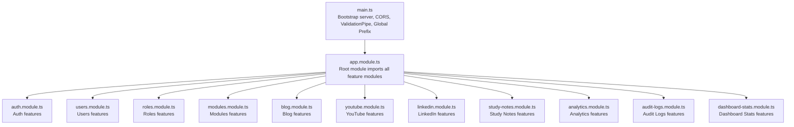
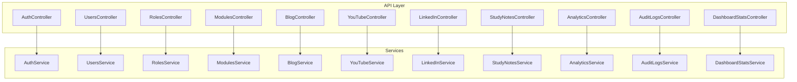
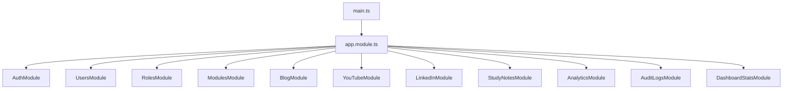

# API Reference

<cite>
**Referenced Files in This Document**
- [main.ts](file://backend/src/main.ts)
- [app.module.ts](file://backend/src/app.module.ts)
- [auth.controller.ts](file://backend/src/auth/auth.controller.ts)
- [auth.dto.ts](file://backend/src/auth/dto/auth.dto.ts)
- [users.controller.ts](file://backend/src/users/users.controller.ts)
- [create-user.dto.ts](file://backend/src/users/dto/create-user.dto.ts)
- [roles.controller.ts](file://backend/src/roles/roles.controller.ts)
- [create-role.dto.ts](file://backend/src/roles/dto/create-role.dto.ts)
- [modules.controller.ts](file://backend/src/modules/modules.controller.ts)
- [create-module.dto.ts](file://backend/src/modules/dto/create-module.dto.ts)
- [blog.controller.ts](file://backend/src/blog/blog.controller.ts)
- [blog-post.dto.ts](file://backend/src/blog/dto/blog-post.dto.ts)
- [youtube.controller.ts](file://backend/src/youtube/youtube.controller.ts)
- [youtube-post.dto.ts](file://backend/src/youtube/dto/youtube-post.dto.ts)
- [analytics.controller.ts](file://backend/src/analytics/analytics.controller.ts)
- [analytics.dto.ts](file://backend/src/analytics/dto/analytics.dto.ts)
- [audit-logs.controller.ts](file://backend/src/audit-logs/audit-logs.controller.ts)
- [create-audit-log.dto.ts](file://backend/src/audit-logs/dto/create-audit-log.dto.ts)
- [dashboard-stats.controller.ts](file://backend/src/dashboard-stats/dashboard-stats.controller.ts)
- [update-stats.dto.ts](file://backend/src/dashboard-stats/dto/update-stats.dto.ts)
- [linkedin.controller.ts](file://backend/src/linkedin/linkedin.controller.ts)
- [linkedin-post.dto.ts](file://backend/src/linkedin/dto/linkedin-post.dto.ts)
- [study-notes.controller.ts](file://backend/src/study-notes/study-notes.controller.ts)
- [study-note.dto.ts](file://backend/src/study-notes/dto/study-note.dto.ts)
</cite>

## Table of Contents
1. [Introduction](#introduction)
2. [Project Structure](#project-structure)
3. [Core Components](#core-components)
4. [Architecture Overview](#architecture-overview)
5. [Detailed Component Analysis](#detailed-component-analysis)
6. [Dependency Analysis](#dependency-analysis)
7. [Performance Considerations](#performance-considerations)
8. [Troubleshooting Guide](#troubleshooting-guide)
9. [Conclusion](#conclusion)
10. [Appendices](#appendices)

## Introduction
This document provides comprehensive API documentation for the Multi-Application-Control-Dashboard RESTful backend. It covers authentication, user management, role management, module management, and content management systems (blog, YouTube, LinkedIn, study notes). It also documents analytics and audit logging APIs, dashboard statistics endpoints, and internal service communications. The API follows a global prefix of api, supports JWT-based authentication, and enforces strict request validation via a global ValidationPipe.

## Project Structure
The backend is organized around NestJS modules. The global prefix for all routes is api. CORS is enabled for development with broad allowances. A global ValidationPipe enforces DTO validation and transformation.

**Diagram sources**
- [main.ts](file://backend/src/main.ts#L1-L54)
- [app.module.ts](file://backend/src/app.module.ts#L1-L41)

**Section sources**
- [main.ts](file://backend/src/main.ts#L1-L54)
- [app.module.ts](file://backend/src/app.module.ts#L1-L41)

## Core Components
- Global prefix: api
- CORS: Enabled for localhost origins and accepts non-origin requests during development
- Validation: Global ValidationPipe with whitelist and forbidNonWhitelisted enabled
- Authentication: JWT-based; routes guarded by JwtAuthGuard except local auth flows
- Authorization: Role-based access controlled via guards and role assignments

**Section sources**
- [main.ts](file://backend/src/main.ts#L8-L43)
- [auth.controller.ts](file://backend/src/auth/auth.controller.ts#L15-L57)

## Architecture Overview
The API is structured around feature modules. Controllers expose endpoints under the api prefix. DTOs define request/response schemas and validation rules. Guards enforce authentication and authorization. Services encapsulate business logic.

**Diagram sources**
- [auth.controller.ts](file://backend/src/auth/auth.controller.ts#L15-L57)
- [users.controller.ts](file://backend/src/users/users.controller.ts#L7-L51)
- [roles.controller.ts](file://backend/src/roles/roles.controller.ts#L6-L45)
- [modules.controller.ts](file://backend/src/modules/modules.controller.ts#L6-L57)
- [blog.controller.ts](file://backend/src/blog/blog.controller.ts#L7-L61)
- [youtube.controller.ts](file://backend/src/youtube/youtube.controller.ts#L6-L50)
- [linkedin.controller.ts](file://backend/src/linkedin/linkedin.controller.ts#L1-L50)
- [study-notes.controller.ts](file://backend/src/study-notes/study-notes.controller.ts#L1-L50)
- [analytics.controller.ts](file://backend/src/analytics/analytics.controller.ts#L1-L50)
- [audit-logs.controller.ts](file://backend/src/audit-logs/audit-logs.controller.ts#L1-L50)
- [dashboard-stats.controller.ts](file://backend/src/dashboard-stats/dashboard-stats.controller.ts#L1-L50)

## Detailed Component Analysis

### Authentication API
Endpoints for registration, login, profile retrieval, token refresh, logout, and self-profile access.

- Base Path: api/auth
- Authentication: Not required for register and login; protected for others
- Authorization: None (login uses local strategy; JWT required for protected endpoints)

Endpoints:
- POST /api/auth/register
  - Description: Registers a new user
  - Auth: No
  - Request Body: RegisterDto
  - Response: AuthResponseDto
  - Validation Rules:
    - email: Required, valid email
    - password: Required, min length 6
    - firstName: Required, string
    - lastName: Required, string
    - role: Optional enum RoleType
  - Example Request:
    - POST /api/auth/register
    - Headers: Content-Type: application/json
    - Body: {"email":"user@example.com","password":"passw0rd","firstName":"John","lastName":"Doe","role":"viewer"}
  - Example Response:
    - 201 Created
    - Body: {"accessToken":"<jwt>","refreshToken":"<refresh>","user":{"id":"<id>","email":"user@example.com","firstName":"John","lastName":"Doe","role":"viewer","assignedModules":[],"isActive":true}}

- POST /api/auth/login
  - Description: Authenticates user and returns tokens
  - Auth: No
  - Request Body: LoginDto
  - Response: AuthResponseDto
  - Validation Rules:
    - email: Required, valid email
    - password: Required, string
  - Example Request:
    - POST /api/auth/login
    - Headers: Content-Type: application/json
    - Body: {"email":"user@example.com","password":"passw0rd"}
  - Example Response:
    - 200 OK
    - Body: {"accessToken":"<jwt>","refreshToken":"<refresh>","user":{"id":"<id>","email":"user@example.com","firstName":"John","lastName":"Doe","role":"viewer","assignedModules":[],"isActive":true}}

- GET /api/auth/me
  - Description: Retrieves current user details
  - Auth: Yes (JWT)
  - Response: User object with role and assigned modules
  - Example Response:
    - 200 OK
    - Body: {"id":"<id>","email":"user@example.com","firstName":"John","lastName":"Doe","role":"viewer","assignedModules":[],"isActive":true}

- POST /api/auth/refresh
  - Description: Refreshes access token using refresh token
  - Auth: No
  - Request Body: RefreshTokenDto
  - Response: Tokens
  - Validation Rules:
    - refreshToken: Required, string
  - Example Request:
    - POST /api/auth/refresh
    - Headers: Content-Type: application/json
    - Body: {"refreshToken":"<refresh>"}
  - Example Response:
    - 200 OK
    - Body: {"accessToken":"<jwt>","refreshToken":"<refresh>"}

- POST /api/auth/logout
  - Description: Logs out current user
  - Auth: Yes (JWT)
  - Response: Success message
  - Example Response:
    - 200 OK
    - Body: {"message":"Logged out successfully"}

- GET /api/auth/profile
  - Description: Returns current user payload from request
  - Auth: Yes (JWT)
  - Response: User payload
  - Example Response:
    - 200 OK
    - Body: {"sub":"<id>","email":"user@example.com",...}

Validation Rules Summary:
- RegisterDto: email (required), password (min 6), firstName (required), lastName (required), role (optional enum)
- LoginDto: email (required), password (required)
- RefreshTokenDto: refreshToken (required)

**Section sources**
- [auth.controller.ts](file://backend/src/auth/auth.controller.ts#L15-L57)
- [auth.dto.ts](file://backend/src/auth/dto/auth.dto.ts#L4-L58)

### User Management API
Endpoints for creating, listing, searching, retrieving, updating, deleting users, and assigning roles and modules.

- Base Path: api/users
- Authentication: Yes (JWT)
- Authorization: Depends on role (super-admin/admin typically)

Endpoints:
- POST /api/users
  - Description: Creates a new user
  - Auth: Yes
  - Request Body: CreateUserDto
  - Response: User object
  - Validation Rules:
    - email: Required, valid email
    - firstName: Required, min length 3
    - lastName: Required, min length 3
    - password: Required, min length 6
    - role: Required enum ["super-admin","admin","viewer"]
    - username: Required, min length 3
  - Example Request:
    - POST /api/users
    - Headers: Content-Type: application/json
    - Body: {"email":"user@example.com","firstName":"John","lastName":"Doe","password":"passw0rd","role":"viewer","username":"johnd"}
  - Example Response:
    - 201 Created
    - Body: {"id":"<id>","email":"user@example.com","firstName":"John","lastName":"Doe","role":"viewer","username":"johnd","isActive":true,"assignedModules":[]}

- GET /api/users
  - Description: Lists all users
  - Auth: Yes
  - Response: Array of users
  - Example Response:
    - 200 OK
    - Body: [{"id":"<id>","email":"user@example.com","firstName":"John","lastName":"Doe","role":"viewer","username":"johnd","isActive":true,"assignedModules":[]}]

- GET /api/users/search?q=term
  - Description: Searches users by query term
  - Auth: Yes
  - Query Params:
    - q: Required, string
  - Response: Array of users
  - Example Response:
    - 200 OK
    - Body: [{"id":"<id>","email":"user@example.com","firstName":"John","lastName":"Doe","role":"viewer","username":"johnd","isActive":true,"assignedModules":[]}]

- GET /api/users/:id
  - Description: Retrieves a user by ID
  - Auth: Yes
  - Path Params:
    - id: Required, string
  - Response: User object
  - Example Response:
    - 200 OK
    - Body: {"id":"<id>","email":"user@example.com","firstName":"John","lastName":"Doe","role":"viewer","username":"johnd","isActive":true,"assignedModules":[]}

- PUT /api/users/:id
  - Description: Updates a user by ID
  - Auth: Yes
  - Path Params:
    - id: Required, string
  - Request Body: UpdateUserDto
  - Response: User object
  - Validation Rules:
    - firstName: Optional, string
    - lastName: Optional, string
    - status: Optional enum ["active","inactive","suspended"]
    - assignedModules: Optional array of strings
  - Example Request:
    - PUT /api/users/<id>
    - Headers: Content-Type: application/json
    - Body: {"firstName":"Johnny","status":"active","assignedModules":["<module-id>"]}
  - Example Response:
    - 200 OK
    - Body: {"id":"<id>","email":"user@example.com","firstName":"Johnny","lastName":"Doe","role":"viewer","username":"johnd","isActive":true,"assignedModules":["<module-id>"]}

- DELETE /api/users/:id
  - Description: Deletes a user by ID
  - Auth: Yes
  - Path Params:
    - id: Required, string
  - Response: Deletion result
  - Example Response:
    - 200 OK
    - Body: {"message":"User deleted"}

- POST /api/users/:id/role
  - Description: Assigns a role to a user
  - Auth: Yes
  - Path Params:
    - id: Required, string
  - Request Body:
    - role: Required enum RoleType
  - Response: User object
  - Example Response:
    - 200 OK
    - Body: {"id":"<id>","email":"user@example.com","firstName":"Johnny","lastName":"Doe","role":"admin","username":"johnd","isActive":true,"assignedModules":["<module-id>"]}

- POST /api/users/:id/modules
  - Description: Assigns modules to a user
  - Auth: Yes
  - Path Params:
    - id: Required, string
  - Request Body:
    - moduleIds: Required array of strings
  - Response: User object
  - Example Response:
    - 200 OK
    - Body: {"id":"<id>","email":"user@example.com","firstName":"Johnny","lastName":"Doe","role":"admin","username":"johnd","isActive":true,"assignedModules":["<module-id>","<module-id2>"]}

Validation Rules Summary:
- CreateUserDto: email (required), firstName (min 3), lastName (min 3), password (min 6), role (required enum), username (min 3)
- UpdateUserDto: firstName (optional), lastName (optional), status (optional enum), assignedModules (optional array of strings)

**Section sources**
- [users.controller.ts](file://backend/src/users/users.controller.ts#L7-L51)
- [create-user.dto.ts](file://backend/src/users/dto/create-user.dto.ts#L3-L56)

### Role Management API
Endpoints for creating, listing, retrieving, updating, deleting roles, and assigning permissions and modules.

- Base Path: api/roles
- Authentication: Yes (JWT)
- Authorization: Depends on role

Endpoints:
- POST /api/roles
  - Description: Creates a new role
  - Auth: Yes
  - Request Body: CreateRoleDto
  - Response: Role object
  - Validation Rules:
    - name: Required, min length 3
    - description: Optional, string
    - permissions: Optional array of strings
    - modules: Optional array of strings
  - Example Request:
    - POST /api/roles
    - Headers: Content-Type: application/json
    - Body: {"name":"Editor","description":"Can edit content","permissions":["<perm-id>"],"modules":["<module-id>"]}
  - Example Response:
    - 201 Created
    - Body: {"id":"<id>","name":"Editor","description":"Can edit content","permissions":["<perm-id>"],"modules":["<module-id>"]}

- GET /api/roles
  - Description: Lists all roles
  - Auth: Yes
  - Response: Array of roles
  - Example Response:
    - 200 OK
    - Body: [{"id":"<id>","name":"Viewer","description":"Can view content","permissions":[],"modules":[]},{"id":"<id2>","name":"Editor","description":"Can edit content","permissions":["<perm-id>"],"modules":["<module-id>"]}]

- GET /api/roles/:id
  - Description: Retrieves a role by ID
  - Auth: Yes
  - Path Params:
    - id: Required, string
  - Response: Role object
  - Example Response:
    - 200 OK
    - Body: {"id":"<id>","name":"Editor","description":"Can edit content","permissions":["<perm-id>"],"modules":["<module-id>"]}

- PUT /api/roles/:id
  - Description: Updates a role by ID
  - Auth: Yes
  - Path Params:
    - id: Required, string
  - Request Body: UpdateRoleDto
  - Response: Role object
  - Validation Rules:
    - name: Optional, string
    - description: Optional, string
  - Example Response:
    - 200 OK
    - Body: {"id":"<id>","name":"Editor","description":"Updated description","permissions":["<perm-id>"],"modules":["<module-id>"]}

- DELETE /api/roles/:id
  - Description: Deletes a role by ID
  - Auth: Yes
  - Path Params:
    - id: Required, string
  - Response: Deletion result
  - Example Response:
    - 200 OK
    - Body: {"message":"Role deleted"}

- POST /api/roles/:id/permissions
  - Description: Assigns permissions to a role
  - Auth: Yes
  - Path Params:
    - id: Required, string
  - Request Body:
    - permissions: Required array of strings
  - Response: Role object
  - Example Response:
    - 200 OK
    - Body: {"id":"<id>","name":"Editor","description":"Updated description","permissions":["<perm-id>","<perm-id2>"],"modules":["<module-id>"]}

- POST /api/roles/:id/modules
  - Description: Assigns modules to a role
  - Auth: Yes
  - Path Params:
    - id: Required, string
  - Request Body:
    - modules: Required array of strings
  - Response: Role object
  - Example Response:
    - 200 OK
    - Body: {"id":"<id>","name":"Editor","description":"Updated description","permissions":["<perm-id>","<perm-id2>"],"modules":["<module-id>","<module-id2>"]}

Validation Rules Summary:
- CreateRoleDto: name (min 3), description (optional), permissions (optional array), modules (optional array)
- UpdateRoleDto: name (optional), description (optional)

**Section sources**
- [roles.controller.ts](file://backend/src/roles/roles.controller.ts#L6-L45)
- [create-role.dto.ts](file://backend/src/roles/dto/create-role.dto.ts#L3-L24)

### Module Management API
Endpoints for creating, listing, retrieving, updating, deleting modules, toggling enable/disable, fetching stats, checking access, and listing enabled modules.

- Base Path: api/modules
- Authentication: Yes (JWT)
- Authorization: Depends on role

Endpoints:
- POST /api/modules
  - Description: Creates a new module
  - Auth: Yes
  - Request Body: CreateModuleDto
  - Response: Module object
  - Validation Rules:
    - name: Required, min length 3
    - description: Optional, string
    - icon: Optional, string
    - enabled: Optional, boolean
    - route: Optional, string
  - Example Request:
    - POST /api/modules
    - Headers: Content-Type: application/json
    - Body: {"name":"Blog","description":"Blog module","icon":"<icon>","enabled":true,"route":"/blog"}
  - Example Response:
    - 201 Created
    - Body: {"id":"<id>","name":"Blog","description":"Blog module","icon":"<icon>","enabled":true,"route":"/blog"}

- GET /api/modules
  - Description: Lists all modules
  - Auth: Yes
  - Response: Array of modules
  - Example Response:
    - 200 OK
    - Body: [{"id":"<id>","name":"Blog","description":"Blog module","icon":"<icon>","enabled":true,"route":"/blog"}]

- GET /api/modules/enabled
  - Description: Lists enabled modules
  - Auth: Yes
  - Response: Array of modules
  - Example Response:
    - 200 OK
    - Body: [{"id":"<id>","name":"Blog","description":"Blog module","icon":"<icon>","enabled":true,"route":"/blog"}]

- GET /api/modules/stats
  - Description: Returns module usage statistics
  - Auth: Yes
  - Response: Stats object
  - Example Response:
    - 200 OK
    - Body: {"total":1,"enabled":1,"disabled":0}

- GET /api/modules/access?userId=<id>&module=<name>
  - Description: Checks if a user has access to a specific module
  - Auth: Yes
  - Query Params:
    - userId: Required, string
    - module: Required, string
  - Response: Access result
  - Example Response:
    - 200 OK
    - Body: {"hasAccess":true}

- GET /api/modules/:id
  - Description: Retrieves a module by ID
  - Auth: Yes
  - Path Params:
    - id: Required, string
  - Response: Module object
  - Example Response:
    - 200 OK
    - Body: {"id":"<id>","name":"Blog","description":"Blog module","icon":"<icon>","enabled":true,"route":"/blog"}

- PUT /api/modules/:id
  - Description: Updates a module by ID
  - Auth: Yes
  - Path Params:
    - id: Required, string
  - Request Body: UpdateModuleDto
  - Response: Module object
  - Validation Rules:
    - name: Optional, string
    - description: Optional, string
  - Example Response:
    - 200 OK
    - Body: {"id":"<id>","name":"Blog Updated","description":"Updated description","icon":"<icon>","enabled":true,"route":"/blog"}

- DELETE /api/modules/:id
  - Description: Deletes a module by ID
  - Auth: Yes
  - Path Params:
    - id: Required, string
  - Response: Deletion result
  - Example Response:
    - 200 OK
    - Body: {"message":"Module deleted"}

- POST /api/modules/:id/toggle
  - Description: Toggles module enabled/disabled
  - Auth: Yes
  - Path Params:
    - id: Required, string
  - Request Body:
    - enabled: Required, boolean
  - Response: Module object
  - Example Response:
    - 200 OK
    - Body: {"id":"<id>","name":"Blog Updated","description":"Updated description","icon":"<icon>","enabled":false,"route":"/blog"}

Validation Rules Summary:
- CreateModuleDto: name (min 3), description (optional), icon (optional), enabled (optional), route (optional)
- UpdateModuleDto: name (optional), description (optional)

**Section sources**
- [modules.controller.ts](file://backend/src/modules/modules.controller.ts#L6-L57)
- [create-module.dto.ts](file://backend/src/modules/dto/create-module.dto.ts#L3-L28)

### Blog Content Management API
Endpoints for creating, listing, searching, retrieving, updating, deleting blog posts, and publishing/unpublishing.

- Base Path: api/blog
- Authentication: Yes (JWT)
- Authorization: Depends on role

Endpoints:
- POST /api/blog
  - Description: Creates a new blog post (author set from JWT subject)
  - Auth: Yes
  - Request Body: CreateBlogPostDto
  - Response: Blog post object
  - Validation Rules:
    - title: Required, string
    - content: Required, string
    - excerpt: Optional, string
    - author: Required, string (from request context)
    - tags: Optional, array of strings
    - featuredImage: Optional, string
  - Example Request:
    - POST /api/blog
    - Headers: Content-Type: application/json
    - Body: {"title":"My Post","content":"Post content","excerpt":"Brief summary","tags":["tech","nestjs"],"featuredImage":"<url>"}
  - Example Response:
    - 201 Created
    - Body: {"id":"<id>","title":"My Post","content":"Post content","excerpt":"Brief summary","author":"<user-id>","tags":["tech","nestjs"],"featuredImage":"<url>","status":"draft"}

- GET /api/blog
  - Description: Lists blog posts (optional filter by status)
  - Auth: Yes
  - Query Params:
    - status: Optional enum BlogPostStatus
  - Response: Array of posts
  - Example Response:
    - 200 OK
    - Body: [{"id":"<id>","title":"My Post","content":"Post content","status":"draft"}]

- GET /api/blog/search?q=term
  - Description: Searches blog posts by query term
  - Auth: Yes
  - Query Params:
    - q: Required, string
  - Response: Array of posts
  - Example Response:
    - 200 OK
    - Body: [{"id":"<id>","title":"My Post","content":"Post content","status":"draft"}]

- GET /api/blog/stats
  - Description: Returns blog statistics
  - Auth: Yes
  - Response: Stats object
  - Example Response:
    - 200 OK
    - Body: {"total":1,"published":0,"draft":1}

- GET /api/blog/author/:authorId
  - Description: Lists blog posts by author ID
  - Auth: Yes
  - Path Params:
    - authorId: Required, string
  - Response: Array of posts
  - Example Response:
    - 200 OK
    - Body: [{"id":"<id>","title":"My Post","content":"Post content","status":"draft"}]

- GET /api/blog/:id
  - Description: Retrieves a blog post by ID
  - Auth: Yes
  - Path Params:
    - id: Required, string
  - Response: Blog post object
  - Example Response:
    - 200 OK
    - Body: {"id":"<id>","title":"My Post","content":"Post content","status":"draft"}

- PUT /api/blog/:id
  - Description: Updates a blog post by ID
  - Auth: Yes
  - Path Params:
    - id: Required, string
  - Request Body: UpdateBlogPostDto
  - Response: Blog post object
  - Validation Rules:
    - title: Optional, string
    - content: Optional, string
    - excerpt: Optional, string
    - tags: Optional, array of strings
    - featuredImage: Optional, string
    - status: Optional enum BlogPostStatus
  - Example Response:
    - 200 OK
    - Body: {"id":"<id>","title":"Updated Post","content":"Updated content","status":"draft"}

- DELETE /api/blog/:id
  - Description: Deletes a blog post by ID
  - Auth: Yes
  - Path Params:
    - id: Required, string
  - Response: Deletion result
  - Example Response:
    - 200 OK
    - Body: {"message":"Post deleted"}

- POST /api/blog/:id/publish
  - Description: Publishes a blog post
  - Auth: Yes
  - Path Params:
    - id: Required, string
  - Response: Blog post object
  - Example Response:
    - 200 OK
    - Body: {"id":"<id>","title":"Updated Post","content":"Updated content","status":"published"}

- POST /api/blog/:id/unpublish
  - Description: Unpublishes a blog post
  - Auth: Yes
  - Path Params:
    - id: Required, string
  - Response: Blog post object
  - Example Response:
    - 200 OK
    - Body: {"id":"<id>","title":"Updated Post","content":"Updated content","status":"draft"}

Validation Rules Summary:
- CreateBlogPostDto: title (required), content (required), excerpt (optional), author (required), tags (optional), featuredImage (optional)
- UpdateBlogPostDto: title (optional), content (optional), excerpt (optional), tags (optional), featuredImage (optional), status (optional enum)

**Section sources**
- [blog.controller.ts](file://backend/src/blog/blog.controller.ts#L7-L61)
- [blog-post.dto.ts](file://backend/src/blog/dto/blog-post.dto.ts#L4-L51)

### YouTube Content Management API
Endpoints for creating, listing, retrieving, updating, deleting YouTube posts, and publishing.

- Base Path: api/youtube
- Authentication: Yes (JWT)
- Authorization: Depends on role

Endpoints:
- POST /api/youtube
  - Description: Creates a new YouTube post (author set from JWT subject)
  - Auth: Yes
  - Request Body: CreateYouTubePostDto
  - Response: YouTube post object
  - Validation Rules:
    - title: Required, string
    - description: Required, string
    - videoId: Required, string
    - author: Required, string (from request context)
    - thumbnailUrl: Optional, string
  - Example Request:
    - POST /api/youtube
    - Headers: Content-Type: application/json
    - Body: {"title":"My Video","description":"Video description","videoId":"<yt-id>","thumbnailUrl":"<url>"}
  - Example Response:
    - 201 Created
    - Body: {"id":"<id>","title":"My Video","description":"Video description","videoId":"<yt-id>","author":"<user-id>","thumbnailUrl":"<url>","status":"draft"}

- GET /api/youtube
  - Description: Lists YouTube posts (optional filter by status)
  - Auth: Yes
  - Query Params:
    - status: Optional, string
  - Response: Array of posts
  - Example Response:
    - 200 OK
    - Body: [{"id":"<id>","title":"My Video","description":"Video description","status":"draft"}]

- GET /api/youtube/stats
  - Description: Returns YouTube statistics
  - Auth: Yes
  - Response: Stats object
  - Example Response:
    - 200 OK
    - Body: {"total":1,"published":0,"draft":1}

- GET /api/youtube/author/:authorId
  - Description: Lists YouTube posts by author ID
  - Auth: Yes
  - Path Params:
    - authorId: Required, string
  - Response: Array of posts
  - Example Response:
    - 200 OK
    - Body: [{"id":"<id>","title":"My Video","description":"Video description","status":"draft"}]

- GET /api/youtube/:id
  - Description: Retrieves a YouTube post by ID
  - Auth: Yes
  - Path Params:
    - id: Required, string
  - Response: YouTube post object
  - Example Response:
    - 200 OK
    - Body: {"id":"<id>","title":"My Video","description":"Video description","status":"draft"}

- PUT /api/youtube/:id
  - Description: Updates a YouTube post by ID
  - Auth: Yes
  - Path Params:
    - id: Required, string
  - Request Body: UpdateYouTubePostDto
  - Response: YouTube post object
  - Validation Rules:
    - title: Optional, string
    - description: Optional, string
    - thumbnailUrl: Optional, string
    - status: Optional, string
  - Example Response:
    - 200 OK
    - Body: {"id":"<id>","title":"Updated Video","description":"Updated description","status":"draft"}

- DELETE /api/youtube/:id
  - Description: Deletes a YouTube post by ID
  - Auth: Yes
  - Path Params:
    - id: Required, string
  - Response: Deletion result
  - Example Response:
    - 200 OK
    - Body: {"message":"Post deleted"}

- POST /api/youtube/:id/publish
  - Description: Publishes a YouTube post
  - Auth: Yes
  - Path Params:
    - id: Required, string
  - Response: YouTube post object
  - Example Response:
    - 200 OK
    - Body: {"id":"<id>","title":"Updated Video","description":"Updated description","status":"published"}

Validation Rules Summary:
- CreateYouTubePostDto: title (required), description (required), videoId (required), author (required), thumbnailUrl (optional)
- UpdateYouTubePostDto: title (optional), description (optional), thumbnailUrl (optional), status (optional)

**Section sources**
- [youtube.controller.ts](file://backend/src/youtube/youtube.controller.ts#L6-L50)
- [youtube-post.dto.ts](file://backend/src/youtube/dto/youtube-post.dto.ts#L3-L37)

### LinkedIn Content Management API
Endpoints for creating, listing, retrieving, updating, deleting LinkedIn posts.

- Base Path: api/linkedin
- Authentication: Yes (JWT)
- Authorization: Depends on role

Endpoints:
- POST /api/linkedin
  - Description: Creates a new LinkedIn post (author set from JWT subject)
  - Auth: Yes
  - Request Body: CreateLinkedInPostDto
  - Response: LinkedIn post object
  - Validation Rules:
    - text: Required, string
    - author: Required, string (from request context)
    - imageUrl: Optional, string
  - Example Request:
    - POST /api/linkedin
    - Headers: Content-Type: application/json
    - Body: {"text":"Check out this post","imageUrl":"<url>"}
  - Example Response:
    - 201 Created
    - Body: {"id":"<id>","text":"Check out this post","author":"<user-id>","imageUrl":"<url>","timestamp":"2023-01-01T00:00:00Z"}

- GET /api/linkedin
  - Description: Lists LinkedIn posts
  - Auth: Yes
  - Response: Array of posts
  - Example Response:
    - 200 OK
    - Body: [{"id":"<id>","text":"Check out this post","timestamp":"2023-01-01T00:00:00Z"}]

- GET /api/linkedin/author/:authorId
  - Description: Lists LinkedIn posts by author ID
  - Auth: Yes
  - Path Params:
    - authorId: Required, string
  - Response: Array of posts
  - Example Response:
    - 200 OK
    - Body: [{"id":"<id>","text":"Check out this post","timestamp":"2023-01-01T00:00:00Z"}]

- GET /api/linkedin/:id
  - Description: Retrieves a LinkedIn post by ID
  - Auth: Yes
  - Path Params:
    - id: Required, string
  - Response: LinkedIn post object
  - Example Response:
    - 200 OK
    - Body: {"id":"<id>","text":"Check out this post","timestamp":"2023-01-01T00:00:00Z"}

- PUT /api/linkedin/:id
  - Description: Updates a LinkedIn post by ID
  - Auth: Yes
  - Path Params:
    - id: Required, string
  - Request Body: UpdateLinkedInPostDto
  - Response: LinkedIn post object
  - Validation Rules:
    - text: Optional, string
    - imageUrl: Optional, string
  - Example Response:
    - 200 OK
    - Body: {"id":"<id>","text":"Updated post","timestamp":"2023-01-01T00:00:00Z"}

- DELETE /api/linkedin/:id
  - Description: Deletes a LinkedIn post by ID
  - Auth: Yes
  - Path Params:
    - id: Required, string
  - Response: Deletion result
  - Example Response:
    - 200 OK
    - Body: {"message":"Post deleted"}

Validation Rules Summary:
- CreateLinkedInPostDto: text (required), author (required), imageUrl (optional)
- UpdateLinkedInPostDto: text (optional), imageUrl (optional)

**Section sources**
- [linkedin.controller.ts](file://backend/src/linkedin/linkedin.controller.ts#L1-L50)
- [linkedin-post.dto.ts](file://backend/src/linkedin/dto/linkedin-post.dto.ts#L1-L50)

### Study Notes Management API
Endpoints for creating, listing, retrieving, updating, deleting study notes.

- Base Path: api/study-notes
- Authentication: Yes (JWT)
- Authorization: Depends on role

Endpoints:
- POST /api/study-notes
  - Description: Creates a new study note (author set from JWT subject)
  - Auth: Yes
  - Request Body: CreateStudyNoteDto
  - Response: Study note object
  - Validation Rules:
    - title: Required, string
    - content: Required, string
    - author: Required, string (from request context)
    - subject: Optional, string
  - Example Request:
    - POST /api/study-notes
    - Headers: Content-Type: application/json
    - Body: {"title":"Important Topic","content":"Detailed notes","subject":"Computer Science"}
  - Example Response:
    - 201 Created
    - Body: {"id":"<id>","title":"Important Topic","content":"Detailed notes","author":"<user-id>","subject":"Computer Science"}

- GET /api/study-notes
  - Description: Lists study notes
  - Auth: Yes
  - Response: Array of notes
  - Example Response:
    - 200 OK
    - Body: [{"id":"<id>","title":"Important Topic","subject":"Computer Science"}]

- GET /api/study-notes/author/:authorId
  - Description: Lists study notes by author ID
  - Auth: Yes
  - Path Params:
    - authorId: Required, string
  - Response: Array of notes
  - Example Response:
    - 200 OK
    - Body: [{"id":"<id>","title":"Important Topic","subject":"Computer Science"}]

- GET /api/study-notes/:id
  - Description: Retrieves a study note by ID
  - Auth: Yes
  - Path Params:
    - id: Required, string
  - Response: Study note object
  - Example Response:
    - 200 OK
    - Body: {"id":"<id>","title":"Important Topic","content":"Detailed notes","subject":"Computer Science"}

- PUT /api/study-notes/:id
  - Description: Updates a study note by ID
  - Auth: Yes
  - Path Params:
    - id: Required, string
  - Request Body: UpdateStudyNoteDto
  - Response: Study note object
  - Validation Rules:
    - title: Optional, string
    - content: Optional, string
    - subject: Optional, string
  - Example Response:
    - 200 OK
    - Body: {"id":"<id>","title":"Updated Topic","content":"Updated notes","subject":"Computer Science"}

- DELETE /api/study-notes/:id
  - Description: Deletes a study note by ID
  - Auth: Yes
  - Path Params:
    - id: Required, string
  - Response: Deletion result
  - Example Response:
    - 200 OK
    - Body: {"message":"Note deleted"}

Validation Rules Summary:
- CreateStudyNoteDto: title (required), content (required), author (required), subject (optional)
- UpdateStudyNoteDto: title (optional), content (optional), subject (optional)

**Section sources**
- [study-notes.controller.ts](file://backend/src/study-notes/study-notes.controller.ts#L1-L50)
- [study-note.dto.ts](file://backend/src/study-notes/dto/study-note.dto.ts#L1-L50)

### Analytics API
Endpoints for analytics data collection and retrieval.

- Base Path: api/analytics
- Authentication: Yes (JWT)
- Authorization: Depends on role

Endpoints:
- POST /api/analytics
  - Description: Records analytics event
  - Auth: Yes
  - Request Body: AnalyticsDto
  - Response: Analytics record
  - Validation Rules:
    - eventType: Required, string
    - metadata: Optional, object
    - timestamp: Optional, ISO date string
  - Example Request:
    - POST /api/analytics
    - Headers: Content-Type: application/json
    - Body: {"eventType":"page_view","metadata":{"path":"/dashboard"},"timestamp":"2023-01-01T00:00:00Z"}
  - Example Response:
    - 201 Created
    - Body: {"id":"<id>","eventType":"page_view","metadata":{"path":"/dashboard"},"timestamp":"2023-01-01T00:00:00Z"}

- GET /api/analytics
  - Description: Lists analytics records
  - Auth: Yes
  - Response: Array of records
  - Example Response:
    - 200 OK
    - Body: [{"id":"<id>","eventType":"page_view","timestamp":"2023-01-01T00:00:00Z"}]

- GET /api/analytics/stats
  - Description: Returns analytics statistics
  - Auth: Yes
  - Response: Stats object
  - Example Response:
    - 200 OK
    - Body: {"totalEvents":1,"eventTypes":{"page_view":1}}

Validation Rules Summary:
- AnalyticsDto: eventType (required), metadata (optional), timestamp (optional)

**Section sources**
- [analytics.controller.ts](file://backend/src/analytics/analytics.controller.ts#L1-L50)
- [analytics.dto.ts](file://backend/src/analytics/dto/analytics.dto.ts#L1-L50)

### Audit Logs API
Endpoints for creating and retrieving audit logs.

- Base Path: api/audit-logs
- Authentication: Yes (JWT)
- Authorization: Depends on role

Endpoints:
- POST /api/audit-logs
  - Description: Creates a new audit log entry
  - Auth: Yes
  - Request Body: CreateAuditLogDto
  - Response: Audit log object
  - Validation Rules:
    - action: Required, string
    - performedBy: Required, string (from request context)
    - resourceId: Optional, string
    - details: Optional, object
  - Example Request:
    - POST /api/audit-logs
    - Headers: Content-Type: application/json
    - Body: {"action":"user_created","resourceId":"<user-id>","details":{"fields":["email"]}}
  - Example Response:
    - 201 Created
    - Body: {"id":"<id>","action":"user_created","performedBy":"<user-id>","resourceId":"<user-id>","details":{"fields":["email"]},"timestamp":"2023-01-01T00:00:00Z"}

- GET /api/audit-logs
  - Description: Lists audit logs
  - Auth: Yes
  - Response: Array of logs
  - Example Response:
    - 200 OK
    - Body: [{"id":"<id>","action":"user_created","timestamp":"2023-01-01T00:00:00Z"}]

Validation Rules Summary:
- CreateAuditLogDto: action (required), performedBy (required), resourceId (optional), details (optional)

**Section sources**
- [audit-logs.controller.ts](file://backend/src/audit-logs/audit-logs.controller.ts#L1-L50)
- [create-audit-log.dto.ts](file://backend/src/audit-logs/dto/create-audit-log.dto.ts#L1-L50)

### Dashboard Statistics API
Endpoints for retrieving dashboard statistics.

- Base Path: api/dashboard-stats
- Authentication: Yes (JWT)
- Authorization: Depends on role

Endpoints:
- GET /api/dashboard-stats
  - Description: Returns dashboard statistics
  - Auth: Yes
  - Response: Stats object
  - Example Response:
    - 200 OK
    - Body: {"totalUsers":10,"totalPosts":5,"totalModules":3}

- POST /api/dashboard-stats
  - Description: Updates dashboard statistics
  - Auth: Yes
  - Request Body: UpdateStatsDto
  - Response: Stats object
  - Validation Rules:
    - metrics: Required, object
  - Example Request:
    - POST /api/dashboard-stats
    - Headers: Content-Type: application/json
    - Body: {"metrics":{"totalUsers":11,"totalPosts":6}}
  - Example Response:
    - 200 OK
    - Body: {"totalUsers":11,"totalPosts":6,"totalModules":3}

Validation Rules Summary:
- UpdateStatsDto: metrics (required object)

**Section sources**
- [dashboard-stats.controller.ts](file://backend/src/dashboard-stats/dashboard-stats.controller.ts#L1-L50)
- [update-stats.dto.ts](file://backend/src/dashboard-stats/dto/update-stats.dto.ts#L1-L50)

## Dependency Analysis
The API relies on NestJS modules and services. Controllers depend on services for business logic. DTOs define request/response contracts and validation rules enforced globally.

**Diagram sources**
- [main.ts](file://backend/src/main.ts#L1-L54)
- [app.module.ts](file://backend/src/app.module.ts#L17-L36)

**Section sources**
- [main.ts](file://backend/src/main.ts#L1-L54)
- [app.module.ts](file://backend/src/app.module.ts#L1-L41)

## Performance Considerations
- Global ValidationPipe reduces boilerplate and ensures consistent validation across endpoints.
- JWT-based authentication is efficient; ensure token storage and refresh strategies are implemented client-side to minimize round trips.
- Use pagination for listing endpoints when data sets grow large.
- Index MongoDB collections on frequently queried fields (e.g., email, authorId, status).

## Troubleshooting Guide
Common issues and resolutions:
- Validation errors: Ensure request bodies match DTO validation rules. The global ValidationPipe will reject non-whitelisted fields and invalid types.
- Authentication failures: Verify JWT presence and correctness for protected endpoints. Confirm refresh tokens are valid for refresh endpoint.
- CORS errors: During development, requests without origin are accepted; production should configure allowed origins explicitly.
- Rate limiting: Not configured in the current setup. Consider integrating a rate-limiting solution (e.g., NestJS rate limiters) behind API Gateway or middleware.

**Section sources**
- [main.ts](file://backend/src/main.ts#L33-L40)

## Conclusion
The Multi-Application-Control-Dashboard API provides a comprehensive set of endpoints for authentication, user and role management, module administration, and content management across blog, YouTube, LinkedIn, and study notes. It leverages NestJS modules, DTO validation, and JWT authentication to deliver a secure and maintainable backend. Extend the API with rate limiting, monitoring, and caching as your application scales.

## Appendices

### API Versioning
- Current version: 1.0
- Versioning strategy: URL-based (api/v1), configurable via global prefix. To introduce v2, set a new global prefix (e.g., api/v2) and migrate endpoints accordingly.

**Section sources**
- [main.ts](file://backend/src/main.ts#L42-L43)

### Rate Limiting Policies
- Not implemented in the current backend.
- Recommended approach: Integrate a rate-limiting middleware or library behind an API gateway to throttle requests per IP or per user.

### Integration Guidelines
- Authentication:
  - Use POST /api/auth/login to obtain tokens.
  - Include Authorization: Bearer <access_token> for protected endpoints.
- Frontend integration:
  - Store tokens securely (HttpOnly cookies recommended for web apps).
  - Refresh tokens via POST /api/auth/refresh before access tokens expire.
- Error handling:
  - Expect 400 for validation errors, 401 for unauthorized, 403 for forbidden, 404 for not found, 500 for server errors.
- CORS:
  - Allowed origins include localhost and 127.0.0.1 variants; adjust for production domains.