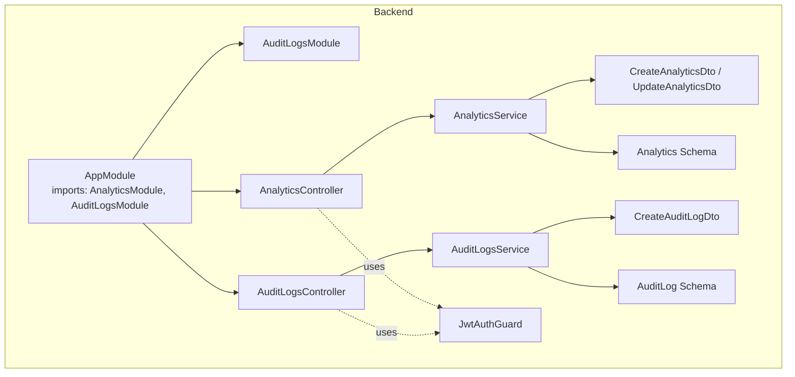
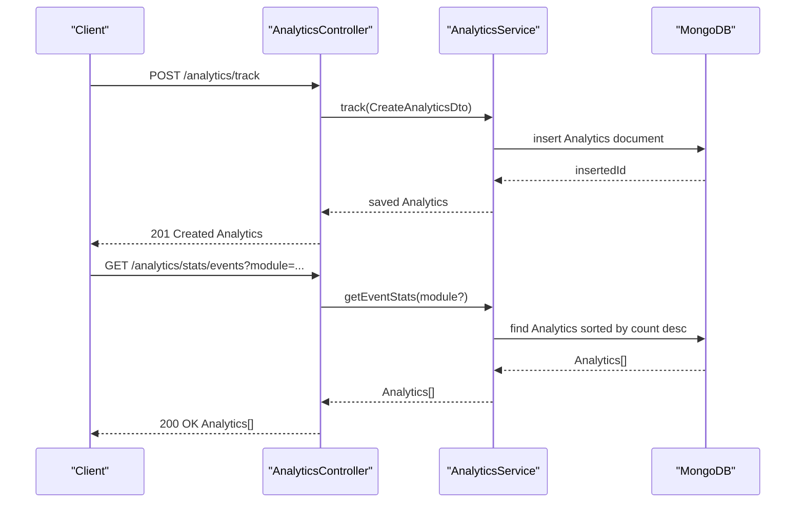
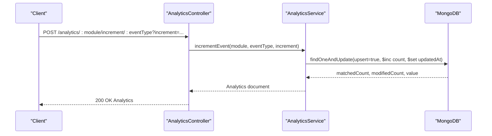
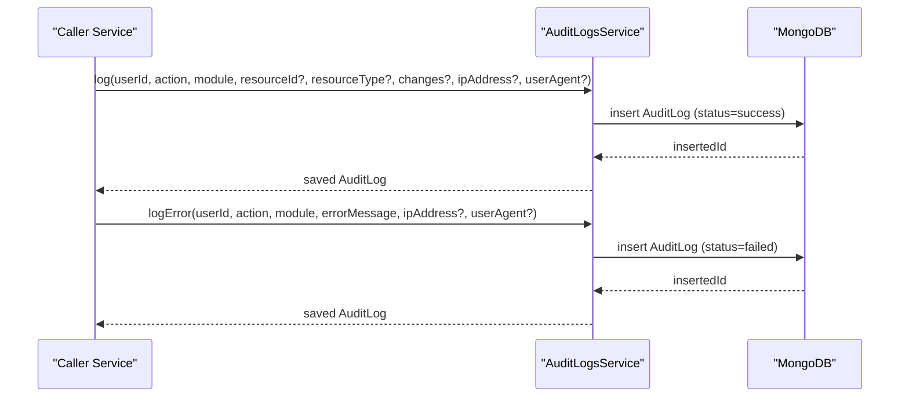
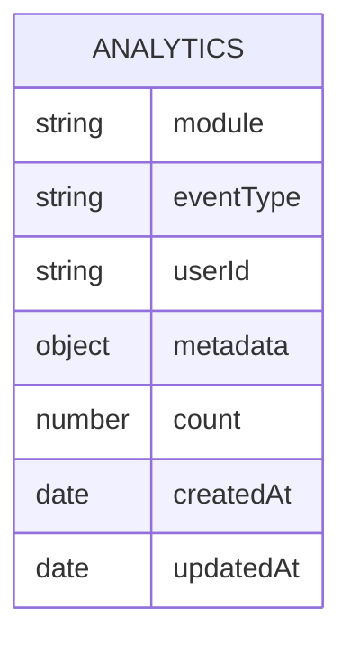
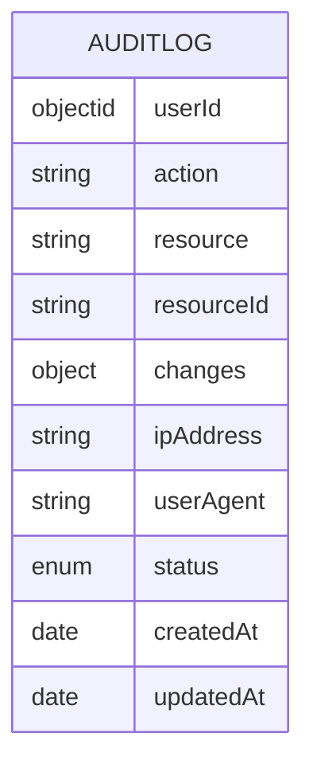
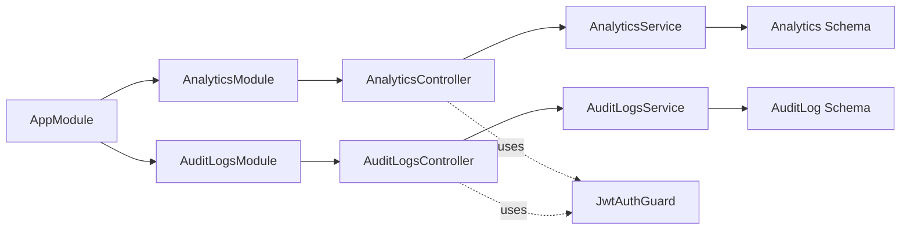

# Analytics & Audit APIs

<cite>
**Referenced Files in This Document**
- [analytics.controller.ts](file://backend/src/analytics/analytics.controller.ts)
- [analytics.service.ts](file://backend/src/analytics/analytics.service.ts)
- [analytics.dto.ts](file://backend/src/analytics/dto/analytics.dto.ts)
- [analytics.schema.ts](file://backend/src/analytics/schemas/analytics.schema.ts)
- [analytics.module.ts](file://backend/src/analytics/analytics.module.ts)
- [audit-logs.controller.ts](file://backend/src/audit-logs/audit-logs.controller.ts)
- [audit-logs.service.ts](file://backend/src/audit-logs/audit-logs.service.ts)
- [create-audit-log.dto.ts](file://backend/src/audit-logs/dto/create-audit-log.dto.ts)
- [audit-log.schema.ts](file://backend/src/audit-logs/schemas/audit-log.schema.ts)
- [audit-logs.module.ts](file://backend/src/audit-logs/audit-logs.module.ts)
- [auth.guard.ts](file://backend/src/auth/guards/auth.guard.ts)
- [app.module.ts](file://backend/src/app.module.ts)
</cite>

## Table of Contents
1. [Introduction](#introduction)
2. [Project Structure](#project-structure)
3. [Core Components](#core-components)
4. [Architecture Overview](#architecture-overview)
5. [Detailed Component Analysis](#detailed-component-analysis)
6. [Dependency Analysis](#dependency-analysis)
7. [Performance Considerations](#performance-considerations)
8. [Troubleshooting Guide](#troubleshooting-guide)
9. [Conclusion](#conclusion)
10. [Appendices](#appendices)

## Introduction
This document provides comprehensive API documentation for Analytics and Audit Logging endpoints. It covers:
- Analytics data collection, reporting, and aggregation endpoints for system usage metrics, user activity tracking, and performance analytics.
- Audit log creation, retrieval, and management endpoints with detailed event tracking and user activity monitoring.
- HTTP methods, URL patterns, request/response schemas, and filtering options for analytics queries.
- Examples of analytics data structures, audit log formats, and reporting workflows.
- Data retention policies, privacy considerations, and compliance requirements.
- Real-time analytics streaming, batch processing, and integration with external analytics platforms.

## Project Structure
The Analytics and Audit Logging features are implemented as separate NestJS modules with dedicated controllers, services, DTOs, and Mongoose schemas. Both modules rely on JWT authentication via a shared guard.

**Diagram sources**
- [app.module.ts](file://backend/src/app.module.ts#L17-L36)
- [auth.guard.ts](file://backend/src/auth/guards/auth.guard.ts#L6-L11)
- [analytics.controller.ts](file://backend/src/analytics/analytics.controller.ts#L18-L109)
- [analytics.service.ts](file://backend/src/analytics/analytics.service.ts#L8-L77)
- [analytics.dto.ts](file://backend/src/analytics/dto/analytics.dto.ts#L3-L35)
- [analytics.schema.ts](file://backend/src/analytics/schemas/analytics.schema.ts#L6-L28)
- [analytics.module.ts](file://backend/src/analytics/analytics.module.ts#L7-L13)
- [audit-logs.controller.ts](file://backend/src/audit-logs/audit-logs.controller.ts#L5-L39)
- [audit-logs.service.ts](file://backend/src/audit-logs/audit-logs.service.ts#L7-L66)
- [create-audit-log.dto.ts](file://backend/src/audit-logs/dto/create-audit-log.dto.ts#L3-L32)
- [audit-log.schema.ts](file://backend/src/audit-logs/schemas/audit-log.schema.ts#L6-L31)
- [audit-logs.module.ts](file://backend/src/audit-logs/audit-logs.module.ts#L7-L13)

**Section sources**
- [app.module.ts](file://backend/src/app.module.ts#L17-L36)
- [auth.guard.ts](file://backend/src/auth/guards/auth.guard.ts#L6-L11)
- [analytics.controller.ts](file://backend/src/analytics/analytics.controller.ts#L18-L109)
- [audit-logs.controller.ts](file://backend/src/audit-logs/audit-logs.controller.ts#L5-L39)

## Core Components
- AnalyticsModule: Provides analytics endpoints and service for tracking events, aggregating stats, and filtering by date range, module, and user.
- AuditLogsModule: Provides audit logging endpoints and service for recording user actions, resource changes, and status (success/failure), with filtering and statistics.

Security:
- All analytics and audit endpoints are protected by JwtAuthGuard, requiring a valid JWT bearer token.

**Section sources**
- [analytics.module.ts](file://backend/src/analytics/analytics.module.ts#L7-L13)
- [audit-logs.module.ts](file://backend/src/audit-logs/audit-logs.module.ts#L7-L13)
- [auth.guard.ts](file://backend/src/auth/guards/auth.guard.ts#L6-L11)

## Architecture Overview
The Analytics and Audit Logging modules follow a layered architecture:
- Controllers expose HTTP endpoints and delegate to services.
- Services encapsulate business logic and interact with Mongoose models.
- Schemas define MongoDB collections and timestamps.
- DTOs validate incoming requests.

**Diagram sources**
- [analytics.controller.ts](file://backend/src/analytics/analytics.controller.ts#L22-L62)
- [analytics.service.ts](file://backend/src/analytics/analytics.service.ts#L11-L57)

## Detailed Component Analysis

### Analytics Endpoints

#### Authentication
- All endpoints require a valid JWT bearer token.

**Section sources**
- [analytics.controller.ts](file://backend/src/analytics/analytics.controller.ts#L28-L94)
- [auth.guard.ts](file://backend/src/auth/guards/auth.guard.ts#L6-L11)

#### Endpoint Catalog

- Track Event
  - Method: POST
  - Path: /analytics/track
  - Authenticated: Yes
  - Request body: CreateAnalyticsDto
  - Response: Analytics document
  - Notes: Creates a single analytics event record.

- List All Events
  - Method: GET
  - Path: /analytics
  - Authenticated: Yes
  - Query params: None
  - Response: Array of Analytics documents (sorted by createdAt descending)

- Filter by Module
  - Method: GET
  - Path: /analytics/module/:module
  - Authenticated: Yes
  - Path params: module (string)
  - Response: Array of Analytics documents

- Filter by Event Type
  - Method: GET
  - Path: /analytics/event/:eventType
  - Authenticated: Yes
  - Path params: eventType (string)
  - Response: Array of Analytics documents

- Filter by User ID
  - Method: GET
  - Path: /analytics/user/:userId
  - Authenticated: Yes
  - Path params: userId (string)
  - Response: Array of Analytics documents

- Module Analytics Summary
  - Method: GET
  - Path: /analytics/stats/module/:module
  - Authenticated: Yes
  - Path params: module (string)
  - Response: Aggregated array grouped by eventType with totalCount and lastEvent

- Event Statistics
  - Method: GET
  - Path: /analytics/stats/events
  - Authenticated: Yes
  - Query params: module (optional)
  - Response: Array of Analytics documents sorted by count descending

- Analytics by Date Range
  - Method: GET
  - Path: /analytics/range
  - Authenticated: Yes
  - Query params: startDate (required), endDate (required), module (optional)
  - Response: Array of Analytics documents filtered by date range

- Retrieve Single Event
  - Method: GET
  - Path: /analytics/:id
  - Authenticated: Yes
  - Path params: id (ObjectId)
  - Response: Analytics document

- Update Event
  - Method: PUT
  - Path: /analytics/:id
  - Authenticated: Yes
  - Path params: id (ObjectId)
  - Request body: UpdateAnalyticsDto
  - Response: Updated Analytics document

- Delete Event
  - Method: DELETE
  - Path: /analytics/:id
  - Authenticated: Yes
  - Path params: id (ObjectId)
  - Response: Deletion result

- Increment Event Counter
  - Method: POST
  - Path: /analytics/:module/increment/:eventType
  - Authenticated: Yes
  - Path params: module (string), eventType (string)
  - Query params: increment (optional, default 1)
  - Response: Upserted/Updated Analytics document with incremented count

**Section sources**
- [analytics.controller.ts](file://backend/src/analytics/analytics.controller.ts#L22-L108)

#### Request/Response Schemas

- CreateAnalyticsDto
  - Fields:
    - module: string (required)
    - eventType: string (required)
    - userId: string (optional)
    - metadata: object (optional)
    - count: number (optional, default 1)

- UpdateAnalyticsDto
  - Fields:
    - eventType: string (optional)
    - metadata: object (optional)
    - count: number (optional)

- Analytics Document (from schema)
  - Fields:
    - module: string (required)
    - eventType: string (required)
    - userId: string (optional)
    - metadata: object (optional)
    - count: number (default 1)
    - createdAt: date (timestamps)
    - updatedAt: date (timestamps)

**Section sources**
- [analytics.dto.ts](file://backend/src/analytics/dto/analytics.dto.ts#L3-L35)
- [analytics.schema.ts](file://backend/src/analytics/schemas/analytics.schema.ts#L6-L28)

#### Filtering Options
- By module: /analytics/module/:module
- By event type: /analytics/event/:eventType
- By user ID: /analytics/user/:userId
- By date range: /analytics/range?startDate=&endDate=&module=
- Stats by module: /analytics/stats/module/:module
- Stats by event: /analytics/stats/events?module=

**Section sources**
- [analytics.controller.ts](file://backend/src/analytics/analytics.controller.ts#L34-L76)
- [analytics.service.ts](file://backend/src/analytics/analytics.service.ts#L54-L62)

#### Reporting Workflows
- Aggregate per eventType per module:
  - Use GET /analytics/stats/module/:module to group by eventType and sum counts.
- Top events by count:
  - Use GET /analytics/stats/events with optional module filter.
- Time-series filtering:
  - Use GET /analytics/range with startDate and endDate.

**Section sources**
- [analytics.controller.ts](file://backend/src/analytics/analytics.controller.ts#L52-L62)
- [analytics.service.ts](file://backend/src/analytics/analytics.service.ts#L64-L76)

#### Sequence: Increment Event Counter

**Diagram sources**
- [analytics.controller.ts](file://backend/src/analytics/analytics.controller.ts#L96-L108)
- [analytics.service.ts](file://backend/src/analytics/analytics.service.ts#L46-L52)

### Audit Logs Endpoints

#### Authentication
- All endpoints require a valid JWT bearer token.

**Section sources**
- [audit-logs.controller.ts](file://backend/src/audit-logs/audit-logs.controller.ts#L1-L39)
- [auth.guard.ts](file://backend/src/auth/guards/auth.guard.ts#L6-L11)

#### Endpoint Catalog

- List All Audit Logs
  - Method: GET
  - Path: /audit-logs
  - Authenticated: Yes
  - Response: Array of AuditLog documents (limited to 1000, sorted by createdAt descending)

- Audit Log Statistics
  - Method: GET
  - Path: /audit-logs/stats
  - Authenticated: Yes
  - Response: { total, success, failed }

- Filter by User ID
  - Method: GET
  - Path: /audit-logs/user/:userId
  - Authenticated: Yes
  - Path params: userId (string)
  - Response: Array of AuditLog documents

- Filter by Module
  - Method: GET
  - Path: /audit-logs/module/:module
  - Authenticated: Yes
  - Path params: module (string)
  - Response: Array of AuditLog documents

- Filter by Action
  - Method: GET
  - Path: /audit-logs/action/:action
  - Authenticated: Yes
  - Path params: action (string)
  - Response: Array of AuditLog documents

- Activity by Date Range
  - Method: GET
  - Path: /audit-logs/range
  - Authenticated: Yes
  - Query params: startDate (required), endDate (required)
  - Response: Array of AuditLog documents filtered by date range

Note: Audit logs can be programmatically created via service methods that accept userId, action, module, and optional fields such as resourceId, resourceType, changes, ipAddress, userAgent.

**Section sources**
- [audit-logs.controller.ts](file://backend/src/audit-logs/audit-logs.controller.ts#L10-L39)
- [audit-logs.service.ts](file://backend/src/audit-logs/audit-logs.service.ts#L10-L66)

#### Request/Response Schemas

- CreateAuditLogDto
  - Fields:
    - userId: string (required)
    - action: string (required)
    - module: string (required)
    - resourceId: string (optional)
    - resourceType: string (optional)
    - changes: object (optional)
    - ipAddress: string (optional)
    - userAgent: string (optional)

- AuditLog Document (from schema)
  - Fields:
    - userId: ObjectId (required, references User)
    - action: string (required)
    - resource: string (required)
    - resourceId: string (optional)
    - changes: object (optional)
    - ipAddress: string (optional)
    - userAgent: string (optional)
    - status: enum ["success", "failure"] (default "success")
    - createdAt: date (timestamps)
    - updatedAt: date (timestamps)

**Section sources**
- [create-audit-log.dto.ts](file://backend/src/audit-logs/dto/create-audit-log.dto.ts#L3-L32)
- [audit-log.schema.ts](file://backend/src/audit-logs/schemas/audit-log.schema.ts#L6-L31)

#### Filtering Options
- By user: /audit-logs/user/:userId
- By module: /audit-logs/module/:module
- By action: /audit-logs/action/:action
- By date range: /audit-logs/range?startDate=&endDate=

**Section sources**
- [audit-logs.controller.ts](file://backend/src/audit-logs/audit-logs.controller.ts#L20-L38)
- [audit-logs.service.ts](file://backend/src/audit-logs/audit-logs.service.ts#L42-L65)

#### Reporting Workflows
- Daily/weekly/monthly activity trends:
  - Use date-range filtering to segment activity.
- User activity dashboards:
  - Combine user filters with action/module filters.
- Compliance reporting:
  - Use stats endpoint to compute success/failure ratios and export filtered logs.

**Section sources**
- [audit-logs.controller.ts](file://backend/src/audit-logs/audit-logs.controller.ts#L15-L18)
- [audit-logs.service.ts](file://backend/src/audit-logs/audit-logs.service.ts#L54-L59)

#### Sequence: Create Audit Log (Success/Failure)

**Diagram sources**
- [audit-logs.service.ts](file://backend/src/audit-logs/audit-logs.service.ts#L10-L36)

### Data Models

#### Analytics Model

**Diagram sources**
- [analytics.schema.ts](file://backend/src/analytics/schemas/analytics.schema.ts#L6-L28)

#### AuditLog Model

**Diagram sources**
- [audit-log.schema.ts](file://backend/src/audit-logs/schemas/audit-log.schema.ts#L6-L31)

## Dependency Analysis
- AppModule imports AnalyticsModule and AuditLogsModule.
- Controllers depend on their respective services.
- Services depend on Mongoose models initialized via MongooseModule.forFeature.
- JwtAuthGuard secures both controller layers.

**Diagram sources**
- [app.module.ts](file://backend/src/app.module.ts#L17-L36)
- [analytics.controller.ts](file://backend/src/analytics/analytics.controller.ts#L18-L109)
- [audit-logs.controller.ts](file://backend/src/audit-logs/audit-logs.controller.ts#L5-L39)
- [auth.guard.ts](file://backend/src/auth/guards/auth.guard.ts#L6-L11)

**Section sources**
- [app.module.ts](file://backend/src/app.module.ts#L17-L36)
- [analytics.module.ts](file://backend/src/analytics/analytics.module.ts#L7-L13)
- [audit-logs.module.ts](file://backend/src/audit-logs/audit-logs.module.ts#L7-L13)

## Performance Considerations
- Analytics
  - Sorting by createdAt descending and using indexed fields improves retrieval performance.
  - Aggregation pipeline for module analytics groups and sorts efficiently.
  - Consider adding compound indexes for frequent filters (module+eventType, module+createdAt).
- Audit Logs
  - Limit returned documents to prevent large payloads (as seen in findAll limiting to 1000).
  - Use date-range queries to constrain scans.
  - Indexes on userId, action, module, and createdAt are recommended for filtering and sorting.

[No sources needed since this section provides general guidance]

## Troubleshooting Guide
- Authentication failures
  - Symptom: 401 Unauthorized on analytics or audit endpoints.
  - Cause: Missing or invalid JWT token.
  - Resolution: Ensure Authorization header includes a valid JWT token.
- Validation errors
  - Symptom: 400 Bad Request on analytics track or audit log creation.
  - Cause: Missing required fields or incorrect types in DTOs.
  - Resolution: Verify CreateAnalyticsDto and CreateAuditLogDto fields match schema requirements.
- Rate limiting and pagination
  - Symptom: Missing older records in audit logs.
  - Cause: findAll limits to 1000 most recent entries.
  - Resolution: Use date-range filters or pagination via client-side cursoring.

**Section sources**
- [auth.guard.ts](file://backend/src/auth/guards/auth.guard.ts#L6-L11)
- [analytics.dto.ts](file://backend/src/analytics/dto/analytics.dto.ts#L3-L35)
- [create-audit-log.dto.ts](file://backend/src/audit-logs/dto/create-audit-log.dto.ts#L3-L32)
- [audit-logs.service.ts](file://backend/src/audit-logs/audit-logs.service.ts#L38-L40)

## Conclusion
The Analytics and Audit Logging modules provide robust, secure endpoints for collecting and querying usage metrics and user activity. They leverage JWT authentication, structured DTOs, and Mongoose schemas to ensure data integrity and scalability. Administrators can monitor system health, track user actions, and generate compliance reports using the provided filtering and aggregation capabilities.

[No sources needed since this section summarizes without analyzing specific files]

## Appendices

### Data Retention Policies
- Current implementation does not enforce explicit retention policies in controllers/services.
- Recommendation: Implement TTL indexes on createdAt or scheduled cleanup jobs to manage storage growth.

[No sources needed since this section provides general guidance]

### Privacy and Compliance
- Audit logs capture sensitive attributes such as IP address and user agent; ensure compliance with privacy regulations.
- Consider anonymizing or masking PII in logs and restricting access to audit endpoints.

[No sources needed since this section provides general guidance]

### Real-Time Streaming and Batch Processing
- Real-time streaming
  - Use server-sent events (SSE) or WebSocket to stream analytics updates to clients.
- Batch processing
  - Periodically aggregate analytics into summary collections for reporting.
- External integrations
  - Export analytics and audit logs to external platforms (e.g., analytics dashboards, SIEM) via scheduled jobs or webhooks.

[No sources needed since this section provides general guidance]