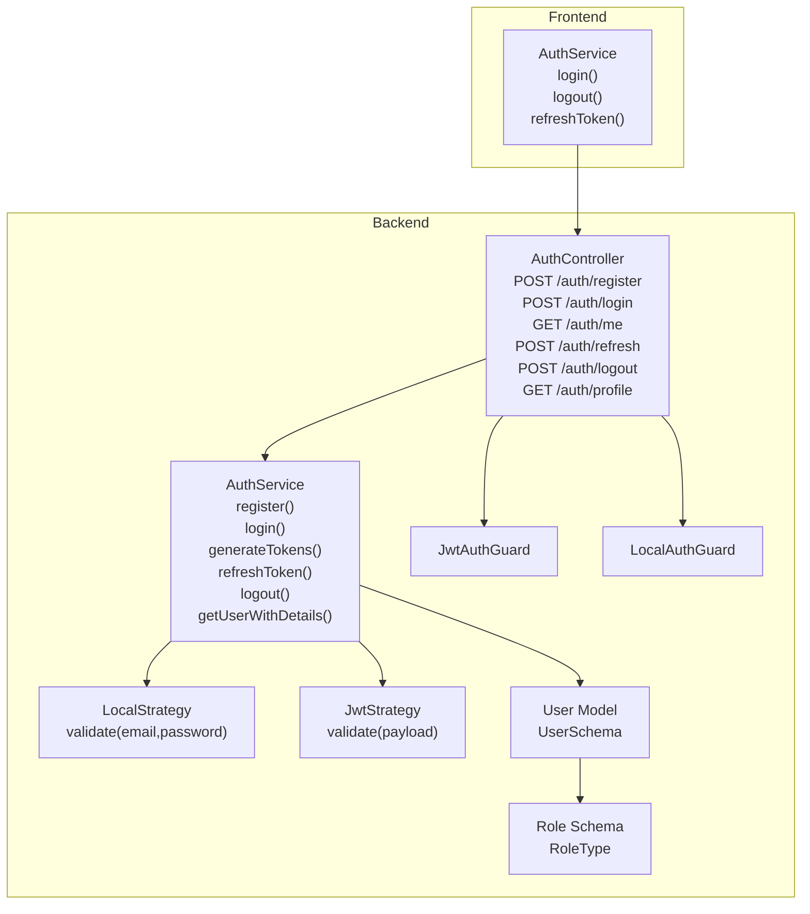
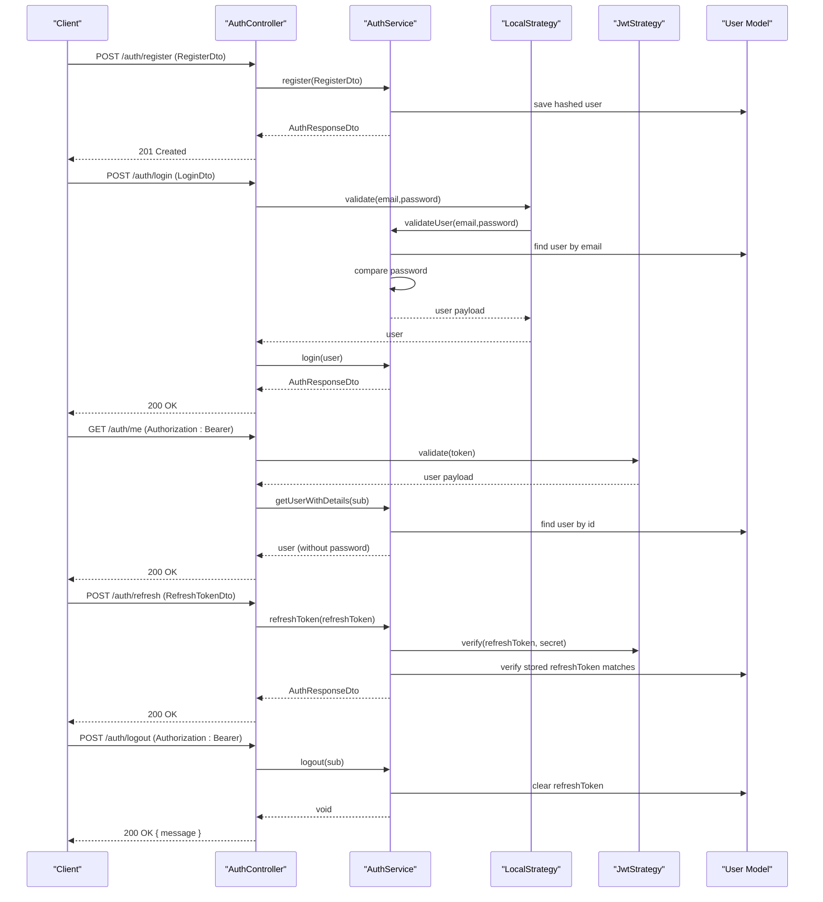
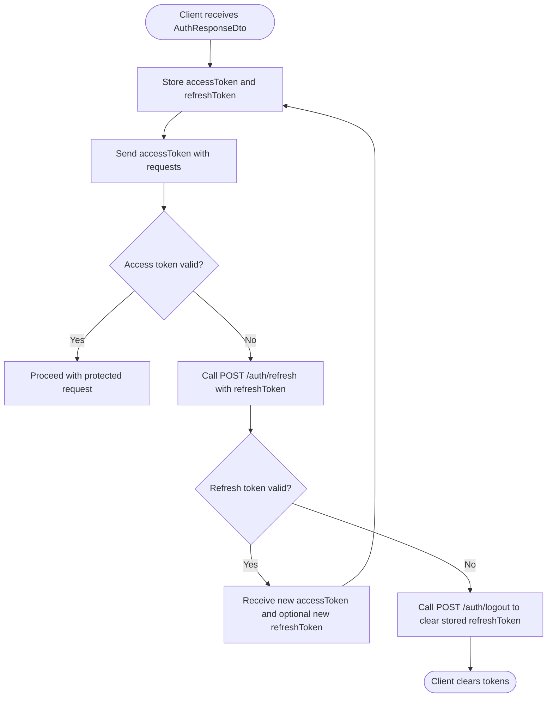
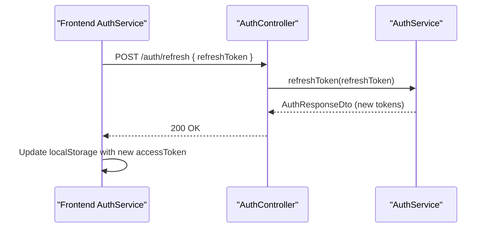
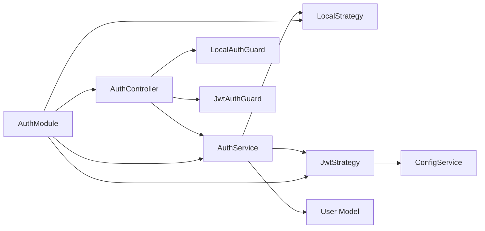

# Authentication API

<cite>
**Referenced Files in This Document**
- [auth.controller.ts](file://backend/src/auth/auth.controller.ts)
- [auth.service.ts](file://backend/src/auth/auth.service.ts)
- [auth.dto.ts](file://backend/src/auth/dto/auth.dto.ts)
- [jwt.strategy.ts](file://backend/src/auth/strategies/jwt.strategy.ts)
- [local.strategy.ts](file://backend/src/auth/strategies/local.strategy.ts)
- [auth.guard.ts](file://backend/src/auth/guards/auth.guard.ts)
- [jwt-auth.guard.ts](file://backend/src/auth/guards/jwt-auth.guard.ts)
- [local-auth.guard.ts](file://backend/src/auth/guards/local-auth.guard.ts)
- [auth.module.ts](file://backend/src/auth/auth.module.ts)
- [user.schema.ts](file://backend/src/users/schemas/user.schema.ts)
- [role.schema.ts](file://backend/src/roles/schemas/role.schema.ts)
- [.env.example](file://backend/.env.example)
- [auth.service.ts (frontend)](file://frontend/src/app/core/services/auth.service.ts)
- [settings.component.html (frontend)](file://frontend/src/app/features/settings/settings.component.html)
- [settings.store.ts (frontend)](file://frontend/src/app/core/store/settings.store.ts)
</cite>

## Table of Contents
1. [Introduction](#introduction)
2. [Project Structure](#project-structure)
3. [Core Components](#core-components)
4. [Architecture Overview](#architecture-overview)
5. [Detailed Component Analysis](#detailed-component-analysis)
6. [Dependency Analysis](#dependency-analysis)
7. [Performance Considerations](#performance-considerations)
8. [Troubleshooting Guide](#troubleshooting-guide)
9. [Conclusion](#conclusion)
10. [Appendices](#appendices)

## Introduction
This document provides comprehensive API documentation for the Authentication endpoints in the backend service. It covers all authentication-related endpoints: registration, login, logout, profile retrieval, and token refresh. It also documents JWT authentication flow, token expiration policies, refresh token mechanisms, and integration points for session management and multi-factor authentication. Security considerations, error handling, and practical examples are included to guide both developers and operators.

## Project Structure
The authentication system is implemented as a NestJS module with dedicated controller, service, DTOs, strategies, guards, and Mongoose models. The frontend integrates with the backend via an Angular service that manages tokens and user sessions.

**Diagram sources**
- [auth.controller.ts](file://backend/src/auth/auth.controller.ts#L15-L57)
- [auth.service.ts](file://backend/src/auth/auth.service.ts#L10-L124)
- [local.strategy.ts](file://backend/src/auth/strategies/local.strategy.ts#L6-L15)
- [jwt.strategy.ts](file://backend/src/auth/strategies/jwt.strategy.ts#L6-L24)
- [auth.guard.ts](file://backend/src/auth/guards/auth.guard.ts#L6-L25)
- [jwt-auth.guard.ts](file://backend/src/auth/guards/jwt-auth.guard.ts#L4-L9)
- [local-auth.guard.ts](file://backend/src/auth/guards/local-auth.guard.ts#L4-L5)
- [user.schema.ts](file://backend/src/users/schemas/user.schema.ts#L13-L49)
- [role.schema.ts](file://backend/src/roles/schemas/role.schema.ts#L4-L8)
- [auth.service.ts (frontend)](file://frontend/src/app/core/services/auth.service.ts#L103-L143)

**Section sources**
- [auth.controller.ts](file://backend/src/auth/auth.controller.ts#L15-L57)
- [auth.service.ts](file://backend/src/auth/auth.service.ts#L10-L124)
- [auth.module.ts](file://backend/src/auth/auth.module.ts#L12-L29)

## Core Components
- AuthController: Exposes authentication endpoints and delegates to AuthService.
- AuthService: Implements business logic for user validation, registration, token generation, refresh, logout, and user retrieval.
- Strategies: LocalStrategy validates credentials against the database; JwtStrategy extracts and verifies JWTs.
- Guards: JwtAuthGuard and LocalAuthGuard enforce authentication for protected routes.
- DTOs: Define request/response schemas for registration, login, refresh, and response payloads.
- Models: User schema stores user data and refresh tokens; RoleType defines roles.

**Section sources**
- [auth.controller.ts](file://backend/src/auth/auth.controller.ts#L15-L57)
- [auth.service.ts](file://backend/src/auth/auth.service.ts#L10-L124)
- [local.strategy.ts](file://backend/src/auth/strategies/local.strategy.ts#L6-L15)
- [jwt.strategy.ts](file://backend/src/auth/strategies/jwt.strategy.ts#L6-L24)
- [auth.guard.ts](file://backend/src/auth/guards/auth.guard.ts#L6-L25)
- [auth.dto.ts](file://backend/src/auth/dto/auth.dto.ts#L4-L57)
- [user.schema.ts](file://backend/src/users/schemas/user.schema.ts#L13-L49)
- [role.schema.ts](file://backend/src/roles/schemas/role.schema.ts#L4-L8)

## Architecture Overview
The authentication flow leverages Passport strategies and NestJS guards. LocalStrategy authenticates users via email/password; JwtStrategy validates access tokens. AuthService generates both access and refresh tokens, persists refresh tokens in the database, and handles refresh and logout.

**Diagram sources**
- [auth.controller.ts](file://backend/src/auth/auth.controller.ts#L19-L56)
- [auth.service.ts](file://backend/src/auth/auth.service.ts#L32-L123)
- [local.strategy.ts](file://backend/src/auth/strategies/local.strategy.ts#L12-L14)
- [jwt.strategy.ts](file://backend/src/auth/strategies/jwt.strategy.ts#L16-L23)
- [user.schema.ts](file://backend/src/users/schemas/user.schema.ts#L42-L43)

## Detailed Component Analysis

### Endpoints

#### POST /auth/register
- Description: Registers a new user with email, password, first name, last name, and optional role.
- Authentication: Not required.
- Request body: RegisterDto
  - email: string (valid email)
  - password: string (minimum length enforced)
  - firstName: string
  - lastName: string
  - role: enum RoleType (optional; defaults to VIEWER)
- Responses:
  - 201 Created: AuthResponseDto containing accessToken, refreshToken, and user profile.
  - 400 Bad Request: If user already exists.
- Notes: Password is hashed before storage. Role defaults to VIEWER if omitted.

**Section sources**
- [auth.controller.ts](file://backend/src/auth/auth.controller.ts#L19-L23)
- [auth.dto.ts](file://backend/src/auth/dto/auth.dto.ts#L4-L21)
- [auth.service.ts](file://backend/src/auth/auth.service.ts#L32-L49)
- [user.schema.ts](file://backend/src/users/schemas/user.schema.ts#L27-L28)

#### POST /auth/login
- Description: Authenticates a user with email and password.
- Authentication: Not required.
- Request body: LoginDto
  - email: string (valid email)
  - password: string
- Responses:
  - 200 OK: AuthResponseDto with tokens and user profile.
  - 401 Unauthorized: If credentials are invalid.
- Behavior: On successful login, the user’s lastLogin timestamp is updated.

**Section sources**
- [auth.controller.ts](file://backend/src/auth/auth.controller.ts#L25-L30)
- [auth.dto.ts](file://backend/src/auth/dto/auth.dto.ts#L23-L29)
- [auth.service.ts](file://backend/src/auth/auth.service.ts#L17-L30)
- [auth.service.ts](file://backend/src/auth/auth.service.ts#L51-L54)

#### GET /auth/me
- Description: Retrieves the authenticated user’s profile.
- Authentication: Required (JWT).
- Responses:
  - 200 OK: User object without sensitive fields.
  - 401 Unauthorized: If token is missing or invalid.
- Notes: Uses JwtAuthGuard and JwtStrategy.

**Section sources**
- [auth.controller.ts](file://backend/src/auth/auth.controller.ts#L32-L36)
- [jwt-auth.guard.ts](file://backend/src/auth/guards/jwt-auth.guard.ts#L4-L9)
- [jwt.strategy.ts](file://backend/src/auth/strategies/jwt.strategy.ts#L16-L23)
- [auth.service.ts](file://backend/src/auth/auth.service.ts#L117-L123)

#### POST /auth/refresh
- Description: Issues a new access token using a valid refresh token.
- Authentication: Not required.
- Request body: RefreshTokenDto
  - refreshToken: string
- Responses:
  - 200 OK: AuthResponseDto with new tokens.
  - 401 Unauthorized: If refresh token is invalid or expired.
- Notes: Validates refresh token signature and checks against stored token.

**Section sources**
- [auth.controller.ts](file://backend/src/auth/auth.controller.ts#L38-L42)
- [auth.dto.ts](file://backend/src/auth/dto/auth.dto.ts#L31-L34)
- [auth.service.ts](file://backend/src/auth/auth.service.ts#L96-L111)

#### POST /auth/logout
- Description: Logs out the current user by clearing the stored refresh token.
- Authentication: Required (JWT).
- Responses:
  - 200 OK: { message: "Logged out successfully" }
  - 401 Unauthorized: If token is invalid.
- Notes: Does not invalidate the access token; clients should discard it.

**Section sources**
- [auth.controller.ts](file://backend/src/auth/auth.controller.ts#L44-L50)
- [auth.service.ts](file://backend/src/auth/auth.service.ts#L113-L115)

#### GET /auth/profile
- Description: Returns the current user payload extracted from the JWT.
- Authentication: Required (JWT).
- Responses:
  - 200 OK: User payload (id, email, role, assignedModules).
  - 401 Unauthorized: If token is invalid.
- Notes: Intended for quick access to claims without DB lookup.

**Section sources**
- [auth.controller.ts](file://backend/src/auth/auth.controller.ts#L52-L56)
- [jwt-auth.guard.ts](file://backend/src/auth/guards/jwt-auth.guard.ts#L4-L9)
- [jwt.strategy.ts](file://backend/src/auth/strategies/jwt.strategy.ts#L16-L23)

### JWT Authentication Flow
- Access token:
  - Generated on registration and login.
  - Expires in 24 hours.
  - Used in Authorization header as Bearer token.
- Refresh token:
  - Generated alongside access token.
  - Stored in the user document.
  - Expires in 7 days; validated using a separate secret.
  - Used to obtain a new access token.

**Diagram sources**
- [auth.service.ts](file://backend/src/auth/auth.service.ts#L56-L94)
- [auth.service.ts](file://backend/src/auth/auth.service.ts#L96-L111)
- [auth.service.ts](file://backend/src/auth/auth.service.ts#L113-L115)
- [auth.controller.ts](file://backend/src/auth/auth.controller.ts#L38-L50)

**Section sources**
- [auth.service.ts](file://backend/src/auth/auth.service.ts#L56-L94)
- [auth.service.ts](file://backend/src/auth/auth.service.ts#L96-L111)
- [auth.service.ts](file://backend/src/auth/auth.service.ts#L113-L115)
- [jwt.strategy.ts](file://backend/src/auth/strategies/jwt.strategy.ts#L9-L13)
- [auth.module.ts](file://backend/src/auth/auth.module.ts#L15-L22)

### Token Expiration Policies
- Access token expiration: 24 hours.
- Refresh token expiration: 7 days.
- Secrets:
  - Access token signing secret: JWT_SECRET.
  - Refresh token signing secret: JWT_REFRESH_SECRET.

**Section sources**
- [auth.service.ts](file://backend/src/auth/auth.service.ts#L64-L71)
- [.env.example](file://backend/.env.example#L11-L13)

### Session Management and Frontend Integration
- Frontend stores:
  - accessToken in localStorage.
  - refreshToken in localStorage (when present).
  - currentUser profile in localStorage.
- Frontend behavior:
  - Checks for accessToken presence to determine authentication state.
  - Uses POST /auth/refresh to renew accessToken when needed.
  - Clears all tokens on logout.

**Diagram sources**
- [auth.service.ts (frontend)](file://frontend/src/app/core/services/auth.service.ts#L137-L143)
- [auth.controller.ts](file://backend/src/auth/auth.controller.ts#L38-L42)
- [auth.service.ts](file://backend/src/auth/auth.service.ts#L96-L111)

**Section sources**
- [auth.service.ts (frontend)](file://frontend/src/app/core/services/auth.service.ts#L103-L143)

### Multi-Factor Authentication Integration Points
- The frontend exposes a toggle for two-factor authentication in settings.
- The backend User model includes a role field and assignedModules; 2FA availability can be gated by role.
- Integration points:
  - Settings UI enables/disables 2FA.
  - Backend can restrict 2FA features to super_admin or admin roles.

**Section sources**
- [settings.component.html (frontend)](file://frontend/src/app/features/settings/settings.component.html#L48-L55)
- [settings.store.ts (frontend)](file://frontend/src/app/core/store/settings.store.ts#L71-L74)
- [user.schema.ts](file://backend/src/users/schemas/user.schema.ts#L27-L34)
- [role.schema.ts](file://backend/src/roles/schemas/role.schema.ts#L4-L8)

## Dependency Analysis
- AuthController depends on AuthService and guards.
- AuthService depends on JwtService, Mongoose UserModel, and bcrypt.
- Strategies depend on AuthService (LocalStrategy) and ConfigService (JwtStrategy).
- Guards wrap Passport strategies for route protection.
- User schema defines the persistence model for tokens and user attributes.

**Diagram sources**
- [auth.controller.ts](file://backend/src/auth/auth.controller.ts#L15-L57)
- [auth.service.ts](file://backend/src/auth/auth.service.ts#L10-L15)
- [local.strategy.ts](file://backend/src/auth/strategies/local.strategy.ts#L6-L15)
- [jwt.strategy.ts](file://backend/src/auth/strategies/jwt.strategy.ts#L6-L24)
- [auth.guard.ts](file://backend/src/auth/guards/auth.guard.ts#L6-L25)
- [auth.module.ts](file://backend/src/auth/auth.module.ts#L12-L29)

**Section sources**
- [auth.controller.ts](file://backend/src/auth/auth.controller.ts#L15-L57)
- [auth.service.ts](file://backend/src/auth/auth.service.ts#L10-L15)
- [auth.module.ts](file://backend/src/auth/auth.module.ts#L12-L29)

## Performance Considerations
- Token lifetimes: 24-hour access tokens minimize long-lived credentials; 7-day refresh tokens reduce re-auth frequency.
- Hashing: Password hashing uses bcrypt with a moderate cost; adjust as needed for environment.
- Database queries: Each refresh validates the stored refresh token; ensure indexing on email and user ID for optimal performance.
- Caching: Consider caching frequent profile reads if traffic demands; otherwise, rely on JwtAuthGuard for lightweight claim extraction.

[No sources needed since this section provides general guidance]

## Troubleshooting Guide
- 401 Unauthorized on login/register:
  - Verify credentials and ensure the user exists.
  - Confirm JWT secrets are configured correctly.
- 401 Unauthorized on /auth/me or /auth/profile:
  - Ensure Authorization header includes a valid Bearer token.
  - Check token expiration and renewal via /auth/refresh.
- 401 Unauthorized on /auth/refresh:
  - Refresh token may be expired or mismatched; call logout to clear stored token and re-authenticate.
- 400 Bad Request on /auth/register:
  - Email may already exist; resolve duplicates before retrying.
- Frontend token handling:
  - If tokens are missing, re-login; if refresh fails, logout and re-authenticate.

**Section sources**
- [auth.service.ts](file://backend/src/auth/auth.service.ts#L17-L30)
- [auth.service.ts](file://backend/src/auth/auth.service.ts#L96-L111)
- [auth.service.ts (frontend)](file://frontend/src/app/core/services/auth.service.ts#L137-L143)

## Conclusion
The authentication system provides secure, standards-based JWT authentication with robust token lifecycle management. Registration, login, refresh, and logout endpoints are clearly defined, with explicit error handling and frontend integration for seamless session management. Multi-factor authentication can be integrated at the UI and backend levels to enhance security.

[No sources needed since this section summarizes without analyzing specific files]

## Appendices

### Request/Response Schemas

- RegisterDto
  - email: string
  - password: string
  - firstName: string
  - lastName: string
  - role: RoleType (optional)

- LoginDto
  - email: string
  - password: string

- RefreshTokenDto
  - refreshToken: string

- AuthResponseDto
  - accessToken: string
  - refreshToken: string
  - user:
    - id: string
    - email: string
    - firstName: string
    - lastName: string
    - role: RoleType
    - assignedModules: string[]
    - isActive: boolean

**Section sources**
- [auth.dto.ts](file://backend/src/auth/dto/auth.dto.ts#L4-L57)
- [role.schema.ts](file://backend/src/roles/schemas/role.schema.ts#L4-L8)

### Environment Variables
- JWT_SECRET: Secret for signing access tokens.
- JWT_REFRESH_SECRET: Secret for signing refresh tokens.
- JWT_EXPIRATION: Access token expiration (used by JwtModule configuration).

**Section sources**
- [.env.example](file://backend/.env.example#L11-L13)
- [auth.module.ts](file://backend/src/auth/auth.module.ts#L15-L22)