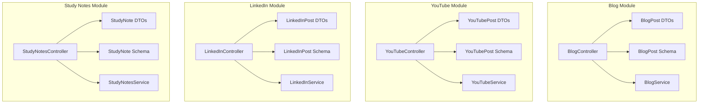
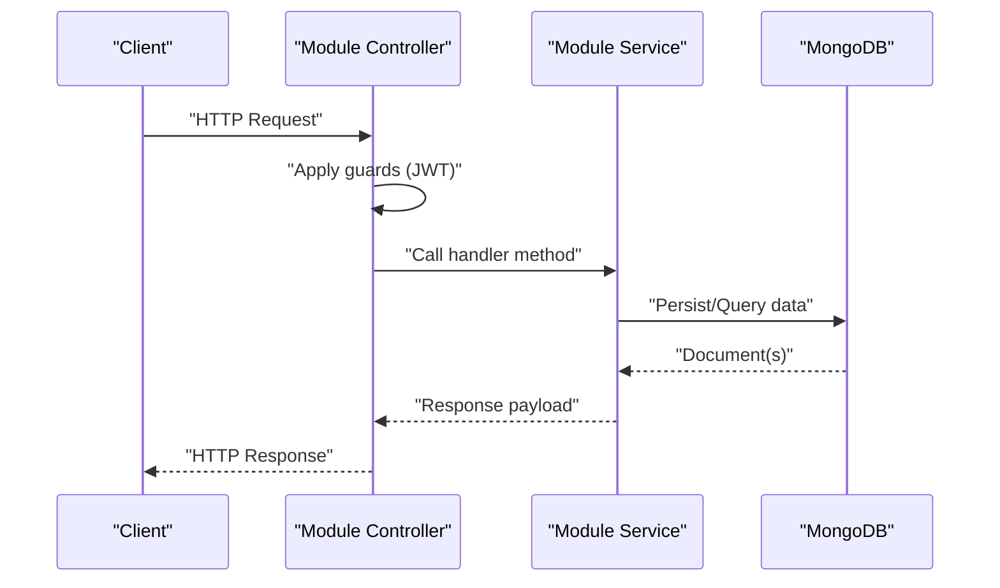
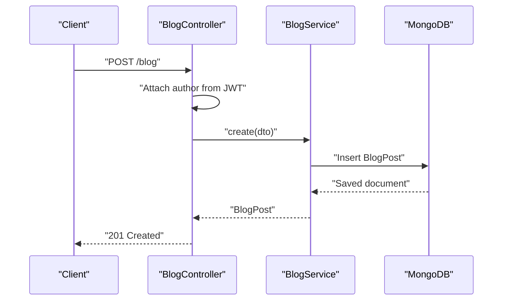
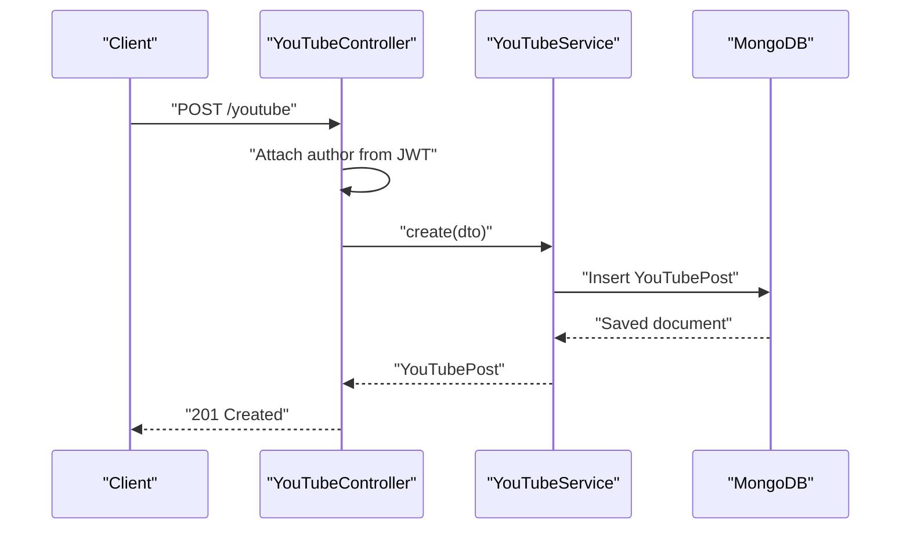
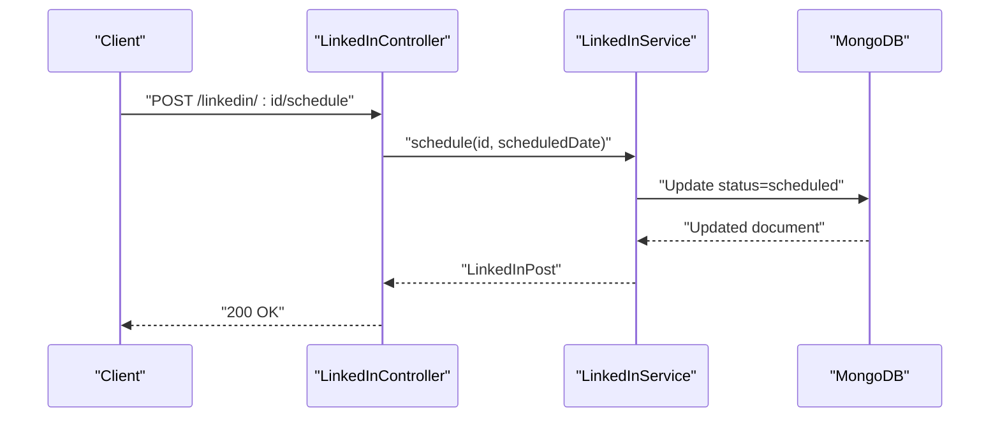
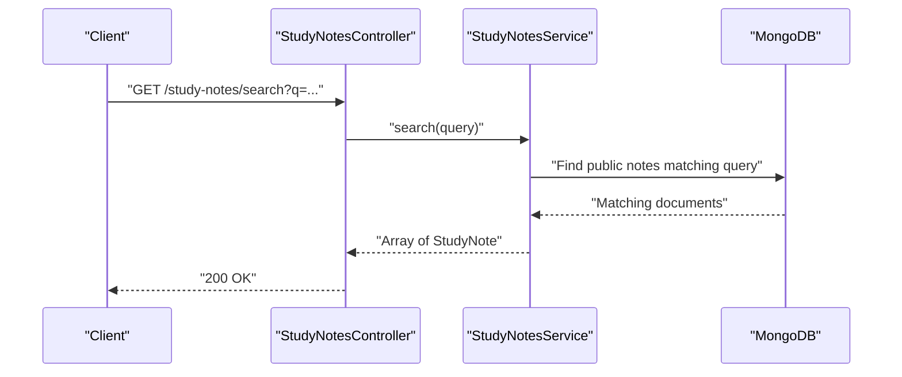
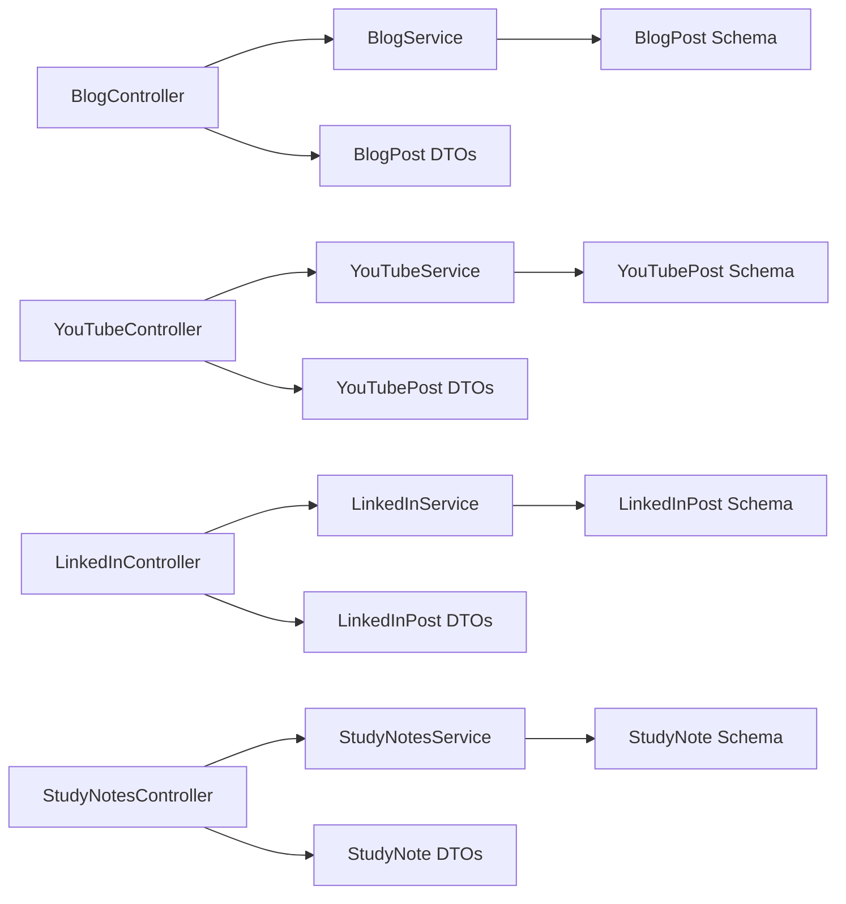
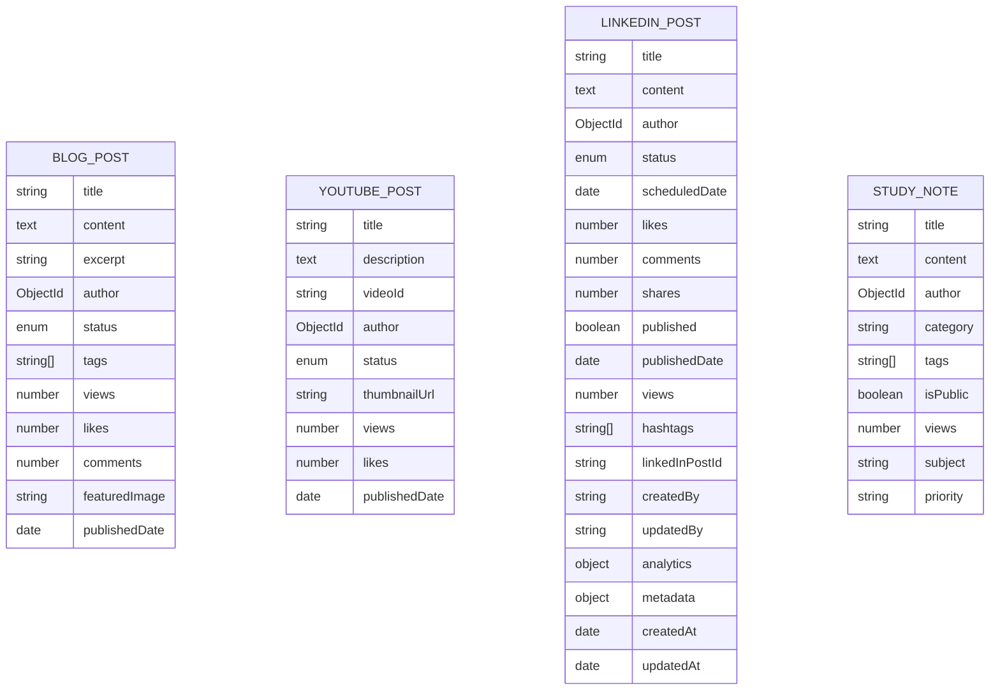

# Content Management APIs

<cite>
**Referenced Files in This Document**
- [blog.controller.ts](file://backend/src/blog/blog.controller.ts)
- [blog-post.dto.ts](file://backend/src/blog/dto/blog-post.dto.ts)
- [blog-post.schema.ts](file://backend/src/blog/schemas/blog-post.schema.ts)
- [blog.service.ts](file://backend/src/blog/blog.service.ts)
- [youtube.controller.ts](file://backend/src/youtube/youtube.controller.ts)
- [youtube-post.dto.ts](file://backend/src/youtube/dto/youtube-post.dto.ts)
- [youtube-post.schema.ts](file://backend/src/youtube/schemas/youtube-post.schema.ts)
- [youtube.service.ts](file://backend/src/youtube/youtube.service.ts)
- [linkedin.controller.ts](file://backend/src/linkedin/linkedin.controller.ts)
- [linkedin-post.dto.ts](file://backend/src/linkedin/dto/linkedin-post.dto.ts)
- [linkedin-post.schema.ts](file://backend/src/linkedin/schemas/linkedin-post.schema.ts)
- [linkedin.service.ts](file://backend/src/linkedin/linkedin.service.ts)
- [study-notes.controller.ts](file://backend/src/study-notes/study-notes.controller.ts)
- [study-note.dto.ts](file://backend/src/study-notes/dto/study-note.dto.ts)
- [study-note.schema.ts](file://backend/src/study-notes/schemas/study-note.schema.ts)
- [study-notes.service.ts](file://backend/src/study-notes/study-notes.service.ts)
</cite>

## Table of Contents
1. [Introduction](#introduction)
2. [Project Structure](#project-structure)
3. [Core Components](#core-components)
4. [Architecture Overview](#architecture-overview)
5. [Detailed Component Analysis](#detailed-component-analysis)
6. [Dependency Analysis](#dependency-analysis)
7. [Performance Considerations](#performance-considerations)
8. [Troubleshooting Guide](#troubleshooting-guide)
9. [Conclusion](#conclusion)
10. [Appendices](#appendices)

## Introduction
This document provides comprehensive API documentation for the Content Management endpoints across four modules: Study Notes, YouTube, LinkedIn, and Blog. It covers HTTP methods, URL patterns, request/response schemas, validation rules, CRUD operations, publishing workflows, scheduling, analytics integration, content categorization/tagging, search, and moderation-related controls present in the codebase.

## Project Structure
Each module follows a consistent NestJS pattern:
- Controller: Exposes HTTP endpoints and applies guards.
- DTO: Defines validated request bodies.
- Schema: Defines Mongoose model and enums.
- Service: Implements business logic and database operations.

**Diagram sources**
- [blog.controller.ts](file://backend/src/blog/blog.controller.ts#L1-L62)
- [blog-post.dto.ts](file://backend/src/blog/dto/blog-post.dto.ts#L1-L52)
- [blog-post.schema.ts](file://backend/src/blog/schemas/blog-post.schema.ts#L1-L46)
- [blog.service.ts](file://backend/src/blog/blog.service.ts#L1-L78)
- [youtube.controller.ts](file://backend/src/youtube/youtube.controller.ts#L1-L51)
- [youtube-post.dto.ts](file://backend/src/youtube/dto/youtube-post.dto.ts#L1-L38)
- [youtube-post.schema.ts](file://backend/src/youtube/schemas/youtube-post.schema.ts#L1-L37)
- [youtube.service.ts](file://backend/src/youtube/youtube.service.ts#L1-L73)
- [linkedin.controller.ts](file://backend/src/linkedin/linkedin.controller.ts#L1-L62)
- [linkedin-post.dto.ts](file://backend/src/linkedin/dto/linkedin-post.dto.ts#L1-L52)
- [linkedin-post.schema.ts](file://backend/src/linkedin/schemas/linkedin-post.schema.ts#L1-L84)
- [linkedin.service.ts](file://backend/src/linkedin/linkedin.service.ts#L1-L90)
- [study-notes.controller.ts](file://backend/src/study-notes/study-notes.controller.ts#L1-L56)
- [study-note.dto.ts](file://backend/src/study-notes/dto/study-note.dto.ts#L1-L63)
- [study-note.schema.ts](file://backend/src/study-notes/schemas/study-note.schema.ts#L1-L35)
- [study-notes.service.ts](file://backend/src/study-notes/study-notes.service.ts#L1-L80)

**Section sources**
- [blog.controller.ts](file://backend/src/blog/blog.controller.ts#L1-L62)
- [youtube.controller.ts](file://backend/src/youtube/youtube.controller.ts#L1-L51)
- [linkedin.controller.ts](file://backend/src/linkedin/linkedin.controller.ts#L1-L62)
- [study-notes.controller.ts](file://backend/src/study-notes/study-notes.controller.ts#L1-L56)

## Core Components
- Controllers expose endpoints under base paths per module.
- DTOs enforce validation via class-validator.
- Schemas define MongoDB documents and enums.
- Services encapsulate persistence and workflow logic.

Key shared guard: JWT-based authentication is applied to all module controllers.

**Section sources**
- [blog.controller.ts](file://backend/src/blog/blog.controller.ts#L1-L62)
- [youtube.controller.ts](file://backend/src/youtube/youtube.controller.ts#L1-L51)
- [linkedin.controller.ts](file://backend/src/linkedin/linkedin.controller.ts#L1-L62)
- [study-notes.controller.ts](file://backend/src/study-notes/study-notes.controller.ts#L1-L56)

## Architecture Overview
The API follows a layered architecture:
- HTTP requests enter via Controllers.
- DTOs validate inputs.
- Services perform domain logic and interact with Mongoose models.
- Responses are returned to clients.

**Diagram sources**
- [blog.controller.ts](file://backend/src/blog/blog.controller.ts#L1-L62)
- [blog.service.ts](file://backend/src/blog/blog.service.ts#L1-L78)
- [youtube.controller.ts](file://backend/src/youtube/youtube.controller.ts#L1-L51)
- [youtube.service.ts](file://backend/src/youtube/youtube.service.ts#L1-L73)
- [linkedin.controller.ts](file://backend/src/linkedin/linkedin.controller.ts#L1-L62)
- [linkedin.service.ts](file://backend/src/linkedin/linkedin.service.ts#L1-L90)
- [study-notes.controller.ts](file://backend/src/study-notes/study-notes.controller.ts#L1-L56)
- [study-notes.service.ts](file://backend/src/study-notes/study-notes.service.ts#L1-L80)

## Detailed Component Analysis

### Blog Module
- Base path: /api/blog
- Authentication: Required (JWT)
- Status enum: draft, published

Endpoints
- POST /blog
  - Purpose: Create a new blog post
  - Authenticated user is set as author
  - Request body: CreateBlogPostDto
  - Response: BlogPost document
- GET /blog
  - Purpose: List posts (optional status filter)
  - Query: status=draft|published
  - Response: Array of BlogPost
- GET /blog/search?q=...
  - Purpose: Search published posts by title, content, or tags
  - Response: Array of BlogPost
- GET /blog/stats
  - Purpose: Get counts for total, published, and draft posts
  - Response: Stats object
- GET /blog/author/:authorId
  - Purpose: Find posts by author
  - Response: Array of BlogPost
- GET /blog/:id
  - Purpose: Retrieve a single post (view counter increments)
  - Response: BlogPost
- PUT /blog/:id
  - Purpose: Update a post (including status)
  - Request body: UpdateBlogPostDto
  - Response: Updated BlogPost
- DELETE /blog/:id
  - Purpose: Delete a post
  - Response: Deletion result
- POST /blog/:id/publish
  - Purpose: Publish a post (set status to published and record published date)
  - Response: Updated BlogPost
- POST /blog/:id/unpublish
  - Purpose: Unpublish a post (set status to draft)
  - Response: Updated BlogPost

Validation rules
- CreateBlogPostDto: title, content, author required; excerpt, tags, featuredImage optional
- UpdateBlogPostDto: title, content, excerpt, tags, featuredImage, status optional; status constrained to enum

Request/response schemas
- CreateBlogPostDto: title, content, author, excerpt?, tags?, featuredImage?
- UpdateBlogPostDto: title?, content?, excerpt?, tags?, featuredImage?, status?
- BlogPost: title, content, author, status (default draft), tags, views, likes, comments, featuredImage?, publishedDate?

Analytics integration
- Views, likes, comments counters maintained per post

Moderation and spam controls
- No explicit moderation endpoints observed in the controller; publication toggles are available via publish/unpublish endpoints.

Versioning
- No explicit content versioning observed.

**Diagram sources**
- [blog.controller.ts](file://backend/src/blog/blog.controller.ts#L12-L15)
- [blog.service.ts](file://backend/src/blog/blog.service.ts#L11-L14)

**Section sources**
- [blog.controller.ts](file://backend/src/blog/blog.controller.ts#L1-L62)
- [blog-post.dto.ts](file://backend/src/blog/dto/blog-post.dto.ts#L1-L52)
- [blog-post.schema.ts](file://backend/src/blog/schemas/blog-post.schema.ts#L1-L46)
- [blog.service.ts](file://backend/src/blog/blog.service.ts#L1-L78)

### YouTube Module
- Base path: /api/youtube
- Authentication: Required (JWT)

Endpoints
- POST /youtube
  - Purpose: Create a YouTube post
  - Authenticated user is set as author
  - Request body: CreateYouTubePostDto
  - Response: YouTubePost
- GET /youtube
  - Purpose: List posts (optional status filter)
  - Query: status=draft|published
  - Response: Array of YouTubePost
- GET /youtube/stats
  - Purpose: Get counts for total, published, draft, and total views
  - Response: Stats object
- GET /youtube/author/:authorId
  - Purpose: Find posts by author
  - Response: Array of YouTubePost
- GET /youtube/:id
  - Purpose: Retrieve a single post (view counter increments)
  - Response: YouTubePost
- PUT /youtube/:id
  - Purpose: Update a post (status can be set)
  - Request body: UpdateYouTubePostDto
  - Response: Updated YouTubePost
- DELETE /youtube/:id
  - Purpose: Delete a post
  - Response: Deletion result
- POST /youtube/:id/publish
  - Purpose: Publish a post (set status to published and record published date)
  - Response: Updated YouTubePost

Validation rules
- CreateYouTubePostDto: title, description, videoId, author required; thumbnailUrl optional
- UpdateYouTubePostDto: title, description, thumbnailUrl optional; status optional

Request/response schemas
- CreateYouTubePostDto: title, description, videoId, author, thumbnailUrl?
- UpdateYouTubePostDto: title?, description?, thumbnailUrl?, status?
- YouTubePost: title, description, videoId, author, status (default draft), thumbnailUrl?, views, likes, publishedDate?

Analytics integration
- Views, likes counters maintained per post

Moderation and spam controls
- No explicit moderation endpoints observed in the controller; publication toggle is available via publish endpoint.

Versioning
- No explicit content versioning observed.

**Diagram sources**
- [youtube.controller.ts](file://backend/src/youtube/youtube.controller.ts#L11-L14)
- [youtube.service.ts](file://backend/src/youtube/youtube.service.ts#L11-L14)

**Section sources**
- [youtube.controller.ts](file://backend/src/youtube/youtube.controller.ts#L1-L51)
- [youtube-post.dto.ts](file://backend/src/youtube/dto/youtube-post.dto.ts#L1-L38)
- [youtube-post.schema.ts](file://backend/src/youtube/schemas/youtube-post.schema.ts#L1-L37)
- [youtube.service.ts](file://backend/src/youtube/youtube.service.ts#L1-L73)

### LinkedIn Module
- Base path: /api/linkedin
- Authentication: Required (JWT)
- Status enum: draft, scheduled, published, archived

Endpoints
- POST /linkedin
  - Purpose: Create a LinkedIn post
  - Authenticated user is set as author
  - Request body: CreateLinkedInPostDto
  - Response: LinkedInPost
- GET /linkedin
  - Purpose: List posts (optional status filter)
  - Query: status=draft|scheduled|published|archived
  - Response: Array of LinkedInPost
- GET /linkedin/scheduled
  - Purpose: Retrieve scheduled posts eligible for publishing
  - Response: Array of LinkedInPost
- GET /linkedin/stats
  - Purpose: Get counts for total, published, scheduled, draft
  - Response: Stats object
- GET /linkedin/author/:authorId
  - Purpose: Find posts by author
  - Response: Array of LinkedInPost
- GET /linkedin/:id
  - Purpose: Retrieve a single post
  - Response: LinkedInPost
- PUT /linkedin/:id
  - Purpose: Update a post (including status and scheduledDate)
  - Request body: UpdateLinkedInPostDto
  - Response: Updated LinkedInPost
- DELETE /linkedin/:id
  - Purpose: Delete a post
  - Response: Deletion result
- POST /linkedin/:id/schedule
  - Purpose: Schedule a post (set status to scheduled and store scheduledDate)
  - Request body: { scheduledDate: Date }
  - Response: Updated LinkedInPost
- POST /linkedin/:id/publish
  - Purpose: Publish a post (set status to published, mark published flag, and record publishedDate)
  - Response: Updated LinkedInPost

Validation rules
- CreateLinkedInPostDto: title, content, author required; imageUrl, hashtags, scheduledDate optional
- UpdateLinkedInPostDto: title, content, imageUrl, hashtags optional; status constrained to enum; scheduledDate optional

Request/response schemas
- CreateLinkedInPostDto: title, content, author, imageUrl?, hashtags?, scheduledDate?
- UpdateLinkedInPostDto: title?, content?, imageUrl?, hashtags?, status?, scheduledDate?
- LinkedInPost: title, content, status (default draft), author, scheduledDate?, likes, comments, shares, published (boolean), publishedDate?, views, hashtags, linkedInPostId, createdBy, updatedBy, analytics, metadata, timestamps

Analytics integration
- Analytics object supports impressions, clicks, engagementRate, reach

Moderation and spam controls
- No explicit moderation endpoints observed in the controller; scheduling and publication are available via dedicated endpoints.

Versioning
- No explicit content versioning observed.

**Diagram sources**
- [linkedin.controller.ts](file://backend/src/linkedin/linkedin.controller.ts#L52-L55)
- [linkedin.service.ts](file://backend/src/linkedin/linkedin.service.ts#L49-L57)

**Section sources**
- [linkedin.controller.ts](file://backend/src/linkedin/linkedin.controller.ts#L1-L62)
- [linkedin-post.dto.ts](file://backend/src/linkedin/dto/linkedin-post.dto.ts#L1-L52)
- [linkedin-post.schema.ts](file://backend/src/linkedin/schemas/linkedin-post.schema.ts#L1-L84)
- [linkedin.service.ts](file://backend/src/linkedin/linkedin.service.ts#L1-L90)

### Study Notes Module
- Base path: /api/study-notes
- Authentication: Required (JWT)

Endpoints
- POST /study-notes
  - Purpose: Create a study note
  - Authenticated user is set as author
  - Request body: CreateStudyNoteDto
  - Response: StudyNote
- GET /study-notes
  - Purpose: List notes (optional isPublic filter)
  - Query: isPublic=true|false
  - Response: Array of StudyNote
- GET /study-notes/search?q=...
  - Purpose: Search public notes by title, content, tags, or subject
  - Response: Array of StudyNote
- GET /study-notes/category/:category
  - Purpose: Filter public notes by category
  - Response: Array of StudyNote
- GET /study-notes/stats
  - Purpose: Get counts for total, public, private notes
  - Response: Stats object
- GET /study-notes/author/:authorId
  - Purpose: Find notes by author
  - Response: Array of StudyNote
- GET /study-notes/:id
  - Purpose: Retrieve a single note (view counter increments)
  - Response: StudyNote
- PUT /study-notes/:id
  - Purpose: Update a note
  - Request body: UpdateStudyNoteDto
  - Response: Updated StudyNote
- DELETE /study-notes/:id
  - Purpose: Delete a note
  - Response: Deletion result

Validation rules
- CreateStudyNoteDto: title, content, author required; category, tags, isPublic, subject, priority optional
- UpdateStudyNoteDto: title, content, category, tags, isPublic, subject, priority optional

Request/response schemas
- CreateStudyNoteDto: title, content, author, category?, tags?, isPublic?, subject?, priority?
- UpdateStudyNoteDto: title?, content?, category?, tags?, isPublic?, subject?, priority?
- StudyNote: title, content, author, category?, tags, isPublic (default false), views, subject?, priority?

Analytics integration
- Views counter maintained per note

Moderation and spam controls
- No explicit moderation endpoints observed in the controller.

Versioning
- No explicit content versioning observed.

**Diagram sources**
- [study-notes.controller.ts](file://backend/src/study-notes/study-notes.controller.ts#L21-L24)
- [study-notes.service.ts](file://backend/src/study-notes/study-notes.service.ts#L55-L67)

**Section sources**
- [study-notes.controller.ts](file://backend/src/study-notes/study-notes.controller.ts#L1-L56)
- [study-note.dto.ts](file://backend/src/study-notes/dto/study-note.dto.ts#L1-L63)
- [study-note.schema.ts](file://backend/src/study-notes/schemas/study-note.schema.ts#L1-L35)
- [study-notes.service.ts](file://backend/src/study-notes/study-notes.service.ts#L1-L80)

## Dependency Analysis
- Controllers depend on Services for business logic.
- Services depend on Mongoose Models defined by Schemas.
- DTOs are used by Controllers to validate incoming requests.
- All controllers apply JWT guard for authentication.

**Diagram sources**
- [blog.controller.ts](file://backend/src/blog/blog.controller.ts#L1-L62)
- [blog.service.ts](file://backend/src/blog/blog.service.ts#L1-L78)
- [blog-post.schema.ts](file://backend/src/blog/schemas/blog-post.schema.ts#L1-L46)
- [blog-post.dto.ts](file://backend/src/blog/dto/blog-post.dto.ts#L1-L52)
- [youtube.controller.ts](file://backend/src/youtube/youtube.controller.ts#L1-L51)
- [youtube.service.ts](file://backend/src/youtube/youtube.service.ts#L1-L73)
- [youtube-post.schema.ts](file://backend/src/youtube/schemas/youtube-post.schema.ts#L1-L37)
- [youtube-post.dto.ts](file://backend/src/youtube/dto/youtube-post.dto.ts#L1-L38)
- [linkedin.controller.ts](file://backend/src/linkedin/linkedin.controller.ts#L1-L62)
- [linkedin.service.ts](file://backend/src/linkedin/linkedin.service.ts#L1-L90)
- [linkedin-post.schema.ts](file://backend/src/linkedin/schemas/linkedin-post.schema.ts#L1-L84)
- [linkedin-post.dto.ts](file://backend/src/linkedin/dto/linkedin-post.dto.ts#L1-L52)
- [study-notes.controller.ts](file://backend/src/study-notes/study-notes.controller.ts#L1-L56)
- [study-notes.service.ts](file://backend/src/study-notes/study-notes.service.ts#L1-L80)
- [study-note.schema.ts](file://backend/src/study-notes/schemas/study-note.schema.ts#L1-L35)
- [study-note.dto.ts](file://backend/src/study-notes/dto/study-note.dto.ts#L1-L63)

**Section sources**
- [blog.controller.ts](file://backend/src/blog/blog.controller.ts#L1-L62)
- [youtube.controller.ts](file://backend/src/youtube/youtube.controller.ts#L1-L51)
- [linkedin.controller.ts](file://backend/src/linkedin/linkedin.controller.ts#L1-L62)
- [study-notes.controller.ts](file://backend/src/study-notes/study-notes.controller.ts#L1-L56)

## Performance Considerations
- Sorting by createdAt descending is applied in most list endpoints.
- Population of author fields occurs in several endpoints; consider projection to reduce payload size when listing many items.
- Aggregation queries are used for stats in YouTube and LinkedIn modules.
- Indexes are defined on status and createdAt for LinkedIn posts, and on scheduledDate for scheduling retrieval.

[No sources needed since this section provides general guidance]

## Troubleshooting Guide
Common issues and resolutions
- Validation errors
  - Ensure request bodies conform to DTO constraints (required fields, optional arrays/enums).
  - Check enum values for status fields where applicable.
- Authentication failures
  - Verify JWT bearer token is included in Authorization header.
- Resource not found
  - Confirm resource IDs exist before performing update/delete/publish operations.
- Unexpected status transitions
  - Review module-specific status enums and transitions:
    - Blog: draft <-> published
    - YouTube: draft <-> published
    - LinkedIn: draft <-> scheduled <-> published (and archived via updates if needed)

**Section sources**
- [blog-post.dto.ts](file://backend/src/blog/dto/blog-post.dto.ts#L1-L52)
- [youtube-post.dto.ts](file://backend/src/youtube/dto/youtube-post.dto.ts#L1-L38)
- [linkedin-post.dto.ts](file://backend/src/linkedin/dto/linkedin-post.dto.ts#L1-L52)
- [study-note.dto.ts](file://backend/src/study-notes/dto/study-note.dto.ts#L1-L63)

## Conclusion
The Content Management APIs provide robust CRUD and workflow capabilities across Study Notes, YouTube, LinkedIn, and Blog modules. They enforce input validation via DTOs, maintain consistent authentication, and support essential features like publishing, scheduling, analytics counters, categorization, tagging, and search. Moderation endpoints are not exposed in the current controllers; publication and scheduling workflows are handled through dedicated endpoints per module.

## Appendices

### API Reference Tables

- Blog
  - POST /blog
    - Request: CreateBlogPostDto
    - Response: BlogPost
  - GET /blog?status=draft|published
    - Response: BlogPost[]
  - GET /blog/search?q=string
    - Response: BlogPost[]
  - GET /blog/stats
    - Response: Stats
  - GET /blog/author/:authorId
    - Response: BlogPost[]
  - GET /blog/:id
    - Response: BlogPost
  - PUT /blog/:id
    - Request: UpdateBlogPostDto
    - Response: BlogPost
  - DELETE /blog/:id
    - Response: Deletion result
  - POST /blog/:id/publish
    - Response: BlogPost
  - POST /blog/:id/unpublish
    - Response: BlogPost

- YouTube
  - POST /youtube
    - Request: CreateYouTubePostDto
    - Response: YouTubePost
  - GET /youtube?status=draft|published
    - Response: YouTubePost[]
  - GET /youtube/stats
    - Response: Stats
  - GET /youtube/author/:authorId
    - Response: YouTubePost[]
  - GET /youtube/:id
    - Response: YouTubePost
  - PUT /youtube/:id
    - Request: UpdateYouTubePostDto
    - Response: YouTubePost
  - DELETE /youtube/:id
    - Response: Deletion result
  - POST /youtube/:id/publish
    - Response: YouTubePost

- LinkedIn
  - POST /linkedin
    - Request: CreateLinkedInPostDto
    - Response: LinkedInPost
  - GET /linkedin?status=draft|scheduled|published|archived
    - Response: LinkedInPost[]
  - GET /linkedin/scheduled
    - Response: LinkedInPost[]
  - GET /linkedin/stats
    - Response: Stats
  - GET /linkedin/author/:authorId
    - Response: LinkedInPost[]
  - GET /linkedin/:id
    - Response: LinkedInPost
  - PUT /linkedin/:id
    - Request: UpdateLinkedInPostDto
    - Response: LinkedInPost
  - DELETE /linkedin/:id
    - Response: Deletion result
  - POST /linkedin/:id/schedule
    - Request: { scheduledDate: Date }
    - Response: LinkedInPost
  - POST /linkedin/:id/publish
    - Response: LinkedInPost

- Study Notes
  - POST /study-notes
    - Request: CreateStudyNoteDto
    - Response: StudyNote
  - GET /study-notes?isPublic=true|false
    - Response: StudyNote[]
  - GET /study-notes/search?q=string
    - Response: StudyNote[]
  - GET /study-notes/category/:category
    - Response: StudyNote[]
  - GET /study-notes/stats
    - Response: Stats
  - GET /study-notes/author/:authorId
    - Response: StudyNote[]
  - GET /study-notes/:id
    - Response: StudyNote
  - PUT /study-notes/:id
    - Request: UpdateStudyNoteDto
    - Response: StudyNote
  - DELETE /study-notes/:id
    - Response: Deletion result

### Data Models Overview

**Diagram sources**
- [blog-post.schema.ts](file://backend/src/blog/schemas/blog-post.schema.ts#L1-L46)
- [youtube-post.schema.ts](file://backend/src/youtube/schemas/youtube-post.schema.ts#L1-L37)
- [linkedin-post.schema.ts](file://backend/src/linkedin/schemas/linkedin-post.schema.ts#L1-L84)
- [study-note.schema.ts](file://backend/src/study-notes/schemas/study-note.schema.ts#L1-L35)