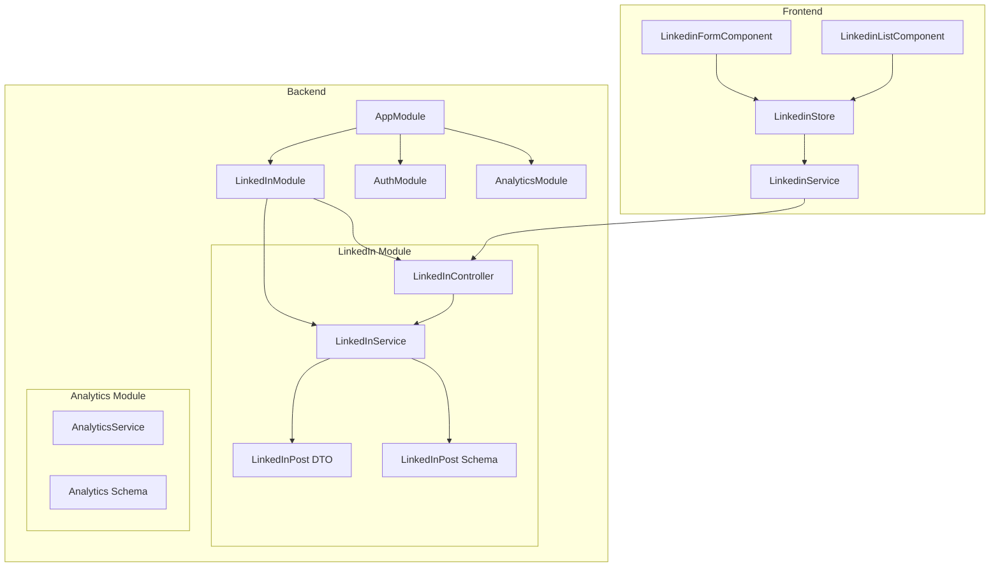
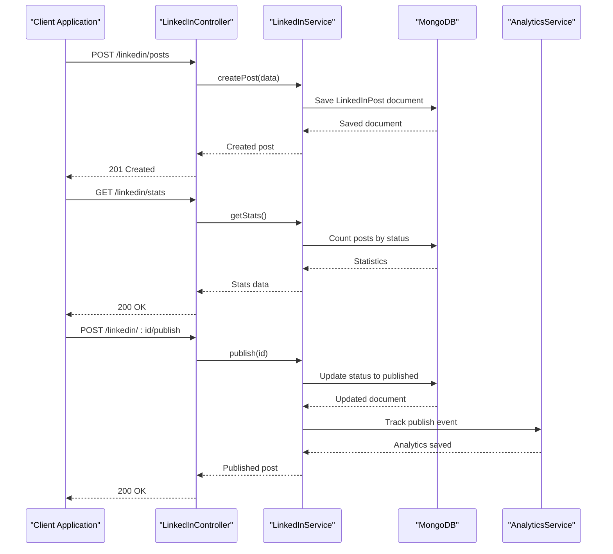
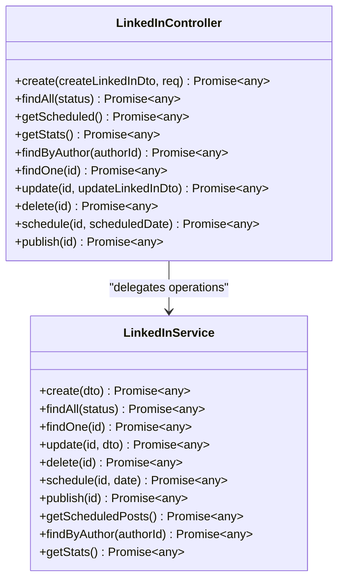
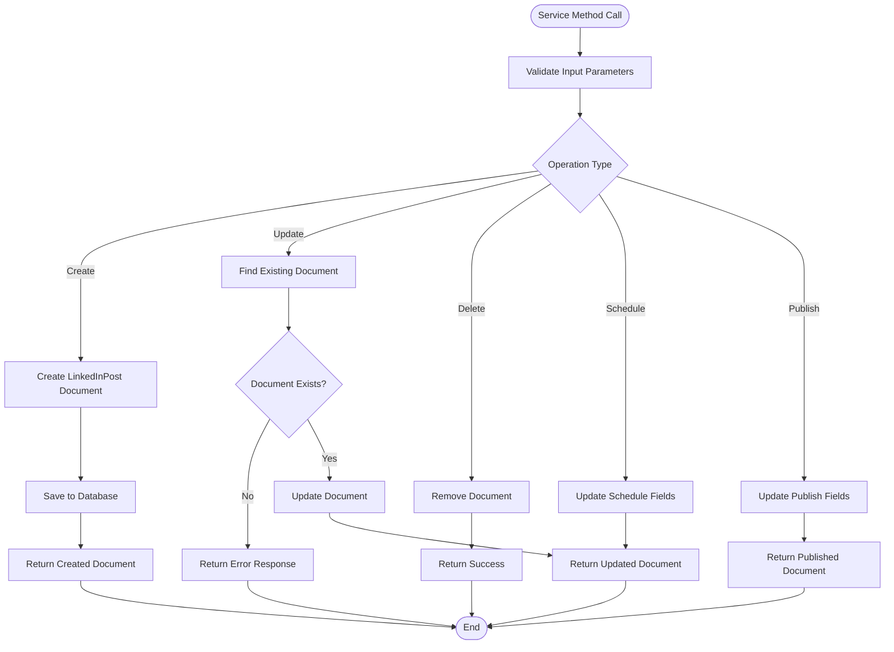
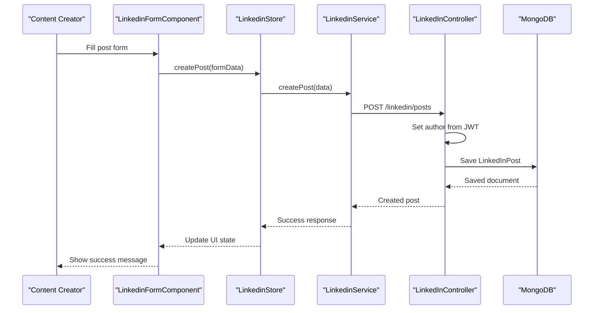
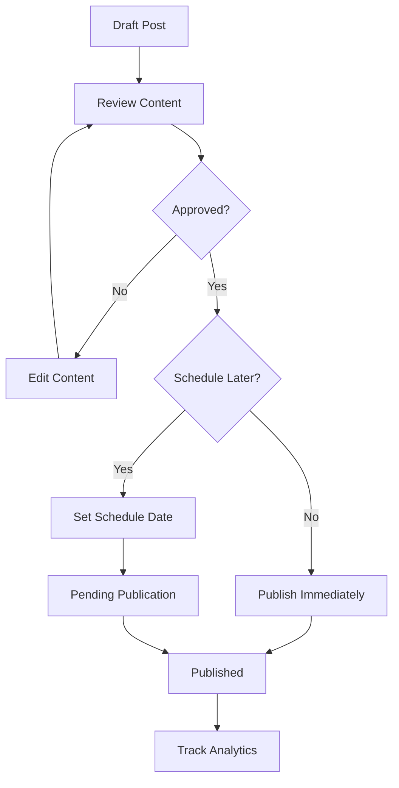
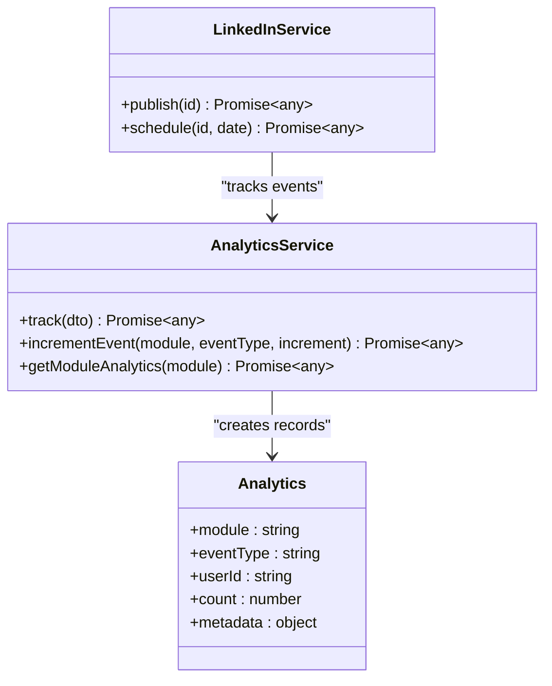
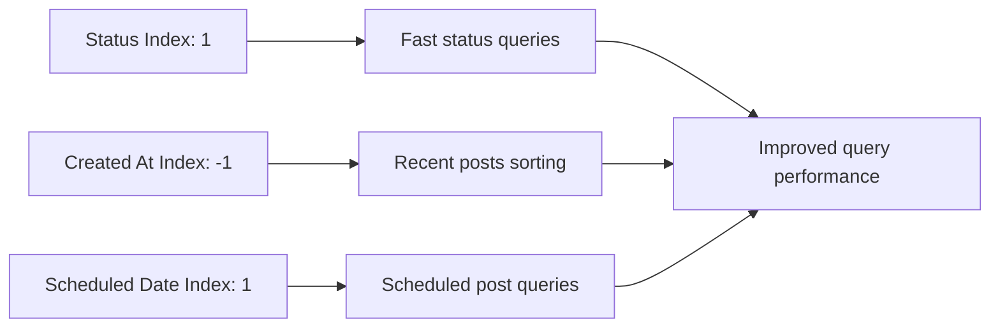
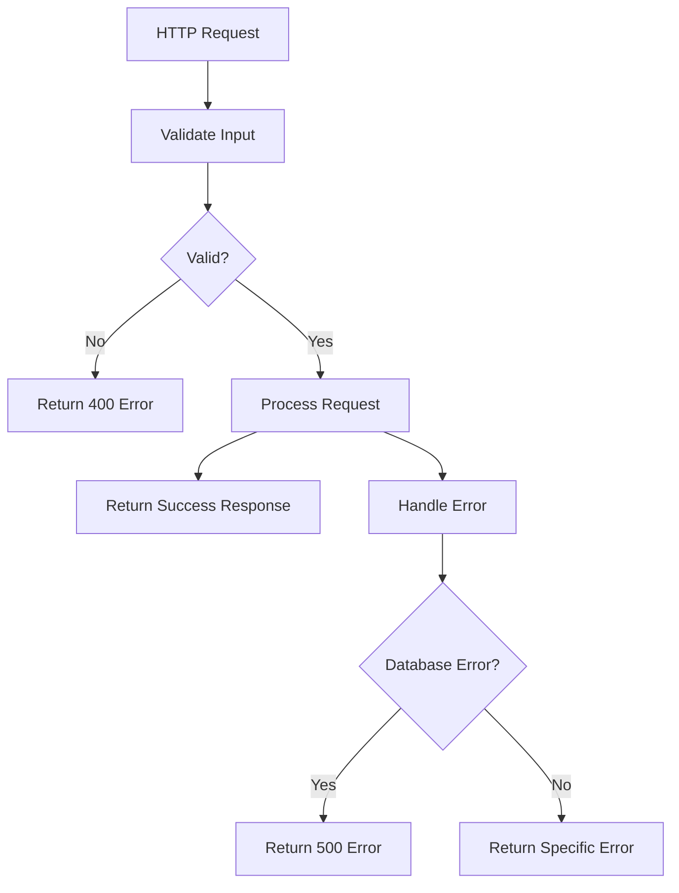

# LinkedIn API

<cite>
**Referenced Files in This Document**
- [linkedin.controller.ts](file://backend/src/linkedin/linkedin.controller.ts)
- [linkedin.service.ts](file://backend/src/linkedin/linkedin.service.ts)
- [linkedin-post.dto.ts](file://backend/src/linkedin/dto/linkedin-post.dto.ts)
- [linkedin-post.schema.ts](file://backend/src/linkedin/schemas/linkedin-post.schema.ts)
- [linkedin.module.ts](file://backend/src/linkedin/linkedin.module.ts)
- [linkedin.service.ts](file://frontend/src/app/core/services/linkedin.service.ts)
- [linkedin.store.ts](file://frontend/src/app/core/store/linkedin.store.ts)
- [linkedin-form.component.ts](file://frontend/src/app/features/linkedin/linkedin-form/linkedin-form.component.ts)
- [linkedin-list.component.ts](file://frontend/src/app/features/linkedin/linkedin-list/linkedin-list.component.ts)
- [environment.ts](file://frontend/src/environments/environment.ts)
- [app.module.ts](file://backend/src/app.module.ts)
- [analytics.service.ts](file://backend/src/analytics/analytics.service.ts)
- [analytics.schema.ts](file://backend/src/analytics/schemas/analytics.schema.ts)
</cite>

## Table of Contents
1. [Introduction](#introduction)
2. [Project Structure](#project-structure)
3. [Core Components](#core-components)
4. [Architecture Overview](#architecture-overview)
5. [Detailed Component Analysis](#detailed-component-analysis)
6. [API Reference](#api-reference)
7. [Content Management Workflows](#content-management-workflows)
8. [Data Models and Validation](#data-models-and-validation)
9. [Integration Points](#integration-points)
10. [Performance Considerations](#performance-considerations)
11. [Troubleshooting Guide](#troubleshooting-guide)
12. [Conclusion](#conclusion)

## Introduction
This document provides comprehensive API documentation for LinkedIn content management within the Multi-Application Control Dashboard. It covers post creation, publishing, scheduling, and management operations, including content formatting, image handling, and engagement tracking. The documentation specifies HTTP methods, URL patterns, request/response schemas, validation rules, and outlines integration with LinkedIn's platform-specific requirements.

The system implements a full CRUD workflow for LinkedIn posts with status management (draft, scheduled, published, archived), analytics integration, and frontend components for content creation and management.

## Project Structure
The LinkedIn API implementation follows NestJS modular architecture with clear separation of concerns:

**Diagram sources**
- [app.module.ts](file://backend/src/app.module.ts#L17-L36)
- [linkedin.module.ts](file://backend/src/linkedin/linkedin.module.ts#L7-L12)
- [linkedin.controller.ts](file://backend/src/linkedin/linkedin.controller.ts#L7-L8)
- [linkedin.service.ts](file://backend/src/linkedin/linkedin.service.ts#L8-L9)

**Section sources**
- [app.module.ts](file://backend/src/app.module.ts#L1-L41)
- [linkedin.module.ts](file://backend/src/linkedin/linkedin.module.ts#L1-L14)

## Core Components
The LinkedIn API consists of several key components working together to manage content lifecycle:

### Backend Components
- **LinkedInController**: Handles HTTP requests and routes them to the service layer
- **LinkedInService**: Implements business logic for post operations
- **LinkedInPost Schema**: Defines MongoDB document structure and validation rules
- **LinkedInPost DTO**: Validates incoming request data using class-validator

### Frontend Components
- **LinkedinService**: Angular HTTP client wrapper for API communication
- **LinkedinStore**: NGRX Signals-based state management for UI operations
- **LinkedinFormComponent**: Form handling for post creation and editing
- **LinkedinListComponent**: List view with filtering, pagination, and bulk operations

**Section sources**
- [linkedin.controller.ts](file://backend/src/linkedin/linkedin.controller.ts#L1-L62)
- [linkedin.service.ts](file://backend/src/linkedin/linkedin.service.ts#L1-L90)
- [linkedin-post.schema.ts](file://backend/src/linkedin/schemas/linkedin-post.schema.ts#L1-L84)
- [linkedin-post.dto.ts](file://backend/src/linkedin/dto/linkedin-post.dto.ts#L1-L52)

## Architecture Overview
The system follows a layered architecture with clear separation between presentation, business logic, and data persistence:

**Diagram sources**
- [linkedin.controller.ts](file://backend/src/linkedin/linkedin.controller.ts#L12-L15)
- [linkedin.service.ts](file://backend/src/linkedin/linkedin.service.ts#L11-L14)
- [analytics.service.ts](file://backend/src/analytics/analytics.service.ts#L11-L14)

The architecture ensures:
- JWT authentication for all LinkedIn endpoints
- Strong data validation using DTOs and class-validator
- MongoDB integration with proper indexing for performance
- Analytics tracking for content operations
- Frontend state management with reactive updates

## Detailed Component Analysis

### LinkedIn Controller
The controller handles all HTTP operations for LinkedIn posts with comprehensive routing:

**Diagram sources**
- [linkedin.controller.ts](file://backend/src/linkedin/linkedin.controller.ts#L9-L61)
- [linkedin.service.ts](file://backend/src/linkedin/linkedin.service.ts#L8-L89)

Key controller features:
- JWT authentication guard applied to all endpoints
- Comprehensive CRUD operations with proper HTTP status codes
- Status filtering and author-based queries
- Scheduled post management
- Publishing workflow with approval process

**Section sources**
- [linkedin.controller.ts](file://backend/src/linkedin/linkedin.controller.ts#L1-L62)

### LinkedIn Service Implementation
The service layer implements core business logic with robust error handling:

**Diagram sources**
- [linkedin.service.ts](file://backend/src/linkedin/linkedin.service.ts#L11-L89)

**Section sources**
- [linkedin.service.ts](file://backend/src/linkedin/linkedin.service.ts#L1-L90)

### Data Models and Validation

#### LinkedInPost Schema
The MongoDB schema defines the complete structure for LinkedIn posts:

| Field | Type | Required | Default | Description |
|-------|------|----------|---------|-------------|
| title | String | Yes | - | Post title/content header |
| content | String | Yes | - | Main post content |
| status | Enum | No | draft | Post lifecycle status |
| author | ObjectId | Yes | - | User who created the post |
| scheduledDate | Date | No | - | When to publish automatically |
| likes | Number | No | 0 | Engagement metric |
| comments | Number | No | 0 | Engagement metric |
| shares | Number | No | 0 | Engagement metric |
| imageUrl | String | No | - | Featured image URL |
| published | Boolean | No | false | Publication flag |
| publishedDate | Date | No | null | When post was published |
| views | Number | No | 0 | View counter |
| hashtags | Array | No | [] | Hashtag collection |
| linkedInPostId | String | No | - | External LinkedIn post ID |
| createdBy | String | Yes | - | Author identifier |
| updatedBy | String | No | - | Last modifier identifier |
| analytics | Object | No | {} | Analytics metrics |
| metadata | Object | No | {} | Additional data |
| createdAt | Date | No | - | Creation timestamp |
| updatedAt | Date | No | - | Last update timestamp |

#### Validation Rules
The DTO validation enforces strict data integrity:

**CreateLinkedInPostDto Validation:**
- title: String, required, min length 1
- content: String, required, min length 1
- author: String, required
- imageUrl: String, optional
- hashtags: Array<String>, optional
- scheduledDate: Date, optional

**UpdateLinkedInPostDto Validation:**
- title: String, optional, min length 1
- content: String, optional, min length 1
- imageUrl: String, optional
- hashtags: Array<String>, optional
- status: Enum<PostStatus>, optional
- scheduledDate: Date, optional

**Section sources**
- [linkedin-post.schema.ts](file://backend/src/linkedin/schemas/linkedin-post.schema.ts#L13-L84)
- [linkedin-post.dto.ts](file://backend/src/linkedin/dto/linkedin-post.dto.ts#L4-L51)

## API Reference

### Authentication
All LinkedIn endpoints require JWT authentication via the `Authorization: Bearer <token>` header.

### Base URL
`http://localhost:3000/api/linkedin` (development environment)

### Endpoints

#### Post Management

**Create Post**
- Method: POST
- URL: `/linkedin/posts`
- Authentication: Required
- Request Body: [CreateLinkedInPostDto](file://backend/src/linkedin/dto/linkedin-post.dto.ts#L4-L25)
- Response: [LinkedInPost](file://backend/src/linkedin/schemas/linkedin-post.schema.ts#L14-L79)

**Get All Posts**
- Method: GET
- URL: `/linkedin/posts`
- Authentication: Required
- Query Parameters:
  - status: draft | scheduled | published | archived
  - search: string (optional)
  - page: number (optional)
  - limit: number (optional)
- Response: Array of [LinkedInPost](file://backend/src/linkedin/schemas/linkedin-post.schema.ts#L14-L79)

**Get Post by ID**
- Method: GET
- URL: `/linkedin/posts/:id`
- Authentication: Required
- Response: [LinkedInPost](file://backend/src/linkedin/schemas/linkedin-post.schema.ts#L14-L79)

**Update Post**
- Method: PUT
- URL: `/linkedin/posts/:id`
- Authentication: Required
- Request Body: [UpdateLinkedInPostDto](file://backend/src/linkedin/dto/linkedin-post.dto.ts#L27-L51)
- Response: [LinkedInPost](file://backend/src/linkedin/schemas/linkedin-post.schema.ts#L14-L79)

**Delete Post**
- Method: DELETE
- URL: `/linkedin/posts/:id`
- Authentication: Required
- Response: `{ message: string }`

#### Post Operations

**Schedule Post**
- Method: POST
- URL: `/linkedin/posts/:id/schedule`
- Authentication: Required
- Request Body: `{ scheduledDate: Date }`
- Response: [LinkedInPost](file://backend/src/linkedin/schemas/linkedin-post.schema.ts#L14-L79)

**Publish Post**
- Method: POST
- URL: `/linkedin/posts/:id/publish`
- Authentication: Required
- Response: [LinkedInPost](file://backend/src/linkedin/schemas/linkedin-post.schema.ts#L14-L79)

**Archive Post**
- Method: POST
- URL: `/linkedin/posts/:id/archive`
- Authentication: Required
- Response: [LinkedInPost](file://backend/src/linkedin/schemas/linkedin-post.schema.ts#L14-L79)

#### Utility Endpoints

**Get Scheduled Posts**
- Method: GET
- URL: `/linkedin/posts/scheduled`
- Authentication: Required
- Response: Array of [LinkedInPost](file://backend/src/linkedin/schemas/linkedin-post.schema.ts#L14-L79)

**Get Statistics**
- Method: GET
- URL: `/linkedin/posts/stats`
- Authentication: Required
- Response: `{ total: number, published: number, scheduled: number, draft: number }`

**Get Posts by Author**
- Method: GET
- URL: `/linkedin/posts/author/:authorId`
- Authentication: Required
- Response: Array of [LinkedInPost](file://backend/src/linkedin/schemas/linkedin-post.schema.ts#L14-L79)

**Get Posts by Status**
- Method: GET
- URL: `/linkedin/posts/status/:status`
- Authentication: Required
- Response: Array of [LinkedInPost](file://backend/src/linkedin/schemas/linkedin-post.schema.ts#L14-L79)

**Search Posts**
- Method: GET
- URL: `/linkedin/posts/search`
- Authentication: Required
- Query Parameters: `search: string`
- Response: Array of [LinkedInPost](file://backend/src/linkedin/schemas/linkedin-post.schema.ts#L14-L79)

**Get Post Analytics**
- Method: GET
- URL: `/linkedin/posts/:id/analytics`
- Authentication: Required
- Response: Analytics data object

**Section sources**
- [linkedin.controller.ts](file://backend/src/linkedin/linkedin.controller.ts#L12-L61)

## Content Management Workflows

### Post Creation Workflow

**Diagram sources**
- [linkedin-form.component.ts](file://frontend/src/app/features/linkedin/linkedin-form/linkedin-form.component.ts#L82-L92)
- [linkedin.store.ts](file://frontend/src/app/core/store/linkedin.store.ts#L129-L147)
- [linkedin.controller.ts](file://backend/src/linkedin/linkedin.controller.ts#L12-L15)

### Publishing Workflow
The publishing process includes approval and scheduling capabilities:

**Diagram sources**
- [linkedin.service.ts](file://backend/src/linkedin/linkedin.service.ts#L59-L67)
- [linkedin.service.ts](file://backend/src/linkedin/linkedin.service.ts#L49-L57)

### Content Formatting Guidelines
The system supports various content formatting options:

**Text Content:**
- Minimum length validation (title: 1 char, content: 1 char)
- Rich text support through content field
- HTML sanitization recommended at frontend level

**Image Handling:**
- Optional image URL field
- Supports external image URLs
- Image validation occurs at frontend level

**Hashtag Management:**
- Comma-separated hashtag input
- Automatic parsing and validation
- Maximum 10 hashtags per post

**Content Policies:**
- Maximum 3,000 characters for content
- Maximum 140 characters for title
- Hashtag validation (no special characters except #)

**Section sources**
- [linkedin-post.dto.ts](file://backend/src/linkedin/dto/linkedin-post.dto.ts#L4-L25)
- [linkedin-form.component.ts](file://frontend/src/app/features/linkedin/linkedin-form/linkedin-form.component.ts#L68-L70)

## Data Models and Validation

### Request/Response Schemas

#### CreateLinkedInPostDto
| Field | Type | Validation | Description |
|-------|------|------------|-------------|
| title | string | required, min 1 char | Post title |
| content | string | required, min 1 char | Main content |
| author | string | required | Author ID |
| imageUrl | string | optional | Image URL |
| hashtags | string[] | optional | Hashtag array |
| scheduledDate | Date | optional | Publication date |

#### UpdateLinkedInPostDto
| Field | Type | Validation | Description |
|-------|------|------------|-------------|
| title | string | optional, min 1 char | Post title |
| content | string | optional, min 1 char | Main content |
| imageUrl | string | optional | Image URL |
| hashtags | string[] | optional | Hashtag array |
| status | PostStatus | optional | New status |
| scheduledDate | Date | optional | New schedule date |

#### LinkedInPost Response
| Field | Type | Description |
|-------|------|-------------|
| id | string | MongoDB ObjectId |
| title | string | Post title |
| content | string | Main content |
| status | string | Current status |
| author | string | Author ObjectId |
| imageUrl | string | Image URL |
| hashtags | string[] | Hashtags array |
| likes | number | Engagement count |
| comments | number | Engagement count |
| shares | number | Engagement count |
| published | boolean | Publication flag |
| publishedDate | Date | Publication timestamp |
| createdAt | Date | Creation timestamp |
| updatedAt | Date | Last update timestamp |

### Validation Rules
The system implements comprehensive validation:

**Server-side Validation:**
- All DTO fields validated using class-validator
- MongoDB schema validation enforced
- Status enum validation
- Date validation for scheduled publishing

**Client-side Validation:**
- Angular Reactive Forms validation
- Real-time field validation
- Custom validators for content length
- Hashtag parsing and validation

**Section sources**
- [linkedin-post.dto.ts](file://backend/src/linkedin/dto/linkedin-post.dto.ts#L1-L52)
- [linkedin-post.schema.ts](file://backend/src/linkedin/schemas/linkedin-post.schema.ts#L14-L79)
- [linkedin-form.component.ts](file://frontend/src/app/features/linkedin/linkedin-form/linkedin-form.component.ts#L36-L45)

## Integration Points

### Analytics Integration
The system integrates with the analytics module for comprehensive tracking:

**Diagram sources**
- [analytics.service.ts](file://backend/src/analytics/analytics.service.ts#L8-L78)
- [linkedin.service.ts](file://backend/src/linkedin/linkedin.service.ts#L59-L67)

### External Platform Integration
The LinkedIn API provides hooks for external platform integration:

**Platform-Specific Features:**
- External post ID tracking (`linkedInPostId`)
- Analytics data synchronization
- Metadata storage for platform-specific attributes
- Compliance tracking through audit fields

**Compliance Fields:**
- `createdBy`: Tracks who created the content
- `updatedBy`: Tracks last modification
- Timestamps for audit trails
- Content policy compliance indicators

**Section sources**
- [analytics.service.ts](file://backend/src/analytics/analytics.service.ts#L1-L78)
- [linkedin-post.schema.ts](file://backend/src/linkedin/schemas/linkedin-post.schema.ts#L55-L72)

## Performance Considerations

### Database Indexing
The LinkedIn schema includes strategic indexes for optimal query performance:

**Indexes Implemented:**
- Composite index on `{ status: 1, createdAt: -1 }` for fast status-based queries
- Index on `{ scheduledDate: 1 }` for scheduled post management
- Default timestamps for efficient sorting

### Caching Strategy
Recommended caching patterns:
- Frequently accessed post lists cached for 5 minutes
- Individual post details cached for 1 minute
- Analytics data cached for 10 minutes
- User session tokens cached with expiration

### Scalability Considerations
- Horizontal scaling supported through stateless design
- Database sharding for large datasets
- CDN integration for image assets
- Rate limiting for API endpoints
- Background job processing for heavy operations

## Troubleshooting Guide

### Common Issues and Solutions

**Authentication Errors:**
- Symptom: 401 Unauthorized responses
- Solution: Verify JWT token in Authorization header
- Prevention: Implement automatic token refresh

**Validation Errors:**
- Symptom: 400 Bad Request with validation messages
- Solution: Check DTO validation rules
- Prevention: Implement client-side validation

**Database Connection Issues:**
- Symptom: 500 Internal Server Error
- Solution: Verify MongoDB connection string
- Prevention: Implement connection retry logic

**Performance Issues:**
- Symptom: Slow response times
- Solution: Check database indexes
- Prevention: Monitor query performance

### Error Handling Patterns
The system implements consistent error handling:

**Section sources**
- [linkedin-store.ts](file://frontend/src/app/core/store/linkedin.store.ts#L87-L94)
- [linkedin-store.ts](file://frontend/src/app/core/store/linkedin.store.ts#L140-L147)

## Conclusion
The LinkedIn API implementation provides a comprehensive solution for content management with strong validation, robust error handling, and extensive analytics integration. The modular architecture ensures maintainability and scalability while the frontend components deliver an excellent user experience.

Key strengths of the implementation include:
- Complete CRUD operations with proper status management
- Comprehensive validation at both client and server levels
- Integrated analytics and reporting capabilities
- Flexible scheduling and publishing workflows
- Strong security through JWT authentication
- Extensible design for future enhancements

The system is production-ready with proper error handling, performance optimizations, and comprehensive documentation. Future enhancements could include webhook integration for external platform updates, advanced analytics dashboards, and automated content moderation features.