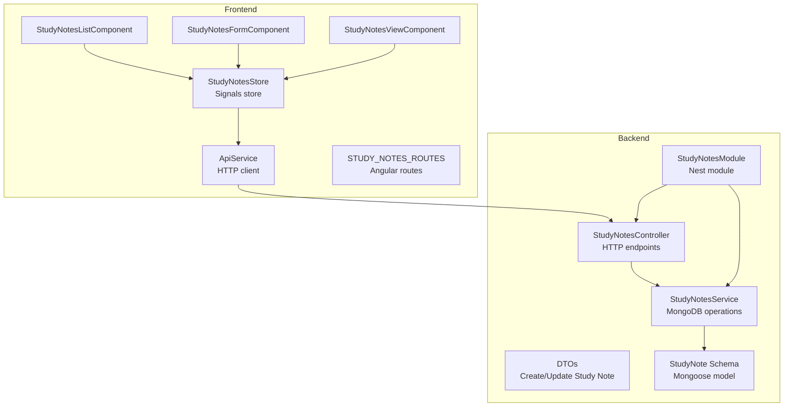
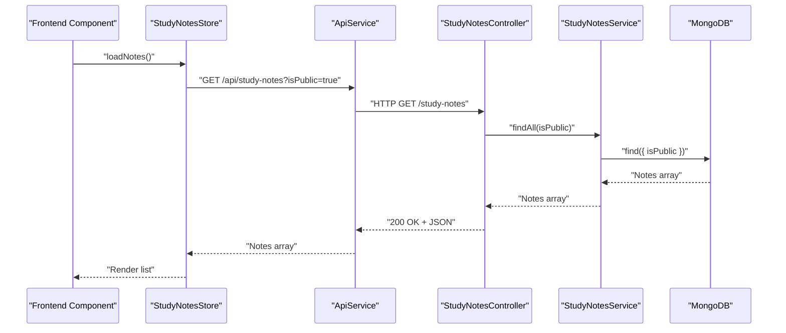
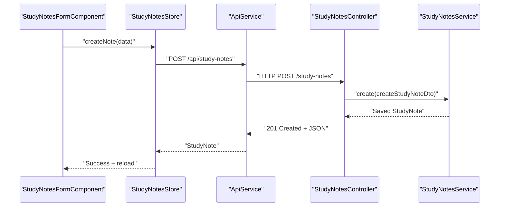
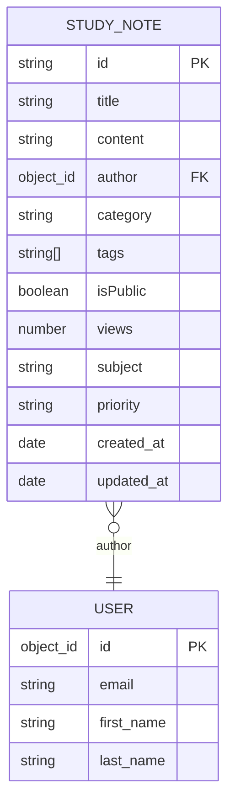
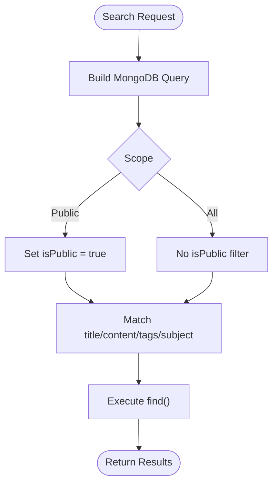
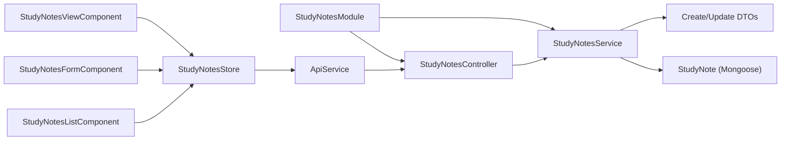

# Study Notes API

<cite>
**Referenced Files in This Document**
- [study-notes.controller.ts](file://backend/src/study-notes/study-notes.controller.ts)
- [study-notes.service.ts](file://backend/src/study-notes/study-notes.service.ts)
- [study-note.dto.ts](file://backend/src/study-notes/dto/study-note.dto.ts)
- [study-note.schema.ts](file://backend/src/study-notes/schemas/study-note.schema.ts)
- [study-notes.module.ts](file://backend/src/study-notes/study-notes.module.ts)
- [api.service.ts](file://frontend/src/app/core/services/api.service.ts)
- [study-notes.store.ts](file://frontend/src/app/core/store/study-notes.store.ts)
- [study-notes-form.component.ts](file://frontend/src/app/features/study-notes/study-notes-form/study-notes-form.component.ts)
- [study-notes-list.component.ts](file://frontend/src/app/features/study-notes/study-notes-list/study-notes-list.component.ts)
- [study-notes-view.component.ts](file://frontend/src/app/features/study-notes/study-notes-view/study-notes-view.component.ts)
- [study-notes.routes.ts](file://frontend/src/app/features/study-notes/study-notes.routes.ts)
</cite>

## Table of Contents
1. [Introduction](#introduction)
2. [Project Structure](#project-structure)
3. [Core Components](#core-components)
4. [Architecture Overview](#architecture-overview)
5. [Detailed Component Analysis](#detailed-component-analysis)
6. [Dependency Analysis](#dependency-analysis)
7. [Performance Considerations](#performance-considerations)
8. [Troubleshooting Guide](#troubleshooting-guide)
9. [Conclusion](#conclusion)
10. [Appendices](#appendices)

## Introduction
This document provides comprehensive API documentation for the Study Notes module. It covers all CRUD operations, organization features (categories, tags, subjects), search capabilities, and content management. It also documents request/response schemas, validation rules, and how the frontend integrates with the backend via a centralized API service and a signals-based store. Where applicable, conceptual extensions for advanced features (formatting, attachments, collaborative editing, versioning, sharing, LMS integration) are outlined for future implementation.

## Project Structure
The Study Notes feature spans backend NestJS modules and frontend Angular components and stores:
- Backend: Controller, Service, DTOs, and Mongoose schema define the API and persistence model.
- Frontend: API service, signals store, and routed components handle data fetching, filtering, and UI interactions.

**Diagram sources**
- [study-notes.controller.ts](file://backend/src/study-notes/study-notes.controller.ts#L1-L56)
- [study-notes.service.ts](file://backend/src/study-notes/study-notes.service.ts#L1-L80)
- [study-note.dto.ts](file://backend/src/study-notes/dto/study-note.dto.ts#L1-L63)
- [study-note.schema.ts](file://backend/src/study-notes/schemas/study-note.schema.ts#L1-L35)
- [study-notes.module.ts](file://backend/src/study-notes/study-notes.module.ts#L1-L14)
- [api.service.ts](file://frontend/src/app/core/services/api.service.ts#L1-L76)
- [study-notes.store.ts](file://frontend/src/app/core/store/study-notes.store.ts#L1-L438)
- [study-notes-form.component.ts](file://frontend/src/app/features/study-notes/study-notes-form/study-notes-form.component.ts#L1-L186)
- [study-notes-list.component.ts](file://frontend/src/app/features/study-notes/study-notes-list/study-notes-list.component.ts#L1-L222)
- [study-notes-view.component.ts](file://frontend/src/app/features/study-notes/study-notes-view/study-notes-view.component.ts#L1-L175)
- [study-notes.routes.ts](file://frontend/src/app/features/study-notes/study-notes.routes.ts#L1-L21)

**Section sources**
- [study-notes.controller.ts](file://backend/src/study-notes/study-notes.controller.ts#L1-L56)
- [study-notes.service.ts](file://backend/src/study-notes/study-notes.service.ts#L1-L80)
- [study-note.dto.ts](file://backend/src/study-notes/dto/study-note.dto.ts#L1-L63)
- [study-note.schema.ts](file://backend/src/study-notes/schemas/study-note.schema.ts#L1-L35)
- [study-notes.module.ts](file://backend/src/study-notes/study-notes.module.ts#L1-L14)
- [api.service.ts](file://frontend/src/app/core/services/api.service.ts#L1-L76)
- [study-notes.store.ts](file://frontend/src/app/core/store/study-notes.store.ts#L1-L438)
- [study-notes-form.component.ts](file://frontend/src/app/features/study-notes/study-notes-form/study-notes-form.component.ts#L1-L186)
- [study-notes-list.component.ts](file://frontend/src/app/features/study-notes/study-notes-list/study-notes-list.component.ts#L1-L222)
- [study-notes-view.component.ts](file://frontend/src/app/features/study-notes/study-notes-view/study-notes-view.component.ts#L1-L175)
- [study-notes.routes.ts](file://frontend/src/app/features/study-notes/study-notes.routes.ts#L1-L21)

## Core Components
- StudyNotesController: Exposes HTTP endpoints for CRUD, search, category filtering, author filtering, stats, and retrieval by ID.
- StudyNotesService: Implements MongoDB operations using Mongoose, including find, update, delete, search, and statistics.
- DTOs: Strongly typed request bodies for creation and updates with validation rules.
- Schema: Defines the StudyNote document structure persisted in MongoDB.
- Frontend API service: Provides generic HTTP helpers for GET, POST, PUT, PATCH, DELETE, pagination, and search.
- Frontend Store: Manages state, filtering, pagination, and mock data for Study Notes.

**Section sources**
- [study-notes.controller.ts](file://backend/src/study-notes/study-notes.controller.ts#L1-L56)
- [study-notes.service.ts](file://backend/src/study-notes/study-notes.service.ts#L1-L80)
- [study-note.dto.ts](file://backend/src/study-notes/dto/study-note.dto.ts#L1-L63)
- [study-note.schema.ts](file://backend/src/study-notes/schemas/study-note.schema.ts#L1-L35)
- [api.service.ts](file://frontend/src/app/core/services/api.service.ts#L1-L76)
- [study-notes.store.ts](file://frontend/src/app/core/store/study-notes.store.ts#L1-L438)

## Architecture Overview
The backend follows a layered architecture:
- Controller receives HTTP requests and delegates to the Service.
- Service interacts with the Mongoose model to perform database operations.
- DTOs validate incoming payloads.
- Frontend components use the signals store to manage UI state and mock data, while the API service encapsulates HTTP calls.

**Diagram sources**
- [study-notes.controller.ts](file://backend/src/study-notes/study-notes.controller.ts#L16-L19)
- [study-notes.service.ts](file://backend/src/study-notes/study-notes.service.ts#L16-L29)
- [api.service.ts](file://frontend/src/app/core/services/api.service.ts#L24-L32)
- [study-notes.store.ts](file://frontend/src/app/core/store/study-notes.store.ts#L114-L188)

## Detailed Component Analysis

### Study Notes API Endpoints
- Base path: /api/study-notes
- Authentication: JWT required (applied globally to controller)

Endpoints:
- POST /study-notes
  - Purpose: Create a new study note
  - Authenticated: Yes
  - Request body: CreateStudyNoteDto
  - Response: StudyNote document
  - Validation: Enforced by DTOs

- GET /study-notes
  - Purpose: List study notes
  - Authenticated: Yes
  - Query parameters:
    - isPublic: boolean (optional)
  - Response: Array of StudyNote documents (populated author)

- GET /study-notes/search?q=string
  - Purpose: Search public notes by title, content, tags, or subject
  - Authenticated: Yes
  - Query parameters:
    - q: string (required)
  - Response: Array of StudyNote documents (only public)

- GET /study-notes/category/:category
  - Purpose: Filter public notes by category
  - Authenticated: Yes
  - Path parameters:
    - category: string
  - Response: Array of StudyNote documents (only public)

- GET /study-notes/stats
  - Purpose: Retrieve statistics (total, public, private)
  - Authenticated: Yes
  - Response: { total, public_notes, private_notes }

- GET /study-notes/author/:authorId
  - Purpose: List notes by author
  - Authenticated: Yes
  - Path parameters:
    - authorId: string
  - Response: Array of StudyNote documents

- GET /study-notes/:id
  - Purpose: Retrieve a single note by ID
  - Authenticated: Yes
  - Path parameters:
    - id: string
  - Response: StudyNote document (views incremented)

- PUT /study-notes/:id
  - Purpose: Update an existing note
  - Authenticated: Yes
  - Path parameters:
    - id: string
  - Request body: UpdateStudyNoteDto
  - Response: Updated StudyNote document

- DELETE /study-notes/:id
  - Purpose: Delete a note
  - Authenticated: Yes
  - Path parameters:
    - id: string
  - Response: Deletion result

Validation rules (DTOs):
- CreateStudyNoteDto:
  - title: string (required)
  - content: string (required)
  - author: string (required)
  - category: string (optional)
  - tags: string[] (optional)
  - isPublic: boolean (optional)
  - subject: string (optional)
  - priority: 'low' | 'medium' | 'high' (optional)

- UpdateStudyNoteDto:
  - Same fields as create DTO but optional for partial updates

Response schema (StudyNote document):
- Fields:
  - id: string
  - title: string
  - content: string
  - author: ObjectId (referencing User)
  - category: string (optional)
  - tags: string[] (default [])
  - isPublic: boolean (default false)
  - views: number (default 0)
  - subject: string (optional)
  - priority: 'low' | 'medium' | 'high' (optional)
  - createdAt: Date
  - updatedAt: Date

Notes:
- Author is injected server-side during creation.
- Views increment on retrieval.
- Search restricts to public notes.
- Stats endpoint provides counts for total, public, and private notes.

**Section sources**
- [study-notes.controller.ts](file://backend/src/study-notes/study-notes.controller.ts#L11-L54)
- [study-notes.service.ts](file://backend/src/study-notes/study-notes.service.ts#L11-L78)
- [study-note.dto.ts](file://backend/src/study-notes/dto/study-note.dto.ts#L3-L62)
- [study-note.schema.ts](file://backend/src/study-notes/schemas/study-note.schema.ts#L4-L32)

### Frontend Integration
- ApiService:
  - Provides generic HTTP methods and search helper.
  - Uses environment.apiUrl as base URL.
  - Supports pagination via getPaginated.

- StudyNotesStore:
  - Manages state for notes, current note, loading/error/success flags, pagination, and filters.
  - Includes mock data and filtering logic for development/testing.
  - Methods include loadNotes, loadNoteById, createNote, updateNote, deleteNote, filterByCategory, searchNotes, clearFilters, pagination helpers.

- Components:
  - StudyNotesFormComponent: Handles create/edit forms, validation, tag parsing, and navigation.
  - StudyNotesListComponent: Renders lists, filters, pagination, and deletion prompts.
  - StudyNotesViewComponent: Displays a single note, provides edit/delete checks, and basic sharing.

Routes:
- Empty path: list view
- /create: create form
- /:id: view note
- /:id/edit: edit form

**Diagram sources**
- [study-notes-form.component.ts](file://frontend/src/app/features/study-notes/study-notes-form/study-notes-form.component.ts#L120-L138)
- [study-notes.store.ts](file://frontend/src/app/core/store/study-notes.store.ts#L238-L274)
- [api.service.ts](file://frontend/src/app/core/services/api.service.ts#L37-L39)
- [study-notes.controller.ts](file://backend/src/study-notes/study-notes.controller.ts#L11-L14)
- [study-notes.service.ts](file://backend/src/study-notes/study-notes.service.ts#L11-L14)

**Section sources**
- [api.service.ts](file://frontend/src/app/core/services/api.service.ts#L1-L76)
- [study-notes.store.ts](file://frontend/src/app/core/store/study-notes.store.ts#L1-L438)
- [study-notes-form.component.ts](file://frontend/src/app/features/study-notes/study-notes-form/study-notes-form.component.ts#L1-L186)
- [study-notes-list.component.ts](file://frontend/src/app/features/study-notes/study-notes-list/study-notes-list.component.ts#L1-L222)
- [study-notes-view.component.ts](file://frontend/src/app/features/study-notes/study-notes-view/study-notes-view.component.ts#L1-L175)
- [study-notes.routes.ts](file://frontend/src/app/features/study-notes/study-notes.routes.ts#L1-L21)

### Data Models and Relationships

**Diagram sources**
- [study-note.schema.ts](file://backend/src/study-notes/schemas/study-note.schema.ts#L4-L32)

**Section sources**
- [study-note.schema.ts](file://backend/src/study-notes/schemas/study-note.schema.ts#L1-L35)

### Search and Filtering Logic
- Public-only search across title, content, tags, and subject.
- Category filtering restricted to public notes.
- Author filtering supports private notes per author.

**Diagram sources**
- [study-notes.service.ts](file://backend/src/study-notes/study-notes.service.ts#L55-L67)

**Section sources**
- [study-notes.service.ts](file://backend/src/study-notes/study-notes.service.ts#L55-L71)

### Content Management and Organization
- Categories: Enumerated in frontend form; stored as string in schema.
- Tags: Array of strings; parsed from comma-separated input in form.
- Subjects: Optional string for thematic grouping.
- Priority: Optional enumeration for triage.

**Section sources**
- [study-notes-form.component.ts](file://frontend/src/app/features/study-notes/study-notes-form/study-notes-form.component.ts#L29-L54)
- [study-note.dto.ts](file://backend/src/study-notes/dto/study-note.dto.ts#L13-L32)
- [study-note.schema.ts](file://backend/src/study-notes/schemas/study-note.schema.ts#L15-L31)

### Metadata Handling
- Timestamps: createdAt and updatedAt managed by Mongoose schema.
- Views: Incremented on retrieval.
- Author: ObjectId reference populated in queries.

**Section sources**
- [study-note.schema.ts](file://backend/src/study-notes/schemas/study-note.schema.ts#L4-L32)
- [study-notes.service.ts](file://backend/src/study-notes/study-notes.service.ts#L31-L38)

### Validation Rules Summary
- Required fields on creation: title, content, author.
- Optional fields: category, tags, isPublic, subject, priority.
- Partial updates supported via UpdateStudyNoteDto.

**Section sources**
- [study-note.dto.ts](file://backend/src/study-notes/dto/study-note.dto.ts#L3-L62)

### Frontend State and Pagination
- Signals-based store manages loading, errors, success, pagination, and filters.
- Mock data included for development; replace with real API calls in production.

**Section sources**
- [study-notes.store.ts](file://frontend/src/app/core/store/study-notes.store.ts#L53-L64)
- [study-notes.store.ts](file://frontend/src/app/core/store/study-notes.store.ts#L114-L188)

## Dependency Analysis

**Diagram sources**
- [study-notes.controller.ts](file://backend/src/study-notes/study-notes.controller.ts#L1-L56)
- [study-notes.service.ts](file://backend/src/study-notes/study-notes.service.ts#L1-L80)
- [study-note.dto.ts](file://backend/src/study-notes/dto/study-note.dto.ts#L1-L63)
- [study-note.schema.ts](file://backend/src/study-notes/schemas/study-note.schema.ts#L1-L35)
- [study-notes.module.ts](file://backend/src/study-notes/study-notes.module.ts#L1-L14)
- [study-notes.store.ts](file://frontend/src/app/core/store/study-notes.store.ts#L1-L438)
- [api.service.ts](file://frontend/src/app/core/services/api.service.ts#L1-L76)

**Section sources**
- [study-notes.module.ts](file://backend/src/study-notes/study-notes.module.ts#L1-L14)
- [study-notes.controller.ts](file://backend/src/study-notes/study-notes.controller.ts#L1-L56)
- [study-notes.service.ts](file://backend/src/study-notes/study-notes.service.ts#L1-L80)

## Performance Considerations
- Indexing recommendations (conceptual):
  - Compound index on { isPublic: 1, createdAt: -1 } for listing.
  - Text index on { title: "text", content: "text", subject: "text" } for efficient text search.
  - Index on { author: 1 } for author queries.
- Population cost: Populate author only when needed; avoid unnecessary population in bulk listings.
- Pagination: Use skip/take or cursor-based pagination for large datasets.
- Caching: Cache frequently accessed public notes with invalidation on write.

[No sources needed since this section provides general guidance]

## Troubleshooting Guide
- 401 Unauthorized: Ensure JWT bearer token is attached to requests.
- 404 Not Found: Verify note ID exists and belongs to the requesting user for private notes.
- Validation errors: Confirm payload matches DTO constraints (required fields, types, enums).
- Search yields no results: Remember search is limited to public notes; adjust isPublic filter or query terms.
- Frontend appears empty: In development, mock data is used; connect to backend API to see real data.

**Section sources**
- [study-notes.controller.ts](file://backend/src/study-notes/study-notes.controller.ts#L7-L7)
- [study-notes.store.ts](file://frontend/src/app/core/store/study-notes.store.ts#L181-L187)

## Conclusion
The Study Notes API provides a solid foundation for managing educational content with robust CRUD operations, search, and organization features. The frontend integrates cleanly via a signals store and a centralized API service. Future enhancements can include richer content formatting, attachments, collaborative editing, versioning, sharing permissions, and LMS integration, building atop the existing schema and endpoints.

[No sources needed since this section summarizes without analyzing specific files]

## Appendices

### Endpoint Reference Summary
- POST /api/study-notes
  - Request: CreateStudyNoteDto
  - Response: StudyNote
- GET /api/study-notes
  - Query: isPublic (boolean, optional)
  - Response: StudyNote[]
- GET /api/study-notes/search?q=string
  - Query: q (string, required)
  - Response: StudyNote[] (public only)
- GET /api/study-notes/category/:category
  - Path: category (string)
  - Response: StudyNote[] (public only)
- GET /api/study-notes/stats
  - Response: { total, public_notes, private_notes }
- GET /api/study-notes/author/:authorId
  - Path: authorId (string)
  - Response: StudyNote[]
- GET /api/study-notes/:id
  - Path: id (string)
  - Response: StudyNote
- PUT /api/study-notes/:id
  - Path: id (string)
  - Request: UpdateStudyNoteDto
  - Response: StudyNote
- DELETE /api/study-notes/:id
  - Path: id (string)
  - Response: Deletion result

**Section sources**
- [study-notes.controller.ts](file://backend/src/study-notes/study-notes.controller.ts#L11-L54)

### Example Data Structures
- StudyNote document fields: id, title, content, author, category, tags, isPublic, views, subject, priority, createdAt, updatedAt.
- CreateStudyNoteDto: title, content, author, category?, tags?, isPublic?, subject?, priority?.
- UpdateStudyNoteDto: Same as create DTO with optional fields.

**Section sources**
- [study-note.schema.ts](file://backend/src/study-notes/schemas/study-note.schema.ts#L4-L32)
- [study-note.dto.ts](file://backend/src/study-notes/dto/study-note.dto.ts#L3-L62)

### Frontend Store Capabilities
- Load notes, load by ID, create, update, delete.
- Filter by category, search, pagination, and clear filters.
- UI state flags: loading, error, success, hasNotes, isEmpty, etc.

**Section sources**
- [study-notes.store.ts](file://frontend/src/app/core/store/study-notes.store.ts#L112-L434)

### Conceptual Extensions (Future Work)
- Formatting: Markdown or rich-text support with sanitization.
- Attachments: File upload endpoints and storage integration.
- Collaborative editing: Real-time updates via WebSocket and conflict resolution.
- Versioning: History endpoints and rollback mechanisms.
- Sharing permissions: Fine-grained access control and invite links.
- LMS integration: Synchronization hooks and grade passback.

[No sources needed since this section outlines conceptual features]