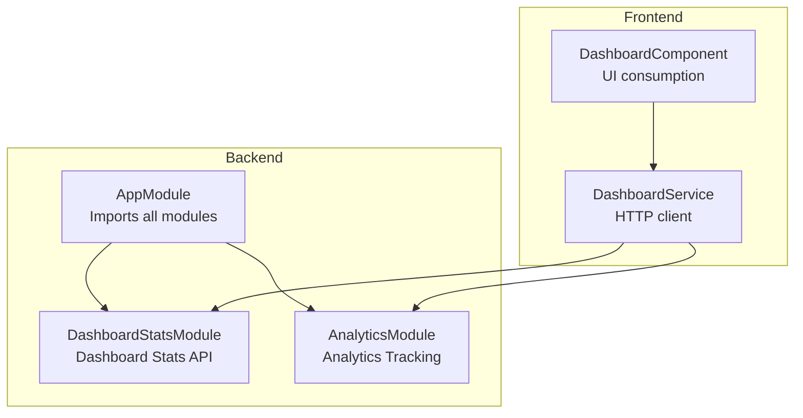
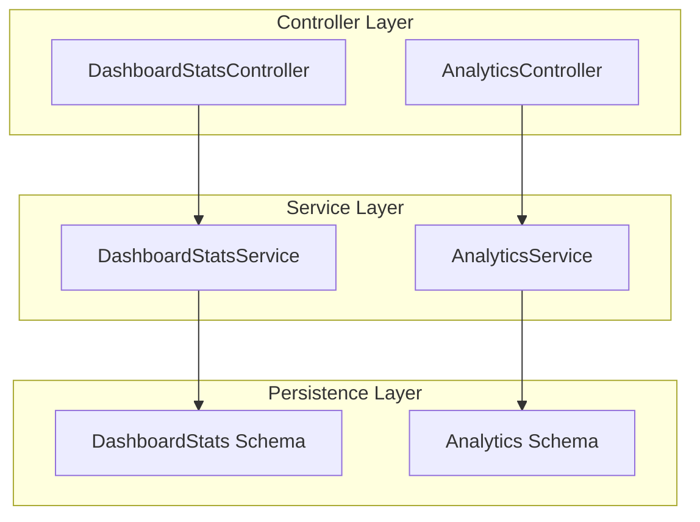
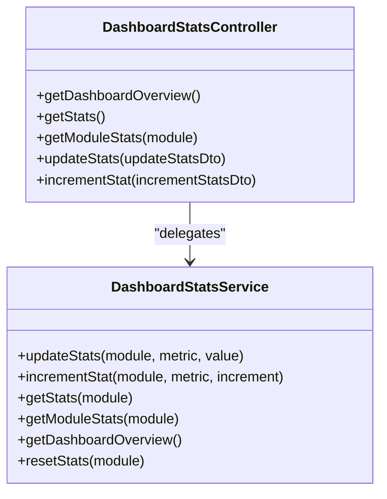
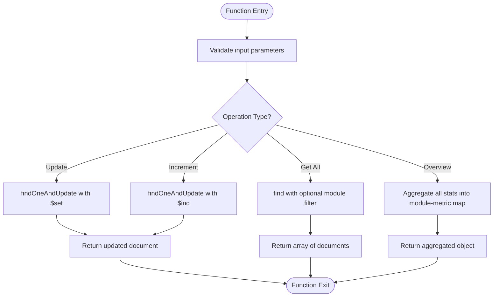
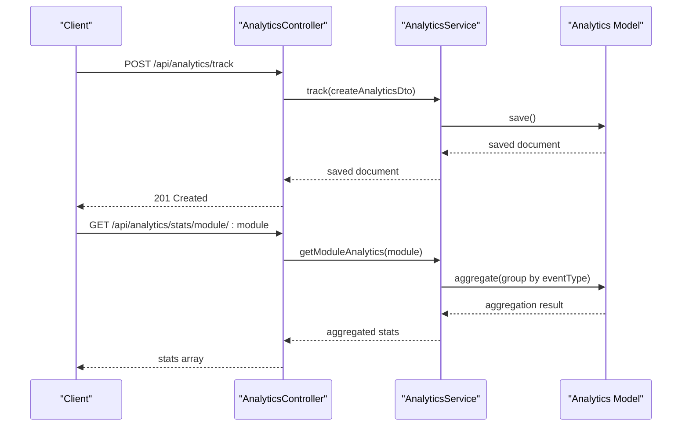
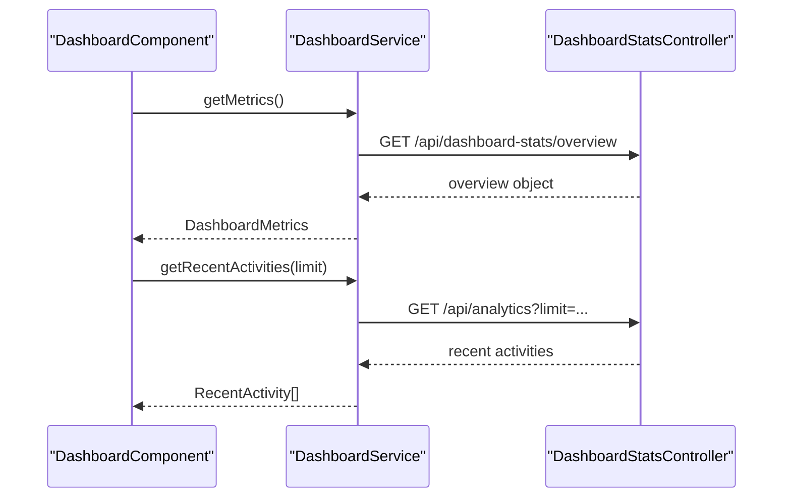
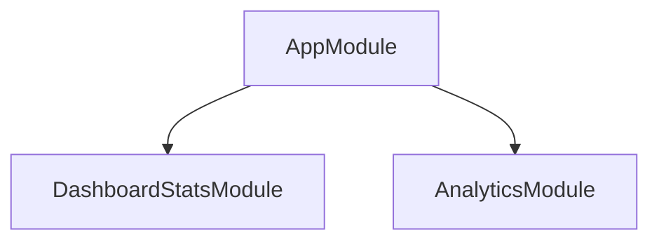

# Dashboard Statistics API

<cite>
**Referenced Files in This Document**
- [dashboard-stats.controller.ts](file://backend/src/dashboard-stats/dashboard-stats.controller.ts)
- [dashboard-stats.service.ts](file://backend/src/dashboard-stats/dashboard-stats.service.ts)
- [update-stats.dto.ts](file://backend/src/dashboard-stats/dto/update-stats.dto.ts)
- [dashboard-stats.schema.ts](file://backend/src/dashboard-stats/schemas/dashboard-stats.schema.ts)
- [dashboard-stats.module.ts](file://backend/src/dashboard-stats/dashboard-stats.module.ts)
- [analytics.controller.ts](file://backend/src/analytics/analytics.controller.ts)
- [analytics.service.ts](file://backend/src/analytics/analytics.service.ts)
- [analytics.dto.ts](file://backend/src/analytics/dto/analytics.dto.ts)
- [analytics.schema.ts](file://backend/src/analytics/schemas/analytics.schema.ts)
- [analytics.module.ts](file://backend/src/analytics/analytics.module.ts)
- [app.module.ts](file://backend/src/app.module.ts)
- [dashboard.service.ts](file://frontend/src/app/core/services/dashboard.service.ts)
- [dashboard.component.ts](file://frontend/src/app/features/dashboard/dashboard.component.ts)
- [environment.ts](file://frontend/src/environments/environment.ts)
</cite>

## Table of Contents
1. [Introduction](#introduction)
2. [Project Structure](#project-structure)
3. [Core Components](#core-components)
4. [Architecture Overview](#architecture-overview)
5. [Detailed Component Analysis](#detailed-component-analysis)
6. [Dependency Analysis](#dependency-analysis)
7. [Performance Considerations](#performance-considerations)
8. [Troubleshooting Guide](#troubleshooting-guide)
9. [Conclusion](#conclusion)

## Introduction
This document provides comprehensive API documentation for Dashboard Statistics endpoints. It covers endpoints for retrieving system overview statistics, user metrics, module usage analytics, and performance indicators. The documentation specifies HTTP methods, URL patterns, request/response schemas, filtering options, and aggregation capabilities. It also documents statistical data aggregation, trend analysis, real-time metric updates, caching strategies, performance optimization, and integration with the analytics system for comprehensive system monitoring.

## Project Structure
The Dashboard Statistics API is implemented within the NestJS backend under the `dashboard-stats` module. It integrates with the broader application via the main `AppModule`, which imports the `DashboardStatsModule`. The analytics module (`AnalyticsModule`) complements dashboard statistics by providing event tracking and analytics aggregation.



**Diagram sources**
- [app.module.ts](file://backend/src/app.module.ts#L17-L36)
- [dashboard-stats.module.ts](file://backend/src/dashboard-stats/dashboard-stats.module.ts#L7-L12)
- [analytics.module.ts](file://backend/src/analytics/analytics.module.ts#L7-L12)
- [dashboard.service.ts](file://frontend/src/app/core/services/dashboard.service.ts#L34-L36)

**Section sources**
- [app.module.ts](file://backend/src/app.module.ts#L1-L41)
- [dashboard-stats.module.ts](file://backend/src/dashboard-stats/dashboard-stats.module.ts#L1-L14)
- [analytics.module.ts](file://backend/src/analytics/analytics.module.ts#L1-L14)

## Core Components
This section documents the primary Dashboard Statistics endpoints, their HTTP methods, URL patterns, request/response schemas, and filtering options.

- Base URL: `/api/dashboard-stats`
- Authentication: JWT required (all endpoints are guarded)
- Content-Type: application/json

### Endpoints

#### Retrieve Dashboard Overview
- Method: GET
- URL: `/api/dashboard-stats/overview`
- Description: Returns aggregated statistics grouped by module and metric for the entire system.
- Response: Object keyed by module, with metric names as keys and numeric values.

Example response structure:
```json
{
  "blog": {
    "totalPosts": 120,
    "publishedPosts": 110,
    "draftPosts": 10
  },
  "youtube": {
    "totalVideos": 45,
    "totalViews": 12500
  }
}
```

**Section sources**
- [dashboard-stats.controller.ts](file://backend/src/dashboard-stats/dashboard-stats.controller.ts#L11-L14)
- [dashboard-stats.service.ts](file://backend/src/dashboard-stats/dashboard-stats.service.ts#L37-L49)

#### Retrieve All Statistics
- Method: GET
- URL: `/api/dashboard-stats`
- Description: Returns all statistics records, sorted by module and metric.
- Response: Array of statistic entries.

Example response entry:
```json
{
  "_id": "64f3a1b2c3d4e5f6a7b8c9d0",
  "module": "blog",
  "metric": "totalPosts",
  "value": 120,
  "createdAt": "2023-09-01T10:00:00Z",
  "updatedAt": "2023-09-01T10:00:00Z"
}
```

**Section sources**
- [dashboard-stats.controller.ts](file://backend/src/dashboard-stats/dashboard-stats.controller.ts#L16-L19)
- [dashboard-stats.service.ts](file://backend/src/dashboard-stats/dashboard-stats.service.ts#L28-L31)

#### Retrieve Module Statistics
- Method: GET
- URL: `/api/dashboard-stats/:module`
- Path Parameter: `module` (string)
- Description: Returns all statistics for a specified module.
- Response: Array of statistic entries for the given module.

**Section sources**
- [dashboard-stats.controller.ts](file://backend/src/dashboard-stats/dashboard-stats.controller.ts#L21-L24)
- [dashboard-stats.service.ts](file://backend/src/dashboard-stats/dashboard-stats.service.ts#L33-L35)

#### Update Statistic Value
- Method: PATCH
- URL: `/api/dashboard-stats/update`
- Description: Updates the value of a specific metric for a module. Upserts if the record does not exist.
- Request body: UpdateStatsDto
- Response: Updated statistic document.

Request schema (UpdateStatsDto):
- module: string
- metric: string
- value: number

**Section sources**
- [dashboard-stats.controller.ts](file://backend/src/dashboard-stats/dashboard-stats.controller.ts#L26-L29)
- [dashboard-stats.service.ts](file://backend/src/dashboard-stats/dashboard-stats.service.ts#L10-L17)
- [update-stats.dto.ts](file://backend/src/dashboard-stats/dto/update-stats.dto.ts#L3-L12)

#### Increment Statistic Value
- Method: PATCH
- URL: `/api/dashboard-stats/increment`
- Description: Increments the value of a specific metric for a module. Upserts if the record does not exist.
- Request body: IncrementStatsDto
- Response: Updated statistic document.

Request schema (IncrementStatsDto):
- module: string
- metric: string
- increment: number (optional, defaults to 1)

**Section sources**
- [dashboard-stats.controller.ts](file://backend/src/dashboard-stats/dashboard-stats.controller.ts#L31-L34)
- [dashboard-stats.service.ts](file://backend/src/dashboard-stats/dashboard-stats.service.ts#L19-L26)
- [update-stats.dto.ts](file://backend/src/dashboard-stats/dto/update-stats.dto.ts#L14-L24)

### Analytics Endpoints (Complementary)
While not part of the dashboard-stats module, the analytics module provides complementary endpoints for event tracking and trend analysis.

- Base URL: `/api/analytics`
- Authentication: JWT required

Key endpoints:
- Track event: POST `/api/analytics/track`
- Get events by module: GET `/api/analytics/module/:module`
- Get events by event type: GET `/api/analytics/event/:eventType`
- Get events by user: GET `/api/analytics/user/:userId`
- Aggregate module analytics: GET `/api/analytics/stats/module/:module`
- Event statistics: GET `/api/analytics/stats/events?module=...`
- Date range analytics: GET `/api/analytics/range?startDate=...&endDate=...&module=...`
- Increment event count: POST `/api/analytics/:module/increment/:eventType?increment=...`

Request/response schemas for analytics are defined in the analytics DTOs and schemas.

**Section sources**
- [analytics.controller.ts](file://backend/src/analytics/analytics.controller.ts#L22-L108)
- [analytics.service.ts](file://backend/src/analytics/analytics.service.ts#L11-L76)
- [analytics.dto.ts](file://backend/src/analytics/dto/analytics.dto.ts#L3-L35)
- [analytics.schema.ts](file://backend/src/analytics/schemas/analytics.schema.ts#L6-L28)

## Architecture Overview
The Dashboard Statistics API follows a layered architecture with clear separation of concerns:
- Controller layer handles HTTP requests and delegates to services.
- Service layer encapsulates business logic and database operations.
- Schema layer defines data models and validation rules.
- Module layer configures dependency injection and exports services.



**Diagram sources**
- [dashboard-stats.controller.ts](file://backend/src/dashboard-stats/dashboard-stats.controller.ts#L6-L9)
- [dashboard-stats.service.ts](file://backend/src/dashboard-stats/dashboard-stats.service.ts#L7-L8)
- [dashboard-stats.schema.ts](file://backend/src/dashboard-stats/schemas/dashboard-stats.schema.ts#L6-L22)
- [analytics.controller.ts](file://backend/src/analytics/analytics.controller.ts#L18-L20)
- [analytics.service.ts](file://backend/src/analytics/analytics.service.ts#L7-L9)
- [analytics.schema.ts](file://backend/src/analytics/schemas/analytics.schema.ts#L6-L28)

## Detailed Component Analysis

### DashboardStatsController
The controller exposes endpoints for retrieving dashboard overview, all statistics, module-specific statistics, and for updating/incrementing metrics.



**Diagram sources**
- [dashboard-stats.controller.ts](file://backend/src/dashboard-stats/dashboard-stats.controller.ts#L8-L35)
- [dashboard-stats.service.ts](file://backend/src/dashboard-stats/dashboard-stats.service.ts#L7-L54)

**Section sources**
- [dashboard-stats.controller.ts](file://backend/src/dashboard-stats/dashboard-stats.controller.ts#L1-L36)

### DashboardStatsService
The service implements CRUD-like operations for statistics, including upserts and aggregations.



**Diagram sources**
- [dashboard-stats.service.ts](file://backend/src/dashboard-stats/dashboard-stats.service.ts#L10-L49)

**Section sources**
- [dashboard-stats.service.ts](file://backend/src/dashboard-stats/dashboard-stats.service.ts#L1-L55)

### AnalyticsController and AnalyticsService
The analytics module provides event tracking and aggregation endpoints that complement dashboard statistics.



**Diagram sources**
- [analytics.controller.ts](file://backend/src/analytics/analytics.controller.ts#L22-L56)
- [analytics.service.ts](file://backend/src/analytics/analytics.service.ts#L11-L76)

**Section sources**
- [analytics.controller.ts](file://backend/src/analytics/analytics.controller.ts#L1-L110)
- [analytics.service.ts](file://backend/src/analytics/analytics.service.ts#L1-L78)

### Frontend Integration
The frontend consumes dashboard data through the DashboardService, which constructs HTTP requests to the backend API. The service defines typed interfaces for dashboard metrics and recent activities.



**Diagram sources**
- [dashboard.component.ts](file://frontend/src/app/features/dashboard/dashboard.component.ts#L35-L379)
- [dashboard.service.ts](file://frontend/src/app/core/services/dashboard.service.ts#L34-L101)
- [dashboard-stats.controller.ts](file://backend/src/dashboard-stats/dashboard-stats.controller.ts#L11-L14)
- [analytics.controller.ts](file://backend/src/analytics/analytics.controller.ts#L28-L32)

**Section sources**
- [dashboard.service.ts](file://frontend/src/app/core/services/dashboard.service.ts#L1-L102)
- [dashboard.component.ts](file://frontend/src/app/features/dashboard/dashboard.component.ts#L1-L379)
- [environment.ts](file://frontend/src/environments/environment.ts#L1-L6)

## Dependency Analysis
The application module orchestrates imports and configurations for all modules, ensuring the dashboard-stats and analytics modules are available throughout the application.



**Diagram sources**
- [app.module.ts](file://backend/src/app.module.ts#L17-L36)

**Section sources**
- [app.module.ts](file://backend/src/app.module.ts#L1-L41)

## Performance Considerations
- Database Indexing: Consider adding compound indexes on `{ module, metric }` to optimize frequent lookups and updates.
- Aggregation Efficiency: The overview aggregation iterates through all stats; for large datasets, pre-aggregate summaries or maintain summary collections.
- Caching Strategies: Implement Redis or in-memory caching for frequently accessed overview data to reduce database load.
- Pagination: For large datasets, introduce pagination parameters for listing endpoints.
- Real-time Updates: Use server-sent events (SSE) or WebSockets to push real-time metric updates to clients.
- Validation: DTO validation ensures data integrity; keep validators strict to prevent invalid writes.

## Troubleshooting Guide
- Authentication Issues: Ensure JWT tokens are included in Authorization headers for protected endpoints.
- Validation Errors: Verify request bodies conform to DTO schemas (string types for module and metric, numeric values for counts).
- Database Connectivity: Confirm MongoDB connection string in environment variables and network accessibility.
- CORS and Proxy: Ensure frontend base URL matches backend CORS configuration and proxy settings if applicable.
- Data Freshness: Implement cache invalidation or TTL for cached statistics to balance performance and freshness.

**Section sources**
- [dashboard-stats.controller.ts](file://backend/src/dashboard-stats/dashboard-stats.controller.ts#L1-L8)
- [update-stats.dto.ts](file://backend/src/dashboard-stats/dto/update-stats.dto.ts#L1-L25)
- [analytics.dto.ts](file://backend/src/analytics/dto/analytics.dto.ts#L1-L36)
- [environment.ts](file://frontend/src/environments/environment.ts#L1-L6)

## Conclusion
The Dashboard Statistics API provides a robust foundation for retrieving system overview statistics, managing module-specific metrics, and supporting real-time updates. By leveraging the analytics module, the system can perform trend analysis and event-driven aggregations. Proper indexing, caching, and real-time mechanisms will enhance performance and data freshness, enabling comprehensive system monitoring and informed decision-making.