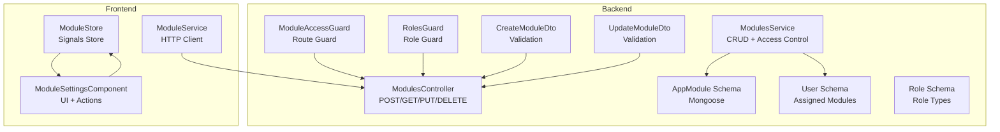
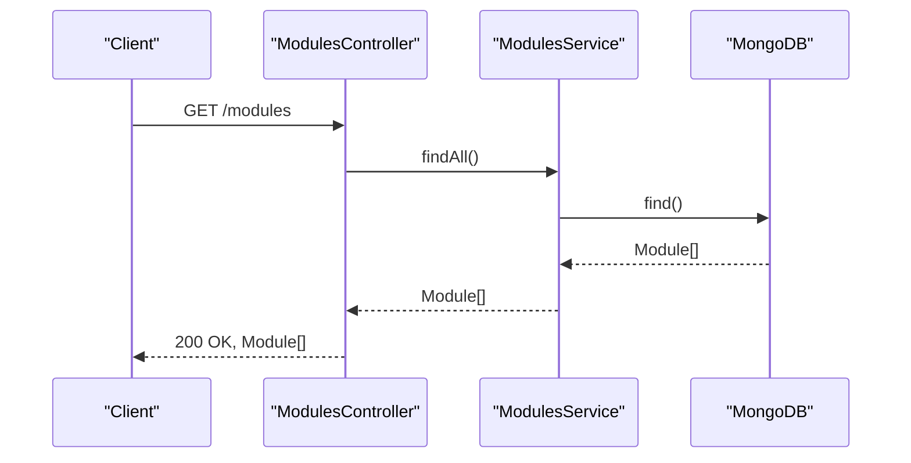
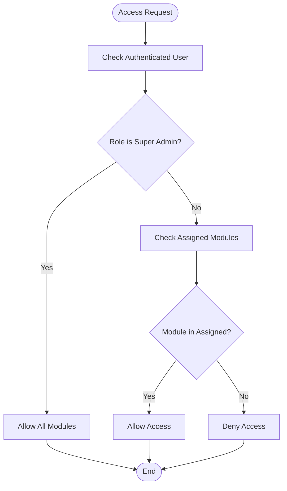
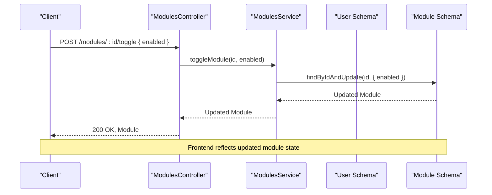
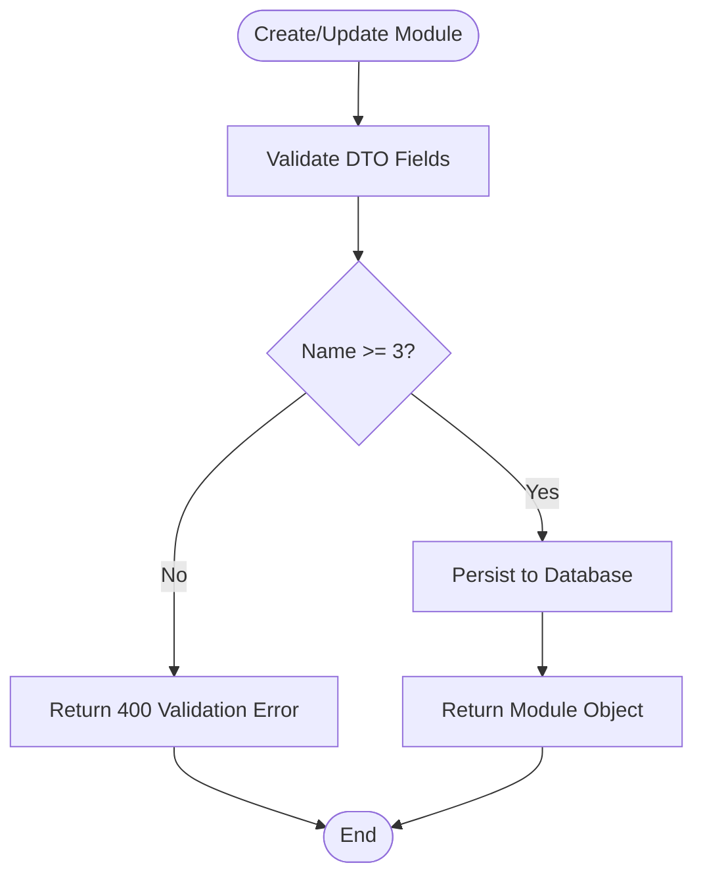
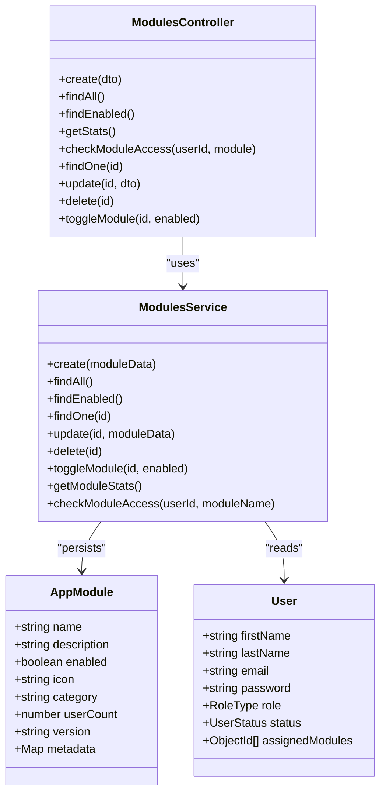

# Module Management API

<cite>
**Referenced Files in This Document**
- [modules.controller.ts](file://backend/src/modules/modules.controller.ts)
- [modules.service.ts](file://backend/src/modules/modules.service.ts)
- [create-module.dto.ts](file://backend/src/modules/dto/create-module.dto.ts)
- [update-module.dto.ts](file://backend/src/modules/dto/update-module.dto.ts)
- [module.schema.ts](file://backend/src/modules/schemas/module.schema.ts)
- [module-access.guard.ts](file://backend/src/auth/guards/module-access.guard.ts)
- [roles.guard.ts](file://backend/src/auth/guards/roles.guard.ts)
- [user.schema.ts](file://backend/src/users/schemas/user.schema.ts)
- [role.schema.ts](file://backend/src/roles/schemas/role.schema.ts)
- [module.service.ts](file://frontend/src/app/core/services/module.service.ts)
- [module.store.ts](file://frontend/src/app/core/store/module.store.ts)
- [module-settings.component.ts](file://frontend/src/app/features/admin/module-settings/module-settings.component.ts)
- [module-settings.component.html](file://frontend/src/app/features/admin/module-settings/module-settings.component.html)
</cite>

## Table of Contents
1. [Introduction](#introduction)
2. [Project Structure](#project-structure)
3. [Core Components](#core-components)
4. [Architecture Overview](#architecture-overview)
5. [Detailed Component Analysis](#detailed-component-analysis)
6. [Dependency Analysis](#dependency-analysis)
7. [Performance Considerations](#performance-considerations)
8. [Troubleshooting Guide](#troubleshooting-guide)
9. [Conclusion](#conclusion)

## Introduction
This document provides comprehensive API documentation for Module Management endpoints. It covers enabling/disabling modules, configuring module settings, managing module access controls, status monitoring, dependency management, and dynamic module loading. It also documents module health checks, dependency resolution, configuration validation, lifecycle management, rollback procedures, and integration with the role-based access control system.

## Project Structure
The Module Management feature spans backend NestJS controllers and services, Mongoose schemas, DTOs, and frontend Angular services and stores. The backend enforces JWT authentication and role-based access control, while the frontend manages module state and user interactions.

**Diagram sources**
- [modules.controller.ts](file://backend/src/modules/modules.controller.ts#L1-L58)
- [modules.service.ts](file://backend/src/modules/modules.service.ts#L1-L94)
- [create-module.dto.ts](file://backend/src/modules/dto/create-module.dto.ts#L1-L29)
- [update-module.dto.ts](file://backend/src/modules/dto/update-module.dto.ts#L1-L25)
- [module.schema.ts](file://backend/src/modules/schemas/module.schema.ts#L1-L32)
- [module-access.guard.ts](file://backend/src/auth/guards/module-access.guard.ts#L1-L28)
- [roles.guard.ts](file://backend/src/auth/guards/roles.guard.ts#L1-L23)
- [user.schema.ts](file://backend/src/users/schemas/user.schema.ts#L1-L66)
- [role.schema.ts](file://backend/src/roles/schemas/role.schema.ts#L1-L25)
- [module.service.ts](file://frontend/src/app/core/services/module.service.ts#L1-L139)
- [module.store.ts](file://frontend/src/app/core/store/module.store.ts#L1-L175)
- [module-settings.component.ts](file://frontend/src/app/features/admin/module-settings/module-settings.component.ts#L1-L142)

**Section sources**
- [modules.controller.ts](file://backend/src/modules/modules.controller.ts#L1-L58)
- [modules.service.ts](file://backend/src/modules/modules.service.ts#L1-L94)
- [module.schema.ts](file://backend/src/modules/schemas/module.schema.ts#L1-L32)
- [module-access.guard.ts](file://backend/src/auth/guards/module-access.guard.ts#L1-L28)
- [roles.guard.ts](file://backend/src/auth/guards/roles.guard.ts#L1-L23)
- [user.schema.ts](file://backend/src/users/schemas/user.schema.ts#L1-L66)
- [role.schema.ts](file://backend/src/roles/schemas/role.schema.ts#L1-L25)
- [module.service.ts](file://frontend/src/app/core/services/module.service.ts#L1-L139)
- [module.store.ts](file://frontend/src/app/core/store/module.store.ts#L1-L175)
- [module-settings.component.ts](file://frontend/src/app/features/admin/module-settings/module-settings.component.ts#L1-L142)

## Core Components
- ModulesController: Exposes REST endpoints for module CRUD, toggling, stats, and access checks.
- ModulesService: Implements business logic for module operations, access control, and statistics.
- Validation DTOs: Define request schemas and validation rules for module creation and updates.
- Mongoose Schema: Defines module data model including fields like name, description, enabled, icon, category, userCount, version, and metadata.
- Guards: Enforce JWT authentication and module-specific access control.
- Frontend Services and Stores: Manage module state, UI actions, and HTTP interactions.

**Section sources**
- [modules.controller.ts](file://backend/src/modules/modules.controller.ts#L1-L58)
- [modules.service.ts](file://backend/src/modules/modules.service.ts#L1-L94)
- [create-module.dto.ts](file://backend/src/modules/dto/create-module.dto.ts#L1-L29)
- [update-module.dto.ts](file://backend/src/modules/dto/update-module.dto.ts#L1-L25)
- [module.schema.ts](file://backend/src/modules/schemas/module.schema.ts#L1-L32)
- [module-access.guard.ts](file://backend/src/auth/guards/module-access.guard.ts#L1-L28)
- [roles.guard.ts](file://backend/src/auth/guards/roles.guard.ts#L1-L23)
- [module.service.ts](file://frontend/src/app/core/services/module.service.ts#L1-L139)
- [module.store.ts](file://frontend/src/app/core/store/module.store.ts#L1-L175)

## Architecture Overview
The Module Management API follows a layered architecture:
- Controllers handle HTTP requests and delegate to services.
- Services encapsulate business logic, including access control and statistics computation.
- Schemas define persistence models and relationships.
- Guards enforce authentication and authorization.
- Frontend integrates via HTTP client and signals store for reactive UI updates.

**Diagram sources**
- [modules.controller.ts](file://backend/src/modules/modules.controller.ts#L16-L19)
- [modules.service.ts](file://backend/src/modules/modules.service.ts#L19-L21)

**Section sources**
- [modules.controller.ts](file://backend/src/modules/modules.controller.ts#L1-L58)
- [modules.service.ts](file://backend/src/modules/modules.service.ts#L1-L94)

## Detailed Component Analysis

### API Endpoints

#### Base Path
- Base URL: `/modules`

#### Authentication and Authorization
- All endpoints are protected by JWT authentication.
- Additional module access guard restricts routes to authorized modules for the requesting user.
- Roles guard supports role-based restrictions at controller/method level.

**Section sources**
- [modules.controller.ts](file://backend/src/modules/modules.controller.ts#L6-L7)
- [module-access.guard.ts](file://backend/src/auth/guards/module-access.guard.ts#L1-L28)
- [roles.guard.ts](file://backend/src/auth/guards/roles.guard.ts#L1-L23)

#### Endpoint Catalog

- **Create Module**
  - Method: POST
  - URL: `/modules`
  - Authenticated: Yes
  - Request body: CreateModuleDto
  - Response: Module object
  - Validation rules:
    - name: string, min length 3, required
    - description: string, optional
    - icon: string, optional
    - enabled: boolean, optional (default true)
    - route: string, optional

  **Section sources**
  - [modules.controller.ts](file://backend/src/modules/modules.controller.ts#L11-L14)
  - [create-module.dto.ts](file://backend/src/modules/dto/create-module.dto.ts#L3-L23)

- **List All Modules**
  - Method: GET
  - URL: `/modules`
  - Authenticated: Yes
  - Response: Array of Module objects

  **Section sources**
  - [modules.controller.ts](file://backend/src/modules/modules.controller.ts#L16-L19)

- **List Enabled Modules**
  - Method: GET
  - URL: `/modules/enabled`
  - Authenticated: Yes
  - Response: Array of enabled Module objects

  **Section sources**
  - [modules.controller.ts](file://backend/src/modules/modules.controller.ts#L21-L24)

- **Get Module Stats**
  - Method: GET
  - URL: `/modules/stats`
  - Authenticated: Yes
  - Response: Array of { id, name, enabled, userCount, description }

  **Section sources**
  - [modules.controller.ts](file://backend/src/modules/modules.controller.ts#L26-L29)

- **Check Module Access**
  - Method: GET
  - URL: `/modules/access`
  - Query params:
    - userId: string (required)
    - module: string (required)
  - Authenticated: Yes
  - Response: boolean

  **Section sources**
  - [modules.controller.ts](file://backend/src/modules/modules.controller.ts#L31-L37)

- **Get Module by ID**
  - Method: GET
  - URL: `/modules/:id`
  - Authenticated: Yes
  - Response: Module object

  **Section sources**
  - [modules.controller.ts](file://backend/src/modules/modules.controller.ts#L39-L42)

- **Update Module**
  - Method: PUT
  - URL: `/modules/:id`
  - Authenticated: Yes
  - Request body: UpdateModuleDto
  - Response: Updated Module object
  - Validation rules:
    - name: string, min length 3, optional
    - description: string, optional
    - icon: string, optional
    - enabled: boolean, optional
    - route: string, optional

  **Section sources**
  - [modules.controller.ts](file://backend/src/modules/modules.controller.ts#L44-L47)
  - [update-module.dto.ts](file://backend/src/modules/dto/update-module.dto.ts#L3-L24)

- **Delete Module**
  - Method: DELETE
  - URL: `/modules/:id`
  - Authenticated: Yes
  - Response: Deletion result

  **Section sources**
  - [modules.controller.ts](file://backend/src/modules/modules.controller.ts#L49-L52)

- **Toggle Module**
  - Method: POST
  - URL: `/modules/:id/toggle`
  - Authenticated: Yes
  - Request body: { enabled: boolean }
  - Response: Updated Module object

  **Section sources**
  - [modules.controller.ts](file://backend/src/modules/modules.controller.ts#L54-L57)

### Request/Response Schemas

#### Module Object
- Fields:
  - id: string
  - name: string
  - description: string
  - enabled: boolean
  - icon: string
  - category: string
  - userCount: number
  - version: string
  - metadata: Record<string, string>
  - createdAt: Date
  - updatedAt: Date

**Section sources**
- [module.schema.ts](file://backend/src/modules/schemas/module.schema.ts#L5-L29)

#### CreateModuleDto
- Fields:
  - name: string (min length 3)
  - description: string (optional)
  - icon: string (optional)
  - enabled: boolean (optional)
  - route: string (optional)

**Section sources**
- [create-module.dto.ts](file://backend/src/modules/dto/create-module.dto.ts#L3-L23)

#### UpdateModuleDto
- Fields:
  - name: string (min length 3, optional)
  - description: string (optional)
  - icon: string (optional)
  - enabled: boolean (optional)
  - route: string (optional)

**Section sources**
- [update-module.dto.ts](file://backend/src/modules/dto/update-module.dto.ts#L3-L24)

### Validation Rules
- name must be at least 3 characters long for both create and update operations.
- enabled defaults to true for new modules.
- Optional fields allow partial updates.

**Section sources**
- [create-module.dto.ts](file://backend/src/modules/dto/create-module.dto.ts#L4-L6)
- [update-module.dto.ts](file://backend/src/modules/dto/update-module.dto.ts#L4-L7)
- [module.schema.ts](file://backend/src/modules/schemas/module.schema.ts#L12-L13)

### Access Control Enforcement
- JWT authentication is enforced at the controller level.
- ModuleAccessGuard verifies:
  - Super admin access to all modules.
  - Assigned modules membership for regular users.
- RolesGuard supports role-based restrictions via decorators.

**Diagram sources**
- [module-access.guard.ts](file://backend/src/auth/guards/module-access.guard.ts#L7-L26)
- [user.schema.ts](file://backend/src/users/schemas/user.schema.ts#L33-L34)
- [role.schema.ts](file://backend/src/roles/schemas/role.schema.ts#L4-L8)

**Section sources**
- [module-access.guard.ts](file://backend/src/auth/guards/module-access.guard.ts#L1-L28)
- [roles.guard.ts](file://backend/src/auth/guards/roles.guard.ts#L1-L23)
- [user.schema.ts](file://backend/src/users/schemas/user.schema.ts#L1-L66)
- [role.schema.ts](file://backend/src/roles/schemas/role.schema.ts#L1-L25)

### Module Status Monitoring
- Enabled modules endpoint filters modules by enabled flag.
- Stats endpoint aggregates id, name, enabled, userCount, and description.

**Section sources**
- [modules.controller.ts](file://backend/src/modules/modules.controller.ts#L21-L29)
- [modules.service.ts](file://backend/src/modules/modules.service.ts#L23-L54)

### Dependency Management and Dynamic Loading
- Module assignment is managed via user schema’s assignedModules array.
- Access checks resolve module availability and user entitlements.
- Dynamic toggling enables immediate effect on module visibility and access.

**Diagram sources**
- [modules.controller.ts](file://backend/src/modules/modules.controller.ts#L54-L57)
- [modules.service.ts](file://backend/src/modules/modules.service.ts#L39-L43)
- [user.schema.ts](file://backend/src/users/schemas/user.schema.ts#L33-L34)

**Section sources**
- [modules.controller.ts](file://backend/src/modules/modules.controller.ts#L54-L57)
- [modules.service.ts](file://backend/src/modules/modules.service.ts#L39-L43)
- [user.schema.ts](file://backend/src/users/schemas/user.schema.ts#L33-L34)

### Configuration Validation Workflow

**Diagram sources**
- [create-module.dto.ts](file://backend/src/modules/dto/create-module.dto.ts#L4-L6)
- [update-module.dto.ts](file://backend/src/modules/dto/update-module.dto.ts#L4-L7)
- [modules.controller.ts](file://backend/src/modules/modules.controller.ts#L11-L14)
- [modules.controller.ts](file://backend/src/modules/modules.controller.ts#L44-L47)

**Section sources**
- [create-module.dto.ts](file://backend/src/modules/dto/create-module.dto.ts#L1-L29)
- [update-module.dto.ts](file://backend/src/modules/dto/update-module.dto.ts#L1-L25)
- [modules.controller.ts](file://backend/src/modules/modules.controller.ts#L11-L14)
- [modules.controller.ts](file://backend/src/modules/modules.controller.ts#L44-L47)

### Module Lifecycle Management
- Create: Registers a new module with validation.
- Update: Modifies module attributes.
- Toggle: Enables or disables a module.
- Delete: Removes a module.
- Stats: Provides operational metrics.

**Section sources**
- [modules.controller.ts](file://backend/src/modules/modules.controller.ts#L11-L57)
- [modules.service.ts](file://backend/src/modules/modules.service.ts#L14-L37)
- [modules.service.ts](file://backend/src/modules/modules.service.ts#L45-L54)

### Rollback Procedures
- Frontend store reverts changes on save failure by restoring previous enabled state.
- UI indicates revert and error messaging.

**Section sources**
- [module.store.ts](file://frontend/src/app/core/store/module.store.ts#L126-L144)

### Integration with Role-Based Access Control
- Super admin bypasses module assignment checks.
- Admins gain access to all enabled modules by default.
- Regular users require explicit module assignment.

**Section sources**
- [modules.service.ts](file://backend/src/modules/modules.service.ts#L66-L86)
- [user.schema.ts](file://backend/src/users/schemas/user.schema.ts#L33-L34)
- [role.schema.ts](file://backend/src/roles/schemas/role.schema.ts#L4-L8)

## Dependency Analysis

**Diagram sources**
- [modules.controller.ts](file://backend/src/modules/modules.controller.ts#L8-L9)
- [modules.service.ts](file://backend/src/modules/modules.service.ts#L9-L12)
- [module.schema.ts](file://backend/src/modules/schemas/module.schema.ts#L5-L29)
- [user.schema.ts](file://backend/src/users/schemas/user.schema.ts#L14-L41)

**Section sources**
- [modules.controller.ts](file://backend/src/modules/modules.controller.ts#L1-L58)
- [modules.service.ts](file://backend/src/modules/modules.service.ts#L1-L94)
- [module.schema.ts](file://backend/src/modules/schemas/module.schema.ts#L1-L32)
- [user.schema.ts](file://backend/src/users/schemas/user.schema.ts#L1-L66)

## Performance Considerations
- Use filtering endpoints (enabled, stats) to reduce payload sizes.
- Batch updates in frontend store minimize network requests.
- Indexes on module name and user assignedModules improve query performance.
- Avoid frequent polling; rely on store updates and server events where applicable.

## Troubleshooting Guide
- Validation errors: Ensure name meets minimum length and optional fields are properly formatted.
- Access denied: Verify user role and assigned modules; super admin bypass applies.
- Toggle failures: Confirm module exists and user has appropriate permissions.
- Stats discrepancies: Check userCount field updates and module enabled state.

**Section sources**
- [create-module.dto.ts](file://backend/src/modules/dto/create-module.dto.ts#L4-L6)
- [update-module.dto.ts](file://backend/src/modules/dto/update-module.dto.ts#L4-L7)
- [modules.service.ts](file://backend/src/modules/modules.service.ts#L56-L93)
- [module-access.guard.ts](file://backend/src/auth/guards/module-access.guard.ts#L11-L23)

## Conclusion
The Module Management API provides a robust foundation for controlling modules across the system. It enforces strict validation, integrates with role-based access control, and offers comprehensive monitoring and lifecycle operations. The frontend store ensures responsive UI updates with built-in rollback capabilities for safe configuration changes.