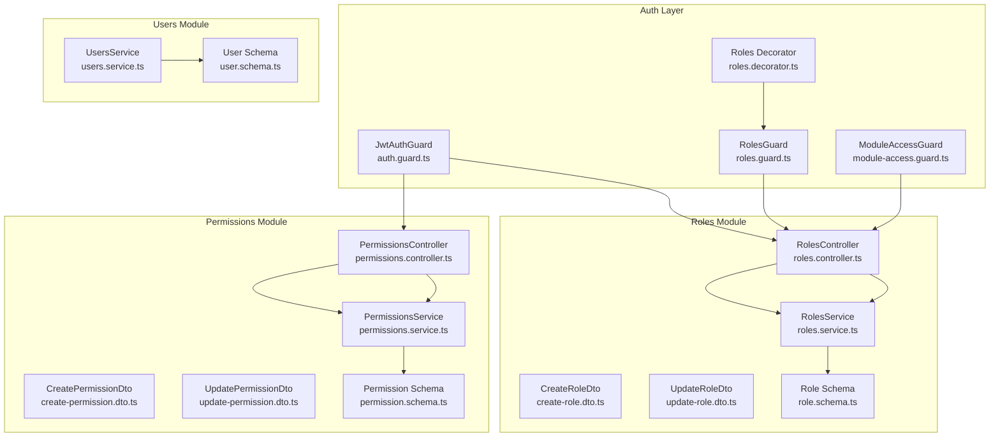
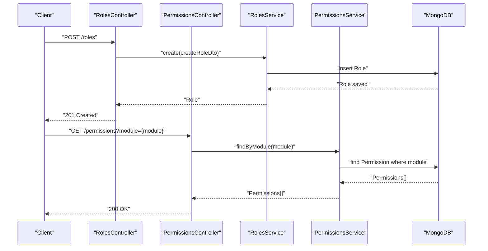
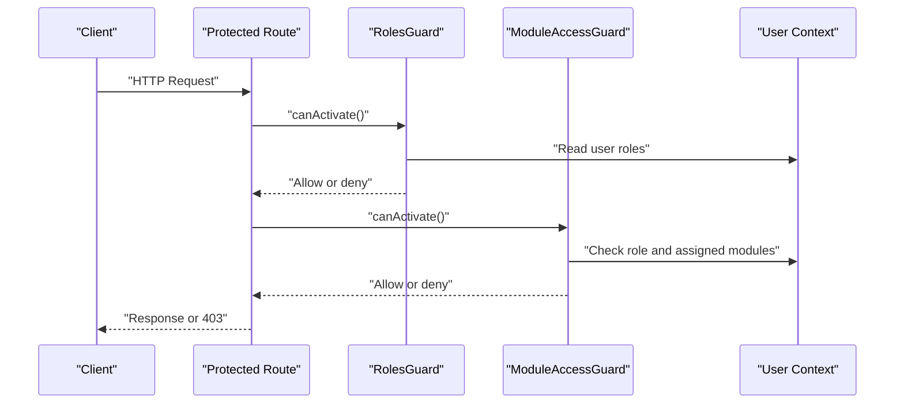
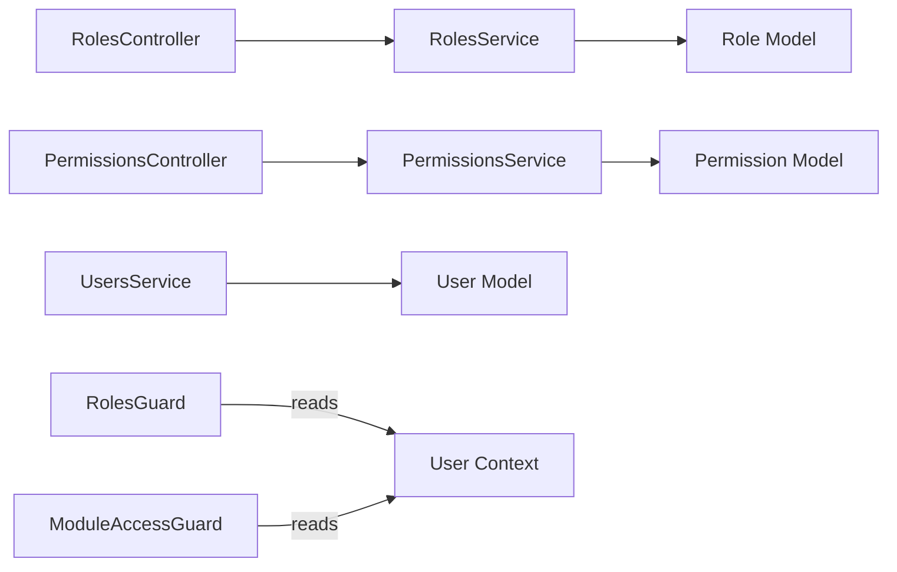
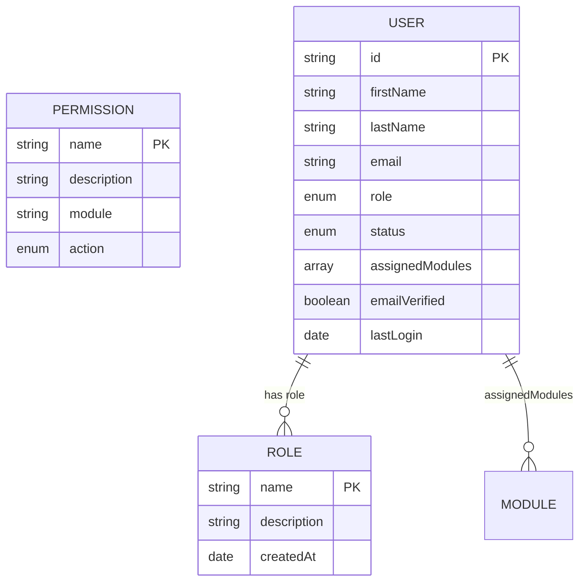

# Role & Permission API

<cite>
**Referenced Files in This Document**
- [roles.controller.ts](file://backend/src/roles/roles.controller.ts)
- [roles.service.ts](file://backend/src/roles/roles.service.ts)
- [create-role.dto.ts](file://backend/src/roles/dto/create-role.dto.ts)
- [update-role.dto.ts](file://backend/src/roles/dto/update-role.dto.ts)
- [role.schema.ts](file://backend/src/roles/schemas/role.schema.ts)
- [permissions.controller.ts](file://backend/src/permissions/permissions.controller.ts)
- [permissions.service.ts](file://backend/src/permissions/permissions.service.ts)
- [create-permission.dto.ts](file://backend/src/permissions/dto/create-permission.dto.ts)
- [update-permission.dto.ts](file://backend/src/permissions/dto/update-permission.dto.ts)
- [permission.schema.ts](file://backend/src/permissions/schemas/permission.schema.ts)
- [users.service.ts](file://backend/src/users/users.service.ts)
- [user.schema.ts](file://backend/src/users/schemas/user.schema.ts)
- [roles.guard.ts](file://backend/src/auth/guards/roles.guard.ts)
- [roles.decorator.ts](file://backend/src/auth/decorators/roles.decorator.ts)
- [module-access.guard.ts](file://backend/src/auth/guards/module-access.guard.ts)
- [auth.guard.ts](file://backend/src/auth/guards/auth.guard.ts)
- [app.module.ts](file://backend/src/app.module.ts)
</cite>

## Table of Contents
1. [Introduction](#introduction)
2. [Project Structure](#project-structure)
3. [Core Components](#core-components)
4. [Architecture Overview](#architecture-overview)
5. [Detailed Component Analysis](#detailed-component-analysis)
6. [Dependency Analysis](#dependency-analysis)
7. [Performance Considerations](#performance-considerations)
8. [Troubleshooting Guide](#troubleshooting-guide)
9. [Conclusion](#conclusion)
10. [Appendices](#appendices)

## Introduction
This document provides comprehensive API documentation for Role and Permission management within the Multi-Application Control Dashboard. It covers endpoints for role creation, retrieval, updates, and deletion, along with permission management endpoints for assigning, retrieving, updating, and deleting permissions. It also documents hierarchical role structures, inheritance patterns, dynamic permission evaluation, role-based access control (RBAC), and module-level access controls. Validation rules, request/response schemas, and audit trail requirements for administrative actions are specified.

## Project Structure
The Role and Permission APIs are implemented as separate NestJS modules with dedicated controllers, services, DTOs, and Mongoose schemas. Authentication is enforced via JWT, and authorization is handled by role and module access guards. Users are associated with roles and assigned modules.

**Diagram sources**
- [roles.controller.ts](file://backend/src/roles/roles.controller.ts#L1-L46)
- [roles.service.ts](file://backend/src/roles/roles.service.ts#L1-L47)
- [create-role.dto.ts](file://backend/src/roles/dto/create-role.dto.ts#L1-L25)
- [update-role.dto.ts](file://backend/src/roles/dto/update-role.dto.ts#L1-L21)
- [role.schema.ts](file://backend/src/roles/schemas/role.schema.ts#L1-L25)
- [permissions.controller.ts](file://backend/src/permissions/permissions.controller.ts#L1-L39)
- [permissions.service.ts](file://backend/src/permissions/permissions.service.ts#L1-L35)
- [create-permission.dto.ts](file://backend/src/permissions/dto/create-permission.dto.ts#L1-L23)
- [update-permission.dto.ts](file://backend/src/permissions/dto/update-permission.dto.ts#L1-L21)
- [permission.schema.ts](file://backend/src/permissions/schemas/permission.schema.ts#L1-L20)
- [users.service.ts](file://backend/src/users/users.service.ts#L1-L78)
- [user.schema.ts](file://backend/src/users/schemas/user.schema.ts#L1-L66)
- [roles.guard.ts](file://backend/src/auth/guards/roles.guard.ts#L1-L23)
- [roles.decorator.ts](file://backend/src/auth/decorators/roles.decorator.ts#L1-L5)
- [module-access.guard.ts](file://backend/src/auth/guards/module-access.guard.ts#L1-L28)
- [auth.guard.ts](file://backend/src/auth/guards/auth.guard.ts#L1-L26)
- [app.module.ts](file://backend/src/app.module.ts#L1-L41)

**Section sources**
- [app.module.ts](file://backend/src/app.module.ts#L1-L41)

## Core Components
- Roles Module: Manages roles, including creation, listing, retrieval, updates, deletions, and assignment of permissions and modules.
- Permissions Module: Manages permissions, including creation, listing (with optional module filter), retrieval, updates, and deletions.
- Users Module: Associates users with roles and assigned modules; supports role and module assignment.
- Guards and Decorators: Enforce JWT authentication, role-based authorization, and module-level access control.

Key responsibilities:
- RolesController: Exposes REST endpoints for roles and permission/module assignments.
- PermissionsController: Exposes REST endpoints for permissions with module filtering.
- RolesService and PermissionsService: Implement CRUD operations against MongoDB via Mongoose.
- RolesGuard and ModuleAccessGuard: Enforce authorization policies at runtime.
- UsersService: Supports role and module assignment to users.

**Section sources**
- [roles.controller.ts](file://backend/src/roles/roles.controller.ts#L1-L46)
- [permissions.controller.ts](file://backend/src/permissions/permissions.controller.ts#L1-L39)
- [roles.service.ts](file://backend/src/roles/roles.service.ts#L1-L47)
- [permissions.service.ts](file://backend/src/permissions/permissions.service.ts#L1-L35)
- [users.service.ts](file://backend/src/users/users.service.ts#L1-L78)
- [roles.guard.ts](file://backend/src/auth/guards/roles.guard.ts#L1-L23)
- [module-access.guard.ts](file://backend/src/auth/guards/module-access.guard.ts#L1-L28)

## Architecture Overview
The system enforces authentication via JWT and authorization via role and module guards. Controllers delegate to services, which persist data using Mongoose models. Users are associated with roles and assigned modules, enabling fine-grained access control.

**Diagram sources**
- [roles.controller.ts](file://backend/src/roles/roles.controller.ts#L11-L14)
- [permissions.controller.ts](file://backend/src/permissions/permissions.controller.ts#L17-L22)
- [roles.service.ts](file://backend/src/roles/roles.service.ts#L10-L13)
- [permissions.service.ts](file://backend/src/permissions/permissions.service.ts#L19-L21)

## Detailed Component Analysis

### Roles Management Endpoints
- Base Path: /roles
- Authentication: JWT required
- Authorization: RolesGuard applies per endpoint as configured by decorators

Endpoints:
- POST /roles
  - Purpose: Create a new role
  - Auth: JWT
  - Request body: CreateRoleDto
  - Response: Role object
  - Validation rules:
    - name: string, minimum length 3, required
    - description: string, optional
    - permissions: array of strings, optional
    - modules: array of strings, optional

- GET /roles
  - Purpose: List all roles
  - Auth: JWT
  - Response: Array of Role objects

- GET /roles/:id
  - Purpose: Retrieve a role by ID
  - Auth: JWT
  - Response: Role object

- PUT /roles/:id
  - Purpose: Update a role by ID
  - Auth: JWT
  - Request body: UpdateRoleDto
  - Response: Updated Role object
  - Validation rules:
    - name: string, minimum length 3, optional
    - description: string, optional
    - permissions: array of strings, optional
    - modules: array of strings, optional

- DELETE /roles/:id
  - Purpose: Delete a role by ID
  - Auth: JWT
  - Response: Deletion result

- POST /roles/:id/permissions
  - Purpose: Assign permissions to a role
  - Auth: JWT
  - Request body: { permissions: string[] }
  - Response: Updated Role object

- POST /roles/:id/modules
  - Purpose: Assign modules to a role
  - Auth: JWT
  - Request body: { modules: string[] }
  - Response: Updated Role object

Validation and schemas:
- CreateRoleDto and UpdateRoleDto define field constraints.
- Role schema defines persisted fields and defaults.

Example request/response (paths):
- Request: [CreateRoleDto](file://backend/src/roles/dto/create-role.dto.ts#L3-L19)
- Response: [Role schema](file://backend/src/roles/schemas/role.schema.ts#L12-L22)

**Section sources**
- [roles.controller.ts](file://backend/src/roles/roles.controller.ts#L1-L46)
- [create-role.dto.ts](file://backend/src/roles/dto/create-role.dto.ts#L1-L25)
- [update-role.dto.ts](file://backend/src/roles/dto/update-role.dto.ts#L1-L21)
- [role.schema.ts](file://backend/src/roles/schemas/role.schema.ts#L1-L25)

### Permissions Management Endpoints
- Base Path: /permissions
- Authentication: JWT required
- Authorization: RolesGuard applies per endpoint as configured by decorators

Endpoints:
- POST /permissions
  - Purpose: Create a new permission
  - Auth: JWT
  - Request body: CreatePermissionDto
  - Response: Permission object
  - Validation rules:
    - name: string, minimum length 3, required
    - description: string, required
    - module: string, required
    - action: string, enum ["create","read","update","delete"], required

- GET /permissions
  - Purpose: List all permissions
  - Auth: JWT
  - Query: module (optional)
  - Response: Array of Permission objects
  - Behavior: If module query param is present, filters by module

- GET /permissions/:id
  - Purpose: Retrieve a permission by ID
  - Auth: JWT
  - Response: Permission object

- PUT /permissions/:id
  - Purpose: Update a permission by ID
  - Auth: JWT
  - Request body: UpdatePermissionDto
  - Response: Updated Permission object
  - Validation rules:
    - name: string, minimum length 3, optional
    - description: string, optional
    - module: string, optional
    - action: string, optional

- DELETE /permissions/:id
  - Purpose: Delete a permission by ID
  - Auth: JWT
  - Response: Deletion result

Validation and schemas:
- CreatePermissionDto and UpdatePermissionDto define field constraints.
- Permission schema defines persisted fields and enums.

Example request/response (paths):
- Request: [CreatePermissionDto](file://backend/src/permissions/dto/create-permission.dto.ts#L3-L17)
- Response: [Permission schema](file://backend/src/permissions/schemas/permission.schema.ts#L4-L17)

**Section sources**
- [permissions.controller.ts](file://backend/src/permissions/permissions.controller.ts#L1-L39)
- [create-permission.dto.ts](file://backend/src/permissions/dto/create-permission.dto.ts#L1-L23)
- [update-permission.dto.ts](file://backend/src/permissions/dto/update-permission.dto.ts#L1-L21)
- [permission.schema.ts](file://backend/src/permissions/schemas/permission.schema.ts#L1-L20)

### Role-Based Access Control (RBAC) and Module Access
- RolesGuard: Enforces role-based authorization using the Roles decorator metadata.
- ModuleAccessGuard: Restricts access to specific modules for users based on assigned modules; super admin bypasses checks.
- JwtAuthGuard: Ensures requests are authenticated via JWT.

Authorization flow:
- Controllers can apply the Roles decorator to require specific roles.
- RolesGuard reads required roles from metadata and checks user role membership.
- ModuleAccessGuard verifies module access for protected routes.

**Diagram sources**
- [roles.guard.ts](file://backend/src/auth/guards/roles.guard.ts#L10-L21)
- [module-access.guard.ts](file://backend/src/auth/guards/module-access.guard.ts#L7-L26)
- [roles.decorator.ts](file://backend/src/auth/decorators/roles.decorator.ts#L3-L4)

**Section sources**
- [roles.guard.ts](file://backend/src/auth/guards/roles.guard.ts#L1-L23)
- [module-access.guard.ts](file://backend/src/auth/guards/module-access.guard.ts#L1-L28)
- [roles.decorator.ts](file://backend/src/auth/decorators/roles.decorator.ts#L1-L5)
- [auth.guard.ts](file://backend/src/auth/guards/auth.guard.ts#L1-L26)

### Hierarchical Roles and Inheritance Patterns
- RoleType enum defines supported roles: super_admin, admin, viewer.
- Users are associated with a single role (enum) via the User schema.
- Inheritance patterns are not explicitly modeled in the schema; however, super admin can bypass module access checks.

Implications:
- Hierarchical inheritance is not represented in the current schema.
- To implement inheritance, consider adding a parent role reference and evaluating permissions transitively.

**Section sources**
- [role.schema.ts](file://backend/src/roles/schemas/role.schema.ts#L4-L8)
- [user.schema.ts](file://backend/src/users/schemas/user.schema.ts#L27-L28)
- [module-access.guard.ts](file://backend/src/auth/guards/module-access.guard.ts#L15-L18)

### Dynamic Permission Evaluation and Caching Strategies
Dynamic evaluation:
- Permissions are evaluated at runtime using RolesGuard and ModuleAccessGuard.
- ModuleAccessGuard allows super admin access and validates module assignments for regular users.

Caching strategies:
- Suggested approaches:
  - Cache resolved permissions per user session after initial load.
  - Invalidate cache on role or module changes.
  - Cache module-to-permissions mappings server-side for frequent queries.

Note: Current implementation does not include explicit caching; caching can be introduced in services or via external cache stores.

**Section sources**
- [roles.guard.ts](file://backend/src/auth/guards/roles.guard.ts#L10-L21)
- [module-access.guard.ts](file://backend/src/auth/guards/module-access.guard.ts#L7-L26)

### Role Assignment Conflicts and Validation Workflows
- Role assignment conflicts:
  - Users currently have a single role field; conflicts arise if multiple roles imply contradictory permissions.
  - No built-in conflict detection exists; implement validation to prevent conflicting role combinations.

- Validation workflows:
  - Use DTO validators for input sanitization.
  - Enforce uniqueness and constraints at the database level (e.g., unique role names).
  - Add service-level checks to prevent invalid role/module assignments.

**Section sources**
- [create-role.dto.ts](file://backend/src/roles/dto/create-role.dto.ts#L3-L19)
- [update-role.dto.ts](file://backend/src/roles/dto/update-role.dto.ts#L3-L20)
- [create-permission.dto.ts](file://backend/src/permissions/dto/create-permission.dto.ts#L3-L17)
- [update-permission.dto.ts](file://backend/src/permissions/dto/update-permission.dto.ts#L3-L20)

### Audit Trail Requirements for Administrative Actions
- Recommended audit fields:
  - createdAt and updatedAt timestamps are available in schemas.
  - Extend audit logs to capture role and permission changes with actor, target, and reason.

- Implementation suggestion:
  - Introduce an AuditLog entity and service to record administrative actions.
  - Trigger audit events in controllers/services during create/update/delete operations.

Note: Audit logging is not implemented in the current codebase.

**Section sources**
- [role.schema.ts](file://backend/src/roles/schemas/role.schema.ts#L20-L21)
- [permission.schema.ts](file://backend/src/permissions/schemas/permission.schema.ts#L4-L17)

## Dependency Analysis
- Controllers depend on Services for business logic.
- Services depend on Mongoose models for persistence.
- Guards depend on request context and metadata to enforce authorization.
- Users module integrates with roles and modules for access control.

**Diagram sources**
- [roles.controller.ts](file://backend/src/roles/roles.controller.ts#L1-L46)
- [permissions.controller.ts](file://backend/src/permissions/permissions.controller.ts#L1-L39)
- [roles.service.ts](file://backend/src/roles/roles.service.ts#L8)
- [permissions.service.ts](file://backend/src/permissions/permissions.service.ts#L8)
- [users.service.ts](file://backend/src/users/users.service.ts#L10)
- [roles.guard.ts](file://backend/src/auth/guards/roles.guard.ts#L10-L21)
- [module-access.guard.ts](file://backend/src/auth/guards/module-access.guard.ts#L7-L26)

**Section sources**
- [roles.controller.ts](file://backend/src/roles/roles.controller.ts#L1-L46)
- [permissions.controller.ts](file://backend/src/permissions/permissions.controller.ts#L1-L39)
- [roles.service.ts](file://backend/src/roles/roles.service.ts#L1-L47)
- [permissions.service.ts](file://backend/src/permissions/permissions.service.ts#L1-L35)
- [users.service.ts](file://backend/src/users/users.service.ts#L1-L78)
- [roles.guard.ts](file://backend/src/auth/guards/roles.guard.ts#L1-L23)
- [module-access.guard.ts](file://backend/src/auth/guards/module-access.guard.ts#L1-L28)

## Performance Considerations
- Use pagination for listing endpoints when data grows large.
- Index frequently queried fields (e.g., role name, permission name, module).
- Cache permission sets per user session to reduce repeated evaluations.
- Batch module/permission assignments to minimize write operations.

## Troubleshooting Guide
Common issues and resolutions:
- 401 Unauthorized: Ensure JWT token is included and valid.
- 403 Forbidden: Verify user role meets required roles or module access.
- Validation errors: Confirm DTO fields meet minimum length and type requirements.
- Duplicate entries: Unique constraints exist on role and permission names; handle duplicate key errors.

**Section sources**
- [auth.guard.ts](file://backend/src/auth/guards/auth.guard.ts#L1-L26)
- [roles.guard.ts](file://backend/src/auth/guards/roles.guard.ts#L10-L21)
- [module-access.guard.ts](file://backend/src/auth/guards/module-access.guard.ts#L11-L26)
- [create-role.dto.ts](file://backend/src/roles/dto/create-role.dto.ts#L4-L6)
- [create-permission.dto.ts](file://backend/src/permissions/dto/create-permission.dto.ts#L4-L6)

## Conclusion
The Role and Permission APIs provide a solid foundation for managing roles and permissions with JWT authentication and role/module-based authorization. While hierarchical inheritance and caching are not yet implemented, the modular design allows for easy extension. Adding audit logging, caching, and conflict resolution will further strengthen the system’s robustness and operability.

## Appendices

### API Definitions

- Roles
  - POST /roles
    - Request: CreateRoleDto
    - Response: Role
  - GET /roles
    - Response: Role[]
  - GET /roles/:id
    - Response: Role
  - PUT /roles/:id
    - Request: UpdateRoleDto
    - Response: Role
  - DELETE /roles/:id
    - Response: Deletion result
  - POST /roles/:id/permissions
    - Request: { permissions: string[] }
    - Response: Role
  - POST /roles/:id/modules
    - Request: { modules: string[] }
    - Response: Role

- Permissions
  - POST /permissions
    - Request: CreatePermissionDto
    - Response: Permission
  - GET /permissions
    - Query: module (optional)
    - Response: Permission[]
  - GET /permissions/:id
    - Response: Permission
  - PUT /permissions/:id
    - Request: UpdatePermissionDto
    - Response: Permission
  - DELETE /permissions/:id
    - Response: Deletion result

**Section sources**
- [roles.controller.ts](file://backend/src/roles/roles.controller.ts#L11-L44)
- [permissions.controller.ts](file://backend/src/permissions/permissions.controller.ts#L11-L37)
- [create-role.dto.ts](file://backend/src/roles/dto/create-role.dto.ts#L3-L19)
- [update-role.dto.ts](file://backend/src/roles/dto/update-role.dto.ts#L3-L20)
- [create-permission.dto.ts](file://backend/src/permissions/dto/create-permission.dto.ts#L3-L17)
- [update-permission.dto.ts](file://backend/src/permissions/dto/update-permission.dto.ts#L3-L20)

### Data Models

**Diagram sources**
- [role.schema.ts](file://backend/src/roles/schemas/role.schema.ts#L12-L22)
- [permission.schema.ts](file://backend/src/permissions/schemas/permission.schema.ts#L4-L17)
- [user.schema.ts](file://backend/src/users/schemas/user.schema.ts#L13-L49)