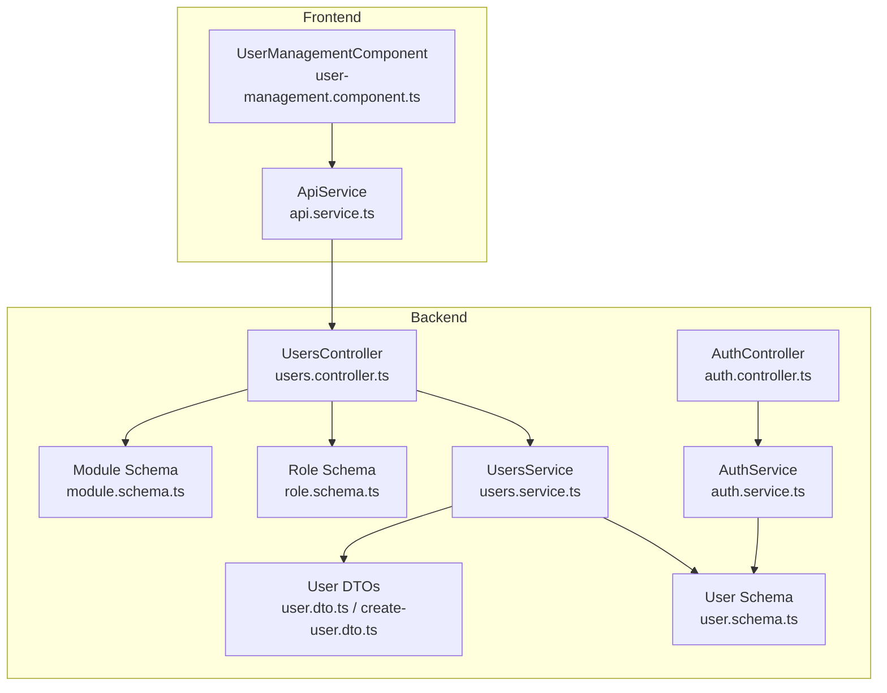
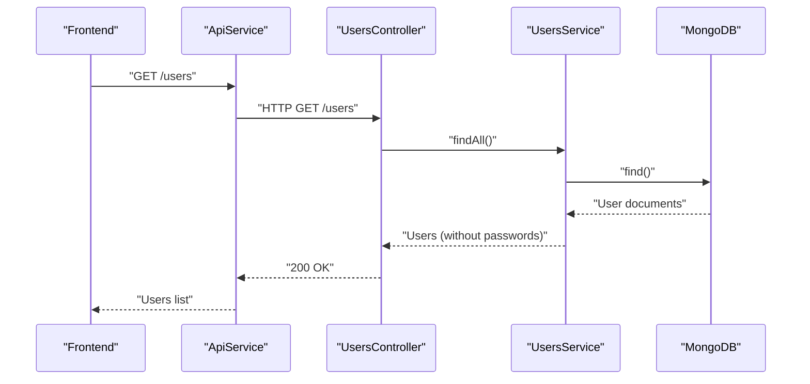
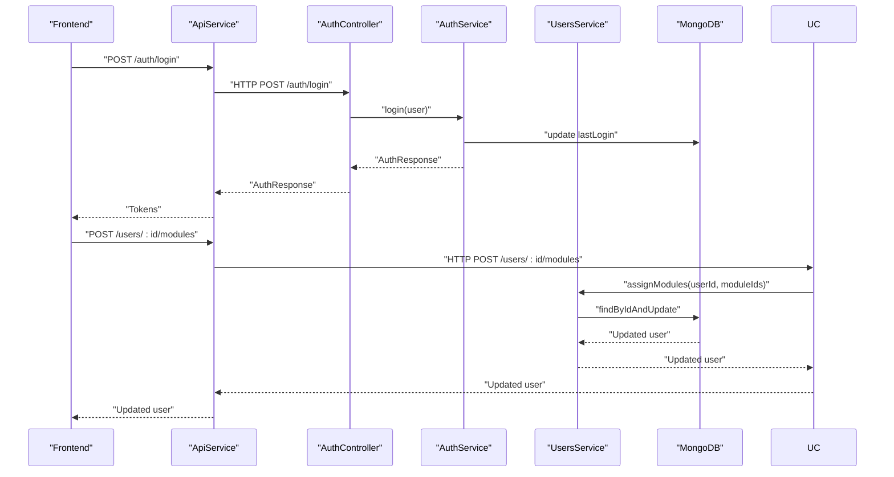
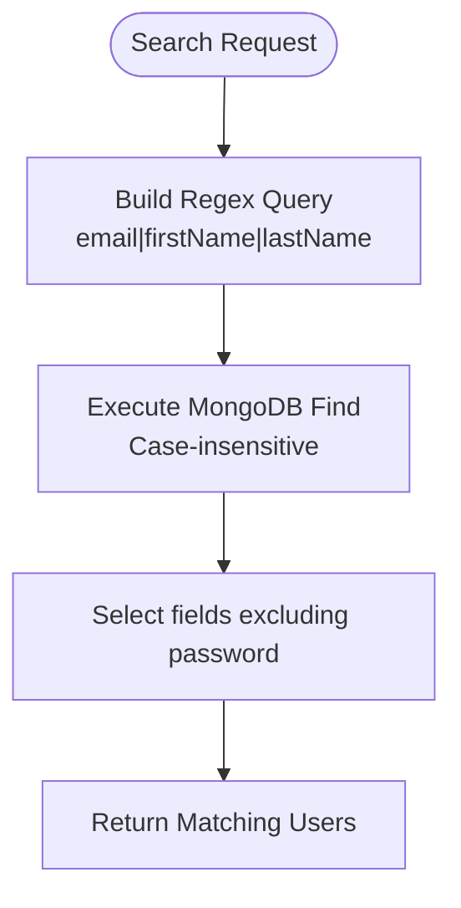
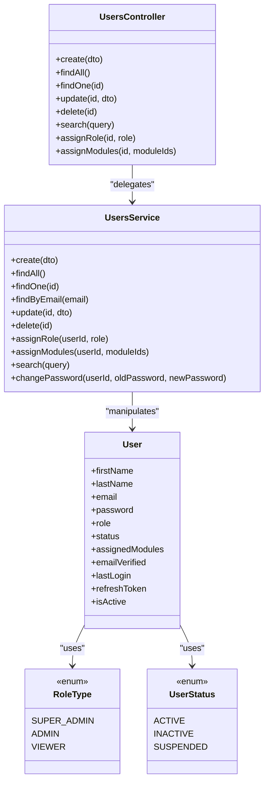

# User Management API

<cite>
**Referenced Files in This Document**
- [users.controller.ts](file://backend/src/users/users.controller.ts)
- [users.service.ts](file://backend/src/users/users.service.ts)
- [user.schema.ts](file://backend/src/users/schemas/user.schema.ts)
- [user.dto.ts](file://backend/src/users/dto/user.dto.ts)
- [create-user.dto.ts](file://backend/src/users/dto/create-user.dto.ts)
- [role.schema.ts](file://backend/src/roles/schemas/role.schema.ts)
- [module.schema.ts](file://backend/src/modules/schemas/module.schema.ts)
- [auth.controller.ts](file://backend/src/auth/auth.controller.ts)
- [auth.service.ts](file://backend/src/auth/auth.service.ts)
- [api.service.ts](file://frontend/src/app/core/services/api.service.ts)
- [user-management.component.ts](file://frontend/src/app/features/admin/user-management/user-management.component.ts)
</cite>

## Table of Contents
1. [Introduction](#introduction)
2. [Project Structure](#project-structure)
3. [Core Components](#core-components)
4. [Architecture Overview](#architecture-overview)
5. [Detailed Component Analysis](#detailed-component-analysis)
6. [Dependency Analysis](#dependency-analysis)
7. [Performance Considerations](#performance-considerations)
8. [Troubleshooting Guide](#troubleshooting-guide)
9. [Conclusion](#conclusion)

## Introduction
This document provides comprehensive API documentation for User Management endpoints in the Multi-Application Control Dashboard. It covers all user-related CRUD operations, profile management, role and module assignment, password change workflows, search and filtering capabilities, and pagination support. It also outlines user activation and suspension procedures and discusses data export considerations.

## Project Structure
The user management functionality spans backend NestJS controllers and services, Mongoose schemas, DTOs, and frontend integration via an API service and Angular components.

**Diagram sources**
- [users.controller.ts](file://backend/src/users/users.controller.ts#L1-L52)
- [users.service.ts](file://backend/src/users/users.service.ts#L1-L78)
- [user.schema.ts](file://backend/src/users/schemas/user.schema.ts#L1-L66)
- [user.dto.ts](file://backend/src/users/dto/user.dto.ts#L1-L62)
- [create-user.dto.ts](file://backend/src/users/dto/create-user.dto.ts#L1-L57)
- [role.schema.ts](file://backend/src/roles/schemas/role.schema.ts#L1-L25)
- [module.schema.ts](file://backend/src/modules/schemas/module.schema.ts#L1-L32)
- [auth.controller.ts](file://backend/src/auth/auth.controller.ts#L1-L58)
- [auth.service.ts](file://backend/src/auth/auth.service.ts#L1-L125)
- [api.service.ts](file://frontend/src/app/core/services/api.service.ts#L52-L75)
- [user-management.component.ts](file://frontend/src/app/features/admin/user-management/user-management.component.ts#L1-L288)

**Section sources**
- [users.controller.ts](file://backend/src/users/users.controller.ts#L1-L52)
- [users.service.ts](file://backend/src/users/users.service.ts#L1-L78)
- [user.schema.ts](file://backend/src/users/schemas/user.schema.ts#L1-L66)
- [user.dto.ts](file://backend/src/users/dto/user.dto.ts#L1-L62)
- [create-user.dto.ts](file://backend/src/users/dto/create-user.dto.ts#L1-L57)
- [role.schema.ts](file://backend/src/roles/schemas/role.schema.ts#L1-L25)
- [module.schema.ts](file://backend/src/modules/schemas/module.schema.ts#L1-L32)
- [auth.controller.ts](file://backend/src/auth/auth.controller.ts#L1-L58)
- [auth.service.ts](file://backend/src/auth/auth.service.ts#L1-L125)
- [api.service.ts](file://frontend/src/app/core/services/api.service.ts#L52-L75)
- [user-management.component.ts](file://frontend/src/app/features/admin/user-management/user-management.component.ts#L1-L288)

## Core Components
- UsersController: Exposes REST endpoints for user CRUD, search, role assignment, and module assignment.
- UsersService: Implements business logic for user operations, password hashing, search, and role/module assignment.
- User Schema: Defines user entity structure, enums, and virtual properties.
- User DTOs: Define validation rules for create, update, and related operations.
- Role and Module Schemas: Support role assignment and module linkage.
- AuthController/AuthService: Provide authentication, token generation, and user profile retrieval.
- Frontend ApiService/UserManagementComponent: Integrate with backend APIs and manage UI state.

**Section sources**
- [users.controller.ts](file://backend/src/users/users.controller.ts#L1-L52)
- [users.service.ts](file://backend/src/users/users.service.ts#L1-L78)
- [user.schema.ts](file://backend/src/users/schemas/user.schema.ts#L1-L66)
- [user.dto.ts](file://backend/src/users/dto/user.dto.ts#L1-L62)
- [create-user.dto.ts](file://backend/src/users/dto/create-user.dto.ts#L1-L57)
- [role.schema.ts](file://backend/src/roles/schemas/role.schema.ts#L1-L25)
- [module.schema.ts](file://backend/src/modules/schemas/module.schema.ts#L1-L32)
- [auth.controller.ts](file://backend/src/auth/auth.controller.ts#L1-L58)
- [auth.service.ts](file://backend/src/auth/auth.service.ts#L1-L125)
- [api.service.ts](file://frontend/src/app/core/services/api.service.ts#L52-L75)
- [user-management.component.ts](file://frontend/src/app/features/admin/user-management/user-management.component.ts#L1-L288)

## Architecture Overview
The backend follows a layered architecture:
- Controllers handle HTTP requests and delegate to Services.
- Services encapsulate domain logic and interact with Mongoose models.
- Schemas define data structures and virtual properties.
- DTOs enforce validation rules.
- Frontend integrates via an API service and Angular components.

**Diagram sources**
- [users.controller.ts](file://backend/src/users/users.controller.ts#L17-L20)
- [users.service.ts](file://backend/src/users/users.service.ts#L21-L23)
- [api.service.ts](file://frontend/src/app/core/services/api.service.ts#L52-L75)

## Detailed Component Analysis

### Authentication and Profile Endpoints
These endpoints support user registration, login, profile retrieval, token refresh, and logout.

- POST /auth/register
  - Purpose: Register a new user.
  - Request body: Registration DTO (email, password, optional role).
  - Response: Auth response with access/refresh tokens and user details.
  - Validation: Duplicate email handled with a conflict error.
  - Notes: Role defaults to viewer if not provided.

- POST /auth/login
  - Purpose: Authenticate user and issue tokens.
  - Request body: Login DTO (email, password).
  - Response: Auth response with tokens and user details.
  - Notes: Updates last login timestamp.

- GET /auth/me
  - Purpose: Retrieve authenticated user details.
  - Response: User object without sensitive fields.

- POST /auth/refresh
  - Purpose: Refresh access token using a valid refresh token.

- POST /auth/logout
  - Purpose: Invalidate refresh token for the user.

- GET /auth/profile
  - Purpose: Return current user profile (JWT payload).

**Section sources**
- [auth.controller.ts](file://backend/src/auth/auth.controller.ts#L19-L56)
- [auth.service.ts](file://backend/src/auth/auth.service.ts#L32-L123)

### User Management Endpoints

#### Base Path
- Base URL: /users

#### Authentication
- All user endpoints require JWT authentication.

#### Endpoints

- POST /
  - Purpose: Create a new user.
  - Request body: Create user DTO (firstName, lastName, email, password, role, username).
  - Response: Created user object (password omitted).
  - Validation rules:
    - Email: Required, valid format.
    - Name fields: Required, minimum length.
    - Password: Required, minimum length.
    - Role: Enumerated role type.
    - Username: Required, minimum length.
  - Error scenarios:
    - Duplicate email: Handled during registration/validation.
    - Permission errors: Require appropriate roles to create users.

- GET /
  - Purpose: List all users.
  - Response: Array of users (passwords excluded).

- GET /search?q=term
  - Purpose: Search users by email, first name, or last name (case-insensitive).
  - Query parameter: q (search term).
  - Response: Array of matching users (passwords excluded).

- GET /:id
  - Purpose: Retrieve a single user by ID.
  - Path parameter: id (MongoDB ObjectId).
  - Response: User object (password omitted).

- PUT /:id
  - Purpose: Update an existing user.
  - Path parameter: id.
  - Request body: Update user DTO (firstName, lastName, role, status, assignedModules).
  - Response: Updated user object (password omitted).
  - Validation rules:
    - Status: Enumerated status values.
    - Assigned modules: Array of strings.

- DELETE /:id
  - Purpose: Delete a user.
  - Path parameter: id.
  - Response: Deletion result.

- POST /:id/role
  - Purpose: Assign or update user role.
  - Path parameter: id.
  - Request body: Role value (enumerated role type).
  - Response: Updated user object.

- POST /:id/modules
  - Purpose: Assign modules to a user.
  - Path parameter: id.
  - Request body: moduleIds array (strings).
  - Response: Updated user object.

#### User Data Model
- Fields:
  - id: Unique identifier.
  - email: Unique email address.
  - firstName, lastName: Names.
  - role: Enumerated role (super_admin, admin, viewer).
  - status: Enumerated status (active, inactive, suspended).
  - assignedModules: Array of module identifiers.
  - emailVerified: Boolean flag.
  - lastLogin: Timestamp of last login.
  - refreshToken: Optional refresh token.
  - isActive: Virtual property derived from status.

- Validation rules:
  - Required fields: firstName, lastName, email, password.
  - Enums: role, status.
  - Unique constraint: email.

**Section sources**
- [users.controller.ts](file://backend/src/users/users.controller.ts#L12-L50)
- [users.service.ts](file://backend/src/users/users.service.ts#L12-L76)
- [user.schema.ts](file://backend/src/users/schemas/user.schema.ts#L5-L48)
- [user.dto.ts](file://backend/src/users/dto/user.dto.ts#L5-L61)
- [create-user.dto.ts](file://backend/src/users/dto/create-user.dto.ts#L3-L25)
- [role.schema.ts](file://backend/src/roles/schemas/role.schema.ts#L4-L8)
- [module.schema.ts](file://backend/src/modules/schemas/module.schema.ts#L6-L13)

### Password Change Workflow
- Endpoint: Not exposed as a dedicated endpoint in the provided code.
- Current mechanism: Password change is handled within authentication service and user service. The service validates the old password and updates with a new hashed password.
- Recommendation: Expose a dedicated endpoint for password changes to align with standard practices.

**Diagram sources**
- [auth.controller.ts](file://backend/src/auth/auth.controller.ts#L25-L30)
- [auth.service.ts](file://backend/src/auth/auth.service.ts#L51-L54)
- [users.controller.ts](file://backend/src/users/users.controller.ts#L47-L49)
- [users.service.ts](file://backend/src/users/users.service.ts#L41-L45)

### Search and Filtering Capabilities
- Search endpoint: GET /users/search?q=term performs case-insensitive search across email, firstName, and lastName.
- Frontend integration: ApiService exposes a search method that calls /users/search with query parameter q.
- Pagination: Not implemented in backend endpoints; frontend store manages pagination state.

**Diagram sources**
- [users.controller.ts](file://backend/src/users/users.controller.ts#L22-L25)
- [users.service.ts](file://backend/src/users/users.service.ts#L53-L64)
- [api.service.ts](file://frontend/src/app/core/services/api.service.ts#L72-L74)

**Section sources**
- [users.controller.ts](file://backend/src/users/users.controller.ts#L22-L25)
- [users.service.ts](file://backend/src/users/users.service.ts#L53-L64)
- [api.service.ts](file://frontend/src/app/core/services/api.service.ts#L72-L74)

### Pagination Parameters
- Backend does not expose pagination parameters in user endpoints.
- Frontend store manages pagination internally (page, limit), but no server-side pagination is implemented.

**Section sources**
- [api.service.ts](file://frontend/src/app/core/services/api.service.ts#L65-L67)
- [user-management.component.ts](file://frontend/src/app/features/admin/user-management/user-management.component.ts#L170-L183)

### Bulk Operations
- No explicit bulk endpoints are present in the user management module.
- Frontend actions dispatch updates/deletes to the store; no server-side bulk operations are evident.

**Section sources**
- [user-management.component.ts](file://frontend/src/app/features/admin/user-management/user-management.component.ts#L88-L97)
- [user-management.component.ts](file://frontend/src/app/features/admin/user-management/user-management.component.ts#L106-L111)

### User Activation and Suspension Procedures
- Status updates are supported via PUT /:id with status field set to active, inactive, or suspended.
- The isActive virtual property reflects whether status equals active.

**Section sources**
- [users.controller.ts](file://backend/src/users/users.controller.ts#L32-L35)
- [users.service.ts](file://backend/src/users/users.service.ts#L33-L35)
- [user.schema.ts](file://backend/src/users/schemas/user.schema.ts#L30-L48)

### Data Export Capabilities
- No dedicated export endpoint is present in the user management module.
- Frontend can fetch all users via GET /users and perform client-side export operations.

**Section sources**
- [users.controller.ts](file://backend/src/users/users.controller.ts#L17-L20)
- [users.service.ts](file://backend/src/users/users.service.ts#L21-L23)

## Dependency Analysis

**Diagram sources**
- [users.controller.ts](file://backend/src/users/users.controller.ts#L1-L52)
- [users.service.ts](file://backend/src/users/users.service.ts#L1-L78)
- [user.schema.ts](file://backend/src/users/schemas/user.schema.ts#L1-L66)
- [role.schema.ts](file://backend/src/roles/schemas/role.schema.ts#L1-L25)

**Section sources**
- [users.controller.ts](file://backend/src/users/users.controller.ts#L1-L52)
- [users.service.ts](file://backend/src/users/users.service.ts#L1-L78)
- [user.schema.ts](file://backend/src/users/schemas/user.schema.ts#L1-L66)
- [role.schema.ts](file://backend/src/roles/schemas/role.schema.ts#L1-L25)

## Performance Considerations
- Password hashing: Implemented with bcrypt; consider adjusting cost factor for performance vs. security balance.
- Field selection: Responses exclude passwords to reduce payload size.
- Search: Regex queries are used; consider indexing email, firstName, and lastName for improved performance.
- Pagination: Not implemented server-side; consider adding page and limit parameters to reduce payload sizes.

## Troubleshooting Guide
- Duplicate email validation:
  - Registration rejects existing emails with a conflict error.
  - Suggest verifying uniqueness before attempting registration.

- Permission errors:
  - Ensure requester has appropriate roles to create/update/delete users.
  - Role assignments should be restricted to authorized users.

- Authentication failures:
  - Login requires valid credentials; invalid combinations trigger unauthorized errors.
  - Token refresh requires a valid and unexpired refresh token.

- Password change:
  - Current implementation does not expose a dedicated endpoint; consider adding one for standardization.

**Section sources**
- [auth.service.ts](file://backend/src/auth/auth.service.ts#L32-L49)
- [auth.service.ts](file://backend/src/auth/auth.service.ts#L17-L30)
- [auth.service.ts](file://backend/src/auth/auth.service.ts#L96-L111)
- [users.service.ts](file://backend/src/users/users.service.ts#L66-L76)

## Conclusion
The User Management API provides robust CRUD operations, role and module assignment, and search capabilities. While authentication and profile endpoints are well-defined, password change and pagination are not exposed as dedicated endpoints. Enhancing the API with a dedicated password change endpoint and server-side pagination would improve usability and scalability. The frontend integrates seamlessly with the backend via the ApiService and UserManagementComponent, enabling efficient user administration.