# Architecture Overview

<cite>
**Referenced Files in This Document**
- [backend/src/app.module.ts](file://backend/src/app.module.ts)
- [backend/src/main.ts](file://backend/src/main.ts)
- [backend/src/auth/auth.module.ts](file://backend/src/auth/auth.module.ts)
- [backend/src/auth/auth.controller.ts](file://backend/src/auth/auth.controller.ts)
- [backend/src/auth/auth.service.ts](file://backend/src/auth/auth.service.ts)
- [backend/src/auth/guards/auth.guard.ts](file://backend/src/auth/guards/auth.guard.ts)
- [backend/src/users/users.module.ts](file://backend/src/users/users.module.ts)
- [backend/src/roles/roles.module.ts](file://backend/src/roles/roles.module.ts)
- [frontend/src/main.ts](file://frontend/src/main.ts)
- [frontend/src/app/app.config.ts](file://frontend/src/app/app.config.ts)
- [frontend/src/app/core/services/auth.service.ts](file://frontend/src/app/core/services/auth.service.ts)
- [frontend/src/app/core/interceptors/auth.interceptor.ts](file://frontend/src/app/core/interceptors/auth.interceptor.ts)
- [frontend/src/app/core/guards/auth.guard.ts](file://frontend/src/app/core/guards/auth.guard.ts)
- [frontend/src/app/core/guards/role.guard.ts](file://frontend/src/app/core/guards/role.guard.ts)
- [frontend/src/app/core/store/auth.store.ts](file://frontend/src/app/core/store/auth.store.ts)
- [frontend/src/app/features/admin/admin-dashboard/admin-dashboard.component.ts](file://frontend/src/app/features/admin/admin-dashboard/admin-dashboard.component.ts)
</cite>

## Table of Contents
1. [Introduction](#introduction)
2. [Project Structure](#project-structure)
3. [Core Components](#core-components)
4. [Architecture Overview](#architecture-overview)
5. [Detailed Component Analysis](#detailed-component-analysis)
6. [Dependency Analysis](#dependency-analysis)
7. [Performance Considerations](#performance-considerations)
8. [Troubleshooting Guide](#troubleshooting-guide)
9. [Conclusion](#conclusion)

## Introduction
This document presents the architecture of the Multi-Application-Control-Dashboard system. It describes the high-level design patterns, including Clean Architecture, Domain-Driven Design (DDD) principles, and a microservice-like modular backend structure. It also documents the frontend architecture built with Angular Signals, reactive programming, and component hierarchy. The backend follows a layered architecture with NestJS modules and dependency injection. The document covers system boundaries, component interactions, data flows, integration patterns, and the security architecture including authentication and authorization mechanisms.

## Project Structure
The system is organized into two primary layers:
- Backend: NestJS monolith with modularized feature domains (auth, users, roles, permissions, modules, blog, LinkedIn, YouTube, study notes, analytics, audit logs, dashboard stats).
- Frontend: Angular application using Signals via @ngrx/signals, reactive services, and route guards/interceptors for security and navigation.

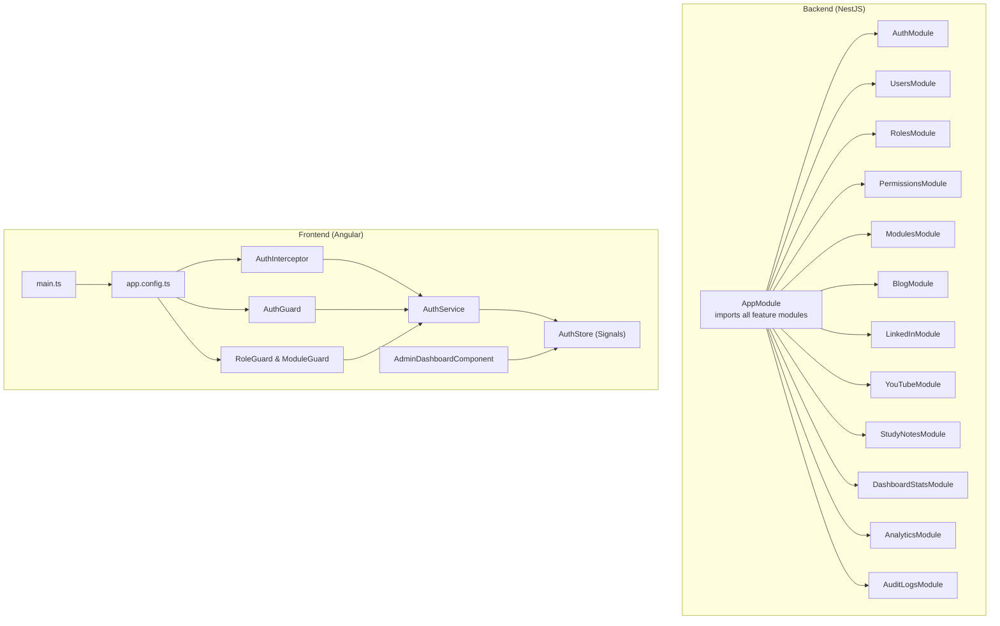

**Diagram sources**
- [backend/src/app.module.ts](file://backend/src/app.module.ts#L17-L36)
- [backend/src/auth/auth.module.ts](file://backend/src/auth/auth.module.ts#L12-L28)
- [frontend/src/main.ts](file://frontend/src/main.ts#L1-L7)
- [frontend/src/app/app.config.ts](file://frontend/src/app/app.config.ts#L10-L33)
- [frontend/src/app/core/services/auth.service.ts](file://frontend/src/app/core/services/auth.service.ts#L31-L41)
- [frontend/src/app/core/interceptors/auth.interceptor.ts](file://frontend/src/app/core/interceptors/auth.interceptor.ts#L8-L45)
- [frontend/src/app/core/guards/auth.guard.ts](file://frontend/src/app/core/guards/auth.guard.ts#L10-L25)
- [frontend/src/app/core/guards/role.guard.ts](file://frontend/src/app/core/guards/role.guard.ts#L11-L46)
- [frontend/src/app/core/store/auth.store.ts](file://frontend/src/app/core/store/auth.store.ts#L35-L30)
- [frontend/src/app/features/admin/admin-dashboard/admin-dashboard.component.ts](file://frontend/src/app/features/admin/admin-dashboard/admin-dashboard.component.ts#L37-L45)

**Section sources**
- [backend/src/app.module.ts](file://backend/src/app.module.ts#L1-L41)
- [frontend/src/main.ts](file://frontend/src/main.ts#L1-L7)
- [frontend/src/app/app.config.ts](file://frontend/src/app/app.config.ts#L10-L33)

## Core Components
- Backend AppModule aggregates all domain modules, enabling centralized configuration and dependency wiring.
- Frontend main.ts bootstraps the Angular application with app.config.ts providers for routing, HTTP client, interceptors, and guards.
- Authentication service and controller manage registration, login, token generation, refresh, and logout.
- Frontend services and stores encapsulate HTTP interactions and state management using Angular Signals.

Key responsibilities:
- Backend: Feature modules encapsulate domain logic; AuthModule centralizes JWT and Passport strategies; global validation pipe enforces DTO hygiene; global CORS and prefix applied at bootstrap.
- Frontend: Services abstract HTTP; interceptors attach tokens and handle token refresh; guards enforce auth and role/module access; signals-based stores manage reactive state.

**Section sources**
- [backend/src/app.module.ts](file://backend/src/app.module.ts#L17-L36)
- [backend/src/main.ts](file://backend/src/main.ts#L5-L51)
- [backend/src/auth/auth.controller.ts](file://backend/src/auth/auth.controller.ts#L15-L57)
- [backend/src/auth/auth.service.ts](file://backend/src/auth/auth.service.ts#L10-L124)
- [frontend/src/app/core/services/auth.service.ts](file://frontend/src/app/core/services/auth.service.ts#L31-L160)
- [frontend/src/app/core/store/auth.store.ts](file://frontend/src/app/core/store/auth.store.ts#L35-L222)

## Architecture Overview
The system follows Clean Architecture principles:
- Domain-driven separation: Each feature module encapsulates domain entities, DTOs, and services.
- Layered backend: Controllers -> Services -> Data Access (Mongoose) with clear boundaries.
- Reactive frontend: Signals and RxJS for state and HTTP streams.
- Microservice-like modularity: NestJS modules isolate concerns similar to bounded contexts.

Security architecture:
- Backend: Passport strategies (local and JWT), JWT guard, refresh token persistence, and logout invalidation.
- Frontend: Auth interceptor adds Authorization headers, auto-refreshes tokens on 401, and guards protect routes.

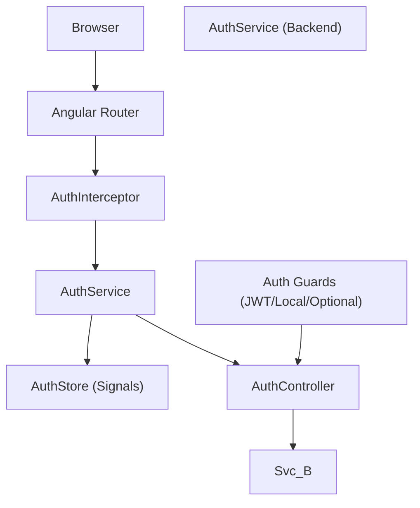

**Diagram sources**
- [frontend/src/app/core/interceptors/auth.interceptor.ts](file://frontend/src/app/core/interceptors/auth.interceptor.ts#L11-L44)
- [frontend/src/app/core/services/auth.service.ts](file://frontend/src/app/core/services/auth.service.ts#L60-L87)
- [frontend/src/app/core/store/auth.store.ts](file://frontend/src/app/core/store/auth.store.ts#L105-L128)
- [backend/src/auth/auth.controller.ts](file://backend/src/auth/auth.controller.ts#L19-L50)
- [backend/src/auth/auth.service.ts](file://backend/src/auth/auth.service.ts#L51-L94)
- [backend/src/auth/guards/auth.guard.ts](file://backend/src/auth/guards/auth.guard.ts#L6-L25)

## Detailed Component Analysis

### Backend: AppModule and Bootstrapping
- AppModule imports ConfigModule, MongooseModule, and all feature modules, establishing the application’s composition root.
- main.ts enables CORS, registers global ValidationPipe, sets global API prefix, and starts the server.

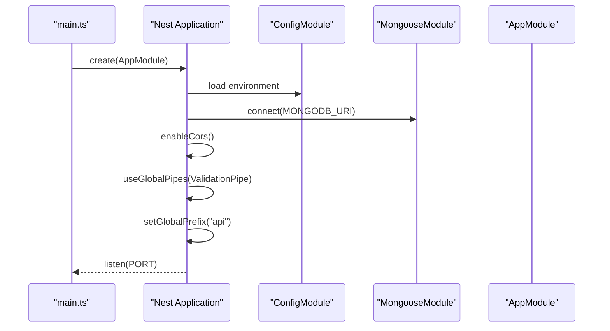

**Diagram sources**
- [backend/src/main.ts](file://backend/src/main.ts#L5-L51)
- [backend/src/app.module.ts](file://backend/src/app.module.ts#L17-L36)

**Section sources**
- [backend/src/app.module.ts](file://backend/src/app.module.ts#L17-L36)
- [backend/src/main.ts](file://backend/src/main.ts#L5-L51)

### Backend: Authentication Module (AuthModule)
- Registers Passport, JWT module asynchronously via ConfigService, and binds User schema.
- Provides AuthService, JwtStrategy, LocalStrategy, and exposes AuthService for imports.

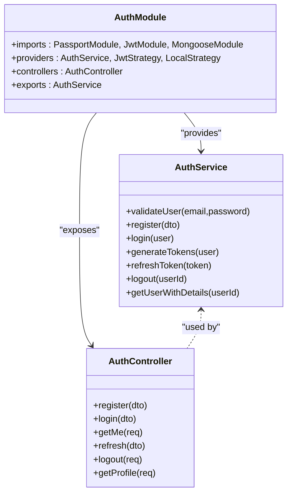

**Diagram sources**
- [backend/src/auth/auth.module.ts](file://backend/src/auth/auth.module.ts#L12-L28)
- [backend/src/auth/auth.service.ts](file://backend/src/auth/auth.service.ts#L10-L124)
- [backend/src/auth/auth.controller.ts](file://backend/src/auth/auth.controller.ts#L15-L57)

**Section sources**
- [backend/src/auth/auth.module.ts](file://backend/src/auth/auth.module.ts#L12-L28)
- [backend/src/auth/auth.controller.ts](file://backend/src/auth/auth.controller.ts#L15-L57)
- [backend/src/auth/auth.service.ts](file://backend/src/auth/auth.service.ts#L10-L124)

### Backend: Guards and Strategies
- JwtAuthGuard and LocalAuthGuard extend NestJS AuthGuard for JWT and local strategies.
- OptionalJwtAuthGuard allows optional authentication by returning user or null.

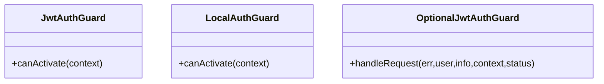

**Diagram sources**
- [backend/src/auth/guards/auth.guard.ts](file://backend/src/auth/guards/auth.guard.ts#L6-L25)

**Section sources**
- [backend/src/auth/guards/auth.guard.ts](file://backend/src/auth/guards/auth.guard.ts#L6-L25)

### Backend: Users and Roles Modules
- UsersModule and RolesModule define Mongoose models and export services/controllers for their respective domains.

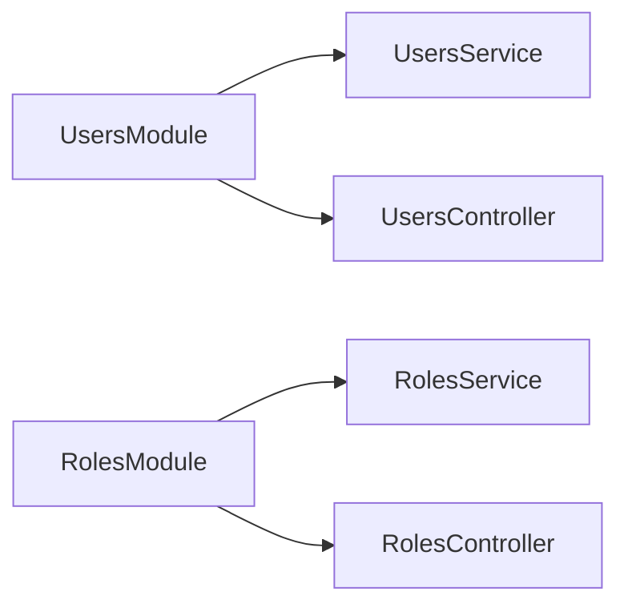

**Diagram sources**
- [backend/src/users/users.module.ts](file://backend/src/users/users.module.ts#L7-L13)
- [backend/src/roles/roles.module.ts](file://backend/src/roles/roles.module.ts#L7-L13)

**Section sources**
- [backend/src/users/users.module.ts](file://backend/src/users/users.module.ts#L7-L13)
- [backend/src/roles/roles.module.ts](file://backend/src/roles/roles.module.ts#L7-L13)

### Frontend: Bootstrapping and Providers
- main.ts bootstraps Angular with app.config.ts.
- app.config.ts registers router, HTTP client, interceptors, and guards globally.

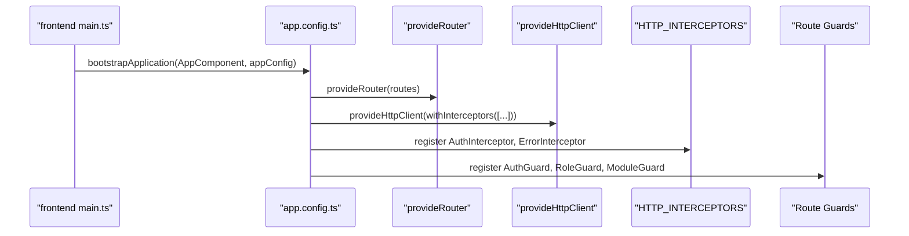

**Diagram sources**
- [frontend/src/main.ts](file://frontend/src/main.ts#L1-L7)
- [frontend/src/app/app.config.ts](file://frontend/src/app/app.config.ts#L10-L33)

**Section sources**
- [frontend/src/main.ts](file://frontend/src/main.ts#L1-L7)
- [frontend/src/app/app.config.ts](file://frontend/src/app/app.config.ts#L10-L33)

### Frontend: Authentication Service and Interceptor
- AuthService manages login/register, token storage, profile retrieval, and token refresh.
- AuthInterceptor attaches Authorization headers and retries failed requests after token refresh.

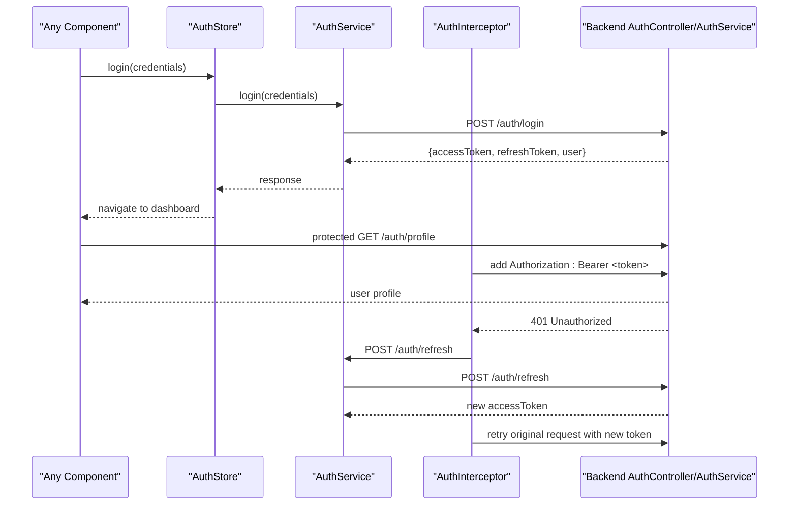

**Diagram sources**
- [frontend/src/app/core/services/auth.service.ts](file://frontend/src/app/core/services/auth.service.ts#L60-L87)
- [frontend/src/app/core/interceptors/auth.interceptor.ts](file://frontend/src/app/core/interceptors/auth.interceptor.ts#L11-L44)
- [backend/src/auth/auth.controller.ts](file://backend/src/auth/auth.controller.ts#L25-L50)
- [backend/src/auth/auth.service.ts](file://backend/src/auth/auth.service.ts#L96-L111)

**Section sources**
- [frontend/src/app/core/services/auth.service.ts](file://frontend/src/app/core/services/auth.service.ts#L31-L160)
- [frontend/src/app/core/interceptors/auth.interceptor.ts](file://frontend/src/app/core/interceptors/auth.interceptor.ts#L8-L45)
- [backend/src/auth/auth.controller.ts](file://backend/src/auth/auth.controller.ts#L15-L57)
- [backend/src/auth/auth.service.ts](file://backend/src/auth/auth.service.ts#L51-L111)

### Frontend: Guards and Authorization
- AuthGuard ensures presence of access token; redirects unauthenticated users to login.
- RoleGuard checks required roles against current user role.
- ModuleGuard caches module access decisions to minimize API calls and enforces module-specific permissions.

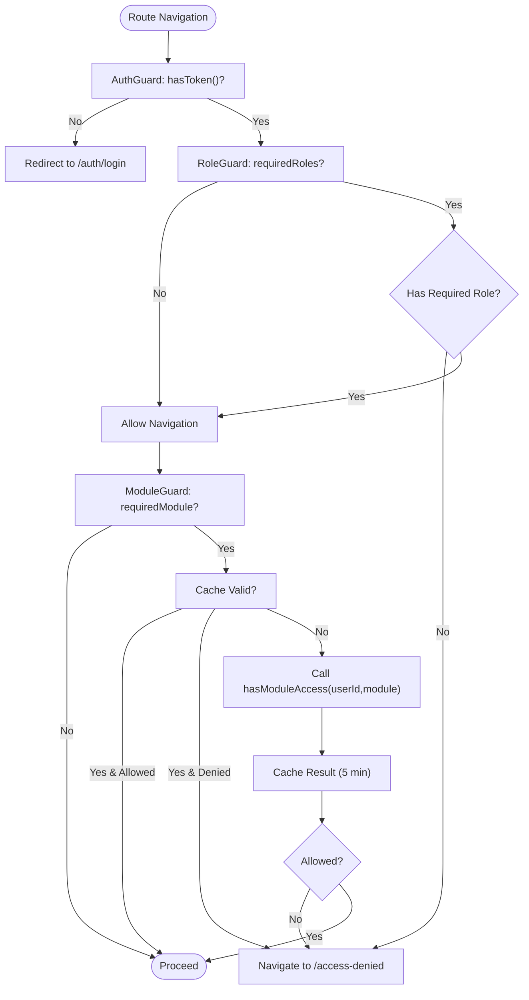

**Diagram sources**
- [frontend/src/app/core/guards/auth.guard.ts](file://frontend/src/app/core/guards/auth.guard.ts#L13-L24)
- [frontend/src/app/core/guards/role.guard.ts](file://frontend/src/app/core/guards/role.guard.ts#L14-L46)
- [frontend/src/app/core/guards/role.guard.ts](file://frontend/src/app/core/guards/role.guard.ts#L63-L104)

**Section sources**
- [frontend/src/app/core/guards/auth.guard.ts](file://frontend/src/app/core/guards/auth.guard.ts#L10-L25)
- [frontend/src/app/core/guards/role.guard.ts](file://frontend/src/app/core/guards/role.guard.ts#L11-L133)

### Frontend: Signals-Based Store (AuthStore)
- AuthStore encapsulates authentication state using @ngrx/signals with withState, withComputed, and withMethods.
- Provides methods for initialization, login, register, token refresh, profile loading, and logout.

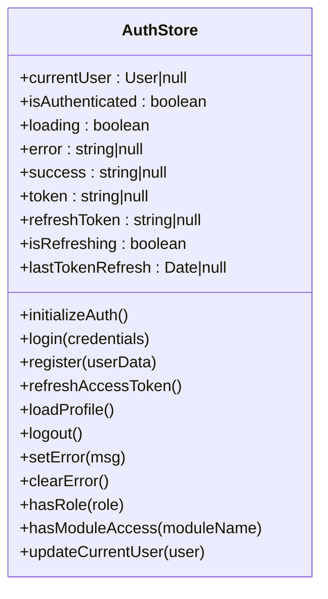

**Diagram sources**
- [frontend/src/app/core/store/auth.store.ts](file://frontend/src/app/core/store/auth.store.ts#L35-L222)

**Section sources**
- [frontend/src/app/core/store/auth.store.ts](file://frontend/src/app/core/store/auth.store.ts#L20-L222)

### Frontend: Admin Dashboard Component
- AdminDashboardComponent uses AdminDashboardStore and PermissionService to render admin metrics and lists.
- Demonstrates reactive template bindings to store signals and delegated permission checks.

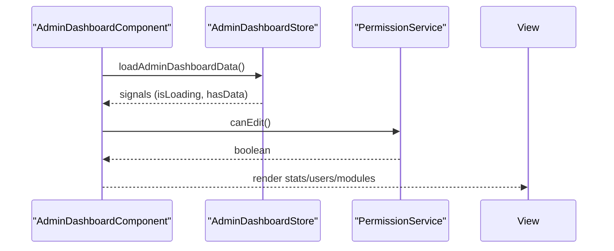

**Diagram sources**
- [frontend/src/app/features/admin/admin-dashboard/admin-dashboard.component.ts](file://frontend/src/app/features/admin/admin-dashboard/admin-dashboard.component.ts#L37-L161)

**Section sources**
- [frontend/src/app/features/admin/admin-dashboard/admin-dashboard.component.ts](file://frontend/src/app/features/admin/admin-dashboard/admin-dashboard.component.ts#L37-L161)

## Dependency Analysis
- Backend AppModule depends on all feature modules, forming a cohesive domain-driven structure.
- AuthModule depends on Passport, JWT, and Mongoose for User schema.
- Frontend app.config.ts wires interceptors and guards globally; services depend on environment-provided API URLs.

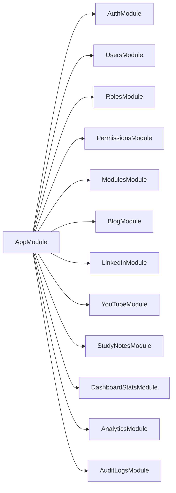

**Diagram sources**
- [backend/src/app.module.ts](file://backend/src/app.module.ts#L17-L36)

**Section sources**
- [backend/src/app.module.ts](file://backend/src/app.module.ts#L17-L36)

## Performance Considerations
- Frontend caching: ModuleGuard caches module access decisions for 5 minutes to reduce API calls.
- Token refresh: AuthInterceptor attempts automatic refresh on 401 to minimize user interruption.
- Global validation: Backend ValidationPipe reduces downstream errors by enforcing DTO constraints early.
- Signal-based stores: Minimizes unnecessary re-renders by leveraging computed signals.

[No sources needed since this section provides general guidance]

## Troubleshooting Guide
- 401 Unauthorized on protected routes:
  - Verify access token in localStorage and Authorization header.
  - Confirm AuthInterceptor is registered and attached to HTTP client.
  - Attempt token refresh; if it fails, logout and re-authenticate.
- CORS errors:
  - Ensure allowed origins include frontend hosts.
  - Confirm credentials and allowed methods/headers are configured.
- Route protection failures:
  - Check AuthGuard presence and required roles/modules in route data.
  - Verify current user role and assigned modules.

**Section sources**
- [frontend/src/app/core/interceptors/auth.interceptor.ts](file://frontend/src/app/core/interceptors/auth.interceptor.ts#L22-L44)
- [backend/src/main.ts](file://backend/src/main.ts#L8-L31)
- [frontend/src/app/core/guards/auth.guard.ts](file://frontend/src/app/core/guards/auth.guard.ts#L13-L24)
- [frontend/src/app/core/guards/role.guard.ts](file://frontend/src/app/core/guards/role.guard.ts#L63-L104)

## Conclusion
The Multi-Application-Control-Dashboard employs Clean Architecture and DDD-aligned modularity in the backend, with a robust NestJS foundation and layered design. The frontend leverages Angular Signals and reactive patterns for efficient state management and seamless user experiences. Security is enforced through JWT-based authentication, Passport strategies, and comprehensive frontend guards and interceptors. The system’s boundaries are clearly defined by feature modules and guard layers, ensuring maintainability, scalability, and predictable behavior.