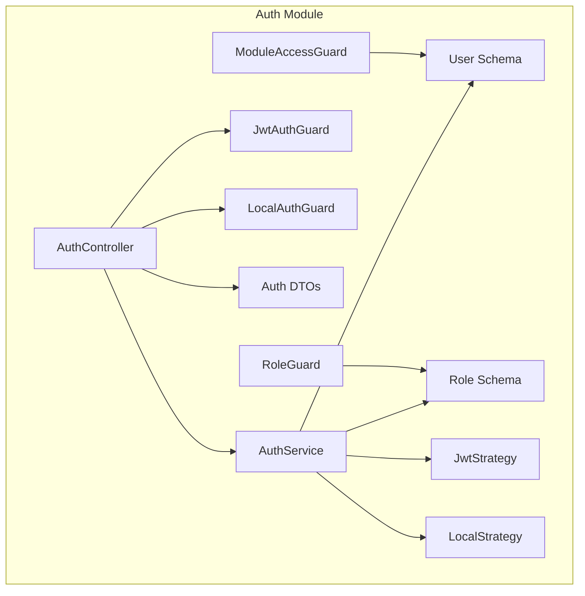
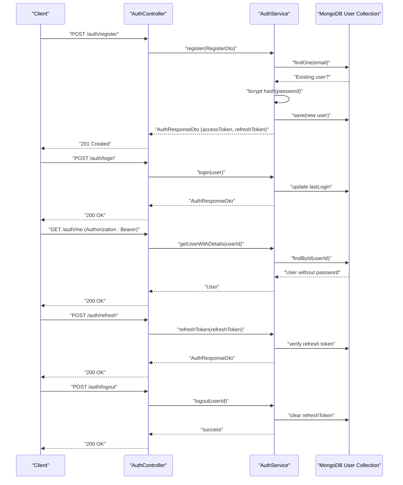
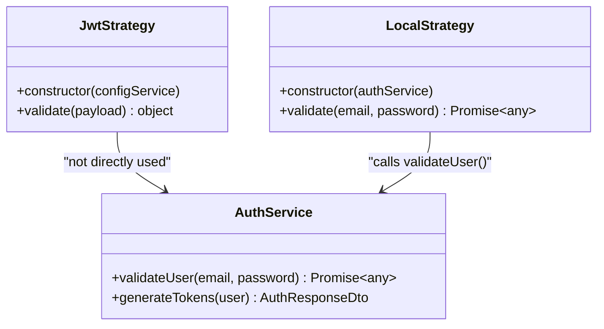
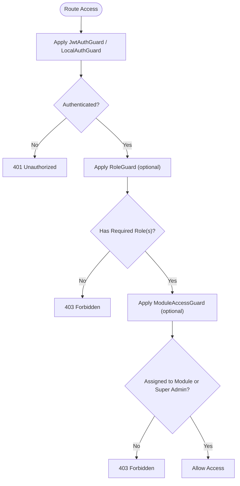
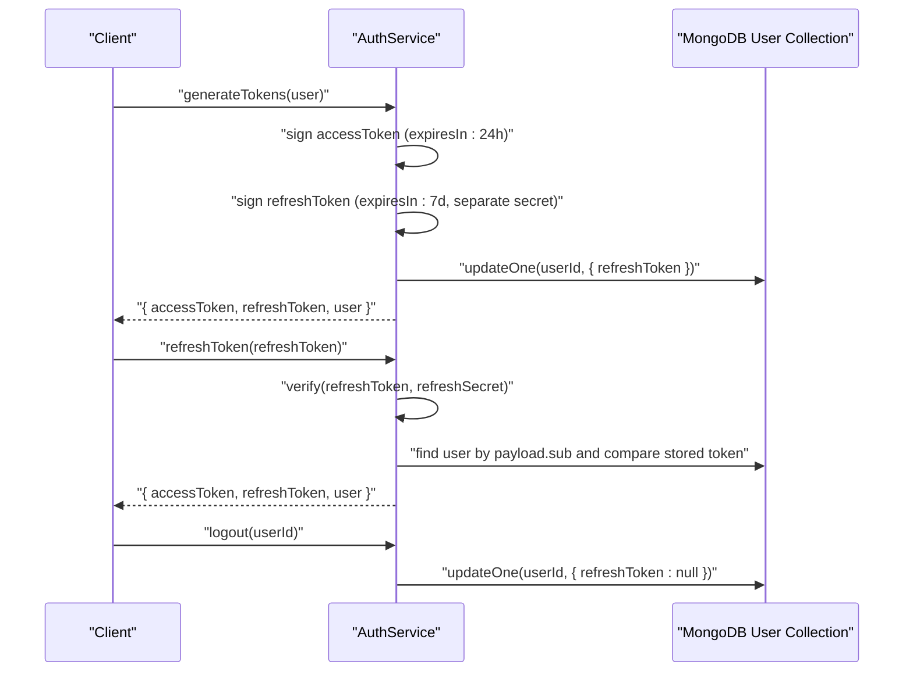
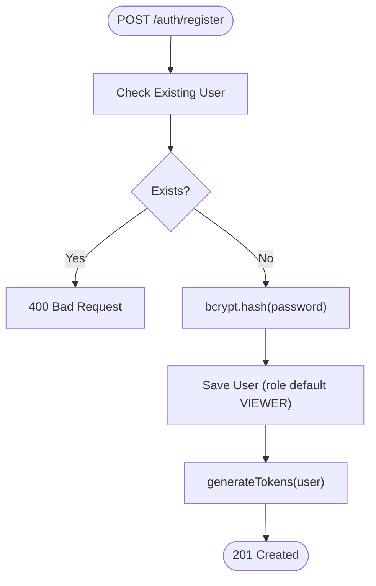
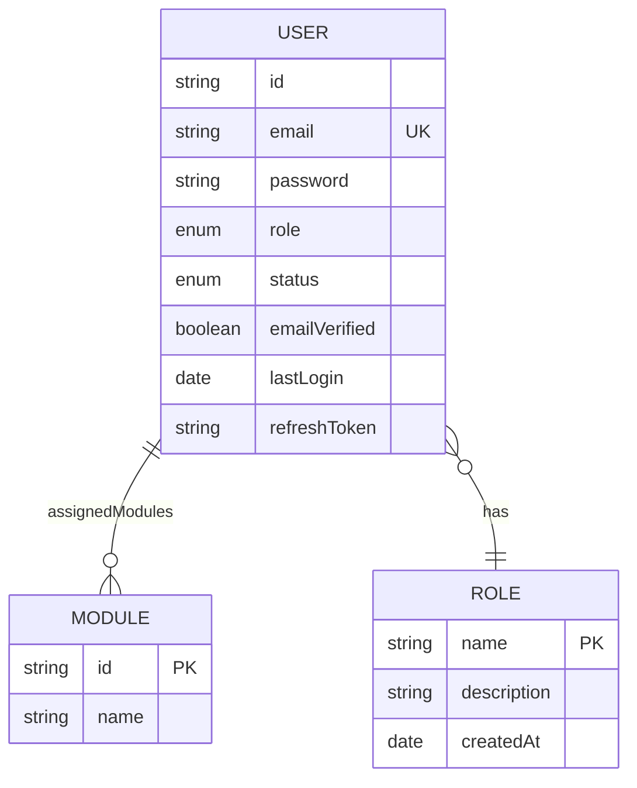
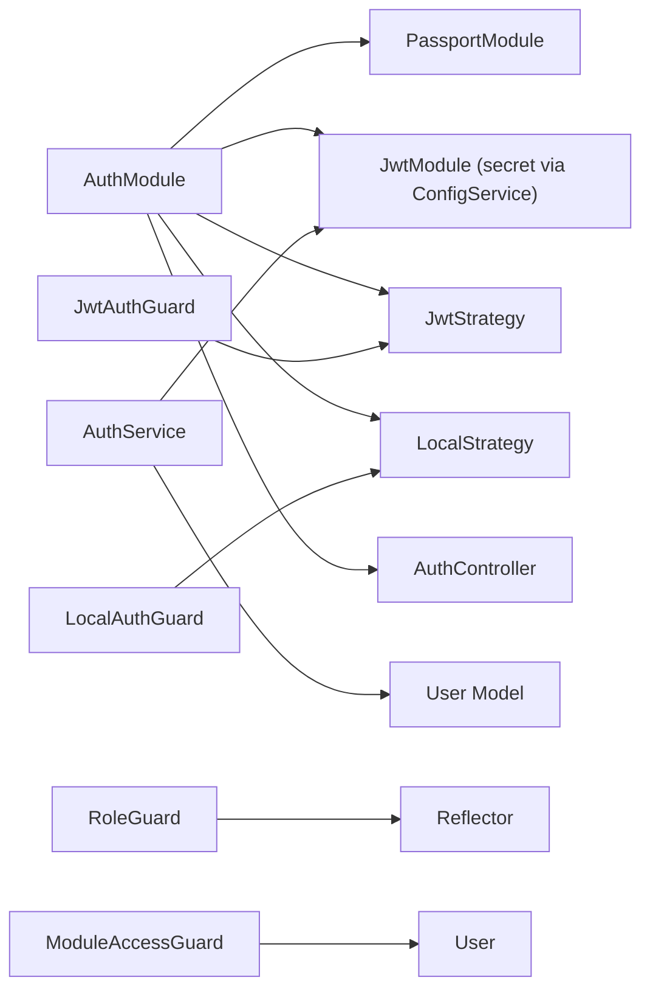

# Authentication System

<cite>
**Referenced Files in This Document**
- [auth.controller.ts](file://backend/src/auth/auth.controller.ts)
- [auth.service.ts](file://backend/src/auth/auth.service.ts)
- [auth.module.ts](file://backend/src/auth/auth.module.ts)
- [jwt.strategy.ts](file://backend/src/auth/strategies/jwt.strategy.ts)
- [local.strategy.ts](file://backend/src/auth/strategies/local.strategy.ts)
- [auth.guard.ts](file://backend/src/auth/guards/auth.guard.ts)
- [jwt-auth.guard.ts](file://backend/src/auth/guards/jwt-auth.guard.ts)
- [local-auth.guard.ts](file://backend/src/auth/guards/local-auth.guard.ts)
- [role.guard.ts](file://backend/src/auth/guards/role.guard.ts)
- [module-access.guard.ts](file://backend/src/auth/guards/module-access.guard.ts)
- [auth.dto.ts](file://backend/src/auth/dto/auth.dto.ts)
- [user.schema.ts](file://backend/src/users/schemas/user.schema.ts)
- [role.schema.ts](file://backend/src/roles/schemas/role.schema.ts)
- [roles.decorator.ts](file://backend/src/auth/decorators/roles.decorator.ts)
- [current-user.decorator.ts](file://backend/src/auth/decorators/current-user.decorator.ts)
</cite>

## Table of Contents
1. [Introduction](#introduction)
2. [Project Structure](#project-structure)
3. [Core Components](#core-components)
4. [Architecture Overview](#architecture-overview)
5. [Detailed Component Analysis](#detailed-component-analysis)
6. [Dependency Analysis](#dependency-analysis)
7. [Performance Considerations](#performance-considerations)
8. [Troubleshooting Guide](#troubleshooting-guide)
9. [Conclusion](#conclusion)
10. [Appendices](#appendices)

## Introduction
This document explains the authentication and authorization system implemented in the backend. It covers the dual authentication strategy using JWT tokens and local authentication, the Passport.js integration with custom strategies, guard-based route protection (including JWT, role-based, and module access), token-based session management with refresh tokens, and the user registration workflow with password hashing. Security best practices, token storage strategies, and authentication flow diagrams are also included.

## Project Structure
The authentication subsystem is organized under the auth module with clear separation of concerns:
- Controllers define endpoints for registration, login, profile retrieval, token refresh, and logout.
- Services encapsulate business logic for user validation, registration, token generation, refresh, and logout.
- Strategies integrate Passport.js for JWT and local authentication.
- Guards enforce route protection via JWT, local, roles, and module access policies.
- DTOs validate request payloads.
- Schemas model users, roles, and related metadata.

**Diagram sources**
- [auth.controller.ts](file://backend/src/auth/auth.controller.ts#L1-L58)
- [auth.service.ts](file://backend/src/auth/auth.service.ts#L1-L125)
- [auth.module.ts](file://backend/src/auth/auth.module.ts#L1-L30)
- [jwt.strategy.ts](file://backend/src/auth/strategies/jwt.strategy.ts#L1-L25)
- [local.strategy.ts](file://backend/src/auth/strategies/local.strategy.ts#L1-L16)
- [auth.guard.ts](file://backend/src/auth/guards/auth.guard.ts#L1-L26)
- [jwt-auth.guard.ts](file://backend/src/auth/guards/jwt-auth.guard.ts#L1-L10)
- [local-auth.guard.ts](file://backend/src/auth/guards/local-auth.guard.ts#L1-L6)
- [role.guard.ts](file://backend/src/auth/guards/role.guard.ts#L1-L51)
- [module-access.guard.ts](file://backend/src/auth/guards/module-access.guard.ts#L1-L28)
- [auth.dto.ts](file://backend/src/auth/dto/auth.dto.ts#L1-L58)
- [user.schema.ts](file://backend/src/users/schemas/user.schema.ts#L1-L66)
- [role.schema.ts](file://backend/src/roles/schemas/role.schema.ts#L1-L25)

**Section sources**
- [auth.controller.ts](file://backend/src/auth/auth.controller.ts#L1-L58)
- [auth.service.ts](file://backend/src/auth/auth.service.ts#L1-L125)
- [auth.module.ts](file://backend/src/auth/auth.module.ts#L1-L30)

## Core Components
- AuthController: Exposes endpoints for registration, login, profile retrieval, refresh, and logout. Uses guards to protect routes.
- AuthService: Implements user validation, registration with bcrypt hashing, JWT token generation, refresh token handling, logout, and user lookup.
- Strategies:
  - JwtStrategy: Validates JWTs extracted from Authorization headers.
  - LocalStrategy: Authenticates users via email/password using bcrypt comparison.
- Guards:
  - JwtAuthGuard and LocalAuthGuard: Enforce JWT and local authentication respectively.
  - RoleGuard: Enforces role-based access control using Reflect metadata.
  - ModuleAccessGuard: Restricts access to specific modules based on user assignments.
- DTOs: Define validated request shapes for registration, login, refresh, and response payloads.
- Schemas: Model users, roles, statuses, and module assignments.

**Section sources**
- [auth.controller.ts](file://backend/src/auth/auth.controller.ts#L1-L58)
- [auth.service.ts](file://backend/src/auth/auth.service.ts#L1-L125)
- [jwt.strategy.ts](file://backend/src/auth/strategies/jwt.strategy.ts#L1-L25)
- [local.strategy.ts](file://backend/src/auth/strategies/local.strategy.ts#L1-L16)
- [auth.guard.ts](file://backend/src/auth/guards/auth.guard.ts#L1-L26)
- [jwt-auth.guard.ts](file://backend/src/auth/guards/jwt-auth.guard.ts#L1-L10)
- [local-auth.guard.ts](file://backend/src/auth/guards/local-auth.guard.ts#L1-L6)
- [role.guard.ts](file://backend/src/auth/guards/role.guard.ts#L1-L51)
- [module-access.guard.ts](file://backend/src/auth/guards/module-access.guard.ts#L1-L28)
- [auth.dto.ts](file://backend/src/auth/dto/auth.dto.ts#L1-L58)
- [user.schema.ts](file://backend/src/users/schemas/user.schema.ts#L1-L66)
- [role.schema.ts](file://backend/src/roles/schemas/role.schema.ts#L1-L25)

## Architecture Overview
The system integrates NestJS with Passport.js and JWT to support dual authentication:
- Local authentication validates credentials against the database using bcrypt.
- JWT authentication secures protected routes and carries user identity and permissions.
- Guards enforce authentication and authorization policies.
- Token refresh extends session lifetime securely.

**Diagram sources**
- [auth.controller.ts](file://backend/src/auth/auth.controller.ts#L1-L58)
- [auth.service.ts](file://backend/src/auth/auth.service.ts#L32-L123)
- [user.schema.ts](file://backend/src/users/schemas/user.schema.ts#L13-L48)

## Detailed Component Analysis

### Passport.js Integration and Custom Strategies
- JwtStrategy extracts JWT from Authorization header and verifies it using the configured secret. It returns a minimal user payload for downstream use.
- LocalStrategy authenticates users by email/password and delegates validation to AuthService, which compares bcrypt hashes.

**Diagram sources**
- [jwt.strategy.ts](file://backend/src/auth/strategies/jwt.strategy.ts#L1-L25)
- [local.strategy.ts](file://backend/src/auth/strategies/local.strategy.ts#L1-L16)
- [auth.service.ts](file://backend/src/auth/auth.service.ts#L17-L30)

**Section sources**
- [jwt.strategy.ts](file://backend/src/auth/strategies/jwt.strategy.ts#L1-L25)
- [local.strategy.ts](file://backend/src/auth/strategies/local.strategy.ts#L1-L16)
- [auth.service.ts](file://backend/src/auth/auth.service.ts#L17-L30)

### Guard Implementation for Route Protection
- JwtAuthGuard and LocalAuthGuard wrap Passport strategies for route protection.
- RoleGuard enforces role-based access using Reflect metadata set by the Roles decorator.
- ModuleAccessGuard restricts access to specific modules based on user assignments and role.

**Diagram sources**
- [auth.guard.ts](file://backend/src/auth/guards/auth.guard.ts#L1-L26)
- [role.guard.ts](file://backend/src/auth/guards/role.guard.ts#L1-L51)
- [module-access.guard.ts](file://backend/src/auth/guards/module-access.guard.ts#L1-L28)

**Section sources**
- [auth.guard.ts](file://backend/src/auth/guards/auth.guard.ts#L1-L26)
- [role.guard.ts](file://backend/src/auth/guards/role.guard.ts#L1-L51)
- [module-access.guard.ts](file://backend/src/auth/guards/module-access.guard.ts#L1-L28)
- [roles.decorator.ts](file://backend/src/auth/decorators/roles.decorator.ts#L1-L5)

### Token-Based Session Management and Refresh Tokens
- Access tokens expire after a short period and carry user identity and roles.
- Refresh tokens are long-lived, stored server-side in the user document, and verified during refresh requests.
- Logout clears the stored refresh token.

**Diagram sources**
- [auth.service.ts](file://backend/src/auth/auth.service.ts#L56-L115)
- [user.schema.ts](file://backend/src/users/schemas/user.schema.ts#L42-L43)

**Section sources**
- [auth.service.ts](file://backend/src/auth/auth.service.ts#L56-L115)
- [user.schema.ts](file://backend/src/users/schemas/user.schema.ts#L42-L43)

### User Registration Workflow and Password Hashing
- Registration checks for existing users, hashes passwords with bcrypt, assigns default or provided roles, saves the user, and generates initial tokens.

**Diagram sources**
- [auth.service.ts](file://backend/src/auth/auth.service.ts#L32-L49)
- [auth.dto.ts](file://backend/src/auth/dto/auth.dto.ts#L4-L21)
- [role.schema.ts](file://backend/src/roles/schemas/role.schema.ts#L4-L8)

**Section sources**
- [auth.service.ts](file://backend/src/auth/auth.service.ts#L32-L49)
- [auth.dto.ts](file://backend/src/auth/dto/auth.dto.ts#L4-L21)
- [role.schema.ts](file://backend/src/roles/schemas/role.schema.ts#L4-L8)

### Email Verification Process
- The user schema includes an email verification flag. While the provided files do not show explicit verification endpoints or flows, the presence of the field indicates verification capability can be integrated alongside registration and login flows.

**Section sources**
- [user.schema.ts](file://backend/src/users/schemas/user.schema.ts#L36-L37)

### Data Models and Relationships

**Diagram sources**
- [user.schema.ts](file://backend/src/users/schemas/user.schema.ts#L13-L48)
- [role.schema.ts](file://backend/src/roles/schemas/role.schema.ts#L12-L24)

**Section sources**
- [user.schema.ts](file://backend/src/users/schemas/user.schema.ts#L13-L48)
- [role.schema.ts](file://backend/src/roles/schemas/role.schema.ts#L12-L24)

## Dependency Analysis
- AuthModule imports PassportModule, JwtModule (configured via ConfigService), and registers strategies and controller.
- AuthService depends on Mongoose models and JwtService; it interacts with the User collection and updates refresh tokens.
- Guards depend on Passport strategies and metadata reflection.

**Diagram sources**
- [auth.module.ts](file://backend/src/auth/auth.module.ts#L12-L29)
- [auth.service.ts](file://backend/src/auth/auth.service.ts#L10-L15)
- [auth.guard.ts](file://backend/src/auth/guards/auth.guard.ts#L1-L26)
- [role.guard.ts](file://backend/src/auth/guards/role.guard.ts#L10-L11)
- [module-access.guard.ts](file://backend/src/auth/guards/module-access.guard.ts#L1-L28)

**Section sources**
- [auth.module.ts](file://backend/src/auth/auth.module.ts#L12-L29)
- [auth.service.ts](file://backend/src/auth/auth.service.ts#L10-L15)
- [auth.guard.ts](file://backend/src/auth/guards/auth.guard.ts#L1-L26)

## Performance Considerations
- Prefer bcrypt cost factors appropriate for deployment environment to balance security and performance.
- Cache frequently accessed user roles and module assignments to reduce database queries.
- Use short-lived access tokens and long-lived refresh tokens to minimize exposure windows.
- Index user email and refresh token fields for efficient lookups.

## Troubleshooting Guide
- Invalid credentials: Thrown when email not found or password mismatch during local authentication.
- Invalid or expired refresh token: Thrown when refresh token verification fails or does not match stored value.
- User not found: Returned when attempting to fetch user details by ID.
- Access denied: Thrown when role or module access requirements are not met.

**Section sources**
- [auth.service.ts](file://backend/src/auth/auth.service.ts#L17-L30)
- [auth.service.ts](file://backend/src/auth/auth.service.ts#L96-L111)
- [auth.service.ts](file://backend/src/auth/auth.service.ts#L117-L123)
- [role.guard.ts](file://backend/src/auth/guards/role.guard.ts#L44-L46)
- [module-access.guard.ts](file://backend/src/auth/guards/module-access.guard.ts#L11-L23)

## Conclusion
The authentication system combines local and JWT-based authentication with robust guards for role and module access control. It implements secure token lifecycle management with refresh tokens and provides a clear extension point for features like email verification. The modular design supports easy maintenance and future enhancements.

## Appendices

### Security Best Practices
- Store secrets (JWT and refresh secrets) in environment variables.
- Use HTTPS to protect tokens in transit.
- Implement rate limiting for login attempts.
- Rotate refresh secrets periodically and invalidate stale tokens.
- Sanitize and validate all inputs using DTOs and class-validator.
- Avoid logging sensitive token data.

### Token Storage Strategies
- Access tokens: Keep in memory or secure HTTP-only cookies depending on client architecture.
- Refresh tokens: Store server-side in the user document; never log or expose client-side.

### Authentication Flow Diagrams
- Registration flow: See Registration Workflow section.
- Login flow: See Architecture Overview sequence diagram.
- Refresh flow: See Token-Based Session Management and Refresh Tokens sequence diagram.
- Logout flow: Clears stored refresh token.