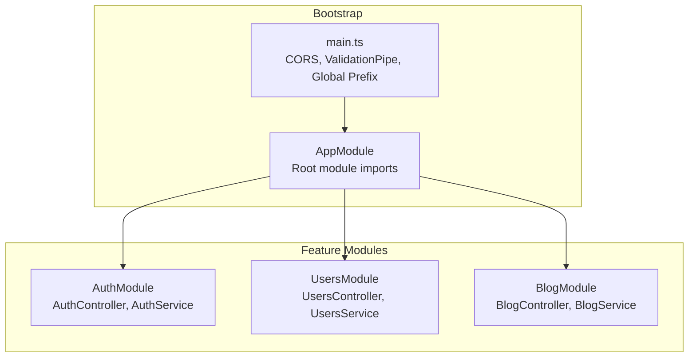
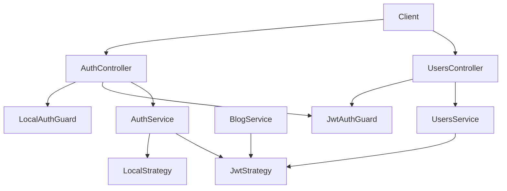
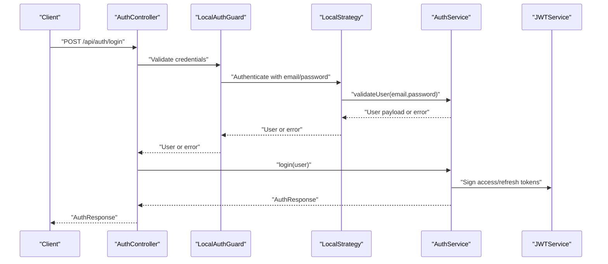
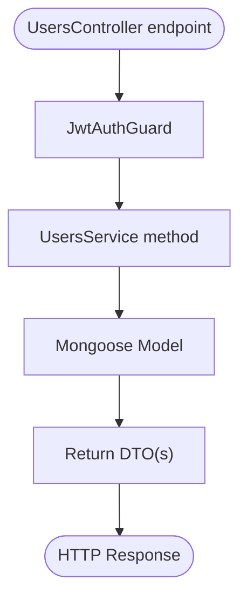
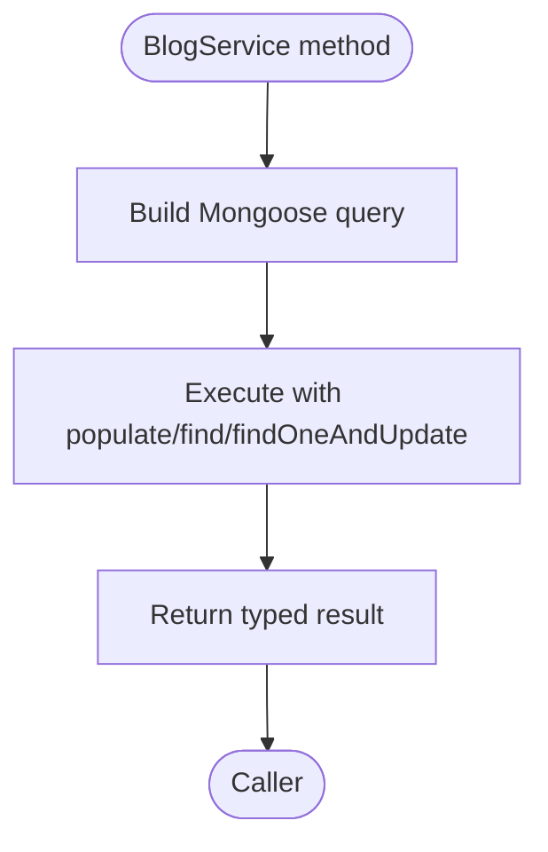
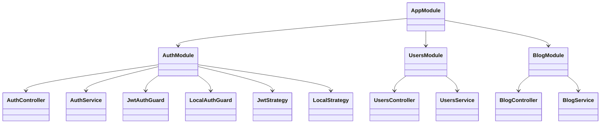
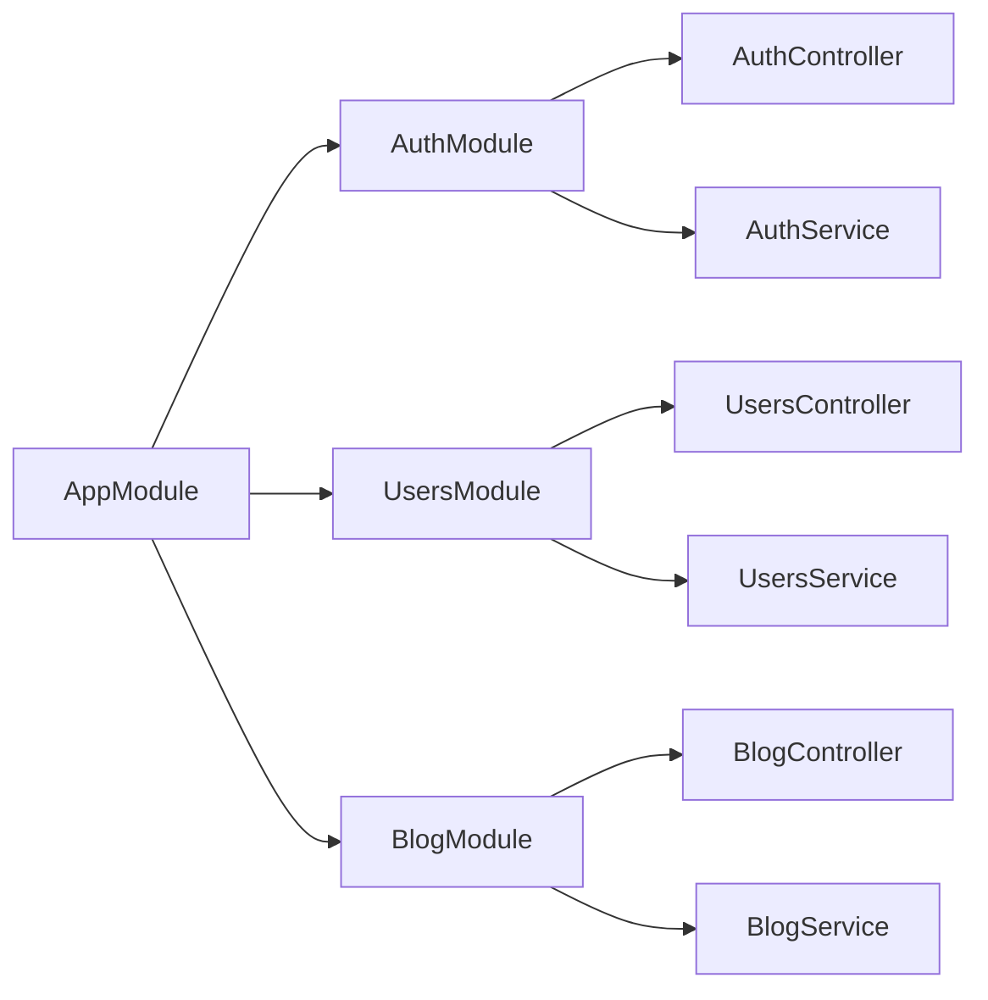

# Backend Architecture

<cite>
**Referenced Files in This Document**
- [main.ts](file://backend/src/main.ts)
- [app.module.ts](file://backend/src/app.module.ts)
- [auth.module.ts](file://backend/src/auth/auth.module.ts)
- [users.module.ts](file://backend/src/users/users.module.ts)
- [blog.module.ts](file://backend/src/blog/blog.module.ts)
- [auth.controller.ts](file://backend/src/auth/auth.controller.ts)
- [users.controller.ts](file://backend/src/users/users.controller.ts)
- [auth.service.ts](file://backend/src/auth/auth.service.ts)
- [users.service.ts](file://backend/src/users/users.service.ts)
- [blog.service.ts](file://backend/src/blog/blog.service.ts)
- [auth.guard.ts](file://backend/src/auth/guards/auth.guard.ts)
- [jwt.strategy.ts](file://backend/src/auth/strategies/jwt.strategy.ts)
- [local.strategy.ts](file://backend/src/auth/strategies/local.strategy.ts)
- [auth.dto.ts](file://backend/src/auth/dto/auth.dto.ts)
- [user.dto.ts](file://backend/src/users/dto/user.dto.ts)
</cite>

## Table of Contents
1. [Introduction](#introduction)
2. [Project Structure](#project-structure)
3. [Core Components](#core-components)
4. [Architecture Overview](#architecture-overview)
5. [Detailed Component Analysis](#detailed-component-analysis)
6. [Dependency Analysis](#dependency-analysis)
7. [Performance Considerations](#performance-considerations)
8. [Troubleshooting Guide](#troubleshooting-guide)
9. [Conclusion](#conclusion)

## Introduction
This document explains the NestJS backend architecture for the Multi-Application Control Dashboard. It covers the module-based design, dependency injection, layered architecture (controllers, services, DTOs, schemas), middleware and guards, and the MongoDB/Mongoose data layer. It also includes architectural diagrams and practical guidance for developers and operators.

## Project Structure
The backend is organized around a central application module that composes feature modules. Each feature module encapsulates:
- A controller for HTTP endpoints
- A service for business logic
- Mongoose schemas/models via forFeature registration
- DTOs for request/response validation
- Guards and strategies for authentication/authorization
- Optional decorators for metadata extraction

**Diagram sources**
- [main.ts](file://backend/src/main.ts#L1-L54)
- [app.module.ts](file://backend/src/app.module.ts#L1-L41)
- [auth.module.ts](file://backend/src/auth/auth.module.ts#L1-L30)
- [users.module.ts](file://backend/src/users/users.module.ts#L1-L14)
- [blog.module.ts](file://backend/src/blog/blog.module.ts#L1-L14)

**Section sources**
- [main.ts](file://backend/src/main.ts#L1-L54)
- [app.module.ts](file://backend/src/app.module.ts#L1-L41)

## Core Components
- Application bootstrap and middleware pipeline:
  - CORS enabled for development origins
  - Global ValidationPipe enforcing whitelisting and transformation
  - Global API prefix set to api
- Root module composes all feature modules and database connection
- Feature modules encapsulate domain logic with clear boundaries

Key responsibilities:
- Controllers: HTTP endpoints, guards, request binding
- Services: Business logic, persistence orchestration
- DTOs: Validation and serialization contracts
- Schemas: Mongoose models for MongoDB collections
- Guards/Strategies: Authentication and authorization policies

**Section sources**
- [main.ts](file://backend/src/main.ts#L1-L54)
- [app.module.ts](file://backend/src/app.module.ts#L1-L41)

## Architecture Overview
The system follows a layered, module-driven architecture:
- Layered pattern: Controllers -> Services -> Mongoose Models
- DI container registers providers per module and exposes them via exports
- Cross-cutting concerns (validation, auth) applied globally or per controller

**Diagram sources**
- [auth.controller.ts](file://backend/src/auth/auth.controller.ts#L1-L58)
- [users.controller.ts](file://backend/src/users/users.controller.ts#L1-L52)
- [auth.service.ts](file://backend/src/auth/auth.service.ts#L1-L125)
- [users.service.ts](file://backend/src/users/users.service.ts#L1-L78)
- [blog.service.ts](file://backend/src/blog/blog.service.ts#L1-L78)
- [auth.guard.ts](file://backend/src/auth/guards/auth.guard.ts#L1-L26)
- [jwt.strategy.ts](file://backend/src/auth/strategies/jwt.strategy.ts#L1-L25)
- [local.strategy.ts](file://backend/src/auth/strategies/local.strategy.ts#L1-L16)

## Detailed Component Analysis

### Authentication Module
- Purpose: Registration, login, profile retrieval, token refresh, logout
- Security: JWT access tokens, optional refresh tokens, bcrypt password hashing
- Guards: JwtAuthGuard, LocalAuthGuard, OptionalJwtAuthGuard
- Strategies: JWT extraction and validation, local username/password validation
- DTOs: Register, Login, RefreshToken, AuthResponse, ChangePassword

**Diagram sources**
- [auth.controller.ts](file://backend/src/auth/auth.controller.ts#L1-L58)
- [auth.guard.ts](file://backend/src/auth/guards/auth.guard.ts#L1-L26)
- [local.strategy.ts](file://backend/src/auth/strategies/local.strategy.ts#L1-L16)
- [auth.service.ts](file://backend/src/auth/auth.service.ts#L1-L125)

**Section sources**
- [auth.module.ts](file://backend/src/auth/auth.module.ts#L1-L30)
- [auth.controller.ts](file://backend/src/auth/auth.controller.ts#L1-L58)
- [auth.service.ts](file://backend/src/auth/auth.service.ts#L1-L125)
- [auth.guard.ts](file://backend/src/auth/guards/auth.guard.ts#L1-L26)
- [jwt.strategy.ts](file://backend/src/auth/strategies/jwt.strategy.ts#L1-L25)
- [local.strategy.ts](file://backend/src/auth/strategies/local.strategy.ts#L1-L16)
- [auth.dto.ts](file://backend/src/auth/dto/auth.dto.ts#L1-L58)

### Users Module
- Purpose: CRUD operations, role assignment, module assignment, password changes, search
- Security: Requires JWT for protected endpoints
- Persistence: Mongoose model for User collection

**Diagram sources**
- [users.controller.ts](file://backend/src/users/users.controller.ts#L1-L52)
- [users.service.ts](file://backend/src/users/users.service.ts#L1-L78)

**Section sources**
- [users.module.ts](file://backend/src/users/users.module.ts#L1-L14)
- [users.controller.ts](file://backend/src/users/users.controller.ts#L1-L52)
- [users.service.ts](file://backend/src/users/users.service.ts#L1-L78)
- [user.dto.ts](file://backend/src/users/dto/user.dto.ts#L1-L62)

### Blog Module
- Purpose: Manage blog posts (CRUD), publishing workflow, author lookup, search, stats
- Persistence: Mongoose model for BlogPost collection
- Populated relations: Author field populated with selected fields

**Diagram sources**
- [blog.module.ts](file://backend/src/blog/blog.module.ts#L1-L14)
- [blog.service.ts](file://backend/src/blog/blog.service.ts#L1-L78)

**Section sources**
- [blog.module.ts](file://backend/src/blog/blog.module.ts#L1-L14)
- [blog.service.ts](file://backend/src/blog/blog.service.ts#L1-L78)

### Middleware Pipeline and Global Exception Handling
- CORS: Permissive configuration for development origins; logs blocked origins
- ValidationPipe: Whitelist enforcement, forbidNonWhitelisted, transform
- Global prefix: All routes prefixed with api
- No explicit global exception filter configured; rely on Nest default behavior

Operational notes:
- Adjust allowedOrigins in production deployments
- ValidationPipe ensures strict DTO-bound inputs

**Section sources**
- [main.ts](file://backend/src/main.ts#L1-L54)

### Dependency Injection and Provider Lifecycle
- Providers are registered per module and exported for cross-module consumption
- Services receive Mongoose models via @InjectModel with proper schema registration
- Guards and strategies are singletons managed by Nest’s DI container
- AuthService depends on JwtService and injected UserModel

**Diagram sources**
- [app.module.ts](file://backend/src/app.module.ts#L1-L41)
- [auth.module.ts](file://backend/src/auth/auth.module.ts#L1-L30)
- [users.module.ts](file://backend/src/users/users.module.ts#L1-L14)
- [blog.module.ts](file://backend/src/blog/blog.module.ts#L1-L14)

**Section sources**
- [auth.module.ts](file://backend/src/auth/auth.module.ts#L1-L30)
- [users.module.ts](file://backend/src/users/users.module.ts#L1-L14)
- [blog.module.ts](file://backend/src/blog/blog.module.ts#L1-L14)

## Dependency Analysis
- AppModule composes all feature modules and database connection
- Feature modules depend on MongooseModule.forFeature for their models
- Controllers depend on services; services depend on Mongoose models
- Guards and strategies are injected into controllers/services as needed

**Diagram sources**
- [app.module.ts](file://backend/src/app.module.ts#L1-L41)
- [auth.module.ts](file://backend/src/auth/auth.module.ts#L1-L30)
- [users.module.ts](file://backend/src/users/users.module.ts#L1-L14)
- [blog.module.ts](file://backend/src/blog/blog.module.ts#L1-L14)

**Section sources**
- [app.module.ts](file://backend/src/app.module.ts#L1-L41)

## Performance Considerations
- Prefer lean queries by selecting only required fields (avoid returning passwords)
- Use pagination for list endpoints when data grows
- Index frequently queried fields (email, author, status) in MongoDB
- Cache infrequent reads (e.g., static configuration) at the service level
- Keep DTOs minimal and avoid unnecessary transformations

## Troubleshooting Guide
Common issues and resolutions:
- Validation errors: Ensure DTOs match class-validator constraints; check ValidationPipe configuration
- Authentication failures: Verify JWT_SECRET and JWT_REFRESH_SECRET; confirm passport strategies are registered
- CORS errors: Confirm client origin is allowed; review allowedHeaders/methods
- 401/403 responses: Confirm JwtAuthGuard is applied and Authorization header is present
- Mongoose errors: Verify model names and schema registrations in forFeature

Operational checks:
- Confirm MongoDB URI in environment variables
- Review server logs for CORS block messages
- Validate DTO payloads against class-validator rules

**Section sources**
- [main.ts](file://backend/src/main.ts#L1-L54)
- [auth.service.ts](file://backend/src/auth/auth.service.ts#L1-L125)
- [auth.guard.ts](file://backend/src/auth/guards/auth.guard.ts#L1-L26)

## Conclusion
The backend employs a clean, module-centric architecture with strong separation of concerns. Controllers are thin, services encapsulate business logic, and Mongoose provides a straightforward persistence layer. Global middleware enforces validation and cross-origin policies, while guards and strategies manage authentication securely. This design supports scalability, testability, and maintainability across feature modules.