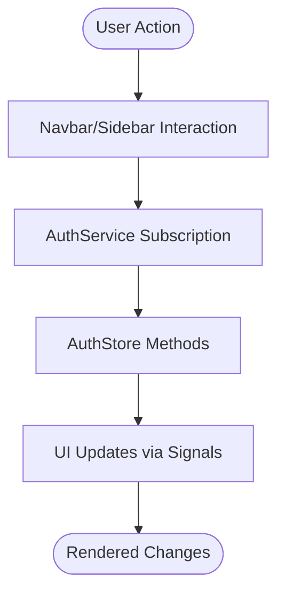

# Frontend Architecture

<cite>
**Referenced Files in This Document**
- [main.ts](file://frontend/src/main.ts)
- [app.component.ts](file://frontend/src/app/app.component.ts)
- [app.config.ts](file://frontend/src/app/app.config.ts)
- [app.routes.ts](file://frontend/src/app/app.routes.ts)
- [layout.component.ts](file://frontend/src/app/shared/layouts/layout.component.ts)
- [navbar.component.ts](file://frontend/src/app/shared/components/navbar/navbar.component.ts)
- [sidebar.component.ts](file://frontend/src/app/shared/components/sidebar/sidebar.component.ts)
- [auth.service.ts](file://frontend/src/app/core/services/auth.service.ts)
- [auth.store.ts](file://frontend/src/app/core/store/auth.store.ts)
- [auth.guard.ts](file://frontend/src/app/core/guards/auth.guard.ts)
- [role.guard.ts](file://frontend/src/app/core/guards/role.guard.ts)
- [auth.interceptor.ts](file://frontend/src/app/core/interceptors/auth.interceptor.ts)
- [error.interceptor.ts](file://frontend/src/app/core/interceptors/error.interceptor.ts)
- [study-notes.routes.ts](file://frontend/src/app/features/study-notes/study-notes.routes.ts)
- [dashboard.component.ts](file://frontend/src/app/features/dashboard/dashboard.component.ts)
</cite>

## Table of Contents
1. [Introduction](#introduction)
2. [Project Structure](#project-structure)
3. [Core Components](#core-components)
4. [Architecture Overview](#architecture-overview)
5. [Detailed Component Analysis](#detailed-component-analysis)
6. [Dependency Analysis](#dependency-analysis)
7. [Performance Considerations](#performance-considerations)
8. [Troubleshooting Guide](#troubleshooting-guide)
9. [Conclusion](#conclusion)

## Introduction
This document explains the Angular frontend architecture for the Multi-Application Control Dashboard. It covers the component hierarchy starting from the root component down to feature-specific components, the reactive programming model using Angular Signals via NgRx Signals, the lazy loading strategy implemented through the Angular Router, component communication patterns (parent-child, service-based, and signal store integration), and the responsive design approach using Tailwind CSS utility classes. Architectural diagrams illustrate the component tree and data flow.

## Project Structure
The Angular application bootstraps through a minimal entry point and configures routing, interceptors, and guards globally. The main application shell uses a shared Layout component that hosts the navigation bar and sidebar, wrapping child routes loaded lazily per feature module.

**Diagram sources**
- [main.ts](file://frontend/src/main.ts#L1-L7)
- [app.component.ts](file://frontend/src/app/app.component.ts#L1-L13)
- [app.config.ts](file://frontend/src/app/app.config.ts#L1-L34)
- [app.routes.ts](file://frontend/src/app/app.routes.ts#L1-L114)
- [layout.component.ts](file://frontend/src/app/shared/layouts/layout.component.ts#L1-L15)
- [navbar.component.ts](file://frontend/src/app/shared/components/navbar/navbar.component.ts#L1-L120)
- [sidebar.component.ts](file://frontend/src/app/shared/components/sidebar/sidebar.component.ts#L1-L265)
- [auth.service.ts](file://frontend/src/app/core/services/auth.service.ts#L1-L161)
- [auth.store.ts](file://frontend/src/app/core/store/auth.store.ts#L1-L223)
- [auth.guard.ts](file://frontend/src/app/core/guards/auth.guard.ts#L1-L26)
- [role.guard.ts](file://frontend/src/app/core/guards/role.guard.ts#L1-L134)
- [auth.interceptor.ts](file://frontend/src/app/core/interceptors/auth.interceptor.ts#L1-L46)
- [error.interceptor.ts](file://frontend/src/app/core/interceptors/error.interceptor.ts#L1-L153)
- [study-notes.routes.ts](file://frontend/src/app/features/study-notes/study-notes.routes.ts#L1-L21)
- [dashboard.component.ts](file://frontend/src/app/features/dashboard/dashboard.component.ts#L1-L379)

**Section sources**
- [main.ts](file://frontend/src/main.ts#L1-L7)
- [app.config.ts](file://frontend/src/app/app.config.ts#L1-L34)
- [app.routes.ts](file://frontend/src/app/app.routes.ts#L1-L114)

## Core Components
- Root component: Provides the application shell and renders routed content.
- Layout component: Wraps child routes with shared navigation and sidebar.
- Navigation bar: Displays user info, role badges, and logout actions.
- Sidebar: Builds dynamic menus based on user role and module access; supports responsive behavior.
- Authentication service: Manages user sessions, tokens, and profile retrieval.
- Authentication store: Centralized state using NgRx Signals for auth-related state and derived computations.
- Guards and interceptors: Enforce authentication, role-based access, and module access; handle token refresh and error responses.

**Section sources**
- [app.component.ts](file://frontend/src/app/app.component.ts#L1-L13)
- [layout.component.ts](file://frontend/src/app/shared/layouts/layout.component.ts#L1-L15)
- [navbar.component.ts](file://frontend/src/app/shared/components/navbar/navbar.component.ts#L1-L120)
- [sidebar.component.ts](file://frontend/src/app/shared/components/sidebar/sidebar.component.ts#L1-L265)
- [auth.service.ts](file://frontend/src/app/core/services/auth.service.ts#L1-L161)
- [auth.store.ts](file://frontend/src/app/core/store/auth.store.ts#L1-L223)
- [auth.guard.ts](file://frontend/src/app/core/guards/auth.guard.ts#L1-L26)
- [role.guard.ts](file://frontend/src/app/core/guards/role.guard.ts#L1-L134)
- [auth.interceptor.ts](file://frontend/src/app/core/interceptors/auth.interceptor.ts#L1-L46)
- [error.interceptor.ts](file://frontend/src/app/core/interceptors/error.interceptor.ts#L1-L153)

## Architecture Overview
The application follows a layered architecture:
- Bootstrap layer initializes providers and routes.
- Routing layer defines global and feature routes with lazy loading and guards.
- Shared layer provides reusable UI components (Layout, Navbar, Sidebar).
- Core layer encapsulates services, stores, guards, and interceptors.
- Feature layer organizes domain-specific modules with their own route configurations.

**Diagram sources**
- [app.component.ts](file://frontend/src/app/app.component.ts#L1-L13)
- [layout.component.ts](file://frontend/src/app/shared/layouts/layout.component.ts#L1-L15)
- [navbar.component.ts](file://frontend/src/app/shared/components/navbar/navbar.component.ts#L1-L120)
- [sidebar.component.ts](file://frontend/src/app/shared/components/sidebar/sidebar.component.ts#L1-L265)
- [app.config.ts](file://frontend/src/app/app.config.ts#L1-L34)
- [app.routes.ts](file://frontend/src/app/app.routes.ts#L1-L114)
- [auth.guard.ts](file://frontend/src/app/core/guards/auth.guard.ts#L1-L26)
- [role.guard.ts](file://frontend/src/app/core/guards/role.guard.ts#L1-L134)
- [auth.service.ts](file://frontend/src/app/core/services/auth.service.ts#L1-L161)
- [auth.store.ts](file://frontend/src/app/core/store/auth.store.ts#L1-L223)
- [auth.interceptor.ts](file://frontend/src/app/core/interceptors/auth.interceptor.ts#L1-L46)
- [error.interceptor.ts](file://frontend/src/app/core/interceptors/error.interceptor.ts#L1-L153)
- [dashboard.component.ts](file://frontend/src/app/features/dashboard/dashboard.component.ts#L1-L379)
- [study-notes.routes.ts](file://frontend/src/app/features/study-notes/study-notes.routes.ts#L1-L21)

## Detailed Component Analysis

### Component Hierarchy and Communication Patterns
- Root to Layout: The root component renders the primary outlet; the Layout component acts as a shell for authenticated routes.
- Layout to Shared Components: The Layout component imports and hosts the Navbar and Sidebar, enabling parent-to-child communication via template bindings and service subscriptions.
- Sidebar to Services: The Sidebar subscribes to the authentication service to reflect user role and module access, and uses the permission service to filter menu items.
- Navbar to Services: The Navbar subscribes to the authentication service for user details and triggers logout actions.
- Feature Components: Feature components (e.g., Dashboard) are lazy-loaded under the Layout, minimizing initial bundle size.

**Diagram sources**
- [app.component.ts](file://frontend/src/app/app.component.ts#L1-L13)
- [layout.component.ts](file://frontend/src/app/shared/layouts/layout.component.ts#L1-L15)
- [navbar.component.ts](file://frontend/src/app/shared/components/navbar/navbar.component.ts#L1-L120)
- [sidebar.component.ts](file://frontend/src/app/shared/components/sidebar/sidebar.component.ts#L1-L265)
- [auth.service.ts](file://frontend/src/app/core/services/auth.service.ts#L1-L161)
- [auth.store.ts](file://frontend/src/app/core/store/auth.store.ts#L1-L223)
- [dashboard.component.ts](file://frontend/src/app/features/dashboard/dashboard.component.ts#L1-L379)

**Section sources**
- [app.component.ts](file://frontend/src/app/app.component.ts#L1-L13)
- [layout.component.ts](file://frontend/src/app/shared/layouts/layout.component.ts#L1-L15)
- [navbar.component.ts](file://frontend/src/app/shared/components/navbar/navbar.component.ts#L1-L120)
- [sidebar.component.ts](file://frontend/src/app/shared/components/sidebar/sidebar.component.ts#L1-L265)
- [dashboard.component.ts](file://frontend/src/app/features/dashboard/dashboard.component.ts#L1-L379)

### Reactive Programming with Angular Signals (NgRx Signals)
- The authentication state is modeled using a signal-based store built with NgRx Signals. The store encapsulates state, computed derivations (e.g., user role checks, loading flags), and methods to mutate state.
- The store integrates with the legacy RxJS-based AuthService by converting observable responses to promises for async/await usage, while still leveraging signals for reactive UI updates.
- The Navbar and Sidebar subscribe to the AuthService observable stream to reflect user changes in real-time.

**Diagram sources**
- [auth.store.ts](file://frontend/src/app/core/store/auth.store.ts#L1-L223)
- [auth.service.ts](file://frontend/src/app/core/services/auth.service.ts#L1-L161)

**Section sources**
- [auth.store.ts](file://frontend/src/app/core/store/auth.store.ts#L1-L223)
- [auth.service.ts](file://frontend/src/app/core/services/auth.service.ts#L1-L161)

### Lazy Loading Strategy with Angular Router
- Global routes define:
  - Auth routes (no layout) with eager components for login and registration.
  - Main app routes (with layout) protected by an auth guard and containing child routes for modules.
- Feature modules are lazy-loaded using loadChildren with route-level lazy component loading for nested routes.
- Module access is enforced via a module guard that caches access decisions to reduce API calls.

**Diagram sources**
- [app.routes.ts](file://frontend/src/app/app.routes.ts#L1-L114)
- [layout.component.ts](file://frontend/src/app/shared/layouts/layout.component.ts#L1-L15)
- [study-notes.routes.ts](file://frontend/src/app/features/study-notes/study-notes.routes.ts#L1-L21)
- [role.guard.ts](file://frontend/src/app/core/guards/role.guard.ts#L1-L134)

**Section sources**
- [app.routes.ts](file://frontend/src/app/app.routes.ts#L1-L114)
- [study-notes.routes.ts](file://frontend/src/app/features/study-notes/study-notes.routes.ts#L1-L21)
- [role.guard.ts](file://frontend/src/app/core/guards/role.guard.ts#L1-L134)

### Component Communication Patterns
- Parent-to-child (Layout to Navbar/Sidebar): The Layout component hosts the Navbar and Sidebar; communication occurs via template bindings and service subscriptions.
- Service-based communication: Both Navbar and Sidebar subscribe to the AuthService to react to user changes and role updates.
- Signal store integration: The store exposes computed signals and methods consumed by components; components do not directly manage HTTP calls but delegate to the store.

**Diagram sources**
- [navbar.component.ts](file://frontend/src/app/shared/components/navbar/navbar.component.ts#L1-L120)
- [sidebar.component.ts](file://frontend/src/app/shared/components/sidebar/sidebar.component.ts#L1-L265)
- [auth.service.ts](file://frontend/src/app/core/services/auth.service.ts#L1-L161)
- [auth.store.ts](file://frontend/src/app/core/store/auth.store.ts#L1-L223)

**Section sources**
- [navbar.component.ts](file://frontend/src/app/shared/components/navbar/navbar.component.ts#L1-L120)
- [sidebar.component.ts](file://frontend/src/app/shared/components/sidebar/sidebar.component.ts#L1-L265)
- [auth.service.ts](file://frontend/src/app/core/services/auth.service.ts#L1-L161)
- [auth.store.ts](file://frontend/src/app/core/store/auth.store.ts#L1-L223)

### Responsive Design with Tailwind CSS
- The Sidebar component detects screen size and toggles mobile vs desktop behavior, ensuring appropriate layout on small screens.
- Utility classes are applied for responsive spacing, alignment, and visual states across components.
- The Navbar adapts dropdown and mobile menu states based on viewport width and user interactions.

**Diagram sources**
- [sidebar.component.ts](file://frontend/src/app/shared/components/sidebar/sidebar.component.ts#L1-L265)
- [navbar.component.ts](file://frontend/src/app/shared/components/navbar/navbar.component.ts#L1-L120)

**Section sources**
- [sidebar.component.ts](file://frontend/src/app/shared/components/sidebar/sidebar.component.ts#L1-L265)
- [navbar.component.ts](file://frontend/src/app/shared/components/navbar/navbar.component.ts#L1-L120)

## Dependency Analysis
The application’s runtime dependencies are configured in the application configuration provider list. Providers include:
- Router configuration and interceptors registered globally.
- Guards registered for route protection.
- HTTP interceptors for authentication and error handling.
- Services and stores injected at root level.

**Diagram sources**
- [app.config.ts](file://frontend/src/app/app.config.ts#L1-L34)

**Section sources**
- [app.config.ts](file://frontend/src/app/app.config.ts#L1-L34)

## Performance Considerations
- Lazy loading: Feature modules and components are lazy-loaded to reduce initial bundle size.
- Guard caching: Module access guard caches results to minimize repeated API calls.
- Zone coalescing: Zone change detection is configured to coalesce events for improved performance.
- Interceptor retries: The error interceptor retries failed requests once before surfacing errors.

**Section sources**
- [app.routes.ts](file://frontend/src/app/app.routes.ts#L1-L114)
- [role.guard.ts](file://frontend/src/app/core/guards/role.guard.ts#L1-L134)
- [app.config.ts](file://frontend/src/app/app.config.ts#L1-L34)
- [error.interceptor.ts](file://frontend/src/app/core/interceptors/error.interceptor.ts#L1-L153)

## Troubleshooting Guide
- Authentication failures:
  - 401 Unauthorized triggers automatic logout and redirects to the login page.
  - The AuthInterceptor attempts token refresh; on failure, it logs out and rethrows the error.
- Access denials:
  - RoleGuard and ModuleGuard redirect unauthenticated or unauthorized users to the access-denied page.
- Error handling:
  - The ErrorInterceptor displays user-friendly messages via toast notifications and navigates to appropriate pages based on HTTP status codes.
- Session persistence:
  - The AuthService persists tokens and user data in local storage; on logout, all entries are removed and state is reset.

**Section sources**
- [auth.interceptor.ts](file://frontend/src/app/core/interceptors/auth.interceptor.ts#L1-L46)
- [error.interceptor.ts](file://frontend/src/app/core/interceptors/error.interceptor.ts#L1-L153)
- [auth.guard.ts](file://frontend/src/app/core/guards/auth.guard.ts#L1-L26)
- [role.guard.ts](file://frontend/src/app/core/guards/role.guard.ts#L1-L134)
- [auth.service.ts](file://frontend/src/app/core/services/auth.service.ts#L1-L161)

## Conclusion
The Angular frontend employs a clean separation of concerns with a shared Layout shell, robust guards and interceptors, and a signal-based store for reactive state management. Lazy loading and guard caching optimize performance, while Tailwind CSS ensures responsive UI behavior. The documented component hierarchy and communication patterns provide a clear blueprint for extending the application with new features and maintaining scalability.