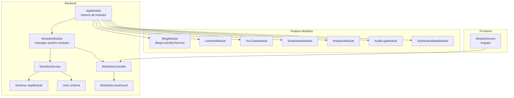
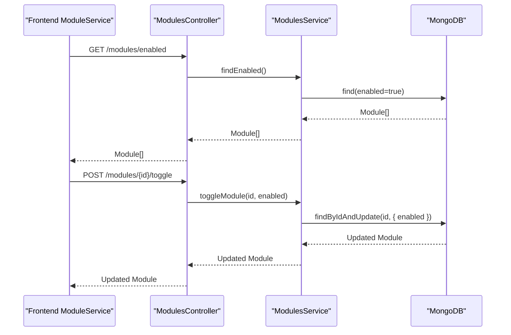
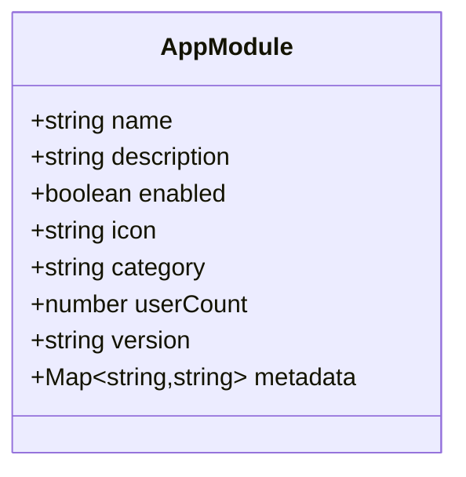
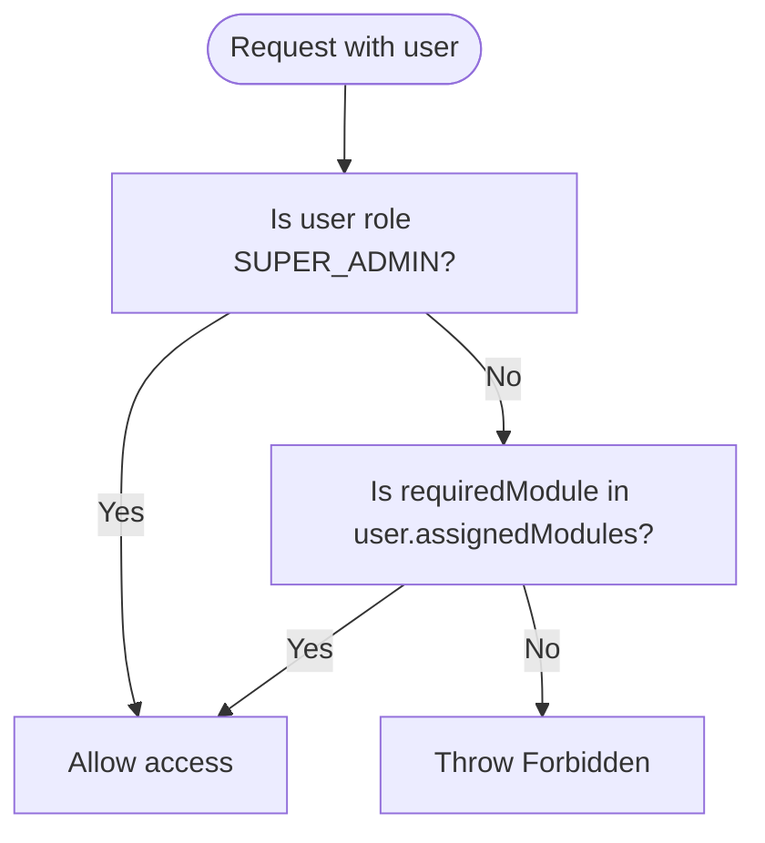
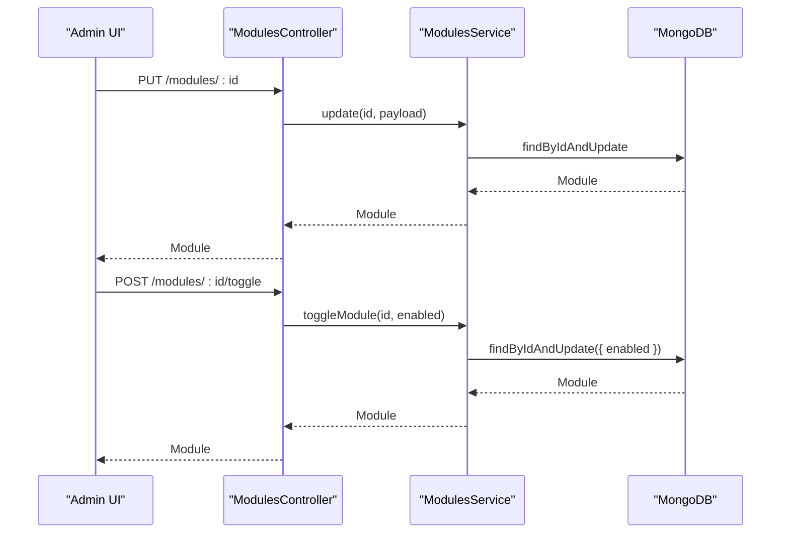
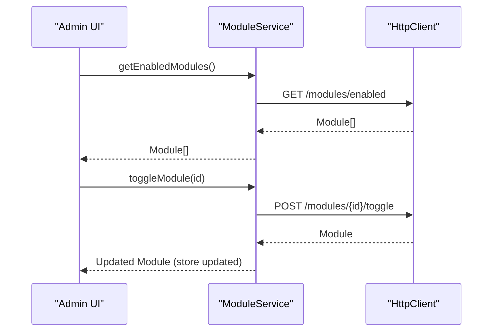
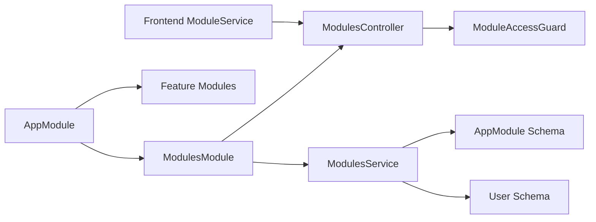

# Module Organization

<cite>
**Referenced Files in This Document**
- [module.schema.ts](file://backend/src/modules/schemas/module.schema.ts)
- [modules.service.ts](file://backend/src/modules/modules.service.ts)
- [modules.controller.ts](file://backend/src/modules/modules.controller.ts)
- [modules.module.ts](file://backend/src/modules/modules.module.ts)
- [module-access.guard.ts](file://backend/src/auth/guards/module-access.guard.ts)
- [create-module.dto.ts](file://backend/src/modules/dto/create-module.dto.ts)
- [user.schema.ts](file://backend/src/users/schemas/user.schema.ts)
- [blog.service.ts](file://backend/src/modules/blog/blog.service.ts)
- [blog.controller.ts](file://backend/src/modules/blog/blog.controller.ts)
- [app.module.ts](file://backend/src/app.module.ts)
- [role.schema.ts](file://backend/src/roles/schemas/role.schema.ts)
- [roles.service.ts](file://backend/src/roles/roles.service.ts)
- [permission.schema.ts](file://backend/src/permissions/schemas/permission.schema.ts)
- [permissions.service.ts](file://backend/src/permissions/permissions.service.ts)
- [module.service.ts](file://frontend/src/app/core/services/module.service.ts)
</cite>

## Table of Contents
1. [Introduction](#introduction)
2. [Project Structure](#project-structure)
3. [Core Components](#core-components)
4. [Architecture Overview](#architecture-overview)
5. [Detailed Component Analysis](#detailed-component-analysis)
6. [Dependency Analysis](#dependency-analysis)
7. [Performance Considerations](#performance-considerations)
8. [Troubleshooting Guide](#troubleshooting-guide)
9. [Conclusion](#conclusion)
10. [Appendices](#appendices)

## Introduction
This document explains the module organization system that enables administrators to dynamically enable or disable features at runtime. It covers the module schema design with status tracking and metadata storage, the module access control system integrated with role-based permissions, and the initialization and configuration management that supports runtime module switching. It also provides patterns and examples for adding new modules consistently across the backend NestJS modules and the Angular frontend service layer.

## Project Structure
The module system spans the backend NestJS application and the Angular frontend:
- Backend: Centralized module management under backend/src/modules, with dedicated schemas, services, controllers, and DTOs. Example feature modules (blog, LinkedIn, YouTube, etc.) live alongside the core module management.
- Frontend: A dedicated service that fetches, toggles, and caches module state, and exposes helpers to check module availability and access.

**Diagram sources**
- [app.module.ts](file://backend/src/app.module.ts#L17-L40)
- [modules.module.ts](file://backend/src/modules/modules.module.ts#L8-L18)
- [modules.controller.ts](file://backend/src/modules/modules.controller.ts#L6-L7)
- [modules.service.ts](file://backend/src/modules/modules.service.ts#L8-L12)
- [module.schema.ts](file://backend/src/modules/schemas/module.schema.ts#L4-L29)
- [user.schema.ts](file://backend/src/users/schemas/user.schema.ts#L13-L49)
- [module-access.guard.ts](file://backend/src/auth/guards/module-access.guard.ts#L4-L26)
- [blog.controller.ts](file://backend/src/modules/blog/blog.controller.ts#L21-L24)
- [module.service.ts](file://frontend/src/app/core/services/module.service.ts#L30-L35)

**Section sources**
- [app.module.ts](file://backend/src/app.module.ts#L17-L40)
- [modules.module.ts](file://backend/src/modules/modules.module.ts#L8-L18)
- [module.service.ts](file://frontend/src/app/core/services/module.service.ts#L30-L35)

## Core Components
- Module schema: Defines module identity, status, metadata, and counts.
- Modules service: CRUD, enable/disable toggling, stats aggregation, and access checks.
- Modules controller: Exposes REST endpoints for module management and access verification.
- ModuleAccessGuard: Enforces per-module access at runtime based on user assignments.
- User schema: Tracks assigned modules per user for access enforcement.
- Role and permission schemas: Define roles and module-scoped permissions for fine-grained control.
- Feature modules: Examples (blog, LinkedIn, YouTube) demonstrate the established pattern for adding new modules.

**Section sources**
- [module.schema.ts](file://backend/src/modules/schemas/module.schema.ts#L4-L29)
- [modules.service.ts](file://backend/src/modules/modules.service.ts#L8-L94)
- [modules.controller.ts](file://backend/src/modules/modules.controller.ts#L6-L58)
- [module-access.guard.ts](file://backend/src/auth/guards/module-access.guard.ts#L4-L26)
- [user.schema.ts](file://backend/src/users/schemas/user.schema.ts#L13-L49)
- [role.schema.ts](file://backend/src/roles/schemas/role.schema.ts#L4-L8)
- [permission.schema.ts](file://backend/src/permissions/schemas/permission.schema.ts#L4-L17)
- [blog.controller.ts](file://backend/src/modules/blog/blog.controller.ts#L21-L24)
- [blog.service.ts](file://backend/src/modules/blog/blog.service.ts#L4-L40)

## Architecture Overview
The module system is designed around:
- Centralized module registry and lifecycle control via ModulesModule.
- Runtime access enforcement using ModuleAccessGuard and user assignment lists.
- Role-based permissions to complement module-level access.
- Frontend service that mirrors backend capabilities for UI-driven module management.

**Diagram sources**
- [modules.controller.ts](file://backend/src/modules/modules.controller.ts#L21-L24)
- [modules.controller.ts](file://backend/src/modules/modules.controller.ts#L54-L57)
- [modules.service.ts](file://backend/src/modules/modules.service.ts#L23-L43)

## Detailed Component Analysis

### Module Schema Design
The module schema defines the canonical structure for each system module:
- Identity: unique name and optional description, icon, category.
- Lifecycle: enabled flag with default true.
- Metrics: userCount numeric counter.
- Versioning: semantic version string.
- Metadata: freeform key-value map for extensibility.
- Timestamps: automatic createdAt/updatedAt.

**Diagram sources**
- [module.schema.ts](file://backend/src/modules/schemas/module.schema.ts#L4-L29)

**Section sources**
- [module.schema.ts](file://backend/src/modules/schemas/module.schema.ts#L4-L29)

### Module Access Control and RBAC Integration
Access control combines:
- ModuleAccessGuard: Enforces that a user has been assigned a specific module and is not a restricted role.
- User schema: Stores assignedModules as references to Module documents.
- Roles and permissions: Provides role types and module-scoped permissions for broader authorization.

**Diagram sources**
- [module-access.guard.ts](file://backend/src/auth/guards/module-access.guard.ts#L7-L26)
- [user.schema.ts](file://backend/src/users/schemas/user.schema.ts#L33-L34)
- [role.schema.ts](file://backend/src/roles/schemas/role.schema.ts#L4-L8)

**Section sources**
- [module-access.guard.ts](file://backend/src/auth/guards/module-access.guard.ts#L4-L26)
- [user.schema.ts](file://backend/src/users/schemas/user.schema.ts#L13-L49)
- [role.schema.ts](file://backend/src/roles/schemas/role.schema.ts#L4-L8)

### Module Management API and Runtime Switching
The ModulesController exposes endpoints for:
- Listing all modules, enabled modules, and statistics.
- Retrieving, updating, deleting, and toggling individual modules.
- Checking module access for a given user and module name.

**Diagram sources**
- [modules.controller.ts](file://backend/src/modules/modules.controller.ts#L44-L57)
- [modules.service.ts](file://backend/src/modules/modules.service.ts#L31-L43)

**Section sources**
- [modules.controller.ts](file://backend/src/modules/modules.controller.ts#L6-L58)
- [modules.service.ts](file://backend/src/modules/modules.service.ts#L14-L94)

### Frontend Module Management Service
The frontend ModuleService synchronizes module state with the backend:
- Fetches all modules and enabled modules.
- Updates module records and toggles enabled state.
- Checks module access for the current user.
- Maintains an observable stream of modules for reactive UI updates.

**Diagram sources**
- [module.service.ts](file://frontend/src/app/core/services/module.service.ts#L107-L116)
- [module.service.ts](file://frontend/src/app/core/services/module.service.ts#L83-L92)

**Section sources**
- [module.service.ts](file://frontend/src/app/core/services/module.service.ts#L30-L139)

### Adding New Modules: Patterns and Conventions
To add a new module following the established patterns:
- Create a new feature module folder under backend/src/modules/<your-module>.
- Implement controller, service, DTOs, and schema(s) inside the new folder.
- Register the new module in the backend AppModule imports.
- Ensure the feature module’s routes are protected by appropriate guards (e.g., JWT, RoleGuard, ModuleAccessGuard).
- On the frontend, integrate with ModuleService to reflect the module’s availability and access status.

Example reference modules:
- Blog module demonstrates a typical CRUD feature with role-based access and JWT protection.

**Section sources**
- [blog.controller.ts](file://backend/src/modules/blog/blog.controller.ts#L21-L24)
- [blog.service.ts](file://backend/src/modules/blog/blog.service.ts#L4-L40)
- [app.module.ts](file://backend/src/app.module.ts#L17-L40)

## Dependency Analysis
The module system exhibits clear separation of concerns:
- AppModule aggregates all modules, including the centralized ModulesModule.
- ModulesModule encapsulates module registry and access control logic.
- Feature modules depend on auth guards and decorators but remain decoupled from the module registry.
- Frontend ModuleService depends on backend endpoints and maintains a reactive store.

**Diagram sources**
- [app.module.ts](file://backend/src/app.module.ts#L17-L40)
- [modules.module.ts](file://backend/src/modules/modules.module.ts#L8-L18)
- [modules.controller.ts](file://backend/src/modules/modules.controller.ts#L6-L7)
- [modules.service.ts](file://backend/src/modules/modules.service.ts#L8-L12)
- [module-access.guard.ts](file://backend/src/auth/guards/module-access.guard.ts#L4-L26)
- [module.service.ts](file://frontend/src/app/core/services/module.service.ts#L30-L35)

**Section sources**
- [app.module.ts](file://backend/src/app.module.ts#L17-L40)
- [modules.module.ts](file://backend/src/modules/modules.module.ts#L8-L18)
- [modules.service.ts](file://backend/src/modules/modules.service.ts#L8-L12)
- [module-access.guard.ts](file://backend/src/auth/guards/module-access.guard.ts#L4-L26)
- [module.service.ts](file://frontend/src/app/core/services/module.service.ts#L30-L35)

## Performance Considerations
- Indexing: Ensure the module name field is indexed for fast lookup during access checks.
- Population: Access checks populate user.assignedModules; keep the list concise and avoid unnecessary deep population.
- Caching: Consider caching enabled modules and module access decisions at the edge (e.g., Redis) to reduce database load.
- Batch updates: Use batch endpoints where available to minimize network overhead when toggling multiple modules.

## Troubleshooting Guide
Common issues and resolutions:
- Access denied errors: Verify the user’s role and assignedModules. Super admins bypass module assignments; regular users require explicit assignment.
- Module not appearing: Confirm the module is enabled and present in the database; check the enabled filter endpoint.
- Toggle not taking effect: Ensure the toggle endpoint is called with the correct module ID and enabled flag; confirm the frontend store is updated.

**Section sources**
- [modules.service.ts](file://backend/src/modules/modules.service.ts#L56-L94)
- [module-access.guard.ts](file://backend/src/auth/guards/module-access.guard.ts#L15-L26)
- [module.service.ts](file://frontend/src/app/core/services/module.service.ts#L83-L92)

## Conclusion
The module organization system provides a robust, scalable foundation for dynamic feature control. Administrators can manage module availability and access through centralized APIs and guards, while the frontend integrates seamlessly with these capabilities. By following the documented patterns, teams can reliably add new modules and maintain consistent behavior across the platform.

## Appendices

### Module Schema Reference
- Fields: name, description, enabled, icon, category, userCount, version, metadata.
- Defaults: enabled defaults to true; userCount defaults to 0; metadata defaults to an empty map.

**Section sources**
- [module.schema.ts](file://backend/src/modules/schemas/module.schema.ts#L4-L29)

### Access Control Reference
- Roles: SUPER_ADMIN, ADMIN, VIEWER.
- Guards: ModuleAccessGuard enforces module assignment; RoleGuard and JWT guard protect routes.
- Permissions: Module-scoped permissions define actions (create, read, update, delete).

**Section sources**
- [role.schema.ts](file://backend/src/roles/schemas/role.schema.ts#L4-L8)
- [module-access.guard.ts](file://backend/src/auth/guards/module-access.guard.ts#L4-L26)
- [permission.schema.ts](file://backend/src/permissions/schemas/permission.schema.ts#L15-L16)