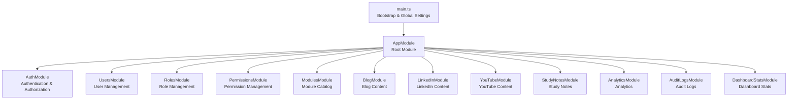
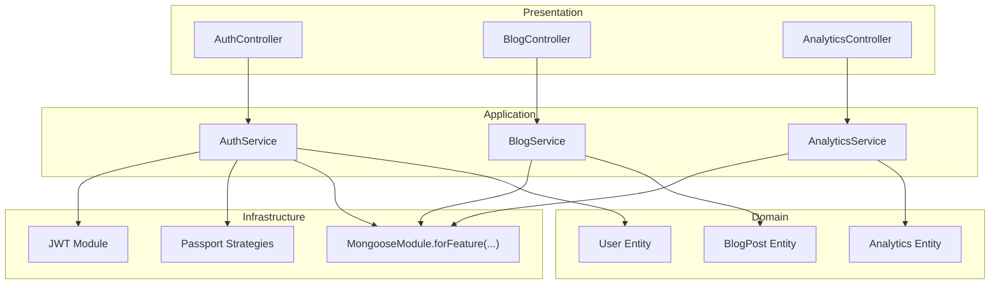
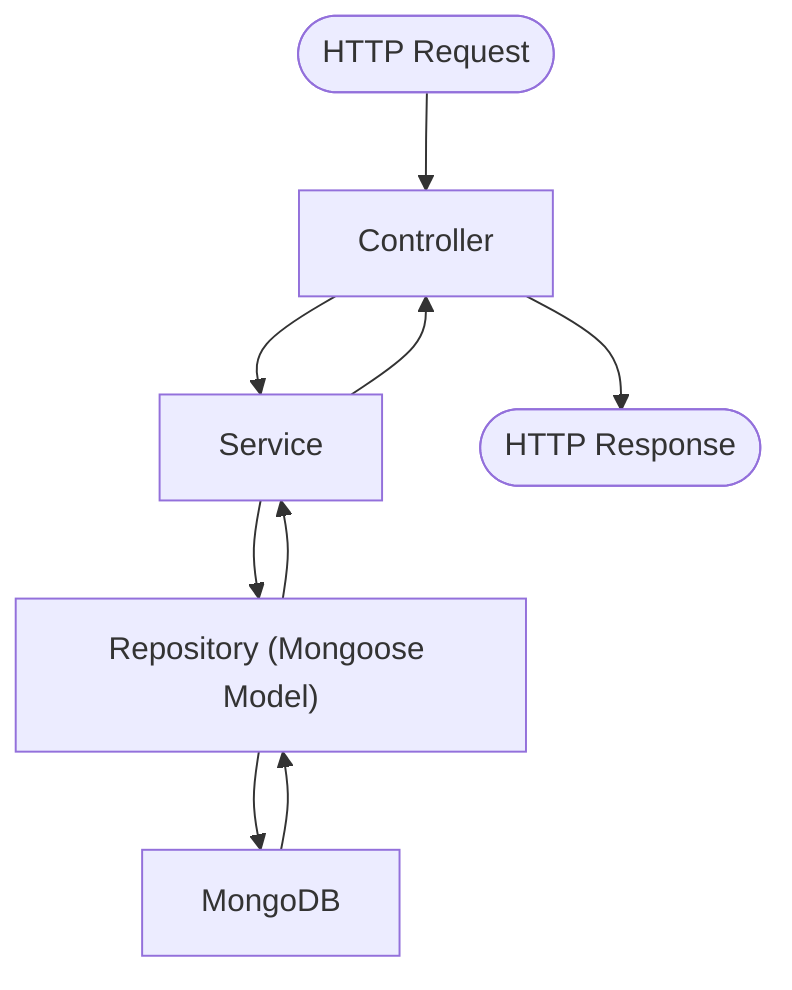
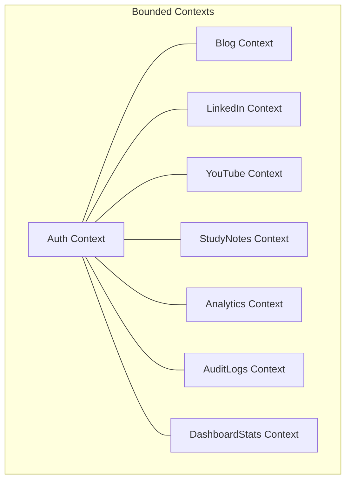
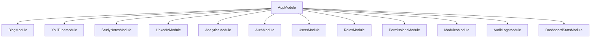
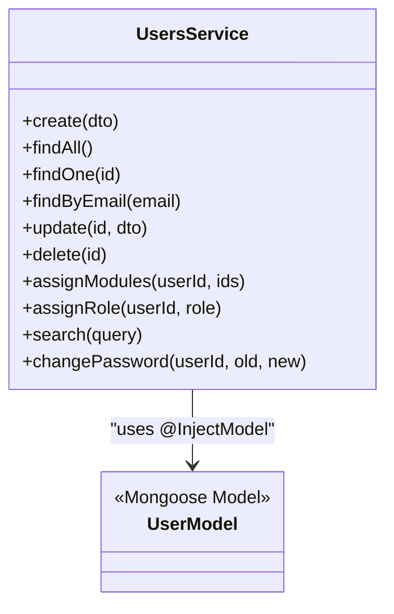
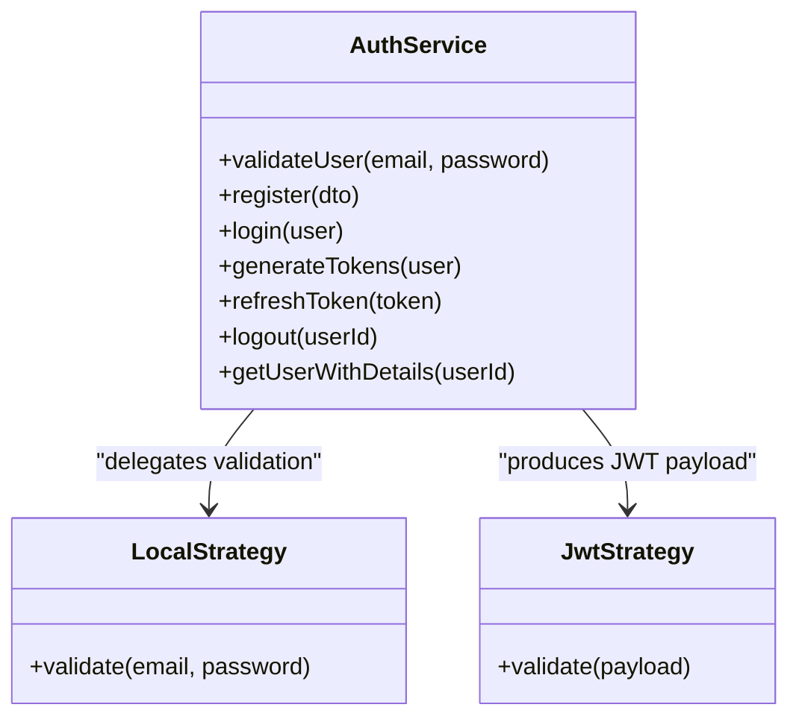
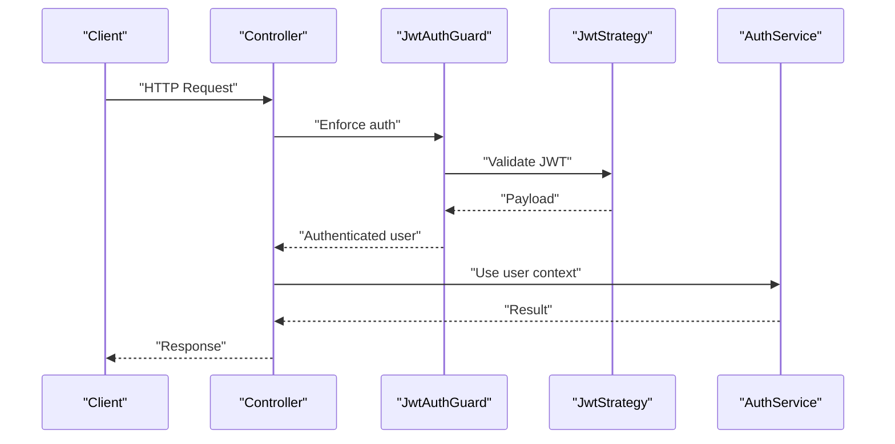
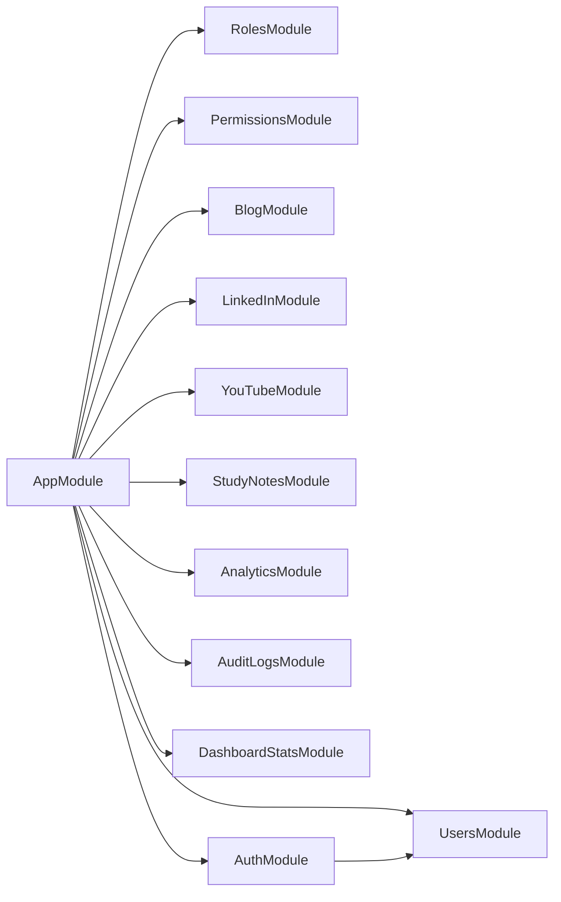

# System Design Patterns

<cite>
**Referenced Files in This Document**
- [app.module.ts](file://backend/src/app.module.ts)
- [main.ts](file://backend/src/main.ts)
- [auth.module.ts](file://backend/src/auth/auth.module.ts)
- [auth.service.ts](file://backend/src/auth/auth.service.ts)
- [auth.dto.ts](file://backend/src/auth/dto/auth.dto.ts)
- [auth.guard.ts](file://backend/src/auth/guards/auth.guard.ts)
- [jwt.strategy.ts](file://backend/src/auth/strategies/jwt.strategy.ts)
- [local.strategy.ts](file://backend/src/auth/strategies/local.strategy.ts)
- [current-user.decorator.ts](file://backend/src/auth/decorators/current-user.decorator.ts)
- [roles.decorator.ts](file://backend/src/auth/decorators/roles.decorator.ts)
- [role.guard.ts](file://backend/src/auth/guards/role.guard.ts)
- [module-access.guard.ts](file://backend/src/auth/guards/module-access.guard.ts)
- [users.service.ts](file://backend/src/users/users.service.ts)
- [analytics.module.ts](file://backend/src/analytics/analytics.module.ts)
- [blog.module.ts](file://backend/src/blog/blog.module.ts)
</cite>

## Table of Contents
1. [Introduction](#introduction)
2. [Project Structure](#project-structure)
3. [Core Components](#core-components)
4. [Architecture Overview](#architecture-overview)
5. [Detailed Component Analysis](#detailed-component-analysis)
6. [Dependency Analysis](#dependency-analysis)
7. [Performance Considerations](#performance-considerations)
8. [Troubleshooting Guide](#troubleshooting-guide)
9. [Conclusion](#conclusion)

## Introduction
This document explains the system design patterns implemented in the Multi-Application-Control-Dashboard. It focuses on Clean Architecture layering, Domain-Driven Design (DDD) bounded contexts, microservice-like modularity for content management, the Repository pattern with Mongoose ODM, the Strategy pattern for authentication, and the Decorator pattern for route guards. The goal is to provide a clear understanding of how separation of concerns, encapsulation, and modularization enable independent scaling and deployment of features.

## Project Structure
The backend follows a NestJS modular architecture. The root module aggregates feature modules, each encapsulating a bounded context with its own controller, service, Mongoose schema/model registration, and DTOs. The application bootstraps global configuration, CORS, validation pipes, and a global API prefix.

**Diagram sources**
- [main.ts](file://backend/src/main.ts#L1-L54)
- [app.module.ts](file://backend/src/app.module.ts#L1-L41)

**Section sources**
- [app.module.ts](file://backend/src/app.module.ts#L17-L36)
- [main.ts](file://backend/src/main.ts#L5-L51)

## Core Components
- Presentation Layer: Controllers expose HTTP endpoints per module (e.g., AuthController, BlogController).
- Application Layer: Services orchestrate use cases, coordinate repositories, and enforce application-specific rules.
- Domain Layer: Entities and value objects are represented by Mongoose schemas (e.g., User, BlogPost, Analytics).
- Infrastructure Layer: Mongoose ODM, Passport strategies, JWT configuration, and database connections.

Key patterns:
- Repository Pattern: Services depend on Mongoose models via NestJS @InjectModel, enabling abstraction over persistence.
- Strategy Pattern: Authentication uses Passport strategies (LocalStrategy, JwtStrategy) with configurable secret keys.
- Decorator Pattern: Route guards and parameter decorators (CurrentUser) augment request handling without altering core logic.
- Bounded Contexts: Each module encapsulates a domain context (e.g., Blog, YouTube, StudyNotes) with its own schema and service.

**Section sources**
- [auth.module.ts](file://backend/src/auth/auth.module.ts#L12-L28)
- [auth.service.ts](file://backend/src/auth/auth.service.ts#L10-L15)
- [users.service.ts](file://backend/src/users/users.service.ts#L8-L10)
- [analytics.module.ts](file://backend/src/analytics/analytics.module.ts#L7-L12)
- [blog.module.ts](file://backend/src/blog/blog.module.ts#L7-L12)

## Architecture Overview
Clean Architecture layered view with explicit boundaries:

**Diagram sources**
- [auth.module.ts](file://backend/src/auth/auth.module.ts#L12-L28)
- [auth.service.ts](file://backend/src/auth/auth.service.ts#L10-L15)
- [analytics.module.ts](file://backend/src/analytics/analytics.module.ts#L7-L12)
- [blog.module.ts](file://backend/src/blog/blog.module.ts#L7-L12)

## Detailed Component Analysis

### Clean Architecture Implementation
- Separation of Concerns:
  - Controllers handle HTTP concerns and delegate to services.
  - Services encapsulate application logic and coordinate repositories.
  - Schemas define domain entities and their persistence mapping.
  - Modules isolate concerns and export only what is needed.
- Dependency Direction:
  - Controllers -> Services
  - Services -> Domain Models (via Mongoose)
  - Modules -> External infra (Mongoose, Passport, JWT)

**Section sources**
- [auth.module.ts](file://backend/src/auth/auth.module.ts#L7-L11)
- [auth.service.ts](file://backend/src/auth/auth.service.ts#L10-L15)
- [users.service.ts](file://backend/src/users/users.service.ts#L8-L10)

### Domain-Driven Design (DDD) Bounded Contexts
- Each module represents a bounded context:
  - Auth: User identity, roles, permissions, tokens.
  - Blog: Blog posts lifecycle.
  - LinkedIn: LinkedIn posts lifecycle.
  - YouTube: YouTube content lifecycle.
  - StudyNotes: Notes lifecycle.
  - Analytics: Metrics collection.
  - AuditLogs: Audit trails.
  - DashboardStats: Dashboard metrics.
- Context Integrity:
  - Each module registers its own Mongoose model(s) and exposes a service/controller pair.
  - Cross-context coordination is explicit (e.g., user roles and module assignments).

**Section sources**
- [auth.module.ts](file://backend/src/auth/auth.module.ts#L12-L28)
- [blog.module.ts](file://backend/src/blog/blog.module.ts#L7-L12)
- [analytics.module.ts](file://backend/src/analytics/analytics.module.ts#L7-L12)

### Microservice-like Modular Architecture
- Independent Scaling and Deployment:
  - Each module is self-contained with its own controller/service/schema.
  - Root AppModule aggregates modules, enabling selective startup or hot-swapping contexts.
  - Clear boundaries facilitate containerization and independent deployments.
- Practical Benefits:
  - Feature teams can iterate on a single module without affecting others.
  - Database collections remain separate per domain context.

**Section sources**
- [app.module.ts](file://backend/src/app.module.ts#L17-L36)

### Repository Pattern with Mongoose ODM
- Abstraction Over Persistence:
  - Services receive Mongoose models via @InjectModel, decoupling from raw queries.
  - Methods encapsulate CRUD and complex queries (e.g., search, assign modules).
- Example Usage:
  - UsersService uses UserModel to create, find, update, and delete users.
  - Each module registers its model(s) in its module’s MongooseModule.forFeature.

**Diagram sources**
- [users.service.ts](file://backend/src/users/users.service.ts#L8-L77)

**Section sources**
- [users.service.ts](file://backend/src/users/users.service.ts#L12-L76)
- [auth.module.ts](file://backend/src/auth/auth.module.ts#L23-L23)

### Strategy Pattern for Authentication Methods
- Pluggable Authentication:
  - LocalStrategy validates credentials against stored hashes.
  - JwtStrategy extracts and verifies JWTs for protected routes.
  - Strategy selection occurs via Passport guards.
- Configuration:
  - JWT secret and expiration configured via ConfigService.
  - Strategies are registered in AuthModule and exported via AuthService.

**Diagram sources**
- [auth.service.ts](file://backend/src/auth/auth.service.ts#L17-L94)
- [local.strategy.ts](file://backend/src/auth/strategies/local.strategy.ts#L12-L14)
- [jwt.strategy.ts](file://backend/src/auth/strategies/jwt.strategy.ts#L16-L23)

**Section sources**
- [auth.module.ts](file://backend/src/auth/auth.module.ts#L12-L28)
- [auth.service.ts](file://backend/src/auth/auth.service.ts#L17-L123)
- [local.strategy.ts](file://backend/src/auth/strategies/local.strategy.ts#L6-L15)
- [jwt.strategy.ts](file://backend/src/auth/strategies/jwt.strategy.ts#L6-L24)

### Decorator Pattern for Route Guards and Parameter Extraction
- Guards:
  - JwtAuthGuard and LocalAuthGuard wrap Passport strategies.
  - RoleGuard enforces role-based access using Reflect metadata.
  - ModuleAccessGuard enforces module assignment rules.
- Decorators:
  - CurrentUser decorator extracts the authenticated user from the request.
  - Roles decorator sets metadata for RoleGuard.
- Composition:
  - Guards are stacked at controller/method level to compose policies.

**Diagram sources**
- [auth.guard.ts](file://backend/src/auth/guards/auth.guard.ts#L6-L11)
- [jwt.strategy.ts](file://backend/src/auth/strategies/jwt.strategy.ts#L16-L23)
- [auth.service.ts](file://backend/src/auth/auth.service.ts#L56-L94)

**Section sources**
- [auth.guard.ts](file://backend/src/auth/guards/auth.guard.ts#L6-L25)
- [role.guard.ts](file://backend/src/auth/guards/role.guard.ts#L9-L26)
- [module-access.guard.ts](file://backend/src/auth/guards/module-access.guard.ts#L3-L27)
- [current-user.decorator.ts](file://backend/src/auth/decorators/current-user.decorator.ts#L3-L8)
- [roles.decorator.ts](file://backend/src/auth/decorators/roles.decorator.ts#L3-L4)

## Dependency Analysis
- Module Aggregation:
  - AppModule imports all feature modules, forming a cohesive platform.
- Internal Coupling:
  - Services depend on models; controllers depend on services.
  - AuthModule depends on UsersModule for User schema and AuthService.
- External Dependencies:
  - Mongoose for ODM.
  - Passport and JWT for authentication.
  - ConfigService for secrets and runtime configuration.

**Diagram sources**
- [app.module.ts](file://backend/src/app.module.ts#L17-L36)
- [auth.module.ts](file://backend/src/auth/auth.module.ts#L10-L23)

**Section sources**
- [app.module.ts](file://backend/src/app.module.ts#L17-L36)
- [auth.module.ts](file://backend/src/auth/auth.module.ts#L12-L28)

## Performance Considerations
- Validation Pipeline:
  - Global ValidationPipe enforces DTO constraints early, reducing downstream errors.
- CORS Configuration:
  - Permissive development settings; adjust allowed origins and headers for production.
- Token Management:
  - JWT payload includes minimal user data; avoid heavy claims to reduce token size.
- Query Optimization:
  - Services use projection (e.g., select(-password)) to limit response size.
- Scalability:
  - Module isolation enables horizontal scaling of specific contexts.
  - Consider connection pooling and indexing for frequently queried fields.

[No sources needed since this section provides general guidance]

## Troubleshooting Guide
- Authentication Failures:
  - Verify JWT_SECRET and JWT_REFRESH_SECRET are set and consistent.
  - Ensure Passport strategies are registered and guards are applied.
- Authorization Issues:
  - Confirm role metadata is set via Roles decorator and RoleGuard is active.
  - Check module assignment for ModuleAccessGuard.
- Data Access Problems:
  - Validate Mongoose model registration in each module’s forFeature.
  - Confirm service methods return projections excluding sensitive fields.

**Section sources**
- [auth.service.ts](file://backend/src/auth/auth.service.ts#L56-L123)
- [role.guard.ts](file://backend/src/auth/guards/role.guard.ts#L13-L25)
- [module-access.guard.ts](file://backend/src/auth/guards/module-access.guard.ts#L7-L26)
- [users.service.ts](file://backend/src/users/users.service.ts#L21-L76)

## Conclusion
The Multi-Application-Control-Dashboard applies Clean Architecture with clear layering, DDD bounded contexts for each module, and a microservice-like modular design. The Repository pattern with Mongoose, Strategy pattern for authentication, and Decorator pattern for guards collectively enhance maintainability, testability, and scalability. These patterns support independent evolution of content management features while preserving strong separation of concerns and robust security controls.