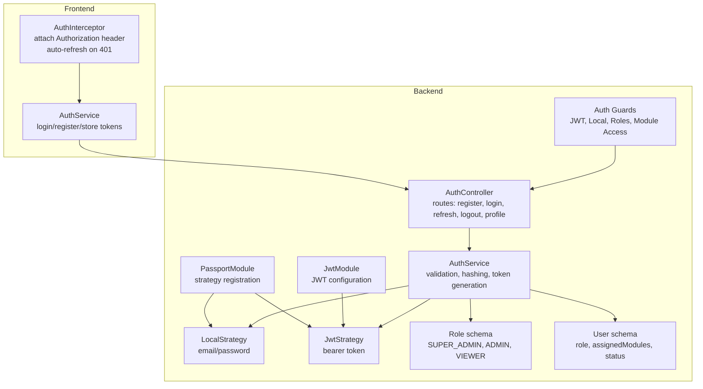
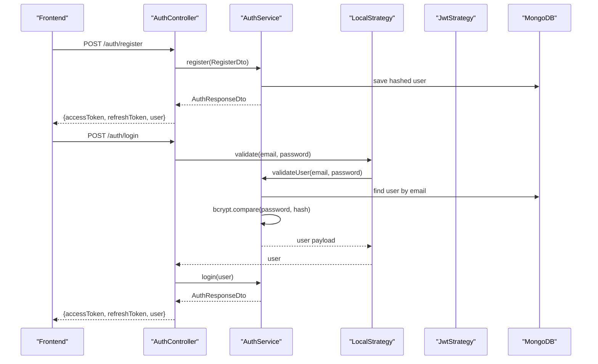
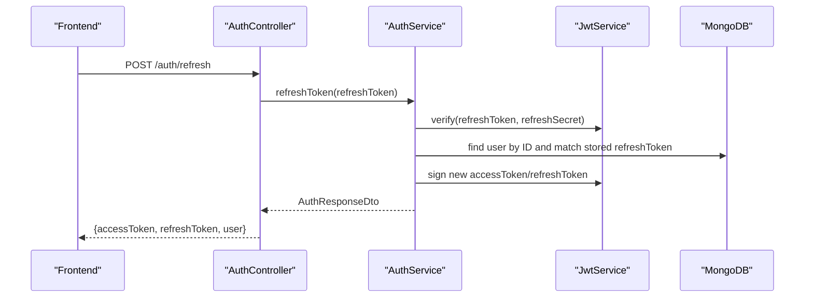
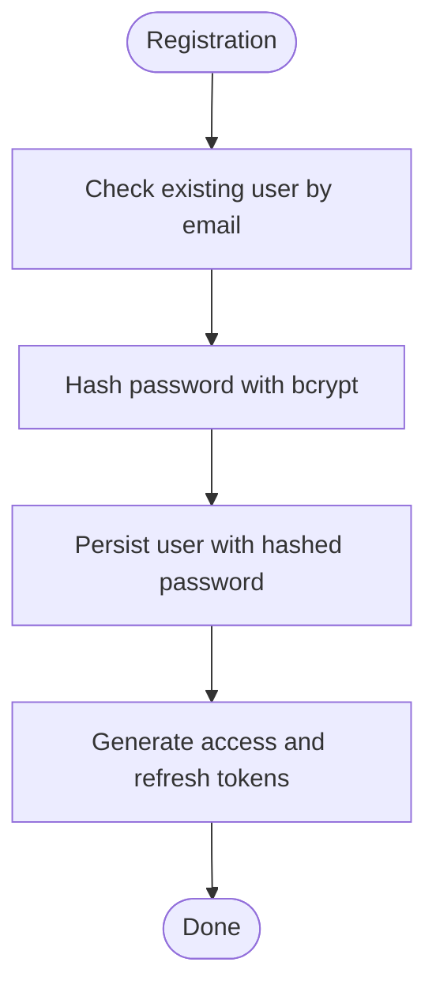
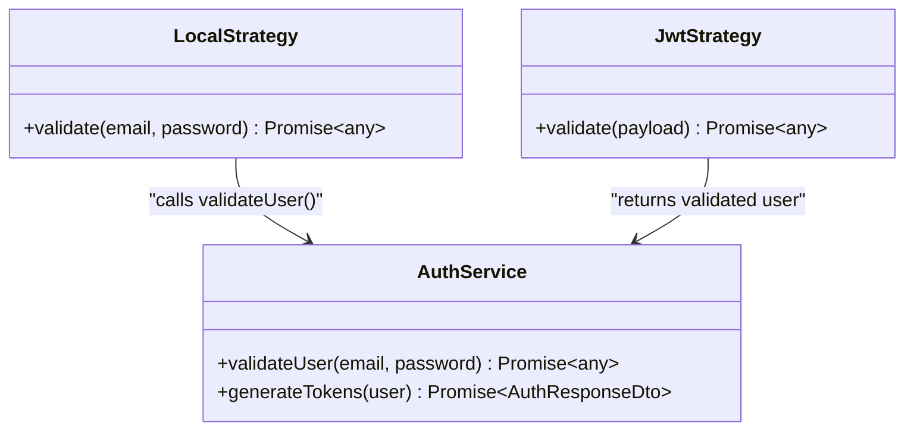
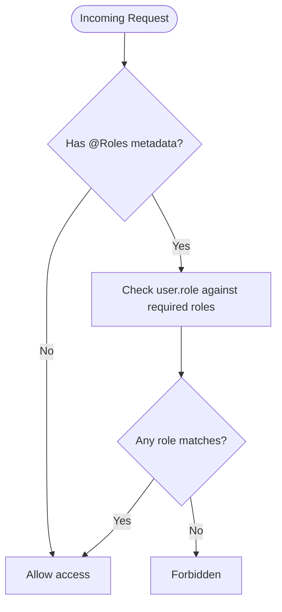
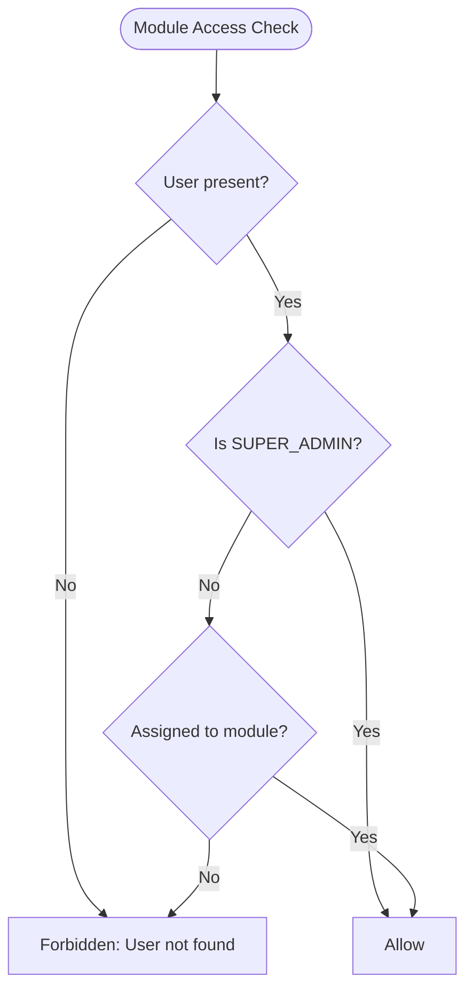
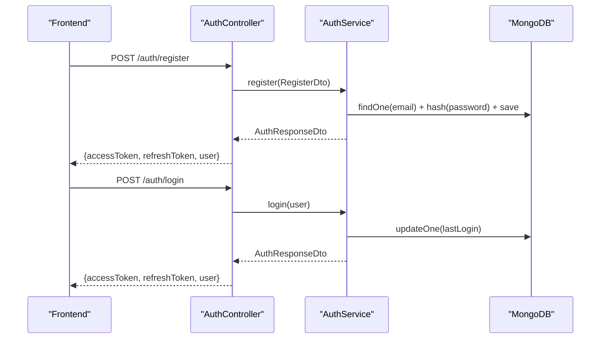
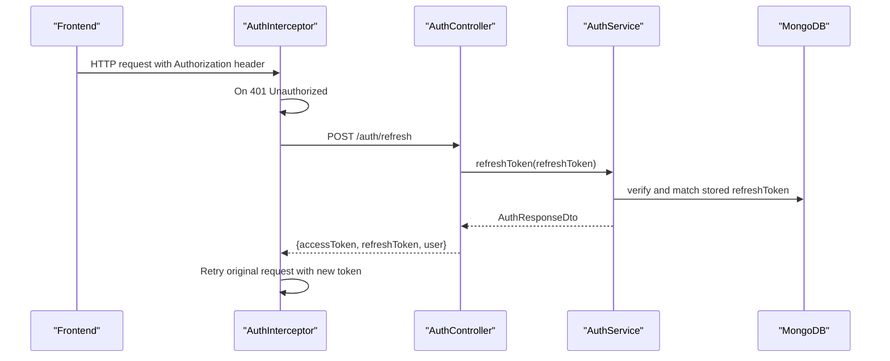
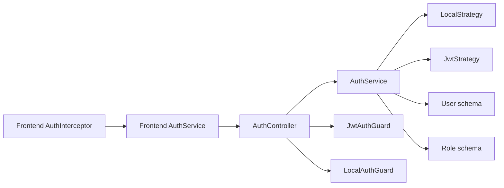

# Authentication & Authorization

<cite>
**Referenced Files in This Document**
- [backend/src/auth/auth.controller.ts](file://backend/src/auth/auth.controller.ts)
- [backend/src/auth/auth.service.ts](file://backend/src/auth/auth.service.ts)
- [backend/src/auth/strategies/jwt.strategy.ts](file://backend/src/auth/strategies/jwt.strategy.ts)
- [backend/src/auth/strategies/local.strategy.ts](file://backend/src/auth/strategies/local.strategy.ts)
- [backend/src/auth/guards/auth.guard.ts](file://backend/src/auth/guards/auth.guard.ts)
- [backend/src/auth/guards/jwt-auth.guard.ts](file://backend/src/auth/guards/jwt-auth.guard.ts)
- [backend/src/auth/guards/local-auth.guard.ts](file://backend/src/auth/guards/local-auth.guard.ts)
- [backend/src/auth/guards/roles.guard.ts](file://backend/src/auth/guards/roles.guard.ts)
- [backend/src/auth/guards/module-access.guard.ts](file://backend/src/auth/guards/module-access.guard.ts)
- [backend/src/auth/decorators/roles.decorator.ts](file://backend/src/auth/decorators/roles.decorator.ts)
- [backend/src/auth/decorators/current-user.decorator.ts](file://backend/src/auth/decorators/current-user.decorator.ts)
- [backend/src/auth/dto/auth.dto.ts](file://backend/src/auth/dto/auth.dto.ts)
- [backend/src/auth/auth.module.ts](file://backend/src/auth/auth.module.ts)
- [backend/src/users/schemas/user.schema.ts](file://backend/src/users/schemas/user.schema.ts)
- [backend/src/roles/schemas/role.schema.ts](file://backend/src/roles/schemas/role.schema.ts)
- [backend/.env.example](file://backend/.env.example)
- [frontend/src/app/core/services/auth.service.ts](file://frontend/src/app/core/services/auth.service.ts)
- [frontend/src/app/core/interceptors/auth.interceptor.ts](file://frontend/src/app/core/interceptors/auth.interceptor.ts)
</cite>

## Table of Contents
1. [Introduction](#introduction)
2. [Project Structure](#project-structure)
3. [Core Components](#core-components)
4. [Architecture Overview](#architecture-overview)
5. [Detailed Component Analysis](#detailed-component-analysis)
6. [Dependency Analysis](#dependency-analysis)
7. [Performance Considerations](#performance-considerations)
8. [Troubleshooting Guide](#troubleshooting-guide)
9. [Conclusion](#conclusion)
10. [Appendices](#appendices)

## Introduction
This document explains the authentication and authorization system of the Multi-Application-Control-Dashboard. It covers JWT-based authentication, password hashing with bcrypt, Passport strategies (JWT and Local), role-based access control (RBAC), and module-level access controls. It also documents user registration and login flows, session management, token refresh mechanisms, and security best practices. Practical examples demonstrate guard implementation, decorator usage, and protected route configuration.

## Project Structure
The authentication subsystem is implemented in the backend under the auth module and integrates with user and role schemas. The frontend provides client-side services and an HTTP interceptor to manage tokens and attach Authorization headers.

**Diagram sources**
- [backend/src/auth/auth.controller.ts](file://backend/src/auth/auth.controller.ts#L1-L58)
- [backend/src/auth/auth.service.ts](file://backend/src/auth/auth.service.ts#L1-L125)
- [backend/src/auth/strategies/local.strategy.ts](file://backend/src/auth/strategies/local.strategy.ts#L1-L16)
- [backend/src/auth/strategies/jwt.strategy.ts](file://backend/src/auth/strategies/jwt.strategy.ts#L1-L25)
- [backend/src/auth/auth.module.ts](file://backend/src/auth/auth.module.ts#L1-L30)
- [backend/src/users/schemas/user.schema.ts](file://backend/src/users/schemas/user.schema.ts#L1-L66)
- [backend/src/roles/schemas/role.schema.ts](file://backend/src/roles/schemas/role.schema.ts#L1-L25)
- [frontend/src/app/core/services/auth.service.ts](file://frontend/src/app/core/services/auth.service.ts#L1-L161)
- [frontend/src/app/core/interceptors/auth.interceptor.ts](file://frontend/src/app/core/interceptors/auth.interceptor.ts#L1-L46)

**Section sources**
- [backend/src/auth/auth.controller.ts](file://backend/src/auth/auth.controller.ts#L1-L58)
- [backend/src/auth/auth.module.ts](file://backend/src/auth/auth.module.ts#L1-L30)
- [backend/src/auth/auth.service.ts](file://backend/src/auth/auth.service.ts#L1-L125)
- [backend/src/users/schemas/user.schema.ts](file://backend/src/users/schemas/user.schema.ts#L1-L66)
- [backend/src/roles/schemas/role.schema.ts](file://backend/src/roles/schemas/role.schema.ts#L1-L25)
- [frontend/src/app/core/services/auth.service.ts](file://frontend/src/app/core/services/auth.service.ts#L1-L161)
- [frontend/src/app/core/interceptors/auth.interceptor.ts](file://frontend/src/app/core/interceptors/auth.interceptor.ts#L1-L46)

## Core Components
- AuthController: Exposes endpoints for registration, login, profile retrieval, token refresh, and logout.
- AuthService: Implements user validation, password hashing, JWT and refresh token generation, and user lookup.
- Passport Strategies: LocalStrategy for email/password validation and JwtStrategy for bearer token validation.
- Guards: JwtAuthGuard, LocalAuthGuard, RolesGuard, ModuleAccessGuard for protecting routes and enforcing access policies.
- Decorators: Roles decorator and CurrentUser decorator for metadata-driven role checks and parameter injection.
- DTOs: Strongly typed request/response shapes for registration, login, refresh, and response payloads.
- Schemas: User and Role models define roles and module assignments; User includes status and isActive virtual.
- Frontend Services: Client-side AuthService manages tokens and user state; AuthInterceptor attaches headers and auto-refreshes tokens.

**Section sources**
- [backend/src/auth/auth.controller.ts](file://backend/src/auth/auth.controller.ts#L1-L58)
- [backend/src/auth/auth.service.ts](file://backend/src/auth/auth.service.ts#L1-L125)
- [backend/src/auth/strategies/local.strategy.ts](file://backend/src/auth/strategies/local.strategy.ts#L1-L16)
- [backend/src/auth/strategies/jwt.strategy.ts](file://backend/src/auth/strategies/jwt.strategy.ts#L1-L25)
- [backend/src/auth/guards/auth.guard.ts](file://backend/src/auth/guards/auth.guard.ts#L1-L26)
- [backend/src/auth/guards/roles.guard.ts](file://backend/src/auth/guards/roles.guard.ts#L1-L23)
- [backend/src/auth/guards/module-access.guard.ts](file://backend/src/auth/guards/module-access.guard.ts#L1-L28)
- [backend/src/auth/decorators/roles.decorator.ts](file://backend/src/auth/decorators/roles.decorator.ts#L1-L5)
- [backend/src/auth/decorators/current-user.decorator.ts](file://backend/src/auth/decorators/current-user.decorator.ts#L1-L9)
- [backend/src/auth/dto/auth.dto.ts](file://backend/src/auth/dto/auth.dto.ts#L1-L58)
- [backend/src/users/schemas/user.schema.ts](file://backend/src/users/schemas/user.schema.ts#L1-L66)
- [backend/src/roles/schemas/role.schema.ts](file://backend/src/roles/schemas/role.schema.ts#L1-L25)
- [frontend/src/app/core/services/auth.service.ts](file://frontend/src/app/core/services/auth.service.ts#L1-L161)
- [frontend/src/app/core/interceptors/auth.interceptor.ts](file://frontend/src/app/core/interceptors/auth.interceptor.ts#L1-L46)

## Architecture Overview
The system uses a layered approach:
- Transport layer: HTTP endpoints in AuthController.
- Domain service: AuthService orchestrates validation, hashing, and token lifecycle.
- Identity layer: Passport strategies integrate with NestJS guards.
- Authorization layer: Guards enforce JWT presence, roles, and module access.
- Persistence layer: Mongoose models for User and Role.
- Presentation layer: Frontend services and interceptor manage tokens and requests.

**Diagram sources**
- [backend/src/auth/auth.controller.ts](file://backend/src/auth/auth.controller.ts#L1-L58)
- [backend/src/auth/auth.service.ts](file://backend/src/auth/auth.service.ts#L1-L125)
- [backend/src/auth/strategies/local.strategy.ts](file://backend/src/auth/strategies/local.strategy.ts#L1-L16)
- [backend/src/users/schemas/user.schema.ts](file://backend/src/users/schemas/user.schema.ts#L1-L66)

## Detailed Component Analysis

### JWT-Based Authentication
- Token issuance: AuthService generates access and refresh tokens with distinct expiration windows and secrets.
- Access token payload includes user identity, role, and assigned modules.
- Refresh token verification uses a dedicated secret and persisted value for revocation and replay protection.
- Logout clears the stored refresh token.

**Diagram sources**
- [backend/src/auth/auth.controller.ts](file://backend/src/auth/auth.controller.ts#L38-L42)
- [backend/src/auth/auth.service.ts](file://backend/src/auth/auth.service.ts#L96-L111)

**Section sources**
- [backend/src/auth/auth.service.ts](file://backend/src/auth/auth.service.ts#L56-L94)
- [backend/src/auth/auth.service.ts](file://backend/src/auth/auth.service.ts#L96-L111)
- [backend/.env.example](file://backend/.env.example#L11-L13)

### Password Hashing with bcrypt
- Registration hashes passwords using bcrypt before persisting user records.
- Login validation compares provided password against stored hash.

**Diagram sources**
- [backend/src/auth/auth.service.ts](file://backend/src/auth/auth.service.ts#L32-L49)
- [backend/src/auth/auth.service.ts](file://backend/src/auth/auth.service.ts#L17-L30)

**Section sources**
- [backend/src/auth/auth.service.ts](file://backend/src/auth/auth.service.ts#L17-L30)
- [backend/src/auth/auth.service.ts](file://backend/src/auth/auth.service.ts#L32-L49)

### Passport Strategies (JWT and Local)
- LocalStrategy: Uses email/password to validate via AuthService.
- JwtStrategy: Extracts bearer token and verifies signature using configured secret.

**Diagram sources**
- [backend/src/auth/strategies/local.strategy.ts](file://backend/src/auth/strategies/local.strategy.ts#L1-L16)
- [backend/src/auth/strategies/jwt.strategy.ts](file://backend/src/auth/strategies/jwt.strategy.ts#L1-L25)
- [backend/src/auth/auth.service.ts](file://backend/src/auth/auth.service.ts#L17-L94)

**Section sources**
- [backend/src/auth/strategies/local.strategy.ts](file://backend/src/auth/strategies/local.strategy.ts#L1-L16)
- [backend/src/auth/strategies/jwt.strategy.ts](file://backend/src/auth/strategies/jwt.strategy.ts#L1-L25)

### Role-Based Access Control (RBAC)
- Roles: SUPER_ADMIN, ADMIN, VIEWER.
- RolesGuard: Enforces role metadata declared via @Roles decorator.
- User model: role field and assignedModules array enable module-level access.

**Diagram sources**
- [backend/src/auth/guards/roles.guard.ts](file://backend/src/auth/guards/roles.guard.ts#L1-L23)
- [backend/src/auth/decorators/roles.decorator.ts](file://backend/src/auth/decorators/roles.decorator.ts#L1-L5)
- [backend/src/roles/schemas/role.schema.ts](file://backend/src/roles/schemas/role.schema.ts#L4-L8)

**Section sources**
- [backend/src/auth/guards/roles.guard.ts](file://backend/src/auth/guards/roles.guard.ts#L1-L23)
- [backend/src/auth/decorators/roles.decorator.ts](file://backend/src/auth/decorators/roles.decorator.ts#L1-L5)
- [backend/src/roles/schemas/role.schema.ts](file://backend/src/roles/schemas/role.schema.ts#L4-L8)

### Module-Level Access Controls
- ModuleAccessGuard enforces that users can only access modules assigned to them.
- Super Admin bypasses assignment checks.

**Diagram sources**
- [backend/src/auth/guards/module-access.guard.ts](file://backend/src/auth/guards/module-access.guard.ts#L1-L28)
- [backend/src/users/schemas/user.schema.ts](file://backend/src/users/schemas/user.schema.ts#L33-L34)
- [backend/src/roles/schemas/role.schema.ts](file://backend/src/roles/schemas/role.schema.ts#L5-L6)

**Section sources**
- [backend/src/auth/guards/module-access.guard.ts](file://backend/src/auth/guards/module-access.guard.ts#L1-L28)
- [backend/src/users/schemas/user.schema.ts](file://backend/src/users/schemas/user.schema.ts#L33-L34)

### User Registration and Login Flows
- Registration: Validates DTO, checks uniqueness, hashes password, assigns default role if omitted, persists user, and issues tokens.
- Login: Locates user by email, validates password, updates lastLogin, and issues tokens.

**Diagram sources**
- [backend/src/auth/auth.controller.ts](file://backend/src/auth/auth.controller.ts#L19-L30)
- [backend/src/auth/auth.service.ts](file://backend/src/auth/auth.service.ts#L32-L54)

**Section sources**
- [backend/src/auth/auth.controller.ts](file://backend/src/auth/auth.controller.ts#L19-L30)
- [backend/src/auth/auth.service.ts](file://backend/src/auth/auth.service.ts#L32-L54)

### Session Management and Token Refresh
- Frontend stores accessToken, optional refreshToken, and user profile in localStorage.
- AuthInterceptor attaches Authorization header and attempts automatic refresh on 401.
- Backend refresh endpoint verifies refresh token against stored value and reissues tokens.

**Diagram sources**
- [frontend/src/app/core/interceptors/auth.interceptor.ts](file://frontend/src/app/core/interceptors/auth.interceptor.ts#L1-L46)
- [frontend/src/app/core/services/auth.service.ts](file://frontend/src/app/core/services/auth.service.ts#L137-L152)
- [backend/src/auth/auth.controller.ts](file://backend/src/auth/auth.controller.ts#L38-L42)
- [backend/src/auth/auth.service.ts](file://backend/src/auth/auth.service.ts#L96-L111)

**Section sources**
- [frontend/src/app/core/interceptors/auth.interceptor.ts](file://frontend/src/app/core/interceptors/auth.interceptor.ts#L1-L46)
- [frontend/src/app/core/services/auth.service.ts](file://frontend/src/app/core/services/auth.service.ts#L103-L152)
- [backend/src/auth/auth.controller.ts](file://backend/src/auth/auth.controller.ts#L38-L42)
- [backend/src/auth/auth.service.ts](file://backend/src/auth/auth.service.ts#L96-L111)

### Guard Implementation and Protected Routes
- JwtAuthGuard: Protects routes requiring a valid bearer token.
- LocalAuthGuard: Protects login route using local strategy.
- RolesGuard: Enforces role-based restrictions using @Roles decorator.
- ModuleAccessGuard: Enforces module-specific access based on user assignments.

Practical usage examples:
- Route-level guards: Apply @UseGuards(JwtAuthGuard) on protected endpoints; apply @UseGuards(RolesGuard) with @Roles('ADMIN') to restrict access.
- Parameter injection: Use @CurrentUser() to inject the authenticated user into controller methods.
- Optional authentication: Use OptionalJwtAuthGuard to allow unauthenticated requests while still passing through authenticated users when present.

**Section sources**
- [backend/src/auth/guards/jwt-auth.guard.ts](file://backend/src/auth/guards/jwt-auth.guard.ts#L1-L10)
- [backend/src/auth/guards/local-auth.guard.ts](file://backend/src/auth/guards/local-auth.guard.ts#L1-L6)
- [backend/src/auth/guards/roles.guard.ts](file://backend/src/auth/guards/roles.guard.ts#L1-L23)
- [backend/src/auth/decorators/roles.decorator.ts](file://backend/src/auth/decorators/roles.decorator.ts#L1-L5)
- [backend/src/auth/decorators/current-user.decorator.ts](file://backend/src/auth/decorators/current-user.decorator.ts#L1-L9)

## Dependency Analysis
- AuthController depends on AuthService and guards for endpoint protection.
- AuthService depends on JwtService, Mongoose models, and bcrypt for hashing.
- Guards depend on Passport strategies and Reflector for metadata.
- Frontend services depend on environment configuration and HTTP client.

**Diagram sources**
- [backend/src/auth/auth.controller.ts](file://backend/src/auth/auth.controller.ts#L1-L58)
- [backend/src/auth/auth.service.ts](file://backend/src/auth/auth.service.ts#L1-L125)
- [backend/src/auth/strategies/local.strategy.ts](file://backend/src/auth/strategies/local.strategy.ts#L1-L16)
- [backend/src/auth/strategies/jwt.strategy.ts](file://backend/src/auth/strategies/jwt.strategy.ts#L1-L25)
- [backend/src/users/schemas/user.schema.ts](file://backend/src/users/schemas/user.schema.ts#L1-L66)
- [backend/src/roles/schemas/role.schema.ts](file://backend/src/roles/schemas/role.schema.ts#L1-L25)
- [frontend/src/app/core/services/auth.service.ts](file://frontend/src/app/core/services/auth.service.ts#L1-L161)
- [frontend/src/app/core/interceptors/auth.interceptor.ts](file://frontend/src/app/core/interceptors/auth.interceptor.ts#L1-L46)

**Section sources**
- [backend/src/auth/auth.controller.ts](file://backend/src/auth/auth.controller.ts#L1-L58)
- [backend/src/auth/auth.service.ts](file://backend/src/auth/auth.service.ts#L1-L125)
- [frontend/src/app/core/services/auth.service.ts](file://frontend/src/app/core/services/auth.service.ts#L1-L161)
- [frontend/src/app/core/interceptors/auth.interceptor.ts](file://frontend/src/app/core/interceptors/auth.interceptor.ts#L1-L46)

## Performance Considerations
- Token lifetimes: Access tokens short-lived reduce exposure; refresh tokens with longer expiry enable secure renewal.
- Hashing cost: bcrypt cost factor is balanced for security; avoid excessively high costs that impact registration/login latency.
- Database queries: Index email for fast user lookup; consider caching frequently accessed user roles and module assignments.
- Guard overhead: Keep guard logic minimal; rely on Passport strategies and Mongoose indexing.

## Troubleshooting Guide
Common issues and resolutions:
- Invalid credentials during login: Ensure email exists and password matches the stored hash.
- Invalid or expired refresh token: Verify the token signature and compare against stored refresh token; clear stored token on logout.
- Access denied errors: Confirm user role and assigned modules; Super Admin bypasses module assignment checks.
- 401 Unauthorized responses: Use the interceptor’s automatic refresh flow or manually refresh tokens via the refresh endpoint.

**Section sources**
- [backend/src/auth/auth.service.ts](file://backend/src/auth/auth.service.ts#L17-L30)
- [backend/src/auth/auth.service.ts](file://backend/src/auth/auth.service.ts#L96-L111)
- [backend/src/auth/guards/module-access.guard.ts](file://backend/src/auth/guards/module-access.guard.ts#L15-L23)
- [frontend/src/app/core/interceptors/auth.interceptor.ts](file://frontend/src/app/core/interceptors/auth.interceptor.ts#L23-L43)

## Conclusion
The authentication and authorization system combines robust JWT-based identity with bcrypt password hashing, Passport strategies, and layered access control. The RBAC model supports a three-tier hierarchy, while module-level access ensures users operate within their assigned scope. The frontend provides seamless token management and automatic refresh, improving UX and security.

## Appendices

### Security Best Practices
- Rotate secrets regularly and store JWT secrets and refresh secrets separately.
- Enforce HTTPS in production to protect tokens in transit.
- Limit sensitive fields in user payloads; avoid exposing hashed passwords.
- Implement rate limiting for login endpoints to mitigate brute force attacks.
- Use short-lived access tokens and long-lived refresh tokens with secure storage.

### Environment Variables
- JWT_SECRET: Secret for signing access tokens.
- JWT_REFRESH_SECRET: Secret for signing refresh tokens.
- JWT_EXPIRATION: Access token expiration (e.g., 24h).

**Section sources**
- [backend/.env.example](file://backend/.env.example#L11-L13)