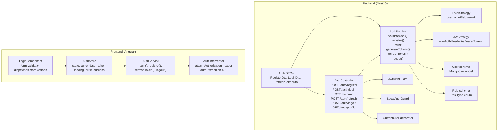
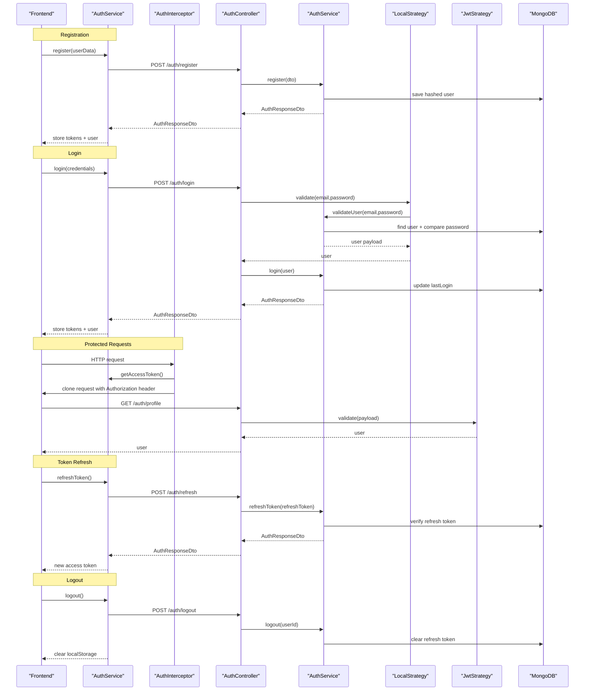
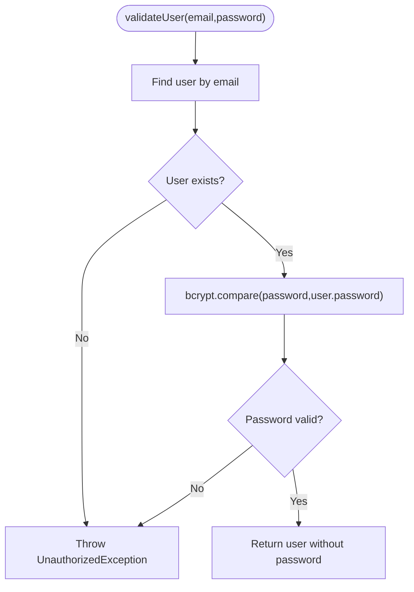
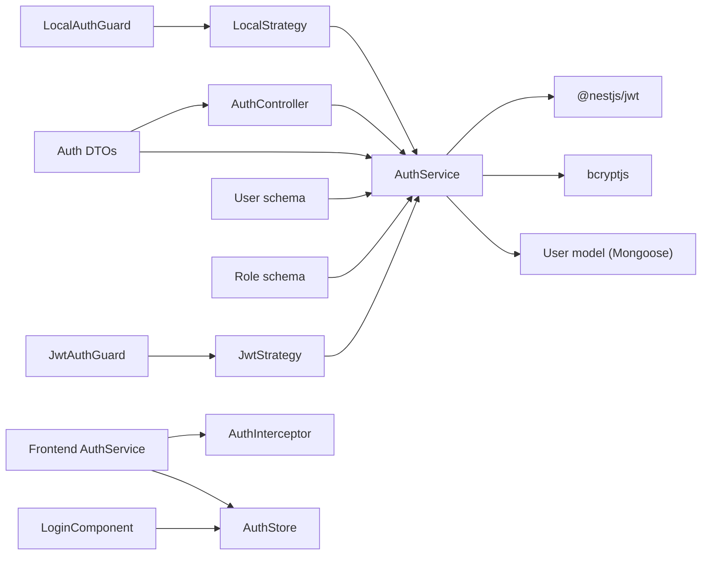

# Authentication Flow

<cite>
**Referenced Files in This Document**
- [auth.controller.ts](file://backend/src/auth/auth.controller.ts)
- [auth.service.ts](file://backend/src/auth/auth.service.ts)
- [local.strategy.ts](file://backend/src/auth/strategies/local.strategy.ts)
- [jwt.strategy.ts](file://backend/src/auth/strategies/jwt.strategy.ts)
- [auth.guard.ts](file://backend/src/auth/guards/auth.guard.ts)
- [jwt-auth.guard.ts](file://backend/src/auth/guards/jwt-auth.guard.ts)
- [local-auth.guard.ts](file://backend/src/auth/guards/local-auth.guard.ts)
- [current-user.decorator.ts](file://backend/src/auth/decorators/current-user.decorator.ts)
- [auth.dto.ts](file://backend/src/auth/dto/auth.dto.ts)
- [user.schema.ts](file://backend/src/users/schemas/user.schema.ts)
- [role.schema.ts](file://backend/src/roles/schemas/role.schema.ts)
- [auth.service.ts](file://frontend/src/app/core/services/auth.service.ts)
- [auth.interceptor.ts](file://frontend/src/app/core/interceptors/auth.interceptor.ts)
- [auth.store.ts](file://frontend/src/app/core/store/auth.store.ts)
- [login.component.ts](file://frontend/src/app/features/auth/login/login.component.ts)
</cite>

## Table of Contents
1. [Introduction](#introduction)
2. [Project Structure](#project-structure)
3. [Core Components](#core-components)
4. [Architecture Overview](#architecture-overview)
5. [Detailed Component Analysis](#detailed-component-analysis)
6. [Dependency Analysis](#dependency-analysis)
7. [Performance Considerations](#performance-considerations)
8. [Security Considerations](#security-considerations)
9. [Troubleshooting Guide](#troubleshooting-guide)
10. [Conclusion](#conclusion)

## Introduction
This document explains the authentication flow for the Multi-Application Control Dashboard, covering user registration and login, form validation, API endpoints, response handling, local authentication strategy, password hashing with bcrypt, JWT token generation and refresh, session management, and token storage. It also includes practical usage examples, component integration, error handling patterns, and security considerations such as input sanitization and rate limiting.

## Project Structure
The authentication system spans the backend NestJS application and the frontend Angular application:
- Backend: Controllers, Services, Strategies, Guards, DTOs, and Mongoose models define the server-side authentication logic.
- Frontend: An Angular service manages HTTP communication, token storage, and user state; an interceptor attaches tokens and handles token refresh on 401 errors; a store encapsulates authentication state and actions.

**Diagram sources**
- [auth.controller.ts](file://backend/src/auth/auth.controller.ts#L15-L57)
- [auth.service.ts](file://backend/src/auth/auth.service.ts#L11-L124)
- [local.strategy.ts](file://backend/src/auth/strategies/local.strategy.ts#L7-L15)
- [jwt.strategy.ts](file://backend/src/auth/strategies/jwt.strategy.ts#L7-L24)
- [auth.guard.ts](file://backend/src/auth/guards/auth.guard.ts#L7-L25)
- [jwt-auth.guard.ts](file://backend/src/auth/guards/jwt-auth.guard.ts#L5-L9)
- [local-auth.guard.ts](file://backend/src/auth/guards/local-auth.guard.ts#L5-L5)
- [current-user.decorator.ts](file://backend/src/auth/decorators/current-user.decorator.ts#L3-L8)
- [auth.dto.ts](file://backend/src/auth/dto/auth.dto.ts#L4-L57)
- [user.schema.ts](file://backend/src/users/schemas/user.schema.ts#L14-L66)
- [role.schema.ts](file://backend/src/roles/schemas/role.schema.ts#L4-L8)
- [auth.service.ts](file://frontend/src/app/core/services/auth.service.ts#L31-L160)
- [auth.interceptor.ts](file://frontend/src/app/core/interceptors/auth.interceptor.ts#L8-L45)
- [auth.store.ts](file://frontend/src/app/core/store/auth.store.ts#L35-L222)
- [login.component.ts](file://frontend/src/app/features/auth/login/login.component.ts#L14-L95)

**Section sources**
- [auth.controller.ts](file://backend/src/auth/auth.controller.ts#L15-L57)
- [auth.service.ts](file://backend/src/auth/auth.service.ts#L11-L124)
- [local.strategy.ts](file://backend/src/auth/strategies/local.strategy.ts#L7-L15)
- [jwt.strategy.ts](file://backend/src/auth/strategies/jwt.strategy.ts#L7-L24)
- [auth.guard.ts](file://backend/src/auth/guards/auth.guard.ts#L7-L25)
- [jwt-auth.guard.ts](file://backend/src/auth/guards/jwt-auth.guard.ts#L5-L9)
- [local-auth.guard.ts](file://backend/src/auth/guards/local-auth.guard.ts#L5-L5)
- [current-user.decorator.ts](file://backend/src/auth/decorators/current-user.decorator.ts#L3-L8)
- [auth.dto.ts](file://backend/src/auth/dto/auth.dto.ts#L4-L57)
- [user.schema.ts](file://backend/src/users/schemas/user.schema.ts#L14-L66)
- [role.schema.ts](file://backend/src/roles/schemas/role.schema.ts#L4-L8)
- [auth.service.ts](file://frontend/src/app/core/services/auth.service.ts#L31-L160)
- [auth.interceptor.ts](file://frontend/src/app/core/interceptors/auth.interceptor.ts#L8-L45)
- [auth.store.ts](file://frontend/src/app/core/store/auth.store.ts#L35-L222)
- [login.component.ts](file://frontend/src/app/features/auth/login/login.component.ts#L14-L95)

## Core Components
- Backend
  - AuthController: Exposes endpoints for registration, login, profile retrieval, token refresh, and logout.
  - AuthService: Implements user validation, registration with bcrypt hashing, JWT issuance, refresh token lifecycle, and logout.
  - Strategies: LocalStrategy validates email/password; JwtStrategy extracts and verifies JWTs.
  - Guards: JwtAuthGuard and LocalAuthGuard enforce protected routes and local authentication respectively.
  - DTOs: Strongly typed request/response models with class-validator rules.
  - User Schema: Mongoose model with virtual isActive derived from status and token persistence fields.
- Frontend
  - AuthService: HTTP client wrapper managing tokens and user state in localStorage.
  - AuthInterceptor: Attaches Authorization header and auto-refreshes token on 401.
  - AuthStore: NGRX Signals-based store managing authentication state and actions.
  - LoginComponent: Form validation and dispatching store actions.

**Section sources**
- [auth.controller.ts](file://backend/src/auth/auth.controller.ts#L15-L57)
- [auth.service.ts](file://backend/src/auth/auth.service.ts#L11-L124)
- [local.strategy.ts](file://backend/src/auth/strategies/local.strategy.ts#L7-L15)
- [jwt.strategy.ts](file://backend/src/auth/strategies/jwt.strategy.ts#L7-L24)
- [auth.guard.ts](file://backend/src/auth/guards/auth.guard.ts#L7-L25)
- [auth.dto.ts](file://backend/src/auth/dto/auth.dto.ts#L4-L57)
- [user.schema.ts](file://backend/src/users/schemas/user.schema.ts#L14-L66)
- [auth.service.ts](file://frontend/src/app/core/services/auth.service.ts#L31-L160)
- [auth.interceptor.ts](file://frontend/src/app/core/interceptors/auth.interceptor.ts#L8-L45)
- [auth.store.ts](file://frontend/src/app/core/store/auth.store.ts#L35-L222)
- [login.component.ts](file://frontend/src/app/features/auth/login/login.component.ts#L14-L95)

## Architecture Overview
The authentication flow integrates frontend and backend components:
- Registration: Frontend posts to /auth/register; backend validates DTO, checks uniqueness, hashes password, persists user, and issues access/refresh tokens.
- Login: Frontend posts to /auth/login; local strategy triggers AuthService.validateUser; backend updates lastLogin and issues tokens.
- Protected Routes: JwtAuthGuard enforces JWT verification via JwtStrategy; CurrentUser decorator exposes user payload.
- Token Refresh: Frontend sends refresh token to /auth/refresh; backend verifies refresh token and reissues JWTs.
- Logout: Frontend clears localStorage; backend invalidates refresh token in DB.
- Session Management: Tokens stored in localStorage; AuthInterceptor adds Authorization header; AuthStore centralizes state.

**Diagram sources**
- [auth.controller.ts](file://backend/src/auth/auth.controller.ts#L19-L56)
- [auth.service.ts](file://backend/src/auth/auth.service.ts#L17-L123)
- [local.strategy.ts](file://backend/src/auth/strategies/local.strategy.ts#L12-L14)
- [jwt.strategy.ts](file://backend/src/auth/strategies/jwt.strategy.ts#L16-L23)
- [auth.service.ts](file://frontend/src/app/core/services/auth.service.ts#L60-L159)
- [auth.interceptor.ts](file://frontend/src/app/core/interceptors/auth.interceptor.ts#L11-L44)

## Detailed Component Analysis

### Backend: AuthController
- Endpoints:
  - POST /auth/register: Creates a new user after DTO validation.
  - POST /auth/login: Protected by LocalAuthGuard; returns tokens and user.
  - GET /auth/me: Protected by JwtAuthGuard; fetches user details by ID.
  - POST /auth/refresh: Validates refresh token and issues new tokens.
  - POST /auth/logout: Protected by JwtAuthGuard; clears refresh token.
  - GET /auth/profile: Returns current user payload from request.
- Response handling: Uses HTTP status codes and returns structured DTOs.

**Section sources**
- [auth.controller.ts](file://backend/src/auth/auth.controller.ts#L19-L56)

### Backend: AuthService
- Validation: Finds user by email and compares bcrypt-hashed passwords.
- Registration: Checks uniqueness, hashes password with bcrypt, assigns default role if missing, saves user, and generates tokens.
- Login: Updates lastLogin and issues tokens.
- Token Generation: Builds JWT payload with sub, email, role, and assignedModules; signs access token (short-lived) and refresh token (longer-lived) with separate secrets.
- Refresh: Verifies refresh token against stored value; reissues tokens on success.
- Logout: Clears refresh token from DB.
- User Details: Fetches user excluding password.

**Diagram sources**
- [auth.service.ts](file://backend/src/auth/auth.service.ts#L17-L30)

**Section sources**
- [auth.service.ts](file://backend/src/auth/auth.service.ts#L17-L123)

### Backend: Strategies and Guards
- LocalStrategy: Uses passport-local with email as username field; delegates to AuthService.validateUser.
- JwtStrategy: Extracts JWT from Authorization header and verifies with configured secret; returns user payload subset.
- Guards: JwtAuthGuard and LocalAuthGuard wrap passport strategies; OptionalJwtAuthGuard allows bypass and returns user or null.

**Section sources**
- [local.strategy.ts](file://backend/src/auth/strategies/local.strategy.ts#L12-L14)
- [jwt.strategy.ts](file://backend/src/auth/strategies/jwt.strategy.ts#L16-L23)
- [auth.guard.ts](file://backend/src/auth/guards/auth.guard.ts#L7-L25)
- [jwt-auth.guard.ts](file://backend/src/auth/guards/jwt-auth.guard.ts#L5-L9)
- [local-auth.guard.ts](file://backend/src/auth/guards/local-auth.guard.ts#L5-L5)

### Backend: DTOs and Schemas
- DTOs: RegisterDto, LoginDto, RefreshTokenDto enforce email, string, minimum length, and enum constraints.
- User Schema: Defines fields, enums, virtual isActive, and transforms for JSON/Object output.
- Role Schema: Enumerated role types.

**Section sources**
- [auth.dto.ts](file://backend/src/auth/dto/auth.dto.ts#L4-L57)
- [user.schema.ts](file://backend/src/users/schemas/user.schema.ts#L14-L66)
- [role.schema.ts](file://backend/src/roles/schemas/role.schema.ts#L4-L8)

### Frontend: AuthService
- Responsibilities: HTTP calls to backend, token and user persistence in localStorage, exposing current user and token, refresh flow, and logout.
- Token Storage: Stores accessToken, optional refreshToken, and currentUser.
- Public Methods: login, register, refreshToken, logout, getAccessToken, getProfile.

**Section sources**
- [auth.service.ts](file://frontend/src/app/core/services/auth.service.ts#L31-L160)

### Frontend: AuthInterceptor
- Attaches Authorization header with Bearer token if present.
- On 401 Unauthorized, attempts token refresh; on success retries original request; otherwise logs out.

**Section sources**
- [auth.interceptor.ts](file://frontend/src/app/core/interceptors/auth.interceptor.ts#L11-L44)

### Frontend: AuthStore
- Manages authentication state: currentUser, isAuthenticated, loading, error, success, token, refreshToken, isRefreshing, lastTokenRefresh.
- Actions: initializeAuth, login, register, refreshAccessToken, loadProfile, logout, helpers for roles and module access.
- Integrates with AuthService and Router.

**Section sources**
- [auth.store.ts](file://frontend/src/app/core/store/auth.store.ts#L35-L222)

### Frontend: LoginComponent
- Reactive form with email and password validators.
- Submits to AuthStore instead of calling AuthService directly.
- Provides demo credential filling for quick testing.

**Section sources**
- [login.component.ts](file://frontend/src/app/features/auth/login/login.component.ts#L30-L94)

## Dependency Analysis
- Backend
  - AuthController depends on AuthService and guards.
  - AuthService depends on JwtService, Mongoose model, and bcrypt.
  - Strategies depend on AuthService and passport.
  - DTOs and schemas define data contracts.
- Frontend
  - AuthStore orchestrates AuthService and Router.
  - AuthInterceptor depends on AuthService for token access and refresh.
  - LoginComponent depends on AuthStore.

**Diagram sources**
- [auth.controller.ts](file://backend/src/auth/auth.controller.ts#L11-L13)
- [auth.service.ts](file://backend/src/auth/auth.service.ts#L2-L8)
- [local.strategy.ts](file://backend/src/auth/strategies/local.strategy.ts#L8-L14)
- [jwt.strategy.ts](file://backend/src/auth/strategies/jwt.strategy.ts#L8-L14)
- [auth.guard.ts](file://backend/src/auth/guards/auth.guard.ts#L7-L18)
- [auth.dto.ts](file://backend/src/auth/dto/auth.dto.ts#L4-L57)
- [user.schema.ts](file://backend/src/users/schemas/user.schema.ts#L14-L66)
- [role.schema.ts](file://backend/src/roles/schemas/role.schema.ts#L4-L8)
- [auth.service.ts](file://frontend/src/app/core/services/auth.service.ts#L31-L160)
- [auth.interceptor.ts](file://frontend/src/app/core/interceptors/auth.interceptor.ts#L8-L45)
- [auth.store.ts](file://frontend/src/app/core/store/auth.store.ts#L35-L222)
- [login.component.ts](file://frontend/src/app/features/auth/login/login.component.ts#L14-L95)

**Section sources**
- [auth.controller.ts](file://backend/src/auth/auth.controller.ts#L11-L13)
- [auth.service.ts](file://backend/src/auth/auth.service.ts#L2-L8)
- [local.strategy.ts](file://backend/src/auth/strategies/local.strategy.ts#L8-L14)
- [jwt.strategy.ts](file://backend/src/auth/strategies/jwt.strategy.ts#L8-L14)
- [auth.guard.ts](file://backend/src/auth/guards/auth.guard.ts#L7-L18)
- [auth.dto.ts](file://backend/src/auth/dto/auth.dto.ts#L4-L57)
- [user.schema.ts](file://backend/src/users/schemas/user.schema.ts#L14-L66)
- [role.schema.ts](file://backend/src/roles/schemas/role.schema.ts#L4-L8)
- [auth.service.ts](file://frontend/src/app/core/services/auth.service.ts#L31-L160)
- [auth.interceptor.ts](file://frontend/src/app/core/interceptors/auth.interceptor.ts#L8-L45)
- [auth.store.ts](file://frontend/src/app/core/store/auth.store.ts#L35-L222)
- [login.component.ts](file://frontend/src/app/features/auth/login/login.component.ts#L14-L95)

## Performance Considerations
- Token Lifetimes: Access tokens are short-lived; refresh tokens are long-lived but validated against stored values to prevent reuse.
- Hashing Cost: bcrypt cost factor is set during registration; adjust based on hardware capacity.
- DB Queries: Single lookup per login and refresh; ensure indexes on email and refresh token fields.
- Interceptor Overhead: Minimal cloning and retry logic; avoid excessive concurrent refresh attempts.

[No sources needed since this section provides general guidance]

## Security Considerations
- Input Validation: DTOs enforce email format, minimum lengths, and enums; use class-validator pipes in controllers.
- Password Hashing: bcrypt is used for secure password hashing; never store plain-text passwords.
- Token Storage: Store tokens in secure, HTTP-only cookies or secure storage; consider SameSite and Secure flags for cookies.
- CSRF Protection: Implement anti-CSRF measures for cookie-based sessions.
- Rate Limiting: Apply rate limiting on /auth endpoints to mitigate brute-force attacks; consider IP-based or account-based limits.
- HTTPS: Enforce HTTPS to protect tokens in transit.
- Audit Logs: Log authentication events for monitoring and incident response.
- Least Privilege: Assign minimal required roles and module access.

[No sources needed since this section provides general guidance]

## Troubleshooting Guide
- Invalid Credentials
  - Symptom: 401 Unauthorized on login.
  - Cause: Wrong email or password.
  - Resolution: Verify credentials; check bcrypt comparison logic.
- User Already Exists
  - Symptom: 400 Bad Request on registration.
  - Cause: Duplicate email.
  - Resolution: Prompt user to use another email or login.
- Invalid or Expired Refresh Token
  - Symptom: 401 Unauthorized on refresh.
  - Cause: Stored token mismatch or expiration.
  - Resolution: Trigger logout and force re-login.
- 401 Without Auto-Refresh
  - Symptom: Persistent 401 errors.
  - Cause: Refresh failure or interceptor misconfiguration.
  - Resolution: Confirm AuthInterceptor logic and token presence; clear stale tokens.
- Frontend State Not Updating
  - Symptom: UI shows logged out despite tokens present.
  - Cause: AuthStore not initialized or localStorage corruption.
  - Resolution: Call initializeAuth; clear localStorage if corrupted.

**Section sources**
- [auth.service.ts](file://backend/src/auth/auth.service.ts#L19-L26)
- [auth.service.ts](file://backend/src/auth/auth.service.ts#L34-L36)
- [auth.service.ts](file://backend/src/auth/auth.service.ts#L103-L110)
- [auth.interceptor.ts](file://frontend/src/app/core/interceptors/auth.interceptor.ts#L23-L44)
- [auth.store.ts](file://frontend/src/app/core/store/auth.store.ts#L84-L103)

## Conclusion
The authentication system combines robust backend validation and token management with a resilient frontend state and interceptor-driven token handling. By enforcing strong input validation, secure password hashing, and careful token lifecycle management, it provides a solid foundation for secure user registration and login. Extending with rate limiting, CSRF protection, and HTTPS ensures production readiness.