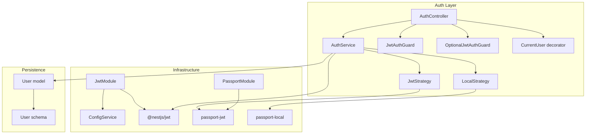
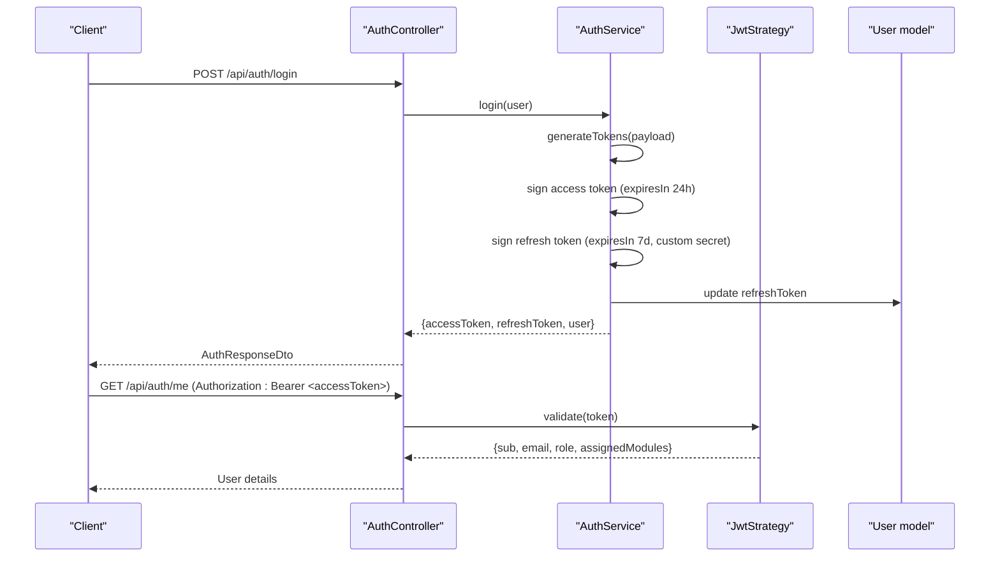
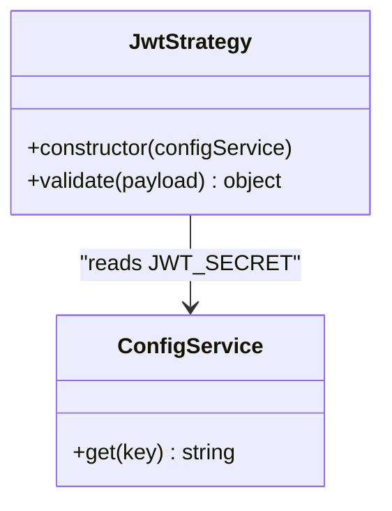
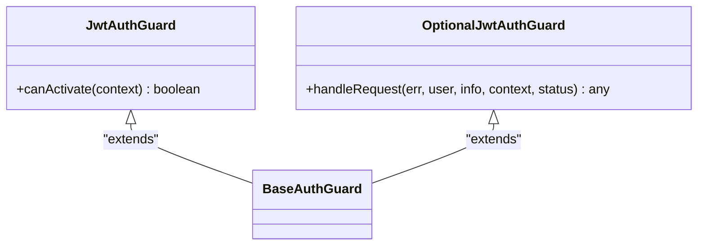
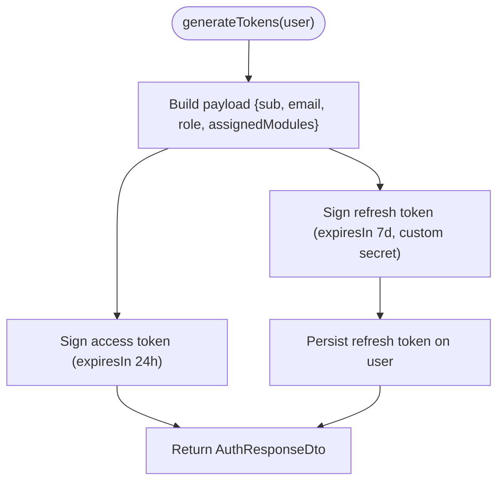
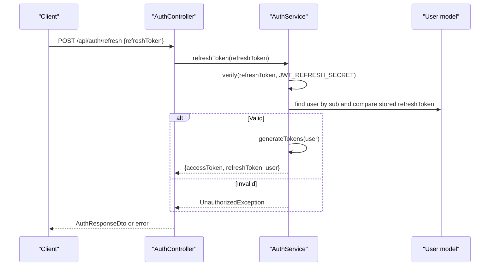
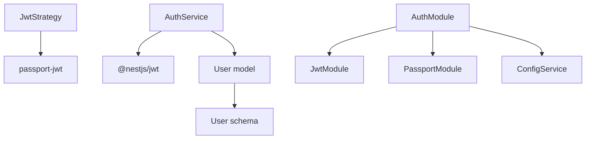

# JWT Token System

<cite>
**Referenced Files in This Document**
- [auth.controller.ts](file://backend/src/auth/auth.controller.ts)
- [auth.service.ts](file://backend/src/auth/auth.service.ts)
- [jwt.strategy.ts](file://backend/src/auth/strategies/jwt.strategy.ts)
- [jwt-auth.guard.ts](file://backend/src/auth/guards/jwt-auth.guard.ts)
- [auth.guard.ts](file://backend/src/auth/guards/auth.guard.ts)
- [current-user.decorator.ts](file://backend/src/auth/decorators/current-user.decorator.ts)
- [auth.dto.ts](file://backend/src/auth/dto/auth.dto.ts)
- [auth.module.ts](file://backend/src/auth/auth.module.ts)
- [user.schema.ts](file://backend/src/users/schemas/user.schema.ts)
- [app.module.ts](file://backend/src/app.module.ts)
- [main.ts](file://backend/src/main.ts)
- [.env.example](file://backend/.env.example)
</cite>

## Table of Contents
1. [Introduction](#introduction)
2. [Project Structure](#project-structure)
3. [Core Components](#core-components)
4. [Architecture Overview](#architecture-overview)
5. [Detailed Component Analysis](#detailed-component-analysis)
6. [Dependency Analysis](#dependency-analysis)
7. [Performance Considerations](#performance-considerations)
8. [Troubleshooting Guide](#troubleshooting-guide)
9. [Conclusion](#conclusion)

## Introduction
This document provides comprehensive documentation for the JWT token system in the backend. It covers token generation, validation, refresh mechanisms, strategy configuration, expiration handling, payload structure, and the JWT auth guard implementation. It also explains token extraction from headers, automatic user injection via decorators, practical examples of controller usage, middleware integration, secure endpoint protection, and best practices for token security, storage, and lifecycle management.

## Project Structure
The JWT implementation spans several modules:
- Authentication controller exposes endpoints for registration, login, profile retrieval, token refresh, and logout.
- Authentication service encapsulates user validation, token signing, refresh verification, and logout.
- Strategies define how JWT tokens are extracted and validated.
- Guards enforce authentication and optional authentication flows.
- Decorators enable automatic user injection into controllers.
- DTOs define request/response shapes for authentication operations.
- Auth module registers JWT and Passport modules and wires strategies and services.
- User schema stores refresh tokens and user metadata.
- Environment configuration defines secrets and expiration policies.
- Main application bootstraps the server, enables CORS, and sets global prefixes.

**Diagram sources**
- [auth.controller.ts](file://backend/src/auth/auth.controller.ts#L1-L58)
- [auth.service.ts](file://backend/src/auth/auth.service.ts#L1-L125)
- [jwt.strategy.ts](file://backend/src/auth/strategies/jwt.strategy.ts#L1-L25)
- [auth.guard.ts](file://backend/src/auth/guards/auth.guard.ts#L1-L26)
- [jwt-auth.guard.ts](file://backend/src/auth/guards/jwt-auth.guard.ts#L1-L10)
- [current-user.decorator.ts](file://backend/src/auth/decorators/current-user.decorator.ts#L1-L9)
- [auth.module.ts](file://backend/src/auth/auth.module.ts#L1-L30)
- [user.schema.ts](file://backend/src/users/schemas/user.schema.ts#L1-L66)

**Section sources**
- [auth.controller.ts](file://backend/src/auth/auth.controller.ts#L1-L58)
- [auth.service.ts](file://backend/src/auth/auth.service.ts#L1-L125)
- [auth.module.ts](file://backend/src/auth/auth.module.ts#L1-L30)
- [app.module.ts](file://backend/src/app.module.ts#L1-L41)
- [main.ts](file://backend/src/main.ts#L1-L54)

## Core Components
- AuthController: Exposes endpoints for registration, login, profile retrieval, refresh, and logout. Uses guards to protect endpoints and injects the current user via decorators.
- AuthService: Implements user validation, token generation, refresh token verification, and logout. Manages payload composition and database updates.
- JwtStrategy: Extracts JWT from Authorization headers and validates signatures using the configured secret.
- JwtAuthGuard: Enforces JWT authentication for protected routes.
- OptionalJwtAuthGuard: Allows request flow even when authentication fails, returning null user.
- CurrentUser decorator: Provides automatic injection of the authenticated user into controllers.
- DTOs: Define request/response shapes for authentication operations.
- AuthModule: Registers JwtModule and PassportModule, configures JWT secret and expiration, and wires strategies and services.
- User schema: Stores refresh tokens and user metadata, enabling refresh token validation and user serialization.

**Section sources**
- [auth.controller.ts](file://backend/src/auth/auth.controller.ts#L1-L58)
- [auth.service.ts](file://backend/src/auth/auth.service.ts#L1-L125)
- [jwt.strategy.ts](file://backend/src/auth/strategies/jwt.strategy.ts#L1-L25)
- [jwt-auth.guard.ts](file://backend/src/auth/guards/jwt-auth.guard.ts#L1-L10)
- [auth.guard.ts](file://backend/src/auth/guards/auth.guard.ts#L1-L26)
- [current-user.decorator.ts](file://backend/src/auth/decorators/current-user.decorator.ts#L1-L9)
- [auth.dto.ts](file://backend/src/auth/dto/auth.dto.ts#L1-L58)
- [auth.module.ts](file://backend/src/auth/auth.module.ts#L1-L30)
- [user.schema.ts](file://backend/src/users/schemas/user.schema.ts#L1-L66)

## Architecture Overview
The JWT system integrates with Passport strategies and NestJS guards to provide seamless authentication and authorization across controllers. The flow begins with local authentication to validate credentials, followed by JWT issuance. Subsequent requests use bearer tokens validated by the JWT strategy. Refresh tokens are stored in the database and used to issue new access tokens.

**Diagram sources**
- [auth.controller.ts](file://backend/src/auth/auth.controller.ts#L25-L36)
- [auth.service.ts](file://backend/src/auth/auth.service.ts#L56-L94)
- [jwt.strategy.ts](file://backend/src/auth/strategies/jwt.strategy.ts#L16-L23)
- [user.schema.ts](file://backend/src/users/schemas/user.schema.ts#L42-L43)

## Detailed Component Analysis

### JWT Strategy Configuration
- Token extraction: The strategy extracts JWT from the Authorization header as a bearer token.
- Validation: Validates signature using the configured secret from environment variables.
- Payload shaping: Returns a normalized user object containing subject, email, role, and assigned modules.

**Diagram sources**
- [jwt.strategy.ts](file://backend/src/auth/strategies/jwt.strategy.ts#L1-L25)

**Section sources**
- [jwt.strategy.ts](file://backend/src/auth/strategies/jwt.strategy.ts#L1-L25)
- [.env.example](file://backend/.env.example#L11-L13)

### JWT Auth Guard Implementation
- JwtAuthGuard: Extends the base AuthGuard('jwt'), delegating authentication to the JWT strategy.
- OptionalJwtAuthGuard: Overrides the handler to return the user if present or null otherwise, enabling optional authentication flows.

**Diagram sources**
- [jwt-auth.guard.ts](file://backend/src/auth/guards/jwt-auth.guard.ts#L1-L10)
- [auth.guard.ts](file://backend/src/auth/guards/auth.guard.ts#L21-L25)

**Section sources**
- [jwt-auth.guard.ts](file://backend/src/auth/guards/jwt-auth.guard.ts#L1-L10)
- [auth.guard.ts](file://backend/src/auth/guards/auth.guard.ts#L1-L26)

### Token Extraction from Headers
- The strategy uses ExtractJwt.fromAuthHeaderAsBearerToken() to extract the token from the Authorization header.
- The header format is expected to be "Bearer <token>".

**Section sources**
- [jwt.strategy.ts](file://backend/src/auth/strategies/jwt.strategy.ts#L10-L10)

### Automatic User Injection via Decorators
- CurrentUser decorator reads the authenticated user from the request object and injects it into controller parameters.
- This simplifies accessing the current user without manual request parsing.

**Section sources**
- [current-user.decorator.ts](file://backend/src/auth/decorators/current-user.decorator.ts#L1-L9)

### Token Generation and Payload Structure
- Payload composition: Includes subject (user ID), email, role, and assigned modules.
- Access token: Signed with the primary JWT secret and expires in 24 hours.
- Refresh token: Signed with a separate refresh secret and expires in 7 days.
- Database persistence: Refresh token is stored on the user record after successful login/register.

**Diagram sources**
- [auth.service.ts](file://backend/src/auth/auth.service.ts#L56-L94)
- [user.schema.ts](file://backend/src/users/schemas/user.schema.ts#L42-L43)

**Section sources**
- [auth.service.ts](file://backend/src/auth/auth.service.ts#L56-L94)
- [auth.dto.ts](file://backend/src/auth/dto/auth.dto.ts#L45-L57)
- [user.schema.ts](file://backend/src/users/schemas/user.schema.ts#L42-L43)

### Token Validation and Expiration Handling
- Access token validation: Performed by JwtStrategy.validate(), ensuring signature validity and non-expired tokens.
- Expiration policy: Access tokens expire after 24 hours; refresh tokens expire after 7 days.
- Strategy configuration: Uses the configured JWT secret and enforces expiration checks.

**Section sources**
- [jwt.strategy.ts](file://backend/src/auth/strategies/jwt.strategy.ts#L11-L13)
- [auth.module.ts](file://backend/src/auth/auth.module.ts#L18-L22)
- [auth.service.ts](file://backend/src/auth/auth.service.ts#L64-L71)

### Refresh Mechanism
- Endpoint: POST /api/auth/refresh accepts a refresh token.
- Validation: Verifies the refresh token against the refresh secret and ensures it matches the stored value on the user.
- Rotation: On success, issues new access and refresh tokens and updates the stored refresh token.

**Diagram sources**
- [auth.controller.ts](file://backend/src/auth/auth.controller.ts#L38-L42)
- [auth.service.ts](file://backend/src/auth/auth.service.ts#L96-L111)
- [user.schema.ts](file://backend/src/users/schemas/user.schema.ts#L42-L43)

**Section sources**
- [auth.controller.ts](file://backend/src/auth/auth.controller.ts#L38-L42)
- [auth.service.ts](file://backend/src/auth/auth.service.ts#L96-L111)

### Logout and Token Lifecycle Management
- Logout endpoint: Removes the stored refresh token for the user.
- Token lifecycle: Access tokens are short-lived; refresh tokens are long-lived but validated against the stored value to prevent reuse.

**Section sources**
- [auth.controller.ts](file://backend/src/auth/auth.controller.ts#L44-L50)
- [auth.service.ts](file://backend/src/auth/auth.service.ts#L113-L115)
- [user.schema.ts](file://backend/src/users/schemas/user.schema.ts#L42-L43)

### Practical Examples of Token Usage in Controllers
- Protected profile endpoint: Requires JwtAuthGuard and returns the authenticated user’s profile.
- Me endpoint: Requires JwtAuthGuard and fetches user details by ID.
- Optional authentication: OptionalJwtAuthGuard allows proceeding without throwing errors when no valid token is present.

**Section sources**
- [auth.controller.ts](file://backend/src/auth/auth.controller.ts#L32-L36)
- [auth.controller.ts](file://backend/src/auth/auth.controller.ts#L52-L56)
- [auth.guard.ts](file://backend/src/auth/guards/auth.guard.ts#L21-L25)

### Middleware Integration and Secure Endpoint Protection
- Guards: JwtAuthGuard and OptionalJwtAuthGuard integrate with NestJS route guards to enforce authentication.
- Decorators: CurrentUser simplifies access to the authenticated user in controllers.
- Global configuration: AuthModule registers JwtModule with a secret and expiration, and PassportModule for strategies.

**Section sources**
- [jwt-auth.guard.ts](file://backend/src/auth/guards/jwt-auth.guard.ts#L1-L10)
- [auth.guard.ts](file://backend/src/auth/guards/auth.guard.ts#L1-L26)
- [current-user.decorator.ts](file://backend/src/auth/decorators/current-user.decorator.ts#L1-L9)
- [auth.module.ts](file://backend/src/auth/auth.module.ts#L12-L28)

## Dependency Analysis
The JWT system relies on:
- @nestjs/jwt for signing and verifying tokens.
- passport-jwt for extracting and validating JWTs.
- Mongoose for storing refresh tokens and user metadata.
- ConfigService for reading secrets and expiration settings from environment variables.

**Diagram sources**
- [auth.service.ts](file://backend/src/auth/auth.service.ts#L2-L2)
- [jwt.strategy.ts](file://backend/src/auth/strategies/jwt.strategy.ts#L3-L3)
- [auth.module.ts](file://backend/src/auth/auth.module.ts#L14-L23)
- [user.schema.ts](file://backend/src/users/schemas/user.schema.ts#L1-L66)

**Section sources**
- [auth.service.ts](file://backend/src/auth/auth.service.ts#L1-L15)
- [jwt.strategy.ts](file://backend/src/auth/strategies/jwt.strategy.ts#L1-L25)
- [auth.module.ts](file://backend/src/auth/auth.module.ts#L1-L30)
- [user.schema.ts](file://backend/src/users/schemas/user.schema.ts#L1-L66)

## Performance Considerations
- Token expiration: Short-lived access tokens reduce risk and require frequent refresh, which can increase server load. Consider balancing security and performance by tuning expiration windows.
- Refresh token validation: Storing refresh tokens in the database adds write operations on login/register and logout. Ensure indexing on user IDs and refresh tokens for efficient lookups.
- Strategy overhead: Passport strategies introduce minimal overhead; keep strategy logic focused on validation and payload shaping.

## Troubleshooting Guide
Common issues and resolutions:
- Invalid credentials during login: Thrown when email is not found or password does not match.
- Invalid or expired refresh token: Thrown when the refresh token is missing, mismatched, or expired.
- User not found: Thrown when attempting to fetch user details by ID.
- Missing Authorization header: Ensure clients send "Authorization: Bearer <accessToken>".
- CORS configuration: Verify allowed origins and credentials in development mode.

**Section sources**
- [auth.service.ts](file://backend/src/auth/auth.service.ts#L17-L30)
- [auth.service.ts](file://backend/src/auth/auth.service.ts#L96-L111)
- [auth.service.ts](file://backend/src/auth/auth.service.ts#L117-L123)
- [jwt.strategy.ts](file://backend/src/auth/strategies/jwt.strategy.ts#L10-L10)
- [main.ts](file://backend/src/main.ts#L9-L31)

## Conclusion
The JWT token system provides robust authentication and authorization through clear separation of concerns: strategies handle token extraction and validation, guards protect endpoints, and services manage token generation, refresh, and logout. The payload structure includes essential user attributes, and refresh tokens are securely persisted and validated. By following the outlined best practices and lifecycle management recommendations, the system remains secure, maintainable, and scalable.