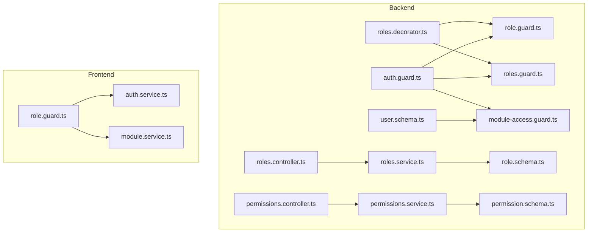
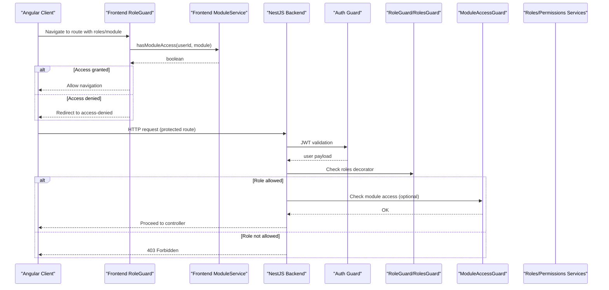
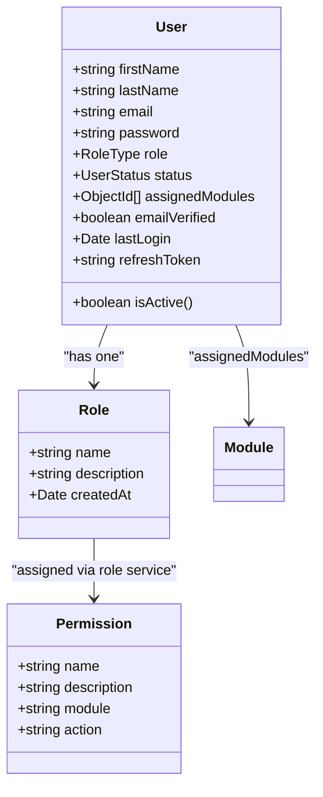
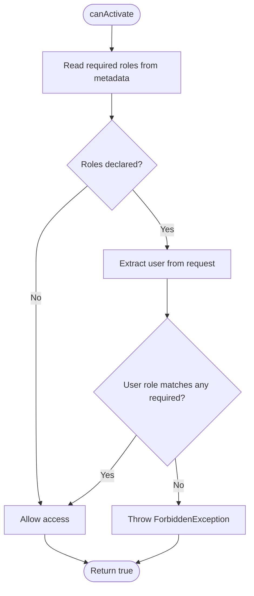
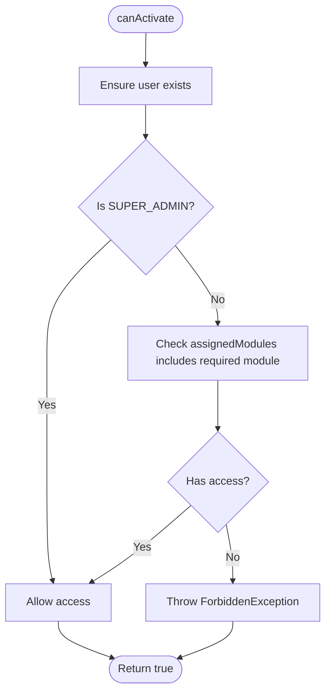
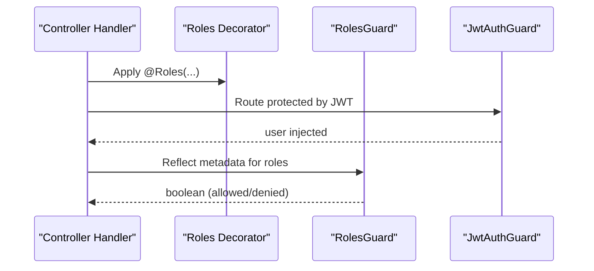
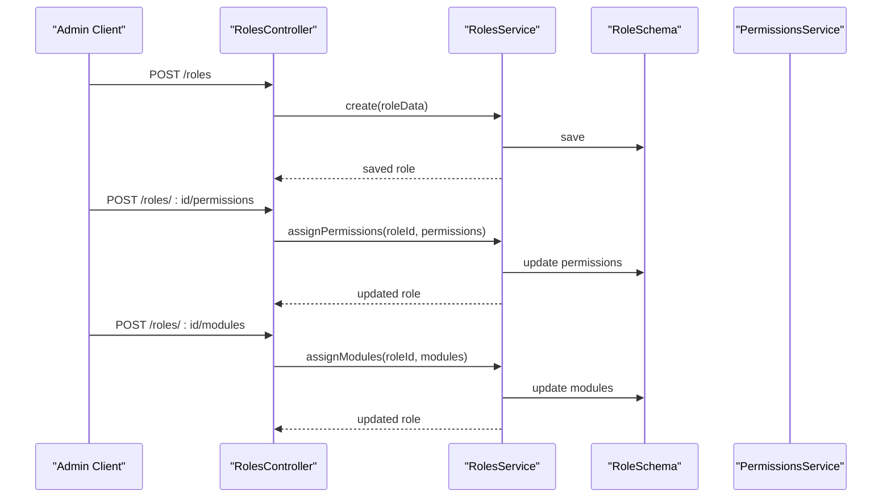
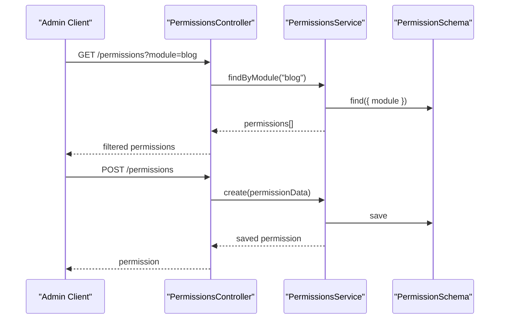
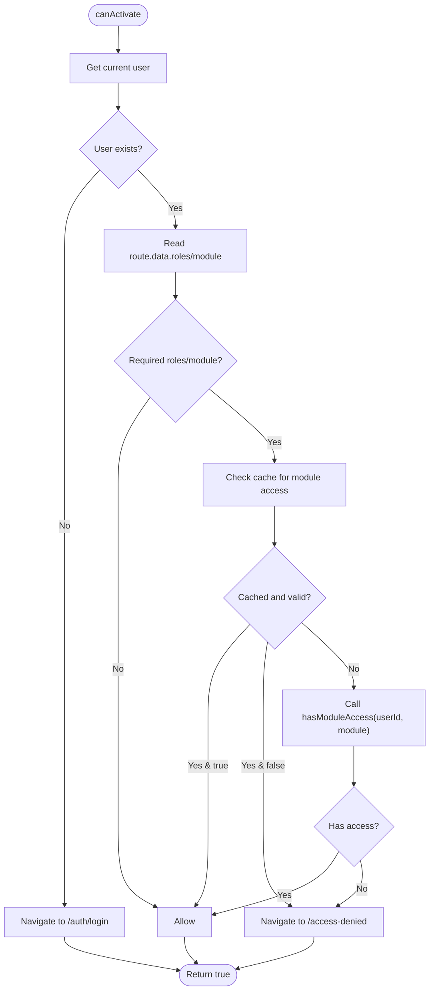
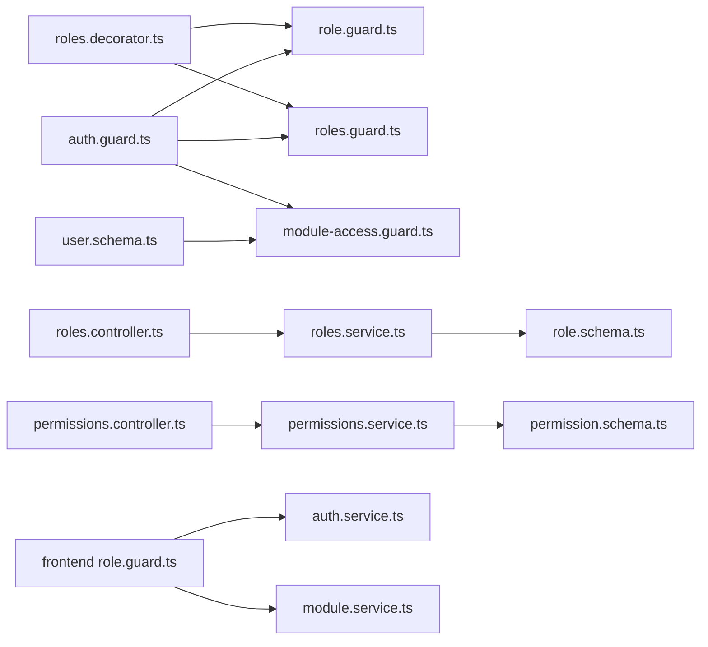

# Role-Based Access Control (RBAC)

<cite>
**Referenced Files in This Document**
- [role.guard.ts](file://backend/src/auth/guards/role.guard.ts)
- [roles.guard.ts](file://backend/src/auth/guards/roles.guard.ts)
- [module-access.guard.ts](file://backend/src/auth/guards/module-access.guard.ts)
- [roles.decorator.ts](file://backend/src/auth/decorators/roles.decorator.ts)
- [auth.guard.ts](file://backend/src/auth/guards/auth.guard.ts)
- [roles.controller.ts](file://backend/src/roles/roles.controller.ts)
- [roles.service.ts](file://backend/src/roles/roles.service.ts)
- [permissions.controller.ts](file://backend/src/permissions/permissions.controller.ts)
- [permissions.service.ts](file://backend/src/permissions/permissions.service.ts)
- [role.schema.ts](file://backend/src/roles/schemas/role.schema.ts)
- [permission.schema.ts](file://backend/src/permissions/schemas/permission.schema.ts)
- [user.schema.ts](file://backend/src/users/schemas/user.schema.ts)
- [role.guard.ts](file://frontend/src/app/core/guards/role.guard.ts)
- [module.service.ts](file://frontend/src/app/core/services/module.service.ts)
- [auth.service.ts](file://frontend/src/app/core/services/auth.service.ts)
</cite>

## Table of Contents
1. [Introduction](#introduction)
2. [Project Structure](#project-structure)
3. [Core Components](#core-components)
4. [Architecture Overview](#architecture-overview)
5. [Detailed Component Analysis](#detailed-component-analysis)
6. [Dependency Analysis](#dependency-analysis)
7. [Performance Considerations](#performance-considerations)
8. [Troubleshooting Guide](#troubleshooting-guide)
9. [Conclusion](#conclusion)
10. [Appendices](#appendices)

## Introduction
This document provides comprehensive Role-Based Access Control (RBAC) documentation for the Multi-Application Control Dashboard. It covers the three-tier role hierarchy (Super Admin, Admin, Viewer), the permission system, role creation and assignment, module access controls, guard implementations, decorators, and runtime enforcement. It also includes practical examples for route protection, component visibility, and dynamic menu generation, along with role management workflows, auditing considerations, and security policy guidance.

## Project Structure
The RBAC implementation spans both backend NestJS modules and frontend Angular guards and services:
- Backend: Guards, decorators, controllers, services, and Mongoose schemas define role and permission enforcement.
- Frontend: Route guards and services enforce client-side access checks and cache module access decisions.

**Diagram sources**
- [role.guard.ts](file://backend/src/auth/guards/role.guard.ts#L1-L51)
- [roles.guard.ts](file://backend/src/auth/guards/roles.guard.ts#L1-L23)
- [module-access.guard.ts](file://backend/src/auth/guards/module-access.guard.ts#L1-L28)
- [roles.decorator.ts](file://backend/src/auth/decorators/roles.decorator.ts#L1-L5)
- [auth.guard.ts](file://backend/src/auth/guards/auth.guard.ts#L1-L26)
- [roles.controller.ts](file://backend/src/roles/roles.controller.ts#L1-L46)
- [roles.service.ts](file://backend/src/roles/roles.service.ts#L1-L47)
- [permissions.controller.ts](file://backend/src/permissions/permissions.controller.ts#L1-L39)
- [permissions.service.ts](file://backend/src/permissions/permissions.service.ts#L1-L35)
- [role.schema.ts](file://backend/src/roles/schemas/role.schema.ts#L1-L25)
- [permission.schema.ts](file://backend/src/permissions/schemas/permission.schema.ts#L1-L20)
- [user.schema.ts](file://backend/src/users/schemas/user.schema.ts#L1-L66)
- [role.guard.ts](file://frontend/src/app/core/guards/role.guard.ts#L1-L134)
- [module.service.ts](file://frontend/src/app/core/services/module.service.ts#L1-L139)
- [auth.service.ts](file://frontend/src/app/core/services/auth.service.ts#L1-L161)

**Section sources**
- [role.guard.ts](file://backend/src/auth/guards/role.guard.ts#L1-L51)
- [roles.guard.ts](file://backend/src/auth/guards/roles.guard.ts#L1-L23)
- [module-access.guard.ts](file://backend/src/auth/guards/module-access.guard.ts#L1-L28)
- [roles.decorator.ts](file://backend/src/auth/decorators/roles.decorator.ts#L1-L5)
- [auth.guard.ts](file://backend/src/auth/guards/auth.guard.ts#L1-L26)
- [roles.controller.ts](file://backend/src/roles/roles.controller.ts#L1-L46)
- [roles.service.ts](file://backend/src/roles/roles.service.ts#L1-L47)
- [permissions.controller.ts](file://backend/src/permissions/permissions.controller.ts#L1-L39)
- [permissions.service.ts](file://backend/src/permissions/permissions.service.ts#L1-L35)
- [role.schema.ts](file://backend/src/roles/schemas/role.schema.ts#L1-L25)
- [permission.schema.ts](file://backend/src/permissions/schemas/permission.schema.ts#L1-L20)
- [user.schema.ts](file://backend/src/users/schemas/user.schema.ts#L1-L66)
- [role.guard.ts](file://frontend/src/app/core/guards/role.guard.ts#L1-L134)
- [module.service.ts](file://frontend/src/app/core/services/module.service.ts#L1-L139)
- [auth.service.ts](file://frontend/src/app/core/services/auth.service.ts#L1-L161)

## Core Components
- Role hierarchy: Three-tier roles defined via an enum and enforced in guards and schemas.
- Permission model: Modular permissions with module/action attributes.
- Role management: Controllers and services for CRUD and assignment of permissions/modules to roles.
- Authentication guard: JWT-based authentication for protected routes.
- Role and module guards: Server-side and client-side enforcement of role and module access.
- Decorators: Metadata-based role requirement declaration for controllers/handlers.
- User schema: Stores role and assigned modules for runtime enforcement.

**Section sources**
- [role.schema.ts](file://backend/src/roles/schemas/role.schema.ts#L4-L8)
- [permission.schema.ts](file://backend/src/permissions/schemas/permission.schema.ts#L12-L16)
- [roles.controller.ts](file://backend/src/roles/roles.controller.ts#L36-L44)
- [auth.guard.ts](file://backend/src/auth/guards/auth.guard.ts#L6-L11)
- [roles.decorator.ts](file://backend/src/auth/decorators/roles.decorator.ts#L3-L4)
- [user.schema.ts](file://backend/src/users/schemas/user.schema.ts#L27-L34)

## Architecture Overview
The RBAC architecture enforces access control at two layers:
- Backend: Route-level and handler-level guards using decorators and reflection.
- Frontend: Route-level guards with caching and module access validation.

**Diagram sources**
- [role.guard.ts](file://frontend/src/app/core/guards/role.guard.ts#L14-L46)
- [module.service.ts](file://frontend/src/app/core/services/module.service.ts#L97-L102)
- [auth.guard.ts](file://backend/src/auth/guards/auth.guard.ts#L6-L11)
- [role.guard.ts](file://backend/src/auth/guards/role.guard.ts#L13-L25)
- [roles.guard.ts](file://backend/src/auth/guards/roles.guard.ts#L10-L21)
- [module-access.guard.ts](file://backend/src/auth/guards/module-access.guard.ts#L7-L26)

## Detailed Component Analysis

### Role and Permission Schemas
- Role schema defines the three-tier hierarchy and basic metadata.
- Permission schema defines modular permissions with module and action attributes.
- User schema stores role and assigned modules for runtime enforcement.

**Diagram sources**
- [role.schema.ts](file://backend/src/roles/schemas/role.schema.ts#L12-L24)
- [permission.schema.ts](file://backend/src/permissions/schemas/permission.schema.ts#L4-L19)
- [user.schema.ts](file://backend/src/users/schemas/user.schema.ts#L13-L49)

**Section sources**
- [role.schema.ts](file://backend/src/roles/schemas/role.schema.ts#L4-L8)
- [permission.schema.ts](file://backend/src/permissions/schemas/permission.schema.ts#L12-L16)
- [user.schema.ts](file://backend/src/users/schemas/user.schema.ts#L27-L34)

### Backend Role Guard Implementation
- RoleGuard reads required roles from metadata and compares against the request user’s role.
- RolesGuard supports array-based role matching with reflection.
- PermissionGuard placeholder exists but needs implementation to check user permissions.

**Diagram sources**
- [role.guard.ts](file://backend/src/auth/guards/role.guard.ts#L13-L25)
- [roles.guard.ts](file://backend/src/auth/guards/roles.guard.ts#L10-L21)

**Section sources**
- [role.guard.ts](file://backend/src/auth/guards/role.guard.ts#L13-L25)
- [roles.guard.ts](file://backend/src/auth/guards/roles.guard.ts#L10-L21)

### Backend Module Access Guard
- Enforces module-level access based on user’s assigned modules.
- Super Admin bypasses module checks.
- Throws explicit forbidden exceptions when access is denied.

**Diagram sources**
- [module-access.guard.ts](file://backend/src/auth/guards/module-access.guard.ts#L7-L26)

**Section sources**
- [module-access.guard.ts](file://backend/src/auth/guards/module-access.guard.ts#L15-L23)

### Decorators and Authentication Guards
- Roles decorator sets metadata for required roles.
- Auth guards provide JWT and optional JWT handling for unauthenticated fallbacks.

**Diagram sources**
- [roles.decorator.ts](file://backend/src/auth/decorators/roles.decorator.ts#L3-L4)
- [roles.guard.ts](file://backend/src/auth/guards/roles.guard.ts#L10-L21)
- [auth.guard.ts](file://backend/src/auth/guards/auth.guard.ts#L6-L11)

**Section sources**
- [roles.decorator.ts](file://backend/src/auth/decorators/roles.decorator.ts#L3-L4)
- [auth.guard.ts](file://backend/src/auth/guards/auth.guard.ts#L6-L11)

### Role Management Workflows
- Create/update/delete roles via dedicated controller endpoints.
- Assign permissions and modules to roles through service methods.
- Hierarchical structure: Super Admin > Admin > Viewer; Super Admin bypasses module checks.

**Diagram sources**
- [roles.controller.ts](file://backend/src/roles/roles.controller.ts#L11-L44)
- [roles.service.ts](file://backend/src/roles/roles.service.ts#L35-L45)

**Section sources**
- [roles.controller.ts](file://backend/src/roles/roles.controller.ts#L36-L44)
- [roles.service.ts](file://backend/src/roles/roles.service.ts#L35-L45)

### Permission Management Workflows
- Create, list, filter by module, update, and delete permissions.
- Permissions are module-scoped and include action types.

**Diagram sources**
- [permissions.controller.ts](file://backend/src/permissions/permissions.controller.ts#L17-L22)
- [permissions.service.ts](file://backend/src/permissions/permissions.service.ts#L19-L21)

**Section sources**
- [permissions.controller.ts](file://backend/src/permissions/permissions.controller.ts#L11-L37)
- [permissions.service.ts](file://backend/src/permissions/permissions.service.ts#L10-L33)

### Frontend Role and Module Guards
- RoleGuard validates route roles against the current user.
- ModuleGuard caches module access decisions to reduce API calls and redirects to access-denied when insufficient.

**Diagram sources**
- [role.guard.ts](file://frontend/src/app/core/guards/role.guard.ts#L14-L46)
- [role.guard.ts](file://frontend/src/app/core/guards/role.guard.ts#L63-L105)

**Section sources**
- [role.guard.ts](file://frontend/src/app/core/guards/role.guard.ts#L14-L46)
- [role.guard.ts](file://frontend/src/app/core/guards/role.guard.ts#L63-L105)

### Practical Examples

#### Role-Based Route Protection
- Decorate NestJS handlers with roles metadata to restrict access to Super Admin/Admin/Viewer.
- Example path: [roles.decorator.ts](file://backend/src/auth/decorators/roles.decorator.ts#L3-L4), [roles.guard.ts](file://backend/src/auth/guards/roles.guard.ts#L10-L21)

#### Dynamic Menu Generation
- Use assigned modules and user role to render menus.
- Example path: [module.service.ts](file://frontend/src/app/core/services/module.service.ts#L97-L102), [auth.service.ts](file://frontend/src/app/core/services/auth.service.ts#L130-L132)

#### Component Visibility Controls
- Conditionally show/hide components based on user role and module access.
- Example path: [role.guard.ts](file://frontend/src/app/core/guards/role.guard.ts#L43-L45), [module.service.ts](file://frontend/src/app/core/services/module.service.ts#L135-L137)

## Dependency Analysis
- Backend guards depend on authentication guards and reflector metadata.
- Controllers depend on services; services depend on Mongoose models.
- Frontend guards depend on auth and module services; module service depends on HTTP client.

**Diagram sources**
- [roles.decorator.ts](file://backend/src/auth/decorators/roles.decorator.ts#L3-L4)
- [role.guard.ts](file://backend/src/auth/guards/role.guard.ts#L13-L25)
- [roles.guard.ts](file://backend/src/auth/guards/roles.guard.ts#L10-L21)
- [auth.guard.ts](file://backend/src/auth/guards/auth.guard.ts#L6-L11)
- [module-access.guard.ts](file://backend/src/auth/guards/module-access.guard.ts#L7-L26)
- [roles.controller.ts](file://backend/src/roles/roles.controller.ts#L11-L44)
- [roles.service.ts](file://backend/src/roles/roles.service.ts#L35-L45)
- [permissions.controller.ts](file://backend/src/permissions/permissions.controller.ts#L11-L37)
- [permissions.service.ts](file://backend/src/permissions/permissions.service.ts#L10-L33)
- [role.schema.ts](file://backend/src/roles/schemas/role.schema.ts#L12-L24)
- [permission.schema.ts](file://backend/src/permissions/schemas/permission.schema.ts#L4-L19)
- [user.schema.ts](file://backend/src/users/schemas/user.schema.ts#L13-L49)
- [role.guard.ts](file://frontend/src/app/core/guards/role.guard.ts#L14-L46)
- [auth.service.ts](file://frontend/src/app/core/services/auth.service.ts#L130-L132)
- [module.service.ts](file://frontend/src/app/core/services/module.service.ts#L97-L102)

**Section sources**
- [roles.controller.ts](file://backend/src/roles/roles.controller.ts#L1-L46)
- [roles.service.ts](file://backend/src/roles/roles.service.ts#L1-L47)
- [permissions.controller.ts](file://backend/src/permissions/permissions.controller.ts#L1-L39)
- [permissions.service.ts](file://backend/src/permissions/permissions.service.ts#L1-L35)
- [role.guard.ts](file://backend/src/auth/guards/role.guard.ts#L1-L51)
- [roles.guard.ts](file://backend/src/auth/guards/roles.guard.ts#L1-L23)
- [module-access.guard.ts](file://backend/src/auth/guards/module-access.guard.ts#L1-L28)
- [role.guard.ts](file://frontend/src/app/core/guards/role.guard.ts#L1-L134)
- [module.service.ts](file://frontend/src/app/core/services/module.service.ts#L1-L139)
- [auth.service.ts](file://frontend/src/app/core/services/auth.service.ts#L1-L161)

## Performance Considerations
- Frontend ModuleGuard caches module access decisions with expiry to minimize API calls.
- Recommendation: Align cache keys with user ID and module name; clear cache on login/logout to prevent stale data.

**Section sources**
- [role.guard.ts](file://frontend/src/app/core/guards/role.guard.ts#L52-L56)
- [role.guard.ts](file://frontend/src/app/core/guards/role.guard.ts#L121-L124)
- [role.guard.ts](file://frontend/src/app/core/guards/role.guard.ts#L129-L132)

## Troubleshooting Guide
- Access Denied on Protected Routes:
  - Verify JWT authentication is successful and user is attached to request.
  - Confirm roles decorator metadata matches user role.
  - Check ModuleAccessGuard for module assignment.
  - References: [auth.guard.ts](file://backend/src/auth/guards/auth.guard.ts#L6-L11), [roles.guard.ts](file://backend/src/auth/guards/roles.guard.ts#L10-L21), [module-access.guard.ts](file://backend/src/auth/guards/module-access.guard.ts#L15-L23)
- Frontend Navigation Blocked:
  - Ensure current user is present and roles match route requirements.
  - Check ModuleGuard cache and navigate to access-denied when false.
  - References: [role.guard.ts](file://frontend/src/app/core/guards/role.guard.ts#L18-L38), [role.guard.ts](file://frontend/src/app/core/guards/role.guard.ts#L80-L104)
- Permission Auditing:
  - Track permission assignments per role via roles service.
  - Log permission changes at controller boundaries.
  - References: [roles.controller.ts](file://backend/src/roles/roles.controller.ts#L36-L44), [roles.service.ts](file://backend/src/roles/roles.service.ts#L35-L45)

**Section sources**
- [auth.guard.ts](file://backend/src/auth/guards/auth.guard.ts#L6-L11)
- [roles.guard.ts](file://backend/src/auth/guards/roles.guard.ts#L10-L21)
- [module-access.guard.ts](file://backend/src/auth/guards/module-access.guard.ts#L15-L23)
- [role.guard.ts](file://frontend/src/app/core/guards/role.guard.ts#L18-L38)
- [role.guard.ts](file://frontend/src/app/core/guards/role.guard.ts#L80-L104)
- [roles.controller.ts](file://backend/src/roles/roles.controller.ts#L36-L44)
- [roles.service.ts](file://backend/src/roles/roles.service.ts#L35-L45)

## Conclusion
The RBAC system implements a robust three-tier role hierarchy with modular permissions and dual-layer enforcement (backend and frontend). Guards and decorators provide declarative access control, while services manage role and permission lifecycles. The frontend includes caching for efficient module access checks. To strengthen the system, implement PermissionGuard to enforce granular permissions and add comprehensive logging for auditing.

## Appendices

### Hierarchical Permission Structure and Inheritance
- Super Admin: Full access; bypasses module checks.
- Admin: Access determined by assigned modules and permissions.
- Viewer: Limited access; restricted to assigned modules and permissions.

**Section sources**
- [role.schema.ts](file://backend/src/roles/schemas/role.schema.ts#L4-L8)
- [module-access.guard.ts](file://backend/src/auth/guards/module-access.guard.ts#L15-L18)

### Security Policy Recommendations
- Enforce JWT authentication on all protected routes.
- Validate roles and module access at route entry.
- Implement PermissionGuard to enforce fine-grained permissions.
- Add audit logs for role and permission changes.
- Rotate refresh tokens and invalidate sessions on logout.

[No sources needed since this section provides general guidance]