# Security Implementation

<cite>
**Referenced Files in This Document**
- [main.ts](file://backend/src/main.ts)
- [app.module.ts](file://backend/src/app.module.ts)
- [auth.module.ts](file://backend/src/auth/auth.module.ts)
- [auth.controller.ts](file://backend/src/auth/auth.controller.ts)
- [auth.service.ts](file://backend/src/auth/auth.service.ts)
- [auth.dto.ts](file://backend/src/auth/dto/auth.dto.ts)
- [current-user.decorator.ts](file://backend/src/auth/decorators/current-user.decorator.ts)
- [roles.decorator.ts](file://backend/src/auth/decorators/roles.decorator.ts)
- [role.guard.ts](file://backend/src/auth/guards/role.guard.ts)
- [jwt.strategy.ts](file://backend/src/auth/strategies/jwt.strategy.ts)
- [local.strategy.ts](file://backend/src/auth/strategies/local.strategy.ts)
- [users.controller.ts](file://backend/src/users/users.controller.ts)
- [roles.controller.ts](file://backend/src/roles/roles.controller.ts)
- [permissions.controller.ts](file://backend/src/permissions/permissions.controller.ts)
- [.env.example](file://backend/.env.example)
</cite>

## Table of Contents
1. [Introduction](#introduction)
2. [Project Structure](#project-structure)
3. [Core Components](#core-components)
4. [Architecture Overview](#architecture-overview)
5. [Detailed Component Analysis](#detailed-component-analysis)
6. [Dependency Analysis](#dependency-analysis)
7. [Performance Considerations](#performance-considerations)
8. [Troubleshooting Guide](#troubleshooting-guide)
9. [Conclusion](#conclusion)
10. [Appendices](#appendices)

## Introduction
This document provides a comprehensive overview of the backend security implementation for the Multi-Application Control Dashboard. It covers authentication guards, input validation, security decorators for user identification and role verification, and the global request preprocessing pipeline. It also outlines the authentication workflow, token generation and refresh mechanisms, and highlights areas for improvement regarding CORS configuration, helmet integration, and additional security middleware. The goal is to help developers understand how security is enforced and how to extend or harden the system further.

## Project Structure
The backend follows a modular NestJS architecture with a central application module importing feature modules. Authentication is encapsulated in the AuthModule, which integrates Passport strategies, JWT configuration, and controller/service logic. Controllers for users, roles, and permissions are protected by JWT guards by default at the class level.

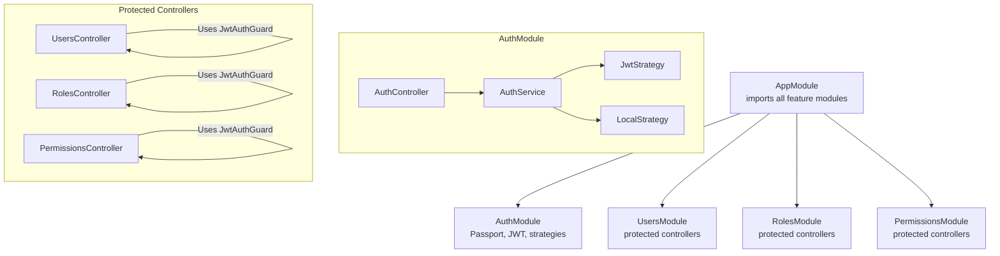

**Diagram sources**
- [app.module.ts](file://backend/src/app.module.ts#L17-L36)
- [auth.module.ts](file://backend/src/auth/auth.module.ts#L12-L28)
- [users.controller.ts](file://backend/src/users/users.controller.ts#L8-L9)
- [roles.controller.ts](file://backend/src/roles/roles.controller.ts#L7-L8)
- [permissions.controller.ts](file://backend/src/permissions/permissions.controller.ts#L7-L8)

**Section sources**
- [app.module.ts](file://backend/src/app.module.ts#L1-L41)
- [auth.module.ts](file://backend/src/auth/auth.module.ts#L1-L30)

## Core Components
- Global CORS configuration: Enables cross-origin requests from allowed origins, credentials support, and specific HTTP methods and headers.
- Global ValidationPipe: Enforces DTO validation, transforms inputs, and rejects non-whitelisted fields.
- AuthModule: Registers JWT and Passport modules, defines strategies, and exposes the AuthService.
- AuthController: Exposes authentication endpoints with guard usage.
- AuthService: Implements user validation, registration, token generation, refresh, and logout.
- Guards and Decorators: JwtAuthGuard, LocalAuthGuard, RoleGuard, PermissionGuard, CurrentUser decorator, and Roles decorator.

**Section sources**
- [main.ts](file://backend/src/main.ts#L8-L40)
- [auth.module.ts](file://backend/src/auth/auth.module.ts#L12-L28)
- [auth.controller.ts](file://backend/src/auth/auth.controller.ts#L15-L57)
- [auth.service.ts](file://backend/src/auth/auth.service.ts#L10-L124)
- [current-user.decorator.ts](file://backend/src/auth/decorators/current-user.decorator.ts#L1-L9)
- [roles.decorator.ts](file://backend/src/auth/decorators/roles.decorator.ts#L1-L5)
- [role.guard.ts](file://backend/src/auth/guards/role.guard.ts#L1-L51)

## Architecture Overview
The authentication and authorization architecture centers around Passport strategies and JWT tokens. The LocalStrategy validates credentials against the database, while the JwtStrategy extracts and verifies JWTs. Guards enforce access control at runtime, and decorators provide convenient access to the current user and required roles.

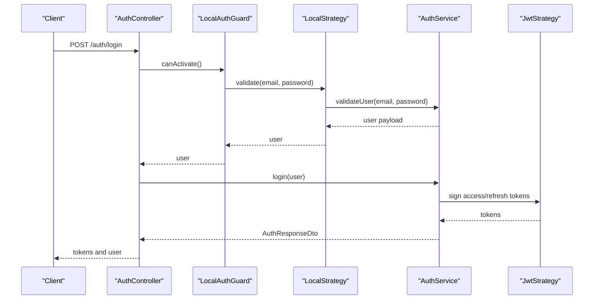

**Diagram sources**
- [auth.controller.ts](file://backend/src/auth/auth.controller.ts#L25-L30)
- [local.strategy.ts](file://backend/src/auth/strategies/local.strategy.ts#L12-L14)
- [auth.service.ts](file://backend/src/auth/auth.service.ts#L51-L54)
- [jwt.strategy.ts](file://backend/src/auth/strategies/jwt.strategy.ts#L16-L23)

## Detailed Component Analysis

### Authentication Guard Workflow
- JwtAuthGuard: Extends the NestJS built-in JWT guard to protect routes requiring authenticated sessions.
- LocalAuthGuard: Extends the local strategy guard for login validation.
- OptionalJwtAuthGuard: Allows request processing even when no valid JWT is present, returning null for user.

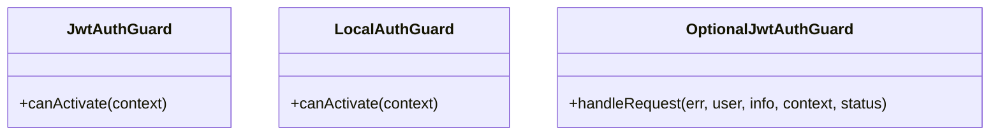

**Diagram sources**
- [auth.guard.ts](file://backend/src/auth/guards/auth.guard.ts#L7-L18)
- [auth.guard.ts](file://backend/src/auth/guards/auth.guard.ts#L21-L25)

**Section sources**
- [auth.guard.ts](file://backend/src/auth/guards/auth.guard.ts#L1-L26)

### Request Preprocessing Pipeline
- Global CORS: Configured with allowed origins, credentials, methods, and headers.
- Global ValidationPipe: Enforces DTO validation, whitelisting, and transformation.

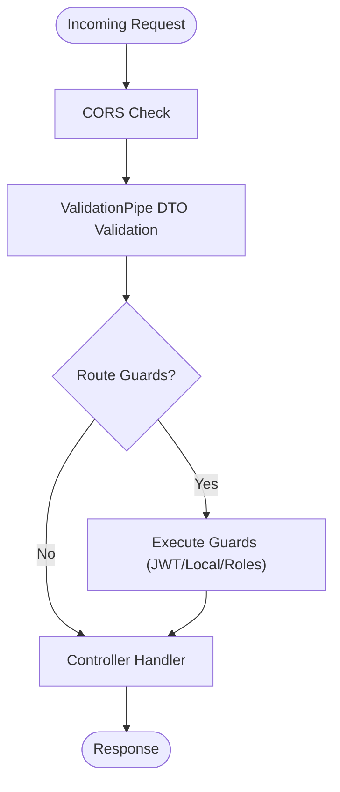

**Diagram sources**
- [main.ts](file://backend/src/main.ts#L8-L40)

**Section sources**
- [main.ts](file://backend/src/main.ts#L8-L40)

### Response Postprocessing
- AuthController returns structured responses with tokens and user data after successful authentication and profile retrieval.
- Token refresh endpoint revalidates refresh tokens and issues new access/refresh pairs.

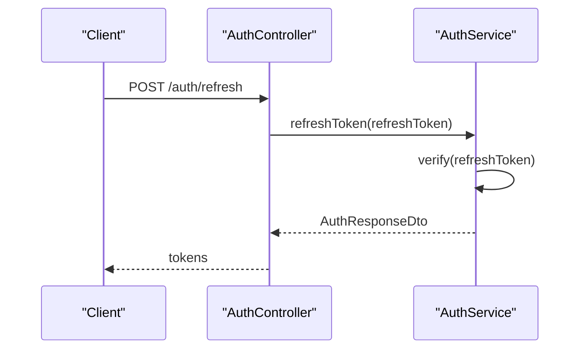

**Diagram sources**
- [auth.controller.ts](file://backend/src/auth/auth.controller.ts#L38-L42)
- [auth.service.ts](file://backend/src/auth/auth.service.ts#L96-L111)

**Section sources**
- [auth.controller.ts](file://backend/src/auth/auth.controller.ts#L38-L56)
- [auth.service.ts](file://backend/src/auth/auth.service.ts#L96-L124)

### Security Decorators and Role Verification
- CurrentUser decorator: Extracts the authenticated user from the request context for controller parameters.
- Roles decorator: Sets metadata indicating required roles for a handler.
- RoleGuard: Reads required roles via Reflector and checks if the current user possesses any of them.

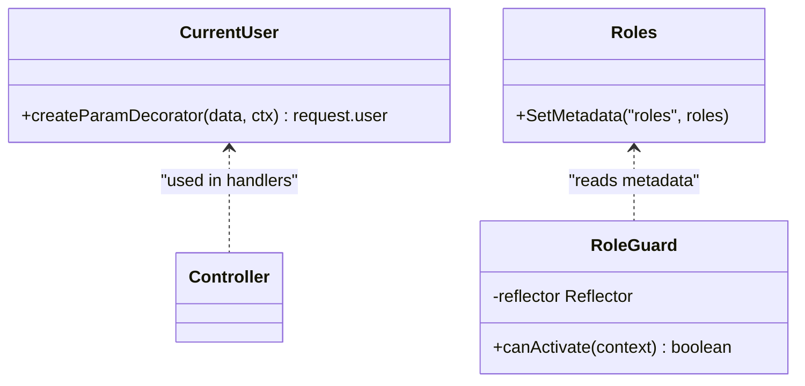

**Diagram sources**
- [current-user.decorator.ts](file://backend/src/auth/decorators/current-user.decorator.ts#L3-L8)
- [roles.decorator.ts](file://backend/src/auth/decorators/roles.decorator.ts#L3-L5)
- [role.guard.ts](file://backend/src/auth/guards/role.guard.ts#L10-L26)

**Section sources**
- [current-user.decorator.ts](file://backend/src/auth/decorators/current-user.decorator.ts#L1-L9)
- [roles.decorator.ts](file://backend/src/auth/decorators/roles.decorator.ts#L1-L5)
- [role.guard.ts](file://backend/src/auth/guards/role.guard.ts#L1-L51)

### Input Validation and Sanitization
- DTOs define validation constraints using class-validator decorators (e.g., IsEmail, IsString, MinLength, IsEnum).
- Global ValidationPipe enforces whitelist behavior and transforms inputs automatically.

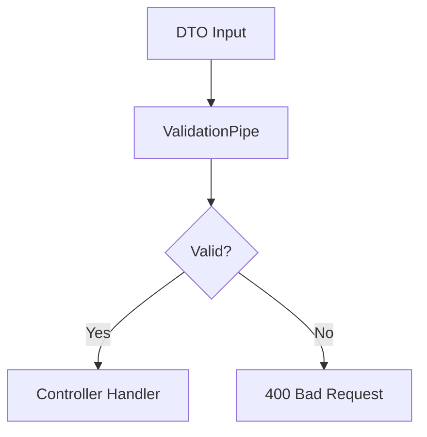

**Diagram sources**
- [auth.dto.ts](file://backend/src/auth/dto/auth.dto.ts#L4-L29)
- [main.ts](file://backend/src/main.ts#L34-L40)

**Section sources**
- [auth.dto.ts](file://backend/src/auth/dto/auth.dto.ts#L1-L58)
- [main.ts](file://backend/src/main.ts#L34-L40)

### SQL Injection Prevention and Data Access
- Mongoose ODM is used for database access. Queries are constructed using Mongoose models and operators, which help prevent raw SQL injection.
- Password hashing is performed using bcrypt, ensuring stored passwords are not reversible.

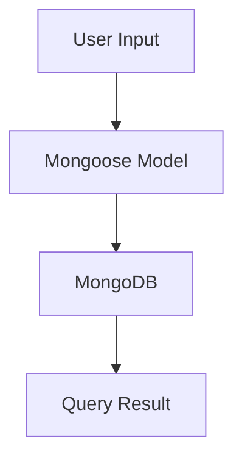

**Diagram sources**
- [auth.service.ts](file://backend/src/auth/auth.service.ts#L17-L30)
- [auth.service.ts](file://backend/src/auth/auth.service.ts#L38-L49)

**Section sources**
- [auth.service.ts](file://backend/src/auth/auth.service.ts#L1-L124)

### XSS Protection Measures
- No explicit XSS sanitization or content security policies are configured in the provided code.
- Recommendations include integrating a sanitization library and Helmet for CSP headers.

[No sources needed since this section provides general guidance]

### CORS Configuration
- CORS is enabled with allow-listed origins, credentials support, and specific methods and headers.
- During development, the implementation logs blocked origins but still allows them, which should be hardened for production.

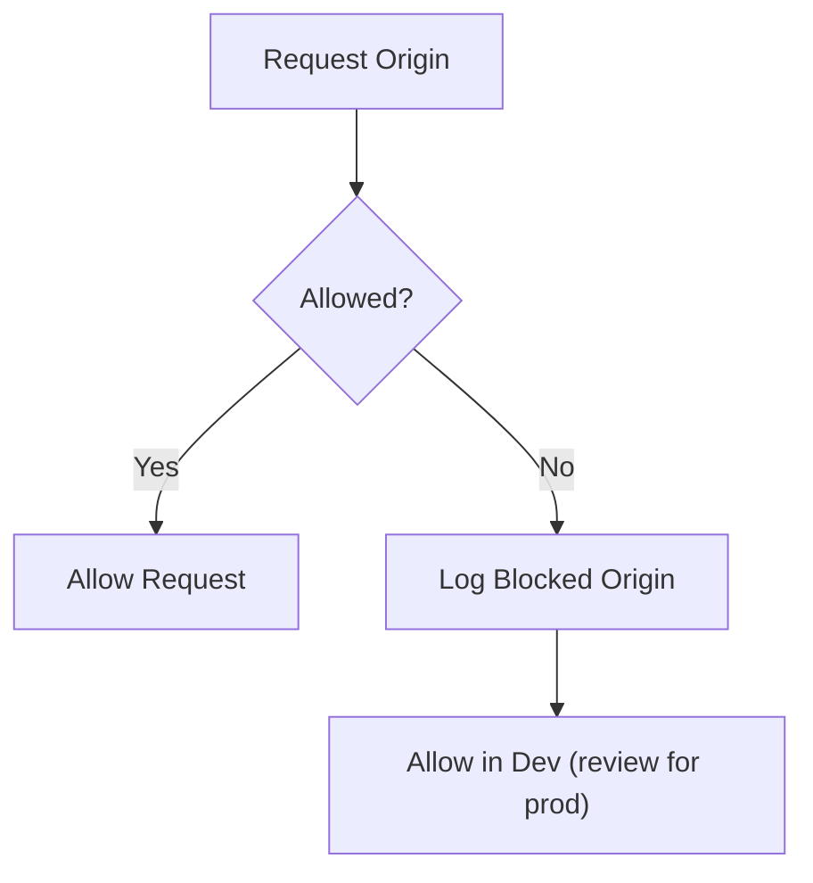

**Diagram sources**
- [main.ts](file://backend/src/main.ts#L9-L31)

**Section sources**
- [main.ts](file://backend/src/main.ts#L8-L31)

### Helmet Integration and Security Middleware Setup
- Helmet is not integrated in the provided code.
- Security middleware setup recommendations include adding Helmet, rate limiting, and CSRF protection.

[No sources needed since this section provides general guidance]

### Authentication Strategies
- JwtStrategy: Extracts JWT from Authorization header, verifies signature, and returns a reduced user payload.
- LocalStrategy: Authenticates users via email/password using AuthService.

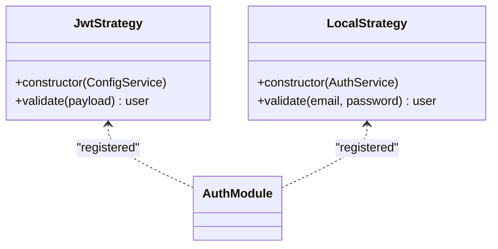

**Diagram sources**
- [jwt.strategy.ts](file://backend/src/auth/strategies/jwt.strategy.ts#L6-L24)
- [local.strategy.ts](file://backend/src/auth/strategies/local.strategy.ts#L6-L15)
- [auth.module.ts](file://backend/src/auth/auth.module.ts#L12-L28)

**Section sources**
- [jwt.strategy.ts](file://backend/src/auth/strategies/jwt.strategy.ts#L1-L25)
- [local.strategy.ts](file://backend/src/auth/strategies/local.strategy.ts#L1-L16)
- [auth.module.ts](file://backend/src/auth/auth.module.ts#L1-L30)

### Protected Controllers and Default Guards
- UsersController, RolesController, and PermissionsController are protected by JwtAuthGuard at the class level.
- This ensures all endpoints under these controllers require a valid JWT.

**Section sources**
- [users.controller.ts](file://backend/src/users/users.controller.ts#L8-L9)
- [roles.controller.ts](file://backend/src/roles/roles.controller.ts#L7-L8)
- [permissions.controller.ts](file://backend/src/permissions/permissions.controller.ts#L7-L8)

## Dependency Analysis
- AppModule imports AuthModule and feature modules, centralizing configuration and providers.
- AuthModule depends on PassportModule, JwtModule, and Mongoose for User schema.
- AuthController depends on AuthService, which in turn depends on Mongoose User model and JwtService.
- Guards depend on Reflector and request context to enforce access control.

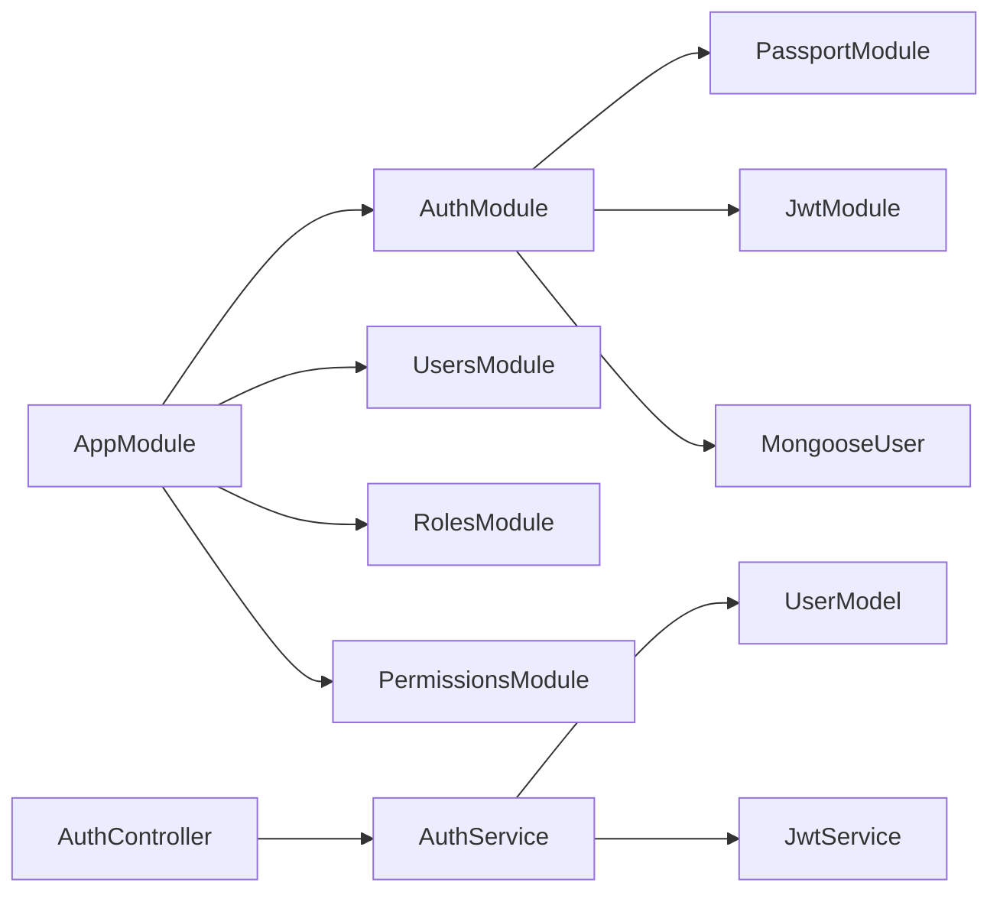

**Diagram sources**
- [app.module.ts](file://backend/src/app.module.ts#L17-L36)
- [auth.module.ts](file://backend/src/auth/auth.module.ts#L12-L28)
- [auth.controller.ts](file://backend/src/auth/auth.controller.ts#L15-L57)
- [auth.service.ts](file://backend/src/auth/auth.service.ts#L10-L15)

**Section sources**
- [app.module.ts](file://backend/src/app.module.ts#L1-L41)
- [auth.module.ts](file://backend/src/auth/auth.module.ts#L1-L30)
- [auth.controller.ts](file://backend/src/auth/auth.controller.ts#L1-L58)
- [auth.service.ts](file://backend/src/auth/auth.service.ts#L1-L124)

## Performance Considerations
- ValidationPipe with transform reduces manual parsing overhead and improves consistency.
- JWT verification occurs per request; caching validated payloads or using short-lived tokens can reduce CPU load.
- Consider connection pooling and indexing for frequent queries in protected controllers.

[No sources needed since this section provides general guidance]

## Troubleshooting Guide
Common issues and mitigations:
- Invalid credentials: Thrown as unauthorized during local validation.
- Non-existent user during registration: Prevented by existence check.
- Invalid/expired refresh tokens: Rejected with unauthorized error.
- Missing or invalid JWT: Guards block access; ensure Authorization header is set.
- CORS errors: Verify allowed origins and credentials configuration.

**Section sources**
- [auth.service.ts](file://backend/src/auth/auth.service.ts#L17-L30)
- [auth.service.ts](file://backend/src/auth/auth.service.ts#L96-L111)
- [main.ts](file://backend/src/main.ts#L8-L31)

## Conclusion
The backend implements a robust authentication and authorization framework using NestJS, Passport, and JWT. Global validation and CORS configuration provide strong request preprocessing and cross-origin controls. Controllers are protected by default JWT guards, and decorators streamline user identification and role enforcement. Areas for improvement include integrating Helmet for CSP, tightening CORS behavior for production, adding rate limiting and CSRF protection, and implementing explicit XSS sanitization.

[No sources needed since this section summarizes without analyzing specific files]

## Appendices

### Secure API Development Patterns and Defensive Programming Techniques
- Always use DTOs with class-validator decorators to enforce input constraints.
- Leverage the Global ValidationPipe to reject invalid payloads early.
- Store only hashed passwords using bcrypt and avoid logging sensitive data.
- Use environment variables for secrets (JWT keys, database URIs).
- Implement least privilege: restrict roles and permissions explicitly.
- Add centralized error handling and avoid exposing stack traces in production.
- Regularly rotate secrets and invalidate refresh tokens on logout.

**Section sources**
- [auth.dto.ts](file://backend/src/auth/dto/auth.dto.ts#L1-L58)
- [auth.service.ts](file://backend/src/auth/auth.service.ts#L17-L30)
- [auth.service.ts](file://backend/src/auth/auth.service.ts#L113-L115)
- [.env.example](file://backend/.env.example#L11-L16)