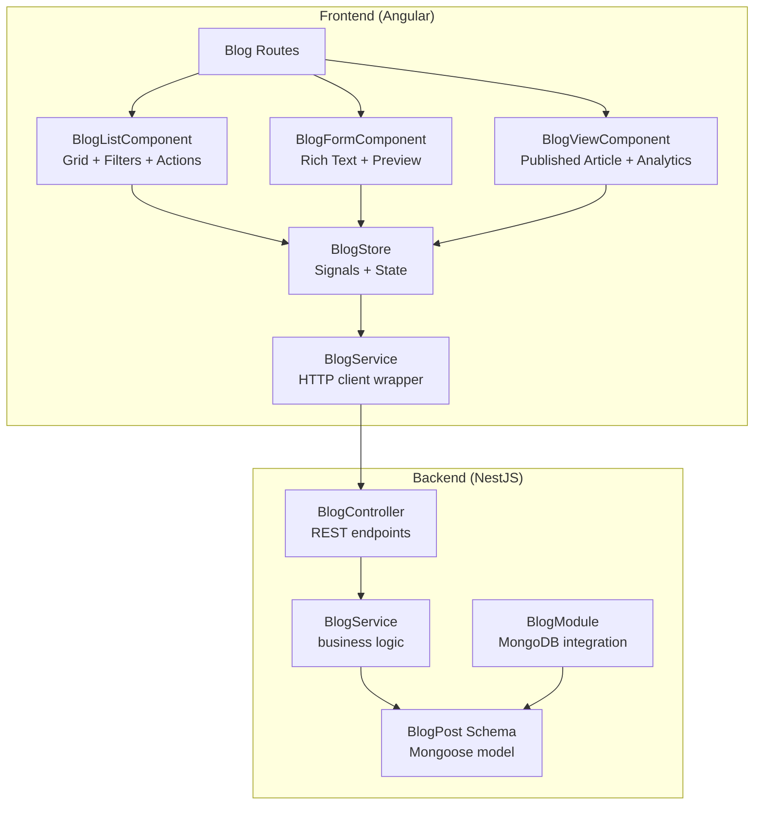
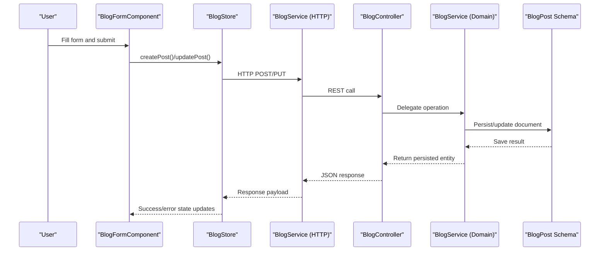
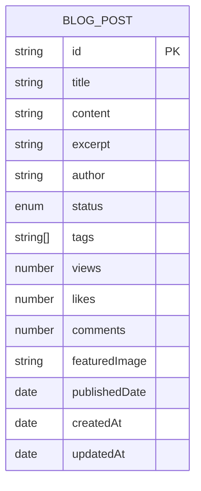
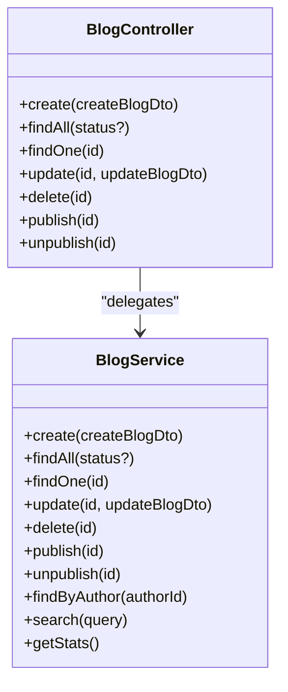
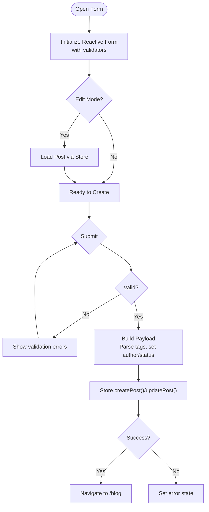
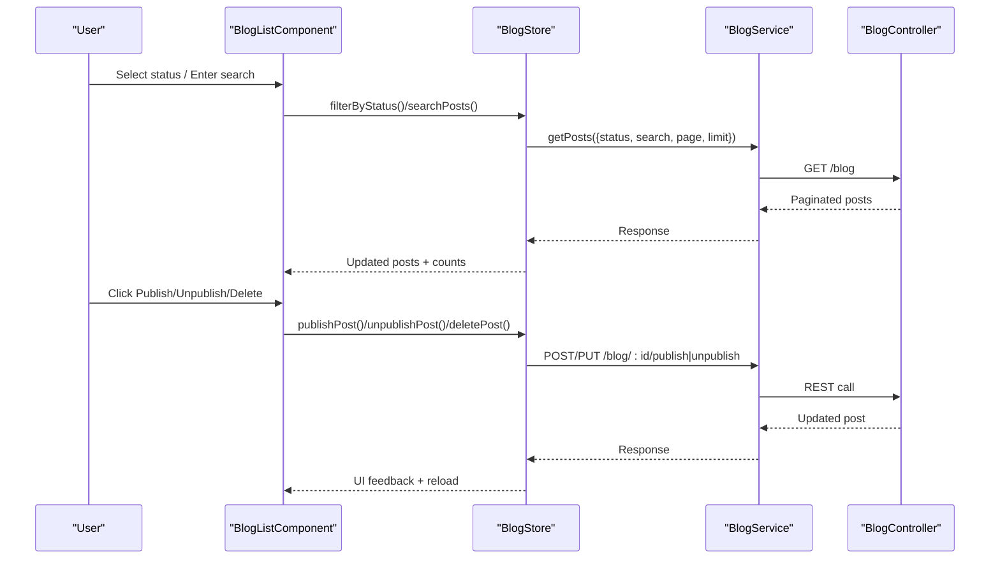
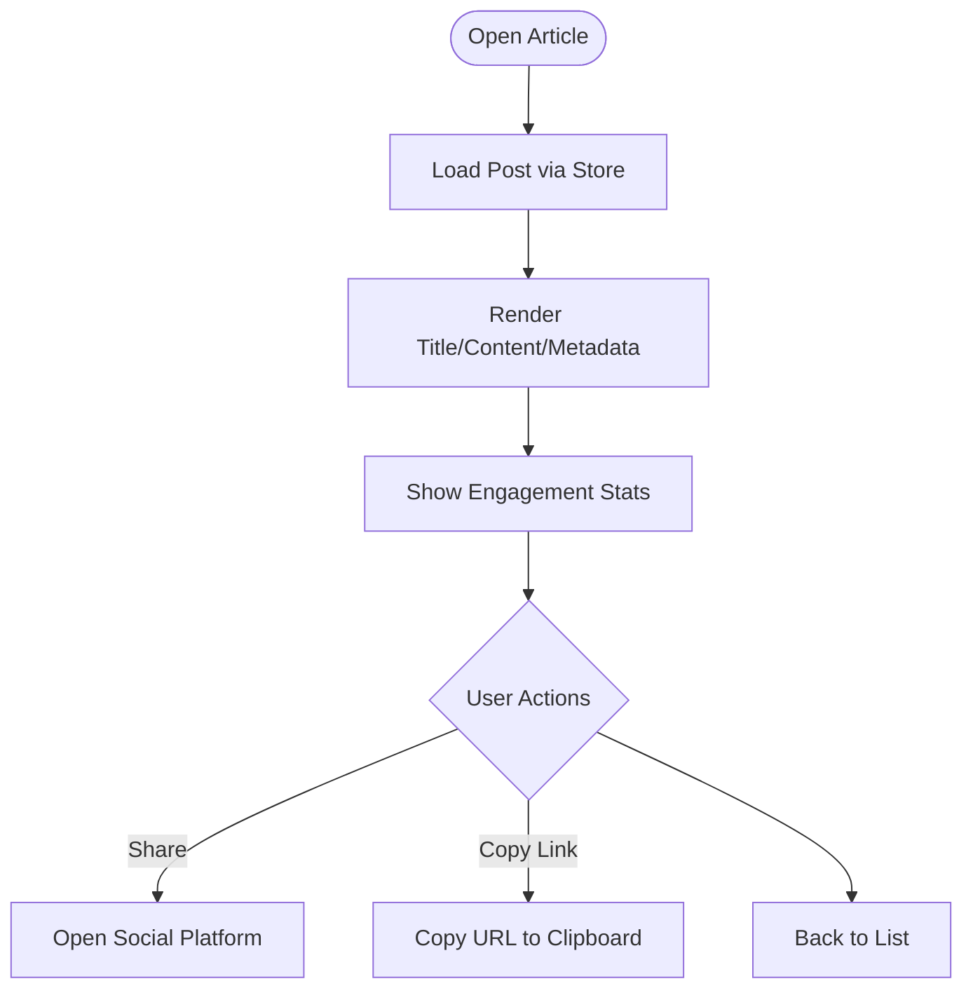
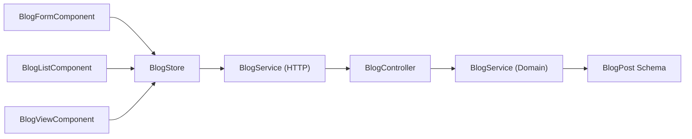

# Blog Management System

<cite>
**Referenced Files in This Document**
- [blog.controller.ts](file://backend/src/blog/blog.controller.ts)
- [blog.service.ts](file://backend/src/blog/blog.service.ts)
- [blog-post.schema.ts](file://backend/src/blog/schemas/blog-post.schema.ts)
- [blog-post.dto.ts](file://backend/src/blog/dto/blog-post.dto.ts)
- [blog.module.ts](file://backend/src/blog/blog.module.ts)
- [blog.service.ts](file://backend/src/modules/blog/blog.service.ts)
- [blog.controller.ts](file://backend/src/modules/blog/blog.controller.ts)
- [blog.dto.ts](file://backend/src/modules/blog/blog.dto.ts)
- [blog-form.component.ts](file://frontend/src/app/features/blog/blog-form/blog-form.component.ts)
- [blog-form.component.html](file://frontend/src/app/features/blog/blog-form/blog-form.component.html)
- [blog-list.component.ts](file://frontend/src/app/features/blog/blog-list/blog-list.component.ts)
- [blog-list.component.html](file://frontend/src/app/features/blog/blog-list/blog-list.component.html)
- [blog-view.component.ts](file://frontend/src/app/features/blog/blog-view/blog-view.component.ts)
- [blog-view.component.html](file://frontend/src/app/features/blog/blog-view/blog-view.component.html)
- [blog.service.ts](file://frontend/src/app/core/services/blog.service.ts)
- [blog.store.ts](file://frontend/src/app/core/store/blog.store.ts)
- [blog.routes.ts](file://frontend/src/app/features/blog/blog.routes.ts)
</cite>

## Table of Contents
1. [Introduction](#introduction)
2. [Project Structure](#project-structure)
3. [Core Components](#core-components)
4. [Architecture Overview](#architecture-overview)
5. [Detailed Component Analysis](#detailed-component-analysis)
6. [Dependency Analysis](#dependency-analysis)
7. [Performance Considerations](#performance-considerations)
8. [Troubleshooting Guide](#troubleshooting-guide)
9. [Conclusion](#conclusion)

## Introduction
This document provides comprehensive documentation for the Blog Management System, covering the complete article lifecycle from creation to publication and beyond. It explains the backend API design, database schema, frontend components, and the integrated workflow for managing blog posts with rich text editing, preview capabilities, SEO-friendly metadata, scheduling, and analytics. The system supports draft creation, editing, review processes, and publication scheduling, while offering robust list views with filtering, author assignment, publication dates, and approval workflows.

## Project Structure
The system follows a modular NestJS backend with Angular frontend, organized by features and domain-driven design. The backend exposes REST endpoints for blog management, while the frontend implements three primary views: form-based creation/editing, list/grid with filters and actions, and a detailed view with engagement metrics and sharing.

**Diagram sources**
- [blog.controller.ts](file://backend/src/blog/blog.controller.ts#L1-L62)
- [blog.service.ts](file://backend/src/blog/blog.service.ts#L1-L78)
- [blog-post.schema.ts](file://backend/src/blog/schemas/blog-post.schema.ts#L1-L46)
- [blog.module.ts](file://backend/src/blog/blog.module.ts#L1-L14)
- [blog-list.component.ts](file://frontend/src/app/features/blog/blog-list/blog-list.component.ts#L1-L333)
- [blog-form.component.ts](file://frontend/src/app/features/blog/blog-form/blog-form.component.ts#L1-L164)
- [blog-view.component.ts](file://frontend/src/app/features/blog/blog-view/blog-view.component.ts#L1-L143)
- [blog.store.ts](file://frontend/src/app/core/store/blog.store.ts#L1-L332)
- [blog.service.ts](file://frontend/src/app/core/services/blog.service.ts#L1-L145)
- [blog.routes.ts](file://frontend/src/app/features/blog/blog.routes.ts#L1-L21)

**Section sources**
- [blog.controller.ts](file://backend/src/blog/blog.controller.ts#L1-L62)
- [blog.service.ts](file://backend/src/blog/blog.service.ts#L1-L78)
- [blog-post.schema.ts](file://backend/src/blog/schemas/blog-post.schema.ts#L1-L46)
- [blog.module.ts](file://backend/src/blog/blog.module.ts#L1-L14)
- [blog-list.component.ts](file://frontend/src/app/features/blog/blog-list/blog-list.component.ts#L1-L333)
- [blog-form.component.ts](file://frontend/src/app/features/blog/blog-form/blog-form.component.ts#L1-L164)
- [blog-view.component.ts](file://frontend/src/app/features/blog/blog-view/blog-view.component.ts#L1-L143)
- [blog.store.ts](file://frontend/src/app/core/store/blog.store.ts#L1-L332)
- [blog.service.ts](file://frontend/src/app/core/services/blog.service.ts#L1-L145)
- [blog.routes.ts](file://frontend/src/app/features/blog/blog.routes.ts#L1-L21)

## Core Components
- Backend Blog Module: Provides CRUD operations, search, stats, and publish/unpublish endpoints backed by MongoDB via Mongoose.
- Frontend Blog Store: Centralized state management using NgRx Signals for posts, current post, filters, pagination, and UI flags.
- Frontend Services: HTTP client wrapper for blog operations, typed requests/responses, and analytics.
- Frontend Components: Form for rich text editing and preview, list/grid with filters and actions, and a view component for published articles with engagement metrics.

Key responsibilities:
- Validation and sanitization on the backend using DTOs and enums.
- Rich text editing and tag parsing on the frontend form.
- Filtering by status, search, pagination, and confirmation modals for destructive actions.
- Engagement analytics and sharing capabilities in the view component.

**Section sources**
- [blog-post.dto.ts](file://backend/src/blog/dto/blog-post.dto.ts#L1-L52)
- [blog-post.schema.ts](file://backend/src/blog/schemas/blog-post.schema.ts#L1-L46)
- [blog-store.ts](file://frontend/src/app/core/store/blog.store.ts#L1-L332)
- [blog.service.ts](file://frontend/src/app/core/services/blog.service.ts#L1-L145)

## Architecture Overview
The system uses a layered architecture:
- Presentation Layer: Angular components and routes.
- State Management: NgRx Signals-based store encapsulating data fetching, filtering, pagination, and UI states.
- Service Layer: Angular HTTP service wrapping REST calls to the backend.
- Domain Layer: NestJS controllers and services implementing business logic.
- Data Access: Mongoose models and schemas for MongoDB persistence.

**Diagram sources**
- [blog-form.component.ts](file://frontend/src/app/features/blog/blog-form/blog-form.component.ts#L92-L129)
- [blog.store.ts](file://frontend/src/app/core/store/blog.store.ts#L119-L159)
- [blog.service.ts](file://frontend/src/app/core/services/blog.service.ts#L91-L107)
- [blog.controller.ts](file://backend/src/blog/blog.controller.ts#L12-L45)
- [blog.service.ts](file://backend/src/blog/blog.service.ts#L11-L34)
- [blog-post.schema.ts](file://backend/src/blog/schemas/blog-post.schema.ts#L9-L46)

## Detailed Component Analysis

### Backend: Blog Post Schema and DTOs
The backend defines a comprehensive schema for blog posts with fields for title, content, excerpt, author, tags, status, views, likes, comments, featured image, and timestamps. Status is an enum with draft and published states. DTOs enforce validation for create and update operations.

**Diagram sources**
- [blog-post.schema.ts](file://backend/src/blog/schemas/blog-post.schema.ts#L9-L46)

**Section sources**
- [blog-post.schema.ts](file://backend/src/blog/schemas/blog-post.schema.ts#L1-L46)
- [blog-post.dto.ts](file://backend/src/blog/dto/blog-post.dto.ts#L1-L52)

### Backend: Controllers and Services
Controllers expose endpoints for creating, retrieving, updating, deleting, publishing, and unpublishing blog posts. Services handle business logic, including status transitions, search, and statistics.

**Diagram sources**
- [blog.controller.ts](file://backend/src/blog/blog.controller.ts#L7-L61)
- [blog.service.ts](file://backend/src/blog/blog.service.ts#L8-L77)

**Section sources**
- [blog.controller.ts](file://backend/src/blog/blog.controller.ts#L1-L62)
- [blog.service.ts](file://backend/src/blog/blog.service.ts#L1-L78)

### Frontend: Form Component (Rich Text Editor, Preview, SEO Tools)
The form component provides:
- Rich text editing via textarea controls.
- Tag parsing from comma-separated input.
- Status selection (draft/published).
- Real-time validation feedback.
- Submission routing through the store to avoid direct API calls.

**Diagram sources**
- [blog-form.component.ts](file://frontend/src/app/features/blog/blog-form/blog-form.component.ts#L36-L129)
- [blog-form.component.html](file://frontend/src/app/features/blog/blog-form/blog-form.component.html#L10-L68)

**Section sources**
- [blog-form.component.ts](file://frontend/src/app/features/blog/blog-form/blog-form.component.ts#L1-L164)
- [blog-form.component.html](file://frontend/src/app/features/blog/blog-form/blog-form.component.html#L1-L70)

### Frontend: List Component (Filters, Author Assignments, Approval Workflows)
The list component offers:
- Status filters (all/draft/published).
- Search by title/content/tags.
- Pagination with page navigation.
- Bulk actions: publish/unpublish/delete with confirmation modals.
- Relative time formatting and engagement badges.

**Diagram sources**
- [blog-list.component.ts](file://frontend/src/app/features/blog/blog-list/blog-list.component.ts#L205-L226)
- [blog.store.ts](file://frontend/src/app/core/store/blog.store.ts#L254-L278)
- [blog.service.ts](file://frontend/src/app/core/services/blog.service.ts#L68-L79)
- [blog.controller.ts](file://backend/src/blog/blog.controller.ts#L17-L30)

**Section sources**
- [blog-list.component.ts](file://frontend/src/app/features/blog/blog-list/blog-list.component.ts#L1-L333)
- [blog-list.component.html](file://frontend/src/app/features/blog/blog-list/blog-list.component.html#L1-L330)
- [blog.store.ts](file://frontend/src/app/core/store/blog.store.ts#L1-L332)
- [blog.service.ts](file://frontend/src/app/core/services/blog.service.ts#L1-L145)

### Frontend: View Component (Published Articles, Comments, Analytics)
The view component displays:
- Published article content with metadata and tags.
- Engagement statistics (views, likes, comments).
- Social sharing and link copying.
- Relative time formatting for publication and updates.

**Diagram sources**
- [blog-view.component.ts](file://frontend/src/app/features/blog/blog-view/blog-view.component.ts#L24-L111)
- [blog-view.component.html](file://frontend/src/app/features/blog/blog-view/blog-view.component.html#L9-L65)

**Section sources**
- [blog-view.component.ts](file://frontend/src/app/features/blog/blog-view/blog-view.component.ts#L1-L143)
- [blog-view.component.html](file://frontend/src/app/features/blog/blog-view/blog-view.component.html#L1-L66)

### Service Layer: Content Processing, Image Handling, Publication Automation
- Content processing: The backend validates and persists blog posts with rich text content and metadata.
- Image handling: Featured images are stored as optional URLs in the schema; the form allows setting an image URL.
- Publication automation: Publish/unpublish endpoints update status and timestamps, enabling scheduled publishing workflows at the application level.

Note: The current backend implementation focuses on basic CRUD and status transitions. Advanced features like automated scheduling and external image processing would require extending the service layer and integrating with scheduling libraries and cloud storage APIs.

**Section sources**
- [blog-post.schema.ts](file://backend/src/blog/schemas/blog-post.schema.ts#L20-L42)
- [blog-form.component.ts](file://frontend/src/app/features/blog/blog-form/blog-form.component.ts#L97-L121)
- [blog.service.ts](file://backend/src/blog/blog.service.ts#L40-L54)

## Dependency Analysis
The frontend components depend on the store for state and on the HTTP service for API communication. The store depends on the backend controllers and services. The backend controllers depend on services, which persist data using Mongoose models.

**Diagram sources**
- [blog-form.component.ts](file://frontend/src/app/features/blog/blog-form/blog-form.component.ts#L15-L21)
- [blog-list.component.ts](file://frontend/src/app/features/blog/blog-list/blog-list.component.ts#L16-L18)
- [blog-view.component.ts](file://frontend/src/app/features/blog/blog-view/blog-view.component.ts#L15-L18)
- [blog.store.ts](file://frontend/src/app/core/store/blog.store.ts#L1-L10)
- [blog.service.ts](file://frontend/src/app/core/services/blog.service.ts#L60-L63)
- [blog.controller.ts](file://backend/src/blog/blog.controller.ts#L7-L10)
- [blog.service.ts](file://backend/src/blog/blog.service.ts#L8-L9)
- [blog-post.schema.ts](file://backend/src/blog/schemas/blog-post.schema.ts#L9-L46)

**Section sources**
- [blog.routes.ts](file://frontend/src/app/features/blog/blog.routes.ts#L1-L21)
- [blog.store.ts](file://frontend/src/app/core/store/blog.store.ts#L1-L332)
- [blog.service.ts](file://frontend/src/app/core/services/blog.service.ts#L1-L145)
- [blog.controller.ts](file://backend/src/blog/blog.controller.ts#L1-L62)
- [blog.service.ts](file://backend/src/blog/blog.service.ts#L1-L78)
- [blog-post.schema.ts](file://backend/src/blog/schemas/blog-post.schema.ts#L1-L46)

## Performance Considerations
- Pagination: The store and service support pagination parameters to reduce payload sizes.
- Lazy loading: Routes use lazy-loaded components to minimize initial bundle size.
- Optimistic UI: The store sets temporary UI flags (publishing/deleting) to improve perceived responsiveness.
- Efficient queries: Backend uses indexed fields for status and text search to optimize filtering and search performance.

## Troubleshooting Guide
Common issues and resolutions:
- Validation errors in forms: Ensure required fields are filled and formatted correctly (e.g., minimum length for title/content).
- Publish/unpublish failures: Verify user permissions and network connectivity; check error messages from the store.
- Empty lists: Confirm filters are cleared or adjusted; ensure posts exist with the selected status.
- Search not returning results: Verify the search query matches title, content, or tags; note that search is restricted to published posts.

**Section sources**
- [blog-form.component.ts](file://frontend/src/app/features/blog/blog-form/blog-form.component.ts#L148-L151)
- [blog.store.ts](file://frontend/src/app/core/store/blog.store.ts#L78-L84)
- [blog-list.component.ts](file://frontend/src/app/features/blog/blog-list/blog-list.component.ts#L29-L49)

## Conclusion
The Blog Management System provides a robust foundation for managing articles with clear separation between presentation, state, and domain layers. It supports essential workflows—draft creation, editing, review, and publication—while offering filtering, search, and engagement insights. Extending the system with advanced scheduling, rich text editor integration, and image processing would further enhance editorial productivity and content quality.