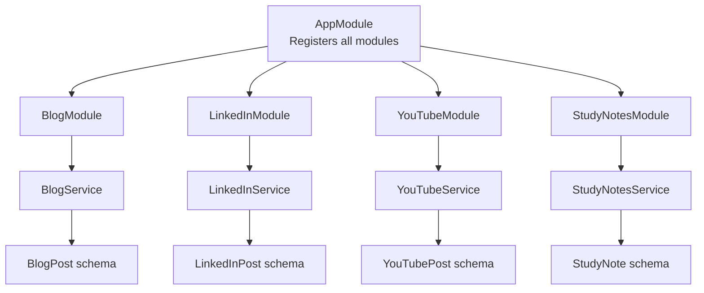
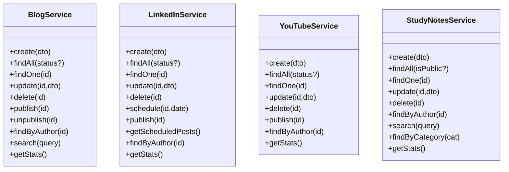
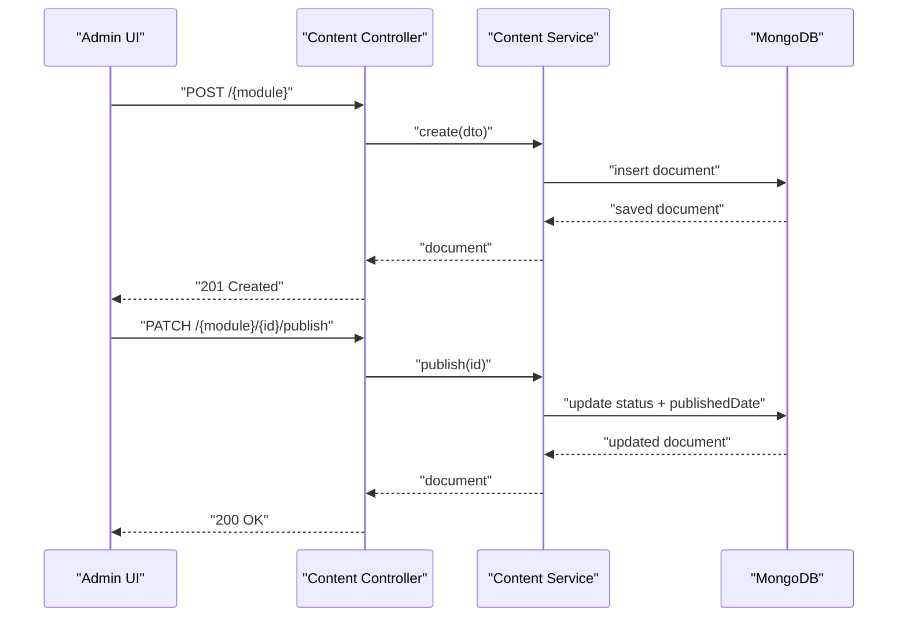
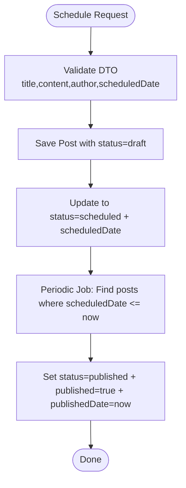
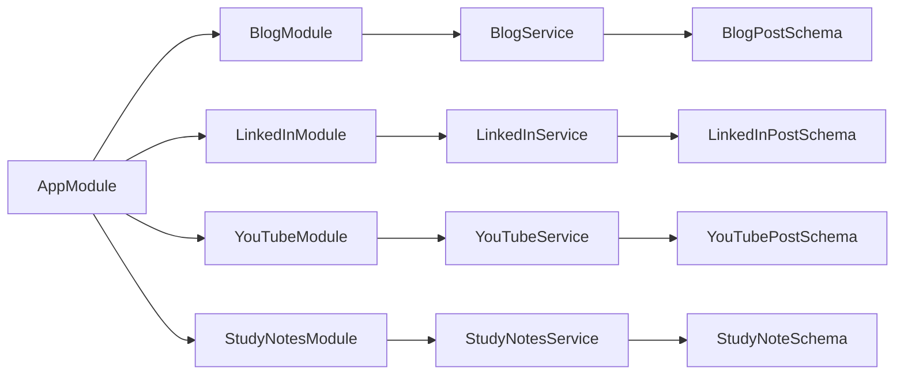

# Content Management Modules

<cite>
**Referenced Files in This Document**
- [app.module.ts](file://backend/src/app.module.ts)
- [main.ts](file://backend/src/main.ts)
- [blog.module.ts](file://backend/src/blog/blog.module.ts)
- [blog.service.ts](file://backend/src/blog/blog.service.ts)
- [blog-post.schema.ts](file://backend/src/blog/schemas/blog-post.schema.ts)
- [blog-post.dto.ts](file://backend/src/blog/dto/blog-post.dto.ts)
- [linkedin.module.ts](file://backend/src/linkedin/linkedin.module.ts)
- [linkedin.service.ts](file://backend/src/linkedin/linkedin.service.ts)
- [linkedin-post.schema.ts](file://backend/src/linkedin/schemas/linkedin-post.schema.ts)
- [linkedin-post.dto.ts](file://backend/src/linkedin/dto/linkedin-post.dto.ts)
- [youtube.module.ts](file://backend/src/youtube/youtube.module.ts)
- [youtube.service.ts](file://backend/src/youtube/youtube.service.ts)
- [youtube-post.schema.ts](file://backend/src/youtube/schemas/youtube-post.schema.ts)
- [youtube-post.dto.ts](file://backend/src/youtube/dto/youtube-post.dto.ts)
- [study-notes.module.ts](file://backend/src/study-notes/study-notes.module.ts)
- [study-notes.service.ts](file://backend/src/study-notes/study-notes.service.ts)
- [study-note.schema.ts](file://backend/src/study-notes/schemas/study-note.schema.ts)
- [study-note.dto.ts](file://backend/src/study-notes/dto/study-note.dto.ts)
</cite>

## Table of Contents
1. [Introduction](#introduction)
2. [Project Structure](#project-structure)
3. [Core Components](#core-components)
4. [Architecture Overview](#architecture-overview)
5. [Detailed Component Analysis](#detailed-component-analysis)
6. [Dependency Analysis](#dependency-analysis)
7. [Performance Considerations](#performance-considerations)
8. [Troubleshooting Guide](#troubleshooting-guide)
9. [Conclusion](#conclusion)

## Introduction
This document provides comprehensive content management documentation for the Multi-Application-Control-Dashboard’s four content modules: Study Notes, YouTube Content, LinkedIn Posts, and Blog Management. It explains CRUD operations, content organization, publishing workflows, analytics integration, shared architecture patterns, common DTOs and schemas, and service implementations. It also covers content validation, media handling, scheduling capabilities, and engagement tracking, with practical examples for creating, editing, publishing, and monitoring content across all platforms.

## Project Structure
The backend is a NestJS application bootstrapped with a global validation pipe and CORS configuration. The AppModule aggregates all feature modules, including content modules (Blog, LinkedIn, YouTube, Study Notes), analytics, audit logs, and dashboard stats. Each content module follows a consistent pattern: a module file registers Mongoose models, a controller exposes REST endpoints, and a service encapsulates data access and business logic.

**Diagram sources**
- [app.module.ts](file://backend/src/app.module.ts#L17-L36)
- [blog.module.ts](file://backend/src/blog/blog.module.ts#L7-L12)
- [linkedin.module.ts](file://backend/src/linkedin/linkedin.module.ts#L7-L12)
- [youtube.module.ts](file://backend/src/youtube/youtube.module.ts#L7-L12)
- [study-notes.module.ts](file://backend/src/study-notes/study-notes.module.ts#L7-L12)

**Section sources**
- [app.module.ts](file://backend/src/app.module.ts#L1-L41)
- [main.ts](file://backend/src/main.ts#L1-L54)

## Core Components
- Shared validation pipeline: A global ValidationPipe enforces DTO constraints across all endpoints.
- Global CORS: Permissive CORS configuration supports development and multiple origins.
- Module registration: Each content module registers its Mongoose model and exports its service for cross-module use.
- Services: Each service exposes CRUD, filtering, search, stats, and platform-specific operations (publish, schedule).

Key shared patterns:
- DTOs define request shapes and validation rules.
- Schemas define MongoDB documents and indexes.
- Services handle population of author references and implement search and statistics.

**Section sources**
- [main.ts](file://backend/src/main.ts#L33-L40)
- [blog.module.ts](file://backend/src/blog/blog.module.ts#L7-L12)
- [linkedin.module.ts](file://backend/src/linkedin/linkedin.module.ts#L7-L12)
- [youtube.module.ts](file://backend/src/youtube/youtube.module.ts#L7-L12)
- [study-notes.module.ts](file://backend/src/study-notes/study-notes.module.ts#L7-L12)

## Architecture Overview
Each content module follows a layered architecture:
- Controller: Exposes HTTP endpoints for CRUD and workflow actions.
- Service: Implements business logic, queries, and updates.
- Schema: Defines document structure and indexes.
- DTO: Validates and transforms incoming requests.

**Diagram sources**
- [blog.service.ts](file://backend/src/blog/blog.service.ts#L8-L77)
- [linkedin.service.ts](file://backend/src/linkedin/linkedin.service.ts#L9-L89)
- [youtube.service.ts](file://backend/src/youtube/youtube.service.ts#L9-L72)
- [study-notes.service.ts](file://backend/src/study-notes/study-notes.service.ts#L9-L79)

## Detailed Component Analysis

### Study Notes Module
Purpose: Private and public study notes with categorization, tagging, and priority.

Data model highlights:
- Fields include title, content, author, category, tags, visibility flag, views, subject, and priority.
- Indexes optimize author and public visibility queries.

DTOs:
- CreateStudyNoteDto and UpdateStudyNoteDto enforce field constraints and optional updates.

Services:
- CRUD operations with author filtering.
- Public search across title, content, tags, and subject.
- Category-based retrieval for public notes.
- Statistics on total, public, and private notes.

Validation and media:
- Validation via class-validator DTOs.
- No dedicated media URL field; content stored as text.

Scheduling and analytics:
- Not applicable.

Practical workflow:
- Create: Submit title, content, author, optional category/tags/public flag.
- Edit: Update fields via UpdateStudyNoteDto.
- Publish: Toggle isPublic flag; public notes visible via findAll with isPublic filter.
- Monitor: Retrieve stats and per-note views.

**Section sources**
- [study-note.schema.ts](file://backend/src/study-notes/schemas/study-note.schema.ts#L4-L35)
- [study-note.dto.ts](file://backend/src/study-notes/dto/study-note.dto.ts#L3-L63)
- [study-notes.service.ts](file://backend/src/study-notes/study-notes.service.ts#L9-L79)

### YouTube Content Module
Purpose: Manage YouTube posts with video identifiers, thumbnails, and engagement metrics.

Data model highlights:
- Fields include title, description, videoId, author, status, thumbnail, views, likes, published date.
- Status supports draft/published.

DTOs:
- CreateYouTubePostDto and UpdateYouTubePostDto define required and optional fields.

Services:
- CRUD operations with author population.
- Publish action sets status and published date.
- Statistics include totals, published, draft, and aggregated views.

Validation and media:
- Validation via DTOs.
- Thumbnail URL supported.

Scheduling and analytics:
- Not applicable.

Practical workflow:
- Create: Provide title, description, videoId, author.
- Edit: Update title/description/thumbnail/status.
- Publish: Call publish endpoint to set status and date.
- Monitor: Fetch stats and increment views on read.

**Section sources**
- [youtube-post.schema.ts](file://backend/src/youtube/schemas/youtube-post.schema.ts#L6-L37)
- [youtube-post.dto.ts](file://backend/src/youtube/dto/youtube-post.dto.ts#L3-L38)
- [youtube.service.ts](file://backend/src/youtube/youtube.service.ts#L9-L72)

### LinkedIn Posts Module
Purpose: Manage LinkedIn posts with scheduling, hashtags, images, and engagement analytics.

Data model highlights:
- Fields include title, content, status (draft/scheduled/published/archived), author, scheduled date, likes/comments/shares/views, image URL, published flag/date, hashtags, analytics object, metadata, and audit fields.
- Indexes on status and scheduled date.

DTOs:
- CreateLinkedInPostDto and UpdateLinkedInPostDto define fields and optional scheduling.

Services:
- CRUD operations with author population.
- Schedule action transitions to scheduled state with a target date.
- Publish action transitions to published and marks published flag/date.
- Scheduled post retrieval for automated publishing.
- Statistics include totals across statuses.

Validation and media:
- Validation via DTOs.
- Image URL and hashtag support.

Analytics:
- Embedded analytics object tracks impressions, clicks, engagement rate, and reach.

Practical workflow:
- Create: Provide title, content, author, optional image/hashtags.
- Edit: Update content, image, hashtags, status, and scheduled date.
- Schedule: Set status to scheduled with scheduledDate.
- Publish: Transition to published; LinkedIn integration would set published date.
- Monitor: Use stats and analytics fields to track performance.

**Section sources**
- [linkedin-post.schema.ts](file://backend/src/linkedin/schemas/linkedin-post.schema.ts#L13-L84)
- [linkedin-post.dto.ts](file://backend/src/linkedin/dto/linkedin-post.dto.ts#L4-L52)
- [linkedin.service.ts](file://backend/src/linkedin/linkedin.service.ts#L9-L89)

### Blog Management Module
Purpose: Manage blog posts with excerpts, tags, featured images, and publication lifecycle.

Data model highlights:
- Fields include title, content, excerpt, author, status (draft/published), tags, views/likes/comments, featured image, published date.
- Enumerated status values.

DTOs:
- CreateBlogPostDto and UpdateBlogPostDto define required and optional fields, including status updates.

Services:
- CRUD operations with author population.
- Publish/unpublish actions set status and published date.
- Search across title, content, and tags for published posts.
- Statistics on total, published, and draft posts.

Validation and media:
- Validation via DTOs.
- Featured image URL supported.

Scheduling and analytics:
- Not applicable.

Practical workflow:
- Create: Provide title, content, author, optional excerpt/tags/featured image.
- Edit: Update title/content/excerpt/tags/featured image/status.
- Publish: Transition to published and set published date.
- Monitor: Retrieve stats and increment views on read.

**Section sources**
- [blog-post.schema.ts](file://backend/src/blog/schemas/blog-post.schema.ts#L9-L46)
- [blog-post.dto.ts](file://backend/src/blog/dto/blog-post.dto.ts#L4-L52)
- [blog.service.ts](file://backend/src/blog/blog.service.ts#L8-L77)

### Publishing Workflows (Cross-Module)

**Diagram sources**
- [blog.service.ts](file://backend/src/blog/blog.service.ts#L40-L54)
- [youtube.service.ts](file://backend/src/youtube/youtube.service.ts#L51-L59)
- [linkedin.service.ts](file://backend/src/linkedin/linkedin.service.ts#L59-L67)

### Scheduling Workflow (LinkedIn)

**Diagram sources**
- [linkedin.service.ts](file://backend/src/linkedin/linkedin.service.ts#L49-L76)
- [linkedin-post.schema.ts](file://backend/src/linkedin/schemas/linkedin-post.schema.ts#L21-L28)

## Dependency Analysis
- AppModule aggregates all modules, ensuring centralized registration and database connection.
- Each module registers its Mongoose model via MongooseModule.forFeature and exports its service.
- Controllers depend on services; services depend on Mongoose models and DTOs.
- Cross-module dependencies are minimized; services are exported for reuse.

**Diagram sources**
- [app.module.ts](file://backend/src/app.module.ts#L17-L36)
- [blog.module.ts](file://backend/src/blog/blog.module.ts#L7-L12)
- [linkedin.module.ts](file://backend/src/linkedin/linkedin.module.ts#L7-L12)
- [youtube.module.ts](file://backend/src/youtube/youtube.module.ts#L7-L12)
- [study-notes.module.ts](file://backend/src/study-notes/study-notes.module.ts#L7-L12)

**Section sources**
- [app.module.ts](file://backend/src/app.module.ts#L17-L36)

## Performance Considerations
- Indexes: LinkedInPost schema defines indexes on status and scheduledDate to accelerate filtering and scheduled post retrieval.
- Aggregation: YouTubeService aggregates total views for stats; consider caching for high-frequency reads.
- Population: Services populate author fields; limit projections if only IDs are needed to reduce payload size.
- Pagination: For large lists, introduce pagination parameters in controllers/services.
- Validation overhead: Global ValidationPipe adds minimal overhead but ensures robustness.

**Section sources**
- [linkedin-post.schema.ts](file://backend/src/linkedin/schemas/linkedin-post.schema.ts#L82-L84)
- [youtube.service.ts](file://backend/src/youtube/youtube.service.ts#L65-L71)

## Troubleshooting Guide
Common issues and resolutions:
- Validation errors: DTO validation failures return 400 responses; review field types and presence in Create/Update DTOs.
- CORS issues: Verify allowed origins and credentials in bootstrap configuration.
- Authentication/authorization: Ensure guards and decorators are applied to protected endpoints.
- Missing author population: Confirm author ObjectId references exist and populate logic is invoked in services.
- Scheduling not triggering: Verify scheduledDate timezone and periodic job execution to move posts from scheduled to published.

Operational checks:
- Logs indicate server startup, environment, and database connection details.
- Use stats endpoints to confirm counts and status distributions.

**Section sources**
- [main.ts](file://backend/src/main.ts#L9-L31)
- [main.ts](file://backend/src/main.ts#L46-L50)

## Conclusion
The Multi-Application-Control-Dashboard implements a consistent, scalable architecture for managing Study Notes, YouTube Content, LinkedIn Posts, and Blog content. Shared patterns—DTO-driven validation, Mongoose schemas, and service-layer CRUD with workflow extensions—enable uniform maintenance across modules. Publishing and scheduling workflows are cleanly separated, while analytics and engagement metrics are embedded where relevant. The documented APIs and flows provide a clear blueprint for extending or integrating additional platforms.