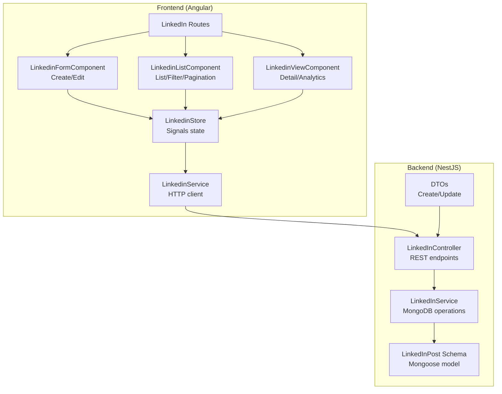
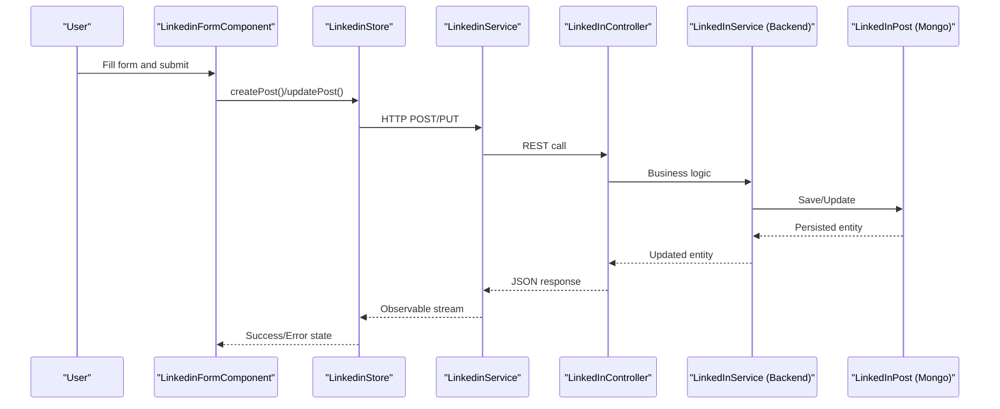
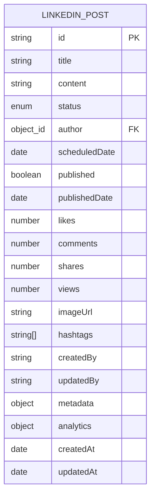
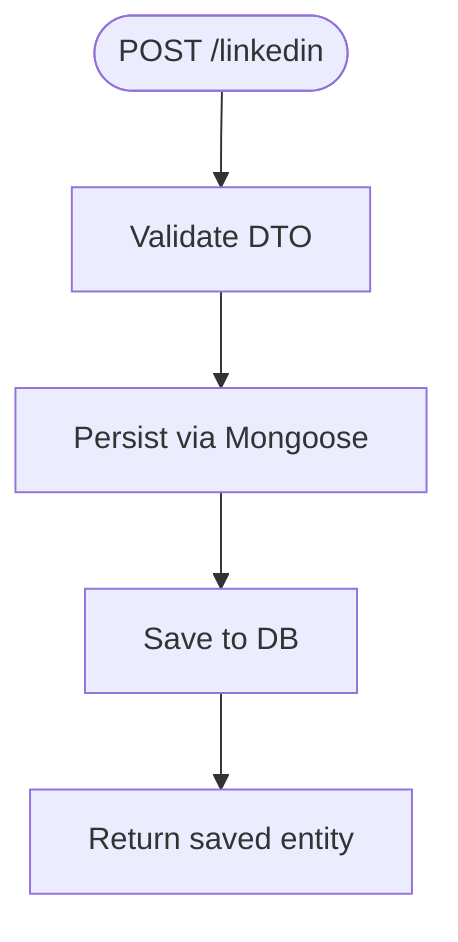
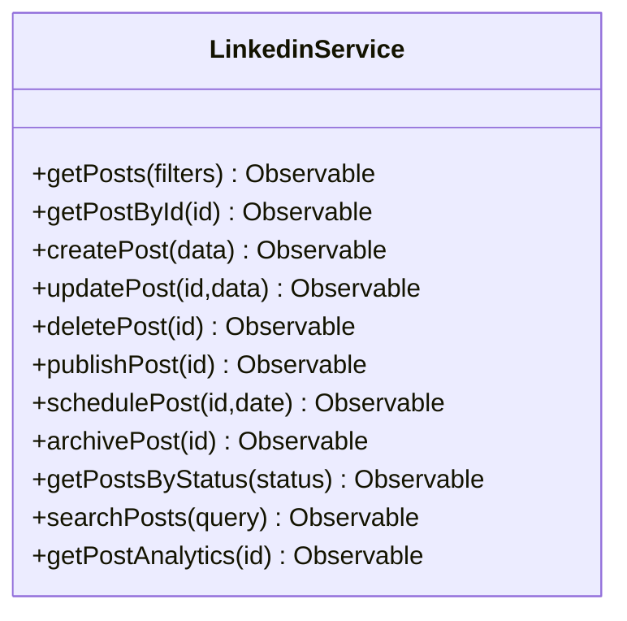
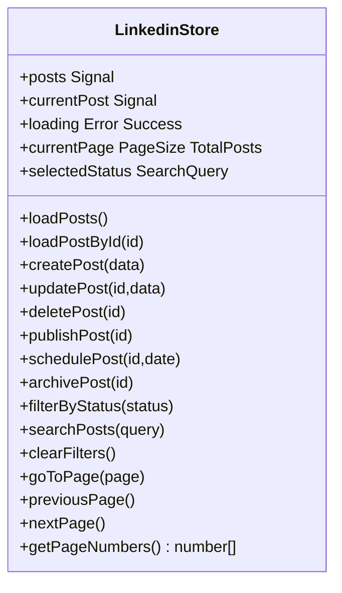
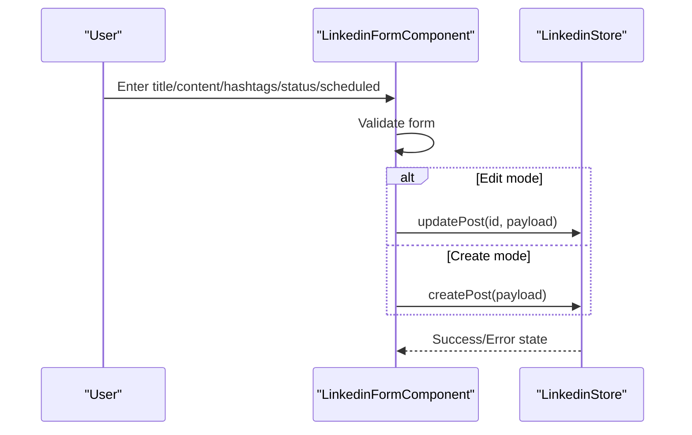
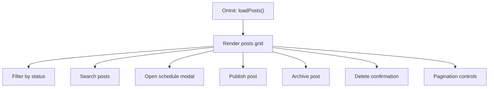
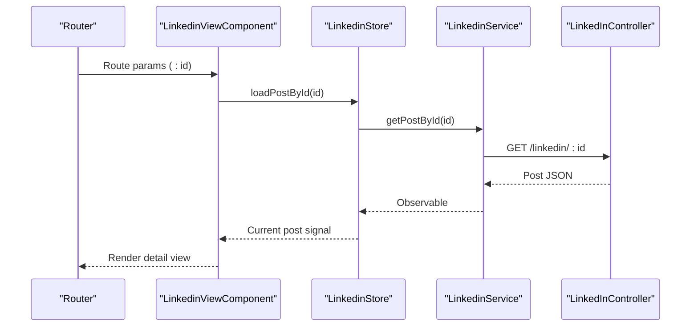
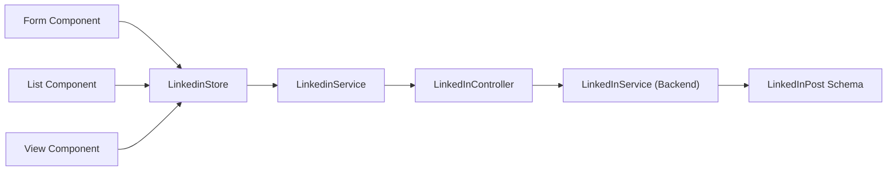

# LinkedIn Content Management

<cite>
**Referenced Files in This Document**
- [linkedin.controller.ts](file://backend/src/linkedin/linkedin.controller.ts)
- [linkedin.service.ts](file://backend/src/linkedin/linkedin.service.ts)
- [linkedin-post.schema.ts](file://backend/src/linkedin/schemas/linkedin-post.schema.ts)
- [linkedin-post.dto.ts](file://backend/src/linkedin/dto/linkedin-post.dto.ts)
- [linkedin.service.ts](file://frontend/src/app/core/services/linkedin.service.ts)
- [linkedin.store.ts](file://frontend/src/app/core/store/linkedin.store.ts)
- [linkedin-form.component.ts](file://frontend/src/app/features/linkedin/linkedin-form/linkedin-form.component.ts)
- [linkedin-form.component.html](file://frontend/src/app/features/linkedin/linkedin-form/linkedin-form.component.html)
- [linkedin-list.component.ts](file://frontend/src/app/features/linkedin/linkedin-list/linkedin-list.component.ts)
- [linkedin-list.component.html](file://frontend/src/app/features/linkedin/linkedin-list/linkedin-list.component.html)
- [linkedin-view.component.ts](file://frontend/src/app/features/linkedin/linkedin-view/linkedin-view.component.ts)
- [linkedin-view.component.html](file://frontend/src/app/features/linkedin/linkedin-view/linkedin-view.component.html)
- [linkedin.routes.ts](file://frontend/src/app/features/linkedin/linkedin.routes.ts)
</cite>

## Table of Contents
1. [Introduction](#introduction)
2. [Project Structure](#project-structure)
3. [Core Components](#core-components)
4. [Architecture Overview](#architecture-overview)
5. [Detailed Component Analysis](#detailed-component-analysis)
6. [Dependency Analysis](#dependency-analysis)
7. [Performance Considerations](#performance-considerations)
8. [Troubleshooting Guide](#troubleshooting-guide)
9. [Conclusion](#conclusion)
10. [Appendices](#appendices)

## Introduction
This document describes the LinkedIn Content Management module that enables professional social media post creation, scheduling, publishing, and analytics viewing. It covers the backend MongoDB schema and REST endpoints, the frontend Angular components and signals-based store, and the workflows for content lifecycle management. It also documents the LinkedIn post schema fields, the form component for creating and editing posts, the list view for managing posts, the view component for displaying analytics, and the service layer for API integration.

## Project Structure
The LinkedIn module spans backend NestJS and frontend Angular:
- Backend: Controllers, Services, DTOs, and Mongoose schema define the LinkedIn post domain and HTTP endpoints.
- Frontend: Components for form, list, and view, plus a signals-based store and service for API communication.

**Diagram sources**
- [linkedin.controller.ts](file://backend/src/linkedin/linkedin.controller.ts#L1-L62)
- [linkedin.service.ts](file://backend/src/linkedin/linkedin.service.ts#L1-L90)
- [linkedin-post.schema.ts](file://backend/src/linkedin/schemas/linkedin-post.schema.ts#L1-L84)
- [linkedin-post.dto.ts](file://backend/src/linkedin/dto/linkedin-post.dto.ts#L1-L52)
- [linkedin.service.ts](file://frontend/src/app/core/services/linkedin.service.ts#L1-L163)
- [linkedin.store.ts](file://frontend/src/app/core/store/linkedin.store.ts#L1-L354)
- [linkedin-form.component.ts](file://frontend/src/app/features/linkedin/linkedin-form/linkedin-form.component.ts#L1-L192)
- [linkedin-list.component.ts](file://frontend/src/app/features/linkedin/linkedin-list/linkedin-list.component.ts#L1-L404)
- [linkedin-view.component.ts](file://frontend/src/app/features/linkedin/linkedin-view/linkedin-view.component.ts#L1-L222)
- [linkedin.routes.ts](file://frontend/src/app/features/linkedin/linkedin.routes.ts#L1-L21)

**Section sources**
- [linkedin.controller.ts](file://backend/src/linkedin/linkedin.controller.ts#L1-L62)
- [linkedin.service.ts](file://backend/src/linkedin/linkedin.service.ts#L1-L90)
- [linkedin-post.schema.ts](file://backend/src/linkedin/schemas/linkedin-post.schema.ts#L1-L84)
- [linkedin-post.dto.ts](file://backend/src/linkedin/dto/linkedin-post.dto.ts#L1-L52)
- [linkedin.service.ts](file://frontend/src/app/core/services/linkedin.service.ts#L1-L163)
- [linkedin.store.ts](file://frontend/src/app/core/store/linkedin.store.ts#L1-L354)
- [linkedin-form.component.ts](file://frontend/src/app/features/linkedin/linkedin-form/linkedin-form.component.ts#L1-L192)
- [linkedin-list.component.ts](file://frontend/src/app/features/linkedin/linkedin-list/linkedin-list.component.ts#L1-L404)
- [linkedin-view.component.ts](file://frontend/src/app/features/linkedin/linkedin-view/linkedin-view.component.ts#L1-L222)
- [linkedin.routes.ts](file://frontend/src/app/features/linkedin/linkedin.routes.ts#L1-L21)

## Core Components
- Backend Controller: Exposes endpoints for creating, listing, filtering, scheduling, publishing, and deleting LinkedIn posts; includes JWT guard for authentication.
- Backend Service: Implements CRUD and status transitions with Mongoose queries and populates author information.
- Mongoose Schema: Defines LinkedInPost entity with status, scheduling, publication flags, engagement metrics, and analytics metadata.
- DTOs: Validate and shape incoming requests for creation and updates.
- Frontend Service: Wraps HTTP calls to backend endpoints and exposes typed observables.
- Signals Store: Centralized state for posts, current post, filters, pagination, counts, and loading/error states.
- Components:
  - Form: Reactive form with validation, hashtag parsing, scheduling, and submit handling via store.
  - List: Filtering, search, pagination, scheduling modal, publish/archive actions, and analytics summary.
  - View: Single post view with engagement stats and sharing utilities.

**Section sources**
- [linkedin.controller.ts](file://backend/src/linkedin/linkedin.controller.ts#L12-L61)
- [linkedin.service.ts](file://backend/src/linkedin/linkedin.service.ts#L11-L88)
- [linkedin-post.schema.ts](file://backend/src/linkedin/schemas/linkedin-post.schema.ts#L13-L79)
- [linkedin-post.dto.ts](file://backend/src/linkedin/dto/linkedin-post.dto.ts#L4-L51)
- [linkedin.service.ts](file://frontend/src/app/core/services/linkedin.service.ts#L8-L162)
- [linkedin.store.ts](file://frontend/src/app/core/store/linkedin.store.ts#L14-L350)
- [linkedin-form.component.ts](file://frontend/src/app/features/linkedin/linkedin-form/linkedin-form.component.ts#L36-L98)
- [linkedin-list.component.ts](file://frontend/src/app/features/linkedin/linkedin-list/linkedin-list.component.ts#L167-L251)
- [linkedin-view.component.ts](file://frontend/src/app/features/linkedin/linkedin-view/linkedin-view.component.ts#L67-L90)

## Architecture Overview
The system follows a layered architecture:
- Frontend Angular components communicate with a centralized store that invokes a typed service wrapping HTTP requests.
- The frontend service calls backend REST endpoints guarded by JWT authentication.
- The backend controller delegates to the service, which performs Mongoose operations against the LinkedInPost collection.

**Diagram sources**
- [linkedin-form.component.ts](file://frontend/src/app/features/linkedin/linkedin-form/linkedin-form.component.ts#L63-L98)
- [linkedin.store.ts](file://frontend/src/app/core/store/linkedin.store.ts#L129-L147)
- [linkedin.service.ts](file://frontend/src/app/core/services/linkedin.service.ts#L88-L97)
- [linkedin.controller.ts](file://backend/src/linkedin/linkedin.controller.ts#L12-L15)
- [linkedin.service.ts](file://backend/src/linkedin/linkedin.service.ts#L11-L14)
- [linkedin-post.schema.ts](file://backend/src/linkedin/schemas/linkedin-post.schema.ts#L13-L79)

## Detailed Component Analysis

### LinkedIn Post Schema
The LinkedInPost schema defines the data model persisted in MongoDB, including:
- Identity and authorship: title, content, author ObjectId, createdBy, updatedBy
- Lifecycle: status enum (draft, scheduled, published, archived), scheduledDate, published flags and dates
- Media and metadata: imageUrl, hashtags array, metadata object
- Engagement and analytics: likes, comments, shares, views, published LinkedIn post identifier, analytics object
- Timestamps: createdAt, updatedAt

**Diagram sources**
- [linkedin-post.schema.ts](file://backend/src/linkedin/schemas/linkedin-post.schema.ts#L14-L79)

**Section sources**
- [linkedin-post.schema.ts](file://backend/src/linkedin/schemas/linkedin-post.schema.ts#L6-L79)

### Backend Controller and Service
- Controller endpoints:
  - POST /linkedin: create post (requires JWT)
  - GET /linkedin: list posts optionally filtered by status
  - GET /linkedin/scheduled: fetch scheduled posts ready to publish
  - GET /linkedin/stats: summary counts
  - GET /linkedin/author/:authorId: posts by author
  - GET /linkedin/:id: get one post
  - PUT /linkedin/:id: update post
  - DELETE /linkedin/:id: delete post
  - POST /linkedin/:id/schedule: set status to scheduled
  - POST /linkedin/:id/publish: set status to published and mark published
- Service methods implement find, update, delete, schedule, publish, and statistics aggregation.

**Diagram sources**
- [linkedin.controller.ts](file://backend/src/linkedin/linkedin.controller.ts#L12-L15)
- [linkedin.service.ts](file://backend/src/linkedin/linkedin.service.ts#L11-L14)

**Section sources**
- [linkedin.controller.ts](file://backend/src/linkedin/linkedin.controller.ts#L12-L61)
- [linkedin.service.ts](file://backend/src/linkedin/linkedin.service.ts#L11-L88)

### Frontend Service Layer
- Provides typed methods for:
  - Fetching paginated posts with filters
  - CRUD operations
  - Publishing and scheduling
  - Analytics retrieval
- Emits observable streams for reactive UI updates.

**Diagram sources**
- [linkedin.service.ts](file://frontend/src/app/core/services/linkedin.service.ts#L55-L162)

**Section sources**
- [linkedin.service.ts](file://frontend/src/app/core/services/linkedin.service.ts#L55-L162)

### Signals Store
- Manages:
  - Posts list, current post, loading/error/success states
  - Pagination (current page, total pages)
  - Counts per status and totals
  - Filters (status, search query)
- Methods:
  - loadPosts(), loadPostById()
  - create/update/delete/publish/schedule/archive
  - filterByStatus(), searchPosts(), clearFilters()
  - Pagination helpers

**Diagram sources**
- [linkedin.store.ts](file://frontend/src/app/core/store/linkedin.store.ts#L43-L350)

**Section sources**
- [linkedin.store.ts](file://frontend/src/app/core/store/linkedin.store.ts#L43-L350)

### Form Component (Create/Edit)
- Reactive form with validators for title and content length.
- Parses hashtags from comma-separated input.
- Supports scheduling via datetime-local input.
- Submits through store to avoid direct API calls in components.

**Diagram sources**
- [linkedin-form.component.ts](file://frontend/src/app/features/linkedin/linkedin-form/linkedin-form.component.ts#L63-L98)
- [linkedin-form.component.html](file://frontend/src/app/features/linkedin/linkedin-form/linkedin-form.component.html#L10-L62)
- [linkedin.store.ts](file://frontend/src/app/core/store/linkedin.store.ts#L129-L147)

**Section sources**
- [linkedin-form.component.ts](file://frontend/src/app/features/linkedin/linkedin-form/linkedin-form.component.ts#L36-L98)
- [linkedin-form.component.html](file://frontend/src/app/features/linkedin/linkedin-form/linkedin-form.component.html#L10-L62)

### List View (Manage Posts)
- Displays posts in a responsive grid with analytics cards.
- Provides status badges, icons, and relative timestamps.
- Supports:
  - Status filtering and search
  - Pagination
  - Schedule modal with min datetime validation
  - Publish/archive actions
  - Delete confirmation modal
  - Count summaries and totals

**Diagram sources**
- [linkedin-list.component.ts](file://frontend/src/app/features/linkedin/linkedin-list/linkedin-list.component.ts#L29-L32)
- [linkedin-list.component.ts](file://frontend/src/app/features/linkedin/linkedin-list/linkedin-list.component.ts#L167-L251)
- [linkedin-list.component.html](file://frontend/src/app/features/linkedin/linkedin-list/linkedin-list.component.html#L123-L265)

**Section sources**
- [linkedin-list.component.ts](file://frontend/src/app/features/linkedin/linkedin-list/linkedin-list.component.ts#L167-L251)
- [linkedin-list.component.html](file://frontend/src/app/features/linkedin/linkedin-list/linkedin-list.component.html#L123-L265)

### View Component (Post Detail and Analytics)
- Loads a single post by route parameter.
- Displays engagement metrics (impressions, likes, comments, shares).
- Provides social sharing links and copy-to-clipboard.

**Diagram sources**
- [linkedin-view.component.ts](file://frontend/src/app/features/linkedin/linkedin-view/linkedin-view.component.ts#L23-L30)
- [linkedin-view.component.ts](file://frontend/src/app/features/linkedin/linkedin-view/linkedin-view.component.ts#L67-L90)
- [linkedin.service.ts](file://frontend/src/app/core/services/linkedin.service.ts#L81-L83)
- [linkedin.controller.ts](file://backend/src/linkedin/linkedin.controller.ts#L37-L40)

**Section sources**
- [linkedin-view.component.ts](file://frontend/src/app/features/linkedin/linkedin-view/linkedin-view.component.ts#L67-L90)
- [linkedin-view.component.html](file://frontend/src/app/features/linkedin/linkedin-view/linkedin-view.component.html#L9-L51)

### Routes
- Module routes define lazy-loaded components for list, create, view, and edit.

**Section sources**
- [linkedin.routes.ts](file://frontend/src/app/features/linkedin/linkedin.routes.ts#L3-L20)

## Dependency Analysis
- Frontend depends on:
  - Signals store for state management
  - Service for HTTP operations
  - Components for UI and routing
- Backend depends on:
  - Mongoose for persistence
  - DTOs for validation
  - Guards for authentication

**Diagram sources**
- [linkedin-form.component.ts](file://frontend/src/app/features/linkedin/linkedin-form/linkedin-form.component.ts#L15-L21)
- [linkedin-list.component.ts](file://frontend/src/app/features/linkedin/linkedin-list/linkedin-list.component.ts#L16-L18)
- [linkedin-view.component.ts](file://frontend/src/app/features/linkedin/linkedin-view/linkedin-view.component.ts#L15-L18)
- [linkedin.store.ts](file://frontend/src/app/core/store/linkedin.store.ts#L1-L6)
- [linkedin.service.ts](file://frontend/src/app/core/services/linkedin.service.ts#L55-L60)
- [linkedin.controller.ts](file://backend/src/linkedin/linkedin.controller.ts#L1-L8)
- [linkedin.service.ts](file://backend/src/linkedin/linkedin.service.ts#L1-L9)
- [linkedin-post.schema.ts](file://backend/src/linkedin/schemas/linkedin-post.schema.ts#L1-L4)

**Section sources**
- [linkedin-form.component.ts](file://frontend/src/app/features/linkedin/linkedin-form/linkedin-form.component.ts#L15-L21)
- [linkedin-list.component.ts](file://frontend/src/app/features/linkedin/linkedin-list/linkedin-list.component.ts#L16-L18)
- [linkedin-view.component.ts](file://frontend/src/app/features/linkedin/linkedin-view/linkedin-view.component.ts#L15-L18)
- [linkedin.store.ts](file://frontend/src/app/core/store/linkedin.store.ts#L1-L6)
- [linkedin.service.ts](file://frontend/src/app/core/services/linkedin.service.ts#L55-L60)
- [linkedin.controller.ts](file://backend/src/linkedin/linkedin.controller.ts#L1-L8)
- [linkedin.service.ts](file://backend/src/linkedin/linkedin.service.ts#L1-L9)
- [linkedin-post.schema.ts](file://backend/src/linkedin/schemas/linkedin-post.schema.ts#L1-L4)

## Performance Considerations
- Backend indexing: Composite index on status and createdAt, and index on scheduledDate improve query performance for listing and scheduling.
- Pagination: Frontend store manages page size and total pages to reduce payload sizes.
- Optimistic UI: Store toggles per-action flags (publishing, scheduling) to provide immediate feedback while requests resolve.
- Minimal re-renders: Signals-based store reduces unnecessary component updates.

**Section sources**
- [linkedin-post.schema.ts](file://backend/src/linkedin/schemas/linkedin-post.schema.ts#L82-L84)
- [linkedin.store.ts](file://frontend/src/app/core/store/linkedin.store.ts#L47-L60)
- [linkedin-list.component.ts](file://frontend/src/app/features/linkedin/linkedin-list/linkedin-list.component.ts#L198-L229)

## Troubleshooting Guide
- Authentication errors: Ensure JWT guard is applied and tokens are included in requests.
- Validation failures: DTOs enforce required fields and enums; check form inputs and payload structure.
- State synchronization: Store handles loading and error states; inspect success/error signals in components.
- Scheduling issues: Ensure scheduled date is in the future; UI enforces min datetime.

**Section sources**
- [linkedin.controller.ts](file://backend/src/linkedin/linkedin.controller.ts#L8-L8)
- [linkedin-post.dto.ts](file://backend/src/linkedin/dto/linkedin-post.dto.ts#L4-L51)
- [linkedin-list.component.ts](file://frontend/src/app/features/linkedin/linkedin-list/linkedin-list.component.ts#L232-L243)
- [linkedin-list.component.html](file://frontend/src/app/features/linkedin/linkedin-list/linkedin-list.component.html#L335-L338)

## Conclusion
The LinkedIn Content Management module provides a robust, scalable solution for creating, scheduling, publishing, and analyzing LinkedIn posts. The backend offers a clear schema and REST endpoints with validation, while the frontend delivers a responsive, state-managed UI with powerful filtering and analytics. Together, they support efficient content workflows and professional engagement tracking.

## Appendices

### Practical Examples

- Professional content creation
  - Use the form component to enter a concise title and detailed content, add relevant hashtags, and choose status “Draft” or “Scheduled.”
  - Submit via the store to persist the post and receive success notifications.

- Publishing strategies
  - Draft posts can be scheduled for a future datetime to optimize posting timing.
  - Use the list view to bulk manage statuses, apply filters, and monitor performance.

- Engagement monitoring
  - View individual posts to see impressions, likes, comments, and shares.
  - Use the list view’s analytics summary to compare engagement across posts and adjust content strategy accordingly.

**Section sources**
- [linkedin-form.component.ts](file://frontend/src/app/features/linkedin/linkedin-form/linkedin-form.component.ts#L63-L98)
- [linkedin-list.component.ts](file://frontend/src/app/features/linkedin/linkedin-list/linkedin-list.component.ts#L167-L251)
- [linkedin-view.component.ts](file://frontend/src/app/features/linkedin/linkedin-view/linkedin-view.component.ts#L134-L151)