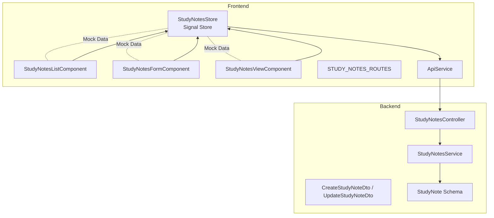
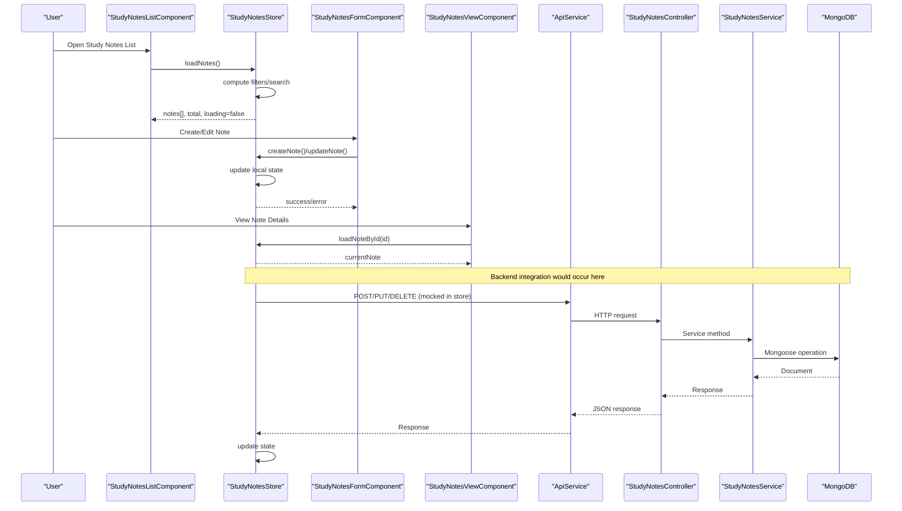
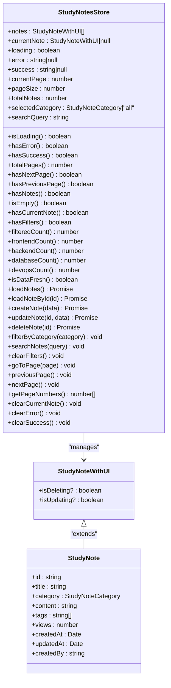
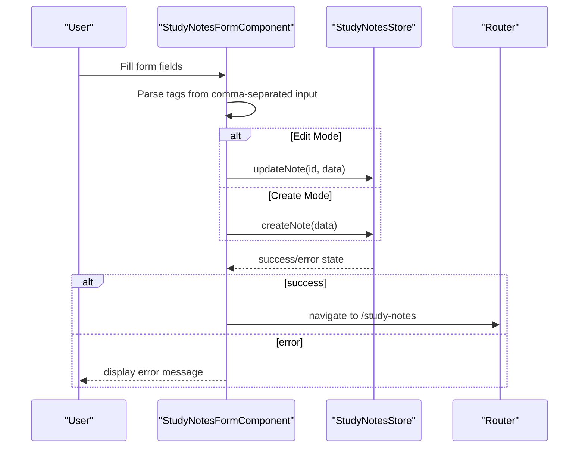
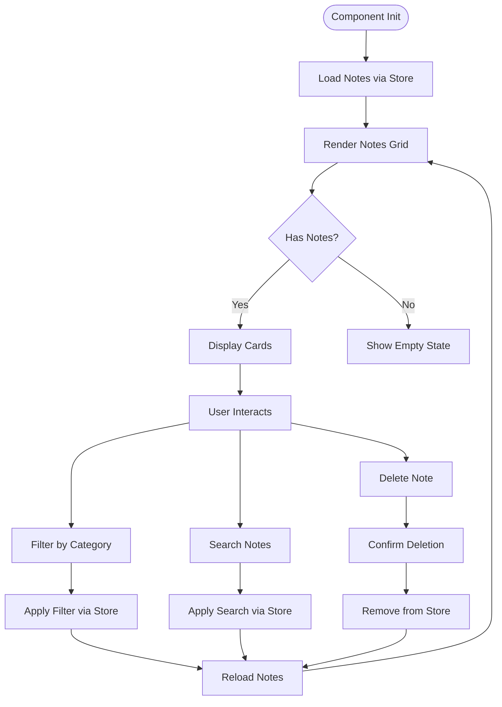
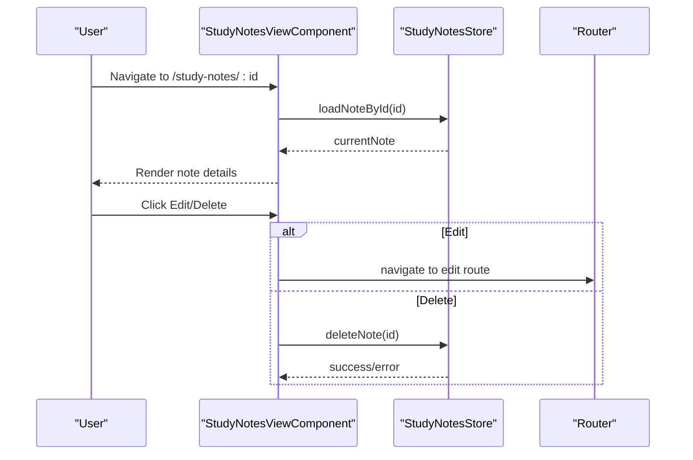
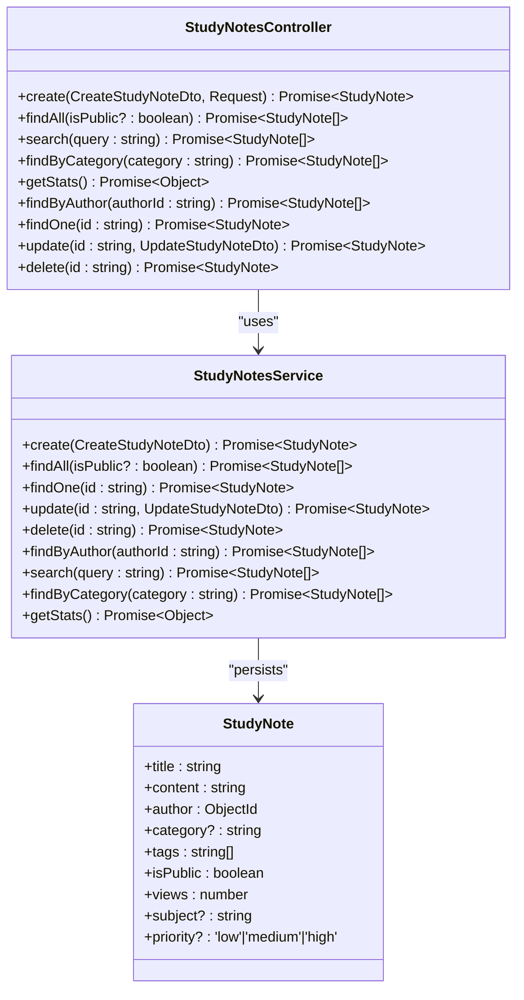
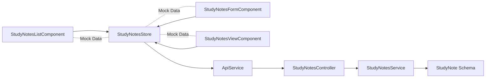

# Study Notes Management

<cite>
**Referenced Files in This Document**
- [study-notes.store.ts](file://frontend/src/app/core/store/study-notes.store.ts)
- [study-notes-form.component.ts](file://frontend/src/app/features/study-notes/study-notes-form/study-notes-form.component.ts)
- [study-notes-form.component.html](file://frontend/src/app/features/study-notes/study-notes-form/study-notes-form.component.html)
- [study-notes-list.component.ts](file://frontend/src/app/features/study-notes/study-notes-list/study-notes-list.component.ts)
- [study-notes-list.component.html](file://frontend/src/app/features/study-notes/study-notes-list/study-notes-list.component.html)
- [study-notes-view.component.ts](file://frontend/src/app/features/study-notes/study-notes-view/study-notes-view.component.ts)
- [study-notes-view.component.html](file://frontend/src/app/features/study-notes/study-notes-view/study-notes-view.component.html)
- [study-notes.routes.ts](file://frontend/src/app/features/study-notes/study-notes.routes.ts)
- [api.service.ts](file://frontend/src/app/core/services/api.service.ts)
- [study-notes.service.ts](file://backend/src/study-notes/study-notes.service.ts)
- [study-notes.controller.ts](file://backend/src/study-notes/study-notes.controller.ts)
- [study-note.dto.ts](file://backend/src/study-notes/dto/study-note.dto.ts)
- [study-note.schema.ts](file://backend/src/study-notes/schemas/study-note.schema.ts)
</cite>

## Table of Contents
1. [Introduction](#introduction)
2. [Project Structure](#project-structure)
3. [Core Components](#core-components)
4. [Architecture Overview](#architecture-overview)
5. [Detailed Component Analysis](#detailed-component-analysis)
6. [Dependency Analysis](#dependency-analysis)
7. [Performance Considerations](#performance-considerations)
8. [Troubleshooting Guide](#troubleshooting-guide)
9. [Conclusion](#conclusion)

## Introduction
This document provides comprehensive documentation for the Study Notes Management module. It covers the complete CRUD lifecycle for study notes, including creation, editing, deletion, and viewing. It documents the study note schema, the form component implementation with rich text editing capabilities, category selection, and tag management. It also details the list view with filtering, searching, and sorting capabilities, and the view component for displaying individual study notes with formatting preservation. The document explains the signal store implementation for reactive state management, the service layer architecture, and API integration patterns. Practical examples of note creation workflows, content organization strategies, and user interaction patterns are included.

## Project Structure
The Study Notes Management module is organized into three primary frontend components and a dedicated signal store, along with backend NestJS resources for data persistence and retrieval.

**Diagram sources**
- [study-notes.store.ts](file://frontend/src/app/core/store/study-notes.store.ts#L66-L437)
- [study-notes-list.component.ts](file://frontend/src/app/features/study-notes/study-notes-list/study-notes-list.component.ts#L1-L222)
- [study-notes-form.component.ts](file://frontend/src/app/features/study-notes/study-notes-form/study-notes-form.component.ts#L1-L186)
- [study-notes-view.component.ts](file://frontend/src/app/features/study-notes/study-notes-view/study-notes-view.component.ts#L1-L175)
- [study-notes.routes.ts](file://frontend/src/app/features/study-notes/study-notes.routes.ts#L1-L21)
- [api.service.ts](file://frontend/src/app/core/services/api.service.ts#L1-L76)
- [study-notes.controller.ts](file://backend/src/study-notes/study-notes.controller.ts#L1-L56)
- [study-notes.service.ts](file://backend/src/study-notes/study-notes.service.ts#L1-L80)
- [study-note.dto.ts](file://backend/src/study-notes/dto/study-note.dto.ts#L1-L63)
- [study-note.schema.ts](file://backend/src/study-notes/schemas/study-note.schema.ts#L1-L35)

**Section sources**
- [study-notes.routes.ts](file://frontend/src/app/features/study-notes/study-notes.routes.ts#L1-L21)
- [study-notes.store.ts](file://frontend/src/app/core/store/study-notes.store.ts#L66-L437)
- [study-notes-list.component.ts](file://frontend/src/app/features/study-notes/study-notes-list/study-notes-list.component.ts#L1-L222)
- [study-notes-form.component.ts](file://frontend/src/app/features/study-notes/study-notes-form/study-notes-form.component.ts#L1-L186)
- [study-notes-view.component.ts](file://frontend/src/app/features/study-notes/study-notes-view/study-notes-view.component.ts#L1-L175)
- [api.service.ts](file://frontend/src/app/core/services/api.service.ts#L1-L76)
- [study-notes.controller.ts](file://backend/src/study-notes/study-notes.controller.ts#L1-L56)
- [study-notes.service.ts](file://backend/src/study-notes/study-notes.service.ts#L1-L80)
- [study-note.dto.ts](file://backend/src/study-notes/dto/study-note.dto.ts#L1-L63)
- [study-note.schema.ts](file://backend/src/study-notes/schemas/study-note.schema.ts#L1-L35)

## Core Components
This section documents the core data structures and the signal store that powers the Study Notes Management module.

- Study Note Schema
  - Fields: id, title, category, content, tags, views, createdAt, updatedAt, createdBy
  - Validation: Frontend form enforces minimum lengths and required fields; Backend DTOs enforce presence and types
  - Metadata: Views increment on read; timestamps managed by backend schema

- Signal Store (StudyNotesStore)
  - State: notes, currentNote, loading, error, success, currentPage, pageSize, totalNotes, selectedCategory, searchQuery
  - Computed: isLoading, hasError, hasSuccess, totalPages, hasNextPage, hasPreviousPage, hasNotes, isEmpty, hasCurrentNote, hasFilters, filteredCount, category counts (frontendCount, backendCount, databaseCount, devopsCount), isDataFresh
  - Methods: loadNotes, loadNoteById, createNote, updateNote, deleteNote, filterByCategory, searchNotes, clearFilters, goToPage, previousPage, nextPage, getPageNumbers, clearCurrentNote, clearError, clearSuccess

- API Integration Pattern
  - Frontend uses ApiService for HTTP requests
  - Backend StudyNotesController exposes endpoints for create, list, search, category filter, stats, author filter, read, update, and delete
  - Backend StudyNotesService handles Mongoose operations and population of author data

**Section sources**
- [study-notes.store.ts](file://frontend/src/app/core/store/study-notes.store.ts#L9-L51)
- [study-notes.store.ts](file://frontend/src/app/core/store/study-notes.store.ts#L66-L437)
- [api.service.ts](file://frontend/src/app/core/services/api.service.ts#L1-L76)
- [study-notes.controller.ts](file://backend/src/study-notes/study-notes.controller.ts#L1-L56)
- [study-notes.service.ts](file://backend/src/study-notes/study-notes.service.ts#L1-L80)
- [study-note.schema.ts](file://backend/src/study-notes/schemas/study-note.schema.ts#L1-L35)
- [study-note.dto.ts](file://backend/src/study-notes/dto/study-note.dto.ts#L1-L63)

## Architecture Overview
The module follows a reactive architecture with a signal store coordinating UI actions and state. The frontend components interact with the store, which manages UI state and delegates persistence to the backend via ApiService. The backend implements a REST controller and service layer with Mongoose for data persistence.

**Diagram sources**
- [study-notes-list.component.ts](file://frontend/src/app/features/study-notes/study-notes-list/study-notes.component.ts#L1-L222)
- [study-notes-form.component.ts](file://frontend/src/app/features/study-notes/study-notes-form/study-notes-form.component.ts#L1-L186)
- [study-notes-view.component.ts](file://frontend/src/app/features/study-notes/study-notes-view/study-notes-view.component.ts#L1-L175)
- [study-notes.store.ts](file://frontend/src/app/core/store/study-notes.store.ts#L114-L188)
- [api.service.ts](file://frontend/src/app/core/services/api.service.ts#L1-L76)
- [study-notes.controller.ts](file://backend/src/study-notes/study-notes.controller.ts#L1-L56)
- [study-notes.service.ts](file://backend/src/study-notes/study-notes.service.ts#L1-L80)

## Detailed Component Analysis

### Study Notes Store (Signal Store)
The StudyNotesStore encapsulates all state and logic for managing study notes reactively. It includes computed properties for UI state and filtering, and methods for CRUD operations and pagination.

**Diagram sources**
- [study-notes.store.ts](file://frontend/src/app/core/store/study-notes.store.ts#L9-L51)
- [study-notes.store.ts](file://frontend/src/app/core/store/study-notes.store.ts#L66-L437)

Key implementation highlights:
- Filtering and searching are applied locally against the notes array in the store
- Pagination state is maintained and computed totals reflect filtered results
- CRUD operations update local state and trigger UI feedback

**Section sources**
- [study-notes.store.ts](file://frontend/src/app/core/store/study-notes.store.ts#L66-L437)

### Study Notes Form Component
The form component provides a rich editing experience with validation, category selection, and tag management. It supports both creation and editing modes and integrates with the store for submission.

**Diagram sources**
- [study-notes-form.component.ts](file://frontend/src/app/features/study-notes/study-notes-form/study-notes-form.component.ts#L108-L146)
- [study-notes.store.ts](file://frontend/src/app/core/store/study-notes.store.ts#L238-L274)

Implementation details:
- Form validation ensures minimum length for title and content and required category
- Tags are parsed from a comma-separated string into an array
- Edit mode auto-populates form from currentNote in the store
- Submission dispatches to store methods; navigation occurs after success

**Section sources**
- [study-notes-form.component.ts](file://frontend/src/app/features/study-notes/study-notes-form/study-notes-form.component.ts#L1-L186)
- [study-notes-form.component.html](file://frontend/src/app/features/study-notes/study-notes-form/study-notes-form.component.html#L1-L76)

### Study Notes List Component
The list component renders a responsive grid of study notes, supports filtering by category and search, and provides pagination controls.

**Diagram sources**
- [study-notes-list.component.ts](file://frontend/src/app/features/study-notes/study-notes-list/study-notes-list.component.ts#L19-L123)
- [study-notes.store.ts](file://frontend/src/app/core/store/study-notes.store.ts#L351-L374)

User interactions:
- Category filtering updates selectedCategory and triggers reload
- Search updates searchQuery and reloads filtered results
- Pagination controls navigate pages and reload data
- Delete sets a temporary UI flag and removes the note from state

**Section sources**
- [study-notes-list.component.ts](file://frontend/src/app/features/study-notes/study-notes-list/study-notes-list.component.ts#L1-L222)
- [study-notes-list.component.html](file://frontend/src/app/features/study-notes/study-notes-list/study-notes-list.component.html#L1-L51)

### Study Notes View Component
The view component displays a single study note with formatted content, tags, and metadata. It provides editing and deletion actions when permissions allow.

**Diagram sources**
- [study-notes-view.component.ts](file://frontend/src/app/features/study-notes/study-notes-view/study-notes-view.component.ts#L20-L82)
- [study-notes.store.ts](file://frontend/src/app/core/store/study-notes.store.ts#L313-L346)

Formatting and presentation:
- Category badges and icons enhance readability
- Content is rendered with preserved formatting
- Tags are displayed as interactive badges
- Stats include view counts and timestamps

**Section sources**
- [study-notes-view.component.ts](file://frontend/src/app/features/study-notes/study-notes-view/study-notes-view.component.ts#L1-L175)
- [study-notes-view.component.html](file://frontend/src/app/features/study-notes/study-notes-view/study-notes-view.component.html#L1-L41)

### Backend Service Layer
The backend implements a robust service layer with endpoints for CRUD operations, search, category filtering, author-specific queries, and statistics.

**Diagram sources**
- [study-notes.controller.ts](file://backend/src/study-notes/study-notes.controller.ts#L1-L56)
- [study-notes.service.ts](file://backend/src/study-notes/study-notes.service.ts#L1-L80)
- [study-note.schema.ts](file://backend/src/study-notes/schemas/study-note.schema.ts#L1-L35)
- [study-note.dto.ts](file://backend/src/study-notes/dto/study-note.dto.ts#L1-L63)

Endpoints and behaviors:
- Authentication guard ensures protected routes
- Search uses regex-based matching across title, content, tags, and subject
- Category and author filters support public visibility constraints
- findOne increments view counters and populates author details

**Section sources**
- [study-notes.controller.ts](file://backend/src/study-notes/study-notes.controller.ts#L1-L56)
- [study-notes.service.ts](file://backend/src/study-notes/study-notes.service.ts#L1-L80)
- [study-note.schema.ts](file://backend/src/study-notes/schemas/study-note.schema.ts#L1-L35)
- [study-note.dto.ts](file://backend/src/study-notes/dto/study-note.dto.ts#L1-L63)

## Dependency Analysis
The module exhibits clear separation of concerns with the frontend relying on the signal store and ApiService, while the backend implements a layered architecture with controllers and services.

**Diagram sources**
- [study-notes-list.component.ts](file://frontend/src/app/features/study-notes/study-notes-list/study-notes-list.component.ts#L1-L222)
- [study-notes-form.component.ts](file://frontend/src/app/features/study-notes/study-notes-form/study-notes-form.component.ts#L1-L186)
- [study-notes-view.component.ts](file://frontend/src/app/features/study-notes/study-notes-view/study-notes-view.component.ts#L1-L175)
- [study-notes.store.ts](file://frontend/src/app/core/store/study-notes.store.ts#L66-L437)
- [api.service.ts](file://frontend/src/app/core/services/api.service.ts#L1-L76)
- [study-notes.controller.ts](file://backend/src/study-notes/study-notes.controller.ts#L1-L56)
- [study-notes.service.ts](file://backend/src/study-notes/study-notes.service.ts#L1-L80)
- [study-note.schema.ts](file://backend/src/study-notes/schemas/study-note.schema.ts#L1-L35)

Observations:
- Frontend components depend on the store for state and UI logic
- Backend controllers depend on services for business logic
- Services depend on Mongoose schemas for persistence
- The store currently uses mock data; integration would connect to backend endpoints

**Section sources**
- [study-notes.store.ts](file://frontend/src/app/core/store/study-notes.store.ts#L114-L188)
- [study-notes.controller.ts](file://backend/src/study-notes/study-notes.controller.ts#L1-L56)
- [study-notes.service.ts](file://backend/src/study-notes/study-notes.service.ts#L1-L80)

## Performance Considerations
- Local filtering and pagination in the store reduce network requests but may impact performance with very large datasets. Consider server-side pagination and filtering for production scale.
- Tag parsing and search queries are O(n) over the notes array; optimize by indexing tags and using efficient search strategies.
- Incremental view counters in findOne increase read performance by avoiding separate read operations.
- Debouncing search inputs can reduce unnecessary reloads during typing.

## Troubleshooting Guide
Common issues and resolutions:
- Form validation errors: Ensure minimum lengths and required fields are met; check dirty/touched states for error display.
- Empty lists after filtering: Verify selectedCategory and searchQuery are reset when clearing filters.
- Delete confirmation failures: Confirm browser supports confirm dialogs and handle user cancellation gracefully.
- Navigation after save: Ensure success state clears automatically and navigation occurs after a delay to allow UI updates.
- Backend integration: When connecting to real endpoints, ensure proper error handling and loading states are reflected in the UI.

**Section sources**
- [study-notes-form.component.ts](file://frontend/src/app/features/study-notes/study-notes-form/study-notes-form.component.ts#L151-L154)
- [study-notes-list.component.ts](file://frontend/src/app/features/study-notes/study-notes-list/study-notes-list.component.ts#L96-L102)
- [study-notes.store.ts](file://frontend/src/app/core/store/study-notes.store.ts#L313-L346)

## Conclusion
The Study Notes Management module provides a comprehensive, reactive solution for organizing and managing study materials. The signal store centralizes state and logic, while the form, list, and view components deliver a cohesive user experience. The backend offers a robust foundation for persistence and retrieval, with clear endpoints for CRUD operations, search, and filtering. By following the outlined patterns and best practices, teams can extend functionality, integrate with backend APIs, and scale the module effectively.