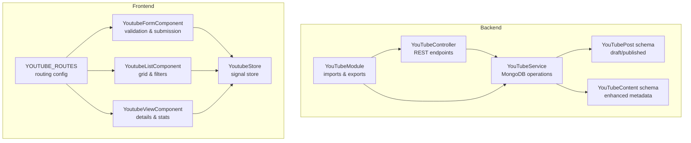
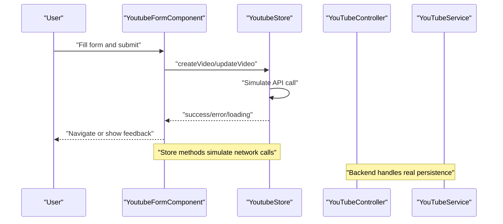
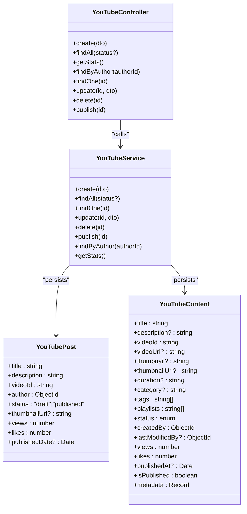
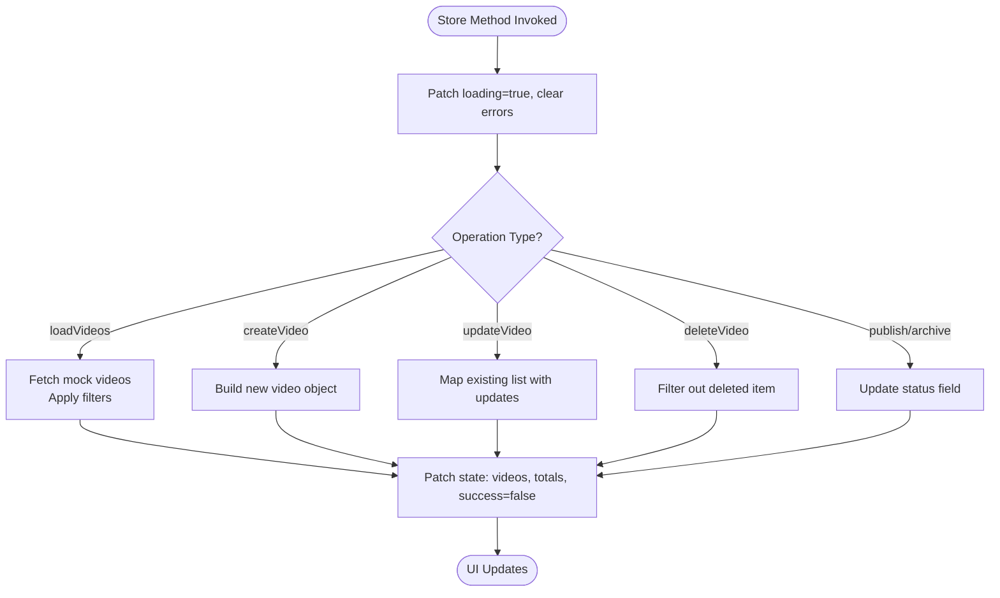
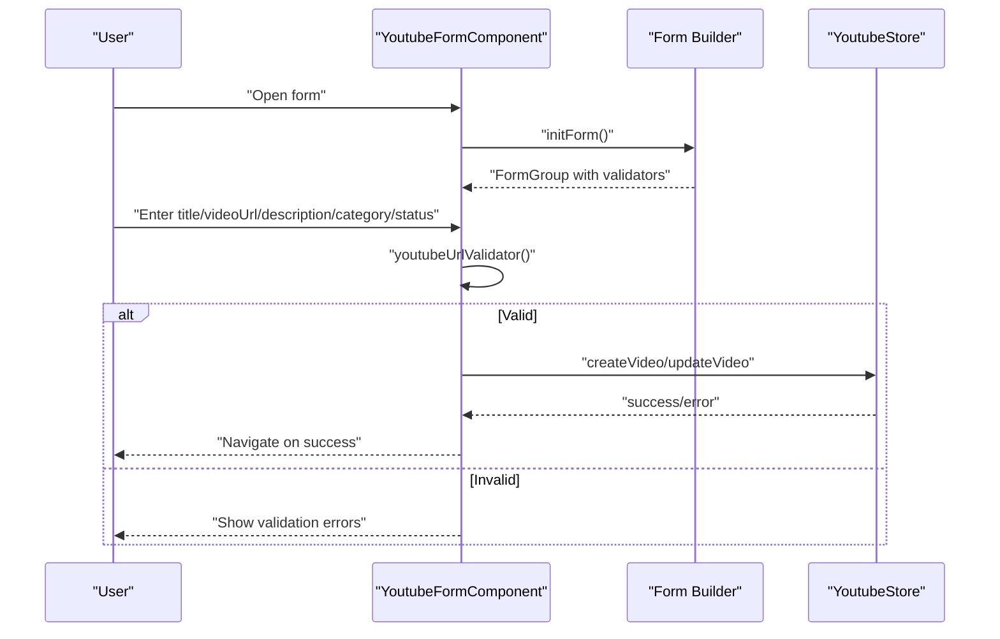
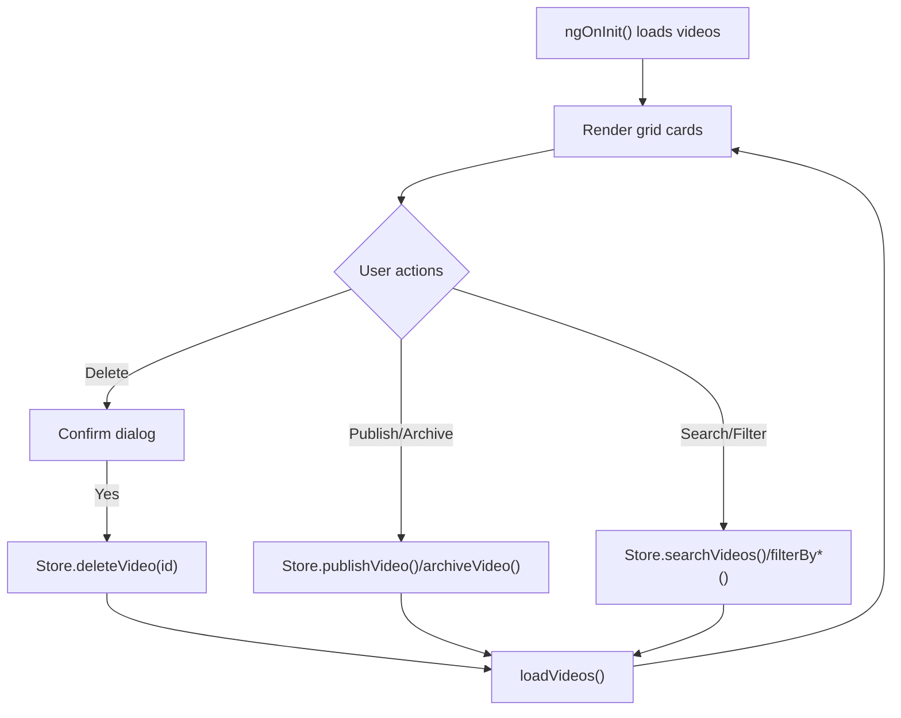
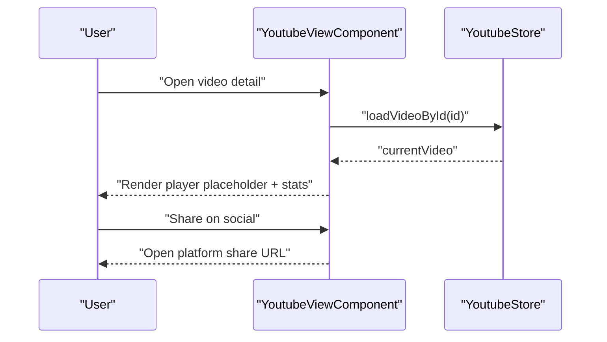
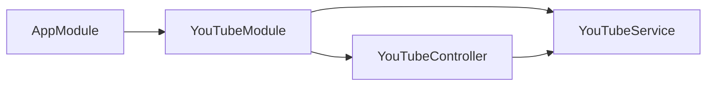

# YouTube Content Management

<cite>
**Referenced Files in This Document**
- [youtube.controller.ts](file://backend/src/youtube/youtube.controller.ts)
- [youtube.service.ts](file://backend/src/youtube/youtube.service.ts)
- [youtube-post.schema.ts](file://backend/src/youtube/schemas/youtube-post.schema.ts)
- [youtube-content.schema.ts](file://backend/src/youtube/schemas/youtube-content.schema.ts)
- [youtube-post.dto.ts](file://backend/src/youtube/dto/youtube-post.dto.ts)
- [youtube.module.ts](file://backend/src/youtube/youtube.module.ts)
- [youtube.store.ts](file://frontend/src/app/core/store/youtube.store.ts)
- [youtube-form.component.ts](file://frontend/src/app/features/youtube/youtube-form/youtube-form.component.ts)
- [youtube-form.component.html](file://frontend/src/app/features/youtube/youtube-form/youtube-form.component.html)
- [youtube-list.component.ts](file://frontend/src/app/features/youtube/youtube-list/youtube-list.component.ts)
- [youtube-list.component.html](file://frontend/src/app/features/youtube/youtube-list/youtube-list.component.html)
- [youtube-view.component.ts](file://frontend/src/app/features/youtube/youtube-view/youtube-view.component.ts)
- [youtube-view.component.html](file://frontend/src/app/features/youtube/youtube-view/youtube-view.component.html)
- [youtube.routes.ts](file://frontend/src/app/features/youtube/youtube.routes.ts)
- [app.module.ts](file://backend/src/app.module.ts)
- [analytics.service.ts](file://backend/src/analytics/analytics.service.ts)
</cite>

## Table of Contents
1. [Introduction](#introduction)
2. [Project Structure](#project-structure)
3. [Core Components](#core-components)
4. [Architecture Overview](#architecture-overview)
5. [Detailed Component Analysis](#detailed-component-analysis)
6. [Dependency Analysis](#dependency-analysis)
7. [Performance Considerations](#performance-considerations)
8. [Troubleshooting Guide](#troubleshooting-guide)
9. [Conclusion](#conclusion)

## Introduction
This document describes the YouTube Content Management module, covering video content lifecycle management, metadata handling, scheduling, and analytics integration. It documents the dual-schema approach (post and content schemas), the service layer for external YouTube API integration, and the signal store for state management. Practical examples demonstrate video workflow processes, scheduling strategies, and analytics monitoring.

## Project Structure
The YouTube module spans backend NestJS services and MongoDB schemas, and frontend Angular components with a signal store. The backend integrates with Mongoose for persistence and exposes REST endpoints. The frontend uses a centralized store to manage state and coordinates with routing for form, list, and view experiences.

**Diagram sources**
- [youtube.controller.ts](file://backend/src/youtube/youtube.controller.ts#L1-L51)
- [youtube.service.ts](file://backend/src/youtube/youtube.service.ts#L1-L73)
- [youtube-post.schema.ts](file://backend/src/youtube/schemas/youtube-post.schema.ts#L1-L37)
- [youtube-content.schema.ts](file://backend/src/youtube/schemas/youtube-content.schema.ts#L1-L70)
- [youtube.module.ts](file://backend/src/youtube/youtube.module.ts#L1-L14)
- [youtube.store.ts](file://frontend/src/app/core/store/youtube.store.ts#L1-L543)
- [youtube-form.component.ts](file://frontend/src/app/features/youtube/youtube-form/youtube-form.component.ts#L1-L201)
- [youtube-list.component.ts](file://frontend/src/app/features/youtube/youtube-list/youtube-list.component.ts#L1-L303)
- [youtube-view.component.ts](file://frontend/src/app/features/youtube/youtube-view/youtube-view.component.ts#L1-L268)
- [youtube.routes.ts](file://frontend/src/app/features/youtube/youtube.routes.ts#L1-L21)

**Section sources**
- [youtube.controller.ts](file://backend/src/youtube/youtube.controller.ts#L1-L51)
- [youtube.service.ts](file://backend/src/youtube/youtube.service.ts#L1-L73)
- [youtube-post.schema.ts](file://backend/src/youtube/schemas/youtube-post.schema.ts#L1-L37)
- [youtube-content.schema.ts](file://backend/src/youtube/schemas/youtube-content.schema.ts#L1-L70)
- [youtube.module.ts](file://backend/src/youtube/youtube.module.ts#L1-L14)
- [youtube.store.ts](file://frontend/src/app/core/store/youtube.store.ts#L1-L543)
- [youtube-form.component.ts](file://frontend/src/app/features/youtube/youtube-form/youtube-form.component.ts#L1-L201)
- [youtube-list.component.ts](file://frontend/src/app/features/youtube/youtube-list/youtube-list.component.ts#L1-L303)
- [youtube-view.component.ts](file://frontend/src/app/features/youtube/youtube-view/youtube-view.component.ts#L1-L268)
- [youtube.routes.ts](file://frontend/src/app/features/youtube/youtube.routes.ts#L1-L21)
- [app.module.ts](file://backend/src/app.module.ts#L1-L41)

## Core Components
- Backend YouTube controller and service handle CRUD operations, status transitions, and statistics aggregation.
- Dual schemas support lightweight posts and enriched content with metadata, playlists, and analytics-ready fields.
- Frontend signal store manages videos, current video, filters, pagination, and UI states.
- Form, list, and view components coordinate with the store for user interactions and rendering.

Key backend DTOs and schemas define the data contracts for creation, updates, and storage.

**Section sources**
- [youtube-post.dto.ts](file://backend/src/youtube/dto/youtube-post.dto.ts#L1-L38)
- [youtube-post.schema.ts](file://backend/src/youtube/schemas/youtube-post.schema.ts#L1-L37)
- [youtube-content.schema.ts](file://backend/src/youtube/schemas/youtube-content.schema.ts#L1-L70)
- [youtube.store.ts](file://frontend/src/app/core/store/youtube.store.ts#L1-L543)

## Architecture Overview
The system follows a layered architecture:
- Frontend Angular components communicate with a signal store.
- The store encapsulates state and simulates API interactions for demonstration.
- Backend REST endpoints expose YouTube management capabilities backed by MongoDB schemas.

**Diagram sources**
- [youtube-form.component.ts](file://frontend/src/app/features/youtube/youtube-form/youtube-form.component.ts#L122-L156)
- [youtube.store.ts](file://frontend/src/app/core/store/youtube.store.ts#L285-L323)
- [youtube.controller.ts](file://backend/src/youtube/youtube.controller.ts#L11-L14)
- [youtube.service.ts](file://backend/src/youtube/youtube.service.ts#L11-L14)

## Detailed Component Analysis

### Backend YouTube Module
- Controller exposes endpoints for create, list, stats, author lookup, detail, update, delete, and publish.
- Service performs MongoDB operations, including status updates and statistics aggregation.
- Schemas define two models: a minimal post model and an enriched content model supporting metadata and playlists.

**Diagram sources**
- [youtube.controller.ts](file://backend/src/youtube/youtube.controller.ts#L1-L51)
- [youtube.service.ts](file://backend/src/youtube/youtube.service.ts#L1-L73)
- [youtube-post.schema.ts](file://backend/src/youtube/schemas/youtube-post.schema.ts#L1-L37)
- [youtube-content.schema.ts](file://backend/src/youtube/schemas/youtube-content.schema.ts#L1-L70)

**Section sources**
- [youtube.controller.ts](file://backend/src/youtube/youtube.controller.ts#L1-L51)
- [youtube.service.ts](file://backend/src/youtube/youtube.service.ts#L1-L73)
- [youtube-post.schema.ts](file://backend/src/youtube/schemas/youtube-post.schema.ts#L1-L37)
- [youtube-content.schema.ts](file://backend/src/youtube/schemas/youtube-content.schema.ts#L1-L70)

### Frontend Signal Store
The store defines typed interfaces for videos and requests, maintains state, computed helpers for UI, and methods to load, create, update, delete, filter, paginate, and compute analytics-like aggregates.

**Diagram sources**
- [youtube.store.ts](file://frontend/src/app/core/store/youtube.store.ts#L149-L233)
- [youtube.store.ts](file://frontend/src/app/core/store/youtube.store.ts#L285-L323)
- [youtube.store.ts](file://frontend/src/app/core/store/youtube.store.ts#L328-L357)
- [youtube.store.ts](file://frontend/src/app/core/store/youtube.store.ts#L409-L442)
- [youtube.store.ts](file://frontend/src/app/core/store/youtube.store.ts#L395-L404)

**Section sources**
- [youtube.store.ts](file://frontend/src/app/core/store/youtube.store.ts#L1-L543)

### Form Component: Video Submission
Implements URL validation, metadata extraction hooks, and preview functionality. Uses a custom validator for YouTube URLs and reactive forms with Angular validators.

**Diagram sources**
- [youtube-form.component.ts](file://frontend/src/app/features/youtube/youtube-form/youtube-form.component.ts#L49-L71)
- [youtube-form.component.ts](file://frontend/src/app/features/youtube/youtube-form/youtube-form.component.ts#L76-L82)
- [youtube-form.component.ts](file://frontend/src/app/features/youtube/youtube-form/youtube-form.component.ts#L122-L156)
- [youtube-form.component.html](file://frontend/src/app/features/youtube/youtube-form/youtube-form.component.html#L1-L86)

**Section sources**
- [youtube-form.component.ts](file://frontend/src/app/features/youtube/youtube-form/youtube-form.component.ts#L1-L201)
- [youtube-form.component.html](file://frontend/src/app/features/youtube/youtube-form/youtube-form.component.html#L1-L86)

### List View: Grid, Filters, and Analytics
Displays videos in a responsive grid with category and status badges, view counts, and action buttons. Supports filtering by category/status and search, pagination, and computed analytics.

**Diagram sources**
- [youtube-list.component.ts](file://frontend/src/app/features/youtube/youtube-list/youtube-list.component.ts#L19-L22)
- [youtube-list.component.ts](file://frontend/src/app/features/youtube/youtube-list/youtube-list.component.ts#L122-L143)
- [youtube-list.component.ts](file://frontend/src/app/features/youtube/youtube-list/youtube-list.component.ts#L162-L164)
- [youtube-list.component.html](file://frontend/src/app/features/youtube/youtube-list/youtube-list.component.html#L1-L39)

**Section sources**
- [youtube-list.component.ts](file://frontend/src/app/features/youtube/youtube-list/youtube-list.component.ts#L1-L303)
- [youtube-list.component.html](file://frontend/src/app/features/youtube/youtube-list/youtube-list.component.html#L1-L39)

### View Component: Details, Player Placeholder, and Sharing
Shows video details with category badges, creation date, description, engagement stats, and sharing options. Includes engagement ratio computation and UI helpers.

**Diagram sources**
- [youtube-view.component.ts](file://frontend/src/app/features/youtube/youtube-view/youtube-view.component.ts#L20-L27)
- [youtube-view.component.ts](file://frontend/src/app/features/youtube/youtube-view/youtube-view.component.ts#L74-L100)
- [youtube-view.component.ts](file://frontend/src/app/features/youtube/youtube-view/youtube-view.component.ts#L205-L246)
- [youtube-view.component.html](file://frontend/src/app/features/youtube/youtube-view/youtube-view.component.html#L1-L58)

**Section sources**
- [youtube-view.component.ts](file://frontend/src/app/features/youtube/youtube-view/youtube-view.component.ts#L1-L268)
- [youtube-view.component.html](file://frontend/src/app/features/youtube/youtube-view/youtube-view.component.html#L1-L58)

### Routing
Defines routes for list, create, view, and edit pages, enabling navigation between components.

**Section sources**
- [youtube.routes.ts](file://frontend/src/app/features/youtube/youtube.routes.ts#L1-L21)

## Dependency Analysis
The backend integrates YouTube features into the main application module and registers the YouTube module with Mongoose. The frontend routes depend on lazy-loaded components.

**Diagram sources**
- [app.module.ts](file://backend/src/app.module.ts#L17-L36)
- [youtube.module.ts](file://backend/src/youtube/youtube.module.ts#L1-L14)

**Section sources**
- [app.module.ts](file://backend/src/app.module.ts#L1-L41)
- [youtube.module.ts](file://backend/src/youtube/youtube.module.ts#L1-L14)

## Performance Considerations
- Frontend store currently simulates API calls; replace with real HTTP calls to improve performance and reduce client-side overhead.
- Pagination and filtering are client-side; consider server-side pagination and filtering for large datasets.
- Computed analytics (total views, likes, averages) are derived from the store; ensure efficient recomputation and avoid unnecessary renders.
- Thumbnail and metadata fetching should leverage caching and CDN delivery for improved load times.

## Troubleshooting Guide
- Validation errors in the form: Check custom URL validator and Angular form controls for invalid states.
- Store state inconsistencies: Verify that store methods properly patch state and handle loading/error flags.
- Backend endpoint failures: Confirm JWT guard protection and proper DTO usage for request payloads.
- Analytics integration: Use the analytics service to track events and verify aggregation queries.

**Section sources**
- [youtube-form.component.ts](file://frontend/src/app/features/youtube/youtube-form/youtube-form.component.ts#L76-L82)
- [youtube.store.ts](file://frontend/src/app/core/store/youtube.store.ts#L226-L232)
- [youtube.controller.ts](file://backend/src/youtube/youtube.controller.ts#L1-L8)
- [analytics.service.ts](file://backend/src/analytics/analytics.service.ts#L1-L78)

## Conclusion
The YouTube Content Management module provides a robust foundation for video content lifecycle management with a dual-schema design, frontend signal store, and backend REST APIs. By integrating analytics and implementing server-side pagination and filtering, the system can scale effectively while maintaining a clean separation of concerns and user-friendly interfaces.