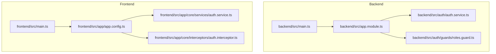
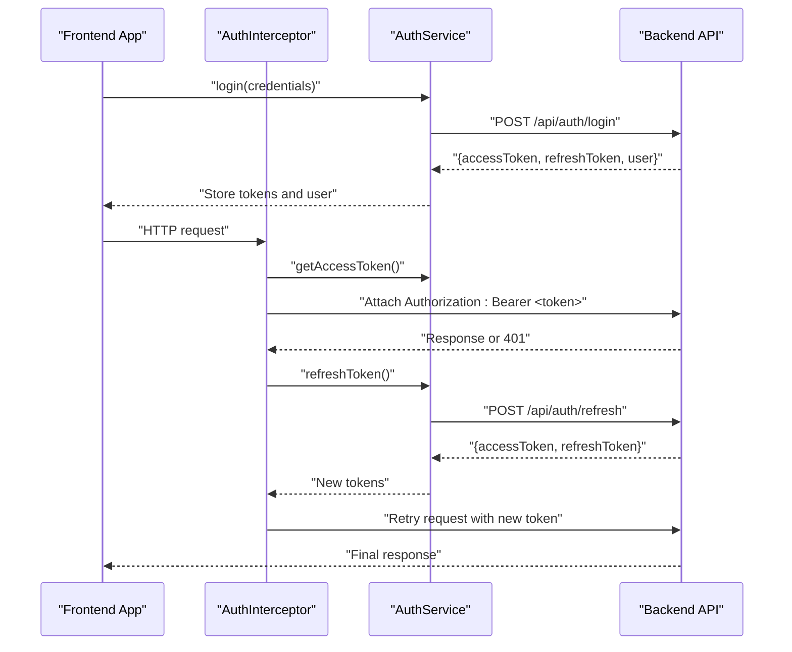
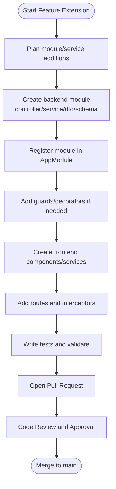
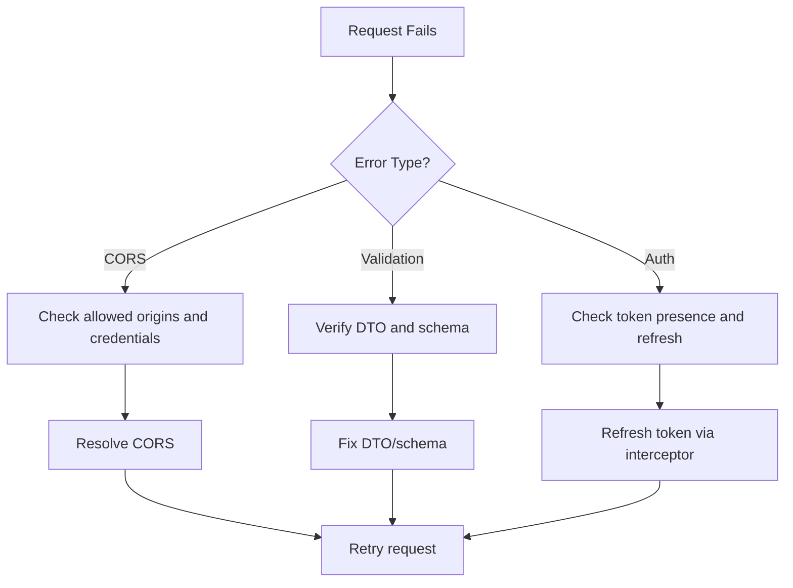

# Contributing Guidelines

<cite>
**Referenced Files in This Document**
- [setup_guide.md](file://setup_guide.md)
- [project_overview.md](file://project_overview.md)
- [backend/package.json](file://backend/package.json)
- [frontend/package.json](file://frontend/package.json)
- [backend/src/main.ts](file://backend/src/main.ts)
- [backend/src/app.module.ts](file://backend/src/app.module.ts)
- [backend/src/auth/auth.service.ts](file://backend/src/auth/auth.service.ts)
- [backend/src/auth/guards/auth.guard.ts](file://backend/src/auth/guards/auth.guard.ts)
- [backend/src/auth/guards/roles.guard.ts](file://backend/src/auth/guards/roles.guard.ts)
- [frontend/src/main.ts](file://frontend/src/main.ts)
- [frontend/src/app/app.config.ts](file://frontend/src/app/app.config.ts)
- [frontend/src/app/core/services/auth.service.ts](file://frontend/src/app/core/services/auth.service.ts)
- [frontend/src/app/core/interceptors/auth.interceptor.ts](file://frontend/src/app/core/interceptors/auth.interceptor.ts)
</cite>

## Table of Contents
1. [Introduction](#introduction)
2. [Project Structure](#project-structure)
3. [Core Components](#core-components)
4. [Architecture Overview](#architecture-overview)
5. [Development Workflow](#development-workflow)
6. [Code Contribution Process](#code-contribution-process)
7. [Pull Request Guidelines](#pull-request-guidelines)
8. [Issue Reporting Procedures](#issue-reporting-procedures)
9. [Code Standards and Conventions](#code-standards-and-conventions)
10. [Development Environment Setup](#development-environment-setup)
11. [Testing Requirements](#testing-requirements)
12. [Review Processes](#review-processes)
13. [Branch Management Strategy](#branch-management-strategy)
14. [Adding New Features and Extending Functionality](#adding-new-features-and-extending-functionality)
15. [Maintaining Backward Compatibility](#maintaining-backward-compatibility)
16. [Community Guidelines and Recognition](#community-guidelines-and-recognition)
17. [Troubleshooting Guide](#troubleshooting-guide)
18. [Conclusion](#conclusion)

## Introduction
Thank you for your interest in contributing to the Multi-Application-Control-Dashboard project. This document provides comprehensive guidance for contributors on how to develop, test, and improve the system. It covers the development workflow, code contribution process, pull request guidelines, issue reporting procedures, code standards, environment setup, testing requirements, review processes, branch management, feature extension, backward compatibility, community participation, and recognition.

## Project Structure
The project is organized into two primary applications:
- Backend: NestJS application providing REST APIs, authentication, RBAC, and module-specific services.
- Frontend: Angular application implementing route guards, HTTP interceptors, services, and UI components.

Key characteristics:
- Backend entry point initializes global CORS, validation pipes, and sets a global API prefix.
- Frontend bootstraps the application and registers HTTP interceptors and route guards globally.

**Diagram sources**
- [backend/src/main.ts](file://backend/src/main.ts#L1-L54)
- [backend/src/app.module.ts](file://backend/src/app.module.ts#L1-L41)
- [backend/src/auth/auth.service.ts](file://backend/src/auth/auth.service.ts#L1-L125)
- [backend/src/auth/guards/roles.guard.ts](file://backend/src/auth/guards/roles.guard.ts#L1-L23)
- [frontend/src/main.ts](file://frontend/src/main.ts#L1-L7)
- [frontend/src/app/app.config.ts](file://frontend/src/app/app.config.ts#L1-L34)
- [frontend/src/app/core/services/auth.service.ts](file://frontend/src/app/core/services/auth.service.ts#L1-L161)
- [frontend/src/app/core/interceptors/auth.interceptor.ts](file://frontend/src/app/core/interceptors/auth.interceptor.ts#L1-L46)

**Section sources**
- [project_overview.md](file://project_overview.md#L1-L123)
- [setup_guide.md](file://setup_guide.md#L290-L350)
- [backend/src/main.ts](file://backend/src/main.ts#L1-L54)
- [backend/src/app.module.ts](file://backend/src/app.module.ts#L1-L41)
- [frontend/src/main.ts](file://frontend/src/main.ts#L1-L7)
- [frontend/src/app/app.config.ts](file://frontend/src/app/app.config.ts#L1-L34)

## Core Components
- Backend
  - Global initialization: CORS configuration, validation pipe, global API prefix.
  - Module composition: centralized imports for auth, users, roles, permissions, modules, analytics, audit logs, dashboard stats, and feature modules.
  - Authentication service: user validation, registration, token generation, refresh, logout, and profile retrieval.
  - Guards: JWT and role-based guards for protecting endpoints.
- Frontend
  - Bootstrap: application initialization.
  - DI configuration: HTTP interceptors and route guards registered globally.
  - Authentication service: login, register, logout, token refresh, and profile retrieval.
  - HTTP interceptor: automatic Authorization header injection and token refresh on 401 errors.

**Section sources**
- [backend/src/main.ts](file://backend/src/main.ts#L1-L54)
- [backend/src/app.module.ts](file://backend/src/app.module.ts#L1-L41)
- [backend/src/auth/auth.service.ts](file://backend/src/auth/auth.service.ts#L1-L125)
- [backend/src/auth/guards/auth.guard.ts](file://backend/src/auth/guards/auth.guard.ts#L1-L26)
- [backend/src/auth/guards/roles.guard.ts](file://backend/src/auth/guards/roles.guard.ts#L1-L23)
- [frontend/src/main.ts](file://frontend/src/main.ts#L1-L7)
- [frontend/src/app/app.config.ts](file://frontend/src/app/app.config.ts#L1-L34)
- [frontend/src/app/core/services/auth.service.ts](file://frontend/src/app/core/services/auth.service.ts#L1-L161)
- [frontend/src/app/core/interceptors/auth.interceptor.ts](file://frontend/src/app/core/interceptors/auth.interceptor.ts#L1-L46)

## Architecture Overview
The system follows a client-server architecture:
- Backend exposes REST endpoints under a global prefix, secured with JWT and role-based guards.
- Frontend consumes the backend via HTTP calls, automatically attaching Authorization headers and refreshing tokens when needed.

**Diagram sources**
- [frontend/src/app/core/interceptors/auth.interceptor.ts](file://frontend/src/app/core/interceptors/auth.interceptor.ts#L1-L46)
- [frontend/src/app/core/services/auth.service.ts](file://frontend/src/app/core/services/auth.service.ts#L1-L161)
- [backend/src/auth/auth.service.ts](file://backend/src/auth/auth.service.ts#L1-L125)

**Section sources**
- [backend/src/main.ts](file://backend/src/main.ts#L1-L54)
- [backend/src/app.module.ts](file://backend/src/app.module.ts#L1-L41)
- [frontend/src/app/app.config.ts](file://frontend/src/app/app.config.ts#L1-L34)

## Development Workflow
- Fork and clone the repository.
- Install dependencies for both backend and frontend.
- Start MongoDB locally or via Docker.
- Configure environment variables using the provided example.
- Run backend in watch mode and frontend in development server.
- Implement changes following the established patterns and conventions.
- Commit, push, and open a pull request.

**Section sources**
- [setup_guide.md](file://setup_guide.md#L1-L410)
- [backend/package.json](file://backend/package.json#L1-L45)
- [frontend/package.json](file://frontend/package.json#L1-L43)

## Code Contribution Process
- Create a feature branch from the latest main.
- Make focused commits with clear messages.
- Ensure tests pass and code adheres to style and architecture guidelines.
- Open a pull request with a detailed description and links to related issues.

**Section sources**
- [setup_guide.md](file://setup_guide.md#L1-L410)

## Pull Request Guidelines
- Keep PRs small and focused.
- Include a summary of changes, rationale, and testing steps.
- Reference related issues.
- Ensure CI checks pass and reviews are completed before merging.

**Section sources**
- [setup_guide.md](file://setup_guide.md#L1-L410)

## Issue Reporting Procedures
- Use the repository’s issue templates to report bugs and request features.
- Provide environment details, reproduction steps, expected vs. actual behavior, and logs if applicable.

**Section sources**
- [setup_guide.md](file://setup_guide.md#L1-L410)

## Code Standards and Conventions
- Backend
  - NestJS modules, services, controllers, DTOs, and schemas follow a consistent structure.
  - Global validation pipe enforces whitelisting and transformation.
  - Guard usage ensures RBAC enforcement.
- Frontend
  - Angular services and interceptors are registered via app config.
  - Signal-based stores and services are encouraged for state management.
  - HTTP interceptors centralize auth and error handling.

**Section sources**
- [backend/src/main.ts](file://backend/src/main.ts#L1-L54)
- [backend/src/auth/guards/roles.guard.ts](file://backend/src/auth/guards/roles.guard.ts#L1-L23)
- [frontend/src/app/app.config.ts](file://frontend/src/app/app.config.ts#L1-L34)
- [frontend/src/app/core/interceptors/auth.interceptor.ts](file://frontend/src/app/core/interceptors/auth.interceptor.ts#L1-L46)

## Development Environment Setup
- Backend
  - Install dependencies, configure .env from .env.example, start MongoDB, optionally seed initial data, and run in dev or prod mode.
- Frontend
  - Install dependencies, create environment files, configure API URL, and run the development server.

**Section sources**
- [setup_guide.md](file://setup_guide.md#L1-L410)
- [backend/package.json](file://backend/package.json#L1-L45)
- [frontend/package.json](file://frontend/package.json#L1-L43)

## Testing Requirements
- Backend scripts include build, dev, debug, and seed commands.
- Frontend scripts include serve, build, watch, and test commands.
- Ensure new features include unit and integration tests where applicable.

**Section sources**
- [backend/package.json](file://backend/package.json#L1-L45)
- [frontend/package.json](file://frontend/package.json#L1-L43)

## Review Processes
- All contributions require review and approval.
- Reviewers check adherence to architecture, code quality, security, and testing.

**Section sources**
- [setup_guide.md](file://setup_guide.md#L1-L410)

## Branch Management Strategy
- Use feature branches for new work.
- Rebase or merge main regularly to keep branches up-to-date.
- Squash or reword commits prior to merging.

**Section sources**
- [setup_guide.md](file://setup_guide.md#L1-L410)

## Adding New Features and Extending Functionality
- Backend
  - Add a new module with its own controller, service, DTOs, and schema.
  - Register the module in the main application module.
  - Implement guards and decorators as needed.
- Frontend
  - Create feature components and services.
  - Integrate route guards and interceptors.
  - Add routing and UI components following existing patterns.

**Diagram sources**
- [backend/src/app.module.ts](file://backend/src/app.module.ts#L1-L41)
- [backend/src/auth/guards/roles.guard.ts](file://backend/src/auth/guards/roles.guard.ts#L1-L23)
- [frontend/src/app/app.config.ts](file://frontend/src/app/app.config.ts#L1-L34)

**Section sources**
- [project_overview.md](file://project_overview.md#L1-L123)
- [setup_guide.md](file://setup_guide.md#L290-L350)

## Maintaining Backward Compatibility
- Avoid breaking changes to public APIs.
- Deprecate features with migration paths.
- Update documentation and changelogs accordingly.

**Section sources**
- [setup_guide.md](file://setup_guide.md#L1-L410)

## Community Guidelines and Recognition
- Be respectful and inclusive.
- Follow communication channels and guidelines outlined in the repository.
- Contributions are acknowledged per project policy.

**Section sources**
- [setup_guide.md](file://setup_guide.md#L1-L410)

## Troubleshooting Guide
- CORS issues: Verify allowed origins and credentials in the backend bootstrap.
- Validation errors: Ensure DTOs match schema and global validation pipe is applied.
- Authentication failures: Confirm tokens are present and refreshed when needed.
- Frontend auth: Check interceptor attaches Authorization headers and handles 401 responses.

**Diagram sources**
- [backend/src/main.ts](file://backend/src/main.ts#L1-L54)
- [frontend/src/app/core/interceptors/auth.interceptor.ts](file://frontend/src/app/core/interceptors/auth.interceptor.ts#L1-L46)

**Section sources**
- [backend/src/main.ts](file://backend/src/main.ts#L1-L54)
- [frontend/src/app/core/interceptors/auth.interceptor.ts](file://frontend/src/app/core/interceptors/auth.interceptor.ts#L1-L46)

## Conclusion
By following these guidelines, contributors can efficiently collaborate on the Multi-Application-Control-Dashboard project while maintaining high-quality standards, strong security, and a consistent developer experience across both backend and frontend.