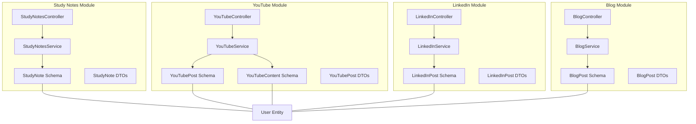
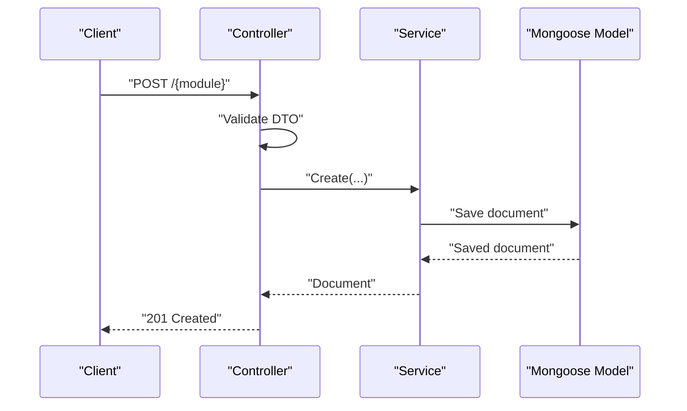
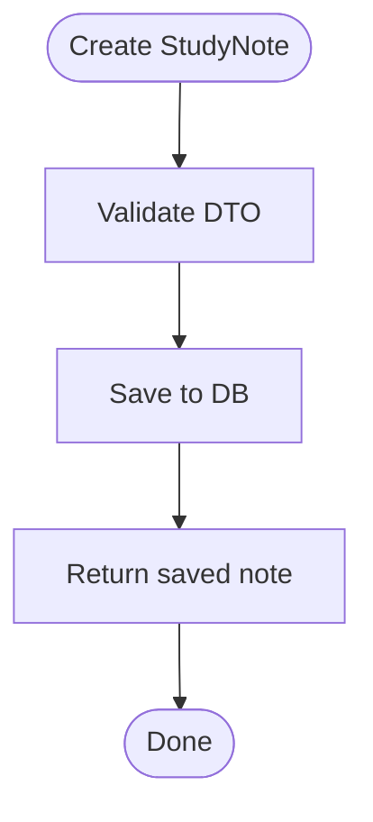
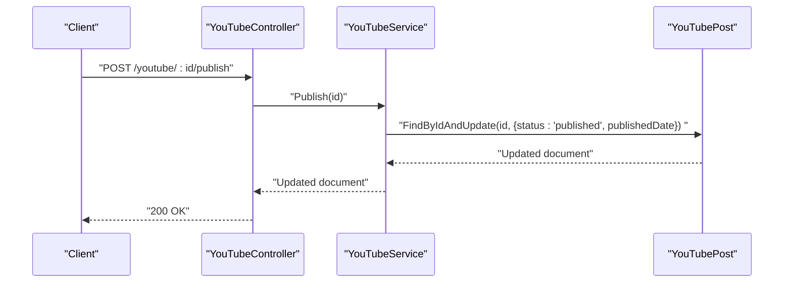
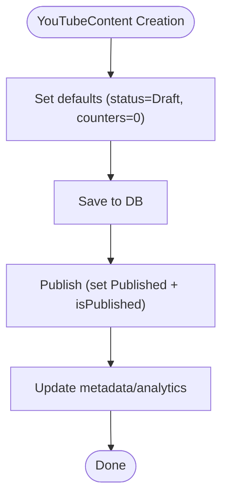
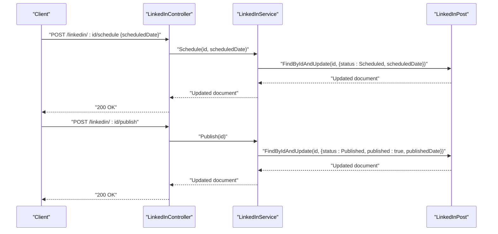
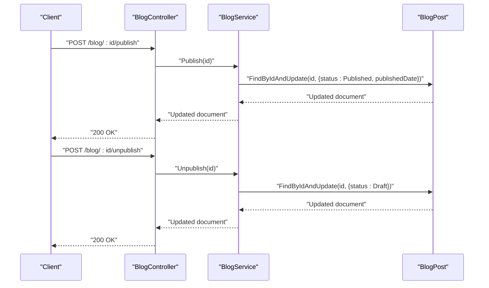
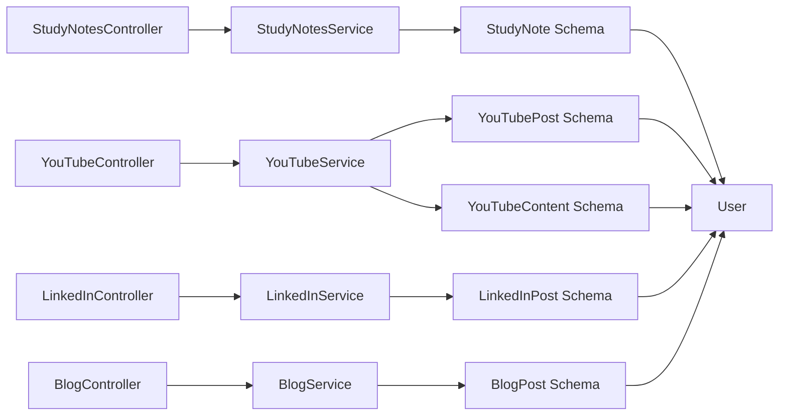

# Content Document Schemas

<cite>
**Referenced Files in This Document**
- [study-note.schema.ts](file://backend/src/study-notes/schemas/study-note.schema.ts)
- [study-note.dto.ts](file://backend/src/study-notes/dto/study-note.dto.ts)
- [study-notes.controller.ts](file://backend/src/study-notes/study-notes.controller.ts)
- [study-notes.service.ts](file://backend/src/study-notes/study-notes.service.ts)
- [youtube-post.schema.ts](file://backend/src/youtube/schemas/youtube-post.schema.ts)
- [youtube-content.schema.ts](file://backend/src/youtube/schemas/youtube-content.schema.ts)
- [youtube-post.dto.ts](file://backend/src/youtube/dto/youtube-post.dto.ts)
- [youtube.controller.ts](file://backend/src/youtube/youtube.controller.ts)
- [youtube.service.ts](file://backend/src/youtube/youtube.service.ts)
- [linkedin-post.schema.ts](file://backend/src/linkedin/schemas/linkedin-post.schema.ts)
- [linkedin-post.dto.ts](file://backend/src/linkedin/dto/linkedin-post.dto.ts)
- [linkedin.controller.ts](file://backend/src/linkedin/linkedin.controller.ts)
- [linkedin.service.ts](file://backend/src/linkedin/linkedin.service.ts)
- [blog-post.schema.ts](file://backend/src/blog/schemas/blog-post.schema.ts)
- [blog-post.dto.ts](file://backend/src/blog/dto/blog-post.dto.ts)
- [blog.controller.ts](file://backend/src/blog/blog.controller.ts)
- [blog.service.ts](file://backend/src/blog/blog.service.ts)
</cite>

## Table of Contents
1. [Introduction](#introduction)
2. [Project Structure](#project-structure)
3. [Core Components](#core-components)
4. [Architecture Overview](#architecture-overview)
5. [Detailed Component Analysis](#detailed-component-analysis)
6. [Dependency Analysis](#dependency-analysis)
7. [Performance Considerations](#performance-considerations)
8. [Troubleshooting Guide](#troubleshooting-guide)
9. [Conclusion](#conclusion)

## Introduction
This document describes the content document schemas used across the Multi-Application-Control-Dashboard platform. It focuses on four primary content types:
- StudyNote: personal notes with categorization, tagging, and privacy controls
- YouTubePost and YouTubeContent: YouTube video posts and content records with metadata and analytics
- LinkedInPost: social media posts with scheduling and analytics
- BlogPost: articles with publishing workflows and content management

For each schema, we document fields, data types, validation rules, relationships with core entities (notably Users), lifecycle management, status tracking, and search optimization strategies. We also provide examples of content creation, modification, and publishing/archival workflows.

## Project Structure
The schemas are implemented using NestJS Mongoose with separate DTOs for validation and controllers/services for API and business logic.

**Diagram sources**
- [study-note.schema.ts](file://backend/src/study-notes/schemas/study-note.schema.ts#L1-L35)
- [youtube-post.schema.ts](file://backend/src/youtube/schemas/youtube-post.schema.ts#L1-L37)
- [youtube-content.schema.ts](file://backend/src/youtube/schemas/youtube-content.schema.ts#L1-L70)
- [linkedin-post.schema.ts](file://backend/src/linkedin/schemas/linkedin-post.schema.ts#L1-L84)
- [blog-post.schema.ts](file://backend/src/blog/schemas/blog-post.schema.ts#L1-L46)
- [study-notes.controller.ts](file://backend/src/study-notes/study-notes.controller.ts#L1-L56)
- [youtube.controller.ts](file://backend/src/youtube/youtube.controller.ts#L1-L51)
- [linkedin.controller.ts](file://backend/src/linkedin/linkedin.controller.ts#L1-L62)
- [blog.controller.ts](file://backend/src/blog/blog.controller.ts#L1-L62)

**Section sources**
- [study-note.schema.ts](file://backend/src/study-notes/schemas/study-note.schema.ts#L1-L35)
- [youtube-post.schema.ts](file://backend/src/youtube/schemas/youtube-post.schema.ts#L1-L37)
- [youtube-content.schema.ts](file://backend/src/youtube/schemas/youtube-content.schema.ts#L1-L70)
- [linkedin-post.schema.ts](file://backend/src/linkedin/schemas/linkedin-post.schema.ts#L1-L84)
- [blog-post.schema.ts](file://backend/src/blog/schemas/blog-post.schema.ts#L1-L46)

## Core Components
This section summarizes each content schema’s purpose, key fields, and validation rules.

- StudyNote
  - Purpose: Personal notes with categorization, tagging, and visibility controls
  - Key fields: title, content, author (User), category, tags, isPublic, views, subject, priority
  - Validation: DTO enforces string types, optional arrays/booleans, and optional priority enum
  - Lifecycle: CRUD endpoints; increment views on read; public search by title/content/tags/subject
  - Relationship: author references User

- YouTubePost
  - Purpose: Lightweight YouTube post record with basic metadata and analytics counters
  - Key fields: title, description, videoId, author (User), status, thumbnailUrl, views, likes, publishedDate
  - Validation: DTO enforces string types; status defaults to draft
  - Lifecycle: CRUD endpoints; explicit publish action sets status and publishedDate
  - Relationship: author references User

- YouTubeContent
  - Purpose: Rich YouTube content record with comprehensive metadata and status management
  - Key fields: title, description, videoId, videoUrl, thumbnail/thumbnailUrl, duration, category, tags, playlists, status, createdBy/lastModifiedBy (User), views, likes, publishedAt, isPublished, metadata
  - Validation: Enum-based status; arrays for tags/playlists; nested metadata object
  - Lifecycle: CRUD endpoints; status transitions via service methods; analytics counters maintained
  - Relationship: createdBy/lastModifiedBy reference User

- LinkedInPost
  - Purpose: LinkedIn social post with scheduling and analytics
  - Key fields: title, content, status, author (User), scheduledDate, likes/comments/shares, imageUrl, published, publishedDate, views, hashtags, linkedInPostId, createdBy/updatedBy, analytics, metadata, timestamps
  - Validation: DTO enforces enums for status; optional dates and arrays; analytics object shape
  - Lifecycle: CRUD endpoints; schedule/publish actions set status and timestamps; indexes optimize queries
  - Relationship: author references User; createdBy/updatedBy as strings

- BlogPost
  - Purpose: Article with publishing workflow and content management
  - Key fields: title, content, excerpt, author (User), status, tags, views, likes, comments, featuredImage, publishedDate
  - Validation: DTO enforces enums for status; optional arrays and images
  - Lifecycle: CRUD endpoints; publish/unpublish actions toggle status and set publishedDate
  - Relationship: author references User

**Section sources**
- [study-note.schema.ts](file://backend/src/study-notes/schemas/study-note.schema.ts#L4-L32)
- [study-note.dto.ts](file://backend/src/study-notes/dto/study-note.dto.ts#L3-L32)
- [youtube-post.schema.ts](file://backend/src/youtube/schemas/youtube-post.schema.ts#L6-L34)
- [youtube-post.dto.ts](file://backend/src/youtube/dto/youtube-post.dto.ts#L3-L19)
- [youtube-content.schema.ts](file://backend/src/youtube/schemas/youtube-content.schema.ts#L12-L67)
- [linkedin-post.schema.ts](file://backend/src/linkedin/schemas/linkedin-post.schema.ts#L13-L79)
- [linkedin-post.dto.ts](file://backend/src/linkedin/dto/linkedin-post.dto.ts#L4-L25)
- [blog-post.schema.ts](file://backend/src/blog/schemas/blog-post.schema.ts#L9-L43)
- [blog-post.dto.ts](file://backend/src/blog/dto/blog-post.dto.ts#L4-L25)

## Architecture Overview
The platform follows a layered architecture:
- Controllers handle HTTP requests and delegate to Services
- Services encapsulate business logic and orchestrate Mongoose models
- Schemas define MongoDB documents and relationships
- DTOs enforce validation rules at the API boundary

**Diagram sources**
- [study-notes.controller.ts](file://backend/src/study-notes/study-notes.controller.ts#L11-L14)
- [study-notes.service.ts](file://backend/src/study-notes/study-notes.service.ts#L11-L14)
- [youtube.controller.ts](file://backend/src/youtube/youtube.controller.ts#L11-L14)
- [youtube.service.ts](file://backend/src/youtube/youtube.service.ts#L11-L14)
- [linkedin.controller.ts](file://backend/src/linkedin/linkedin.controller.ts#L12-L15)
- [linkedin.service.ts](file://backend/src/linkedin/linkedin.service.ts#L11-L14)
- [blog.controller.ts](file://backend/src/blog/blog.controller.ts#L12-L15)
- [blog.service.ts](file://backend/src/blog/blog.service.ts#L11-L14)

## Detailed Component Analysis

### StudyNote Schema
- Fields and types
  - title: string (required)
  - content: string (required)
  - author: ObjectId referencing User (required)
  - category: string (optional)
  - tags: string[] (optional)
  - isPublic: boolean (default false)
  - views: number (default 0)
  - subject: string (optional)
  - priority: "low" | "medium" | "high" (optional)
- Validation rules
  - DTO enforces string types for title/content/subject/priority
  - Optional fields allow omission
  - Arrays validated as arrays
- Relationships
  - author references User entity
- Lifecycle and search
  - Views incremented on read
  - Public search across title, content, tags, and subject
  - Filtering by category and author
- Examples
  - Creation: submit DTO with title, content, author, optional tags/category/subject/priority
  - Modification: update title/content/tags/isPublic
  - Archival: set isPublic=false or delete

**Diagram sources**
- [study-note.dto.ts](file://backend/src/study-notes/dto/study-note.dto.ts#L3-L32)
- [study-notes.service.ts](file://backend/src/study-notes/study-notes.service.ts#L11-L14)

**Section sources**
- [study-note.schema.ts](file://backend/src/study-notes/schemas/study-note.schema.ts#L4-L32)
- [study-note.dto.ts](file://backend/src/study-notes/dto/study-note.dto.ts#L3-L32)
- [study-notes.controller.ts](file://backend/src/study-notes/study-notes.controller.ts#L11-L14)
- [study-notes.service.ts](file://backend/src/study-notes/study-notes.service.ts#L11-L14)

### YouTubePost Schema
- Fields and types
  - title: string (required)
  - description: string (required)
  - videoId: string (required)
  - author: ObjectId referencing User (required)
  - status: enum "draft" | "published" (default "draft")
  - thumbnailUrl: string (optional)
  - views: number (default 0)
  - likes: number (default 0)
  - publishedDate: Date (optional)
- Validation rules
  - DTO enforces string types; optional thumbnailUrl
  - Status defaults to draft
- Relationships
  - author references User
- Lifecycle and publishing
  - Publish action sets status to "published" and adds publishedDate
- Examples
  - Creation: submit DTO with title, description, videoId, author
  - Modification: update title/description/thumbnailUrl/status
  - Publishing: POST /youtube/{id}/publish

**Diagram sources**
- [youtube.controller.ts](file://backend/src/youtube/youtube.controller.ts#L46-L49)
- [youtube.service.ts](file://backend/src/youtube/youtube.service.ts#L51-L59)
- [youtube-post.schema.ts](file://backend/src/youtube/schemas/youtube-post.schema.ts#L20-L21)

**Section sources**
- [youtube-post.schema.ts](file://backend/src/youtube/schemas/youtube-post.schema.ts#L6-L34)
- [youtube-post.dto.ts](file://backend/src/youtube/dto/youtube-post.dto.ts#L3-L19)
- [youtube.controller.ts](file://backend/src/youtube/youtube.controller.ts#L46-L49)
- [youtube.service.ts](file://backend/src/youtube/youtube.service.ts#L51-L59)

### YouTubeContent Schema
- Fields and types
  - title: string (required)
  - description: string (optional)
  - videoId: string (required)
  - videoUrl: string (optional)
  - thumbnail: string (optional)
  - thumbnailUrl: string (optional)
  - duration: string (optional)
  - category: string (optional)
  - tags: string[] (default [])
  - playlists: string[] (default [])
  - status: enum Draft/Published/Archived (default Draft)
  - createdBy/lastModifiedBy: ObjectId referencing User (required/optional)
  - views: number (default 0)
  - likes: number (default 0)
  - publishedAt: Date (optional)
  - isPublished: boolean (default false)
  - metadata: object (default {})
- Validation rules
  - Enum-based status; arrays default to empty; nested metadata object
- Relationships
  - createdBy/lastModifiedBy reference User
- Lifecycle and analytics
  - Analytics counters (views/likes) maintained
  - Status transitions managed via service methods
- Examples
  - Creation: submit DTO with title/videoId; status defaults to Draft
  - Modification: update tags/playlists/status/metadata
  - Publishing: set status to Published and isPublished=true

**Diagram sources**
- [youtube-content.schema.ts](file://backend/src/youtube/schemas/youtube-content.schema.ts#L12-L67)

**Section sources**
- [youtube-content.schema.ts](file://backend/src/youtube/schemas/youtube-content.schema.ts#L6-L67)

### LinkedInPost Schema
- Fields and types
  - title: string (required)
  - content: string (required)
  - status: enum Draft/Scheduled/Published/Archived (default Draft)
  - author: ObjectId referencing User (required)
  - scheduledDate: Date (optional)
  - likes/comments/shares: numbers (defaults 0)
  - imageUrl: string (optional)
  - published: boolean (default false)
  - publishedDate: Date (optional)
  - views: number (default 0)
  - hashtags: string[] (default [])
  - linkedInPostId: string (optional)
  - createdBy: string (userId) (required)
  - updatedBy: string (userId) (optional)
  - analytics: object with impressions/clicks/engagementRate/reach (optional)
  - metadata: object (optional)
  - createdAt/updatedAt: Date (optional)
- Validation rules
  - DTO enforces enums for status; optional dates and arrays; analytics object shape
- Relationships
  - author references User; createdBy/updatedBy as strings
- Lifecycle and scheduling
  - Schedule action sets status=Scheduled and scheduledDate
  - Publish action sets status=Published, published=true, publishedDate
  - Indexes support status/createdAt and scheduledDate queries
- Examples
  - Creation: submit DTO with title/content/author; status defaults to Draft
  - Modification: update content/imageUrl/hashtags/status/scheduledDate
  - Scheduling: POST /linkedin/{id}/schedule with scheduledDate
  - Publishing: POST /linkedin/{id}/publish

**Diagram sources**
- [linkedin.controller.ts](file://backend/src/linkedin/linkedin.controller.ts#L52-L60)
- [linkedin.service.ts](file://backend/src/linkedin/linkedin.service.ts#L49-L67)
- [linkedin-post.schema.ts](file://backend/src/linkedin/schemas/linkedin-post.schema.ts#L6-L22)

**Section sources**
- [linkedin-post.schema.ts](file://backend/src/linkedin/schemas/linkedin-post.schema.ts#L6-L79)
- [linkedin-post.dto.ts](file://backend/src/linkedin/dto/linkedin-post.dto.ts#L4-L51)
- [linkedin.controller.ts](file://backend/src/linkedin/linkedin.controller.ts#L52-L60)
- [linkedin.service.ts](file://backend/src/linkedin/linkedin.service.ts#L49-L67)

### BlogPost Schema
- Fields and types
  - title: string (required)
  - content: string (required)
  - excerpt: string (optional)
  - author: ObjectId referencing User (required)
  - status: enum Draft/Published (default Draft)
  - tags: string[] (default [])
  - views: number (default 0)
  - likes: number (default 0)
  - comments: number (default 0)
  - featuredImage: string (optional)
  - publishedDate: Date (optional)
- Validation rules
  - DTO enforces enums for status; optional arrays and images
- Relationships
  - author references User
- Lifecycle and publishing
  - Publish action sets status=Published and publishedDate
  - Unpublish action reverts to Draft
- Search optimization
  - Full-text search across title, content, and tags for published posts
- Examples
  - Creation: submit DTO with title/content/author; status defaults to Draft
  - Modification: update content/excerpt/tags/featuredImage/status
  - Publishing: POST /blog/{id}/publish
  - Unpublishing: POST /blog/{id}/unpublish

**Diagram sources**
- [blog.controller.ts](file://backend/src/blog/blog.controller.ts#L52-L60)
- [blog.service.ts](file://backend/src/blog/blog.service.ts#L40-L54)
- [blog-post.schema.ts](file://backend/src/blog/schemas/blog-post.schema.ts#L4-L24)

**Section sources**
- [blog-post.schema.ts](file://backend/src/blog/schemas/blog-post.schema.ts#L4-L43)
- [blog-post.dto.ts](file://backend/src/blog/dto/blog-post.dto.ts#L4-L51)
- [blog.controller.ts](file://backend/src/blog/blog.controller.ts#L52-L60)
- [blog.service.ts](file://backend/src/blog/blog.service.ts#L40-L54)

## Dependency Analysis
- Controllers depend on Services
- Services depend on Mongoose models (schemas)
- Schemas define relationships with User and other entities
- DTOs validate inputs before reaching Services

**Diagram sources**
- [study-notes.controller.ts](file://backend/src/study-notes/study-notes.controller.ts#L1-L56)
- [youtube.controller.ts](file://backend/src/youtube/youtube.controller.ts#L1-L51)
- [linkedin.controller.ts](file://backend/src/linkedin/linkedin.controller.ts#L1-L62)
- [blog.controller.ts](file://backend/src/blog/blog.controller.ts#L1-L62)
- [study-note.schema.ts](file://backend/src/study-notes/schemas/study-note.schema.ts#L12-L13)
- [youtube-post.schema.ts](file://backend/src/youtube/schemas/youtube-post.schema.ts#L17-L18)
- [youtube-content.schema.ts](file://backend/src/youtube/schemas/youtube-content.schema.ts#L47-L51)
- [linkedin-post.schema.ts](file://backend/src/linkedin/schemas/linkedin-post.schema.ts#L24-L25)
- [blog-post.schema.ts](file://backend/src/blog/schemas/blog-post.schema.ts#L20-L21)

**Section sources**
- [study-notes.controller.ts](file://backend/src/study-notes/study-notes.controller.ts#L1-L56)
- [youtube.controller.ts](file://backend/src/youtube/youtube.controller.ts#L1-L51)
- [linkedin.controller.ts](file://backend/src/linkedin/linkedin.controller.ts#L1-L62)
- [blog.controller.ts](file://backend/src/blog/blog.controller.ts#L1-L62)

## Performance Considerations
- Indexing
  - LinkedInPost schema defines indexes on status and createdAt, and scheduledDate to optimize listing and scheduling queries
- Aggregation
  - YouTubeService computes total views via aggregation for stats
- Sorting and population
  - Controllers sort by createdAt desc and populate author fields for readability
- Incremental counters
  - StudyNote and BlogPost increment views on read to avoid per-request counting overhead

**Section sources**
- [linkedin-post.schema.ts](file://backend/src/linkedin/schemas/linkedin-post.schema.ts#L82-L83)
- [youtube.service.ts](file://backend/src/youtube/youtube.service.ts#L65-L71)
- [study-notes.controller.ts](file://backend/src/study-notes/study-notes.controller.ts#L16-L18)
- [blog.controller.ts](file://backend/src/blog/blog.controller.ts#L17-L19)

## Troubleshooting Guide
- Validation errors
  - DTO validation ensures required fields are present and types match expectations
- Status transitions
  - Verify enum values align with schema definitions (e.g., YouTubePost status, LinkedInPost status)
- Relationships
  - Ensure author IDs reference existing User documents
- Scheduling
  - For LinkedIn, confirm scheduledDate is in the future when transitioning to Scheduled
- Analytics
  - For YouTubeContent and LinkedInPost, verify analytics fields are populated as needed

**Section sources**
- [study-note.dto.ts](file://backend/src/study-notes/dto/study-note.dto.ts#L1-L63)
- [youtube-post.dto.ts](file://backend/src/youtube/dto/youtube-post.dto.ts#L1-L38)
- [linkedin-post.dto.ts](file://backend/src/linkedin/dto/linkedin-post.dto.ts#L1-L52)
- [blog-post.dto.ts](file://backend/src/blog/dto/blog-post.dto.ts#L1-L52)

## Conclusion
The platform’s content schemas provide a consistent foundation for managing diverse content types while preserving strong typing, validation, and lifecycle controls. StudyNote emphasizes categorization and privacy; YouTubePost/Content focus on video metadata and analytics; LinkedInPost supports scheduling and social metrics; BlogPost enables robust article publishing workflows. Together, they enable scalable content management across modules with clear relationships to the User entity and optimized query patterns.