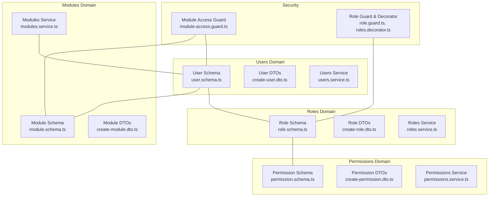
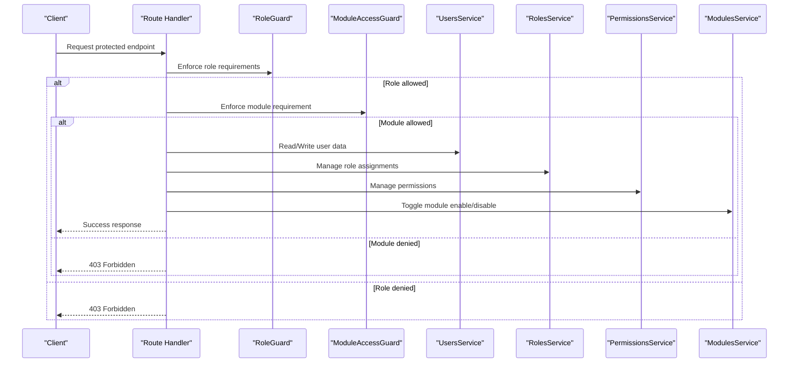
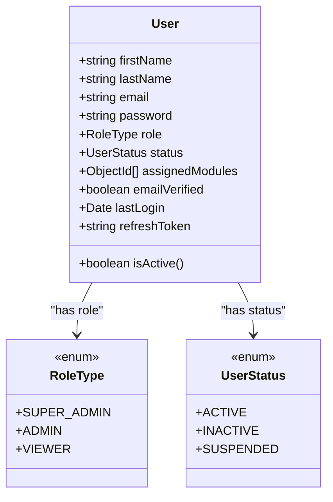
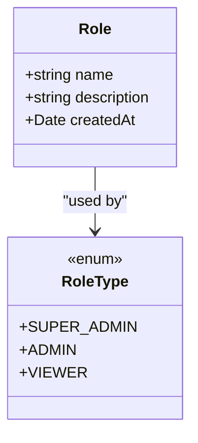
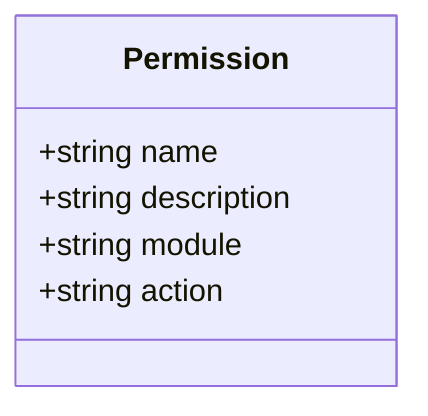
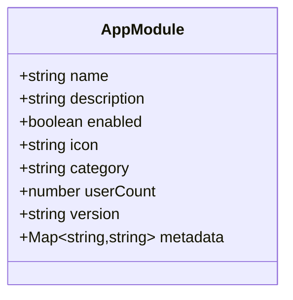
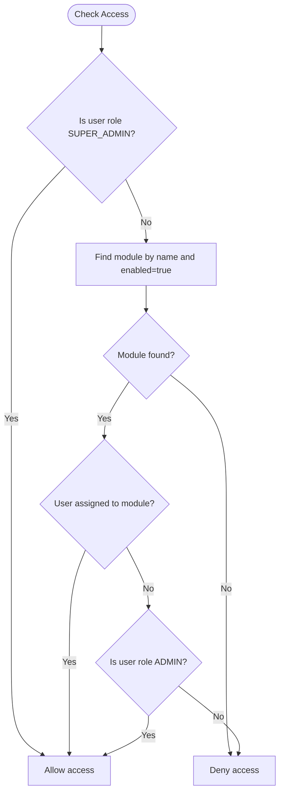
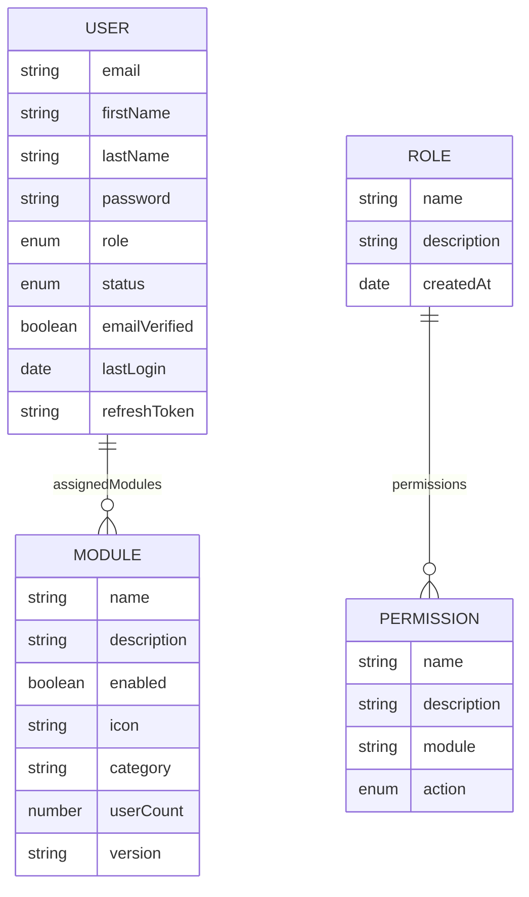
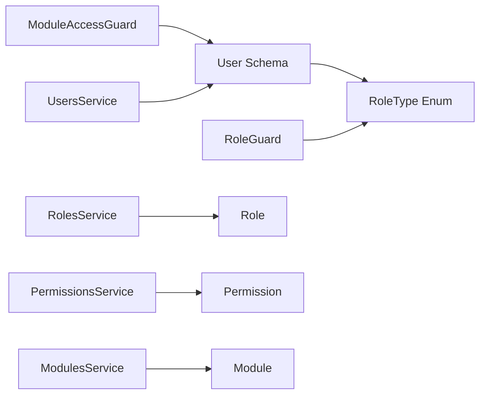

# Core Entity Schemas

<cite>
**Referenced Files in This Document**
- [user.schema.ts](file://backend/src/users/schemas/user.schema.ts)
- [role.schema.ts](file://backend/src/roles/schemas/role.schema.ts)
- [permission.schema.ts](file://backend/src/permissions/schemas/permission.schema.ts)
- [module.schema.ts](file://backend/src/modules/schemas/module.schema.ts)
- [create-user.dto.ts](file://backend/src/users/dto/create-user.dto.ts)
- [create-role.dto.ts](file://backend/src/roles/dto/create-role.dto.ts)
- [create-permission.dto.ts](file://backend/src/permissions/dto/create-permission.dto.ts)
- [create-module.dto.ts](file://backend/src/modules/dto/create-module.dto.ts)
- [users.service.ts](file://backend/src/users/users.service.ts)
- [roles.service.ts](file://backend/src/roles/roles.service.ts)
- [permissions.service.ts](file://backend/src/permissions/permissions.service.ts)
- [modules.service.ts](file://backend/src/modules/modules.service.ts)
- [module-access.guard.ts](file://backend/src/auth/guards/module-access.guard.ts)
- [role.guard.ts](file://backend/src/auth/guards/role.guard.ts)
- [roles.decorator.ts](file://backend/src/auth/decorators/roles.decorator.ts)
</cite>

## Table of Contents
1. [Introduction](#introduction)
2. [Project Structure](#project-structure)
3. [Core Components](#core-components)
4. [Architecture Overview](#architecture-overview)
5. [Detailed Component Analysis](#detailed-component-analysis)
6. [Dependency Analysis](#dependency-analysis)
7. [Performance Considerations](#performance-considerations)
8. [Troubleshooting Guide](#troubleshooting-guide)
9. [Conclusion](#conclusion)

## Introduction
This document describes the core entity schemas that underpin the Multi-Application-Control-Dashboard’s MongoDB implementation. It focuses on the User, Role, Permission, and Module entities, detailing their field definitions, data types, validation rules, and relationships. It also explains how status management, role assignments, module permissions, and hierarchical role types work together, along with virtual properties, schema transformations, and security considerations. Practical examples of schema relationships and referential integrity patterns are included to guide developers and administrators.

## Project Structure
The core schemas are implemented in NestJS Mongoose modules under backend/src. Each domain (users, roles, permissions, modules) has its own schema, DTO, controller, and service. Guards and decorators enforce role-based and module-based access control at runtime.

**Diagram sources**
- [user.schema.ts](file://backend/src/users/schemas/user.schema.ts#L1-L66)
- [role.schema.ts](file://backend/src/roles/schemas/role.schema.ts#L1-L25)
- [permission.schema.ts](file://backend/src/permissions/schemas/permission.schema.ts#L1-L20)
- [module.schema.ts](file://backend/src/modules/schemas/module.schema.ts#L1-L32)
- [users.service.ts](file://backend/src/users/users.service.ts#L1-L78)
- [roles.service.ts](file://backend/src/roles/roles.service.ts#L1-L47)
- [permissions.service.ts](file://backend/src/permissions/permissions.service.ts#L1-L35)
- [modules.service.ts](file://backend/src/modules/modules.service.ts#L1-L94)
- [module-access.guard.ts](file://backend/src/auth/guards/module-access.guard.ts#L1-L28)
- [role.guard.ts](file://backend/src/auth/guards/role.guard.ts#L1-L51)
- [roles.decorator.ts](file://backend/src/auth/decorators/roles.decorator.ts#L1-L5)

**Section sources**
- [user.schema.ts](file://backend/src/users/schemas/user.schema.ts#L1-L66)
- [role.schema.ts](file://backend/src/roles/schemas/role.schema.ts#L1-L25)
- [permission.schema.ts](file://backend/src/permissions/schemas/permission.schema.ts#L1-L20)
- [module.schema.ts](file://backend/src/modules/schemas/module.schema.ts#L1-L32)

## Core Components
This section outlines the four core entities and their primary characteristics.

- User
  - Purpose: Represents application users with identity, authentication, status, role, and module assignments.
  - Key fields: firstName, lastName, email (unique), password, role (enum), status (enum), assignedModules (array of Module IDs), emailVerified, lastLogin, refreshToken.
  - Status management: Enumerated status supports active, inactive, and suspended states.
  - Role assignment: Single role value drawn from RoleType.
  - Module permissions: assignedModules array links to Module documents.

- Role
  - Purpose: Defines roles with hierarchical semantics and optional permission/module associations.
  - Key fields: name (unique), description, createdAt.
  - RoleType: Enumerated values include super_admin, admin, viewer.

- Permission
  - Purpose: Encapsulates granular capabilities scoped to modules and actions.
  - Key fields: name (unique), description, module, action (enum: create, read, update, delete).

- Module
  - Purpose: Dynamic application module with enable/disable capability and metadata.
  - Key fields: name (unique), description, enabled (default true), icon, category, userCount (default 0), version, metadata (Map<String,String>).

Validation rules and constraints are enforced via Mongoose schema definitions and class-validator DTOs.

**Section sources**
- [user.schema.ts](file://backend/src/users/schemas/user.schema.ts#L1-L66)
- [role.schema.ts](file://backend/src/roles/schemas/role.schema.ts#L1-L25)
- [permission.schema.ts](file://backend/src/permissions/schemas/permission.schema.ts#L1-L20)
- [module.schema.ts](file://backend/src/modules/schemas/module.schema.ts#L1-L32)
- [create-user.dto.ts](file://backend/src/users/dto/create-user.dto.ts#L1-L57)
- [create-role.dto.ts](file://backend/src/roles/dto/create-role.dto.ts#L1-L25)
- [create-permission.dto.ts](file://backend/src/permissions/dto/create-permission.dto.ts#L1-L23)
- [create-module.dto.ts](file://backend/src/modules/dto/create-module.dto.ts#L1-L29)

## Architecture Overview
The system enforces access control through layered mechanisms:
- Role-based access control (RBAC) via RoleType and RoleGuard.
- Module-based access control via ModuleAccessGuard and user-assigned modules.
- Permission scoping via Permission records tied to modules and actions.
- Services orchestrate persistence and cross-entity operations.

**Diagram sources**
- [role.guard.ts](file://backend/src/auth/guards/role.guard.ts#L1-L51)
- [module-access.guard.ts](file://backend/src/auth/guards/module-access.guard.ts#L1-L28)
- [users.service.ts](file://backend/src/users/users.service.ts#L1-L78)
- [roles.service.ts](file://backend/src/roles/roles.service.ts#L1-L47)
- [permissions.service.ts](file://backend/src/permissions/permissions.service.ts#L1-L35)
- [modules.service.ts](file://backend/src/modules/modules.service.ts#L1-L94)

## Detailed Component Analysis

### User Schema
- Fields and types
  - firstName: string (required)
  - lastName: string (required)
  - email: string (required, unique)
  - password: string (required)
  - role: RoleType (required, default viewer)
  - status: UserStatus (enum, default active)
  - assignedModules: ObjectId[] (default [])
  - emailVerified: boolean (default false)
  - lastLogin: Date (optional)
  - refreshToken: string (optional)
- Validation
  - Mongoose schema enforces required fields and enums.
  - DTOs validate input shape and lengths.
- Virtual properties and transformations
  - isActive computed property based on status.
  - toJSON transformation removes sensitive fields and standardizes ID exposure.
- Security considerations
  - Passwords are hashed before storage.
  - Sensitive fields are excluded from JSON/Object outputs by default.
- Relationships
  - role references RoleType (via import).
  - assignedModules references Module documents.

**Diagram sources**
- [user.schema.ts](file://backend/src/users/schemas/user.schema.ts#L1-L66)
- [role.schema.ts](file://backend/src/roles/schemas/role.schema.ts#L1-L25)

**Section sources**
- [user.schema.ts](file://backend/src/users/schemas/user.schema.ts#L1-L66)
- [create-user.dto.ts](file://backend/src/users/dto/create-user.dto.ts#L1-L57)
- [users.service.ts](file://backend/src/users/users.service.ts#L1-L78)

### Role Schema
- Fields and types
  - name: string (required, unique)
  - description: string (optional)
  - createdAt: Date (default now)
- Validation
  - Unique name constraint enforced by schema.
  - DTOs validate length and presence.
- Relationships
  - RoleType defines enumerated role categories.
  - Roles can be associated with permissions and modules via services.

**Diagram sources**
- [role.schema.ts](file://backend/src/roles/schemas/role.schema.ts#L1-L25)

**Section sources**
- [role.schema.ts](file://backend/src/roles/schemas/role.schema.ts#L1-L25)
- [create-role.dto.ts](file://backend/src/roles/dto/create-role.dto.ts#L1-L25)
- [roles.service.ts](file://backend/src/roles/roles.service.ts#L1-L47)

### Permission Schema
- Fields and types
  - name: string (required, unique)
  - description: string (required)
  - module: string (required)
  - action: string (enum: create, read, update, delete)
- Validation
  - Unique name constraint enforced by schema.
  - Action constrained to predefined set.
- Relationships
  - Permissions are scoped to modules and actions.
  - Roles can be assigned sets of permissions via services.

**Diagram sources**
- [permission.schema.ts](file://backend/src/permissions/schemas/permission.schema.ts#L1-L20)

**Section sources**
- [permission.schema.ts](file://backend/src/permissions/schemas/permission.schema.ts#L1-L20)
- [create-permission.dto.ts](file://backend/src/permissions/dto/create-permission.dto.ts#L1-L23)
- [permissions.service.ts](file://backend/src/permissions/permissions.service.ts#L1-L35)

### Module Schema
- Fields and types
  - name: string (required, unique)
  - description: string (required)
  - enabled: boolean (required, default true)
  - icon: string (optional)
  - category: string (optional)
  - userCount: number (default 0)
  - version: string (optional)
  - metadata: Map<String,String> (default empty)
- Validation
  - Unique name constraint enforced by schema.
  - DTOs validate presence and types.
- Dynamic enable/disable
  - toggleModule operation updates enabled flag.
- Relationships
  - Users can be assigned to modules via assignedModules array.
  - Module access checks consider enabled state and user assignments.

**Diagram sources**
- [module.schema.ts](file://backend/src/modules/schemas/module.schema.ts#L1-L32)

**Section sources**
- [module.schema.ts](file://backend/src/modules/schemas/module.schema.ts#L1-L32)
- [create-module.dto.ts](file://backend/src/modules/dto/create-module.dto.ts#L1-L29)
- [modules.service.ts](file://backend/src/modules/modules.service.ts#L1-L94)

### Role Hierarchy and Permission Inheritance
- RoleType enumeration defines three levels: super_admin, admin, viewer.
- Super admins bypass module and permission restrictions.
- Admins gain broad access by default when no explicit module assignment is required.
- Permissions are scoped to modules and actions; roles can be assigned permission sets via services.

**Diagram sources**
- [modules.service.ts](file://backend/src/modules/modules.service.ts#L56-L93)
- [module-access.guard.ts](file://backend/src/auth/guards/module-access.guard.ts#L1-L28)
- [role.guard.ts](file://backend/src/auth/guards/role.guard.ts#L1-L51)

**Section sources**
- [role.schema.ts](file://backend/src/roles/schemas/role.schema.ts#L1-L25)
- [module-access.guard.ts](file://backend/src/auth/guards/module-access.guard.ts#L1-L28)
- [modules.service.ts](file://backend/src/modules/modules.service.ts#L56-L93)

### Schema Relationships and Referential Integrity Patterns
- User.role references RoleType (via import).
- User.assignedModules references Module documents.
- Roles can be associated with permissions and modules via services.
- Services implement operations to assign roles and modules to users and manage permissions.

**Diagram sources**
- [user.schema.ts](file://backend/src/users/schemas/user.schema.ts#L1-L66)
- [role.schema.ts](file://backend/src/roles/schemas/role.schema.ts#L1-L25)
- [permission.schema.ts](file://backend/src/permissions/schemas/permission.schema.ts#L1-L20)
- [module.schema.ts](file://backend/src/modules/schemas/module.schema.ts#L1-L32)

**Section sources**
- [users.service.ts](file://backend/src/users/users.service.ts#L41-L51)
- [roles.service.ts](file://backend/src/roles/roles.service.ts#L35-L45)
- [modules.service.ts](file://backend/src/modules/modules.service.ts#L56-L93)

## Dependency Analysis
- Internal dependencies
  - User schema imports RoleType from Role schema.
  - Guards depend on RoleType and user payload.
  - Services encapsulate persistence and cross-entity operations.
- External dependencies
  - Mongoose for schema definition and ODM.
  - class-validator for DTO validation.
  - bcrypt for password hashing.

**Diagram sources**
- [user.schema.ts](file://backend/src/users/schemas/user.schema.ts#L1-L66)
- [role.schema.ts](file://backend/src/roles/schemas/role.schema.ts#L1-L25)
- [module-access.guard.ts](file://backend/src/auth/guards/module-access.guard.ts#L1-L28)
- [role.guard.ts](file://backend/src/auth/guards/role.guard.ts#L1-L51)
- [users.service.ts](file://backend/src/users/users.service.ts#L1-L78)
- [roles.service.ts](file://backend/src/roles/roles.service.ts#L1-L47)
- [permissions.service.ts](file://backend/src/permissions/permissions.service.ts#L1-L35)
- [modules.service.ts](file://backend/src/modules/modules.service.ts#L1-L94)

**Section sources**
- [user.schema.ts](file://backend/src/users/schemas/user.schema.ts#L1-L66)
- [role.schema.ts](file://backend/src/roles/schemas/role.schema.ts#L1-L25)
- [module-access.guard.ts](file://backend/src/auth/guards/module-access.guard.ts#L1-L28)
- [role.guard.ts](file://backend/src/auth/guards/role.guard.ts#L1-L51)
- [users.service.ts](file://backend/src/users/users.service.ts#L1-L78)
- [roles.service.ts](file://backend/src/roles/roles.service.ts#L1-L47)
- [permissions.service.ts](file://backend/src/permissions/permissions.service.ts#L1-L35)
- [modules.service.ts](file://backend/src/modules/modules.service.ts#L1-L94)

## Performance Considerations
- Indexing recommendations
  - Ensure unique indexes on email (User), name (Role, Permission, Module).
  - Consider compound indexes for frequent queries (e.g., enabled + name on Module).
- Population vs. denormalization
  - Populate assignedModules on demand to avoid large document sizes.
  - Cache frequently accessed module lists for role-based decisions.
- Query optimization
  - Use selective projections (avoid returning passwords).
  - Paginate large result sets for listing operations.
- Hashing cost
  - Keep bcrypt cost factors balanced to prevent excessive CPU usage during authentication.

## Troubleshooting Guide
- Authentication failures
  - Verify password hashing and comparison logic in user service.
  - Confirm DTO validation for email and password lengths.
- Authorization failures
  - Check RoleGuard and ModuleAccessGuard conditions.
  - Ensure user payload contains role and assignedModules.
- Module access issues
  - Confirm module is enabled and user is assigned to it.
  - Validate module name casing and uniqueness.
- Data consistency
  - Review service methods for atomic updates (role assignment, module toggling).
  - Ensure DTOs align with schema constraints to prevent validation errors.

**Section sources**
- [users.service.ts](file://backend/src/users/users.service.ts#L66-L76)
- [role.guard.ts](file://backend/src/auth/guards/role.guard.ts#L13-L25)
- [module-access.guard.ts](file://backend/src/auth/guards/module-access.guard.ts#L7-L26)
- [modules.service.ts](file://backend/src/modules/modules.service.ts#L56-L93)

## Conclusion
The core entity schemas form a cohesive RBAC and module-based access control system. Users are governed by enumerated statuses and roles, assigned to modules, and restricted by permissions scoped to modules and actions. Guards and services enforce these policies at runtime, while schema transformations and virtual properties improve usability and security. By following the validation rules, referential patterns, and operational guidelines outlined here, teams can maintain a secure, extensible, and performant control dashboard.