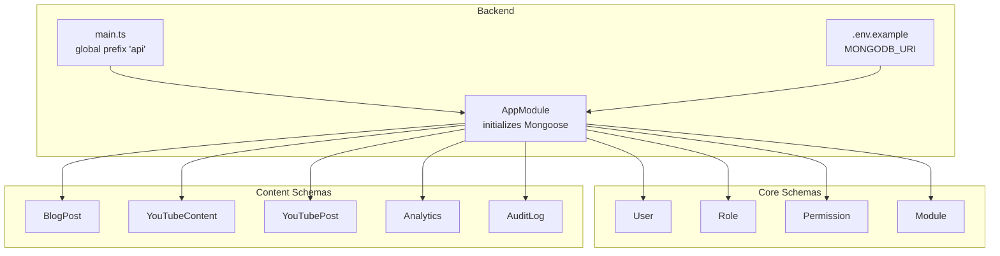
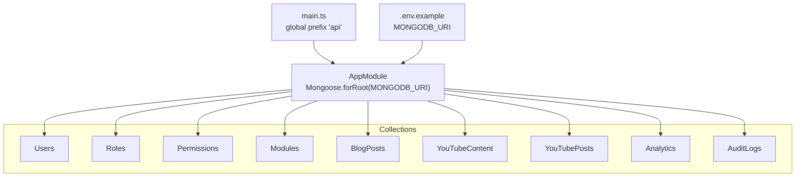
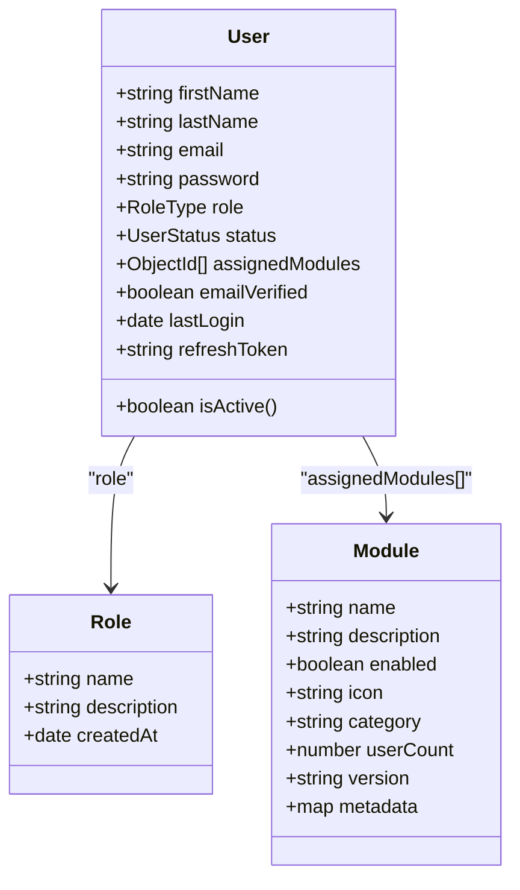
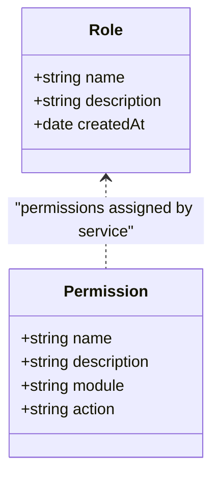
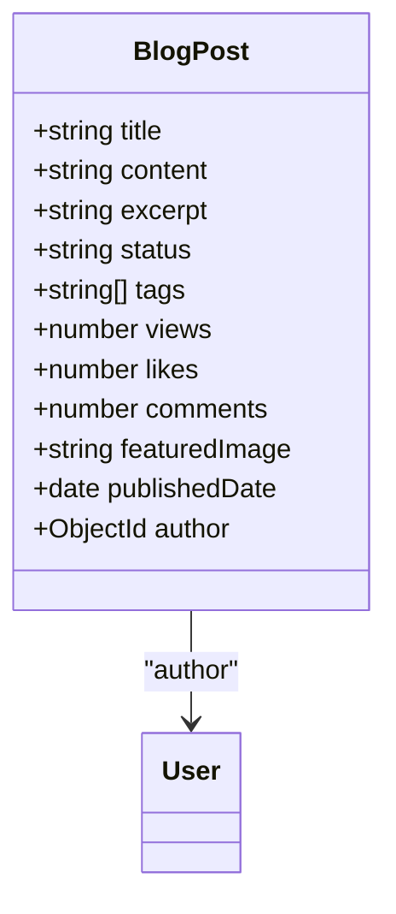
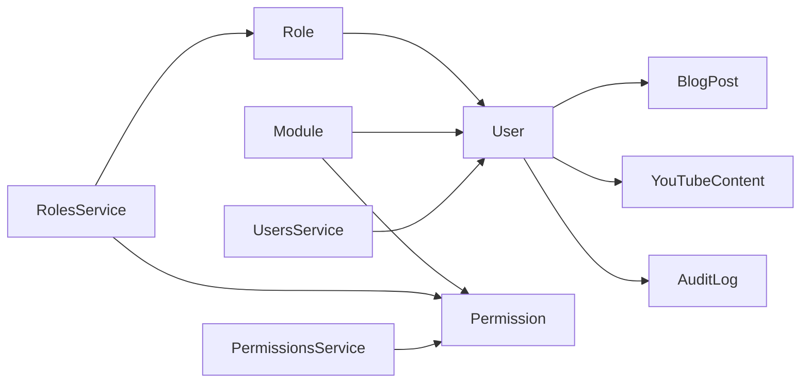

# Database Schema Design

<cite>
**Referenced Files in This Document**
- [user.schema.ts](file://backend/src/users/schemas/user.schema.ts)
- [role.schema.ts](file://backend/src/roles/schemas/role.schema.ts)
- [permission.schema.ts](file://backend/src/permissions/schemas/permission.schema.ts)
- [module.schema.ts](file://backend/src/modules/schemas/module.schema.ts)
- [blog-post.schema.ts](file://backend/src/blog/schemas/blog-post.schema.ts)
- [youtube-content.schema.ts](file://backend/src/youtube/schemas/youtube-content.schema.ts)
- [youtube-post.schema.ts](file://backend/src/youtube/schemas/youtube-post.schema.ts)
- [analytics.schema.ts](file://backend/src/analytics/schemas/analytics.schema.ts)
- [audit-log.schema.ts](file://backend/src/audit-logs/schemas/audit-log.schema.ts)
- [users.service.ts](file://backend/src/users/users.service.ts)
- [roles.service.ts](file://backend/src/roles/roles.service.ts)
- [permissions.service.ts](file://backend/src/permissions/permissions.service.ts)
- [app.module.ts](file://backend/src/app.module.ts)
- [main.ts](file://backend/src/main.ts)
- [.env.example](file://backend/.env.example)
</cite>

## Table of Contents
1. [Introduction](#introduction)
2. [Project Structure](#project-structure)
3. [Core Components](#core-components)
4. [Architecture Overview](#architecture-overview)
5. [Detailed Component Analysis](#detailed-component-analysis)
6. [Dependency Analysis](#dependency-analysis)
7. [Performance Considerations](#performance-considerations)
8. [Troubleshooting Guide](#troubleshooting-guide)
9. [Conclusion](#conclusion)
10. [Appendices](#appendices)

## Introduction
This document describes the MongoDB schema design for the Multi-Application-Control-Dashboard. It focuses on the core collections and content document schemas, detailing fields, data types, validation rules, and indexing strategies. It also explains entity relationships, referential integrity mechanisms, and operational considerations such as security, access control, and performance optimization.

## Project Structure
The backend uses NestJS with Mongoose to define schemas and services. Collections are organized by feature modules, with core identity and access control schemas under dedicated folders. The application connects to MongoDB via an environment variable and exposes a global API prefix.

**Diagram sources**
- [app.module.ts](file://backend/src/app.module.ts#L17-L36)
- [main.ts](file://backend/src/main.ts#L42-L43)
- [.env.example](file://backend/.env.example#L8-L9)

**Section sources**
- [app.module.ts](file://backend/src/app.module.ts#L17-L36)
- [main.ts](file://backend/src/main.ts#L42-L43)
- [.env.example](file://backend/.env.example#L8-L9)

## Core Components
This section documents the core identity and access control schemas: User, Role, Permission, and Module.

- User
  - Purpose: Stores user profiles, authentication credentials, roles, status, and assigned modules.
  - Key fields:
    - Personal info: firstName, lastName
    - Authentication: email (unique), password
    - Access control: role (enum), status (enum), emailVerified, lastLogin, refreshToken
    - Assignments: assignedModules (array of ObjectIds referencing Module)
    - Computed: isActive (virtual derived from status)
  - Validation:
    - Required fields: firstName, lastName, email, password, role
    - Enum constraints: role, status
    - Unique constraint: email
  - Indexing strategy:
    - Compound index recommended: {email: 1} (already enforced by unique)
    - Optional: {status: 1}, {role: 1}, {assignedModules: 1} for filtering and joins
  - Security:
    - Passwords are hashed before storage (handled by service)
    - Sensitive fields excluded from JSON output via schema transforms
  - Referential integrity:
    - assignedModules references Module via ObjectId
    - Role references Role by name (service-managed relationship)

- Role
  - Purpose: Defines roles with optional descriptions and creation metadata.
  - Key fields:
    - name (unique), description, createdAt
  - Validation:
    - Required fields: name
    - Unique constraint: name
  - Indexing strategy:
    - {name: 1} (unique)
  - Referential integrity:
    - Used by User.role and PermissionsService/RoleService assignments

- Permission
  - Purpose: Encapsulates granular permissions per module with actions.
  - Key fields:
    - name (unique), description, module, action (enum: create, read, update, delete)
  - Validation:
    - Required fields: name, description, module, action
    - Unique constraint: name
    - Enum constraint: action
  - Indexing strategy:
    - {module: 1}, {name: 1} (unique)
  - Referential integrity:
    - Assigned to roles via RolesService.assignPermissions

- Module
  - Purpose: Represents functional modules with metadata and counters.
  - Key fields:
    - name (unique), description, enabled (boolean), icon, category, userCount, version, metadata (Map<String,String>)
  - Validation:
    - Required fields: name, description, enabled
    - Unique constraint: name
    - Defaults: enabled=true, userCount=0
  - Indexing strategy:
    - {name: 1} (unique), {enabled: 1}, {category: 1}
  - Referential integrity:
    - Referenced by User.assignedModules and Permission.module

**Section sources**
- [user.schema.ts](file://backend/src/users/schemas/user.schema.ts#L14-L49)
- [role.schema.ts](file://backend/src/roles/schemas/role.schema.ts#L12-L22)
- [permission.schema.ts](file://backend/src/permissions/schemas/permission.schema.ts#L4-L17)
- [module.schema.ts](file://backend/src/modules/schemas/module.schema.ts#L4-L29)

## Architecture Overview
The application initializes Mongoose with the MongoDB URI from environment variables and exposes a unified API prefix. Services encapsulate CRUD operations and enforce business rules such as password hashing and sensitive field exclusion.

**Diagram sources**
- [main.ts](file://backend/src/main.ts#L42-L43)
- [app.module.ts](file://backend/src/app.module.ts#L23-L23)
- [.env.example](file://backend/.env.example#L8-L9)

**Section sources**
- [main.ts](file://backend/src/main.ts#L42-L43)
- [app.module.ts](file://backend/src/app.module.ts#L23-L23)
- [.env.example](file://backend/.env.example#L8-L9)

## Detailed Component Analysis

### User Schema Analysis
- Fields and types:
  - firstName, lastName: string
  - email: string (unique)
  - password: string (hashed)
  - role: enum RoleType
  - status: enum UserStatus
  - assignedModules: array of ObjectIds referencing Module
  - emailVerified: boolean
  - lastLogin: date
  - refreshToken: string
  - isActive: virtual derived from status
- Validation and constraints:
  - Required: firstName, lastName, email, password, role
  - Enum: role, status
  - Unique: email
- Indexing:
  - Unique index on email
  - Consider {status: 1}, {role: 1}, {assignedModules: 1}
- Security:
  - Password hashing handled by service
  - JSON transform removes _id, __v, password
- Referential integrity:
  - assignedModules references Module
  - role references Role.name (via service logic)

**Diagram sources**
- [user.schema.ts](file://backend/src/users/schemas/user.schema.ts#L14-L49)
- [role.schema.ts](file://backend/src/roles/schemas/role.schema.ts#L12-L22)
- [module.schema.ts](file://backend/src/modules/schemas/module.schema.ts#L4-L29)

**Section sources**
- [user.schema.ts](file://backend/src/users/schemas/user.schema.ts#L14-L49)
- [users.service.ts](file://backend/src/users/users.service.ts#L12-L18)

### Role Schema Analysis
- Fields and types:
  - name (unique), description, createdAt
- Validation:
  - Required: name
  - Unique: name
- Indexing:
  - Unique index on name
- Referential integrity:
  - Role.name referenced by User.role
  - PermissionsService assigns permissions to roles

**Diagram sources**
- [role.schema.ts](file://backend/src/roles/schemas/role.schema.ts#L12-L22)
- [permission.schema.ts](file://backend/src/permissions/schemas/permission.schema.ts#L4-L17)

**Section sources**
- [role.schema.ts](file://backend/src/roles/schemas/role.schema.ts#L12-L22)
- [roles.service.ts](file://backend/src/roles/roles.service.ts#L35-L39)

### Permission Schema Analysis
- Fields and types:
  - name (unique), description, module, action (enum)
- Validation:
  - Required: name, description, module, action
  - Unique: name
  - Enum: action
- Indexing:
  - Unique index on name
  - Consider {module: 1} for per-module queries
- Referential integrity:
  - module string references Module.name (service-managed)
  - Assigned to roles via RolesService.assignPermissions

**Section sources**
- [permission.schema.ts](file://backend/src/permissions/schemas/permission.schema.ts#L4-L17)
- [permissions.service.ts](file://backend/src/permissions/permissions.service.ts#L19-L21)

### Module Schema Analysis
- Fields and types:
  - name (unique), description, enabled, icon, category, userCount, version, metadata
- Validation:
  - Required: name, description, enabled
  - Defaults: enabled=true, userCount=0
  - Unique: name
- Indexing:
  - Unique index on name
  - Consider {enabled: 1}, {category: 1}
- Referential integrity:
  - User.assignedModules references Module
  - Permission.module references Module.name (service-managed)

**Section sources**
- [module.schema.ts](file://backend/src/modules/schemas/module.schema.ts#L4-L29)

### Content Document Schemas

#### BlogPost Schema
- Fields and types:
  - title, content, excerpt, status (enum), tags, views, likes, comments, featuredImage, publishedDate
  - author: ObjectId referencing User
- Validation:
  - Required: title, content, author
  - Enum: status
  - Defaults: views, likes, comments
- Indexing:
  - Consider {author: 1}, {status: 1}, {tags: 1}, {publishedDate: 1}

**Diagram sources**
- [blog-post.schema.ts](file://backend/src/blog/schemas/blog-post.schema.ts#L9-L43)

**Section sources**
- [blog-post.schema.ts](file://backend/src/blog/schemas/blog-post.schema.ts#L9-L43)

#### YouTubeContent Schema
- Fields and types:
  - title, description, videoId, videoUrl, thumbnail, thumbnailUrl, duration, category, tags, playlists
  - status (enum), createdBy, lastModifiedBy (ObjectIds), views, likes, publishedAt, isPublished, metadata
- Validation:
  - Required: title, videoId, createdBy
  - Enum: status
  - Defaults: views, likes, isPublished=false
- Indexing:
  - Consider {createdBy: 1}, {lastModifiedBy: 1}, {status: 1}, {tags: 1}, {publishedAt: 1}

**Section sources**
- [youtube-content.schema.ts](file://backend/src/youtube/schemas/youtube-content.schema.ts#L12-L67)

#### YouTubePost Schema
- Fields and types:
  - title, description, videoId, author (ObjectId), status, thumbnailUrl, views, likes, publishedDate
- Validation:
  - Required: title, description, videoId, author
  - Enum: status
  - Defaults: views, likes
- Indexing:
  - Consider {author: 1}, {status: 1}

**Section sources**
- [youtube-post.schema.ts](file://backend/src/youtube/schemas/youtube-post.schema.ts#L6-L34)

### Analytics Schema
- Fields and types:
  - module, eventType, userId, metadata, count, createdAt, updatedAt
- Validation:
  - Required: module, eventType
  - Defaults: count=1, timestamps
- Indexing:
  - Consider {module: 1}, {eventType: 1}, {userId: 1}, {createdAt: 1}

**Section sources**
- [analytics.schema.ts](file://backend/src/analytics/schemas/analytics.schema.ts#L6-L28)

### AuditLog Schema
- Fields and types:
  - userId (ObjectId), action, resource, resourceId, changes, ipAddress, userAgent, status (enum)
- Validation:
  - Required: userId, action, resource
  - Enum: status
- Indexing:
  - Consider {userId: 1}, {resource: 1}, {action: 1}, {status: 1}

**Section sources**
- [audit-log.schema.ts](file://backend/src/audit-logs/schemas/audit-log.schema.ts#L6-L31)

## Dependency Analysis
- Identity and access control:
  - User.role references Role.name (service-managed)
  - User.assignedModules references Module
  - RolesService.assignPermissions/assignModules manage role-to-permission and role-to-module relationships
- Content and analytics:
  - BlogPost.author references User
  - YouTubeContent.createdBy/lastModifiedBy reference User
  - AuditLog.userId references User
  - Analytics.userId is string; could reference User.id depending on client-side usage
- Operational dependencies:
  - Mongoose initialized via MONGODB_URI
  - Global API prefix set to "api"

**Diagram sources**
- [user.schema.ts](file://backend/src/users/schemas/user.schema.ts#L27-L34)
- [role.schema.ts](file://backend/src/roles/schemas/role.schema.ts#L12-L22)
- [module.schema.ts](file://backend/src/modules/schemas/module.schema.ts#L4-L29)
- [blog-post.schema.ts](file://backend/src/blog/schemas/blog-post.schema.ts#L20-L21)
- [youtube-content.schema.ts](file://backend/src/youtube/schemas/youtube-content.schema.ts#L47-L51)
- [audit-log.schema.ts](file://backend/src/audit-logs/schemas/audit-log.schema.ts#L8-L9)
- [roles.service.ts](file://backend/src/roles/roles.service.ts#L35-L44)
- [permissions.service.ts](file://backend/src/permissions/permissions.service.ts#L35-L39)
- [users.service.ts](file://backend/src/users/users.service.ts#L41-L45)

**Section sources**
- [roles.service.ts](file://backend/src/roles/roles.service.ts#L35-L44)
- [permissions.service.ts](file://backend/src/permissions/permissions.service.ts#L35-L39)
- [users.service.ts](file://backend/src/users/users.service.ts#L41-L45)

## Performance Considerations
- Indexing recommendations:
  - Core identity: {email: 1 (unique)}, {role: 1}, {status: 1}
  - Access control: {name: 1 (unique)} for Role and Permission
  - Modules: {name: 1 (unique)}, {enabled: 1}, {category: 1}
  - Content: {author: 1}, {status: 1}, {tags: 1}, {publishedDate: 1}
  - Audit and analytics: {userId: 1}, {resource: 1}, {eventType: 1}, {createdAt: 1}
- Aggregation and projections:
  - Use selective projections (e.g., exclude password) as implemented in services
- Caching and denormalization:
  - Consider caching frequently accessed role/permission sets
- Sharding:
  - Partition by tenant/module for multi-tenant deployments (design consideration)

[No sources needed since this section provides general guidance]

## Troubleshooting Guide
- Authentication and authorization:
  - Verify JWT secret and expiration settings in environment
  - Ensure MONGODB_URI points to a reachable MongoDB instance
- Schema validation errors:
  - Confirm enums and required fields match schema definitions
  - Check uniqueness constraints for email, role name, permission name, module name
- Data security:
  - Confirm password hashing occurs before persistence
  - Ensure sensitive fields are excluded from JSON responses
- Connectivity:
  - Confirm global API prefix and CORS settings align with frontend origins

**Section sources**
- [.env.example](file://backend/.env.example#L11-L13)
- [.env.example](file://backend/.env.example#L8-L9)
- [users.service.ts](file://backend/src/users/users.service.ts#L12-L18)
- [user.schema.ts](file://backend/src/users/schemas/user.schema.ts#L54-L63)

## Conclusion
The schema design emphasizes clear separation of concerns across identity, access control, and content domains. It leverages enums and unique constraints for safety, supports flexible module-based permissions, and provides extensible metadata for modules and content. Recommended indexes and operational safeguards will improve query performance and data integrity.

[No sources needed since this section summarizes without analyzing specific files]

## Appendices

### Sample Data Examples
- User
  - Fields: firstName, lastName, email, password, role, status, assignedModules[], emailVerified, lastLogin, refreshToken
  - Example: { email: "alice@example.com", role: "admin", status: "active", assignedModules: [...] }
- Role
  - Fields: name, description, createdAt
  - Example: { name: "admin", description: "Administrator with full access" }
- Permission
  - Fields: name, description, module, action
  - Example: { name: "blog:create", description: "Create blog posts", module: "blog", action: "create" }
- Module
  - Fields: name, description, enabled, icon, category, userCount, version, metadata
  - Example: { name: "blog", description: "Blog management", enabled: true, category: "content" }
- BlogPost
  - Fields: title, content, excerpt, author(ObjectId), status, tags[], views, likes, comments, featuredImage, publishedDate
  - Example: { title: "Getting Started", content: "...", author: ObjectId("..."), status: "published", tags: ["intro"] }
- YouTubeContent
  - Fields: title, description, videoId, videoUrl, thumbnail, thumbnailUrl, duration, category, tags[], playlists[], status, createdBy(ObjectId), lastModifiedBy(ObjectId), views, likes, publishedAt, isPublished, metadata
  - Example: { title: "Intro Video", videoId: "abc123", status: "published", tags: ["welcome"], isPublished: true }
- Analytics
  - Fields: module, eventType, userId, metadata, count, createdAt, updatedAt
  - Example: { module: "blog", eventType: "post_view", count: 1 }
- AuditLog
  - Fields: userId(ObjectId), action, resource, resourceId, changes, ipAddress, userAgent, status
  - Example: { action: "update", resource: "user", status: "success" }

[No sources needed since this section provides general guidance]

### Schema Evolution Patterns
- Add new fields with defaults to maintain backward compatibility
- Introduce new enums carefully; add migrations to handle existing values
- For unique constraints, create indexes offline or in maintenance windows
- Version fields on modules enable gradual rollout of schema changes

[No sources needed since this section provides general guidance]

### Migration Strategies
- Use Mongoose hooks or service-level transformations for data normalization
- Batch updates for enum or field renames
- Maintain a changelog of schema changes and apply incrementally

[No sources needed since this section provides general guidance]