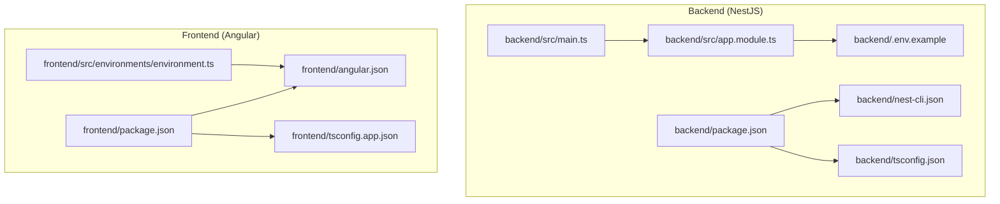
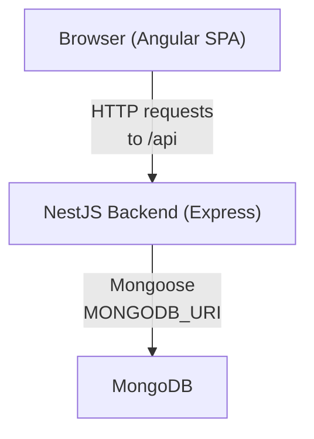
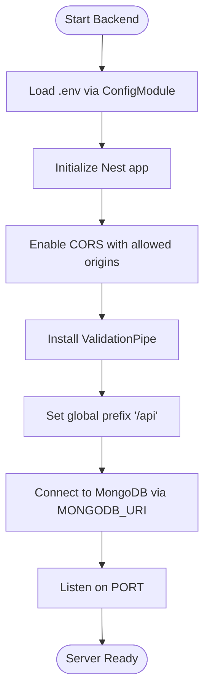
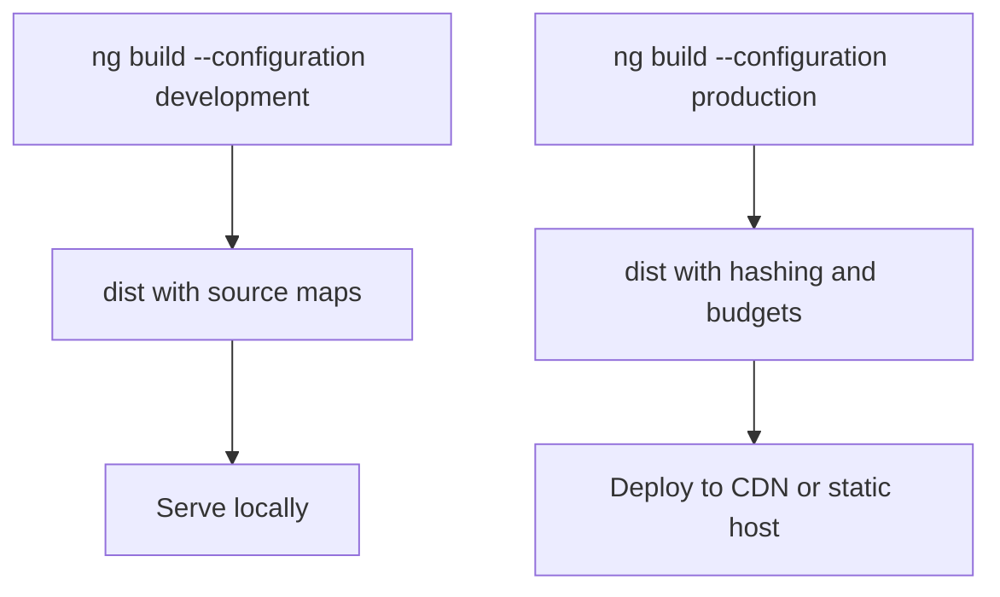
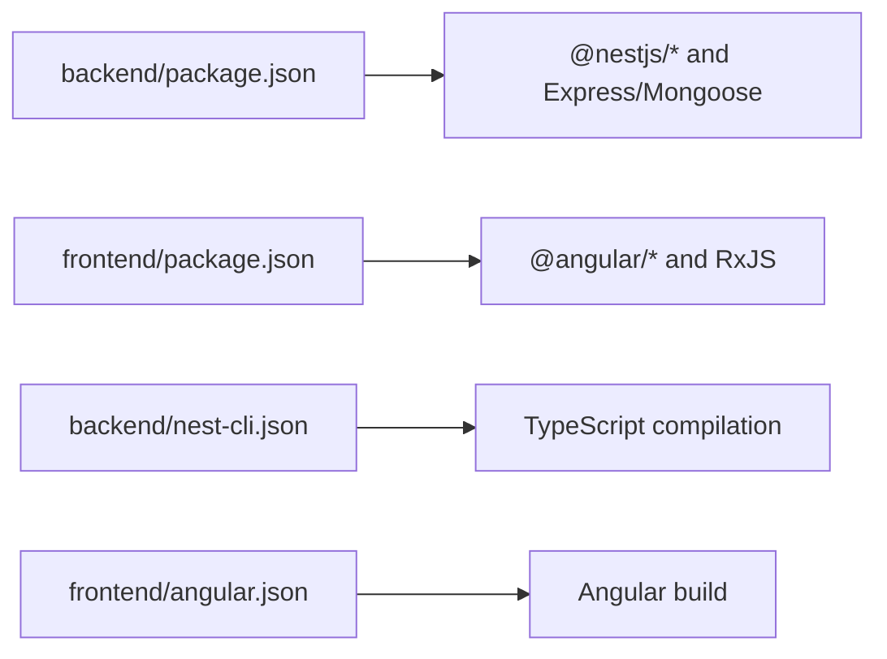

# Deployment and Production

<cite>
**Referenced Files in This Document**
- [backend/package.json](file://backend/package.json)
- [backend/.env.example](file://backend/.env.example)
- [backend/src/main.ts](file://backend/src/main.ts)
- [backend/src/app.module.ts](file://backend/src/app.module.ts)
- [backend/nest-cli.json](file://backend/nest-cli.json)
- [backend/tsconfig.json](file://backend/tsconfig.json)
- [frontend/package.json](file://frontend/package.json)
- [frontend/angular.json](file://frontend/angular.json)
- [frontend/src/environments/environment.ts](file://frontend/src/environments/environment.ts)
- [frontend/tsconfig.app.json](file://frontend/tsconfig.app.json)
</cite>

## Table of Contents
1. [Introduction](#introduction)
2. [Project Structure](#project-structure)
3. [Core Components](#core-components)
4. [Architecture Overview](#architecture-overview)
5. [Detailed Component Analysis](#detailed-component-analysis)
6. [Dependency Analysis](#dependency-analysis)
7. [Performance Considerations](#performance-considerations)
8. [Troubleshooting Guide](#troubleshooting-guide)
9. [Conclusion](#conclusion)
10. [Appendices](#appendices)

## Introduction
This document provides comprehensive deployment and production guidance for the Multi-Application-Control-Dashboard. It covers environment configuration, build processes for both frontend and backend, deployment strategies, production optimization techniques, containerization considerations, CI/CD pipeline setup, environment variable management, database deployment, performance optimization, monitoring/logging configuration, and security hardening. It also includes deployment checklists, rollback procedures, and maintenance tasks tailored for production systems.

## Project Structure
The project consists of two primary parts:
- Backend: NestJS-based server exposing REST APIs, configured via environment variables and MongoDB connectivity.
- Frontend: Angular application built with Angular CLI, consuming the backend APIs.

Key build and configuration files:
- Backend build and scripts are defined in backend/package.json.
- Frontend build and configurations are defined in frontend/angular.json and related TypeScript configs.
- Environment variables for backend are defined in backend/.env.example.
- Runtime environment loading and CORS/Validation configuration are implemented in backend/src/main.ts and backend/src/app.module.ts.

**Diagram sources**
- [backend/src/main.ts](file://backend/src/main.ts#L1-L54)
- [backend/src/app.module.ts](file://backend/src/app.module.ts#L1-L41)
- [backend/.env.example](file://backend/.env.example#L1-L20)
- [backend/nest-cli.json](file://backend/nest-cli.json#L1-L10)
- [backend/tsconfig.json](file://backend/tsconfig.json#L1-L24)
- [frontend/package.json](file://frontend/package.json#L1-L43)
- [frontend/angular.json](file://frontend/angular.json#L1-L129)
- [frontend/src/environments/environment.ts](file://frontend/src/environments/environment.ts#L1-L6)
- [frontend/tsconfig.app.json](file://frontend/tsconfig.app.json#L1-L16)

**Section sources**
- [backend/package.json](file://backend/package.json#L1-L45)
- [frontend/package.json](file://frontend/package.json#L1-L43)
- [backend/.env.example](file://backend/.env.example#L1-L20)
- [backend/src/main.ts](file://backend/src/main.ts#L1-L54)
- [backend/src/app.module.ts](file://backend/src/app.module.ts#L1-L41)
- [backend/nest-cli.json](file://backend/nest-cli.json#L1-L10)
- [backend/tsconfig.json](file://backend/tsconfig.json#L1-L24)
- [frontend/angular.json](file://frontend/angular.json#L1-L129)
- [frontend/src/environments/environment.ts](file://frontend/src/environments/environment.ts#L1-L6)
- [frontend/tsconfig.app.json](file://frontend/tsconfig.app.json#L1-L16)

## Core Components
- Backend runtime and configuration
  - Bootstrap and middleware: CORS enabling, global validation pipe, global API prefix, and port selection from environment variables.
  - Environment-driven database connection via MongooseModule.forRoot using MONGODB_URI.
  - Centralized configuration via ConfigModule.forRoot with envFilePath set to .env.
- Frontend runtime and configuration
  - Development vs production API base URL controlled via environment.ts.
  - Angular CLI build targets and production optimizations (hashing, budgets) defined in angular.json.

**Section sources**
- [backend/src/main.ts](file://backend/src/main.ts#L5-L51)
- [backend/src/app.module.ts](file://backend/src/app.module.ts#L17-L36)
- [backend/.env.example](file://backend/.env.example#L4-L19)
- [frontend/src/environments/environment.ts](file://frontend/src/environments/environment.ts#L1-L6)
- [frontend/angular.json](file://frontend/angular.json#L39-L61)

## Architecture Overview
The system follows a classic client-server architecture:
- Angular frontend serves the UI and communicates with the NestJS backend over HTTP.
- Backend exposes REST endpoints under a global prefix and connects to MongoDB for persistence.
- Environment variables control ports, database URIs, JWT secrets, and CORS origins.

**Diagram sources**
- [backend/src/main.ts](file://backend/src/main.ts#L42-L50)
- [backend/src/app.module.ts](file://backend/src/app.module.ts#L23-L23)
- [backend/.env.example](file://backend/.env.example#L8-L9)

## Detailed Component Analysis

### Backend Build and Runtime
- Build process
  - Nest build compiles TypeScript sources to dist with assets included per nest-cli.json.
  - Production startup runs node dist/main.
- Runtime configuration
  - CORS allows selected origins and credentials, with development-friendly leniency.
  - Global ValidationPipe enforces DTO whitelisting and transformation.
  - Global API prefix set to api.
  - Port defaults to 3000 if not provided.
- Environment variables
  - PORT, NODE_ENV, MONGODB_URI, JWT_SECRET, JWT_EXPIRATION, CORS_ORIGIN, SEED_DATABASE.

**Diagram sources**
- [backend/src/app.module.ts](file://backend/src/app.module.ts#L19-L23)
- [backend/src/main.ts](file://backend/src/main.ts#L8-L43)
- [backend/.env.example](file://backend/.env.example#L4-L19)

**Section sources**
- [backend/package.json](file://backend/package.json#L8-L16)
- [backend/nest-cli.json](file://backend/nest-cli.json#L5-L9)
- [backend/src/main.ts](file://backend/src/main.ts#L8-L50)
- [backend/src/app.module.ts](file://backend/src/app.module.ts#L19-L23)
- [backend/.env.example](file://backend/.env.example#L4-L19)

### Frontend Build and Runtime
- Build targets
  - Production builds enable output hashing and budgets for performance.
  - Development builds disable optimization and enable source maps.
- Runtime configuration
  - apiUrl and apiBaseUrl are configurable via environment.ts for dev/prod switching.

**Diagram sources**
- [frontend/angular.json](file://frontend/angular.json#L39-L61)
- [frontend/package.json](file://frontend/package.json#L4-L10)
- [frontend/src/environments/environment.ts](file://frontend/src/environments/environment.ts#L1-L6)

**Section sources**
- [frontend/angular.json](file://frontend/angular.json#L39-L61)
- [frontend/package.json](file://frontend/package.json#L4-L10)
- [frontend/src/environments/environment.ts](file://frontend/src/environments/environment.ts#L1-L6)

### Environment Variable Management
- Backend
  - Required keys: PORT, NODE_ENV, MONGODB_URI, JWT_SECRET, JWT_EXPIRATION, CORS_ORIGIN, SEED_DATABASE.
  - Copy .env.example to .env and override values for production.
- Frontend
  - apiUrl and apiBaseUrl should reflect the production backend endpoint in production builds.

Best practices:
- Store secrets externally (e.g., secret managers or CI/CD variables) and inject via platform environment.
- Never commit .env to version control.
- Use distinct JWT_SECRET and MONGODB_URI per environment.

**Section sources**
- [backend/.env.example](file://backend/.env.example#L1-L20)
- [frontend/src/environments/environment.ts](file://frontend/src/environments/environment.ts#L1-L6)

### Database Deployment
- MongoDB connection is configured via MONGODB_URI.
- For production, use a managed MongoDB service or a secure self-hosted replica set with network policies and TLS enabled.
- Ensure firewall rules allow connections only from the backend servers.

Operational tips:
- Monitor connection pool usage and tune maxPoolSize as needed.
- Enable read preferences and replica set health checks.

**Section sources**
- [backend/src/app.module.ts](file://backend/src/app.module.ts#L23-L23)
- [backend/.env.example](file://backend/.env.example#L8-L9)

### Security Hardening for Production
- CORS
  - Restrict CORS_ORIGIN to trusted domains in production.
  - Remove development exceptions and enforce strict origin checking.
- JWT
  - Change JWT_SECRET immediately and rotate periodically.
  - Set appropriate JWT_EXPIRATION aligned with your session policy.
- Secrets
  - Use environment injection and avoid embedding secrets in code or static assets.
- Transport
  - Terminate TLS at a reverse proxy or load balancer; configure HTTPS-only cookies and HSTS.
- Input validation
  - Keep ValidationPipe enabled to sanitize and validate incoming requests.

**Section sources**
- [backend/src/main.ts](file://backend/src/main.ts#L8-L31)
- [backend/.env.example](file://backend/.env.example#L11-L13)

### Monitoring and Logging
- Logging
  - Use NestJS logger or Winston with structured JSON logs for centralized log aggregation.
  - Log level: info in production; increase to debug temporarily for diagnostics.
- Metrics
  - Expose metrics via Prometheus-compatible endpoints (e.g., NestJS Prometheus integration).
  - Track response latency, error rates, and throughput.
- Health checks
  - Implement a GET /health endpoint returning 200 when DB and dependencies are healthy.

[No sources needed since this section provides general guidance]

### Performance Optimization
- Backend
  - Enable production mode in NestJS (NODE_ENV=production).
  - Use clustering or multiple worker processes behind a reverse proxy.
  - Optimize Mongoose queries; add indexes for frequent filters.
  - Enable gzip compression at the reverse proxy.
- Frontend
  - Leverage production builds with output hashing for cache busting.
  - Split vendor bundles and lazy-load modules.
  - Minimize third-party scripts and defer non-critical resources.

**Section sources**
- [backend/package.json](file://backend/package.json#L12-L16)
- [frontend/angular.json](file://frontend/angular.json#L53-L53)

### Containerization (Docker) Considerations
- Backend image
  - Multi-stage build: compile in a Node builder stage, copy dist to a minimal runtime image.
  - Set NODE_ENV=production and mount .env via secrets/volume.
  - Entrypoint: node dist/main.
- Frontend image
  - Use nginx:alpine to serve dist/frontend-new; configure gzip and caching headers.
- Compose
  - Define services for backend, MongoDB, and optional caching/queue services.
  - Use external networks and mount persistent volumes for MongoDB data.

[No sources needed since this section provides general guidance]

### CI/CD Pipeline Setup
- Build stages
  - Backend: npm ci -> nest build -> test -> docker build backend.
  - Frontend: npm ci -> ng build --configuration production -> test -> docker build frontend.
- Release stages
  - Push images to registry with semantic tags.
  - Deploy via orchestration platform with rolling updates and readiness probes.
- Secrets
  - Inject .env values via CI/CD secret stores; avoid committing secrets.
- Rollback
  - Maintain immutable tags; rollback by redeploying previous image tag.

[No sources needed since this section provides general guidance]

### Deployment Strategies
- Blue-Green or Rolling Updates
  - Keep two backend instances behind a load balancer; switch traffic after health checks pass.
- Canary Releases
  - Route a small percentage of traffic to the new version; monitor metrics before full rollout.
- Immutable Infrastructure
  - Replace containers instead of updating in place; ensure zero-downtime deployments.

[No sources needed since this section provides general guidance]

### Deployment Checklist
- Pre-deployment
  - Confirm environment variables are set (PORT, MONGODB_URI, JWT_SECRET, CORS_ORIGIN).
  - Verify database connectivity and indexes.
  - Run smoke tests against /health and key endpoints.
- Deployment
  - Build artifacts (backend dist, frontend dist).
  - Push container images to registry.
  - Apply manifests and confirm pods/services are ready.
- Post-deployment
  - Observe logs and metrics for 15–30 minutes.
  - Validate user-facing flows and admin dashboards.
  - Confirm audit logs and analytics endpoints.

[No sources needed since this section provides general guidance]

### Rollback Procedures
- Immediate actions
  - Switch traffic back to the last known-good backend image tag.
  - Revert frontend static assets to the previous release.
- Verification
  - Confirm endpoints return expected responses and metrics normalize.
- Post-mortem
  - Document root cause and preventive measures.

[No sources needed since this section provides general guidance]

### Maintenance Tasks
- Database
  - Regular backups and PITR (point-in-time recovery).
  - Index maintenance and collection stats monitoring.
- Secrets rotation
  - Rotate JWT_SECRET and re-deploy backend.
- Dependency updates
  - Patch Node and Angular dependencies; test builds and regression suites.
- Observability
  - Review logs and alerts weekly; adjust thresholds as needed.

[No sources needed since this section provides general guidance]

## Dependency Analysis
Runtime dependencies and build-time dependencies are defined in package.json for both backend and frontend. Nest CLI and TypeScript configurations support compilation and asset handling.

**Diagram sources**
- [backend/package.json](file://backend/package.json#L18-L44)
- [frontend/package.json](file://frontend/package.json#L12-L41)
- [backend/nest-cli.json](file://backend/nest-cli.json#L5-L9)
- [frontend/angular.json](file://frontend/angular.json#L17-L61)

**Section sources**
- [backend/package.json](file://backend/package.json#L18-L44)
- [frontend/package.json](file://frontend/package.json#L12-L41)
- [backend/nest-cli.json](file://backend/nest-cli.json#L5-L9)
- [frontend/angular.json](file://frontend/angular.json#L17-L61)

## Performance Considerations
- Backend
  - Use production mode and clustering for concurrency.
  - Tune Mongoose connection pool and query performance.
  - Add rate limiting and DDoS protection at the ingress.
- Frontend
  - Enable long-term caching with hashed filenames.
  - Optimize images and fonts; leverage HTTP/2 push sparingly.

[No sources needed since this section provides general guidance]

## Troubleshooting Guide
- Backend
  - Verify MONGODB_URI connectivity and credentials.
  - Check CORS_ORIGIN alignment with frontend origin.
  - Confirm ValidationPipe errors for malformed requests.
- Frontend
  - Ensure apiUrl/apiBaseUrl matches the deployed backend domain.
  - Inspect browser network tab for 4xx/5xx responses.

**Section sources**
- [backend/src/main.ts](file://backend/src/main.ts#L8-L50)
- [backend/.env.example](file://backend/.env.example#L8-L16)
- [frontend/src/environments/environment.ts](file://frontend/src/environments/environment.ts#L1-L6)

## Conclusion
This guide outlines a practical, production-ready approach to deploying and operating the Multi-Application-Control-Dashboard. By securing environment variables, hardening CORS and JWT, optimizing builds and runtime, and establishing robust monitoring and CI/CD, teams can achieve reliable, scalable operations.

## Appendices
- Quick reference: Backend scripts and Nest build options are defined in backend/package.json and backend/nest-cli.json.
- Quick reference: Frontend build configurations and production optimizations are defined in frontend/angular.json and frontend/tsconfig.app.json.

**Section sources**
- [backend/package.json](file://backend/package.json#L8-L16)
- [backend/nest-cli.json](file://backend/nest-cli.json#L5-L9)
- [frontend/angular.json](file://frontend/angular.json#L39-L61)
- [frontend/tsconfig.app.json](file://frontend/tsconfig.app.json#L1-L16)