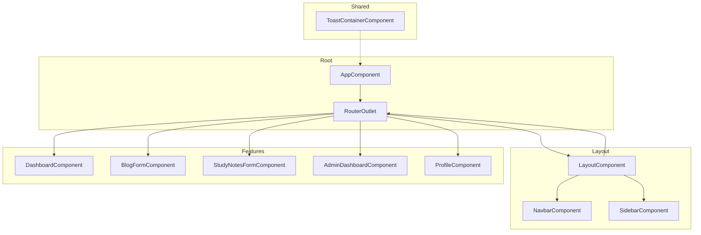
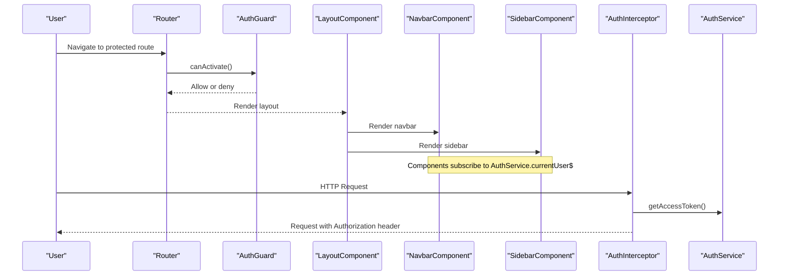
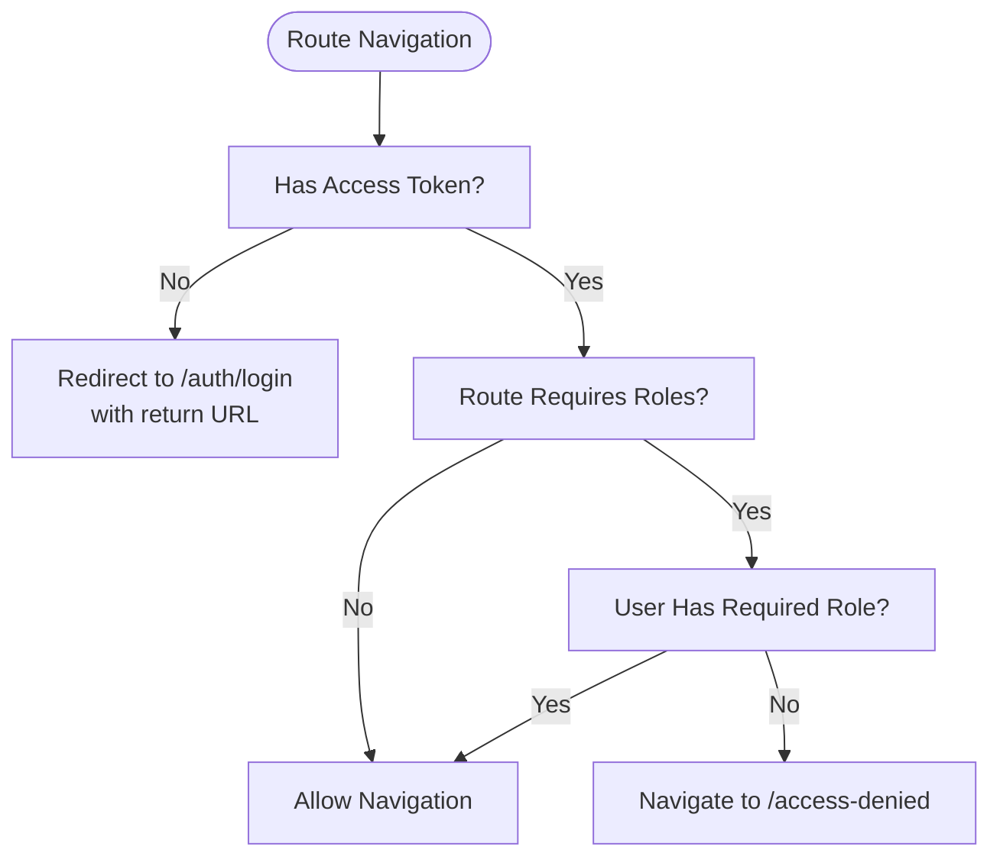
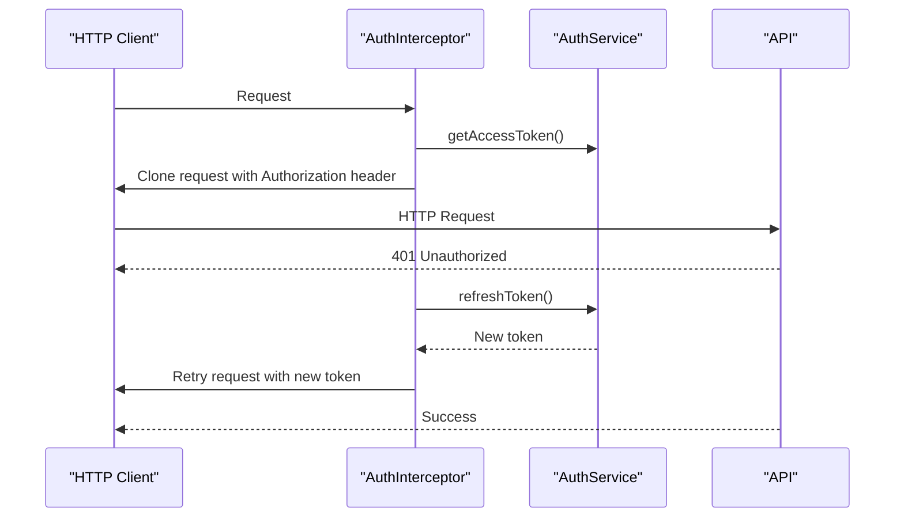
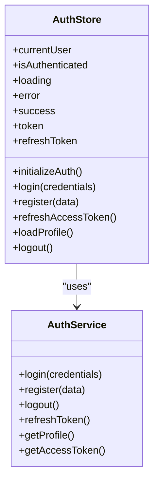
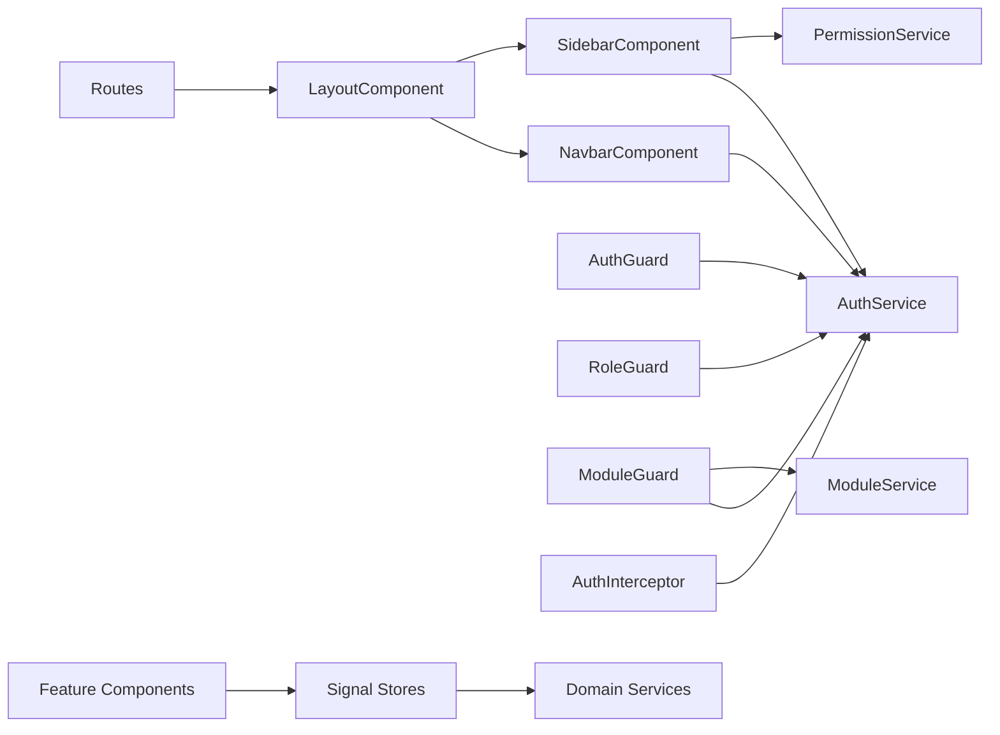

# Frontend Component Architecture

<cite>
**Referenced Files in This Document**
- [app.component.ts](file://frontend/src/app/app.component.ts)
- [app.routes.ts](file://frontend/src/app/app.routes.ts)
- [layout.component.ts](file://frontend/src/app/shared/layouts/layout.component.ts)
- [navbar.component.ts](file://frontend/src/app/shared/components/navbar/navbar.component.ts)
- [sidebar.component.ts](file://frontend/src/app/shared/components/sidebar/sidebar.component.ts)
- [toast-container.component.ts](file://frontend/src/app/shared/components/toast-container.component.ts)
- [auth.guard.ts](file://frontend/src/app/core/guards/auth.guard.ts)
- [role.guard.ts](file://frontend/src/app/core/guards/role.guard.ts)
- [auth.interceptor.ts](file://frontend/src/app/core/interceptors/auth.interceptor.ts)
- [auth.service.ts](file://frontend/src/app/core/services/auth.service.ts)
- [toast.service.ts](file://frontend/src/app/core/services/toast.service.ts)
- [auth.store.ts](file://frontend/src/app/core/store/auth.store.ts)
- [dashboard.component.ts](file://frontend/src/app/features/dashboard/dashboard.component.ts)
- [blog-form.component.ts](file://frontend/src/app/features/blog/blog-form/blog-form.component.ts)
- [study-notes-form.component.ts](file://frontend/src/app/features/study-notes/study-notes-form/study-notes-form.component.ts)
- [admin-dashboard.component.ts](file://frontend/src/app/features/admin/admin-dashboard/admin-dashboard.component.ts)
- [profile.component.ts](file://frontend/src/app/features/profile/profile.component.ts)
</cite>

## Table of Contents
1. [Introduction](#introduction)
2. [Project Structure](#project-structure)
3. [Core Components](#core-components)
4. [Architecture Overview](#architecture-overview)
5. [Detailed Component Analysis](#detailed-component-analysis)
6. [Dependency Analysis](#dependency-analysis)
7. [Performance Considerations](#performance-considerations)
8. [Troubleshooting Guide](#troubleshooting-guide)
9. [Conclusion](#conclusion)
10. [Appendices](#appendices)

## Introduction
This document describes the frontend component architecture of the Multi-Application-Control-Dashboard. It focuses on the component hierarchy, shared components, layout structure, and utility components. It explains component communication patterns, service integration, and state management integration using NgRx Signals. It also details reusable components (navbar, sidebar, toast container), layout components, and feature-specific components. Component composition patterns, prop interfaces, event handling, and styling approaches using Tailwind CSS are covered. Testing strategies, accessibility implementation, and responsive design patterns are addressed.

## Project Structure
The Angular application follows a feature-based structure with clear separation of concerns:
- app: Root application module with routing, guards, interceptors, services, stores, and feature modules
- shared: Reusable components and layouts
- features: Feature-specific modules (auth, dashboard, blog, study-notes, linkedin, youtube, admin, profile, settings)
- core: Cross-cutting concerns (guards, interceptors, services, stores)

**Diagram sources**
- [app.component.ts](file://frontend/src/app/app.component.ts#L1-L13)
- [app.routes.ts](file://frontend/src/app/app.routes.ts#L1-L114)
- [layout.component.ts](file://frontend/src/app/shared/layouts/layout.component.ts#L1-L15)
- [navbar.component.ts](file://frontend/src/app/shared/components/navbar/navbar.component.ts#L1-L120)
- [sidebar.component.ts](file://frontend/src/app/shared/components/sidebar/sidebar.component.ts#L1-L265)
- [toast-container.component.ts](file://frontend/src/app/shared/components/toast-container.component.ts#L1-L73)
- [dashboard.component.ts](file://frontend/src/app/features/dashboard/dashboard.component.ts#L1-L379)
- [blog-form.component.ts](file://frontend/src/app/features/blog/blog-form/blog-form.component.ts#L1-L164)
- [study-notes-form.component.ts](file://frontend/src/app/features/study-notes/study-notes-form/study-notes-form.component.ts#L1-L186)
- [admin-dashboard.component.ts](file://frontend/src/app/features/admin/admin-dashboard/admin-dashboard.component.ts#L1-L162)
- [profile.component.ts](file://frontend/src/app/features/profile/profile.component.ts#L1-L165)

**Section sources**
- [app.component.ts](file://frontend/src/app/app.component.ts#L1-L13)
- [app.routes.ts](file://frontend/src/app/app.routes.ts#L1-L114)

## Core Components
This section documents the shared and foundational components that underpin the entire application.

- LayoutComponent
  - Purpose: Wraps child routes with shared navigation and sidebar
  - Imports: RouterOutlet, NavbarComponent, SidebarComponent
  - Responsibilities: Provides consistent page shell for authenticated routes
  - Communication: Delegates navigation and user actions to child components

- NavbarComponent
  - Purpose: Top navigation bar with user profile dropdown and mobile menu
  - Dependencies: AuthService, Router
  - State: Tracks current user, dropdown/mobile menu toggles
  - Events: Handles logout, role-based UI, keyboard shortcuts

- SidebarComponent
  - Purpose: Collapsible navigation sidebar with dynamic menu items
  - Dependencies: AuthService, PermissionService, Router
  - State: Tracks current user, expanded menus, desktop/mobile modes
  - Visibility: Filters menu items by role and module access

- ToastContainerComponent
  - Purpose: Global toast notification renderer
  - Dependencies: ToastService
  - State: Subscribes to observable toast queue
  - Styling: Tailwind-based toast theming per type

**Section sources**
- [layout.component.ts](file://frontend/src/app/shared/layouts/layout.component.ts#L1-L15)
- [navbar.component.ts](file://frontend/src/app/shared/components/navbar/navbar.component.ts#L1-L120)
- [sidebar.component.ts](file://frontend/src/app/shared/components/sidebar/sidebar.component.ts#L1-L265)
- [toast-container.component.ts](file://frontend/src/app/shared/components/toast-container.component.ts#L1-L73)

## Architecture Overview
The application enforces authentication and authorization via route guards and an HTTP interceptor. Services manage domain logic, while NgRx Signals stores encapsulate state and expose computed signals for templates.

**Diagram sources**
- [app.routes.ts](file://frontend/src/app/app.routes.ts#L1-L114)
- [auth.guard.ts](file://frontend/src/app/core/guards/auth.guard.ts#L1-L26)
- [layout.component.ts](file://frontend/src/app/shared/layouts/layout.component.ts#L1-L15)
- [navbar.component.ts](file://frontend/src/app/shared/components/navbar/navbar.component.ts#L1-L120)
- [sidebar.component.ts](file://frontend/src/app/shared/components/sidebar/sidebar.component.ts#L1-L265)
- [auth.interceptor.ts](file://frontend/src/app/core/interceptors/auth.interceptor.ts#L1-L46)
- [auth.service.ts](file://frontend/src/app/core/services/auth.service.ts#L1-L161)

## Detailed Component Analysis

### Authentication and Authorization Guards
- AuthGuard
  - Enforces presence of access token for protected routes
  - Redirects unauthenticated users to login with return URL
- RoleGuard
  - Validates user role against route-required roles
  - Navigates to access-denied when insufficient privileges
- ModuleGuard
  - Implements caching for module access checks to reduce API calls
  - Uses PermissionService to determine module eligibility

**Diagram sources**
- [auth.guard.ts](file://frontend/src/app/core/guards/auth.guard.ts#L1-L26)
- [role.guard.ts](file://frontend/src/app/core/guards/role.guard.ts#L1-L134)

**Section sources**
- [auth.guard.ts](file://frontend/src/app/core/guards/auth.guard.ts#L1-L26)
- [role.guard.ts](file://frontend/src/app/core/guards/role.guard.ts#L1-L134)

### HTTP Interceptor
- AuthInterceptor
  - Adds Authorization header when token exists
  - On 401 errors, attempts token refresh via AuthService
  - Retries request with refreshed token or logs out on failure

**Diagram sources**
- [auth.interceptor.ts](file://frontend/src/app/core/interceptors/auth.interceptor.ts#L1-L46)
- [auth.service.ts](file://frontend/src/app/core/services/auth.service.ts#L1-L161)

**Section sources**
- [auth.interceptor.ts](file://frontend/src/app/core/interceptors/auth.interceptor.ts#L1-L46)
- [auth.service.ts](file://frontend/src/app/core/services/auth.service.ts#L1-L161)

### State Management with NgRx Signals
- AuthStore
  - Manages authentication state: user, tokens, loading, error, success
  - Computed selectors for convenience (isAdmin, isSuperAdmin, userRole, etc.)
  - Methods for initialization, login, register, refresh, profile load, logout
- Stores for Features
  - BlogStore, StudyNotesStore, AdminDashboardStore, ProfileStore, etc.
  - Each exposes signals and methods for CRUD operations and UI state
- Service Integration
  - Stores orchestrate service calls and update state via patchState
  - Components consume signals and dispatch actions without performing HTTP directly

**Diagram sources**
- [auth.store.ts](file://frontend/src/app/core/store/auth.store.ts#L1-L223)
- [auth.service.ts](file://frontend/src/app/core/services/auth.service.ts#L1-L161)

**Section sources**
- [auth.store.ts](file://frontend/src/app/core/store/auth.store.ts#L1-L223)
- [auth.service.ts](file://frontend/src/app/core/services/auth.service.ts#L1-L161)

### Shared Components

#### NavbarComponent
- Props: None (uses injected services)
- Events: logout(), toggleDropdown(), toggleMobileMenu()
- State: currentUser, isDropdownOpen, isMobileMenuOpen
- Styling: Tailwind classes for badges and icons based on role
- Accessibility: Keyboard support via HostListener for escape key

**Section sources**
- [navbar.component.ts](file://frontend/src/app/shared/components/navbar/navbar.component.ts#L1-L120)

#### SidebarComponent
- Props: None (uses injected services)
- Events: toggleMenu(), toggleSidebar(), navigateTo(route)
- State: currentUser, menuItems, expandedMenus, isDesktop
- Visibility: Role-based and module-based filtering
- Responsive: Desktop vs mobile behavior with automatic closing on navigation

**Section sources**
- [sidebar.component.ts](file://frontend/src/app/shared/components/sidebar/sidebar.component.ts#L1-L265)

#### ToastContainerComponent
- Props: None (subscribes to ToastService)
- Events: removeToast(id)
- Styling: Tailwind-based theming per toast type (success, error, warning, info)
- Behavior: Automatic dismissal after duration

**Section sources**
- [toast-container.component.ts](file://frontend/src/app/shared/components/toast-container.component.ts#L1-L73)
- [toast.service.ts](file://frontend/src/app/core/services/toast.service.ts#L1-L60)

### Feature-Specific Components

#### DashboardComponent
- Purpose: Home screen aggregating stats and recent activity
- State: Exposes computed getters mirroring store signals (currently stubbed)
- UI Helpers: Greeting, relative time formatting, activity icons/colors
- Permissions: Role checks via PermissionService

**Section sources**
- [dashboard.component.ts](file://frontend/src/app/features/dashboard/dashboard.component.ts#L1-L379)

#### BlogFormComponent
- Purpose: Create or edit blog posts
- State: Form group with validation, edit mode detection
- Store Integration: Uses BlogStore for create/update, loads existing post in edit mode
- Navigation: Redirects to list on success

**Section sources**
- [blog-form.component.ts](file://frontend/src/app/features/blog/blog-form/blog-form.component.ts#L1-L164)

#### StudyNotesFormComponent
- Purpose: Create or edit study notes with categories and tags
- State: Form group with validation, edit mode detection
- Store Integration: Uses StudyNotesStore for create/update, auto-fills form in edit mode
- Permissions: Uses PermissionService for edit capability

**Section sources**
- [study-notes-form.component.ts](file://frontend/src/app/features/study-notes/study-notes-form/study-notes-form.component.ts#L1-L186)

#### AdminDashboardComponent
- Purpose: Admin overview with stats, recent users, and modules
- State: Exposes static arrays for demo; consumes AdminDashboardStore signals
- UI Helpers: Role and module status badges
- Permissions: Uses PermissionService for admin checks

**Section sources**
- [admin-dashboard.component.ts](file://frontend/src/app/features/admin/admin-dashboard/admin-dashboard.component.ts#L1-L162)

#### ProfileComponent
- Purpose: View and update user profile
- State: Reactive form bound to ProfileStore
- Store Integration: Initializes from store, updates via store action
- UI Helpers: Role badges, formatted last login date

**Section sources**
- [profile.component.ts](file://frontend/src/app/features/profile/profile.component.ts#L1-L165)

## Dependency Analysis
The application exhibits low coupling and high cohesion:
- Components depend on services and stores via dependency injection
- Guards and interceptor are centralized for cross-cutting concerns
- Layout composes shared components, minimizing duplication
- Route configuration centralizes navigation and protection

**Diagram sources**
- [app.routes.ts](file://frontend/src/app/app.routes.ts#L1-L114)
- [layout.component.ts](file://frontend/src/app/shared/layouts/layout.component.ts#L1-L15)
- [navbar.component.ts](file://frontend/src/app/shared/components/navbar/navbar.component.ts#L1-L120)
- [sidebar.component.ts](file://frontend/src/app/shared/components/sidebar/sidebar.component.ts#L1-L265)
- [auth.guard.ts](file://frontend/src/app/core/guards/auth.guard.ts#L1-L26)
- [role.guard.ts](file://frontend/src/app/core/guards/role.guard.ts#L1-L134)
- [auth.interceptor.ts](file://frontend/src/app/core/interceptors/auth.interceptor.ts#L1-L46)
- [auth.service.ts](file://frontend/src/app/core/services/auth.service.ts#L1-L161)

**Section sources**
- [app.routes.ts](file://frontend/src/app/app.routes.ts#L1-L114)
- [auth.guard.ts](file://frontend/src/app/core/guards/auth.guard.ts#L1-L26)
- [role.guard.ts](file://frontend/src/app/core/guards/role.guard.ts#L1-L134)
- [auth.interceptor.ts](file://frontend/src/app/core/interceptors/auth.interceptor.ts#L1-L46)

## Performance Considerations
- Guard Caching: ModuleGuard caches module access decisions to minimize API calls
- Signal Stores: Fine-grained state updates reduce unnecessary re-renders
- Lazy Loading: Feature routes are lazy-loaded to improve initial load performance
- Responsive Behavior: Sidebar adapts to desktop/mobile to optimize UX and performance

[No sources needed since this section provides general guidance]

## Troubleshooting Guide
- Authentication Failures
  - Verify token presence and validity via AuthService
  - Check AuthInterceptor behavior on 401 responses
- Authorization Issues
  - Confirm RoleGuard and ModuleGuard route data
  - Review user role and module access in stores/services
- Toast Notifications
  - Ensure ToastService is injected at root
  - Verify ToastContainer subscribes to getToasts()

**Section sources**
- [auth.service.ts](file://frontend/src/app/core/services/auth.service.ts#L1-L161)
- [auth.interceptor.ts](file://frontend/src/app/core/interceptors/auth.interceptor.ts#L1-L46)
- [role.guard.ts](file://frontend/src/app/core/guards/role.guard.ts#L1-L134)
- [toast.service.ts](file://frontend/src/app/core/services/toast.service.ts#L1-L60)

## Conclusion
The Multi-Application-Control-Dashboard employs a clean, scalable Angular architecture:
- Centralized guards and interceptors enforce security
- Shared components (layout, navbar, sidebar, toast) provide consistent UX
- Feature components integrate with signal stores for predictable state management
- Tailwind CSS enables rapid, responsive UI development
- Route configuration supports modular, protected navigation

[No sources needed since this section summarizes without analyzing specific files]

## Appendices

### Component Composition Patterns
- Container-Presentational: LayoutComponent composes Navbar/Sidebar; feature components own forms and lists
- Dependency Injection: Services and stores injected via Angular’s injector
- Event-driven: Child components emit events handled by parent components or stores

[No sources needed since this section provides general guidance]

### Prop Interfaces and Events
- NavbarComponent: No props; emits logout via click handlers
- SidebarComponent: No props; emits navigation actions
- ToastContainerComponent: No props; subscribes to observable stream
- Feature Components: Own reactive forms and submit events

[No sources needed since this section provides general guidance]

### Styling Approaches Using Tailwind CSS
- Utility-first classes applied directly in components
- Theme tokens via Tailwind variants (dark mode support present)
- Consistent spacing and typography across shared components

[No sources needed since this section provides general guidance]

### Accessibility Implementation
- Keyboard navigation: Escape key closes dropdowns and mobile menus
- Semantic HTML: RouterLink and RouterLinkActive used for navigation
- Focus management: Dropdowns and menus controlled via component state

[No sources needed since this section provides general guidance]

### Responsive Design Patterns
- Breakpoint-based behavior: Sidebar collapses on mobile
- Adaptive UI: Menu visibility depends on role and module access
- Mobile-first interactions: Touch-friendly navigation and dropdowns

[No sources needed since this section provides general guidance]