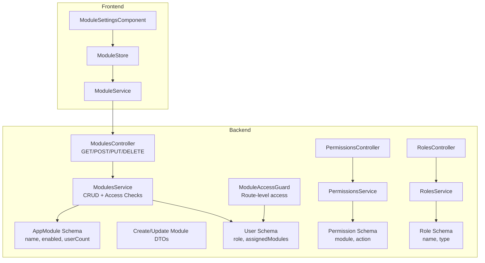
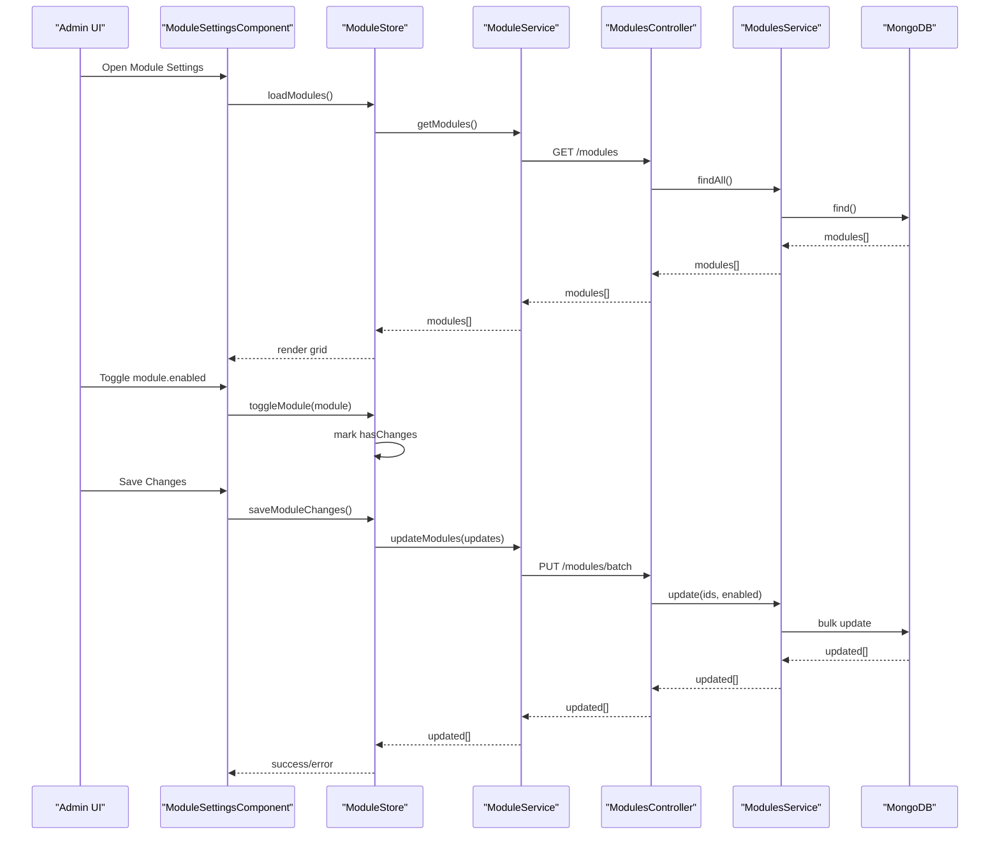
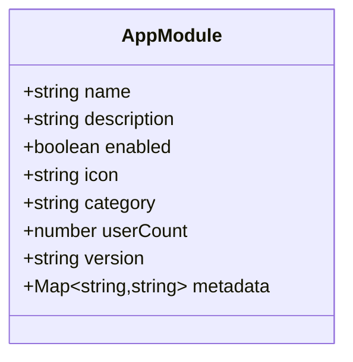
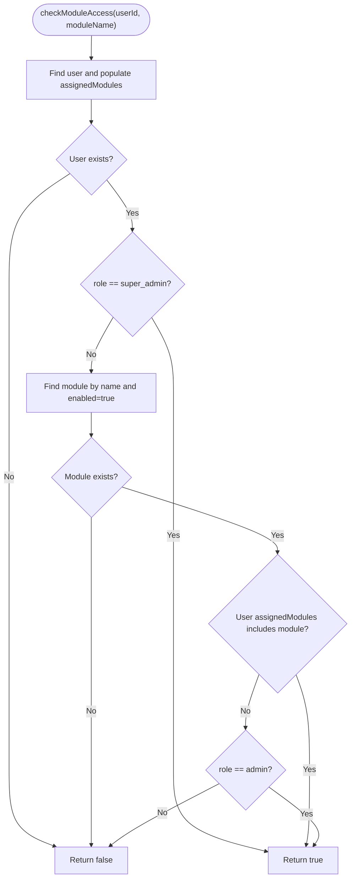
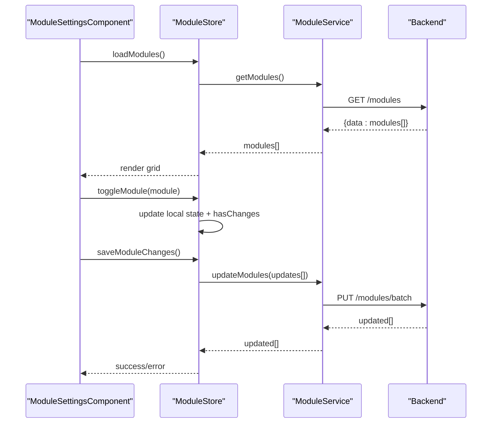
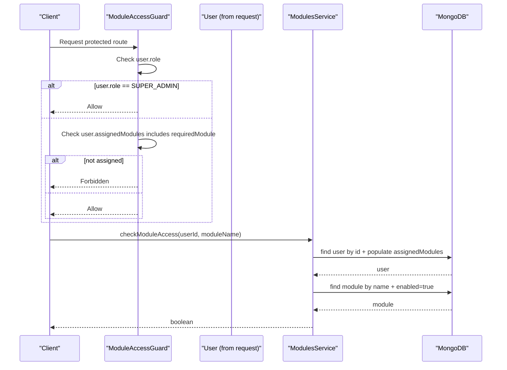
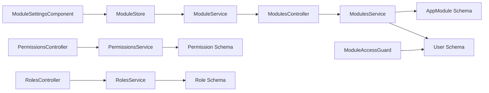

# Module Management System

<cite>
**Referenced Files in This Document**
- [modules.controller.ts](file://backend/src/modules/modules.controller.ts)
- [modules.service.ts](file://backend/src/modules/modules.service.ts)
- [module.schema.ts](file://backend/src/modules/schemas/module.schema.ts)
- [create-module.dto.ts](file://backend/src/modules/dto/create-module.dto.ts)
- [module-access.guard.ts](file://backend/src/auth/guards/module-access.guard.ts)
- [module-settings.component.ts](file://frontend/src/app/features/admin/module-settings/module-settings.component.ts)
- [module-settings.component.html](file://frontend/src/app/features/admin/module-settings/module-settings.component.html)
- [module.store.ts](file://frontend/src/app/core/store/module.store.ts)
- [module.service.ts](file://frontend/src/app/core/services/module.service.ts)
- [permissions.controller.ts](file://backend/src/permissions/permissions.controller.ts)
- [permissions.service.ts](file://backend/src/permissions/permissions.service.ts)
- [permission.schema.ts](file://backend/src/permissions/schemas/permission.schema.ts)
- [roles.controller.ts](file://backend/src/roles/roles.controller.ts)
- [roles.service.ts](file://backend/src/roles/roles.service.ts)
- [role.schema.ts](file://backend/src/roles/schemas/role.schema.ts)
- [user.schema.ts](file://backend/src/users/schemas/user.schema.ts)
</cite>

## Table of Contents
1. [Introduction](#introduction)
2. [Project Structure](#project-structure)
3. [Core Components](#core-components)
4. [Architecture Overview](#architecture-overview)
5. [Detailed Component Analysis](#detailed-component-analysis)
6. [Dependency Analysis](#dependency-analysis)
7. [Performance Considerations](#performance-considerations)
8. [Troubleshooting Guide](#troubleshooting-guide)
9. [Conclusion](#conclusion)
10. [Appendices](#appendices)

## Introduction
This document describes the Module Management System for the Multi-Application-Control-Dashboard. It covers dynamic module enable/disable functionality, module configuration, access control per module, and the administrative interface for managing modules. It also explains the module schema design, status tracking, relationships with user roles, and how module access is enforced. Practical examples demonstrate enabling/disabling modules, assigning module access to roles, and monitoring usage statistics. Finally, it addresses module dependencies, activation sequences, and performance impact.

## Project Structure
The module management system spans backend NestJS controllers and services, Mongoose schemas, Angular frontend components and stores, and supporting permission and role systems.

**Diagram sources**
- [modules.controller.ts](file://backend/src/modules/modules.controller.ts#L1-L58)
- [modules.service.ts](file://backend/src/modules/modules.service.ts#L1-L94)
- [module.schema.ts](file://backend/src/modules/schemas/module.schema.ts#L1-L32)
- [create-module.dto.ts](file://backend/src/modules/dto/create-module.dto.ts#L1-L29)
- [module-access.guard.ts](file://backend/src/auth/guards/module-access.guard.ts#L1-L28)
- [permissions.controller.ts](file://backend/src/permissions/permissions.controller.ts#L1-L39)
- [permissions.service.ts](file://backend/src/permissions/permissions.service.ts#L1-L35)
- [permission.schema.ts](file://backend/src/permissions/schemas/permission.schema.ts#L1-L20)
- [roles.controller.ts](file://backend/src/roles/roles.controller.ts#L1-L46)
- [roles.service.ts](file://backend/src/roles/roles.service.ts#L1-L47)
- [role.schema.ts](file://backend/src/roles/schemas/role.schema.ts#L1-L25)
- [user.schema.ts](file://backend/src/users/schemas/user.schema.ts#L1-L66)
- [module-settings.component.ts](file://frontend/src/app/features/admin/module-settings/module-settings.component.ts#L1-L142)
- [module-settings.component.html](file://frontend/src/app/features/admin/module-settings/module-settings.component.html#L1-L190)
- [module.store.ts](file://frontend/src/app/core/store/module.store.ts#L1-L175)
- [module.service.ts](file://frontend/src/app/core/services/module.service.ts#L1-L139)

**Section sources**
- [modules.controller.ts](file://backend/src/modules/modules.controller.ts#L1-L58)
- [module.schema.ts](file://backend/src/modules/schemas/module.schema.ts#L1-L32)
- [module-settings.component.ts](file://frontend/src/app/features/admin/module-settings/module-settings.component.ts#L1-L142)
- [module.store.ts](file://frontend/src/app/core/store/module.store.ts#L1-L175)

## Core Components
- Backend Modules API: Provides endpoints to create, list, toggle, and delete modules; exposes stats and access checks.
- Modules Service: Implements CRUD operations, toggling, statistics aggregation, and access verification logic.
- Module Schema: Defines module entity fields including name, description, enabled flag, icon, category, userCount, version, and metadata.
- Frontend Module Settings UI: Admin page to view, enable/disable, and batch-save module changes with live feedback.
- Module Store: Manages UI state, change tracking, and asynchronous save operations.
- Module Service (Frontend): Wraps HTTP calls to backend APIs for modules, stats, and access checks.
- Access Control Guard: Enforces module-level access at route level.
- Permissions and Roles: Support module-scoped permissions and role-to-module assignments.

**Section sources**
- [modules.controller.ts](file://backend/src/modules/modules.controller.ts#L1-L58)
- [modules.service.ts](file://backend/src/modules/modules.service.ts#L1-L94)
- [module.schema.ts](file://backend/src/modules/schemas/module.schema.ts#L1-L32)
- [module-access.guard.ts](file://backend/src/auth/guards/module-access.guard.ts#L1-L28)
- [module-settings.component.ts](file://frontend/src/app/features/admin/module-settings/module-settings.component.ts#L1-L142)
- [module.store.ts](file://frontend/src/app/core/store/module.store.ts#L1-L175)
- [module.service.ts](file://frontend/src/app/core/services/module.service.ts#L1-L139)

## Architecture Overview
The system separates concerns across backend and frontend:
- Backend: REST endpoints expose module lifecycle operations and access checks. Guards enforce module-level permissions.
- Frontend: Signals-based store manages UI state and change tracking. Services encapsulate HTTP interactions with backend.

**Diagram sources**
- [module-settings.component.ts](file://frontend/src/app/features/admin/module-settings/module-settings.component.ts#L1-L142)
- [module.store.ts](file://frontend/src/app/core/store/module.store.ts#L1-L175)
- [module.service.ts](file://frontend/src/app/core/services/module.service.ts#L1-L139)
- [modules.controller.ts](file://backend/src/modules/modules.controller.ts#L1-L58)
- [modules.service.ts](file://backend/src/modules/modules.service.ts#L1-L94)

## Detailed Component Analysis

### Module Schema Design
The module entity defines the canonical structure for modules across the system.

Key attributes:
- Unique name and optional description for identification and display.
- Enabled flag controls visibility and access.
- Icon and category support UI grouping.
- userCount tracks active users (used for stats).
- Version and metadata support extensibility.

**Diagram sources**
- [module.schema.ts](file://backend/src/modules/schemas/module.schema.ts#L1-L32)

**Section sources**
- [module.schema.ts](file://backend/src/modules/schemas/module.schema.ts#L1-L32)

### Backend Module API and Service
Endpoints:
- POST /modules: Create a module.
- GET /modules: List all modules.
- GET /modules/enabled: List only enabled modules.
- GET /modules/stats: Retrieve module stats (id, name, enabled, userCount, description).
- GET /modules/access?userId=...&module=...: Check if a user has access to a module.
- GET /modules/:id: Get a module by ID.
- PUT /modules/:id: Update a module.
- DELETE /modules/:id: Delete a module.
- POST /modules/:id/toggle: Toggle enabled flag.

Service responsibilities:
- CRUD operations via Mongoose model.
- Toggle module enabled state.
- Aggregate stats for UI.
- Access control logic:
  - Super admin has access to all modules.
  - Module must be enabled.
  - User must be assigned to the module or be admin (default access to enabled modules).

**Diagram sources**
- [modules.service.ts](file://backend/src/modules/modules.service.ts#L56-L93)

**Section sources**
- [modules.controller.ts](file://backend/src/modules/modules.controller.ts#L1-L58)
- [modules.service.ts](file://backend/src/modules/modules.service.ts#L1-L94)

### Frontend Admin Interface
Admin UI component:
- Loads modules via store/service.
- Displays module cards with status badges and active user counts.
- Supports toggling enabled state locally and batching saves.
- Shows statistics: total modules, active modules, changed modules.
- Provides revert/save actions with success/error messaging.

**Diagram sources**
- [module-settings.component.ts](file://frontend/src/app/features/admin/module-settings/module-settings.component.ts#L1-L142)
- [module-settings.component.html](file://frontend/src/app/features/admin/module-settings/module-settings.component.html#L1-L190)
- [module.store.ts](file://frontend/src/app/core/store/module.store.ts#L1-L175)
- [module.service.ts](file://frontend/src/app/core/services/module.service.ts#L1-L139)

**Section sources**
- [module-settings.component.ts](file://frontend/src/app/features/admin/module-settings/module-settings.component.ts#L1-L142)
- [module-settings.component.html](file://frontend/src/app/features/admin/module-settings/module-settings.component.html#L1-L190)
- [module.store.ts](file://frontend/src/app/core/store/module.store.ts#L1-L175)
- [module.service.ts](file://frontend/src/app/core/services/module.service.ts#L1-L139)

### Access Control Per Module
Two complementary mechanisms ensure secure module access:
- Route-level guard: ModuleAccessGuard validates that a user is assigned to the required module (or is super admin).
- Runtime access check: ModulesService.checkModuleAccess verifies module existence, enabled state, and user assignment.

**Diagram sources**
- [module-access.guard.ts](file://backend/src/auth/guards/module-access.guard.ts#L1-L28)
- [modules.service.ts](file://backend/src/modules/modules.service.ts#L56-L93)
- [user.schema.ts](file://backend/src/users/schemas/user.schema.ts#L33-L34)

**Section sources**
- [module-access.guard.ts](file://backend/src/auth/guards/module-access.guard.ts#L1-L28)
- [modules.service.ts](file://backend/src/modules/modules.service.ts#L56-L93)
- [user.schema.ts](file://backend/src/users/schemas/user.schema.ts#L1-L66)

### Module Configuration System
- Backend DTOs define validation rules for module creation/update.
- Frontend store and service handle batch updates and optimistic UI updates.
- Stats endpoint aggregates module-level metrics for dashboards.

Practical examples:
- Enabling a module:
  - Toggle in UI → Store marks change → Save triggers batch update → Backend persists enabled flag.
- Disabling a module:
  - Same flow; backend ensures module becomes unavailable to unassigned users.
- Configuring module access for roles:
  - Assign modules to roles via roles controller endpoints; users inherit access based on role assignments.

**Section sources**
- [create-module.dto.ts](file://backend/src/modules/dto/create-module.dto.ts#L1-L29)
- [module.store.ts](file://frontend/src/app/core/store/module.store.ts#L78-L144)
- [module.service.ts](file://frontend/src/app/core/services/module.service.ts#L72-L92)
- [roles.controller.ts](file://backend/src/roles/roles.controller.ts#L36-L44)

### Monitoring Module Usage Statistics
- Backend provides /modules/stats returning id, name, enabled, userCount, description.
- Frontend displays aggregated stats and per-module user counts.
- userCount is part of the module schema and can be used to track adoption.

**Section sources**
- [modules.controller.ts](file://backend/src/modules/modules.controller.ts#L26-L29)
- [modules.service.ts](file://backend/src/modules/modules.service.ts#L45-L54)
- [module.schema.ts](file://backend/src/modules/schemas/module.schema.ts#L21-L22)
- [module-settings.component.html](file://frontend/src/app/features/admin/module-settings/module-settings.component.html#L54-L87)

### Module Dependencies and Activation Sequences
- Module activation depends on:
  - Enabled flag in database.
  - User assignment (via user.assignedModules).
  - Role type (admin gets default access to enabled modules).
- Activation sequence:
  - Admin enables module via UI → Store batches updates → Backend persists → Frontend reflects changes.
  - Users assigned to module gain immediate access; unassigned users lose access.

**Section sources**
- [modules.service.ts](file://backend/src/modules/modules.service.ts#L70-L86)
- [user.schema.ts](file://backend/src/users/schemas/user.schema.ts#L33-L34)
- [module-access.guard.ts](file://backend/src/auth/guards/module-access.guard.ts#L20-L23)

## Dependency Analysis
The system exhibits clear separation of concerns:
- Controllers depend on Services.
- Services depend on Mongoose models and schemas.
- Frontend components depend on Stores and Services.
- Guards depend on user context from request.

**Diagram sources**
- [module-settings.component.ts](file://frontend/src/app/features/admin/module-settings/module-settings.component.ts#L1-L142)
- [module.store.ts](file://frontend/src/app/core/store/module.store.ts#L1-L175)
- [module.service.ts](file://frontend/src/app/core/services/module.service.ts#L1-L139)
- [modules.controller.ts](file://backend/src/modules/modules.controller.ts#L1-L58)
- [modules.service.ts](file://backend/src/modules/modules.service.ts#L1-L94)
- [module.schema.ts](file://backend/src/modules/schemas/module.schema.ts#L1-L32)
- [user.schema.ts](file://backend/src/users/schemas/user.schema.ts#L1-L66)
- [module-access.guard.ts](file://backend/src/auth/guards/module-access.guard.ts#L1-L28)
- [permissions.controller.ts](file://backend/src/permissions/permissions.controller.ts#L1-L39)
- [permissions.service.ts](file://backend/src/permissions/permissions.service.ts#L1-L35)
- [permission.schema.ts](file://backend/src/permissions/schemas/permission.schema.ts#L1-L20)
- [roles.controller.ts](file://backend/src/roles/roles.controller.ts#L1-L46)
- [roles.service.ts](file://backend/src/roles/roles.service.ts#L1-L47)
- [role.schema.ts](file://backend/src/roles/schemas/role.schema.ts#L1-L25)

**Section sources**
- [modules.controller.ts](file://backend/src/modules/modules.controller.ts#L1-L58)
- [modules.service.ts](file://backend/src/modules/modules.service.ts#L1-L94)
- [module-access.guard.ts](file://backend/src/auth/guards/module-access.guard.ts#L1-L28)
- [module-settings.component.ts](file://frontend/src/app/features/admin/module-settings/module-settings.component.ts#L1-L142)
- [module.store.ts](file://frontend/src/app/core/store/module.store.ts#L1-L175)

## Performance Considerations
- Database queries:
  - findEnabled() and findByModule() use targeted filters to minimize payload.
  - Population of assignedModules increases query cost; consider denormalization or caching for high volume.
- Frontend:
  - Optimistic UI updates reduce perceived latency; revert on error prevents inconsistent state.
  - Batch updates reduce network requests during admin operations.
- Access checks:
  - checkModuleAccess() performs two queries (user + module); cache frequently accessed module lists for users.
- Metrics:
  - userCount is a scalar field; avoid heavy aggregations unless needed.

[No sources needed since this section provides general guidance]

## Troubleshooting Guide
Common issues and resolutions:
- Access denied errors:
  - Verify user role and assignedModules; ensure module is enabled.
  - Confirm ModuleAccessGuard is applied to protected routes.
- Changes not persisting:
  - Ensure hasChanges flag is set; confirm saveModuleChanges() dispatches batch updates.
  - Check for error messages and automatic reversion on failure.
- Stats not updating:
  - Confirm /modules/stats endpoint is called and userCount is populated.
- Role-based access:
  - Assign modules to roles via roles controller endpoints; verify role-to-module mapping.

**Section sources**
- [module-access.guard.ts](file://backend/src/auth/guards/module-access.guard.ts#L1-L28)
- [modules.service.ts](file://backend/src/modules/modules.service.ts#L56-L93)
- [module.store.ts](file://frontend/src/app/core/store/module.store.ts#L94-L144)
- [module.service.ts](file://frontend/src/app/core/services/module.service.ts#L114-L116)

## Conclusion
The Module Management System provides a robust foundation for controlling module availability, enforcing access policies, and offering an intuitive admin interface. Its design balances backend enforcement with frontend responsiveness, while schema-driven fields support future extensibility. Proper use of guards, role assignments, and batch updates ensures consistent behavior and strong security.

## Appendices

### API Reference: Modules
- GET /modules: List all modules.
- GET /modules/enabled: List enabled modules.
- GET /modules/stats: Retrieve module stats.
- GET /modules/access?userId=...&module=...: Check module access for a user.
- GET /modules/:id: Get a module by ID.
- POST /modules: Create a module.
- PUT /modules/:id: Update a module.
- DELETE /modules/:id: Delete a module.
- POST /modules/:id/toggle: Toggle enabled flag.

**Section sources**
- [modules.controller.ts](file://backend/src/modules/modules.controller.ts#L1-L58)

### Practical Examples

- Enabling a module:
  - UI: Toggle switch in Module Settings.
  - Store: toggleModule() marks change; saveModuleChanges() sends batch updates.
  - Backend: ModulesService.update() persists enabled flag.

- Disabling a module:
  - Same flow; backend ensures module becomes unavailable to unassigned users.

- Configuring module access for roles:
  - Use roles controller endpoints to assign modules to roles.
  - Users inherit access based on role assignments and module enabled state.

- Monitoring module usage:
  - Use /modules/stats to fetch module-level metrics.
  - Frontend displays total, active, and changed modules.

**Section sources**
- [module.store.ts](file://frontend/src/app/core/store/module.store.ts#L78-L144)
- [module.service.ts](file://frontend/src/app/core/services/module.service.ts#L72-L92)
- [roles.controller.ts](file://backend/src/roles/roles.controller.ts#L41-L44)
- [modules.controller.ts](file://backend/src/modules/modules.controller.ts#L26-L29)