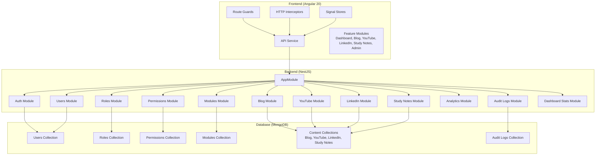
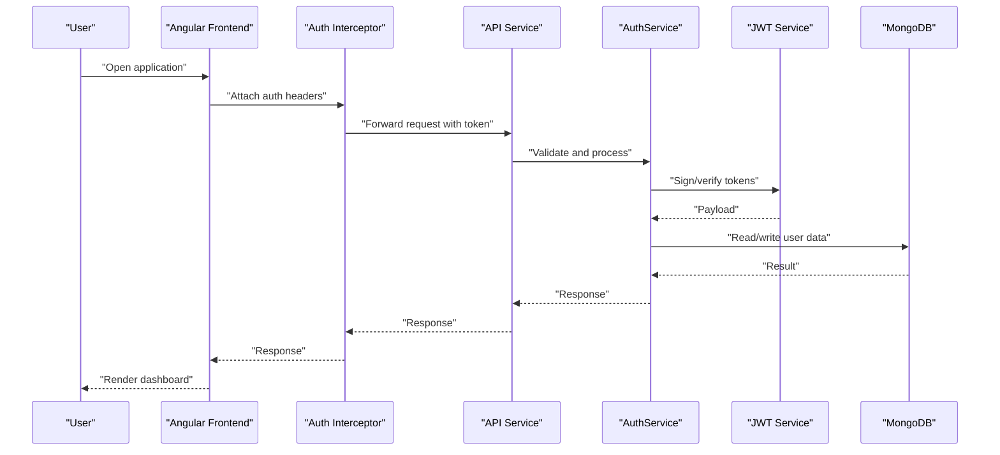
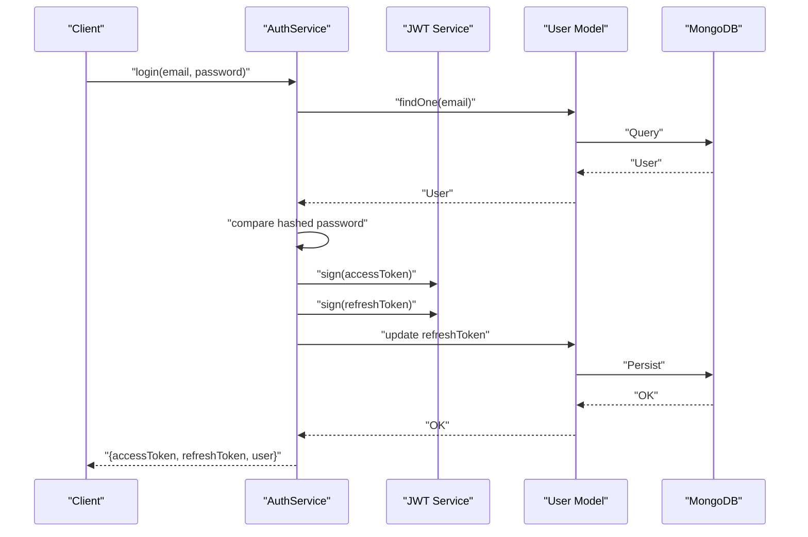
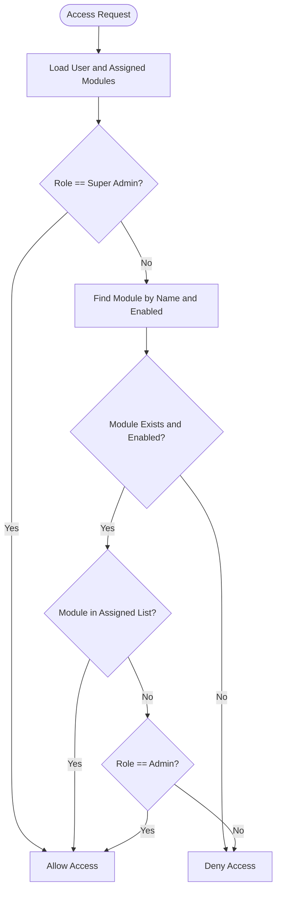
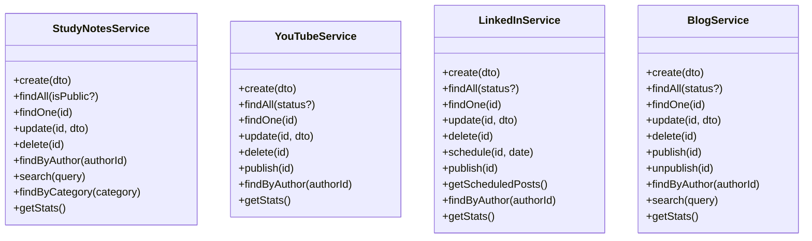
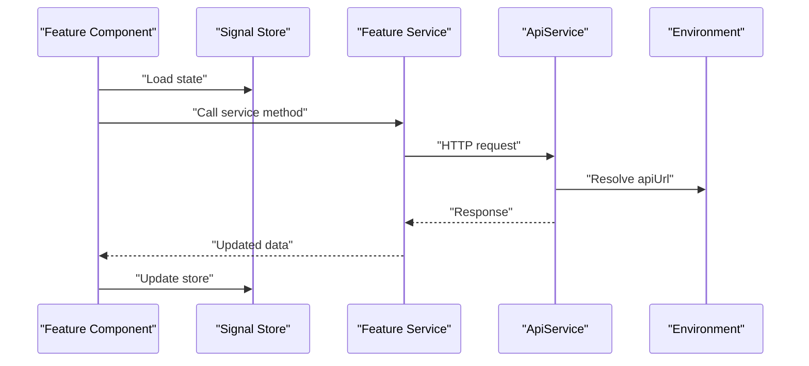
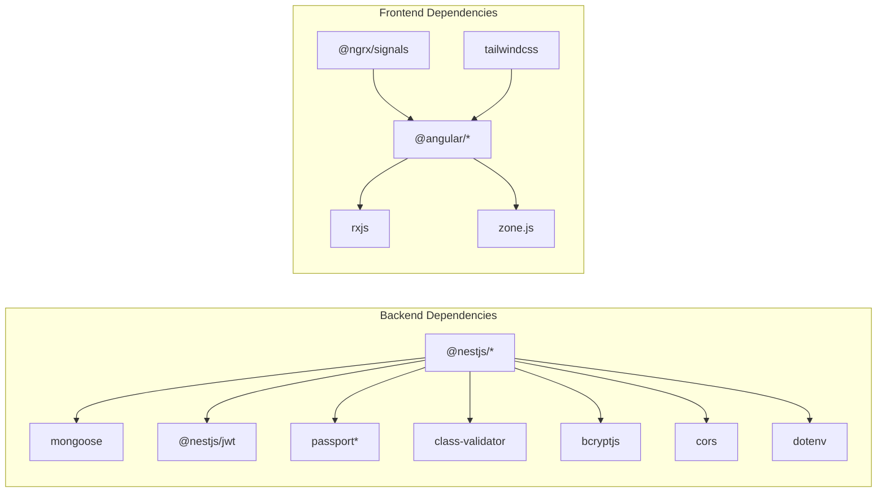

# Project Overview

<cite>
**Referenced Files in This Document**
- [PROJECT_OVERVIEW.md](file://PROJECT_OVERVIEW.md)
- [backend/readme.md](file://backend/readme.md)
- [frontend/README.md](file://frontend/README.md)
- [backend/package.json](file://backend/package.json)
- [frontend/package.json](file://frontend/package.json)
- [backend/src/app.module.ts](file://backend/src/app.module.ts)
- [backend/src/main.ts](file://backend/src/main.ts)
- [frontend/src/app/app.config.ts](file://frontend/src/app/app.config.ts)
- [frontend/src/environments/environment.ts](file://frontend/src/environments/environment.ts)
- [backend/src/auth/auth.service.ts](file://backend/src/auth/auth.service.ts)
- [backend/src/users/users.service.ts](file://backend/src/users/users.service.ts)
- [backend/src/modules/modules.service.ts](file://backend/src/modules/modules.service.ts)
- [backend/src/blog/blog.service.ts](file://backend/src/blog/blog.service.ts)
- [backend/src/youtube/youtube.service.ts](file://backend/src/youtube/youtube.service.ts)
- [backend/src/study-notes/study-notes.service.ts](file://backend/src/study-notes/study-notes.service.ts)
- [backend/src/linkedin/linkedin.service.ts](file://backend/src/linkedin/linkedin.service.ts)
- [backend/src/superadminscript/seed.ts](file://backend/src/superadminscript/seed.ts)
</cite>

## Table of Contents
1. [Introduction](#introduction)
2. [Project Structure](#project-structure)
3. [Core Components](#core-components)
4. [Architecture Overview](#architecture-overview)
5. [Detailed Component Analysis](#detailed-component-analysis)
6. [Dependency Analysis](#dependency-analysis)
7. [Performance Considerations](#performance-considerations)
8. [Troubleshooting Guide](#troubleshooting-guide)
9. [Conclusion](#conclusion)
10. [Appendices](#appendices)

## Introduction
Multi-Application-Control-Dashboard is a unified, multi-platform content management system designed to streamline the creation, scheduling, and analytics of diverse digital content across study notes, YouTube videos, LinkedIn posts, and blogs. It provides a centralized administrative interface with robust role-based access control (RBAC), dynamic module management, and comprehensive audit logging. The platform targets content creators, educators, marketers, and administrators who need a single pane of glass to manage distributed social and educational content.

Key value propositions:
- Centralized control across multiple content channels
- Strong security via JWT-based authentication and RBAC
- Flexible module enablement/disabling for tailored workflows
- Built-in analytics and audit trails for transparency and insights
- Modern, responsive UI with dark/light mode support

## Project Structure
The project follows a clear separation of concerns:
- Backend: NestJS monolith with modular domain-driven design (authentication, users, roles, permissions, modules, content modules, analytics, audit logs, dashboard stats)
- Frontend: Angular 20 application with Signal-based stores, route guards, interceptors, and a modular UI organized by features (dashboard, blog, YouTube, LinkedIn, study notes, admin)

**Diagram sources**
- [backend/src/app.module.ts](file://backend/src/app.module.ts#L1-L41)
- [frontend/src/app/app.config.ts](file://frontend/src/app/app.config.ts#L1-L34)
- [frontend/src/environments/environment.ts](file://frontend/src/environments/environment.ts#L1-L6)

**Section sources**
- [PROJECT_OVERVIEW.md](file://PROJECT_OVERVIEW.md#L5-L48)
- [backend/src/app.module.ts](file://backend/src/app.module.ts#L1-L41)
- [frontend/src/app/app.config.ts](file://frontend/src/app/app.config.ts#L1-L34)

## Core Components
- Authentication and Authorization
  - JWT-based login/register with refresh tokens
  - Local strategy and JWT strategies
  - Password hashing with bcrypt
  - User session management and logout

- Role-Based Access Control (RBAC)
  - Roles: Super Admin, Admin, Viewer
  - Permissions and role assignments
  - Module access checks per user and role

- Module Management
  - Dynamic enable/disable of content modules
  - Module statistics and access validation
  - User-to-module assignment

- Content Modules
  - Study Notes: CRUD, public/private visibility, categories, tags, views
  - YouTube: CRUD, publish/unpublish, views aggregation
  - LinkedIn: CRUD, publish/schedule/draft, scheduled publishing
  - Blog: CRUD, publish/unpublish, author population, search

- Analytics and Audit
  - Module usage statistics
  - Activity logging and audit trails
  - Dashboard stats aggregation

- Frontend Integration
  - API service with generic HTTP verbs and pagination/search helpers
  - Route guards for auth and roles
  - HTTP interceptors for auth and error handling
  - Signal-based stores for state management

**Section sources**
- [backend/src/auth/auth.service.ts](file://backend/src/auth/auth.service.ts#L1-L125)
- [backend/src/users/users.service.ts](file://backend/src/users/users.service.ts#L1-L78)
- [backend/src/modules/modules.service.ts](file://backend/src/modules/modules.service.ts#L1-L94)
- [backend/src/blog/blog.service.ts](file://backend/src/blog/blog.service.ts#L1-L78)
- [backend/src/youtube/youtube.service.ts](file://backend/src/youtube/youtube.service.ts#L1-L73)
- [backend/src/study-notes/study-notes.service.ts](file://backend/src/study-notes/study-notes.service.ts#L1-L80)
- [backend/src/linkedin/linkedin.service.ts](file://backend/src/linkedin/linkedin.service.ts#L1-L90)
- [frontend/src/app/core/services/api.service.ts](file://frontend/src/app/core/services/api.service.ts#L1-L76)

## Architecture Overview
High-level system architecture:
- Frontend (Angular 20) communicates with the backend via HTTP, using interceptors for auth and error handling, and route guards for access control.
- Backend (NestJS) exposes RESTful APIs under a global prefix, enforces validation, and connects to MongoDB using Mongoose.
- Modular backend design isolates concerns (auth, users, roles, permissions, modules, content modules, analytics, audit logs, dashboard stats).
- Seed script initializes database with demo credentials for super admin, admin, and viewer.

**Diagram sources**
- [frontend/src/app/core/services/api.service.ts](file://frontend/src/app/core/services/api.service.ts#L1-L76)
- [frontend/src/app/app.config.ts](file://frontend/src/app/app.config.ts#L1-L34)
- [backend/src/auth/auth.service.ts](file://backend/src/auth/auth.service.ts#L1-L125)
- [backend/src/main.ts](file://backend/src/main.ts#L1-L54)

**Section sources**
- [backend/src/main.ts](file://backend/src/main.ts#L1-L54)
- [frontend/src/environments/environment.ts](file://frontend/src/environments/environment.ts#L1-L6)
- [backend/readme.md](file://backend/readme.md#L1-L6)

## Detailed Component Analysis

### Authentication and Authorization
- Responsibilities
  - User validation against hashed passwords
  - Access and refresh token generation with expiration
  - Token refresh and logout handling
  - Retrieval of user details without exposing sensitive fields

- Security highlights
  - JWT access tokens with short-lived expiration
  - Refresh tokens with extended expiration and secure storage
  - Password hashing with bcrypt
  - Payload includes user role and assigned modules for fine-grained access

**Diagram sources**
- [backend/src/auth/auth.service.ts](file://backend/src/auth/auth.service.ts#L1-L125)

**Section sources**
- [backend/src/auth/auth.service.ts](file://backend/src/auth/auth.service.ts#L1-L125)

### RBAC and Module Access Control
- Responsibilities
  - Define roles and permissions
  - Assign modules to users
  - Enforce module enable/disable policies
  - Validate access per user, role, and module

- Access rules
  - Super Admin: full access to all modules
  - Admin: access to all enabled modules by default
  - Viewer: read-only access to assigned modules only

**Diagram sources**
- [backend/src/modules/modules.service.ts](file://backend/src/modules/modules.service.ts#L56-L94)

**Section sources**
- [backend/src/modules/modules.service.ts](file://backend/src/modules/modules.service.ts#L1-L94)

### Content Modules: Study Notes, YouTube, LinkedIn, Blog
- Study Notes
  - CRUD operations
  - Public/private visibility control
  - Author population and view counters
  - Category and tag-based filtering
- YouTube
  - CRUD operations
  - Publish/unpublish lifecycle
  - View aggregation
- LinkedIn
  - CRUD operations
  - Publish/schedule/draft lifecycle
  - Scheduled publishing based on date
- Blog
  - CRUD operations
  - Publish/unpublish lifecycle
  - Author population and search across title/content/tags

**Diagram sources**
- [backend/src/study-notes/study-notes.service.ts](file://backend/src/study-notes/study-notes.service.ts#L1-L80)
- [backend/src/youtube/youtube.service.ts](file://backend/src/youtube/youtube.service.ts#L1-L73)
- [backend/src/linkedin/linkedin.service.ts](file://backend/src/linkedin/linkedin.service.ts#L1-L90)
- [backend/src/blog/blog.service.ts](file://backend/src/blog/blog.service.ts#L1-L78)

**Section sources**
- [backend/src/study-notes/study-notes.service.ts](file://backend/src/study-notes/study-notes.service.ts#L1-L80)
- [backend/src/youtube/youtube.service.ts](file://backend/src/youtube/youtube.service.ts#L1-L73)
- [backend/src/linkedin/linkedin.service.ts](file://backend/src/linkedin/linkedin.service.ts#L1-L90)
- [backend/src/blog/blog.service.ts](file://backend/src/blog/blog.service.ts#L1-L78)

### Frontend Integration and State Management
- API Service
  - Generic HTTP verbs (GET, POST, PUT, PATCH, DELETE)
  - Pagination and search helpers
  - Centralized base URL from environment
- Interceptors
  - Auth interceptor for attaching tokens
  - Error interceptor for global error handling
- Guards
  - Auth guard for route protection
  - Role guard for role-based navigation
  - Module guard for module access checks
- Stores
  - Signal-based stores for reactive state management across features

**Diagram sources**
- [frontend/src/app/core/services/api.service.ts](file://frontend/src/app/core/services/api.service.ts#L1-L76)
- [frontend/src/environments/environment.ts](file://frontend/src/environments/environment.ts#L1-L6)

**Section sources**
- [frontend/src/app/core/services/api.service.ts](file://frontend/src/app/core/services/api.service.ts#L1-L76)
- [frontend/src/app/app.config.ts](file://frontend/src/app/app.config.ts#L1-L34)

## Dependency Analysis
Technology stack and external dependencies:
- Backend (NestJS)
  - Core: @nestjs/common, @nestjs/core, @nestjs/config, @nestjs/platform-express
  - Database: @nestjs/mongoose, mongoose
  - Security: @nestjs/jwt, passport, passport-jwt, passport-local
  - Utilities: class-validator, class-transformer, bcryptjs, cors, dotenv, express
- Frontend (Angular 20)
  - Core: @angular/core, @angular/common, @angular/router, @angular/forms
  - Observables: rxjs, zone.js
  - State: @ngrx/signals
  - Tooling: @angular/cli, tailwindcss, postcss

**Diagram sources**
- [backend/package.json](file://backend/package.json#L18-L36)
- [frontend/package.json](file://frontend/package.json#L12-L41)

**Section sources**
- [backend/package.json](file://backend/package.json#L1-L45)
- [frontend/package.json](file://frontend/package.json#L1-L43)

## Performance Considerations
- Backend
  - Use of ValidationPipe ensures clean, transformed DTOs and reduces downstream errors.
  - Population of author fields occurs selectively to avoid heavy joins; consider projection strategies for high-volume reads.
  - Aggregation queries (e.g., YouTube total views) should be indexed for large datasets.
- Frontend
  - Signal-based stores minimize unnecessary component updates.
  - Pagination and search reduce initial payload sizes.
  - Interceptors centralize auth logic and reduce repeated code.

## Troubleshooting Guide
Common issues and resolutions:
- CORS policy blocking requests
  - Ensure frontend origin matches allowed origins configured in the backend.
  - Verify global prefix and endpoint paths align between frontend and backend.
- Authentication failures
  - Confirm JWT secrets and expiration settings.
  - Validate user credentials and refresh token lifecycle.
- Module access denied
  - Verify module enablement and user assignment.
  - Check role hierarchy and module guard configurations.
- Demo credentials
  - Run the seed script after building the backend to initialize super admin, admin, and viewer accounts.

**Section sources**
- [backend/src/main.ts](file://backend/src/main.ts#L8-L31)
- [backend/readme.md](file://backend/readme.md#L1-L6)
- [backend/src/superadminscript/seed.ts](file://backend/src/superadminscript/seed.ts)

## Conclusion
Multi-Application-Control-Dashboard delivers a cohesive, scalable solution for managing diverse content across platforms with strong security, flexible access control, and insightful analytics. Its modular backend and modern Angular frontend provide a solid foundation for growth, while built-in auditing and statistics support operational excellence.

## Appendices

### Target Audience
- Content creators and educators
- Marketing teams and social media managers
- Administrators requiring centralized oversight
- Teams needing auditability and reporting

### Business Value Proposition
- Reduced operational overhead through unified dashboards
- Enhanced collaboration via RBAC and module assignment
- Improved compliance with audit logs and activity tracking
- Scalable architecture supporting additional content channels

### Project Scope
- Current modules: Study Notes, YouTube, LinkedIn, Blog
- Core capabilities: Authentication, RBAC, module management, analytics, audit logs
- UI coverage: Dashboard, forms, lists, views, admin panels, and settings

### Limitations
- Refresh token rotation depends on stored tokens; ensure secure storage and rotation policies.
- Module access relies on enabled flags and user assignments; misconfiguration can block legitimate access.
- Analytics rely on accurate data entry and lifecycle transitions; implement validation and defaults.

### Future Roadmap
- Introduce additional content channels (e.g., Twitter/X, Instagram)
- Enhance analytics with real-time metrics and export capabilities
- Add bulk operations and advanced filtering/search
- Implement webhook integrations for external systems
- Expand admin controls for granular permission management