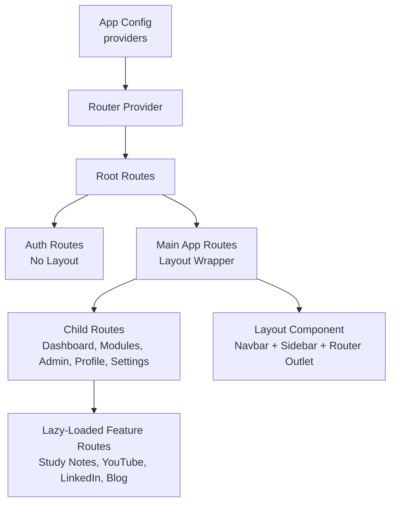
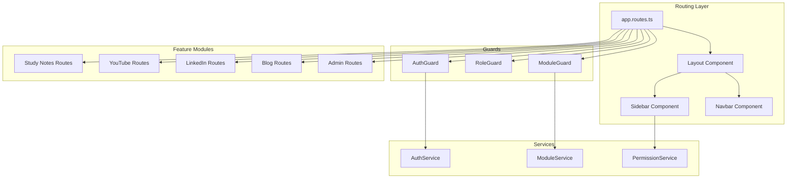
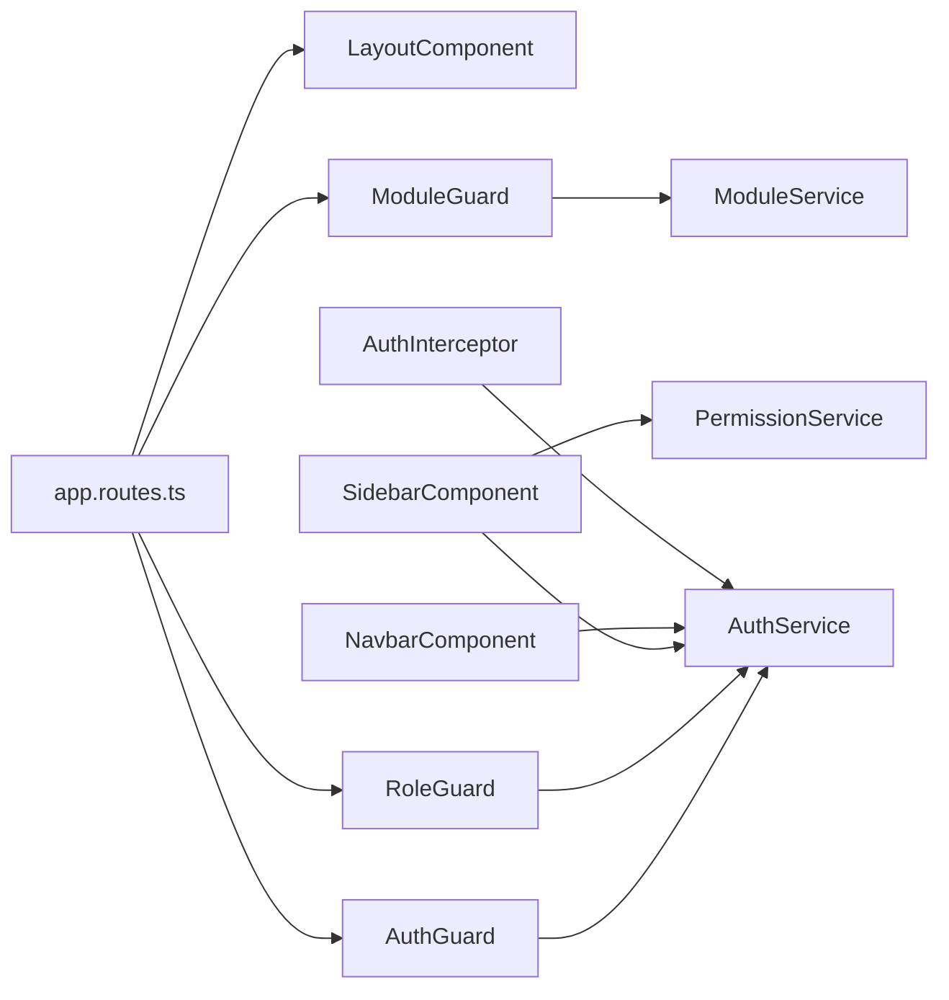

# Routing and Navigation

<cite>
**Referenced Files in This Document**
- [app.routes.ts](file://frontend/src/app/app.routes.ts)
- [app.config.ts](file://frontend/src/app/app.config.ts)
- [auth.guard.ts](file://frontend/src/app/core/guards/auth.guard.ts)
- [role.guard.ts](file://frontend/src/app/core/guards/role.guard.ts)
- [auth.interceptor.ts](file://frontend/src/app/core/interceptors/auth.interceptor.ts)
- [auth.service.ts](file://frontend/src/app/core/services/auth.service.ts)
- [module.service.ts](file://frontend/src/app/core/services/module.service.ts)
- [permission.service.ts](file://frontend/src/app/core/services/permission.service.ts)
- [layout.component.ts](file://frontend/src/app/shared/layouts/layout.component.ts)
- [sidebar.component.ts](file://frontend/src/app/shared/components/sidebar/sidebar.component.ts)
- [navbar.component.ts](file://frontend/src/app/shared/components/navbar/navbar.component.ts)
- [access-denied.component.ts](file://frontend/src/app/shared/pages/access-denied/access-denied.component.ts)
- [STUDY_NOTES_ROUTES](file://frontend/src/app/features/study-notes/study-notes.routes.ts)
- [BLOG_ROUTES](file://frontend/src/app/features/blog/blog.routes.ts)
- [YOUTUBE_ROUTES](file://frontend/src/app/features/youtube/youtube.routes.ts)
- [LINKEDIN_ROUTES](file://frontend/src/app/features/linkedin/linkedin.routes.ts)
- [ADMIN_ROUTES](file://frontend/src/app/features/admin/admin.routes.ts)
</cite>

## Table of Contents
1. [Introduction](#introduction)
2. [Project Structure](#project-structure)
3. [Core Components](#core-components)
4. [Architecture Overview](#architecture-overview)
5. [Detailed Component Analysis](#detailed-component-analysis)
6. [Dependency Analysis](#dependency-analysis)
7. [Performance Considerations](#performance-considerations)
8. [Troubleshooting Guide](#troubleshooting-guide)
9. [Conclusion](#conclusion)

## Introduction
This document explains the routing and navigation architecture of the Multi-Application-Control-Dashboard frontend. It covers Angular routing configuration, lazy loading strategy, route guards, hierarchical routing, protected routes, role-based navigation, dynamic route generation, and navigation components such as the sidebar and navbar. Practical examples are provided via file references to guide implementation and troubleshooting.

## Project Structure
The routing system is centralized in the application routes file and composed of:
- Root routes with authentication and main application sections
- Lazy-loaded feature modules with dedicated route constants
- Shared layout wrapper for authenticated routes
- Guard registration and HTTP interceptors for auth state and token handling

**Diagram sources**
- [app.config.ts](file://frontend/src/app/app.config.ts#L10-L33)
- [app.routes.ts](file://frontend/src/app/app.routes.ts#L8-L113)
- [layout.component.ts](file://frontend/src/app/shared/layouts/layout.component.ts#L7-L14)

**Section sources**
- [app.routes.ts](file://frontend/src/app/app.routes.ts#L8-L113)
- [app.config.ts](file://frontend/src/app/app.config.ts#L10-L33)

## Core Components
- Root routing configuration defines:
  - Authentication namespace under /auth with inline components
  - Main application namespace under / with a shared layout wrapper
  - Lazy-loaded feature modules with module-specific route constants
  - Role-based and module-based guards for sensitive areas
  - Global 404 redirection to dashboard
- Guards:
  - AuthGuard ensures presence of a valid token and redirects unauthenticated users to login with return URL
  - RoleGuard enforces role-based access for admin routes
  - ModuleGuard checks per-user module access with caching and redirects to access denied when unauthorized
- Interceptors:
  - AuthInterceptor attaches Bearer tokens to outgoing requests and handles 401 by attempting token refresh
- Services:
  - AuthService manages user session, tokens, and profile
  - ModuleService provides module access checks and module administration APIs
  - PermissionService evaluates role-based and module-based permissions for UI visibility and actions

**Section sources**
- [app.routes.ts](file://frontend/src/app/app.routes.ts#L8-L113)
- [auth.guard.ts](file://frontend/src/app/core/guards/auth.guard.ts#L10-L25)
- [role.guard.ts](file://frontend/src/app/core/guards/role.guard.ts#L11-L46)
- [role.guard.ts](file://frontend/src/app/core/guards/role.guard.ts#L51-L133)
- [auth.interceptor.ts](file://frontend/src/app/core/interceptors/auth.interceptor.ts#L8-L45)
- [auth.service.ts](file://frontend/src/app/core/services/auth.service.ts#L31-L160)
- [module.service.ts](file://frontend/src/app/core/services/module.service.ts#L30-L138)
- [permission.service.ts](file://frontend/src/app/core/services/permission.service.ts#L7-L83)

## Architecture Overview
The routing architecture separates authentication from application routes and wraps the latter in a shared layout. Feature modules are lazily loaded using route constants, enabling scalable growth. Guards enforce access policies at multiple levels, while interceptors maintain secure and resilient HTTP communication.

**Diagram sources**
- [app.routes.ts](file://frontend/src/app/app.routes.ts#L8-L113)
- [layout.component.ts](file://frontend/src/app/shared/layouts/layout.component.ts#L7-L14)
- [sidebar.component.ts](file://frontend/src/app/shared/components/sidebar/sidebar.component.ts#L33-L48)
- [navbar.component.ts](file://frontend/src/app/shared/components/navbar/navbar.component.ts#L19-L25)
- [auth.guard.ts](file://frontend/src/app/core/guards/auth.guard.ts#L10-L25)
- [role.guard.ts](file://frontend/src/app/core/guards/role.guard.ts#L11-L46)
- [role.guard.ts](file://frontend/src/app/core/guards/role.guard.ts#L51-L133)
- [auth.service.ts](file://frontend/src/app/core/services/auth.service.ts#L31-L160)
- [module.service.ts](file://frontend/src/app/core/services/module.service.ts#L94-L102)
- [permission.service.ts](file://frontend/src/app/core/services/permission.service.ts#L10-L22)
- [STUDY_NOTES_ROUTES](file://frontend/src/app/features/study-notes/study-notes.routes.ts#L3-L20)
- [YOUTUBE_ROUTES](file://frontend/src/app/features/youtube/youtube.routes.ts#L3-L20)
- [LINKEDIN_ROUTES](file://frontend/src/app/features/linkedin/linkedin.routes.ts#L3-L20)
- [BLOG_ROUTES](file://frontend/src/app/features/blog/blog.routes.ts#L3-L20)
- [ADMIN_ROUTES](file://frontend/src/app/features/admin/admin.routes.ts#L3-L16)

## Detailed Component Analysis

### Root Routing Configuration
- Authentication routes:
  - /auth/login and /auth/register with inline and lazy components respectively
  - Defaults to login when /auth is accessed
- Main application routes:
  - / with LayoutComponent wrapping child routes
  - Child routes include dashboard, module routes (lazy), admin (role-guarded), profile, settings, access-denied
  - Default redirect to dashboard for empty path
  - Catch-all wildcard redirects to dashboard

Practical example references:
- [Root routes definition](file://frontend/src/app/app.routes.ts#L8-L113)

**Section sources**
- [app.routes.ts](file://frontend/src/app/app.routes.ts#L8-L113)

### Lazy Loading Strategy
- Feature modules are lazy-loaded using loadChildren with route constants:
  - Study Notes: [STUDY_NOTES_ROUTES](file://frontend/src/app/features/study-notes/study-notes.routes.ts#L3-L20)
  - YouTube: [YOUTUBE_ROUTES](file://frontend/src/app/features/youtube/youtube.routes.ts#L3-L20)
  - LinkedIn: [LINKEDIN_ROUTES](file://frontend/src/app/features/linkedin/linkedin.routes.ts#L3-L20)
  - Blog: [BLOG_ROUTES](file://frontend/src/app/features/blog/blog.routes.ts#L3-L20)
  - Admin: [ADMIN_ROUTES](file://frontend/src/app/features/admin/admin.routes.ts#L3-L16)
- ModuleGuard protects module routes and caches access decisions to reduce API calls

Practical example references:
- [Module route with lazy loading and ModuleGuard](file://frontend/src/app/app.routes.ts#L42-L71)
- [ModuleGuard cache and API call](file://frontend/src/app/core/guards/role.guard.ts#L63-L104)

**Section sources**
- [app.routes.ts](file://frontend/src/app/app.routes.ts#L42-L79)
- [role.guard.ts](file://frontend/src/app/core/guards/role.guard.ts#L51-L133)
- [STUDY_NOTES_ROUTES](file://frontend/src/app/features/study-notes/study-notes.routes.ts#L3-L20)
- [YOUTUBE_ROUTES](file://frontend/src/app/features/youtube/youtube.routes.ts#L3-L20)
- [LINKEDIN_ROUTES](file://frontend/src/app/features/linkedin/linkedin.routes.ts#L3-L20)
- [BLOG_ROUTES](file://frontend/src/app/features/blog/blog.routes.ts#L3-L20)
- [ADMIN_ROUTES](file://frontend/src/app/features/admin/admin.routes.ts#L3-L16)

### Route Guards Implementation
- AuthGuard:
  - Checks token existence and redirects to /auth/login with return URL when missing
  - Reference: [AuthGuard](file://frontend/src/app/core/guards/auth.guard.ts#L10-L25)
- RoleGuard:
  - Enforces roles from route data (e.g., SUPER_ADMIN, ADMIN) for admin routes
  - Reference: [RoleGuard](file://frontend/src/app/core/guards/role.guard.ts#L11-L46)
- ModuleGuard:
  - Validates per-user module access with caching and navigates to access-denied when unauthorized
  - Reference: [ModuleGuard](file://frontend/src/app/core/guards/role.guard.ts#L51-L133)

Practical example references:
- [Admin route with RoleGuard](file://frontend/src/app/app.routes.ts#L74-L79)
- [Module route with ModuleGuard](file://frontend/src/app/app.routes.ts#L42-L71)

**Section sources**
- [auth.guard.ts](file://frontend/src/app/core/guards/auth.guard.ts#L10-L25)
- [role.guard.ts](file://frontend/src/app/core/guards/role.guard.ts#L11-L46)
- [role.guard.ts](file://frontend/src/app/core/guards/role.guard.ts#L51-L133)
- [app.routes.ts](file://frontend/src/app/app.routes.ts#L74-L79)
- [app.routes.ts](file://frontend/src/app/app.routes.ts#L42-L71)

### Navigation Components
- Layout wrapper:
  - Provides a shared shell with RouterOutlet and composes Navbar and Sidebar
  - Reference: [LayoutComponent](file://frontend/src/app/shared/layouts/layout.component.ts#L7-L14)
- Sidebar:
  - Builds menu items dynamically based on user role and assigned modules
  - Supports nested sections (Content, Administration, Account) with icons and badges
  - Visibility filtered by role requirements and module access
  - Reference: [SidebarComponent](file://frontend/src/app/shared/components/sidebar/sidebar.component.ts#L65-L177)
- Navbar:
  - Displays user info, role badge, and logout action
  - Integrates with AuthService for current user state
  - Reference: [NavbarComponent](file://frontend/src/app/shared/components/navbar/navbar.component.ts#L13-L119)

Practical example references:
- [Sidebar menu building and visibility](file://frontend/src/app/shared/components/sidebar/sidebar.component.ts#L65-L177)
- [Navbar user actions and logout](file://frontend/src/app/shared/components/navbar/navbar.component.ts#L58-L61)

**Section sources**
- [layout.component.ts](file://frontend/src/app/shared/layouts/layout.component.ts#L7-L14)
- [sidebar.component.ts](file://frontend/src/app/shared/components/sidebar/sidebar.component.ts#L65-L177)
- [navbar.component.ts](file://frontend/src/app/shared/components/navbar/navbar.component.ts#L13-L119)

### Hierarchical Routing Structure
- Root:
  - /auth (no layout)
  - / (with layout)
- Children under /:
  - Dashboard, Study Notes, YouTube, LinkedIn, Blog, Admin, Profile, Settings, Access Denied
- Nested routes inside feature modules:
  - List, Create, View by Id, Edit by Id patterns

Practical example references:
- [Main routes under /](file://frontend/src/app/app.routes.ts#L30-L106)
- [Study Notes nested routes](file://frontend/src/app/features/study-notes/study-notes.routes.ts#L3-L20)
- [YouTube nested routes](file://frontend/src/app/features/youtube/youtube.routes.ts#L3-L20)
- [LinkedIn nested routes](file://frontend/src/app/features/linkedin/linkedin.routes.ts#L3-L20)
- [Blog nested routes](file://frontend/src/app/features/blog/blog.routes.ts#L3-L20)
- [Admin nested routes](file://frontend/src/app/features/admin/admin.routes.ts#L3-L16)

**Section sources**
- [app.routes.ts](file://frontend/src/app/app.routes.ts#L30-L106)
- [STUDY_NOTES_ROUTES](file://frontend/src/app/features/study-notes/study-notes.routes.ts#L3-L20)
- [YOUTUBE_ROUTES](file://frontend/src/app/features/youtube/youtube.routes.ts#L3-L20)
- [LINKEDIN_ROUTES](file://frontend/src/app/features/linkedin/linkedin.routes.ts#L3-L20)
- [BLOG_ROUTES](file://frontend/src/app/features/blog/blog.routes.ts#L3-L20)
- [ADMIN_ROUTES](file://frontend/src/app/features/admin/admin.routes.ts#L3-L16)

### Protected Routes and Role-Based Navigation
- Admin routes require SUPER_ADMIN or ADMIN roles enforced by RoleGuard
- Module routes require per-user module access enforced by ModuleGuard
- Sidebar filters menu items based on role and module permissions
- Access Denied page is used when guards deny access

Practical example references:
- [Admin route with roles](file://frontend/src/app/app.routes.ts#L74-L79)
- [Module route with module access](file://frontend/src/app/app.routes.ts#L42-L71)
- [Sidebar role/module filtering](file://frontend/src/app/shared/components/sidebar/sidebar.component.ts#L160-L177)
- [Access Denied component](file://frontend/src/app/shared/pages/access-denied/access-denied.component.ts#L5-L12)

**Section sources**
- [app.routes.ts](file://frontend/src/app/app.routes.ts#L74-L79)
- [app.routes.ts](file://frontend/src/app/app.routes.ts#L42-L71)
- [sidebar.component.ts](file://frontend/src/app/shared/components/sidebar/sidebar.component.ts#L160-L177)
- [access-denied.component.ts](file://frontend/src/app/shared/pages/access-denied/access-denied.component.ts#L5-L12)

### Dynamic Route Generation
- Feature modules define route constants for internal navigation
- ModuleGuard dynamically decides whether to allow navigation based on user and module state
- Sidebar dynamically constructs menus based on current user role and assigned modules

Practical example references:
- [Feature route constants](file://frontend/src/app/features/study-notes/study-notes.routes.ts#L3-L20)
- [ModuleGuard dynamic access check](file://frontend/src/app/core/guards/role.guard.ts#L92-L104)
- [Sidebar dynamic menu construction](file://frontend/src/app/shared/components/sidebar/sidebar.component.ts#L65-L155)

**Section sources**
- [STUDY_NOTES_ROUTES](file://frontend/src/app/features/study-notes/study-notes.routes.ts#L3-L20)
- [role.guard.ts](file://frontend/src/app/core/guards/role.guard.ts#L92-L104)
- [sidebar.component.ts](file://frontend/src/app/shared/components/sidebar/sidebar.component.ts#L65-L155)

### Navigation State Management
- AuthService exposes current user and authentication state via RxJS observables
- Sidebar subscribes to user changes to rebuild menus reactively
- ModuleGuard caches module access decisions to minimize network calls
- AuthInterceptor manages token attachment and refresh on 401 errors

Practical example references:
- [AuthService observables and methods](file://frontend/src/app/core/services/auth.service.ts#L33-L160)
- [Sidebar subscription and rebuild](file://frontend/src/app/shared/components/sidebar/sidebar.component.ts#L40-L44)
- [ModuleGuard caching](file://frontend/src/app/core/guards/role.guard.ts#L52-L124)
- [AuthInterceptor token handling](file://frontend/src/app/core/interceptors/auth.interceptor.ts#L11-L44)

**Section sources**
- [auth.service.ts](file://frontend/src/app/core/services/auth.service.ts#L33-L160)
- [sidebar.component.ts](file://frontend/src/app/shared/components/sidebar/sidebar.component.ts#L40-L44)
- [role.guard.ts](file://frontend/src/app/core/guards/role.guard.ts#L52-L124)
- [auth.interceptor.ts](file://frontend/src/app/core/interceptors/auth.interceptor.ts#L11-L44)

## Dependency Analysis
The routing system exhibits clear separation of concerns:
- Routing depends on guards and services for policy enforcement
- Guards depend on services for user and module state
- Interceptors depend on AuthService for token management
- UI components depend on services for reactive updates

**Diagram sources**
- [app.routes.ts](file://frontend/src/app/app.routes.ts#L8-L113)
- [layout.component.ts](file://frontend/src/app/shared/layouts/layout.component.ts#L7-L14)
- [auth.guard.ts](file://frontend/src/app/core/guards/auth.guard.ts#L10-L25)
- [role.guard.ts](file://frontend/src/app/core/guards/role.guard.ts#L11-L46)
- [role.guard.ts](file://frontend/src/app/core/guards/role.guard.ts#L51-L133)
- [sidebar.component.ts](file://frontend/src/app/shared/components/sidebar/sidebar.component.ts#L33-L48)
- [navbar.component.ts](file://frontend/src/app/shared/components/navbar/navbar.component.ts#L19-L25)
- [auth.interceptor.ts](file://frontend/src/app/core/interceptors/auth.interceptor.ts#L8-L45)
- [auth.service.ts](file://frontend/src/app/core/services/auth.service.ts#L31-L160)
- [module.service.ts](file://frontend/src/app/core/services/module.service.ts#L30-L138)
- [permission.service.ts](file://frontend/src/app/core/services/permission.service.ts#L7-L83)

**Section sources**
- [app.routes.ts](file://frontend/src/app/app.routes.ts#L8-L113)
- [role.guard.ts](file://frontend/src/app/core/guards/role.guard.ts#L11-L46)
- [auth.guard.ts](file://frontend/src/app/core/guards/auth.guard.ts#L10-L25)
- [auth.interceptor.ts](file://frontend/src/app/core/interceptors/auth.interceptor.ts#L8-L45)
- [sidebar.component.ts](file://frontend/src/app/shared/components/sidebar/sidebar.component.ts#L33-L48)
- [navbar.component.ts](file://frontend/src/app/shared/components/navbar/navbar.component.ts#L19-L25)
- [auth.service.ts](file://frontend/src/app/core/services/auth.service.ts#L31-L160)
- [module.service.ts](file://frontend/src/app/core/services/module.service.ts#L30-L138)
- [permission.service.ts](file://frontend/src/app/core/services/permission.service.ts#L7-L83)

## Performance Considerations
- Lazy loading reduces initial bundle size by loading feature modules on demand
- ModuleGuard caches module access decisions to minimize repeated API calls
- AuthInterceptor avoids redundant token refresh attempts and handles 401 gracefully
- Reactive UI updates via services prevent unnecessary re-renders

[No sources needed since this section provides general guidance]

## Troubleshooting Guide
Common issues and resolutions:
- Unauthorized access to module routes:
  - Verify user role and assigned modules; ensure ModuleGuard is applied
  - Reference: [ModuleGuard](file://frontend/src/app/core/guards/role.guard.ts#L51-L133)
- Access Denied page appears:
  - Confirm route data roles and module names; check guard redirection logic
  - Reference: [Access Denied component](file://frontend/src/app/shared/pages/access-denied/access-denied.component.ts#L5-L12)
- 401 errors on protected endpoints:
  - Ensure AuthInterceptor attaches Bearer token and refreshes token on 401
  - Reference: [AuthInterceptor](file://frontend/src/app/core/interceptors/auth.interceptor.ts#L11-L44)
- Sidebar does not show expected items:
  - Check user role and assigned modules; confirm PermissionService evaluation
  - Reference: [PermissionService](file://frontend/src/app/core/services/permission.service.ts#L10-L22)
  - Reference: [Sidebar visibility logic](file://frontend/src/app/shared/components/sidebar/sidebar.component.ts#L160-L177)

**Section sources**
- [role.guard.ts](file://frontend/src/app/core/guards/role.guard.ts#L51-L133)
- [access-denied.component.ts](file://frontend/src/app/shared/pages/access-denied/access-denied.component.ts#L5-L12)
- [auth.interceptor.ts](file://frontend/src/app/core/interceptors/auth.interceptor.ts#L11-L44)
- [permission.service.ts](file://frontend/src/app/core/services/permission.service.ts#L10-L22)
- [sidebar.component.ts](file://frontend/src/app/shared/components/sidebar/sidebar.component.ts#L160-L177)

## Conclusion
The routing and navigation system leverages Angular’s modular architecture with lazy loading, robust guards, and reactive services to deliver a secure, scalable, and user-friendly experience. Guards enforce authentication and authorization, while the sidebar and navbar provide intuitive navigation tailored to user roles and module access. The design supports future growth through dynamic route generation and centralized configuration.