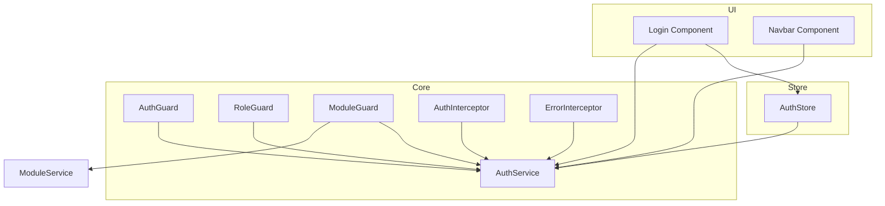
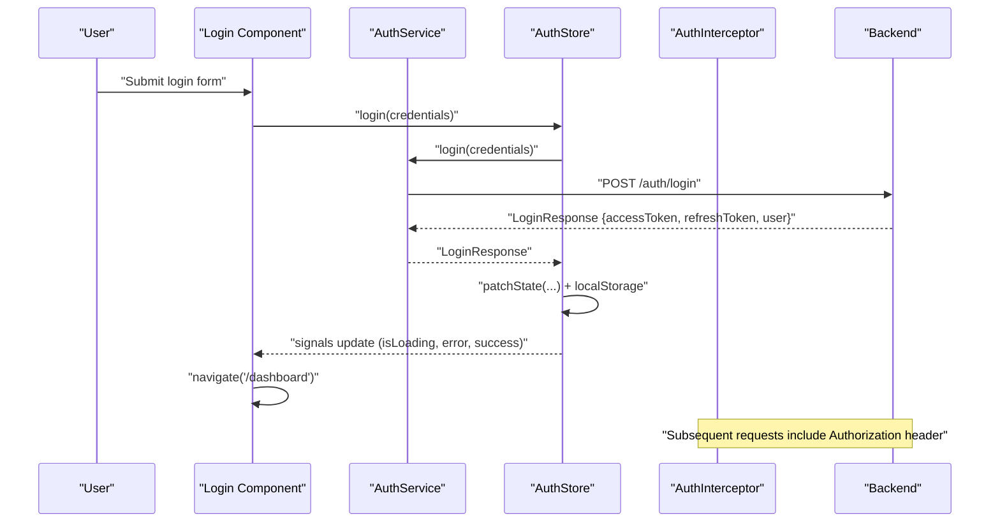
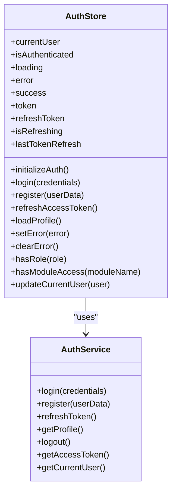
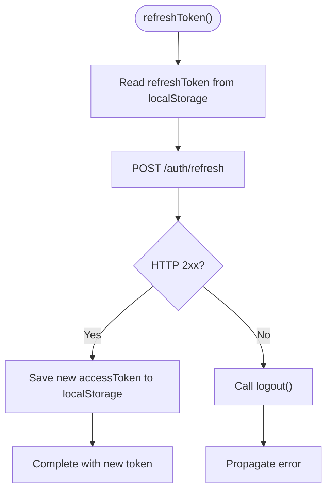
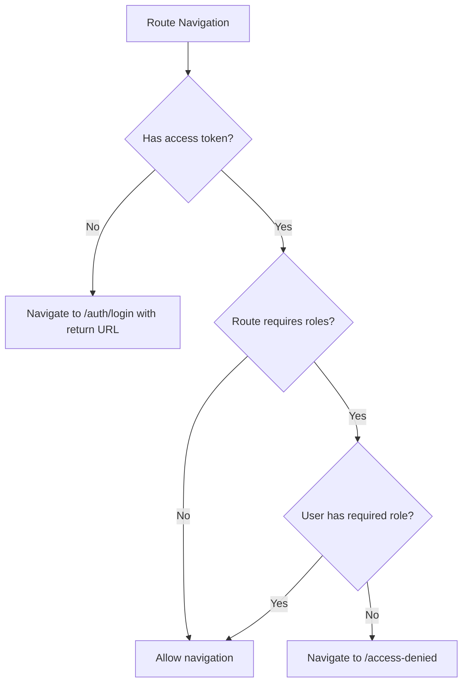
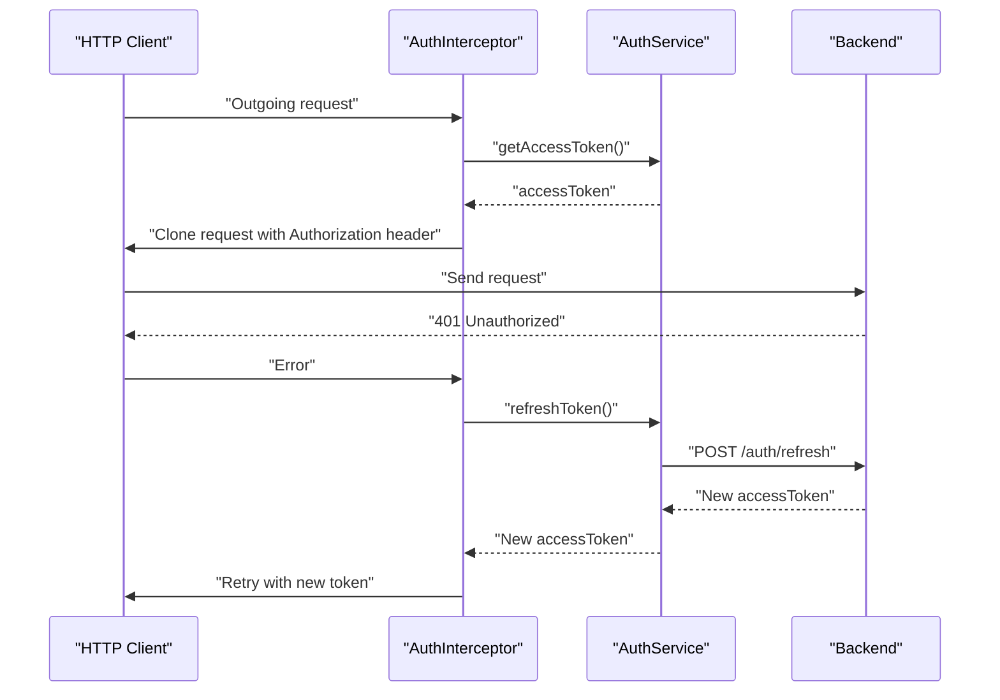
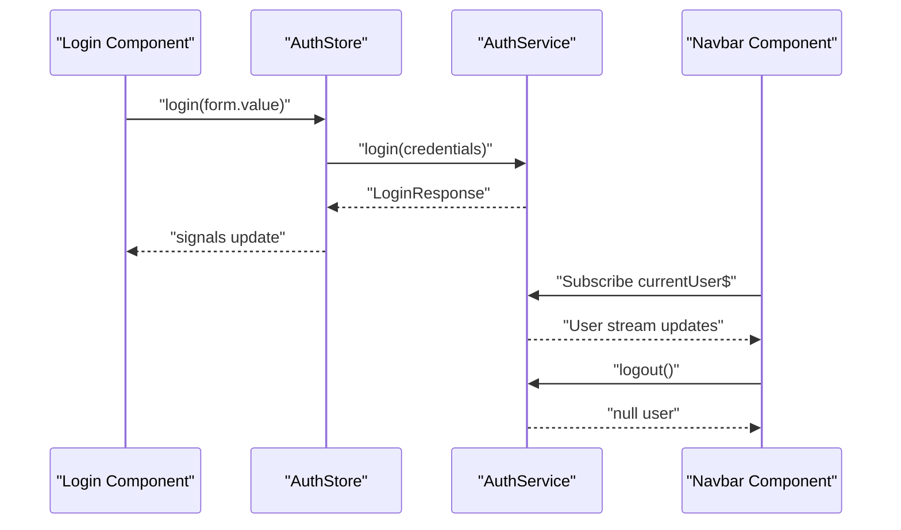
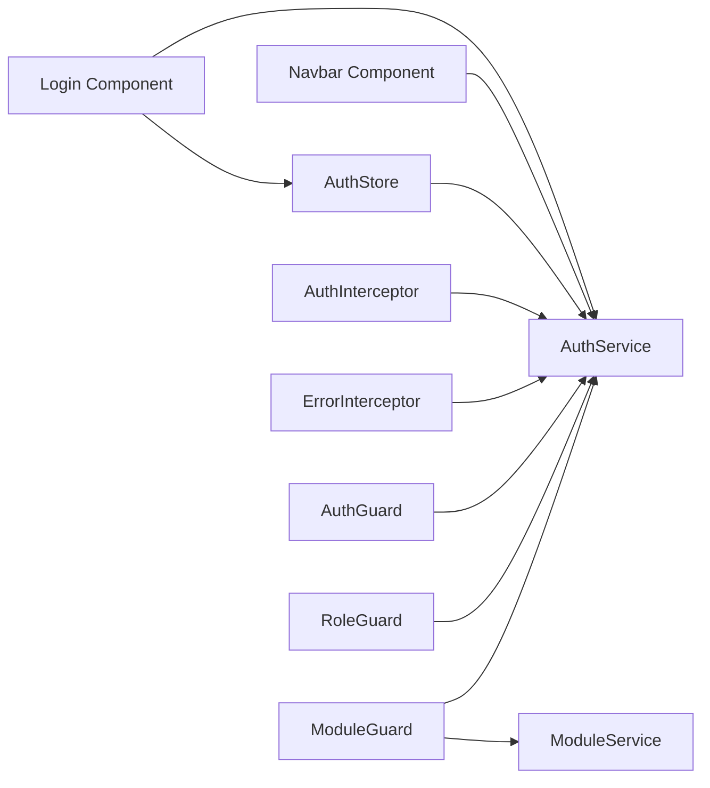

# Authentication Store

<cite>
**Referenced Files in This Document**
- [auth.store.ts](file://frontend/src/app/core/store/auth.store.ts)
- [auth.service.ts](file://frontend/src/app/core/services/auth.service.ts)
- [auth.guard.ts](file://frontend/src/app/core/guards/auth.guard.ts)
- [role.guard.ts](file://frontend/src/app/core/guards/role.guard.ts)
- [auth.interceptor.ts](file://frontend/src/app/core/interceptors/auth.interceptor.ts)
- [error.interceptor.ts](file://frontend/src/app/core/interceptors/error.interceptor.ts)
- [login.component.ts](file://frontend/src/app/features/auth/login/login.component.ts)
- [app.config.ts](file://frontend/src/app/app.config.ts)
- [app.routes.ts](file://frontend/src/app/app.routes.ts)
- [module.service.ts](file://frontend/src/app/core/services/module.service.ts)
- [navbar.component.ts](file://frontend/src/app/shared/components/navbar/navbar.component.ts)
- [current-user.decorator.ts](file://backend/src/auth/decorators/current-user.decorator.ts)
</cite>

## Table of Contents
1. [Introduction](#introduction)
2. [Project Structure](#project-structure)
3. [Core Components](#core-components)
4. [Architecture Overview](#architecture-overview)
5. [Detailed Component Analysis](#detailed-component-analysis)
6. [Dependency Analysis](#dependency-analysis)
7. [Performance Considerations](#performance-considerations)
8. [Troubleshooting Guide](#troubleshooting-guide)
9. [Conclusion](#conclusion)
10. [Appendices](#appendices)

## Introduction
This document explains the authentication store implementation using Angular Signals. It covers how user session data, JWT tokens, and role-based access are managed reactively, how login/logout transitions work, and how the store integrates with services, route guards, and HTTP interceptors. Practical examples show how to subscribe to authentication state, handle login forms, and implement logout flows. Security considerations, token refresh mechanisms, and session persistence strategies are also addressed.

## Project Structure
The authentication domain spans the store, service, guards, interceptors, and UI components:
- Store: Reactive state for user, tokens, loading, and errors
- Service: HTTP client wrapper for login/register/profile/refresh
- Guards: Route protection via token presence and role/module checks
- Interceptors: Automatic token injection and refresh on 401
- UI: Login form and navbar integration

**Diagram sources**
- [auth.store.ts](file://frontend/src/app/core/store/auth.store.ts#L1-L223)
- [auth.service.ts](file://frontend/src/app/core/services/auth.service.ts#L1-L161)
- [auth.guard.ts](file://frontend/src/app/core/guards/auth.guard.ts#L1-L26)
- [role.guard.ts](file://frontend/src/app/core/guards/role.guard.ts#L1-L134)
- [auth.interceptor.ts](file://frontend/src/app/core/interceptors/auth.interceptor.ts#L1-L46)
- [error.interceptor.ts](file://frontend/src/app/core/interceptors/error.interceptor.ts#L1-L153)
- [login.component.ts](file://frontend/src/app/features/auth/login/login.component.ts#L1-L96)
- [navbar.component.ts](file://frontend/src/app/shared/components/navbar/navbar.component.ts#L1-L120)
- [module.service.ts](file://frontend/src/app/core/services/module.service.ts#L1-L139)

**Section sources**
- [auth.store.ts](file://frontend/src/app/core/store/auth.store.ts#L1-L223)
- [auth.service.ts](file://frontend/src/app/core/services/auth.service.ts#L1-L161)
- [auth.guard.ts](file://frontend/src/app/core/guards/auth.guard.ts#L1-L26)
- [role.guard.ts](file://frontend/src/app/core/guards/role.guard.ts#L1-L134)
- [auth.interceptor.ts](file://frontend/src/app/core/interceptors/auth.interceptor.ts#L1-L46)
- [error.interceptor.ts](file://frontend/src/app/core/interceptors/error.interceptor.ts#L1-L153)
- [login.component.ts](file://frontend/src/app/features/auth/login/login.component.ts#L1-L96)
- [navbar.component.ts](file://frontend/src/app/shared/components/navbar/navbar.component.ts#L1-L120)
- [module.service.ts](file://frontend/src/app/core/services/module.service.ts#L1-L139)

## Core Components
- AuthStore: Central reactive store managing user, tokens, loading, error, and refresh state. Provides computed selectors for UI and role checks, and methods for login, register, refresh, profile load, and logout.
- AuthService: Encapsulates HTTP calls for login, register, refresh, profile, and token helpers. Maintains BehaviorSubject streams for current user and authentication status.
- Guards: AuthGuard checks token presence; RoleGuard validates roles; ModuleGuard enforces module access with caching.
- Interceptors: AuthInterceptor attaches Bearer tokens and auto-refreshes on 401; ErrorInterceptor centralizes error UX and navigation.
- UI Integration: Login component subscribes to store signals; Navbar uses AuthService for immediate UI updates.

**Section sources**
- [auth.store.ts](file://frontend/src/app/core/store/auth.store.ts#L8-L30)
- [auth.store.ts](file://frontend/src/app/core/store/auth.store.ts#L35-L56)
- [auth.store.ts](file://frontend/src/app/core/store/auth.store.ts#L57-L220)
- [auth.service.ts](file://frontend/src/app/core/services/auth.service.ts#L31-L160)
- [auth.guard.ts](file://frontend/src/app/core/guards/auth.guard.ts#L10-L25)
- [role.guard.ts](file://frontend/src/app/core/guards/role.guard.ts#L11-L46)
- [role.guard.ts](file://frontend/src/app/core/guards/role.guard.ts#L51-L133)
- [auth.interceptor.ts](file://frontend/src/app/core/interceptors/auth.interceptor.ts#L8-L45)
- [error.interceptor.ts](file://frontend/src/app/core/interceptors/error.interceptor.ts#L10-L153)
- [login.component.ts](file://frontend/src/app/features/auth/login/login.component.ts#L14-L96)
- [navbar.component.ts](file://frontend/src/app/shared/components/navbar/navbar.component.ts#L13-L61)

## Architecture Overview
The authentication flow is reactive and centralized:
- UI triggers actions via AuthStore methods
- AuthStore delegates to AuthService for HTTP operations
- AuthInterceptor injects tokens and handles 401 refresh
- Guards enforce access at route level
- ErrorInterceptor normalizes error UX

**Diagram sources**
- [login.component.ts](file://frontend/src/app/features/auth/login/login.component.ts#L71-L80)
- [auth.store.ts](file://frontend/src/app/core/store/auth.store.ts#L105-L128)
- [auth.service.ts](file://frontend/src/app/core/services/auth.service.ts#L60-L71)
- [auth.interceptor.ts](file://frontend/src/app/core/interceptors/auth.interceptor.ts#L11-L21)

**Section sources**
- [login.component.ts](file://frontend/src/app/features/auth/login/login.component.ts#L71-L80)
- [auth.store.ts](file://frontend/src/app/core/store/auth.store.ts#L105-L128)
- [auth.service.ts](file://frontend/src/app/core/services/auth.service.ts#L60-L71)
- [auth.interceptor.ts](file://frontend/src/app/core/interceptors/auth.interceptor.ts#L11-L21)

## Detailed Component Analysis

### AuthStore: Reactive Authentication State
AuthStore defines the state shape and exposes computed properties and methods:
- State fields: currentUser, isAuthenticated, loading, error, success, token, refreshToken, isRefreshing, lastTokenRefresh
- Computed selectors: isLoading, isRefreshingToken, hasToken, userEmail, userName, userRole, assignedModules, isAdmin, isSuperAdmin, isViewer, userIsActive
- Methods:
  - initializeAuth: hydrates state from localStorage on app init
  - login: dispatches credentials, updates state, navigates on success
  - register: similar to login
  - refreshAccessToken: calls AuthService.refreshToken and updates token
  - loadProfile: fetches and persists user profile
  - setError/clearError: manage error UI state
  - hasRole/hasModuleAccess/updateCurrentUser: convenience helpers

**Diagram sources**
- [auth.store.ts](file://frontend/src/app/core/store/auth.store.ts#L8-L30)
- [auth.store.ts](file://frontend/src/app/core/store/auth.store.ts#L35-L220)
- [auth.service.ts](file://frontend/src/app/core/services/auth.service.ts#L31-L160)

**Section sources**
- [auth.store.ts](file://frontend/src/app/core/store/auth.store.ts#L8-L30)
- [auth.store.ts](file://frontend/src/app/core/store/auth.store.ts#L35-L56)
- [auth.store.ts](file://frontend/src/app/core/store/auth.store.ts#L57-L220)

### AuthService: HTTP Wrapper and Token Helpers
- Exposes observables for current user and authentication status
- Stores tokens and user in localStorage on successful login/register
- Provides getAccessToken, getCurrentUser, refreshToken, and logout
- refreshToken triggers logout on failure

**Diagram sources**
- [auth.service.ts](file://frontend/src/app/core/services/auth.service.ts#L137-L152)
- [auth.service.ts](file://frontend/src/app/core/services/auth.service.ts#L92-L98)

**Section sources**
- [auth.service.ts](file://frontend/src/app/core/services/auth.service.ts#L31-L160)

### Guards: Route Protection
- AuthGuard: redirects unauthenticated users to login with return URL
- RoleGuard: checks required roles against current user
- ModuleGuard: checks module access with caching to avoid repeated API calls

**Diagram sources**
- [auth.guard.ts](file://frontend/src/app/core/guards/auth.guard.ts#L13-L24)
- [role.guard.ts](file://frontend/src/app/core/guards/role.guard.ts#L14-L38)

**Section sources**
- [auth.guard.ts](file://frontend/src/app/core/guards/auth.guard.ts#L10-L25)
- [role.guard.ts](file://frontend/src/app/core/guards/role.guard.ts#L11-L46)
- [role.guard.ts](file://frontend/src/app/core/guards/role.guard.ts#L51-L133)

### Interceptors: Token Injection and Auto-Refresh
- AuthInterceptor: attaches Authorization header; on 401, refreshes token and retries
- ErrorInterceptor: maps HTTP errors to user-friendly messages and navigation

**Diagram sources**
- [auth.interceptor.ts](file://frontend/src/app/core/interceptors/auth.interceptor.ts#L11-L44)
- [auth.service.ts](file://frontend/src/app/core/services/auth.service.ts#L137-L152)

**Section sources**
- [auth.interceptor.ts](file://frontend/src/app/core/interceptors/auth.interceptor.ts#L8-L45)
- [error.interceptor.ts](file://frontend/src/app/core/interceptors/error.interceptor.ts#L10-L153)

### UI Integration: Login Form and Navbar
- Login Component: binds reactive form, reads store signals for loading/error/success, and calls AuthStore.login
- Navbar Component: subscribes to AuthService.currentUser$ for immediate UI updates and invokes AuthService.logout

**Diagram sources**
- [login.component.ts](file://frontend/src/app/features/auth/login/login.component.ts#L71-L80)
- [auth.store.ts](file://frontend/src/app/core/store/auth.store.ts#L105-L128)
- [auth.service.ts](file://frontend/src/app/core/services/auth.service.ts#L60-L71)
- [navbar.component.ts](file://frontend/src/app/shared/components/navbar/navbar.component.ts#L21-L25)
- [navbar.component.ts](file://frontend/src/app/shared/components/navbar/navbar.component.ts#L58-L61)

**Section sources**
- [login.component.ts](file://frontend/src/app/features/auth/login/login.component.ts#L14-L96)
- [navbar.component.ts](file://frontend/src/app/shared/components/navbar/navbar.component.ts#L13-L61)

## Dependency Analysis
- AuthStore depends on AuthService and Router
- AuthService depends on HttpClient and localStorage
- Guards depend on AuthService and ModuleService (for ModuleGuard)
- Interceptors depend on AuthService
- UI components depend on AuthService and AuthStore

**Diagram sources**
- [login.component.ts](file://frontend/src/app/features/auth/login/login.component.ts#L14-L18)
- [auth.store.ts](file://frontend/src/app/core/store/auth.store.ts#L57-L58)
- [auth.service.ts](file://frontend/src/app/core/services/auth.service.ts#L31-L41)
- [auth.interceptor.ts](file://frontend/src/app/core/interceptors/auth.interceptor.ts#L8-L10)
- [error.interceptor.ts](file://frontend/src/app/core/interceptors/error.interceptor.ts#L9-L15)
- [auth.guard.ts](file://frontend/src/app/core/guards/auth.guard.ts#L7-L11)
- [role.guard.ts](file://frontend/src/app/core/guards/role.guard.ts#L8-L12)
- [module.service.ts](file://frontend/src/app/core/services/module.service.ts#L30-L35)

**Section sources**
- [app.config.ts](file://frontend/src/app/app.config.ts#L10-L33)
- [app.routes.ts](file://frontend/src/app/app.routes.ts#L8-L113)

## Performance Considerations
- Signal-based reactivity avoids unnecessary change detection cycles
- ModuleGuard caches module access decisions to reduce API calls
- AuthInterceptor retries only once after token refresh to minimize overhead
- Avoid heavy computations in computed selectors; keep them pure and fast

[No sources needed since this section provides general guidance]

## Troubleshooting Guide
Common issues and resolutions:
- Login fails with error: inspect store.error and service error propagation
- 401 Unauthorized: AuthInterceptor attempts refresh; if refresh fails, user is logged out automatically
- Access denied: RoleGuard or ModuleGuard prevents navigation; check route data roles/modules
- Session not restored: initializeAuth reads localStorage; ensure tokens and user are present

**Section sources**
- [auth.store.ts](file://frontend/src/app/core/store/auth.store.ts#L105-L128)
- [auth.interceptor.ts](file://frontend/src/app/core/interceptors/auth.interceptor.ts#L22-L44)
- [error.interceptor.ts](file://frontend/src/app/core/interceptors/error.interceptor.ts#L30-L90)
- [role.guard.ts](file://frontend/src/app/core/guards/role.guard.ts#L14-L38)
- [auth.store.ts](file://frontend/src/app/core/store/auth.store.ts#L84-L103)

## Conclusion
The authentication store leverages Angular Signals to provide a reactive, maintainable, and secure authentication model. It integrates tightly with services, guards, and interceptors to deliver seamless login/logout flows, role-based access, and resilient token refresh. UI components remain thin by subscribing to store signals and delegating actions to the store.

[No sources needed since this section summarizes without analyzing specific files]

## Appendices

### Practical Examples

- Subscribing to authentication state in a component:
  - Subscribe to store signals for loading, error, success, and user info
  - Example paths:
    - [login.component.ts](file://frontend/src/app/features/auth/login/login.component.ts#L47-L63)

- Handling login form submission:
  - Build a reactive form with validators
  - On submit, call AuthStore.login with form value
  - Example paths:
    - [login.component.ts](file://frontend/src/app/features/auth/login/login.component.ts#L30-L35)
    - [login.component.ts](file://frontend/src/app/features/auth/login/login.component.ts#L71-L80)

- Logout workflow:
  - Trigger AuthStore.logout or AuthService.logout
  - UI navigates to login; store clears state and removes tokens
  - Example paths:
    - [auth.store.ts](file://frontend/src/app/core/store/auth.store.ts#L72-L79)
    - [navbar.component.ts](file://frontend/src/app/shared/components/navbar/navbar.component.ts#L58-L61)

- Role-based access checks:
  - Use AuthStore.isAdmin/isSuperAdmin/isViewer or AuthStore.hasRole
  - Example paths:
    - [auth.store.ts](file://frontend/src/app/core/store/auth.store.ts#L49-L55)
    - [auth.store.ts](file://frontend/src/app/core/store/auth.store.ts#L203-L205)

- Module access checks:
  - Use ModuleGuard with route data module
  - ModuleGuard caches results for performance
  - Example paths:
    - [role.guard.ts](file://frontend/src/app/core/guards/role.guard.ts#L51-L104)
    - [app.routes.ts](file://frontend/src/app/app.routes.ts#L43-L47)

### Security Considerations
- Tokens are stored in localStorage; ensure HTTPS and consider HttpOnly cookies for production
- AuthInterceptor automatically attaches Authorization headers; avoid logging sensitive headers
- On 401, token refresh is attempted; on failure, user is logged out to prevent stale sessions
- Backend decorator CurrentUser extracts user from request context for protected endpoints
  - Example path:
    - [current-user.decorator.ts](file://backend/src/auth/decorators/current-user.decorator.ts#L1-L9)

**Section sources**
- [auth.interceptor.ts](file://frontend/src/app/core/interceptors/auth.interceptor.ts#L11-L21)
- [error.interceptor.ts](file://frontend/src/app/core/interceptors/error.interceptor.ts#L85-L90)
- [current-user.decorator.ts](file://backend/src/auth/decorators/current-user.decorator.ts#L1-L9)

### Token Refresh Mechanisms
- AuthStore.refreshAccessToken updates token and lastTokenRefresh
- AuthService.refreshToken updates localStorage and emits new token
- AuthInterceptor retries failed requests with refreshed token

**Section sources**
- [auth.store.ts](file://frontend/src/app/core/store/auth.store.ts#L155-L174)
- [auth.service.ts](file://frontend/src/app/core/services/auth.service.ts#L137-L152)
- [auth.interceptor.ts](file://frontend/src/app/core/interceptors/auth.interceptor.ts#L22-L44)

### Session Persistence Strategies
- AuthStore.initializeAuth hydrates state from localStorage on startup
- AuthService.loadStoredUser restores user from localStorage
- AuthStore.updateCurrentUser persists partial updates to localStorage

**Section sources**
- [auth.store.ts](file://frontend/src/app/core/store/auth.store.ts#L84-L103)
- [auth.service.ts](file://frontend/src/app/core/services/auth.service.ts#L46-L55)
- [auth.store.ts](file://frontend/src/app/core/store/auth.store.ts#L211-L218)