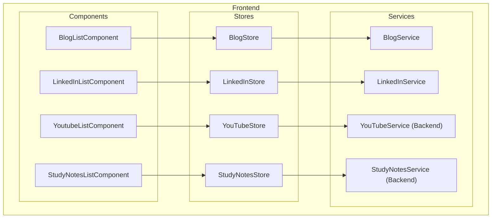
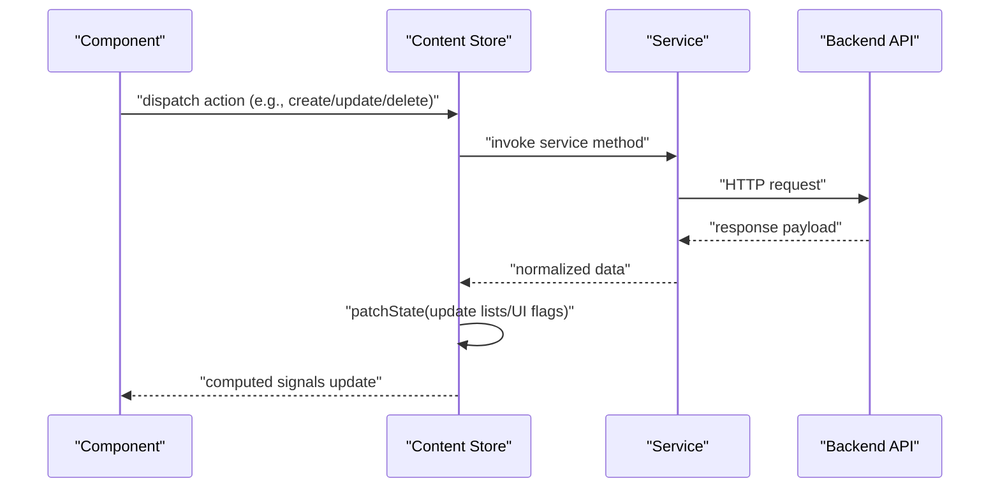
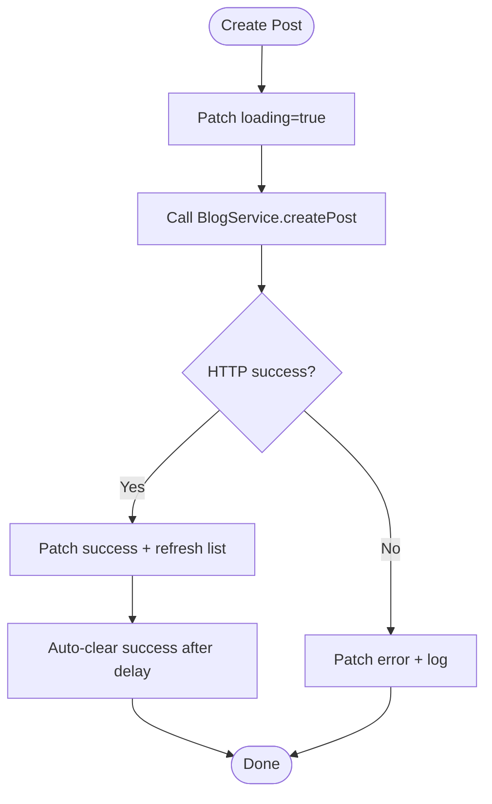
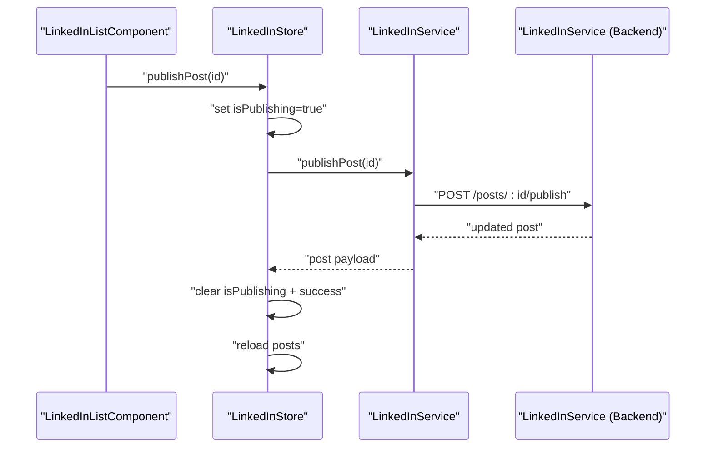
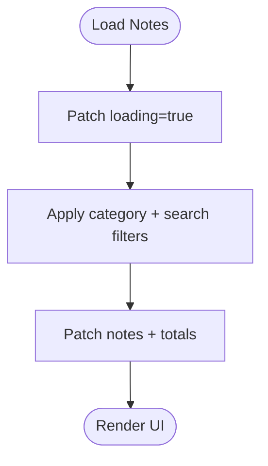
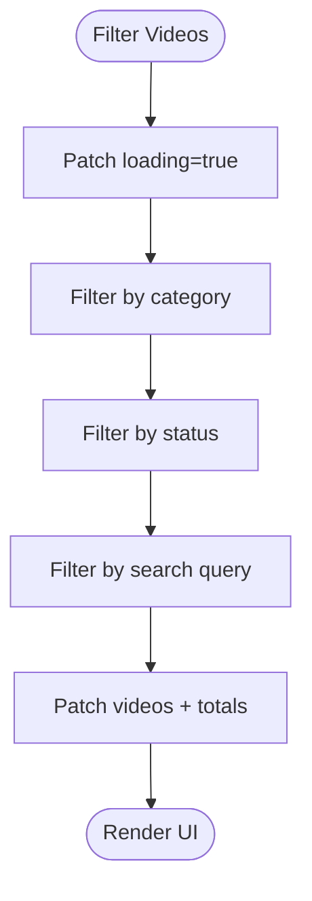
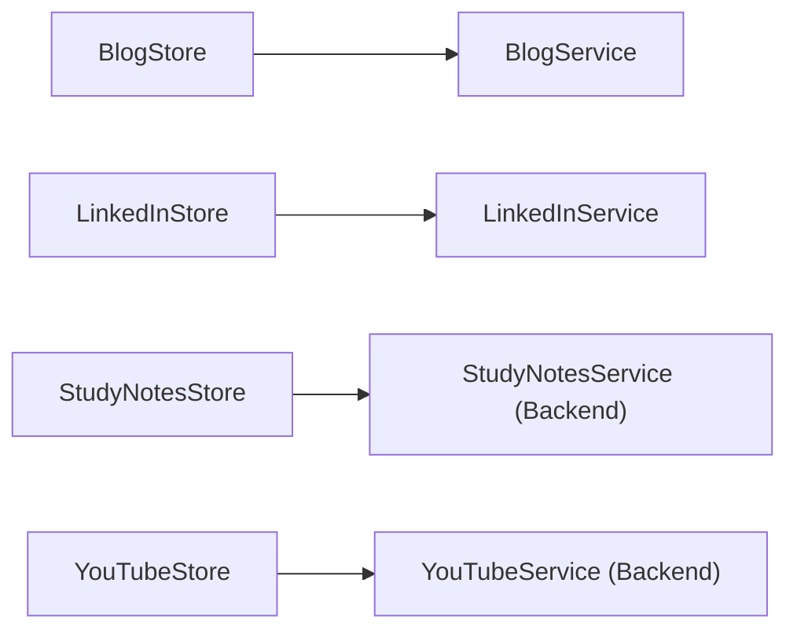

# Content Module Stores

<cite>
**Referenced Files in This Document**
- [blog.store.ts](file://frontend/src/app/core/store/blog.store.ts)
- [linkedin.store.ts](file://frontend/src/app/core/store/linkedin.store.ts)
- [study-notes.store.ts](file://frontend/src/app/core/store/study-notes.store.ts)
- [youtube.store.ts](file://frontend/src/app/core/store/youtube.store.ts)
- [blog.service.ts](file://frontend/src/app/core/services/blog.service.ts)
- [linkedin.service.ts](file://frontend/src/app/core/services/linkedin.service.ts)
- [youtube.service.ts](file://backend/src/youtube/youtube.service.ts)
- [study-notes.service.ts](file://backend/src/study-notes/study-notes.service.ts)
- [blog-list.component.ts](file://frontend/src/app/features/blog/blog-list/blog-list.component.ts)
- [linkedin-list.component.ts](file://frontend/src/app/features/linkedin/linkedin-list/linkedin-list.component.ts)
- [study-notes-list.component.ts](file://frontend/src/app/features/study-notes/study-notes-list/study-notes-list.component.ts)
- [youtube-list.component.ts](file://frontend/src/app/features/youtube/youtube-list/youtube-list.component.ts)
- [permission.service.ts](file://frontend/src/app/core/services/permission.service.ts)
- [module.service.ts](file://frontend/src/app/core/services/module.service.ts)
</cite>

## Table of Contents
1. [Introduction](#introduction)
2. [Project Structure](#project-structure)
3. [Core Components](#core-components)
4. [Architecture Overview](#architecture-overview)
5. [Detailed Component Analysis](#detailed-component-analysis)
6. [Dependency Analysis](#dependency-analysis)
7. [Performance Considerations](#performance-considerations)
8. [Troubleshooting Guide](#troubleshooting-guide)
9. [Conclusion](#conclusion)
10. [Appendices](#appendices)

## Introduction
This document explains the content module store implementations for study notes, YouTube, LinkedIn, and blog management. It covers common patterns across stores, state management for CRUD operations, list management, form state handling, and search/filter functionality. It also documents store composition patterns, data normalization strategies, caching mechanisms, integration with respective services, error handling, and loading state management. Practical examples demonstrate content creation workflows, list pagination, item selection, and bulk operations across all content modules.

## Project Structure
The content stores are implemented using NgRx Signals with a consistent composition pattern:
- Store definition with initial state, computed signals, and methods
- Integration with Angular services for HTTP operations
- UI components that consume store signals and dispatch actions
- Backend services for each content type

**Diagram sources**
- [blog.store.ts](file://frontend/src/app/core/store/blog.store.ts#L41-L332)
- [linkedin.store.ts](file://frontend/src/app/core/store/linkedin.store.ts#L43-L354)
- [study-notes.store.ts](file://frontend/src/app/core/store/study-notes.store.ts#L69-L438)
- [youtube.store.ts](file://frontend/src/app/core/store/youtube.store.ts#L76-L543)
- [blog.service.ts](file://frontend/src/app/core/services/blog.service.ts#L60-L145)
- [linkedin.service.ts](file://frontend/src/app/core/services/linkedin.service.ts#L55-L163)
- [blog-list.component.ts](file://frontend/src/app/features/blog/blog-list/blog-list.component.ts#L15-L333)
- [linkedin-list.component.ts](file://frontend/src/app/features/linkedin/linkedin-list/linkedin-list.component.ts#L14-L404)
- [study-notes-list.component.ts](file://frontend/src/app/features/study-notes/study-notes-list/study-notes-list.component.ts#L14-L222)
- [youtube-list.component.ts](file://frontend/src/app/features/youtube/youtube-list/youtube-list.component.ts#L14-L303)

**Section sources**
- [blog.store.ts](file://frontend/src/app/core/store/blog.store.ts#L1-L332)
- [linkedin.store.ts](file://frontend/src/app/core/store/linkedin.store.ts#L1-L354)
- [study-notes.store.ts](file://frontend/src/app/core/store/study-notes.store.ts#L1-L438)
- [youtube.store.ts](file://frontend/src/app/core/store/youtube.store.ts#L1-L543)

## Core Components
Each store defines:
- State shape with lists, current item, pagination, filters, and UI flags
- Computed signals for derived UI state (loading, counts, emptiness)
- Methods for CRUD operations, filtering, searching, pagination, and clearing messages

Key patterns:
- Loading and error state management via patchState
- UI flags per item (e.g., isDeleting, isPublishing) for immediate feedback
- Centralized loadPosts/loadNotes/loadVideos that apply filters and pagination
- Success/error auto-clearing after a timeout

**Section sources**
- [blog.store.ts](file://frontend/src/app/core/store/blog.store.ts#L12-L52)
- [linkedin.store.ts](file://frontend/src/app/core/store/linkedin.store.ts#L14-L60)
- [study-notes.store.ts](file://frontend/src/app/core/store/study-notes.store.ts#L40-L111)
- [youtube.store.ts](file://frontend/src/app/core/store/youtube.store.ts#L45-L146)

## Architecture Overview
The stores orchestrate data fetching and UI updates:
- Components trigger actions on stores
- Stores call injected services to perform HTTP requests
- Stores normalize and update state, including UI flags
- Components subscribe to computed signals for rendering

**Diagram sources**
- [blog.store.ts](file://frontend/src/app/core/store/blog.store.ts#L119-L137)
- [linkedin.store.ts](file://frontend/src/app/core/store/linkedin.store.ts#L129-L147)
- [study-notes.store.ts](file://frontend/src/app/core/store/study-notes.store.ts#L238-L274)
- [youtube.store.ts](file://frontend/src/app/core/store/youtube.store.ts#L285-L323)
- [blog.service.ts](file://frontend/src/app/core/services/blog.service.ts#L91-L107)
- [linkedin.service.ts](file://frontend/src/app/core/services/linkedin.service.ts#L88-L104)

## Detailed Component Analysis

### Blog Store
- State includes posts, current post, pagination, status filter, and search query
- Computed signals provide total pages, filter presence, counts, and emptiness
- CRUD operations:
  - Create, update, delete, publish/unpublish
  - Per-item UI flags for immediate feedback
- Filtering and search:
  - Status filter (all/draft/published)
  - Text search across content
- Pagination:
  - Page navigation helpers and visible page range calculation

**Diagram sources**
- [blog.store.ts](file://frontend/src/app/core/store/blog.store.ts#L119-L137)
- [blog.service.ts](file://frontend/src/app/core/services/blog.service.ts#L91-L93)

Practical example: Creating a blog post
- Component calls store.createPost with request payload
- Store patches loading and clears errors
- Service performs HTTP POST
- On success, store sets success message, clears it after delay, and reloads posts

Pagination and selection
- Components call goToPage/nextPage/previousPage
- Stores compute visible page numbers and update current page

Bulk operations
- Not implemented in the blog store; individual item actions only

**Section sources**
- [blog.store.ts](file://frontend/src/app/core/store/blog.store.ts#L119-L222)
- [blog-list.component.ts](file://frontend/src/app/features/blog/blog-list/blog-list.component.ts#L139-L143)

### LinkedIn Store
- State mirrors blog store with posts, current post, pagination, status filter, and search query
- Additional analytics-derived computed signals (impressions, engagement)
- CRUD operations:
  - Create, update, delete
  - Publish, schedule, archive with per-item UI flags
- Filtering and search:
  - Status filter (draft/scheduled/published/archived/all)
  - Text search across content
- Pagination:
  - Page navigation helpers and visible page range calculation

**Diagram sources**
- [linkedin.store.ts](file://frontend/src/app/core/store/linkedin.store.ts#L198-L225)
- [linkedin.service.ts](file://frontend/src/app/core/services/linkedin.service.ts#L109-L111)
- [linkedin-list.component.ts](file://frontend/src/app/features/linkedin/linkedin-list/linkedin-list.component.ts#L248-L251)

Practical example: Publishing a post
- Component triggers publishPost
- Store toggles isPublishing, calls service, updates state, and reloads list

Bulk operations
- Not implemented in the LinkedIn store; individual item actions only

**Section sources**
- [linkedin.store.ts](file://frontend/src/app/core/store/linkedin.store.ts#L198-L283)
- [linkedin-list.component.ts](file://frontend/src/app/features/linkedin/linkedin-list/linkedin-list.component.ts#L248-L259)

### Study Notes Store
- State includes notes, current note, pagination, category filter, and search query
- Computed signals for counts by category and emptiness
- CRUD operations:
  - Create, update, delete with per-item UI flags
- Filtering and search:
  - Category filter (all/Frontend/Backend/Database/DevOps/Other)
  - Text search across title, content, and tags
- Pagination:
  - Page navigation helpers and visible page range calculation

**Diagram sources**
- [study-notes.store.ts](file://frontend/src/app/core/store/study-notes.store.ts#L114-L188)

Practical example: Searching notes
- Component calls searchNotes(query)
- Store updates searchQuery and reloads filtered list

Bulk operations
- Not implemented in the study notes store; individual item actions only

**Section sources**
- [study-notes.store.ts](file://frontend/src/app/core/store/study-notes.store.ts#L161-L188)
- [study-notes-list.component.ts](file://frontend/src/app/features/study-notes/study-notes-list/study-notes-list.component.ts#L114-L116)

### YouTube Store
- State includes videos, current video, pagination, category and status filters, and search query
- Rich computed signals for counts by category and status, plus analytics (total/average views/likes)
- CRUD operations:
  - Create, update, delete with per-item UI flags
  - Update status (draft/published/archived) and convenience publish/archive
- Filtering and search:
  - Category filter (all/Frontend/Backend/Database/DevOps/Other)
  - Status filter (draft/published/archived)
  - Text search across title and description
- Pagination:
  - Page navigation helpers and visible page range calculation

**Diagram sources**
- [youtube.store.ts](file://frontend/src/app/core/store/youtube.store.ts#L201-L233)

Practical example: Updating video status
- Store.updateVideoStatus(id, status) updates the item and clears UI flags

Bulk operations
- Not implemented in the YouTube store; individual item actions only

**Section sources**
- [youtube.store.ts](file://frontend/src/app/core/store/youtube.store.ts#L362-L390)
- [youtube-list.component.ts](file://frontend/src/app/features/youtube/youtube-list/youtube-list.component.ts#L134-L143)

## Dependency Analysis
Store-to-service relationships:
- BlogStore depends on BlogService for HTTP operations
- LinkedInStore depends on LinkedInService for HTTP operations
- StudyNotesStore and YouTubeStore currently use mock data in their stores; they would integrate with backend services similarly

**Diagram sources**
- [blog.store.ts](file://frontend/src/app/core/store/blog.store.ts#L5-L6)
- [linkedin.store.ts](file://frontend/src/app/core/store/linkedin.store.ts#L4-L5)
- [study-notes.store.ts](file://frontend/src/app/core/store/study-notes.store.ts#L1-L4)
- [youtube.store.ts](file://frontend/src/app/core/store/youtube.store.ts#L1-L4)

**Section sources**
- [blog.service.ts](file://frontend/src/app/core/services/blog.service.ts#L60-L145)
- [linkedin.service.ts](file://frontend/src/app/core/services/linkedin.service.ts#L55-L163)
- [study-notes.service.ts](file://backend/src/study-notes/study-notes.service.ts#L1-L80)
- [youtube.service.ts](file://backend/src/youtube/youtube.service.ts#L1-L73)

## Performance Considerations
- Prefer client-side filtering in stores for small datasets; for larger datasets, rely on backend pagination and filtering to reduce payload sizes
- Use computed signals to avoid recomputing derived state unnecessarily
- Debounce search inputs to minimize frequent API calls
- Keep UI flags minimal and scoped to affected items to reduce reactivity overhead
- Avoid unnecessary state updates by batching patchState calls

## Troubleshooting Guide
Common issues and resolutions:
- Loading state stuck: Ensure patchState is called for both success and error paths
- Filters not applying: Verify filter keys match service expectations and pagination resets to page 1
- Success/error messages not clearing: Confirm auto-clear timeouts are set and not overridden
- Pagination inconsistencies: Validate total counts and page calculations align with backend responses

**Section sources**
- [blog.store.ts](file://frontend/src/app/core/store/blog.store.ts#L55-L85)
- [linkedin.store.ts](file://frontend/src/app/core/store/linkedin.store.ts#L63-L94)
- [study-notes.store.ts](file://frontend/src/app/core/store/study-notes.store.ts#L114-L188)
- [youtube.store.ts](file://frontend/src/app/core/store/youtube.store.ts#L149-L233)

## Conclusion
The content module stores implement a consistent, reactive pattern using NgRx Signals. They centralize state, handle CRUD operations, manage filters and pagination, and provide robust UI feedback through computed signals and per-item flags. Integration with services enables seamless data synchronization, while error and loading states ensure resilient user experiences. Extending these patterns to support backend-driven filtering and pagination will further improve scalability and performance.

## Appendices

### Store Composition Patterns
- withState: Defines initial state shape
- withComputed: Derives UI flags and counts from state
- withMethods: Encapsulates actions and side effects

**Section sources**
- [blog.store.ts](file://frontend/src/app/core/store/blog.store.ts#L41-L52)
- [linkedin.store.ts](file://frontend/src/app/core/store/linkedin.store.ts#L43-L60)
- [study-notes.store.ts](file://frontend/src/app/core/store/study-notes.store.ts#L69-L111)
- [youtube.store.ts](file://frontend/src/app/core/store/youtube.store.ts#L76-L146)

### Data Normalization Strategies
- Normalize server responses into store lists with UI flags
- Maintain separate current item state for detail views
- Compute derived metrics (counts, totals, averages) via computed signals

**Section sources**
- [blog.store.ts](file://frontend/src/app/core/store/blog.store.ts#L67-L77)
- [linkedin.store.ts](file://frontend/src/app/core/store/linkedin.store.ts#L74-L86)
- [study-notes.store.ts](file://frontend/src/app/core/store/study-notes.store.ts#L175-L180)
- [youtube.store.ts](file://frontend/src/app/core/store/youtube.store.ts#L220-L225)

### Caching Mechanisms
- Mock stores cache in-memory lists; production stores should leverage service caching or HTTP caching strategies
- Consider using service-level caching for repeated reads of the same resource

**Section sources**
- [youtube.store.ts](file://frontend/src/app/core/store/youtube.store.ts#L153-L199)
- [study-notes.store.ts](file://frontend/src/app/core/store/study-notes.store.ts#L119-L159)

### Integration with Services
- Stores inject services and convert observables to promises for synchronous store updates
- Ensure consistent error handling and logging across all stores

**Section sources**
- [blog.store.ts](file://frontend/src/app/core/store/blog.store.ts#L66-L66)
- [linkedin.store.ts](file://frontend/src/app/core/store/linkedin.store.ts#L73-L73)

### Error Handling Patterns
- Centralized try/catch blocks around service calls
- Patch error state with user-friendly messages
- Log errors for debugging

**Section sources**
- [blog.store.ts](file://frontend/src/app/core/store/blog.store.ts#L78-L84)
- [linkedin.store.ts](file://frontend/src/app/core/store/linkedin.store.ts#L87-L93)
- [study-notes.store.ts](file://frontend/src/app/core/store/study-notes.store.ts#L181-L187)
- [youtube.store.ts](file://frontend/src/app/core/store/youtube.store.ts#L226-L232)

### Loading State Management
- Set loading flags before network calls
- Clear loading flags on success or error
- Use computed isLoading for consistent UI feedback

**Section sources**
- [blog.store.ts](file://frontend/src/app/core/store/blog.store.ts#L55-L57)
- [linkedin.store.ts](file://frontend/src/app/core/store/linkedin.store.ts#L63-L65)
- [study-notes.store.ts](file://frontend/src/app/core/store/study-notes.store.ts#L114-L116)
- [youtube.store.ts](file://frontend/src/app/core/store/youtube.store.ts#L149-L151)

### Practical Examples Index
- Blog creation workflow: [blog.store.ts](file://frontend/src/app/core/store/blog.store.ts#L119-L137)
- LinkedIn publish workflow: [linkedin.store.ts](file://frontend/src/app/core/store/linkedin.store.ts#L198-L225)
- Study notes search workflow: [study-notes.store.ts](file://frontend/src/app/core/store/study-notes.store.ts#L161-L188)
- YouTube status update workflow: [youtube.store.ts](file://frontend/src/app/core/store/youtube.store.ts#L362-L390)
- Pagination helpers: [blog.store.ts](file://frontend/src/app/core/store/blog.store.ts#L283-L297), [linkedin.store.ts](file://frontend/src/app/core/store/linkedin.store.ts#L316-L330), [study-notes.store.ts](file://frontend/src/app/core/store/study-notes.store.ts#L379-L393), [youtube.store.ts](file://frontend/src/app/core/store/youtube.store.ts#L503-L517)