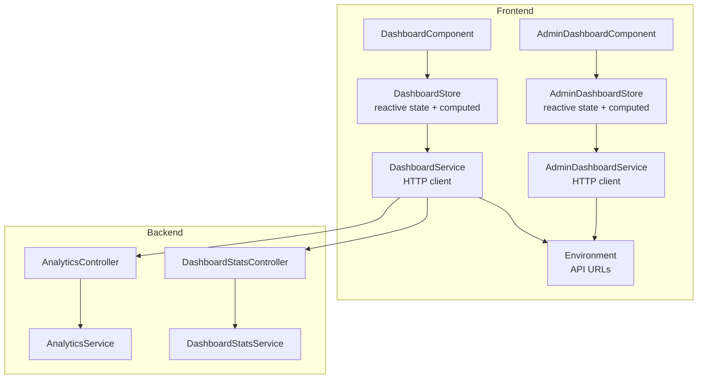
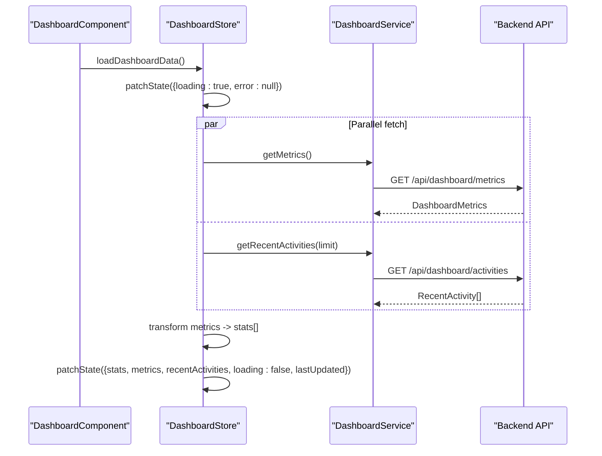
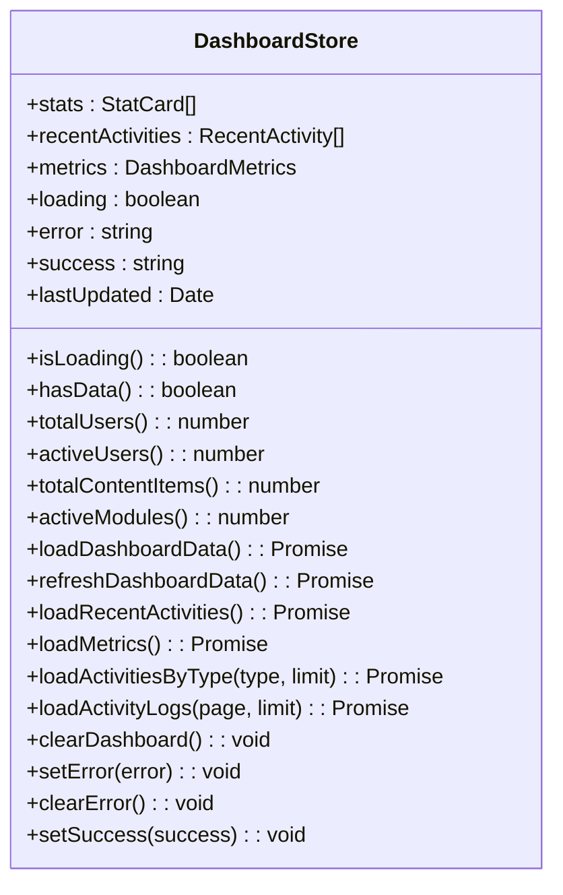
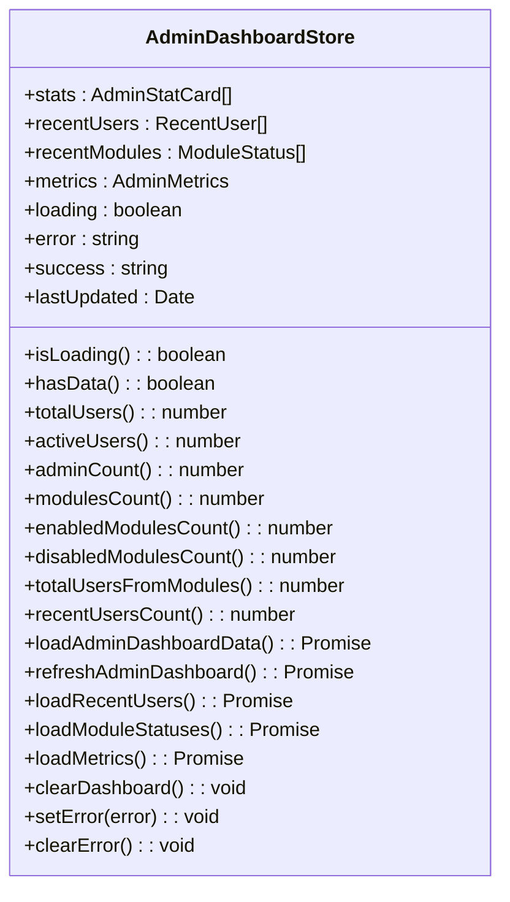
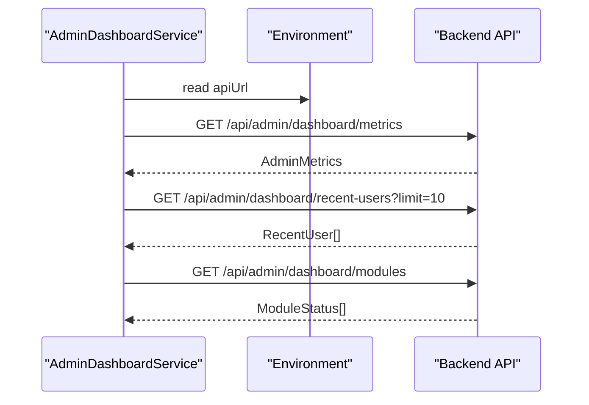
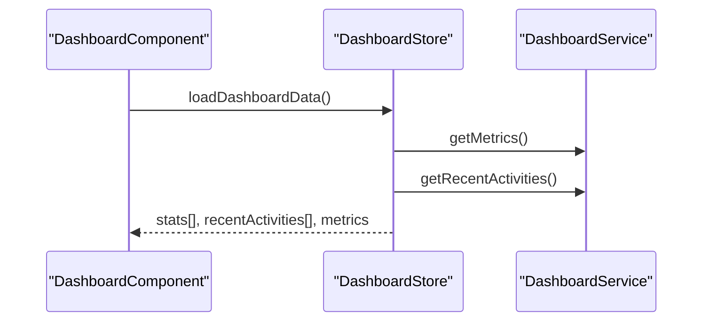
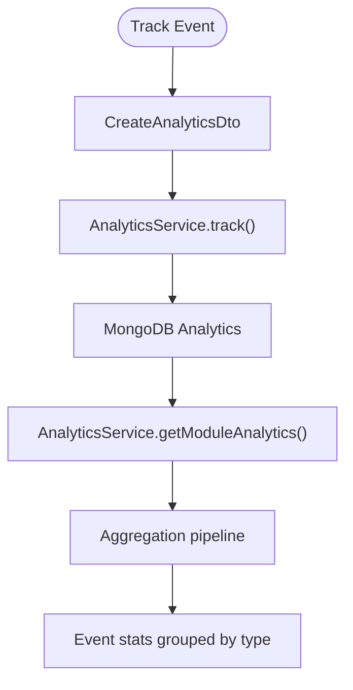
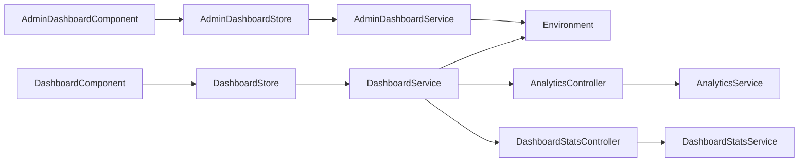

# Dashboard Store

<cite>
**Referenced Files in This Document**
- [dashboard.store.ts](file://frontend/src/app/core/store/dashboard.store.ts)
- [admin-dashboard.store.ts](file://frontend/src/app/core/store/admin-dashboard.store.ts)
- [dashboard.service.ts](file://frontend/src/app/core/services/dashboard.service.ts)
- [admin-dashboard.service.ts](file://frontend/src/app/core/services/admin-dashboard.service.ts)
- [dashboard.component.ts](file://frontend/src/app/features/dashboard/dashboard.component.ts)
- [admin-dashboard.component.ts](file://frontend/src/app/features/admin/admin-dashboard/admin-dashboard.component.ts)
- [auth.store.ts](file://frontend/src/app/core/store/auth.store.ts)
- [user.store.ts](file://frontend/src/app/core/store/user.store.ts)
- [permission.service.ts](file://frontend/src/app/core/services/permission.service.ts)
- [environment.ts](file://frontend/src/environments/environment.ts)
- [dashboard-stats.controller.ts](file://backend/src/dashboard-stats/dashboard-stats.controller.ts)
- [dashboard-stats.service.ts](file://backend/src/dashboard-stats/dashboard-stats.service.ts)
- [analytics.controller.ts](file://backend/src/analytics/analytics.controller.ts)
- [analytics.service.ts](file://backend/src/analytics/analytics.service.ts)
</cite>

## Table of Contents
1. [Introduction](#introduction)
2. [Project Structure](#project-structure)
3. [Core Components](#core-components)
4. [Architecture Overview](#architecture-overview)
5. [Detailed Component Analysis](#detailed-component-analysis)
6. [Dependency Analysis](#dependency-analysis)
7. [Performance Considerations](#performance-considerations)
8. [Troubleshooting Guide](#troubleshooting-guide)
9. [Conclusion](#conclusion)

## Introduction
This document explains the dashboard store architecture for both user and admin dashboards. It covers reactive state properties for dashboard statistics, recent activity feeds, module availability, and user-specific data. It documents integration with analytics services, module status monitoring, and administrative features. The guide details state composition patterns, data fetching strategies, and real-time update considerations, along with examples of subscriptions, filtering mechanisms, and performance optimizations.

## Project Structure
The dashboard store architecture spans frontend Angular signals stores and backend NestJS services:
- Frontend stores: user dashboard and admin dashboard stores encapsulate reactive state and derived computations.
- Frontend services: typed HTTP clients for dashboard and admin endpoints.
- Backend services: analytics and dashboard stats controllers and services for event tracking and metric aggregation.

**Diagram sources**
- [dashboard.store.ts](file://frontend/src/app/core/store/dashboard.store.ts#L38-L366)
- [admin-dashboard.store.ts](file://frontend/src/app/core/store/admin-dashboard.store.ts#L39-L306)
- [dashboard.service.ts](file://frontend/src/app/core/services/dashboard.service.ts#L34-L101)
- [admin-dashboard.service.ts](file://frontend/src/app/core/services/admin-dashboard.service.ts#L44-L112)
- [dashboard.component.ts](file://frontend/src/app/features/dashboard/dashboard.component.ts#L37-L44)
- [admin-dashboard.component.ts](file://frontend/src/app/features/admin/admin-dashboard/admin-dashboard.component.ts#L39-L44)
- [environment.ts](file://frontend/src/environments/environment.ts#L1-L6)
- [analytics.controller.ts](file://backend/src/analytics/analytics.controller.ts#L1-L110)
- [dashboard-stats.controller.ts](file://backend/src/dashboard-stats/dashboard-stats.controller.ts#L1-L36)

**Section sources**
- [dashboard.store.ts](file://frontend/src/app/core/store/dashboard.store.ts#L1-L367)
- [admin-dashboard.store.ts](file://frontend/src/app/core/store/admin-dashboard.store.ts#L1-L307)
- [dashboard.service.ts](file://frontend/src/app/core/services/dashboard.service.ts#L1-L102)
- [admin-dashboard.service.ts](file://frontend/src/app/core/services/admin-dashboard.service.ts#L1-L113)
- [environment.ts](file://frontend/src/environments/environment.ts#L1-L6)

## Core Components
- DashboardStore: Manages user dashboard state, including statistics cards, recent activities, metrics, loading/error/success states, and freshness checks. Provides actions to load full dashboard data, refresh, load subsets (metrics, activities, paginated logs), and filter by activity type.
- AdminDashboardStore: Manages admin dashboard state including admin-specific stats, recent users, module statuses, and derived counts. Provides actions to load full admin data, refresh, load subsets (metrics, recent users, module statuses), and clear state.
- DashboardService/AdminDashboardService: Typed HTTP clients exposing endpoints for metrics, activities, logs, and admin-specific data.
- DashboardComponent/AdminDashboardComponent: Consume stores via computed selectors and trigger actions on user interactions.

Key reactive properties:
- Loading, error, success flags
- Stats arrays and metrics objects
- Recent activities feed
- Derived computations (counts, presence checks, freshness)

**Section sources**
- [dashboard.store.ts](file://frontend/src/app/core/store/dashboard.store.ts#L15-L90)
- [admin-dashboard.store.ts](file://frontend/src/app/core/store/admin-dashboard.store.ts#L14-L68)
- [dashboard.service.ts](file://frontend/src/app/core/services/dashboard.service.ts#L6-L28)
- [admin-dashboard.service.ts](file://frontend/src/app/core/services/admin-dashboard.service.ts#L6-L38)

## Architecture Overview
The stores use @ngrx/signals to define state, computed derivations, and methods. Services encapsulate HTTP requests. Components subscribe to store state and call store methods.

**Diagram sources**
- [dashboard.store.ts](file://frontend/src/app/core/store/dashboard.store.ts#L97-L152)
- [dashboard.service.ts](file://frontend/src/app/core/services/dashboard.service.ts#L41-L59)

**Section sources**
- [dashboard.store.ts](file://frontend/src/app/core/store/dashboard.store.ts#L91-L152)
- [dashboard.service.ts](file://frontend/src/app/core/services/dashboard.service.ts#L34-L101)

## Detailed Component Analysis

### DashboardStore Analysis
Responsibilities:
- Reactive state: stats, recentActivities, metrics, loading, error, success, lastUpdated.
- Computed derivations: loading flags, presence checks, derived counts (users, modules, content), activity type counts, data freshness.
- Methods:
  - loadDashboardData: parallel fetch of metrics and activities, transform metrics to stats, update state.
  - refreshDashboardData: similar to load but sets success and clears after delay.
  - loadRecentActivities, loadMetrics, loadActivitiesByType, loadActivityLogs: targeted data loading with pagination and type filtering.
  - clearDashboard, setError, clearError, setSuccess.

**Diagram sources**
- [dashboard.store.ts](file://frontend/src/app/core/store/dashboard.store.ts#L15-L366)

**Section sources**
- [dashboard.store.ts](file://frontend/src/app/core/store/dashboard.store.ts#L38-L366)

### AdminDashboardStore Analysis
Responsibilities:
- Reactive state: stats, recentUsers, recentModules, metrics, loading, error, success, lastUpdated.
- Computed derivations: loading flags, presence checks, admin/user/module counts, enabled/disabled module counts, total users across modules, recent users count.
- Methods:
  - loadAdminDashboardData: parallel fetch of metrics, recent users, module statuses, transform metrics to stats.
  - refreshAdminDashboard: similar to load but sets success.
  - loadRecentUsers, loadModuleStatuses, loadMetrics: targeted data loading.
  - clearDashboard, setError, clearError.

**Diagram sources**
- [admin-dashboard.store.ts](file://frontend/src/app/core/store/admin-dashboard.store.ts#L14-L306)

**Section sources**
- [admin-dashboard.store.ts](file://frontend/src/app/core/store/admin-dashboard.store.ts#L39-L306)

### Service Layer Integration
- DashboardService: exposes endpoints for metrics, recent activities, combined dashboard data, user/content/module metrics, activity by type, and paginated activity logs.
- AdminDashboardService: exposes endpoints for admin metrics, recent users, module statuses, system health, logs, and statistics.

**Diagram sources**
- [admin-dashboard.service.ts](file://frontend/src/app/core/services/admin-dashboard.service.ts#L44-L112)
- [environment.ts](file://frontend/src/environments/environment.ts#L1-L6)

**Section sources**
- [dashboard.service.ts](file://frontend/src/app/core/services/dashboard.service.ts#L34-L101)
- [admin-dashboard.service.ts](file://frontend/src/app/core/services/admin-dashboard.service.ts#L44-L112)

### Component Integration Patterns
- DashboardComponent: initializes store data on init and exposes getters for stats, activities, loading, error, success, metrics, and derived counts. It demonstrates how components consume store state without direct API calls.
- AdminDashboardComponent: injects AdminDashboardStore, loads data on init, and exposes getters for stats, recent users, recent modules, and loading flags.

**Diagram sources**
- [dashboard.component.ts](file://frontend/src/app/features/dashboard/dashboard.component.ts#L37-L44)
- [dashboard.store.ts](file://frontend/src/app/core/store/dashboard.store.ts#L97-L152)

**Section sources**
- [dashboard.component.ts](file://frontend/src/app/features/dashboard/dashboard.component.ts#L35-L251)
- [admin-dashboard.component.ts](file://frontend/src/app/features/admin/admin-dashboard/admin-dashboard.component.ts#L37-L161)

### Analytics and Module Monitoring
- AnalyticsController/Service: support event tracking, per-module analytics, event statistics, and date-range queries. These services can feed dashboard insights and module performance metrics.
- DashboardStatsController/Service: support updating and incrementing metrics per module, retrieving overview and module-specific stats.

**Diagram sources**
- [analytics.controller.ts](file://backend/src/analytics/analytics.controller.ts#L22-L108)
- [analytics.service.ts](file://backend/src/analytics/analytics.service.ts#L11-L76)
- [dashboard-stats.controller.ts](file://backend/src/dashboard-stats/dashboard-stats.controller.ts#L11-L34)
- [dashboard-stats.service.ts](file://backend/src/dashboard-stats/dashboard-stats.service.ts#L10-L49)

**Section sources**
- [analytics.controller.ts](file://backend/src/analytics/analytics.controller.ts#L1-L110)
- [analytics.service.ts](file://backend/src/analytics/analytics.service.ts#L1-L78)
- [dashboard-stats.controller.ts](file://backend/src/dashboard-stats/dashboard-stats.controller.ts#L1-L36)
- [dashboard-stats.service.ts](file://backend/src/dashboard-stats/dashboard-stats.service.ts#L1-L55)

### State Composition Patterns
- User dashboard state composition:
  - Stats array transformed from metrics for display.
  - Recent activities array for timeline.
  - Metrics object for programmatic access.
  - Timestamp-based freshness checks.
- Admin dashboard state composition:
  - Admin-specific stats (admin count, suspended/inactive users).
  - Recent users list with role/status.
  - Module statuses with enablement and user counts.
  - Derived counts for enabled/disabled modules and total users across modules.

**Section sources**
- [dashboard.store.ts](file://frontend/src/app/core/store/dashboard.store.ts#L106-L135)
- [admin-dashboard.store.ts](file://frontend/src/app/core/store/admin-dashboard.store.ts#L85-L110)

### Data Fetching Strategies
- Parallel fetching: stores use Promise.all to fetch metrics and activities concurrently.
- Targeted fetching: separate methods for metrics-only, activities-only, type-filtered activities, and paginated logs.
- Error handling: centralized patchState updates for error/success/loading flags with console logging.
- Success messages: auto-clear after timeout.

**Section sources**
- [dashboard.store.ts](file://frontend/src/app/core/store/dashboard.store.ts#L100-L103)
- [admin-dashboard.store.ts](file://frontend/src/app/core/store/admin-dashboard.store.ts#L78-L82)

### Real-Time Updates and Freshness
- Stores maintain lastUpdated timestamps and compute isDataFresh based on a threshold (e.g., less than 5 minutes).
- Components can leverage isDataFresh to decide whether to trigger refresh actions.

**Section sources**
- [dashboard.store.ts](file://frontend/src/app/core/store/dashboard.store.ts#L84-L89)

### Filtering Mechanisms
- Activity type filtering: loadActivitiesByType accepts type and limit parameters.
- Pagination: loadActivityLogs supports page and limit parameters.
- User store demonstrates advanced filtering patterns (role, status, search query) that can inspire similar patterns in dashboard stores.

**Section sources**
- [dashboard.store.ts](file://frontend/src/app/core/store/dashboard.store.ts#L291-L307)
- [dashboard.store.ts](file://frontend/src/app/core/store/dashboard.store.ts#L312-L328)
- [user.store.ts](file://frontend/src/app/core/store/user.store.ts#L254-L286)

### Administrative Features
- AdminDashboardStore exposes methods to load admin metrics, recent users, and module statuses.
- PermissionService provides role-based checks (canEdit, canManageUsers, canManageModules) used by components to render admin-only UI.

**Section sources**
- [admin-dashboard.store.ts](file://frontend/src/app/core/store/admin-dashboard.store.ts#L75-L128)
- [permission.service.ts](file://frontend/src/app/core/services/permission.service.ts#L27-L58)

## Dependency Analysis
- Stores depend on services for HTTP communication.
- Services depend on environment for base URLs.
- Components depend on stores for state and actions.
- Backend services depend on MongoDB models for persistence.

**Diagram sources**
- [dashboard.store.ts](file://frontend/src/app/core/store/dashboard.store.ts#L38-L366)
- [admin-dashboard.store.ts](file://frontend/src/app/core/store/admin-dashboard.store.ts#L39-L306)
- [dashboard.service.ts](file://frontend/src/app/core/services/dashboard.service.ts#L34-L101)
- [admin-dashboard.service.ts](file://frontend/src/app/core/services/admin-dashboard.service.ts#L44-L112)
- [environment.ts](file://frontend/src/environments/environment.ts#L1-L6)
- [analytics.controller.ts](file://backend/src/analytics/analytics.controller.ts#L1-L110)
- [dashboard-stats.controller.ts](file://backend/src/dashboard-stats/dashboard-stats.controller.ts#L1-L36)

**Section sources**
- [auth.store.ts](file://frontend/src/app/core/store/auth.store.ts#L49-L55)
- [user.store.ts](file://frontend/src/app/core/store/user.store.ts#L44-L56)

## Performance Considerations
- Prefer parallel fetching for independent datasets to reduce total latency.
- Use computed derivations to avoid recomputing derived values in templates.
- Implement pagination and type filters to limit payload sizes.
- Debounce or throttle refresh triggers based on isDataFresh thresholds.
- Clear success/error states after short timeouts to prevent stale UI feedback.

## Troubleshooting Guide
Common issues and resolutions:
- Empty or stale data:
  - Verify lastUpdated and isDataFresh flags.
  - Trigger refreshDashboardData or refreshAdminDashboard.
- Network errors:
  - Inspect error state and console logs.
  - Confirm environment.apiUrl correctness.
- Permission denials:
  - Use permissionService.canEdit/canManageUsers to gate admin UI.
- Token refresh failures:
  - AuthStore handles token refresh and auto-logout on failure; ensure refresh endpoint is reachable.

**Section sources**
- [dashboard.store.ts](file://frontend/src/app/core/store/dashboard.store.ts#L145-L151)
- [admin-dashboard.store.ts](file://frontend/src/app/core/store/admin-dashboard.store.ts#L178-L183)
- [permission.service.ts](file://frontend/src/app/core/services/permission.service.ts#L27-L58)
- [auth.store.ts](file://frontend/src/app/core/store/auth.store.ts#L155-L174)

## Conclusion
The dashboard store architecture leverages @ngrx/signals for reactive state management, with clear separation between user and admin dashboards. Stores expose computed derivations for derived counts and presence checks, while services encapsulate backend integration. The design supports parallel data fetching, targeted loading, pagination, and type filtering. Integration with analytics and dashboard stats services enables robust monitoring and reporting. Components remain thin consumers of store state, promoting maintainability and testability.