# State Management Architecture

<cite>
**Referenced Files in This Document**
- [auth.store.ts](file://frontend/src/app/core/store/auth.store.ts)
- [dashboard.store.ts](file://frontend/src/app/core/store/dashboard.store.ts)
- [admin-dashboard.store.ts](file://frontend/src/app/core/store/admin-dashboard.store.ts)
- [user.store.ts](file://frontend/src/app/core/store/user.store.ts)
- [blog.store.ts](file://frontend/src/app/core/store/blog.store.ts)
- [linkedin.store.ts](file://frontend/src/app/core/store/linkedin.store.ts)
- [youtube.store.ts](file://frontend/src/app/core/store/youtube.store.ts)
- [study-notes.store.ts](file://frontend/src/app/core/store/study-notes.store.ts)
- [module.store.ts](file://frontend/src/app/core/store/module.store.ts)
- [auth.service.ts](file://frontend/src/app/core/services/auth.service.ts)
- [api.service.ts](file://frontend/src/app/core/services/api.service.ts)
- [toast.service.ts](file://frontend/src/app/core/services/toast.service.ts)
- [auth.interceptor.ts](file://frontend/src/app/core/interceptors/auth.interceptor.ts)
- [error.interceptor.ts](file://frontend/src/app/core/interceptors/error.interceptor.ts)
- [login.component.ts](file://frontend/src/app/features/auth/login/login.component.ts)
- [dashboard.component.ts](file://frontend/src/app/features/dashboard/dashboard.component.ts)
- [admin-dashboard.component.ts](file://frontend/src/app/features/admin/admin-dashboard/admin-dashboard.component.ts)
</cite>

## Table of Contents
1. [Introduction](#introduction)
2. [Project Structure](#project-structure)
3. [Core Components](#core-components)
4. [Architecture Overview](#architecture-overview)
5. [Detailed Component Analysis](#detailed-component-analysis)
6. [Dependency Analysis](#dependency-analysis)
7. [Performance Considerations](#performance-considerations)
8. [Troubleshooting Guide](#troubleshooting-guide)
9. [Conclusion](#conclusion)
10. [Appendices](#appendices)

## Introduction
This document explains the state management architecture for the Multi-Application-Control-Dashboard built with Angular Signals and a custom store pattern. It covers the signal store implementation, reactive state management concepts, component-state communication, store composition across feature modules, and integration with Angular services and interceptors. It also documents error handling strategies, state persistence approaches, and practical examples for building robust, maintainable state flows.

## Project Structure
The state management is organized around feature-specific signal stores under the core store directory. Each store encapsulates state, computed signals, and methods for asynchronous operations. Services provide typed HTTP interactions, while interceptors manage auth tokens and global error handling. Components integrate stores via injected instances and reactive signals.

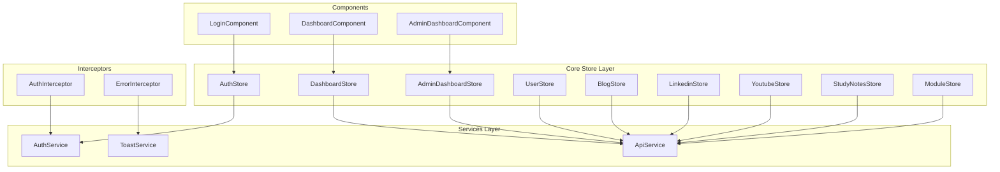

**Diagram sources**
- [auth.store.ts](file://frontend/src/app/core/store/auth.store.ts#L35-L222)
- [dashboard.store.ts](file://frontend/src/app/core/store/dashboard.store.ts#L38-L366)
- [admin-dashboard.store.ts](file://frontend/src/app/core/store/admin-dashboard.store.ts#L39-L306)
- [user.store.ts](file://frontend/src/app/core/store/user.store.ts#L41-L328)
- [blog.store.ts](file://frontend/src/app/core/store/blog.store.ts#L41-L331)
- [linkedin.store.ts](file://frontend/src/app/core/store/linkedin.store.ts#L43-L353)
- [youtube.store.ts](file://frontend/src/app/core/store/youtube.store.ts#L76-L542)
- [study-notes.store.ts](file://frontend/src/app/core/store/study-notes.store.ts#L69-L437)
- [module.store.ts](file://frontend/src/app/core/store/module.store.ts#L31-L174)
- [auth.service.ts](file://frontend/src/app/core/services/auth.service.ts#L31-L160)
- [api.service.ts](file://frontend/src/app/core/services/api.service.ts#L16-L75)
- [toast.service.ts](file://frontend/src/app/core/services/toast.service.ts#L15-L59)
- [auth.interceptor.ts](file://frontend/src/app/core/interceptors/auth.interceptor.ts#L8-L44)
- [error.interceptor.ts](file://frontend/src/app/core/interceptors/error.interceptor.ts#L10-L152)
- [login.component.ts](file://frontend/src/app/features/auth/login/login.component.ts#L14-L95)
- [dashboard.component.ts](file://frontend/src/app/features/dashboard/dashboard.component.ts#L35-L378)
- [admin-dashboard.component.ts](file://frontend/src/app/features/admin/admin-dashboard/admin-dashboard.component.ts#L37-L161)

**Section sources**
- [auth.store.ts](file://frontend/src/app/core/store/auth.store.ts#L1-L223)
- [dashboard.store.ts](file://frontend/src/app/core/store/dashboard.store.ts#L1-L367)
- [admin-dashboard.store.ts](file://frontend/src/app/core/store/admin-dashboard.store.ts#L1-L307)
- [user.store.ts](file://frontend/src/app/core/store/user.store.ts#L1-L329)
- [blog.store.ts](file://frontend/src/app/core/store/blog.store.ts#L1-L332)
- [linkedin.store.ts](file://frontend/src/app/core/store/linkedin.store.ts#L1-L354)
- [youtube.store.ts](file://frontend/src/app/core/store/youtube.store.ts#L1-L543)
- [study-notes.store.ts](file://frontend/src/app/core/store/study-notes.store.ts#L1-L438)
- [module.store.ts](file://frontend/src/app/core/store/module.store.ts#L1-L175)
- [auth.service.ts](file://frontend/src/app/core/services/auth.service.ts#L1-L161)
- [api.service.ts](file://frontend/src/app/core/services/api.service.ts#L1-L76)
- [toast.service.ts](file://frontend/src/app/core/services/toast.service.ts#L1-L60)
- [auth.interceptor.ts](file://frontend/src/app/core/interceptors/auth.interceptor.ts#L1-L46)
- [error.interceptor.ts](file://frontend/src/app/core/interceptors/error.interceptor.ts#L1-L153)
- [login.component.ts](file://frontend/src/app/features/auth/login/login.component.ts#L1-L96)
- [dashboard.component.ts](file://frontend/src/app/features/dashboard/dashboard.component.ts#L1-L379)
- [admin-dashboard.component.ts](file://frontend/src/app/features/admin/admin-dashboard/admin-dashboard.component.ts#L1-L162)

## Core Components
- Signal Stores: Each feature module defines a dedicated store using @ngrx/signals with withState, withComputed, and withMethods. Stores expose reactive signals and actions for async operations.
- Services: Typed HTTP clients (ApiService) and domain services (AuthService) provide clean boundaries for data access and token/session management.
- Interceptors: AuthInterceptor attaches bearer tokens and auto-refreshes on 401; ErrorInterceptor centralizes error handling and user feedback via ToastService.
- Components: Inject stores and bind to reactive signals; dispatch actions via store methods rather than calling services directly.

Key patterns:
- Centralized async actions in stores wrap service calls with patchState for loading/error/success transitions.
- Computed signals derive derived state (counts, presence checks, freshness).
- UI flags (isDeleting/isUpdating/etc.) are maintained per item to provide immediate feedback.

**Section sources**
- [auth.store.ts](file://frontend/src/app/core/store/auth.store.ts#L35-L222)
- [dashboard.store.ts](file://frontend/src/app/core/store/dashboard.store.ts#L38-L366)
- [admin-dashboard.store.ts](file://frontend/src/app/core/store/admin-dashboard.store.ts#L39-L306)
- [user.store.ts](file://frontend/src/app/core/store/user.store.ts#L41-L328)
- [blog.store.ts](file://frontend/src/app/core/store/blog.store.ts#L41-L331)
- [linkedin.store.ts](file://frontend/src/app/core/store/linkedin.store.ts#L43-L353)
- [youtube.store.ts](file://frontend/src/app/core/store/youtube.store.ts#L76-L542)
- [study-notes.store.ts](file://frontend/src/app/core/store/study-notes.store.ts#L69-L437)
- [module.store.ts](file://frontend/src/app/core/store/module.store.ts#L31-L174)
- [auth.service.ts](file://frontend/src/app/core/services/auth.service.ts#L31-L160)
- [api.service.ts](file://frontend/src/app/core/services/api.service.ts#L16-L75)
- [auth.interceptor.ts](file://frontend/src/app/core/interceptors/auth.interceptor.ts#L8-L44)
- [error.interceptor.ts](file://frontend/src/app/core/interceptors/error.interceptor.ts#L10-L152)

## Architecture Overview
The system follows a unidirectional data flow:
- Components subscribe to store signals and call store actions.
- Store actions orchestrate service calls, update state via patchState, and propagate UI feedback.
- Interceptors enrich requests with tokens and handle global errors.

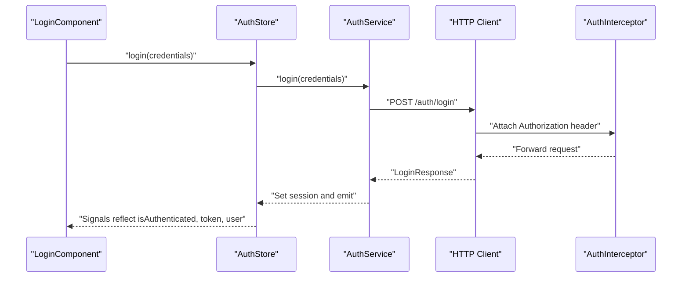

**Diagram sources**
- [login.component.ts](file://frontend/src/app/features/auth/login/login.component.ts#L71-L80)
- [auth.store.ts](file://frontend/src/app/core/store/auth.store.ts#L105-L128)
- [auth.service.ts](file://frontend/src/app/core/services/auth.service.ts#L60-L71)
- [auth.interceptor.ts](file://frontend/src/app/core/interceptors/auth.interceptor.ts#L11-L20)

**Section sources**
- [login.component.ts](file://frontend/src/app/features/auth/login/login.component.ts#L1-L96)
- [auth.store.ts](file://frontend/src/app/core/store/auth.store.ts#L1-L223)
- [auth.service.ts](file://frontend/src/app/core/services/auth.service.ts#L1-L161)
- [auth.interceptor.ts](file://frontend/src/app/core/interceptors/auth.interceptor.ts#L1-L46)

## Detailed Component Analysis

### Auth Store
AuthStore manages user identity, tokens, and session lifecycle. It exposes computed signals for role checks, module access, and UI flags, and actions for login, registration, profile loading, token refresh, and logout.

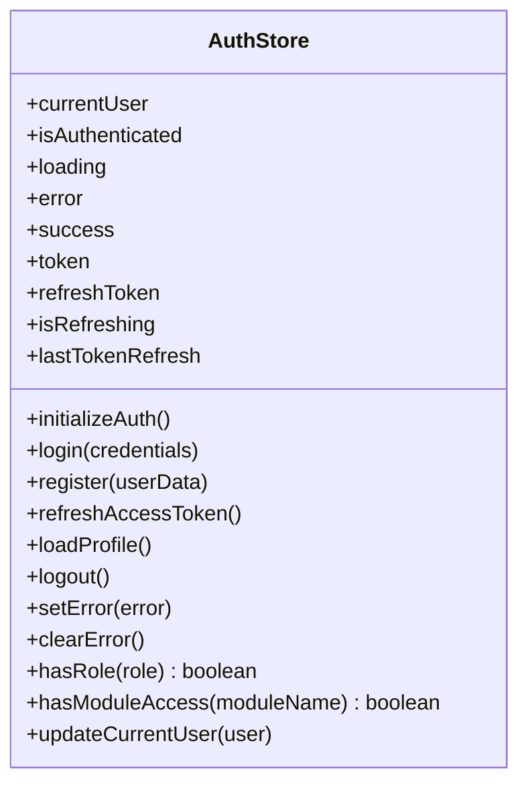

**Diagram sources**
- [auth.store.ts](file://frontend/src/app/core/store/auth.store.ts#L8-L30)
- [auth.store.ts](file://frontend/src/app/core/store/auth.store.ts#L57-L220)

Key behaviors:
- Initializes from localStorage on startup.
- Persists tokens and user profile to localStorage after login/register.
- Refreshes tokens automatically on 401 via interceptor and store action.
- Exposes helpers for role/module checks used by guards and UI.

**Section sources**
- [auth.store.ts](file://frontend/src/app/core/store/auth.store.ts#L1-L223)
- [auth.service.ts](file://frontend/src/app/core/services/auth.service.ts#L1-L161)
- [auth.interceptor.ts](file://frontend/src/app/core/interceptors/auth.interceptor.ts#L1-L46)

### Dashboard Store
DashboardStore aggregates metrics, recent activities, and derived statistics. It supports partial loads (metrics vs. activities) and refresh flows with success/error notifications.

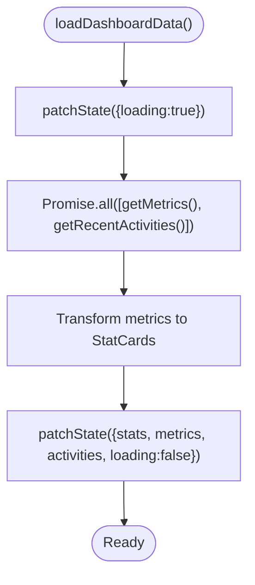

**Diagram sources**
- [dashboard.store.ts](file://frontend/src/app/core/store/dashboard.store.ts#L97-L152)

**Section sources**
- [dashboard.store.ts](file://frontend/src/app/core/store/dashboard.store.ts#L1-L367)

### Admin Dashboard Store
AdminDashboardStore mirrors the dashboard pattern but focuses on administrative metrics, recent users, and module statuses. It computes counts and enables quick toggles for module management.

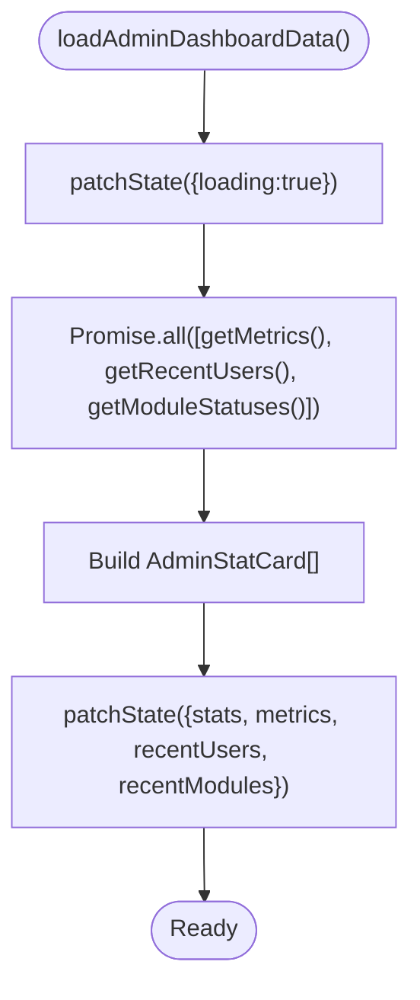

**Diagram sources**
- [admin-dashboard.store.ts](file://frontend/src/app/core/store/admin-dashboard.store.ts#L75-L128)

**Section sources**
- [admin-dashboard.store.ts](file://frontend/src/app/core/store/admin-dashboard.store.ts#L1-L307)

### User Store
UserStore handles paginated user lists, filters, and CRUD-like actions with optimistic UI flags. It normalizes responses and exposes computed counts for roles/statuses.

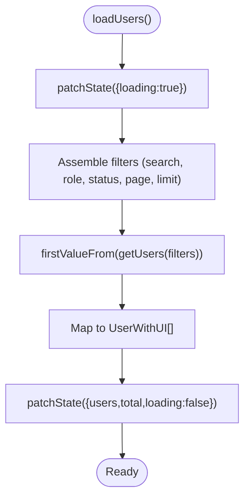

**Diagram sources**
- [user.store.ts](file://frontend/src/app/core/store/user.store.ts#L59-L89)

**Section sources**
- [user.store.ts](file://frontend/src/app/core/store/user.store.ts#L1-L329)

### Blog Store
BlogStore manages posts with status transitions (draft/published), search, filtering, and pagination. It maintains per-item UI flags for publishing/scheduling/deleting.

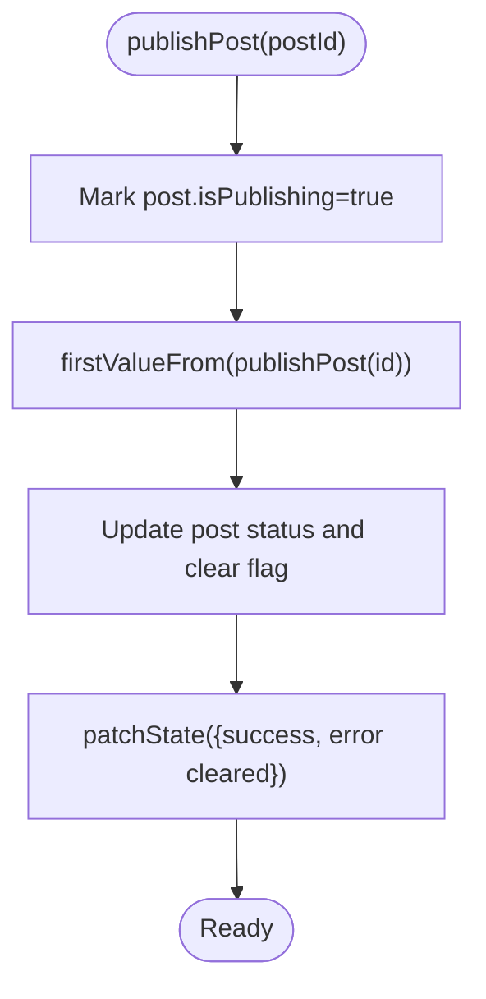

**Diagram sources**
- [blog.store.ts](file://frontend/src/app/core/store/blog.store.ts#L161-L192)

**Section sources**
- [blog.store.ts](file://frontend/src/app/core/store/blog.store.ts#L1-L332)

### LinkedIn Store
LinkedInStore extends the pattern with richer status tracking (draft/scheduled/published/archived) and analytics-like computed totals.

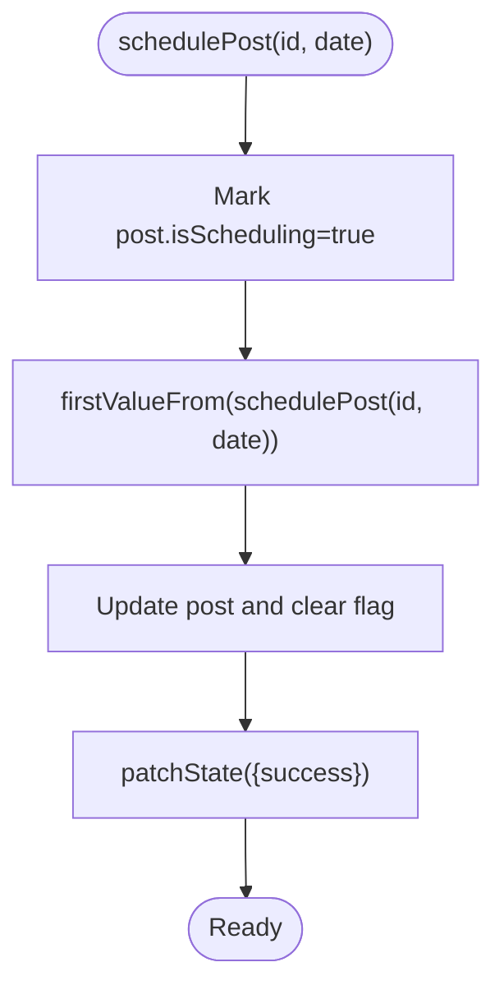

**Diagram sources**
- [linkedin.store.ts](file://frontend/src/app/core/store/linkedin.store.ts#L227-L254)

**Section sources**
- [linkedin.store.ts](file://frontend/src/app/core/store/linkedin.store.ts#L1-L354)

### YouTube Store
YouTubeStore demonstrates a hybrid approach: it simulates API calls internally for demonstration while exposing the same store contract for categories, statuses, and pagination.

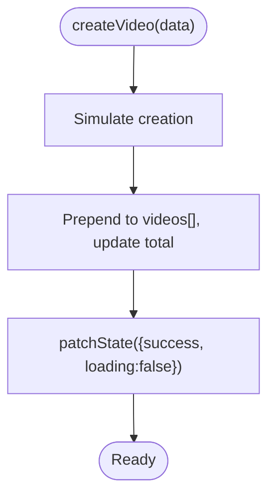

**Diagram sources**
- [youtube.store.ts](file://frontend/src/app/core/store/youtube.store.ts#L285-L323)

**Section sources**
- [youtube.store.ts](file://frontend/src/app/core/store/youtube.store.ts#L1-L543)

### Study Notes Store
StudyNotesStore mirrors YouTube’s hybrid pattern with category filtering and search across title, content, and tags.

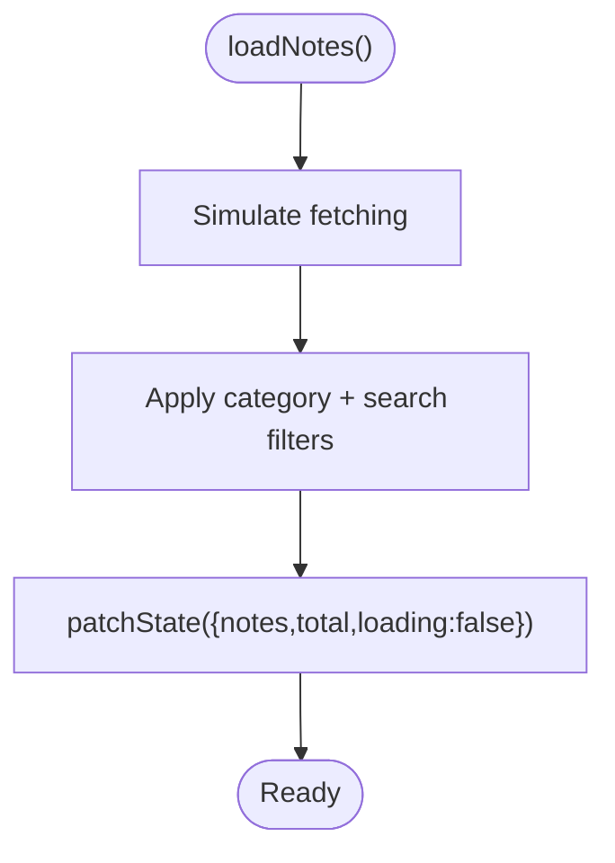

**Diagram sources**
- [study-notes.store.ts](file://frontend/src/app/core/store/study-notes.store.ts#L114-L188)

**Section sources**
- [study-notes.store.ts](file://frontend/src/app/core/store/study-notes.store.ts#L1-L438)

### Module Store
ModuleStore coordinates system module toggling with change detection and batched saves. It tracks previous states to support revert on failures.

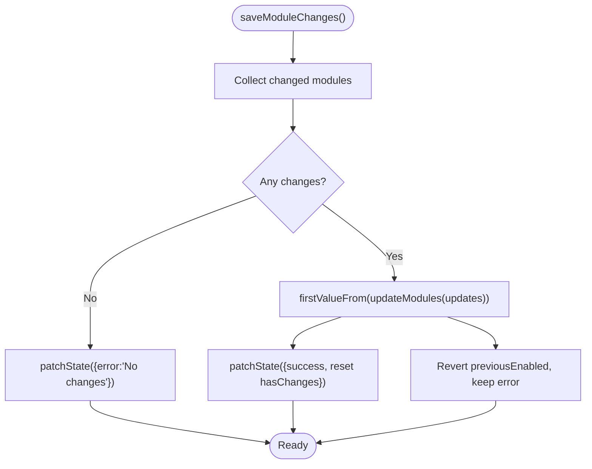

**Diagram sources**
- [module.store.ts](file://frontend/src/app/core/store/module.store.ts#L94-L144)

**Section sources**
- [module.store.ts](file://frontend/src/app/core/store/module.store.ts#L1-L175)

## Dependency Analysis
Stores depend on services for data access and on Angular’s HttpClient via ApiService or direct service calls. Interceptors depend on AuthService for token refresh and on ToastService for user feedback. Components depend on stores for reactive state and UI flags.

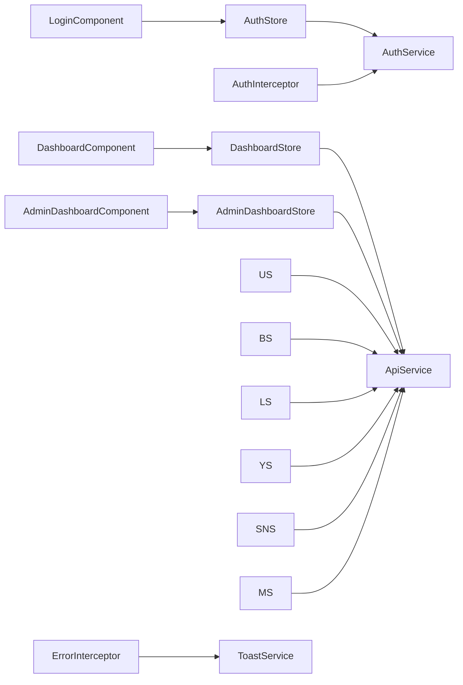

**Diagram sources**
- [login.component.ts](file://frontend/src/app/features/auth/login/login.component.ts#L14-L95)
- [dashboard.component.ts](file://frontend/src/app/features/dashboard/dashboard.component.ts#L35-L378)
- [admin-dashboard.component.ts](file://frontend/src/app/features/admin/admin-dashboard/admin-dashboard.component.ts#L37-L161)
- [auth.store.ts](file://frontend/src/app/core/store/auth.store.ts#L35-L222)
- [dashboard.store.ts](file://frontend/src/app/core/store/dashboard.store.ts#L38-L366)
- [admin-dashboard.store.ts](file://frontend/src/app/core/store/admin-dashboard.store.ts#L39-L306)
- [user.store.ts](file://frontend/src/app/core/store/user.store.ts#L41-L328)
- [blog.store.ts](file://frontend/src/app/core/store/blog.store.ts#L41-L331)
- [linkedin.store.ts](file://frontend/src/app/core/store/linkedin.store.ts#L43-L353)
- [youtube.store.ts](file://frontend/src/app/core/store/youtube.store.ts#L76-L542)
- [study-notes.store.ts](file://frontend/src/app/core/store/study-notes.store.ts#L69-L437)
- [module.store.ts](file://frontend/src/app/core/store/module.store.ts#L31-L174)
- [auth.service.ts](file://frontend/src/app/core/services/auth.service.ts#L31-L160)
- [api.service.ts](file://frontend/src/app/core/services/api.service.ts#L16-L75)
- [auth.interceptor.ts](file://frontend/src/app/core/interceptors/auth.interceptor.ts#L8-L44)
- [error.interceptor.ts](file://frontend/src/app/core/interceptors/error.interceptor.ts#L10-L152)
- [toast.service.ts](file://frontend/src/app/core/services/toast.service.ts#L15-L59)

**Section sources**
- [auth.store.ts](file://frontend/src/app/core/store/auth.store.ts#L1-L223)
- [dashboard.store.ts](file://frontend/src/app/core/store/dashboard.store.ts#L1-L367)
- [admin-dashboard.store.ts](file://frontend/src/app/core/store/admin-dashboard.store.ts#L1-L307)
- [user.store.ts](file://frontend/src/app/core/store/user.store.ts#L1-L329)
- [blog.store.ts](file://frontend/src/app/core/store/blog.store.ts#L1-L332)
- [linkedin.store.ts](file://frontend/src/app/core/store/linkedin.store.ts#L1-L354)
- [youtube.store.ts](file://frontend/src/app/core/store/youtube.store.ts#L1-L543)
- [study-notes.store.ts](file://frontend/src/app/core/store/study-notes.store.ts#L1-L438)
- [module.store.ts](file://frontend/src/app/core/store/module.store.ts#L1-L175)
- [auth.service.ts](file://frontend/src/app/core/services/auth.service.ts#L1-L161)
- [api.service.ts](file://frontend/src/app/core/services/api.service.ts#L1-L76)
- [auth.interceptor.ts](file://frontend/src/app/core/interceptors/auth.interceptor.ts#L1-L46)
- [error.interceptor.ts](file://frontend/src/app/core/interceptors/error.interceptor.ts#L1-L153)
- [toast.service.ts](file://frontend/src/app/core/services/toast.service.ts#L1-L60)
- [login.component.ts](file://frontend/src/app/features/auth/login/login.component.ts#L1-L96)
- [dashboard.component.ts](file://frontend/src/app/features/dashboard/dashboard.component.ts#L1-L379)
- [admin-dashboard.component.ts](file://frontend/src/app/features/admin/admin-dashboard/admin-dashboard.component.ts#L1-L162)

## Performance Considerations
- Prefer computed signals for derived state to minimize recomputations and avoid redundant DOM updates.
- Use Promise.all for coalescing parallel API calls in stores to reduce round-trips.
- Keep UI flags scoped to items (e.g., isDeleting) to avoid global loading states and improve perceived responsiveness.
- Debounce or throttle search/filter operations to avoid excessive re-computation.
- Persist minimal state to localStorage only when necessary (e.g., tokens, user profile) to reduce storage overhead.

## Troubleshooting Guide
Common issues and resolutions:
- 401 Unauthorized: AuthInterceptor attempts token refresh; on failure, it triggers logout and navigates to login. Verify refresh endpoint and token validity.
- Global HTTP errors: ErrorInterceptor retries once, maps status codes to user-friendly messages, and routes to appropriate pages (e.g., access denied).
- UI stuck in loading: Ensure every async action calls patchState to set loading to false on both success and error paths.
- State not reflecting changes: Confirm that store methods update state via patchState and that components subscribe to signals, not service observables directly.
- Pagination inconsistencies: Verify currentPage/pageSize calculations and that filters reset page on change.

**Section sources**
- [auth.interceptor.ts](file://frontend/src/app/core/interceptors/auth.interceptor.ts#L22-L43)
- [error.interceptor.ts](file://frontend/src/app/core/interceptors/error.interceptor.ts#L17-L71)
- [auth.store.ts](file://frontend/src/app/core/store/auth.store.ts#L105-L128)
- [dashboard.store.ts](file://frontend/src/app/core/store/dashboard.store.ts#L97-L152)
- [user.store.ts](file://frontend/src/app/core/store/user.store.ts#L59-L89)

## Conclusion
The signal store architecture delivers a clear separation of concerns, predictable state updates, and reactive UI binding. By centralizing async flows in stores, enforcing computed derivations, and integrating robust interceptors, the system achieves scalability, maintainability, and a consistent developer experience across feature modules.

## Appendices

### Practical Examples

- Component integration example (login):
  - Inject AuthStore and bind to isLoading/error/success signals.
  - Dispatch login via store.login(credentials) instead of calling AuthService directly.
  - See [login.component.ts](file://frontend/src/app/features/auth/login/login.component.ts#L14-L95).

- Store action example (dashboard refresh):
  - Call store.refreshDashboardData() to update metrics and activities.
  - Observe success/error via signals.
  - See [dashboard.store.ts](file://frontend/src/app/core/store/dashboard.store.ts#L157-L210).

- Store action example (module save):
  - Detect changed modules, batch updates, and revert on failure.
  - See [module.store.ts](file://frontend/src/app/core/store/module.store.ts#L94-L144).

- Debugging techniques:
  - Log patchState transitions in stores to trace state changes.
  - Inspect computed signals in devtools to verify derived values.
  - Temporarily disable interceptors to isolate network issues.

**Section sources**
- [login.component.ts](file://frontend/src/app/features/auth/login/login.component.ts#L1-L96)
- [dashboard.store.ts](file://frontend/src/app/core/store/dashboard.store.ts#L1-L367)
- [module.store.ts](file://frontend/src/app/core/store/module.store.ts#L1-L175)