# Store Architecture Overview

<cite>
**Referenced Files in This Document**
- [admin-dashboard.store.ts](file://frontend/src/app/core/store/admin-dashboard.store.ts)
- [auth.store.ts](file://frontend/src/app/core/store/auth.store.ts)
- [blog.store.ts](file://frontend/src/app/core/store/blog.store.ts)
- [dashboard.store.ts](file://frontend/src/app/core/store/dashboard.store.ts)
- [linkedin.store.ts](file://frontend/src/app/core/store/linkedin.store.ts)
- [module.store.ts](file://frontend/src/app/core/store/module.store.ts)
- [profile.store.ts](file://frontend/src/app/core/store/profile.store.ts)
- [settings.store.ts](file://frontend/src/app/core/store/settings.store.ts)
- [study-notes.store.ts](file://frontend/src/app/core/store/study-notes.store.ts)
- [youtube.store.ts](file://frontend/src/app/core/store/youtube.store.ts)
- [admin-dashboard.service.ts](file://frontend/src/app/core/services/admin-dashboard.service.ts)
- [auth.service.ts](file://frontend/src/app/core/services/auth.service.ts)
- [auth.interceptor.ts](file://frontend/src/app/core/interceptors/auth.interceptor.ts)
- [error.interceptor.ts](file://frontend/src/app/core/interceptors/error.interceptor.ts)
- [toast.service.ts](file://frontend/src/app/core/services/toast.service.ts)
</cite>

## Table of Contents
1. [Introduction](#introduction)
2. [Project Structure](#project-structure)
3. [Core Components](#core-components)
4. [Architecture Overview](#architecture-overview)
5. [Detailed Component Analysis](#detailed-component-analysis)
6. [Dependency Analysis](#dependency-analysis)
7. [Performance Considerations](#performance-considerations)
8. [Troubleshooting Guide](#troubleshooting-guide)
9. [Conclusion](#conclusion)
10. [Appendices](#appendices)

## Introduction
This document explains the signal store architecture used in the Multi-Application-Control-Dashboard frontend. It covers the signal store pattern implementation, reactive state management concepts, and the rationale for adopting Angular Signals over traditional state management solutions. It documents store composition patterns, state immutability principles, and reactive programming concepts. It also details the integration between signal stores and Angular services, interceptor patterns, and error handling strategies. Architectural diagrams illustrate store relationships, data flow, and component-store communication mechanisms. Practical examples demonstrate store initialization, subscription patterns, and debugging techniques.

## Project Structure
The frontend’s store layer is organized per-domain feature, with each store encapsulating state, computed derivations, and methods that mutate state. Stores integrate with Angular services via injected dependencies and use RxJS Observables for asynchronous operations. Interceptors manage authentication and error handling across HTTP requests.

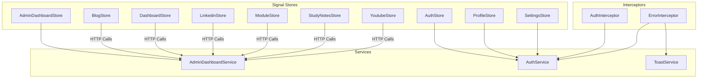

**Diagram sources**
- [admin-dashboard.store.ts](file://frontend/src/app/core/store/admin-dashboard.store.ts#L39-L306)
- [auth.store.ts](file://frontend/src/app/core/store/auth.store.ts#L35-L222)
- [blog.store.ts](file://frontend/src/app/core/store/blog.store.ts#L41-L331)
- [dashboard.store.ts](file://frontend/src/app/core/store/dashboard.store.ts#L38-L366)
- [linkedin.store.ts](file://frontend/src/app/core/store/linkedin.store.ts#L43-L353)
- [module.store.ts](file://frontend/src/app/core/store/module.store.ts#L31-L174)
- [profile.store.ts](file://frontend/src/app/core/store/profile.store.ts#L32-L188)
- [settings.store.ts](file://frontend/src/app/core/store/settings.store.ts#L42-L359)
- [study-notes.store.ts](file://frontend/src/app/core/store/study-notes.store.ts#L69-L437)
- [youtube.store.ts](file://frontend/src/app/core/store/youtube.store.ts#L76-L542)
- [admin-dashboard.service.ts](file://frontend/src/app/core/services/admin-dashboard.service.ts#L43-L112)
- [auth.service.ts](file://frontend/src/app/core/services/auth.service.ts#L31-L160)
- [auth.interceptor.ts](file://frontend/src/app/core/interceptors/auth.interceptor.ts#L8-L45)
- [error.interceptor.ts](file://frontend/src/app/core/interceptors/error.interceptor.ts#L10-L152)
- [toast.service.ts](file://frontend/src/app/core/services/toast.service.ts#L15-L59)

**Section sources**
- [admin-dashboard.store.ts](file://frontend/src/app/core/store/admin-dashboard.store.ts#L1-L307)
- [auth.store.ts](file://frontend/src/app/core/store/auth.store.ts#L1-L223)
- [blog.store.ts](file://frontend/src/app/core/store/blog.store.ts#L1-L332)
- [dashboard.store.ts](file://frontend/src/app/core/store/dashboard.store.ts#L1-L367)
- [linkedin.store.ts](file://frontend/src/app/core/store/linkedin.store.ts#L1-L354)
- [module.store.ts](file://frontend/src/app/core/store/module.store.ts#L1-L175)
- [profile.store.ts](file://frontend/src/app/core/store/profile.store.ts#L1-L189)
- [settings.store.ts](file://frontend/src/app/core/store/settings.store.ts#L1-L360)
- [study-notes.store.ts](file://frontend/src/app/core/store/study-notes.store.ts#L1-L438)
- [youtube.store.ts](file://frontend/src/app/core/store/youtube.store.ts#L1-L543)
- [admin-dashboard.service.ts](file://frontend/src/app/core/services/admin-dashboard.service.ts#L1-L113)
- [auth.service.ts](file://frontend/src/app/core/services/auth.service.ts#L1-L161)
- [auth.interceptor.ts](file://frontend/src/app/core/interceptors/auth.interceptor.ts#L1-L46)
- [error.interceptor.ts](file://frontend/src/app/core/interceptors/error.interceptor.ts#L1-L153)
- [toast.service.ts](file://frontend/src/app/core/services/toast.service.ts#L1-L60)

## Core Components
- Signal store pattern: Each store composes state, computed signals, and methods using @ngrx/signals primitives. Stores are singleton providers and expose typed actions for UI components.
- Reactive state management: Stores use Angular Signals internally and expose computed signals for derived state. Methods update state via patchState, ensuring immutability by replacing state slices.
- Service integration: Stores depend on Angular services for HTTP operations. RxJS Observables are bridged using firstValueFrom to maintain synchronous method signatures in stores.
- Interceptors: AuthInterceptor attaches tokens and handles 401 by refreshing tokens. ErrorInterceptor centralizes HTTP error handling, routing, and toast notifications.
- Error handling: Stores set error/success messages and clear them after timeouts. Services and interceptors propagate and normalize errors.

Key patterns demonstrated:
- withState for initial state shape
- withComputed for derived state
- withMethods for actions and side effects
- patchState for immutable updates
- firstValueFrom for Observable-to-promise conversion
- computed for reactive derivations

**Section sources**
- [admin-dashboard.store.ts](file://frontend/src/app/core/store/admin-dashboard.store.ts#L39-L306)
- [auth.store.ts](file://frontend/src/app/core/store/auth.store.ts#L35-L222)
- [blog.store.ts](file://frontend/src/app/core/store/blog.store.ts#L41-L331)
- [dashboard.store.ts](file://frontend/src/app/core/store/dashboard.store.ts#L38-L366)
- [linkedin.store.ts](file://frontend/src/app/core/store/linkedin.store.ts#L43-L353)
- [module.store.ts](file://frontend/src/app/core/store/module.store.ts#L31-L174)
- [profile.store.ts](file://frontend/src/app/core/store/profile.store.ts#L32-L188)
- [settings.store.ts](file://frontend/src/app/core/store/settings.store.ts#L42-L359)
- [study-notes.store.ts](file://frontend/src/app/core/store/study-notes.store.ts#L69-L437)
- [youtube.store.ts](file://frontend/src/app/core/store/youtube.store.ts#L76-L542)
- [auth.interceptor.ts](file://frontend/src/app/core/interceptors/auth.interceptor.ts#L8-L45)
- [error.interceptor.ts](file://frontend/src/app/core/interceptors/error.interceptor.ts#L10-L152)
- [toast.service.ts](file://frontend/src/app/core/services/toast.service.ts#L15-L59)

## Architecture Overview
The signal store architecture follows a unidirectional data flow:
- UI components subscribe to store signals and call store methods.
- Store methods orchestrate side effects via injected services, transform data, and update state immutably.
- Interceptors handle auth and error concerns globally, keeping stores focused on domain logic.
- Computed signals reactively derive UI state, minimizing re-renders.

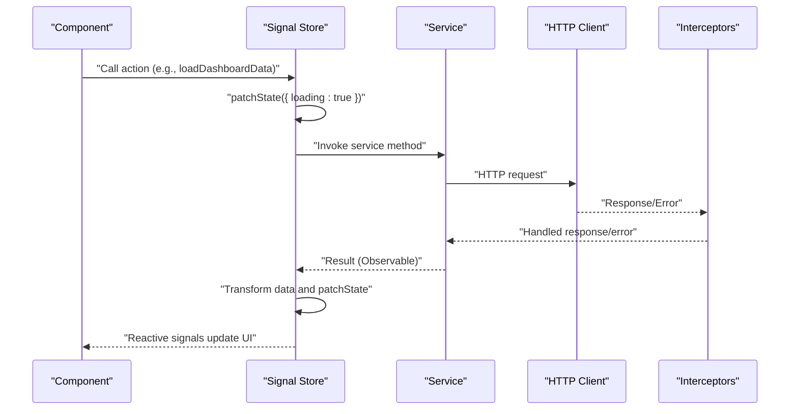

**Diagram sources**
- [dashboard.store.ts](file://frontend/src/app/core/store/dashboard.store.ts#L97-L152)
- [auth.interceptor.ts](file://frontend/src/app/core/interceptors/auth.interceptor.ts#L11-L44)
- [error.interceptor.ts](file://frontend/src/app/core/interceptors/error.interceptor.ts#L17-L25)

## Detailed Component Analysis

### AdminDashboardStore
- Purpose: Aggregates admin metrics, recent users, and module statuses into a unified dashboard.
- Composition: withState defines the shape; withComputed derives counts and flags; withMethods orchestrates async loads and refreshes.
- Integration: Uses AdminDashboardService for metrics, recent users, and module statuses. Parallel loading via Promise.all.
- Error handling: Centralized error messaging and loading flags.

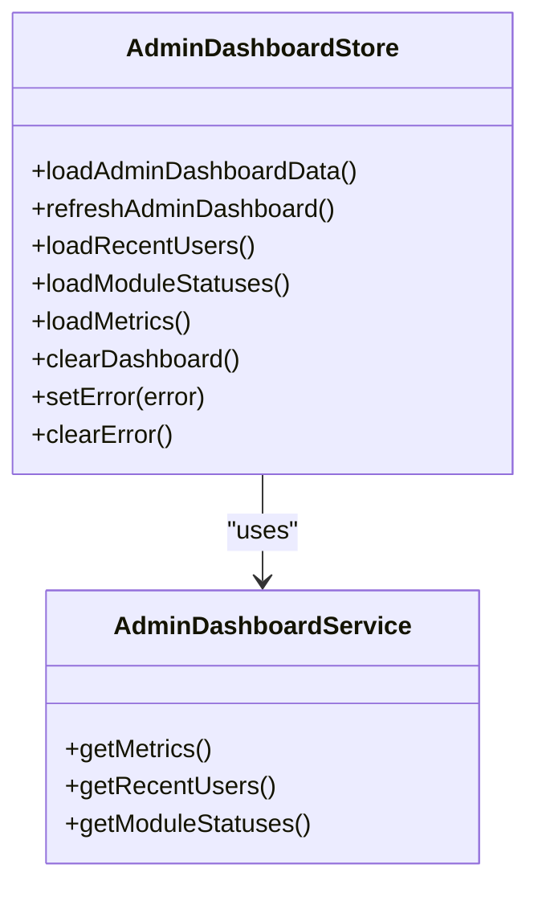

**Diagram sources**
- [admin-dashboard.store.ts](file://frontend/src/app/core/store/admin-dashboard.store.ts#L39-L306)
- [admin-dashboard.service.ts](file://frontend/src/app/core/services/admin-dashboard.service.ts#L43-L112)

**Section sources**
- [admin-dashboard.store.ts](file://frontend/src/app/core/store/admin-dashboard.store.ts#L1-L307)
- [admin-dashboard.service.ts](file://frontend/src/app/core/services/admin-dashboard.service.ts#L1-L113)

### AuthStore
- Purpose: Manages authentication state, tokens, and user profile.
- Composition: withState captures auth lifecycle; withComputed exposes role-based flags; withMethods handles login, register, token refresh, and profile load.
- Integration: Uses AuthService for HTTP operations and Router for navigation.
- Error handling: Sets error/success messages and auto-clears success after timeout.

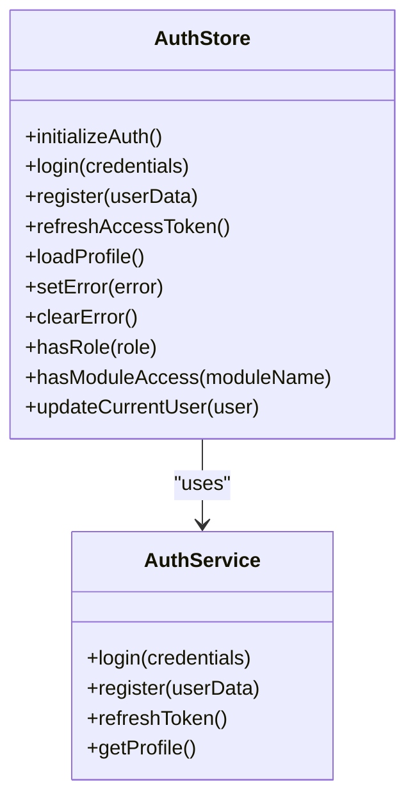

**Diagram sources**
- [auth.store.ts](file://frontend/src/app/core/store/auth.store.ts#L35-L222)
- [auth.service.ts](file://frontend/src/app/core/services/auth.service.ts#L31-L160)

**Section sources**
- [auth.store.ts](file://frontend/src/app/core/store/auth.store.ts#L1-L223)
- [auth.service.ts](file://frontend/src/app/core/services/auth.service.ts#L1-L161)

### DashboardStore
- Purpose: Provides dashboard metrics and recent activity with rich computed derivations.
- Composition: withState for stats and activities; withComputed for counts and freshness; withMethods for loading and filtering.
- Integration: Uses AdminDashboardService for metrics and activities.

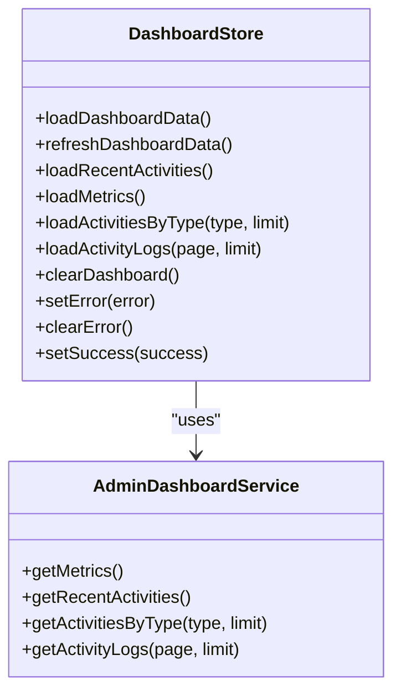

**Diagram sources**
- [dashboard.store.ts](file://frontend/src/app/core/store/dashboard.store.ts#L38-L366)
- [admin-dashboard.service.ts](file://frontend/src/app/core/services/admin-dashboard.service.ts#L43-L112)

**Section sources**
- [dashboard.store.ts](file://frontend/src/app/core/store/dashboard.store.ts#L1-L367)
- [admin-dashboard.service.ts](file://frontend/src/app/core/services/admin-dashboard.service.ts#L1-L113)

### BlogStore
- Purpose: Manages blog posts with CRUD operations, filtering, and pagination.
- Composition: withState for posts and UI flags; withComputed for counts and pagination helpers; withMethods for load/update/create/delete/publish/unpublish.

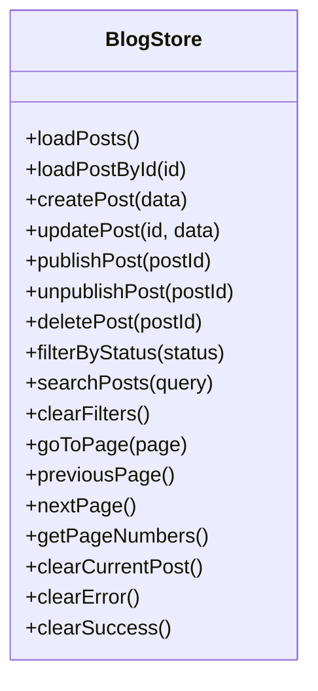

**Diagram sources**
- [blog.store.ts](file://frontend/src/app/core/store/blog.store.ts#L41-L331)

**Section sources**
- [blog.store.ts](file://frontend/src/app/core/store/blog.store.ts#L1-L332)

### LinkedinStore
- Purpose: Manages LinkedIn posts with status transitions (draft, published, scheduled, archived).
- Composition: Similar to BlogStore with additional scheduling and archiving flows.

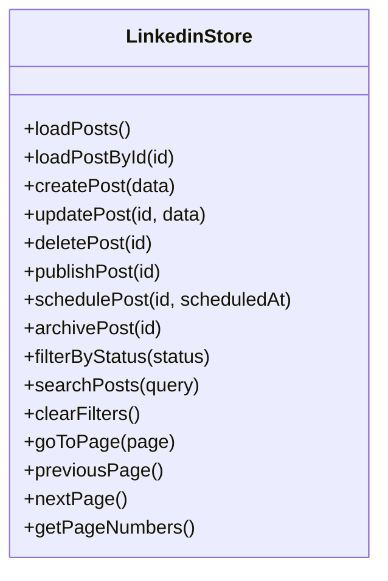

**Diagram sources**
- [linkedin.store.ts](file://frontend/src/app/core/store/linkedin.store.ts#L43-L353)

**Section sources**
- [linkedin.store.ts](file://frontend/src/app/core/store/linkedin.store.ts#L1-L354)

### ModuleStore
- Purpose: Manages system modules, toggling enabled state, and batch saving with change tracking.
- Composition: withState for modules and UI flags; withComputed for counts and change detection; withMethods for load/toggle/save/reset.

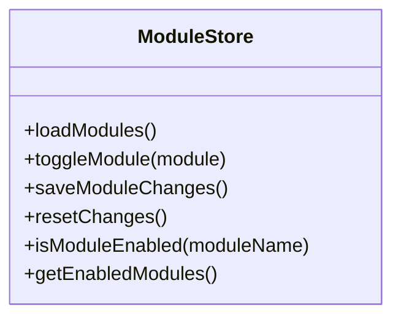

**Diagram sources**
- [module.store.ts](file://frontend/src/app/core/store/module.store.ts#L31-L174)

**Section sources**
- [module.store.ts](file://frontend/src/app/core/store/module.store.ts#L1-L175)

### StudyNotesStore
- Purpose: Manages study notes with categories, filtering, pagination, and CRUD operations.
- Composition: withState for notes and UI flags; withComputed for counts and analytics; withMethods for load/update/create/delete.

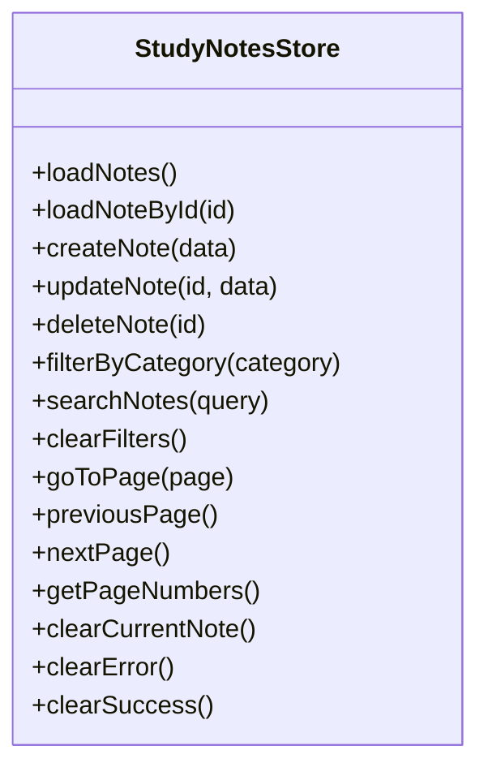

**Diagram sources**
- [study-notes.store.ts](file://frontend/src/app/core/store/study-notes.store.ts#L69-L437)

**Section sources**
- [study-notes.store.ts](file://frontend/src/app/core/store/study-notes.store.ts#L1-L438)

### YoutubeStore
- Purpose: Manages YouTube videos with categories, statuses, and analytics.
- Composition: withState for videos and UI flags; withComputed for counts and averages; withMethods for load/update/status change/delete.

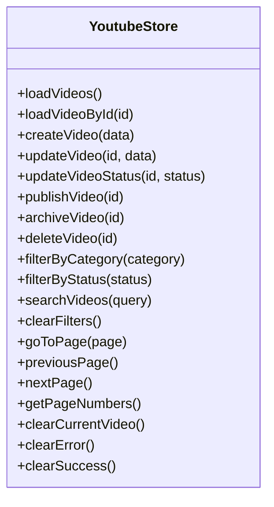

**Diagram sources**
- [youtube.store.ts](file://frontend/src/app/core/store/youtube.store.ts#L76-L542)

**Section sources**
- [youtube.store.ts](file://frontend/src/app/core/store/youtube.store.ts#L1-L543)

### ProfileStore
- Purpose: Initializes and updates user profile data.
- Composition: withState for profile; withComputed for display helpers; withMethods for initialization, load, and update.

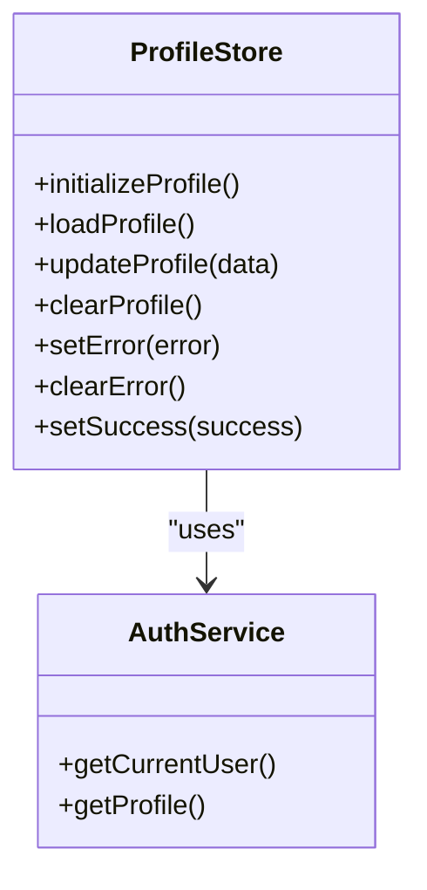

**Diagram sources**
- [profile.store.ts](file://frontend/src/app/core/store/profile.store.ts#L32-L188)
- [auth.service.ts](file://frontend/src/app/core/services/auth.service.ts#L31-L160)

**Section sources**
- [profile.store.ts](file://frontend/src/app/core/store/profile.store.ts#L1-L189)
- [auth.service.ts](file://frontend/src/app/core/services/auth.service.ts#L1-L161)

### SettingsStore
- Purpose: Manages user preferences with conditional logic and persistence.
- Composition: withState for settings; withComputed for derived flags; withMethods for initialization, load, update, reset, and theme application.

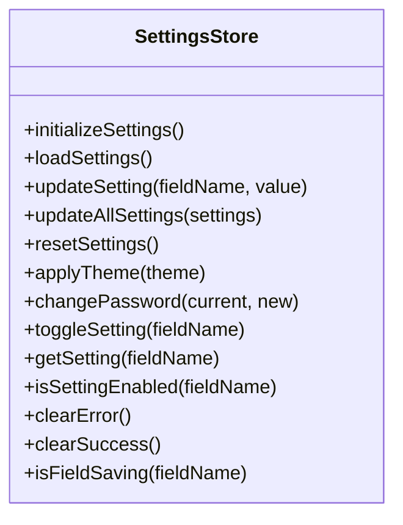

**Diagram sources**
- [settings.store.ts](file://frontend/src/app/core/store/settings.store.ts#L42-L359)

**Section sources**
- [settings.store.ts](file://frontend/src/app/core/store/settings.store.ts#L1-L360)

## Dependency Analysis
Stores depend on Angular services for HTTP operations. Interceptors provide cross-cutting concerns:
- AuthInterceptor: Adds Authorization headers and refreshes tokens on 401.
- ErrorInterceptor: Retries once, routes unauthorized users, shows toasts, and normalizes errors.

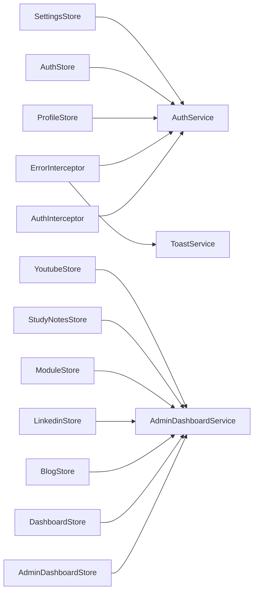

**Diagram sources**
- [auth.interceptor.ts](file://frontend/src/app/core/interceptors/auth.interceptor.ts#L8-L45)
- [error.interceptor.ts](file://frontend/src/app/core/interceptors/error.interceptor.ts#L10-L152)
- [auth.service.ts](file://frontend/src/app/core/services/auth.service.ts#L31-L160)
- [admin-dashboard.service.ts](file://frontend/src/app/core/services/admin-dashboard.service.ts#L43-L112)
- [admin-dashboard.store.ts](file://frontend/src/app/core/store/admin-dashboard.store.ts#L39-L306)
- [dashboard.store.ts](file://frontend/src/app/core/store/dashboard.store.ts#L38-L366)
- [blog.store.ts](file://frontend/src/app/core/store/blog.store.ts#L41-L331)
- [linkedin.store.ts](file://frontend/src/app/core/store/linkedin.store.ts#L43-L353)
- [module.store.ts](file://frontend/src/app/core/store/module.store.ts#L31-L174)
- [study-notes.store.ts](file://frontend/src/app/core/store/study-notes.store.ts#L69-L437)
- [youtube.store.ts](file://frontend/src/app/core/store/youtube.store.ts#L76-L542)
- [profile.store.ts](file://frontend/src/app/core/store/profile.store.ts#L32-L188)
- [auth.store.ts](file://frontend/src/app/core/store/auth.store.ts#L35-L222)
- [settings.store.ts](file://frontend/src/app/core/store/settings.store.ts#L42-L359)

**Section sources**
- [auth.interceptor.ts](file://frontend/src/app/core/interceptors/auth.interceptor.ts#L1-L46)
- [error.interceptor.ts](file://frontend/src/app/core/interceptors/error.interceptor.ts#L1-L153)
- [auth.service.ts](file://frontend/src/app/core/services/auth.service.ts#L1-L161)
- [admin-dashboard.service.ts](file://frontend/src/app/core/services/admin-dashboard.service.ts#L1-L113)
- [admin-dashboard.store.ts](file://frontend/src/app/core/store/admin-dashboard.store.ts#L1-L307)
- [dashboard.store.ts](file://frontend/src/app/core/store/dashboard.store.ts#L1-L367)
- [blog.store.ts](file://frontend/src/app/core/store/blog.store.ts#L1-L332)
- [linkedin.store.ts](file://frontend/src/app/core/store/linkedin.store.ts#L1-L354)
- [module.store.ts](file://frontend/src/app/core/store/module.store.ts#L1-L175)
- [study-notes.store.ts](file://frontend/src/app/core/store/study-notes.store.ts#L1-L438)
- [youtube.store.ts](file://frontend/src/app/core/store/youtube.store.ts#L1-L543)
- [profile.store.ts](file://frontend/src/app/core/store/profile.store.ts#L1-L189)
- [auth.store.ts](file://frontend/src/app/core/store/auth.store.ts#L1-L223)
- [settings.store.ts](file://frontend/src/app/core/store/settings.store.ts#L1-L360)

## Performance Considerations
- Minimize unnecessary renders: Use computed signals for derived state to avoid recomputing expensive values.
- Batch updates: Group related state changes with a single patchState to reduce change detection cycles.
- Asynchronous orchestration: Use Promise.all for independent parallel loads to reduce total latency.
- Pagination and filtering: Keep UI flags minimal and compute totals lazily via computed signals.
- Interceptor retries: Limit retry attempts to avoid cascading failures.

[No sources needed since this section provides general guidance]

## Troubleshooting Guide
Common issues and resolutions:
- Authentication failures: AuthInterceptor refreshes tokens on 401; if refresh fails, user is logged out automatically. Verify token storage and network connectivity.
- HTTP errors: ErrorInterceptor displays contextual toasts and navigates appropriately. Inspect console logs for detailed error messages.
- Store state not updating: Ensure patchState is called with immutable updates and that methods are awaited in components.
- Debugging: Use browser devtools to inspect store signals and computed derivations. Temporarily add console logs in store methods to trace execution.

**Section sources**
- [auth.interceptor.ts](file://frontend/src/app/core/interceptors/auth.interceptor.ts#L22-L44)
- [error.interceptor.ts](file://frontend/src/app/core/interceptors/error.interceptor.ts#L17-L71)
- [toast.service.ts](file://frontend/src/app/core/services/toast.service.ts#L15-L59)

## Conclusion
The signal store architecture delivers a clean, reactive, and testable state layer. By composing state, computed signals, and methods with @ngrx/signals, stores remain focused on domain logic while integrating seamlessly with Angular services and interceptors. The pattern enforces immutability, simplifies subscriptions, and improves maintainability across multiple features.

[No sources needed since this section summarizes without analyzing specific files]

## Appendices

### Practical Examples

- Store initialization
  - AuthStore.initializeAuth: Loads persisted tokens and user from localStorage and sets authenticated state.
  - SettingsStore.initializeSettings: Restores user preferences from localStorage.
  - ProfileStore.initializeProfile: Initializes profile from AuthService.

- Subscription patterns
  - Subscribe to computed signals (e.g., isLoading, hasData) in components to drive UI rendering.
  - Use standalone computed for derived values (e.g., counts, flags) to keep templates concise.

- Debugging techniques
  - Add temporary console logs in store methods around patchState calls.
  - Use devtools to monitor signal updates and computed recalculations.
  - Validate interceptor behavior by checking Authorization headers and error flows.

**Section sources**
- [auth.store.ts](file://frontend/src/app/core/store/auth.store.ts#L84-L103)
- [settings.store.ts](file://frontend/src/app/core/store/settings.store.ts#L91-L117)
- [profile.store.ts](file://frontend/src/app/core/store/profile.store.ts#L65-L89)