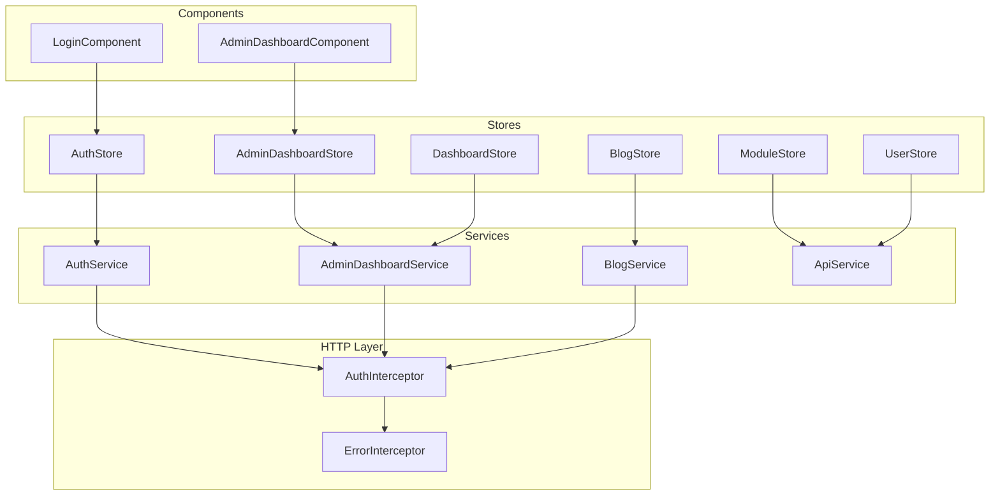
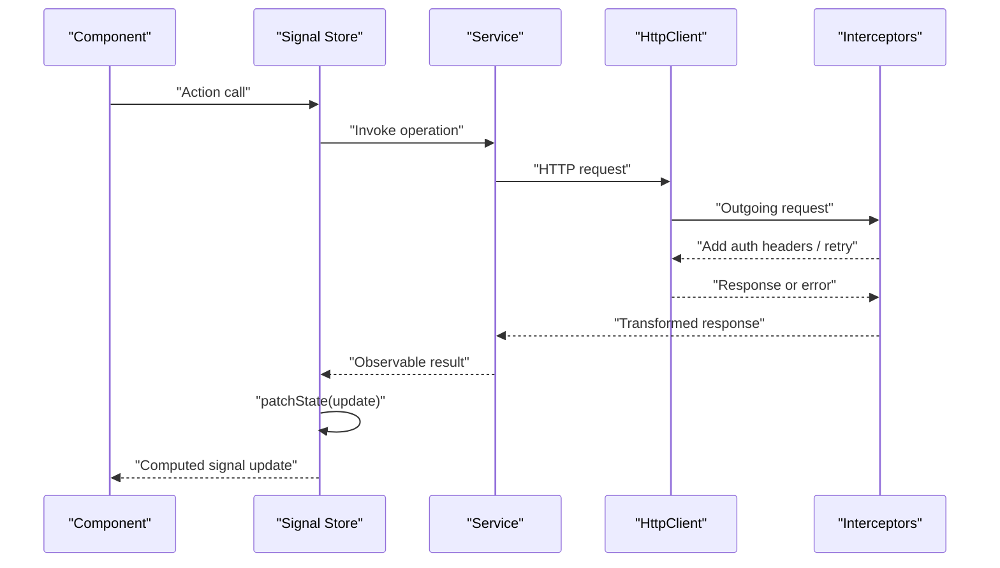
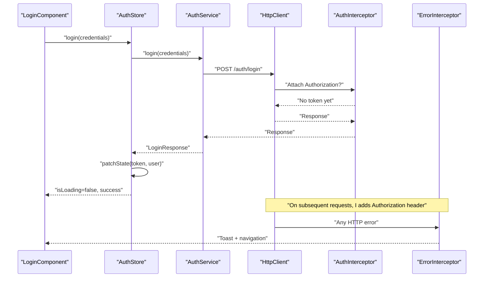
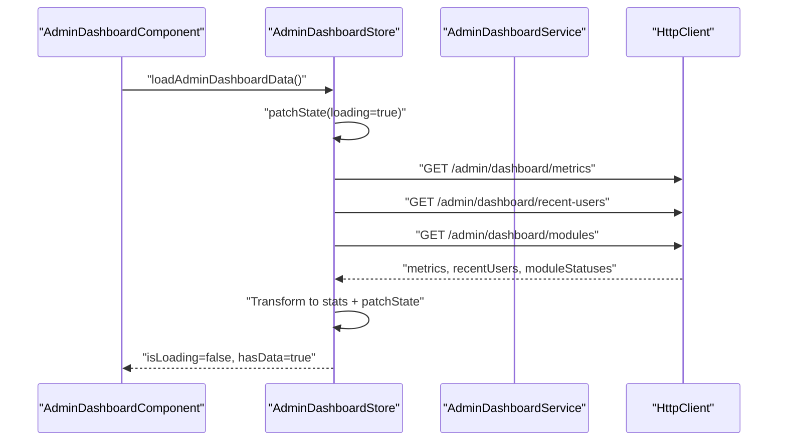
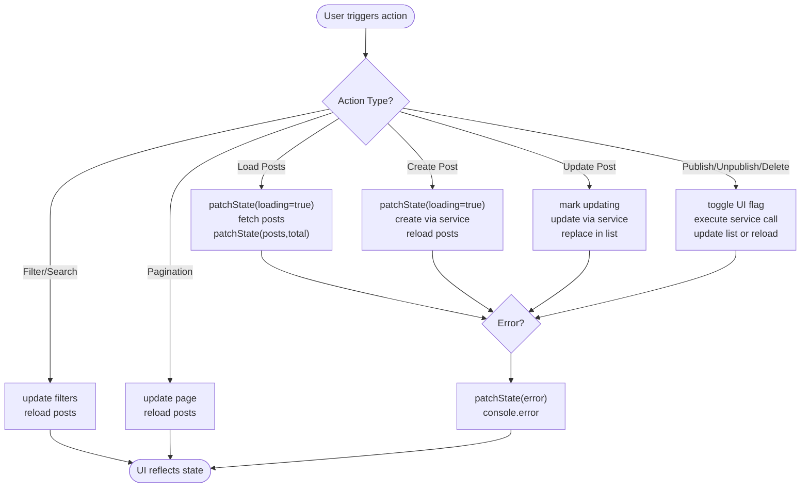
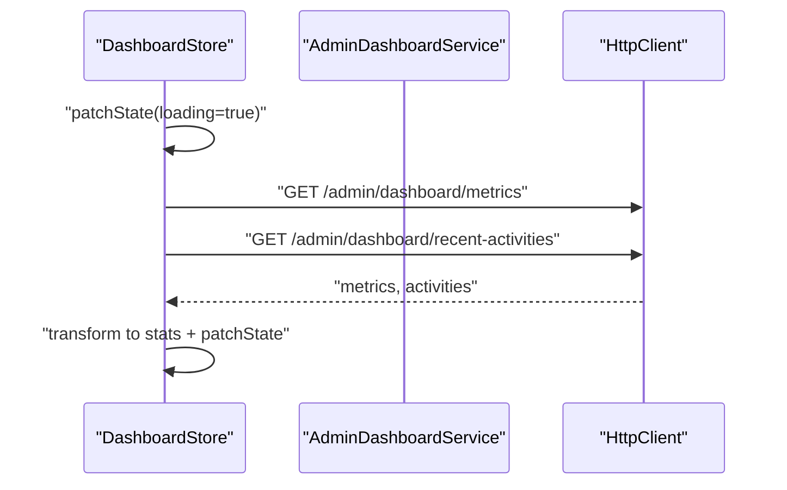
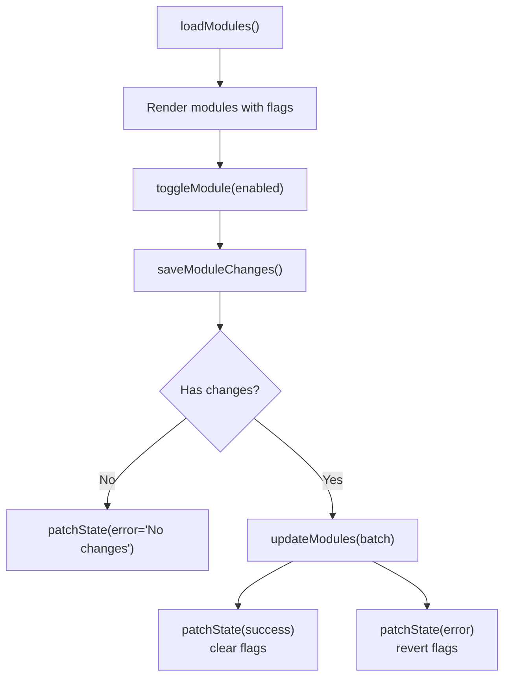
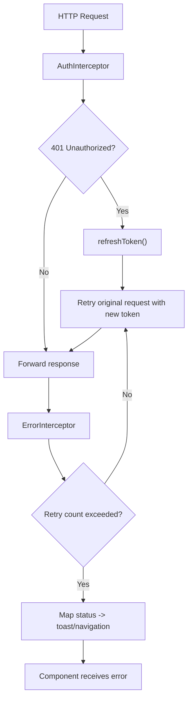
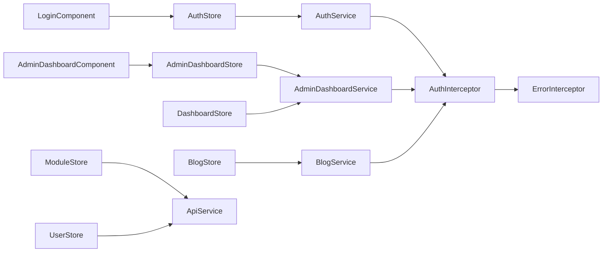

# Store Integration Patterns

<cite>
**Referenced Files in This Document**
- [admin-dashboard.store.ts](file://frontend/src/app/core/store/admin-dashboard.store.ts)
- [auth.store.ts](file://frontend/src/app/core/store/auth.store.ts)
- [blog.store.ts](file://frontend/src/app/core/store/blog.store.ts)
- [dashboard.store.ts](file://frontend/src/app/core/store/dashboard.store.ts)
- [module.store.ts](file://frontend/src/app/core/store/module.store.ts)
- [user.store.ts](file://frontend/src/app/core/store/user.store.ts)
- [auth.interceptor.ts](file://frontend/src/app/core/interceptors/auth.interceptor.ts)
- [error.interceptor.ts](file://frontend/src/app/core/interceptors/error.interceptor.ts)
- [admin-dashboard.component.ts](file://frontend/src/app/features/admin/admin-dashboard/admin-dashboard.component.ts)
- [login.component.ts](file://frontend/src/app/features/auth/login/login.component.ts)
- [admin-dashboard.service.ts](file://frontend/src/app/core/services/admin-dashboard.service.ts)
- [auth.service.ts](file://frontend/src/app/core/services/auth.service.ts)
- [blog.service.ts](file://frontend/src/app/core/services/blog.service.ts)
- [api.service.ts](file://frontend/src/app/core/services/api.service.ts)
- [toast.service.ts](file://frontend/src/app/core/services/toast.service.ts)
</cite>

## Table of Contents
1. [Introduction](#introduction)
2. [Project Structure](#project-structure)
3. [Core Components](#core-components)
4. [Architecture Overview](#architecture-overview)
5. [Detailed Component Analysis](#detailed-component-analysis)
6. [Dependency Analysis](#dependency-analysis)
7. [Performance Considerations](#performance-considerations)
8. [Troubleshooting Guide](#troubleshooting-guide)
9. [Conclusion](#conclusion)

## Introduction
This document explains store integration patterns implemented in the frontend, focusing on:
- Service-layer integration via Angular services and RxJS Observables
- Interceptor patterns for HTTP request/response transformation and error propagation
- Component-store communication, subscriptions, and lifecycle management
- Loading state management and robust error handling strategies

The patterns demonstrate how stores encapsulate state, orchestrate asynchronous operations, and expose computed signals for reactive UI updates. Interceptors centralize authentication and error handling, while services abstract HTTP concerns and provide typed contracts for backend interactions.

## Project Structure
The frontend organizes integration concerns into three layers:
- Services: Typed HTTP clients per domain (authentication, blog, admin dashboard, modules, users)
- Stores: NGRX Signals-based stores managing domain state and derived computations
- Interceptors: HTTP interceptors for auth and error handling
- Components: UI layer subscribing to store signals and invoking store actions

**Diagram sources**
- [admin-dashboard.component.ts](file://frontend/src/app/features/admin/admin-dashboard/admin-dashboard.component.ts#L37-L45)
- [login.component.ts](file://frontend/src/app/features/auth/login/login.component.ts#L14-L18)
- [auth.store.ts](file://frontend/src/app/core/store/auth.store.ts#L35-L103)
- [admin-dashboard.store.ts](file://frontend/src/app/core/store/admin-dashboard.store.ts#L39-L128)
- [blog.store.ts](file://frontend/src/app/core/store/blog.store.ts#L41-L137)
- [dashboard.store.ts](file://frontend/src/app/core/store/dashboard.store.ts#L38-L152)
- [module.store.ts](file://frontend/src/app/core/store/module.store.ts#L31-L73)
- [user.store.ts](file://frontend/src/app/core/store/user.store.ts#L41-L120)
- [auth.service.ts](file://frontend/src/app/core/services/auth.service.ts#L31-L111)
- [admin-dashboard.service.ts](file://frontend/src/app/core/services/admin-dashboard.service.ts#L43-L75)
- [blog.service.ts](file://frontend/src/app/core/services/blog.service.ts#L60-L106)
- [api.service.ts](file://frontend/src/app/core/services/api.service.ts#L16-L67)
- [auth.interceptor.ts](file://frontend/src/app/core/interceptors/auth.interceptor.ts#L8-L44)
- [error.interceptor.ts](file://frontend/src/app/core/interceptors/error.interceptor.ts#L10-L71)

**Section sources**
- [admin-dashboard.store.ts](file://frontend/src/app/core/store/admin-dashboard.store.ts#L1-L307)
- [auth.store.ts](file://frontend/src/app/core/store/auth.store.ts#L1-L223)
- [blog.store.ts](file://frontend/src/app/core/store/blog.store.ts#L1-L332)
- [dashboard.store.ts](file://frontend/src/app/core/store/dashboard.store.ts#L1-L367)
- [module.store.ts](file://frontend/src/app/core/store/module.store.ts#L1-L175)
- [user.store.ts](file://frontend/src/app/core/store/user.store.ts#L1-L329)
- [auth.interceptor.ts](file://frontend/src/app/core/interceptors/auth.interceptor.ts#L1-L46)
- [error.interceptor.ts](file://frontend/src/app/core/interceptors/error.interceptor.ts#L1-L153)
- [admin-dashboard.component.ts](file://frontend/src/app/features/admin/admin-dashboard/admin-dashboard.component.ts#L1-L162)
- [login.component.ts](file://frontend/src/app/features/auth/login/login.component.ts#L1-L96)
- [admin-dashboard.service.ts](file://frontend/src/app/core/services/admin-dashboard.service.ts#L1-L113)
- [auth.service.ts](file://frontend/src/app/core/services/auth.service.ts#L1-L161)
- [blog.service.ts](file://frontend/src/app/core/services/blog.service.ts#L1-L145)
- [api.service.ts](file://frontend/src/app/core/services/api.service.ts#L1-L76)

## Core Components
This section outlines the primary building blocks of the store integration patterns.

- Signal-based stores with state, computed signals, and methods
- Service abstractions for HTTP operations with typed contracts
- Interceptors for automatic auth header injection and error handling
- Components subscribing to store signals and invoking store actions

Key characteristics:
- Stores use NGRX Signals primitives to define state, computed derivations, and methods
- Methods orchestrate async operations using RxJS Observables and patchState for updates
- Interceptors transform requests/responses and propagate errors centrally
- Components remain thin, delegating all data operations to stores/services

**Section sources**
- [auth.store.ts](file://frontend/src/app/core/store/auth.store.ts#L35-L103)
- [admin-dashboard.store.ts](file://frontend/src/app/core/store/admin-dashboard.store.ts#L39-L128)
- [blog.store.ts](file://frontend/src/app/core/store/blog.store.ts#L41-L137)
- [dashboard.store.ts](file://frontend/src/app/core/store/dashboard.store.ts#L38-L152)
- [module.store.ts](file://frontend/src/app/core/store/module.store.ts#L31-L73)
- [user.store.ts](file://frontend/src/app/core/store/user.store.ts#L41-L120)
- [auth.interceptor.ts](file://frontend/src/app/core/interceptors/auth.interceptor.ts#L8-L44)
- [error.interceptor.ts](file://frontend/src/app/core/interceptors/error.interceptor.ts#L10-L71)

## Architecture Overview
The integration follows a unidirectional data flow:
- Components trigger store actions
- Stores call services to fetch or mutate data
- Services perform HTTP requests and return Observables
- Interceptors enrich requests and normalize errors
- Stores update state via patchState and expose computed signals to components

**Diagram sources**
- [admin-dashboard.component.ts](file://frontend/src/app/features/admin/admin-dashboard/admin-dashboard.component.ts#L42-L45)
- [admin-dashboard.store.ts](file://frontend/src/app/core/store/admin-dashboard.store.ts#L75-L128)
- [admin-dashboard.service.ts](file://frontend/src/app/core/services/admin-dashboard.service.ts#L51-L75)
- [auth.interceptor.ts](file://frontend/src/app/core/interceptors/auth.interceptor.ts#L11-L44)
- [error.interceptor.ts](file://frontend/src/app/core/interceptors/error.interceptor.ts#L17-L25)

## Detailed Component Analysis

### Authentication Store and Interceptors
The authentication flow integrates:
- AuthStore manages tokens, user info, and login/register flows
- AuthInterceptor automatically attaches Authorization headers and handles 401 token refresh
- ErrorInterceptor centralizes HTTP error handling and user feedback

**Diagram sources**
- [login.component.ts](file://frontend/src/app/features/auth/login/login.component.ts#L71-L80)
- [auth.store.ts](file://frontend/src/app/core/store/auth.store.ts#L105-L128)
- [auth.service.ts](file://frontend/src/app/core/services/auth.service.ts#L60-L71)
- [auth.interceptor.ts](file://frontend/src/app/core/interceptors/auth.interceptor.ts#L11-L44)
- [error.interceptor.ts](file://frontend/src/app/core/interceptors/error.interceptor.ts#L17-L71)

**Section sources**
- [auth.store.ts](file://frontend/src/app/core/store/auth.store.ts#L35-L221)
- [auth.interceptor.ts](file://frontend/src/app/core/interceptors/auth.interceptor.ts#L8-L44)
- [error.interceptor.ts](file://frontend/src/app/core/interceptors/error.interceptor.ts#L10-L153)
- [login.component.ts](file://frontend/src/app/features/auth/login/login.component.ts#L14-L96)

### Admin Dashboard Store and Service Integration
AdminDashboardStore orchestrates multiple async loads and exposes computed signals for UI rendering. It integrates with AdminDashboardService to fetch metrics, recent users, and module statuses.

**Diagram sources**
- [admin-dashboard.component.ts](file://frontend/src/app/features/admin/admin-dashboard/admin-dashboard/admin-dashboard.component.ts#L42-L45)
- [admin-dashboard.store.ts](file://frontend/src/app/core/store/admin-dashboard.store.ts#L75-L128)
- [admin-dashboard.service.ts](file://frontend/src/app/core/services/admin-dashboard.service.ts#L51-L75)

**Section sources**
- [admin-dashboard.store.ts](file://frontend/src/app/core/store/admin-dashboard.store.ts#L39-L307)
- [admin-dashboard.service.ts](file://frontend/src/app/core/services/admin-dashboard.service.ts#L43-L113)
- [admin-dashboard.component.ts](file://frontend/src/app/features/admin/admin-dashboard/admin-dashboard.component.ts#L37-L162)

### Blog Store: Filtering, Pagination, and CRUD Operations
BlogStore demonstrates advanced patterns:
- Computed signals for pagination and filtering
- UI flags for long-running operations (publishing/deleting)
- Centralized error/success messaging

**Diagram sources**
- [blog.store.ts](file://frontend/src/app/core/store/blog.store.ts#L55-L330)

**Section sources**
- [blog.store.ts](file://frontend/src/app/core/store/blog.store.ts#L41-L332)
- [blog.service.ts](file://frontend/src/app/core/services/blog.service.ts#L60-L145)

### Dashboard Store: Metrics and Activity Aggregation
DashboardStore mirrors AdminDashboardStore’s pattern but focuses on general platform metrics and recent activities.

**Diagram sources**
- [dashboard.store.ts](file://frontend/src/app/core/store/dashboard.store.ts#L97-L152)
- [admin-dashboard.service.ts](file://frontend/src/app/core/services/admin-dashboard.service.ts#L51-L68)

**Section sources**
- [dashboard.store.ts](file://frontend/src/app/core/store/dashboard.store.ts#L38-L367)
- [admin-dashboard.service.ts](file://frontend/src/app/core/services/admin-dashboard.service.ts#L43-L97)

### Module Store: Batch Updates and Change Tracking
ModuleStore tracks UI changes and batches updates to the backend.

**Diagram sources**
- [module.store.ts](file://frontend/src/app/core/store/module.store.ts#L52-L145)

**Section sources**
- [module.store.ts](file://frontend/src/app/core/store/module.store.ts#L31-L175)

### User Store: Filtering, Role Management, and Bulk Actions
UserStore supports complex filtering, pagination, and role/status updates with optimistic UI flags.

**Section sources**
- [user.store.ts](file://frontend/src/app/core/store/user.store.ts#L41-L329)

### Interceptor Patterns: Automatic Store Updates and Error Propagation
- AuthInterceptor: Adds Authorization header and retries on 401 by refreshing the token
- ErrorInterceptor: Retries transient failures, maps HTTP status codes to user-friendly messages, navigates on auth failures, and shows toasts

**Diagram sources**
- [auth.interceptor.ts](file://frontend/src/app/core/interceptors/auth.interceptor.ts#L11-L44)
- [error.interceptor.ts](file://frontend/src/app/core/interceptors/error.interceptor.ts#L17-L71)

**Section sources**
- [auth.interceptor.ts](file://frontend/src/app/core/interceptors/auth.interceptor.ts#L8-L46)
- [error.interceptor.ts](file://frontend/src/app/core/interceptors/error.interceptor.ts#L10-L153)

### Component-Store Communication and Lifecycle Management
- Components inject stores and subscribe to computed signals for reactive UI updates
- Components call store methods instead of invoking services directly
- Stores manage loading/error/success states and clear them after timeouts where appropriate
- Memory leak prevention: avoid manual subscriptions; rely on Angular signals and keep subscriptions scoped to component lifecycles

Examples:
- AdminDashboardComponent calls store methods and reads isLoading/hasData signals
- LoginComponent reads loading/error/success signals and delegates submission to AuthStore

**Section sources**
- [admin-dashboard.component.ts](file://frontend/src/app/features/admin/admin-dashboard/admin-dashboard.component.ts#L37-L162)
- [login.component.ts](file://frontend/src/app/features/auth/login/login.component.ts#L14-L96)

## Dependency Analysis
The integration exhibits low coupling and high cohesion:
- Stores depend on services, not on each other
- Services depend on HttpClient and environment configuration
- Interceptors depend on services for token refresh and navigation
- Components depend on stores for state and actions

**Diagram sources**
- [admin-dashboard.component.ts](file://frontend/src/app/features/admin/admin-dashboard/admin-dashboard.component.ts#L37-L45)
- [login.component.ts](file://frontend/src/app/features/auth/login/login.component.ts#L14-L18)
- [admin-dashboard.store.ts](file://frontend/src/app/core/store/admin-dashboard.store.ts#L39-L75)
- [auth.store.ts](file://frontend/src/app/core/store/auth.store.ts#L35-L105)
- [blog.store.ts](file://frontend/src/app/core/store/blog.store.ts#L41-L66)
- [dashboard.store.ts](file://frontend/src/app/core/store/dashboard.store.ts#L38-L101)
- [module.store.ts](file://frontend/src/app/core/store/module.store.ts#L31-L55)
- [user.store.ts](file://frontend/src/app/core/store/user.store.ts#L41-L70)
- [admin-dashboard.service.ts](file://frontend/src/app/core/services/admin-dashboard.service.ts#L43-L75)
- [auth.service.ts](file://frontend/src/app/core/services/auth.service.ts#L31-L111)
- [blog.service.ts](file://frontend/src/app/core/services/blog.service.ts#L60-L106)
- [api.service.ts](file://frontend/src/app/core/services/api.service.ts#L16-L67)
- [auth.interceptor.ts](file://frontend/src/app/core/interceptors/auth.interceptor.ts#L8-L44)
- [error.interceptor.ts](file://frontend/src/app/core/interceptors/error.interceptor.ts#L10-L71)

**Section sources**
- [admin-dashboard.store.ts](file://frontend/src/app/core/store/admin-dashboard.store.ts#L1-L307)
- [auth.store.ts](file://frontend/src/app/core/store/auth.store.ts#L1-L223)
- [blog.store.ts](file://frontend/src/app/core/store/blog.store.ts#L1-L332)
- [dashboard.store.ts](file://frontend/src/app/core/store/dashboard.store.ts#L1-L367)
- [module.store.ts](file://frontend/src/app/core/store/module.store.ts#L1-L175)
- [user.store.ts](file://frontend/src/app/core/store/user.store.ts#L1-L329)
- [auth.interceptor.ts](file://frontend/src/app/core/interceptors/auth.interceptor.ts#L1-L46)
- [error.interceptor.ts](file://frontend/src/app/core/interceptors/error.interceptor.ts#L1-L153)
- [admin-dashboard.service.ts](file://frontend/src/app/core/services/admin-dashboard.service.ts#L1-L113)
- [auth.service.ts](file://frontend/src/app/core/services/auth.service.ts#L1-L161)
- [blog.service.ts](file://frontend/src/app/core/services/blog.service.ts#L1-L145)
- [api.service.ts](file://frontend/src/app/core/services/api.service.ts#L1-L76)

## Performance Considerations
- Prefer batched async operations where possible (e.g., Promise.all) to reduce round trips
- Use computed signals to minimize recomputations and avoid redundant DOM updates
- Keep UI flags granular to provide immediate feedback without blocking the entire list
- Limit concurrent long-running operations and surface progress indicators
- Use interceptors to centralize retries and caching strategies at the HTTP layer

## Troubleshooting Guide
Common issues and resolutions:
- 401 Unauthorized: AuthInterceptor attempts token refresh; on failure, clears auth state and routes to login
- Network errors: ErrorInterceptor retries once, then maps status codes to user feedback and navigation
- Conflicts/Validation errors: ErrorInterceptor surfaces warnings/info toasts with server-provided messages
- Service unavailability: ErrorInterceptor displays temporary unavailability messages

Operational tips:
- Inspect store loading/error/success signals in components to diagnose UI state
- Verify interceptor order in the HTTP provider chain to ensure proper header injection and error handling
- Confirm environment.apiUrl correctness and CORS configuration

**Section sources**
- [auth.interceptor.ts](file://frontend/src/app/core/interceptors/auth.interceptor.ts#L22-L44)
- [error.interceptor.ts](file://frontend/src/app/core/interceptors/error.interceptor.ts#L17-L153)
- [auth.store.ts](file://frontend/src/app/core/store/auth.store.ts#L155-L174)
- [admin-dashboard.store.ts](file://frontend/src/app/core/store/admin-dashboard.store.ts#L121-L128)

## Conclusion
The store integration patterns establish a clean separation of concerns:
- Stores encapsulate state and async orchestration
- Services abstract HTTP and provide typed contracts
- Interceptors handle cross-cutting concerns (auth, retries, error mapping)
- Components remain declarative and reactive

These patterns improve maintainability, testability, and developer productivity while ensuring robust error handling and responsive UIs.