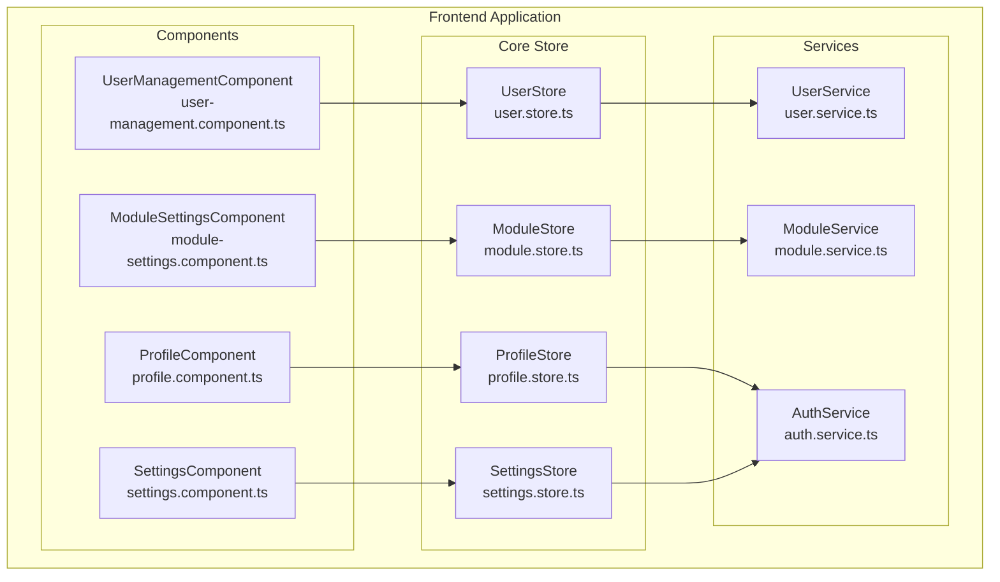
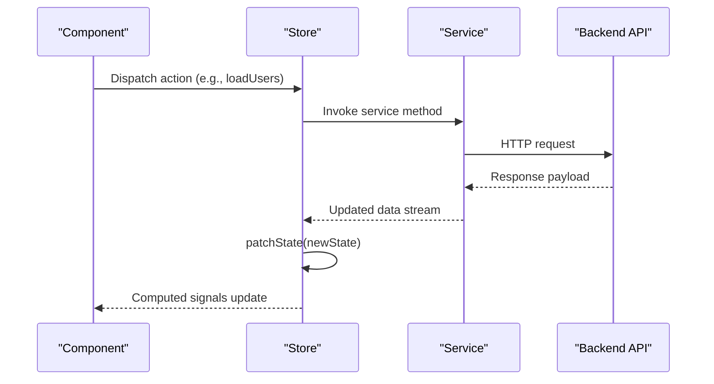
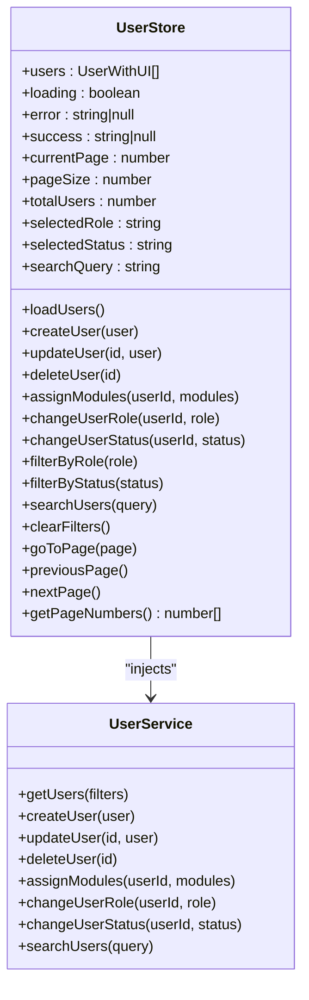
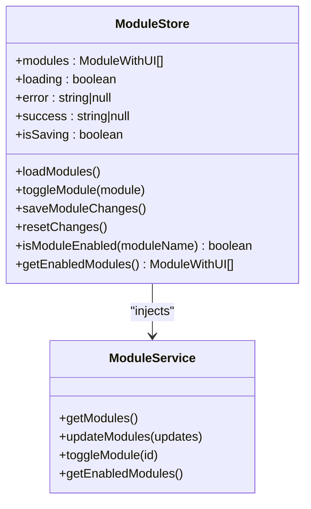
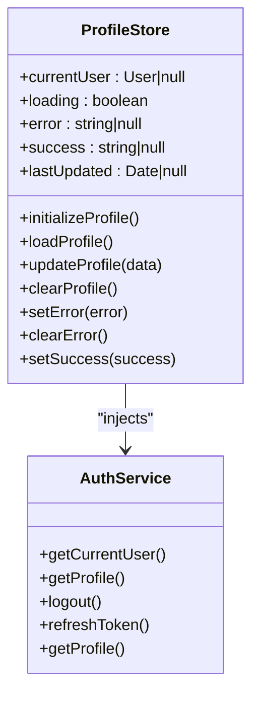
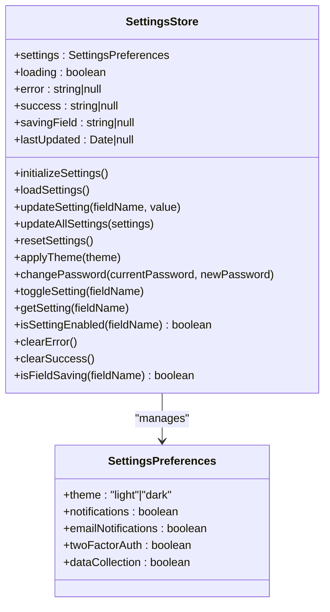
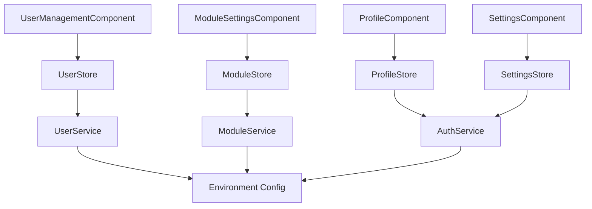

# Utility Stores

<cite>
**Referenced Files in This Document**
- [user.store.ts](file://frontend/src/app/core/store/user.store.ts)
- [module.store.ts](file://frontend/src/app/core/store/module.store.ts)
- [profile.store.ts](file://frontend/src/app/core/store/profile.store.ts)
- [settings.store.ts](file://frontend/src/app/core/store/settings.store.ts)
- [user.service.ts](file://frontend/src/app/core/services/user.service.ts)
- [module.service.ts](file://frontend/src/app/core/services/module.service.ts)
- [auth.service.ts](file://frontend/src/app/core/services/auth.service.ts)
- [user-management.component.ts](file://frontend/src/app/features/admin/user-management/user-management.component.ts)
- [module-settings.component.ts](file://frontend/src/app/features/admin/module-settings/module-settings.component.ts)
- [profile.component.ts](file://frontend/src/app/features/profile/profile.component.ts)
- [settings.component.ts](file://frontend/src/app/features/settings/settings.component.ts)
- [environment.ts](file://frontend/src/environments/environment.ts)
</cite>

## Table of Contents
1. [Introduction](#introduction)
2. [Project Structure](#project-structure)
3. [Core Components](#core-components)
4. [Architecture Overview](#architecture-overview)
5. [Detailed Component Analysis](#detailed-component-analysis)
6. [Dependency Analysis](#dependency-analysis)
7. [Performance Considerations](#performance-considerations)
8. [Troubleshooting Guide](#troubleshooting-guide)
9. [Conclusion](#conclusion)

## Introduction
This document provides comprehensive documentation for the utility stores that manage user management, module configuration, profile management, and application-wide settings. It explains the state management patterns using NgRx Signals, integration with respective services, validation patterns, and persistence strategies. The documentation covers reactive state updates for user actions, settings changes, and configuration updates, along with practical examples of user preference handling, module status management, profile synchronization, and settings synchronization across sessions.

## Project Structure
The utility stores are located under the Angular application's core store directory and integrate with service modules that handle HTTP communication and state management. Components consume these stores to render reactive UI and trigger asynchronous actions.

**Diagram sources**
- [user.store.ts](file://frontend/src/app/core/store/user.store.ts#L1-L329)
- [module.store.ts](file://frontend/src/app/core/store/module.store.ts#L1-L175)
- [profile.store.ts](file://frontend/src/app/core/store/profile.store.ts#L1-L189)
- [settings.store.ts](file://frontend/src/app/core/store/settings.store.ts#L1-L360)
- [user.service.ts](file://frontend/src/app/core/services/user.service.ts#L1-L189)
- [module.service.ts](file://frontend/src/app/core/services/module.service.ts#L1-L139)
- [auth.service.ts](file://frontend/src/app/core/services/auth.service.ts#L1-L161)
- [user-management.component.ts](file://frontend/src/app/features/admin/user-management/user-management.component.ts#L1-L288)
- [module-settings.component.ts](file://frontend/src/app/features/admin/module-settings/module-settings.component.ts#L1-L142)
- [profile.component.ts](file://frontend/src/app/features/profile/profile.component.ts#L1-L165)
- [settings.component.ts](file://frontend/src/app/features/settings/settings.component.ts#L1-L244)

**Section sources**
- [user.store.ts](file://frontend/src/app/core/store/user.store.ts#L1-L329)
- [module.store.ts](file://frontend/src/app/core/store/module.store.ts#L1-L175)
- [profile.store.ts](file://frontend/src/app/core/store/profile.store.ts#L1-L189)
- [settings.store.ts](file://frontend/src/app/core/store/settings.store.ts#L1-L360)

## Core Components
This section outlines the primary responsibilities and state structures for each store.

- UserStore
  - Manages user lists, pagination, filtering, and CRUD operations.
  - Tracks loading, error, and success states.
  - Provides computed signals for counts and UI flags.
  - Integrates with UserService for HTTP operations.

- ModuleStore
  - Manages system modules with enable/disable toggles.
  - Tracks unsaved changes and batch updates.
  - Computes derived metrics like active module counts.
  - Integrates with ModuleService for HTTP operations.

- ProfileStore
  - Manages current user profile data and UI states.
  - Synchronizes with AuthService for authentication state.
  - Persists profile updates to localStorage.
  - Exposes freshness checks for cached data.

- SettingsStore
  - Manages user preferences with validation and conditional logic.
  - Applies theme changes to DOM and persists to localStorage.
  - Handles dependent settings (e.g., email notifications require in-app notifications).
  - Supports granular field updates and bulk resets.

**Section sources**
- [user.store.ts](file://frontend/src/app/core/store/user.store.ts#L12-L36)
- [module.store.ts](file://frontend/src/app/core/store/module.store.ts#L12-L26)
- [profile.store.ts](file://frontend/src/app/core/store/profile.store.ts#L13-L27)
- [settings.store.ts](file://frontend/src/app/core/store/settings.store.ts#L15-L37)

## Architecture Overview
The stores follow a unidirectional data flow:
- Components dispatch actions to stores.
- Stores orchestrate asynchronous operations via injected services.
- Services perform HTTP requests and update internal subjects.
- Stores reactively update state and expose computed signals to components.

**Diagram sources**
- [user.store.ts](file://frontend/src/app/core/store/user.store.ts#L59-L89)
- [module.store.ts](file://frontend/src/app/core/store/module.store.ts#L52-L73)
- [profile.store.ts](file://frontend/src/app/core/store/profile.store.ts#L94-L111)
- [settings.store.ts](file://frontend/src/app/core/store/settings.store.ts#L122-L141)
- [user.service.ts](file://frontend/src/app/core/services/user.service.ts#L49-L65)
- [module.service.ts](file://frontend/src/app/core/services/module.service.ts#L40-L46)
- [auth.service.ts](file://frontend/src/app/core/services/auth.service.ts#L157-L159)

## Detailed Component Analysis

### User Management Store (UserStore)
UserStore encapsulates user-related state and actions, including pagination, filtering, and CRUD operations. It integrates with UserService to perform HTTP requests and maintains UI flags for optimistic updates.

Key patterns:
- State composition with withState and withComputed.
- Asynchronous actions using firstValueFrom for RxJS observables.
- Optimistic UI updates with isUpdating/isDeleting flags.
- Derived computations for counts and UI flags.

**Diagram sources**
- [user.store.ts](file://frontend/src/app/core/store/user.store.ts#L41-L327)
- [user.service.ts](file://frontend/src/app/core/services/user.service.ts#L36-L189)

Reactive state updates:
- Pagination triggers loadUsers with updated filters.
- CRUD actions optimistically update UI flags and revert on errors.
- Success messages auto-clear after 3 seconds.

Validation patterns:
- Form validation occurs in components; stores accept validated data.
- Error messages preserve original server messages.

Persistence strategies:
- No client-side persistence; state is cleared on navigation or refresh.

Examples:
- User preference handling: Filtering by role/status and search query updates pagination automatically.
- Module status management: assignModules updates user module assignments.
- Profile synchronization: Not applicable in UserStore; handled by ProfileStore.

**Section sources**
- [user.store.ts](file://frontend/src/app/core/store/user.store.ts#L57-L327)
- [user-management.component.ts](file://frontend/src/app/features/admin/user-management/user-management.component.ts#L50-L183)

### Module Configuration Store (ModuleStore)
ModuleStore manages system modules with enable/disable toggles and batch updates. It tracks unsaved changes and computes derived metrics for UI feedback.

Key patterns:
- State composition with ModuleWithUI wrapper for UI flags.
- Conditional change tracking via hasChanges and previousEnabled.
- Batch updates to backend with revert-on-error strategy.

**Diagram sources**
- [module.store.ts](file://frontend/src/app/core/store/module.store.ts#L31-L173)
- [module.service.ts](file://frontend/src/app/core/services/module.service.ts#L30-L139)

Reactive state updates:
- Individual toggles update hasChanges and previousEnabled.
- Batch save updates modules and clears hasChanges on success.
- Error handling reverts changes and displays error messages.

Validation patterns:
- No client-side validation; relies on backend responses.

Persistence strategies:
- No client-side persistence; state reflects backend on load.

Examples:
- Module status management: toggleModule enables/disables modules locally; saveModuleChanges persists to backend.
- Settings synchronization: Not applicable in ModuleStore; handled by SettingsStore.

**Section sources**
- [module.store.ts](file://frontend/src/app/core/store/module.store.ts#L46-L173)
- [module-settings.component.ts](file://frontend/src/app/features/admin/module-settings/module-settings.component.ts#L19-L106)

### Profile Management Store (ProfileStore)
ProfileStore manages the current user's profile data, integrating with AuthService for authentication state and persisting updates to localStorage.

Key patterns:
- State composition with currentUser and timestamps for freshness checks.
- Initialization from AuthService and localStorage.
- Optimistic updates with immediate localStorage writes.

**Diagram sources**
- [profile.store.ts](file://frontend/src/app/core/store/profile.store.ts#L32-L188)
- [auth.service.ts](file://frontend/src/app/core/services/auth.service.ts#L31-L161)

Reactive state updates:
- Profile initialization sets currentUser and lastUpdated.
- Profile updates immediately update store and localStorage.
- Success messages auto-clear after 3 seconds.

Validation patterns:
- Validation occurs in components; stores accept validated data.

Persistence strategies:
- Updates persisted to localStorage for offline availability.

Examples:
- Profile synchronization: updateProfile persists to localStorage and updates store.
- Settings synchronization: Not applicable in ProfileStore; handled by SettingsStore.

**Section sources**
- [profile.store.ts](file://frontend/src/app/core/store/profile.store.ts#L59-L188)
- [profile.component.ts](file://frontend/src/app/features/profile/profile.component.ts#L22-L107)

### Settings Store (SettingsStore)
SettingsStore manages user preferences with validation, conditional logic, and persistence to localStorage. It applies theme changes to the DOM and exposes derived signals for UI behavior.

Key patterns:
- SettingsPreferences interface defines supported preferences.
- Conditional logic ensures dependent settings remain valid (e.g., disabling in-app notifications also disables email notifications).
- Persistence to localStorage with automatic loading on initialization.

**Diagram sources**
- [settings.store.ts](file://frontend/src/app/core/store/settings.store.ts#L42-L358)
- [settings.store.ts](file://frontend/src/app/core/store/settings.store.ts#L7-L13)

Reactive state updates:
- Field-specific saving tracked via savingField.
- Theme changes applied to DOM and persisted to localStorage.
- Success messages auto-clear after 3 seconds.

Validation patterns:
- Dependent settings enforced during updates (e.g., disabling notifications also disables email notifications).
- Bulk validation performed in updateAllSettings.

Persistence strategies:
- Settings loaded from and saved to localStorage.
- Freshness checks compare lastUpdated with current time.

Examples:
- User preference handling: updateSetting updates individual preferences and persists to localStorage.
- Settings synchronization: initializeSettings loads saved preferences on app start.
- Module status management: Not applicable in SettingsStore; handled by ModuleStore.

**Section sources**
- [settings.store.ts](file://frontend/src/app/core/store/settings.store.ts#L85-L358)
- [settings.component.ts](file://frontend/src/app/features/settings/settings.component.ts#L25-L167)

## Dependency Analysis
Stores depend on service modules for HTTP operations and state management. Components depend on stores for reactive state and UI rendering.

**Diagram sources**
- [user-management.component.ts](file://frontend/src/app/features/admin/user-management/user-management.component.ts#L15-L53)
- [module-settings.component.ts](file://frontend/src/app/features/admin/module-settings/module-settings.component.ts#L14-L22)
- [profile.component.ts](file://frontend/src/app/features/profile/profile.component.ts#L13-L26)
- [settings.component.ts](file://frontend/src/app/features/settings/settings.component.ts#L13-L30)
- [user.store.ts](file://frontend/src/app/core/store/user.store.ts#L1-L6)
- [module.store.ts](file://frontend/src/app/core/store/module.store.ts#L1-L6)
- [profile.store.ts](file://frontend/src/app/core/store/profile.store.ts#L1-L6)
- [settings.store.ts](file://frontend/src/app/core/store/settings.store.ts#L1-L6)
- [environment.ts](file://frontend/src/environments/environment.ts#L1-L6)

**Section sources**
- [user.store.ts](file://frontend/src/app/core/store/user.store.ts#L1-L6)
- [module.store.ts](file://frontend/src/app/core/store/module.store.ts#L1-L6)
- [profile.store.ts](file://frontend/src/app/core/store/profile.store.ts#L1-L6)
- [settings.store.ts](file://frontend/src/app/core/store/settings.store.ts#L1-L6)
- [environment.ts](file://frontend/src/environments/environment.ts#L1-L6)

## Performance Considerations
- Reactive updates: Stores use computed signals to minimize unnecessary renders; components subscribe only to relevant signals.
- Optimistic UI: Stores update UI flags (isUpdating, isDeleting) to provide immediate feedback while maintaining eventual consistency with backend.
- Batch operations: ModuleStore batches multiple module updates to reduce network requests.
- Local storage caching: SettingsStore and ProfileStore cache data in localStorage to reduce initial load times and support offline scenarios.
- Pagination: UserStore paginates user lists to limit memory usage and improve responsiveness.

## Troubleshooting Guide
Common issues and resolutions:
- Loading states: Ensure loading flags are set before async operations and reset on completion or error.
- Error handling: Stores set error messages and log to console; components should display user-friendly messages.
- Success messages: Success flags auto-clear after 3 seconds; ensure components listen to computed signals.
- Conditional settings: When disabling in-app notifications, email notifications are automatically disabled; verify dependent logic in SettingsStore.
- Persistence: ProfileStore writes to localStorage on updates; verify localStorage availability and permissions.
- Network failures: Services return observable errors; stores catch and display meaningful messages.

**Section sources**
- [user.store.ts](file://frontend/src/app/core/store/user.store.ts#L82-L88)
- [module.store.ts](file://frontend/src/app/core/store/module.store.ts#L126-L144)
- [profile.store.ts](file://frontend/src/app/core/store/profile.store.ts#L145-L151)
- [settings.store.ts](file://frontend/src/app/core/store/settings.store.ts#L192-L198)

## Conclusion
The utility stores provide a robust, reactive foundation for managing user data, module configurations, profiles, and application settings. They integrate seamlessly with service modules, enforce validation and conditional logic, and persist state to localStorage for reliability. Components consume these stores through computed signals, enabling efficient, declarative UI updates and consistent user experiences across sessions.