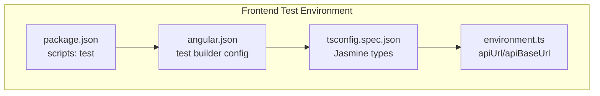
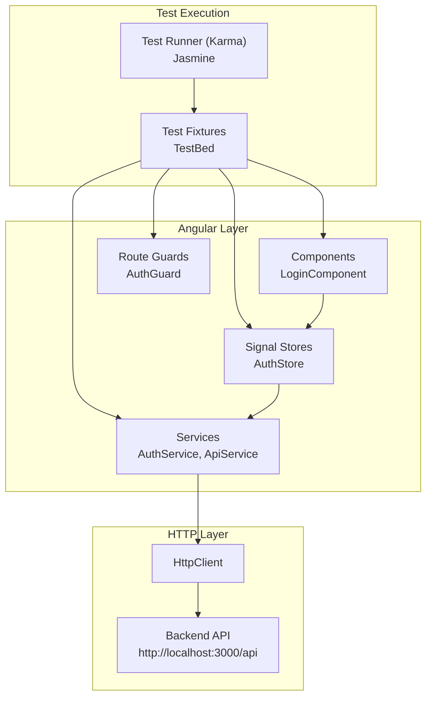
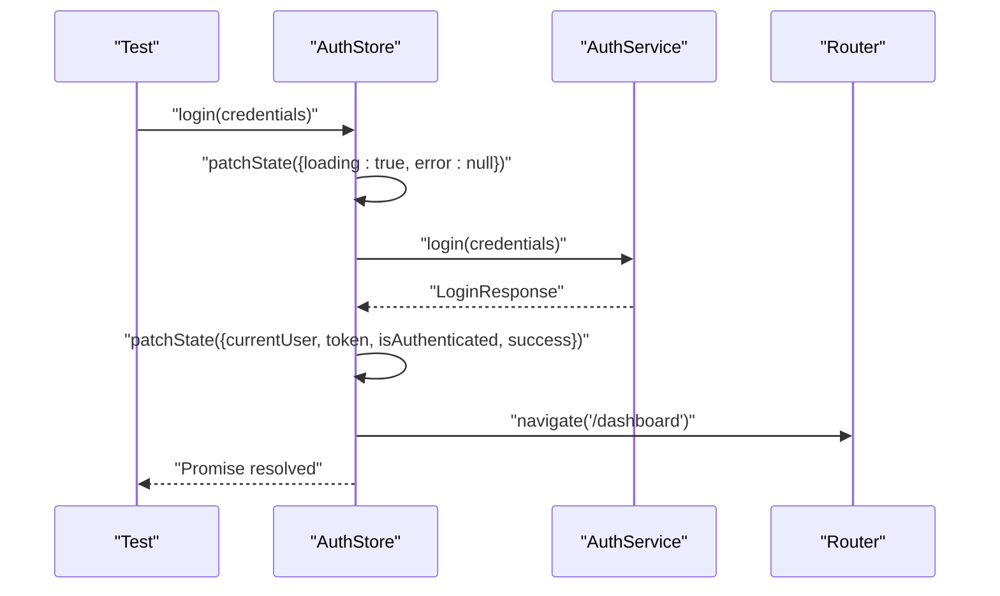
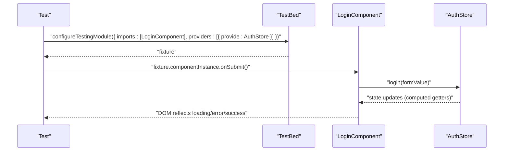
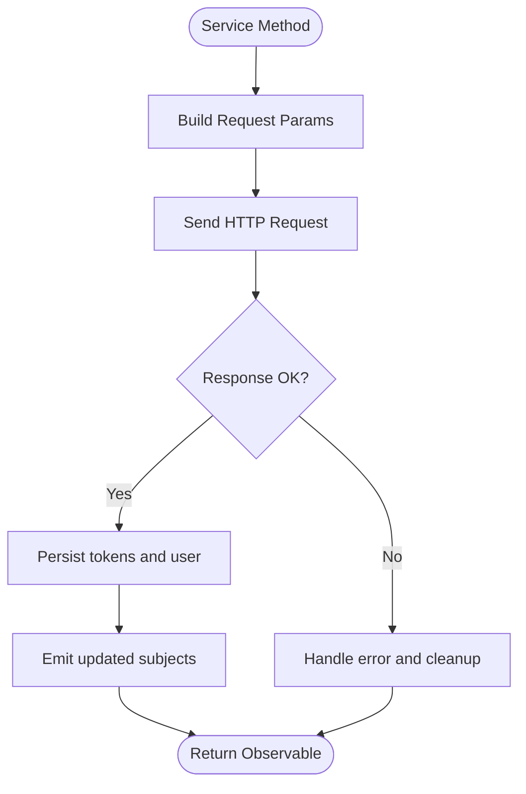
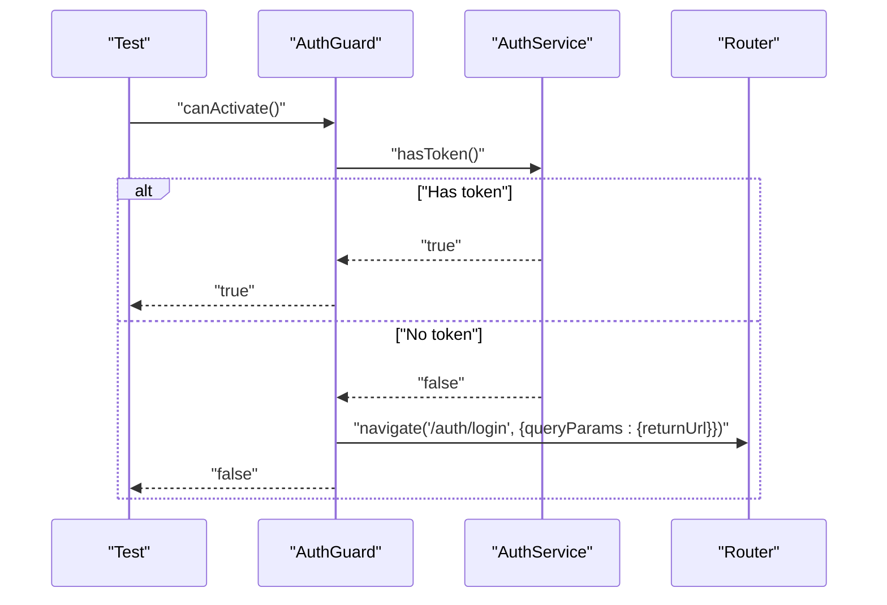
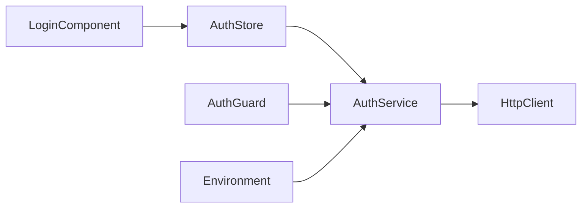

# Testing Strategy

<cite>
**Referenced Files in This Document**
- [package.json](file://frontend/package.json)
- [angular.json](file://frontend/angular.json)
- [tsconfig.spec.json](file://frontend/tsconfig.spec.json)
- [environment.ts](file://frontend/src/environments/environment.ts)
- [auth.store.ts](file://frontend/src/app/core/store/auth.store.ts)
- [auth.service.ts](file://frontend/src/app/core/services/auth.service.ts)
- [api.service.ts](file://frontend/src/app/core/services/api.service.ts)
- [login.component.ts](file://frontend/src/app/features/auth/login/login.component.ts)
- [auth.guard.ts](file://frontend/src/app/core/guards/auth.guard.ts)
- [app.component.spec.ts](file://frontend/src/app/app.component.spec.ts)
</cite>

## Table of Contents
1. [Introduction](#introduction)
2. [Project Structure](#project-structure)
3. [Core Components](#core-components)
4. [Architecture Overview](#architecture-overview)
5. [Detailed Component Analysis](#detailed-component-analysis)
6. [Dependency Analysis](#dependency-analysis)
7. [Performance Considerations](#performance-considerations)
8. [Troubleshooting Guide](#troubleshooting-guide)
9. [Conclusion](#conclusion)
10. [Appendices](#appendices)

## Introduction
This document defines a comprehensive testing strategy for the Multi-Application-Control-Dashboard frontend built with Angular and @ngrx/signals. It focuses on:
- Unit testing Angular components using signals and reactive forms
- Service testing strategies for HTTP integration and token/session management
- Store testing patterns for signal-based state management
- Integration testing approaches for component-to-service and component-to-store interactions
- Mock implementations, test data management, and continuous integration testing
- Practical examples for testing signal stores, component interactions, service dependencies, and API integration tests
- Best practices, coverage targets, and debugging techniques for test failures

## Project Structure
The frontend uses Angular’s CLI with Karma/Jasmine for unit testing. The test harness is configured via angular.json and tsconfig.spec.json. The environment configuration centralizes API endpoints for deterministic HTTP testing.

**Diagram sources**
- [package.json](file://frontend/package.json#L1-L43)
- [angular.json](file://frontend/angular.json#L78-L98)
- [tsconfig.spec.json](file://frontend/tsconfig.spec.json#L1-L16)
- [environment.ts](file://frontend/src/environments/environment.ts#L1-L6)

**Section sources**
- [package.json](file://frontend/package.json#L1-L43)
- [angular.json](file://frontend/angular.json#L78-L98)
- [tsconfig.spec.json](file://frontend/tsconfig.spec.json#L1-L16)
- [environment.ts](file://frontend/src/environments/environment.ts#L1-L6)

## Core Components
Key testing targets include:
- Signal stores for state management and derived computations
- Services for HTTP operations, token handling, and pagination
- Components that consume stores and services reactively
- Guards for route protection during tests

Representative components:
- AuthStore: signalStore managing authentication state and derived selectors
- AuthService: HTTP client wrapper with token/session persistence
- ApiService: generic HTTP wrapper for CRUD and pagination
- LoginComponent: form-driven component interacting with AuthStore
- AuthGuard: route guard using AuthService

**Section sources**
- [auth.store.ts](file://frontend/src/app/core/store/auth.store.ts#L1-L223)
- [auth.service.ts](file://frontend/src/app/core/services/auth.service.ts#L1-L161)
- [api.service.ts](file://frontend/src/app/core/services/api.service.ts#L1-L76)
- [login.component.ts](file://frontend/src/app/features/auth/login/login.component.ts#L1-L96)
- [auth.guard.ts](file://frontend/src/app/core/guards/auth.guard.ts#L1-L26)

## Architecture Overview
The testing architecture centers on isolating HTTP calls via service mocks, verifying store-derived state via computed getters, and validating component behavior through reactive bindings.

**Diagram sources**
- [login.component.ts](file://frontend/src/app/features/auth/login/login.component.ts#L1-L96)
- [auth.guard.ts](file://frontend/src/app/core/guards/auth.guard.ts#L1-L26)
- [auth.store.ts](file://frontend/src/app/core/store/auth.store.ts#L1-L223)
- [auth.service.ts](file://frontend/src/app/core/services/auth.service.ts#L1-L161)
- [api.service.ts](file://frontend/src/app/core/services/api.service.ts#L1-L76)
- [environment.ts](file://frontend/src/environments/environment.ts#L1-L6)

## Detailed Component Analysis

### Signal Store Testing Patterns
Objective: Verify state transitions, computed derivations, and method-side effects (e.g., navigation, localStorage updates).

Recommended approach:
- Instantiate the store under test
- Use spies for injected dependencies (e.g., AuthService, Router)
- Assert state patches via store snapshots or getters
- Validate side effects (router navigation, localStorage writes) via spies
- Test error handling paths and loading states

Example scenarios to cover:
- Successful login updates currentUser, token, isAuthenticated, clears error, triggers navigation
- Registration mirrors login behavior with distinct success messaging
- Token refresh updates accessToken, toggles isRefreshing, handles errors with auto-logout
- Profile load updates currentUser and persists to localStorage
- Role/module access checks return expected booleans

**Diagram sources**
- [auth.store.ts](file://frontend/src/app/core/store/auth.store.ts#L105-L128)
- [auth.service.ts](file://frontend/src/app/core/services/auth.service.ts#L60-L87)

**Section sources**
- [auth.store.ts](file://frontend/src/app/core/store/auth.store.ts#L1-L223)
- [auth.service.ts](file://frontend/src/app/core/services/auth.service.ts#L1-L161)

### Component Testing with Angular Testing Utilities
Objective: Validate component rendering, form validation, and integration with stores.

Recommended approach:
- Use standalone components with minimal imports
- Inject AuthStore via Angular’s inject() in tests
- Stub AuthService and Router if needed for navigation assertions
- Trigger form submission and assert store method invocations
- Verify DOM updates driven by store-derived getters (loading, error, success)

**Diagram sources**
- [login.component.ts](file://frontend/src/app/features/auth/login/login.component.ts#L71-L80)
- [auth.store.ts](file://frontend/src/app/core/store/auth.store.ts#L105-L128)

**Section sources**
- [login.component.ts](file://frontend/src/app/features/auth/login/login.component.ts#L1-L96)

### Service Testing Strategies
Objective: Isolate HTTP calls and validate token/session lifecycle.

Recommended approach:
- Mock HttpClient using HttpTestingController for precise request/response verification
- Test token presence, retrieval, and persistence across login/register/refresh/profile calls
- Validate BehaviorSubject emissions for currentUser and isAuthenticated streams
- Simulate network errors and handle fallbacks (logout on refresh failure)

**Diagram sources**
- [auth.service.ts](file://frontend/src/app/core/services/auth.service.ts#L60-L111)
- [auth.service.ts](file://frontend/src/app/core/services/auth.service.ts#L137-L152)

**Section sources**
- [auth.service.ts](file://frontend/src/app/core/services/auth.service.ts#L1-L161)
- [api.service.ts](file://frontend/src/app/core/services/api.service.ts#L1-L76)

### Integration Testing Approaches
Objective: Validate end-to-end flows across components, stores, and services.

Recommended approach:
- Use Angular testing utilities to mount feature routes with AuthGuard
- Spy on AuthService and AuthStore to simulate authenticated state
- Navigate to protected routes and assert guard redirection or access
- Combine component and service tests to verify full-stack behavior

**Diagram sources**
- [auth.guard.ts](file://frontend/src/app/core/guards/auth.guard.ts#L13-L24)
- [auth.service.ts](file://frontend/src/app/core/services/auth.service.ts#L116-L118)

**Section sources**
- [auth.guard.ts](file://frontend/src/app/core/guards/auth.guard.ts#L1-L26)
- [auth.service.ts](file://frontend/src/app/core/services/auth.service.ts#L1-L161)

## Dependency Analysis
Testing dependencies and coupling:
- Components depend on stores for state and services for HTTP
- Stores depend on services and Router for side effects
- Guards depend on services for authentication checks
- Tests should minimize cross-boundary coupling via targeted mocking

**Diagram sources**
- [login.component.ts](file://frontend/src/app/features/auth/login/login.component.ts#L1-L96)
- [auth.store.ts](file://frontend/src/app/core/store/auth.store.ts#L1-L223)
- [auth.service.ts](file://frontend/src/app/core/services/auth.service.ts#L1-L161)
- [environment.ts](file://frontend/src/environments/environment.ts#L1-L6)

**Section sources**
- [login.component.ts](file://frontend/src/app/features/auth/login/login.component.ts#L1-L96)
- [auth.store.ts](file://frontend/src/app/core/store/auth.store.ts#L1-L223)
- [auth.service.ts](file://frontend/src/app/core/services/auth.service.ts#L1-L161)
- [environment.ts](file://frontend/src/environments/environment.ts#L1-L6)

## Performance Considerations
- Prefer signal-based computed getters for efficient derived-state reads in tests
- Minimize real HTTP calls by mocking services; use Jasmine spies to assert calls
- Keep test fixtures small and focused; avoid unnecessary change detection cycles
- Use fakeAsync/tick sparingly; prefer asynchronous waits for observable completion

## Troubleshooting Guide
Common issues and resolutions:
- Missing zone.js/testing polyfills: Ensure angular.json test options include zone.js and zone.js/testing
- Jasmine type errors: Confirm tsconfig.spec.json includes "jasmine" in types
- HTTP test failures: Use HttpTestingController to flush requests; assert request URLs and bodies
- Navigation assertions: Spy on Router.navigate to verify route transitions
- Store state mismatches: Snapshot store state after async operations; assert via getters

Practical checks:
- Verify environment.apiUrl points to the test backend
- Confirm store methods resolve promises and update state
- Validate guards redirect appropriately when tokens are absent

**Section sources**
- [angular.json](file://frontend/angular.json#L81-L84)
- [tsconfig.spec.json](file://frontend/tsconfig.spec.json#L7-L9)
- [environment.ts](file://frontend/src/environments/environment.ts#L1-L6)

## Conclusion
This testing strategy leverages Angular’s modern APIs with @ngrx/signals to build reliable, maintainable tests. By focusing on isolated service mocks, reactive store assertions, and component-driven validations, teams can achieve high confidence across unit, integration, and end-to-end scenarios while keeping CI pipelines fast and deterministic.

## Appendices

### Continuous Integration Testing
- Run tests via npm script defined in package.json
- Configure Karma coverage reporter for coverage metrics
- Integrate with CI platforms to enforce coverage thresholds and block failing builds

**Section sources**
- [package.json](file://frontend/package.json#L9-L9)
- [angular.json](file://frontend/angular.json#L78-L98)

### Example Test Scenarios (by file reference)
- Component creation and rendering: [app.component.spec.ts](file://frontend/src/app/app.component.spec.ts#L1-L30)
- Login form submission and store invocation: [login.component.ts](file://frontend/src/app/features/auth/login/login.component.ts#L71-L80)
- Store login flow and navigation: [auth.store.ts](file://frontend/src/app/core/store/auth.store.ts#L105-L128)
- Service login and token persistence: [auth.service.ts](file://frontend/src/app/core/services/auth.service.ts#L60-L111)
- Guard redirection logic: [auth.guard.ts](file://frontend/src/app/core/guards/auth.guard.ts#L13-L24)