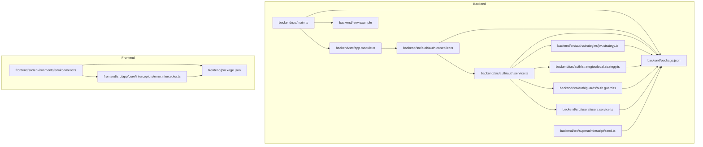
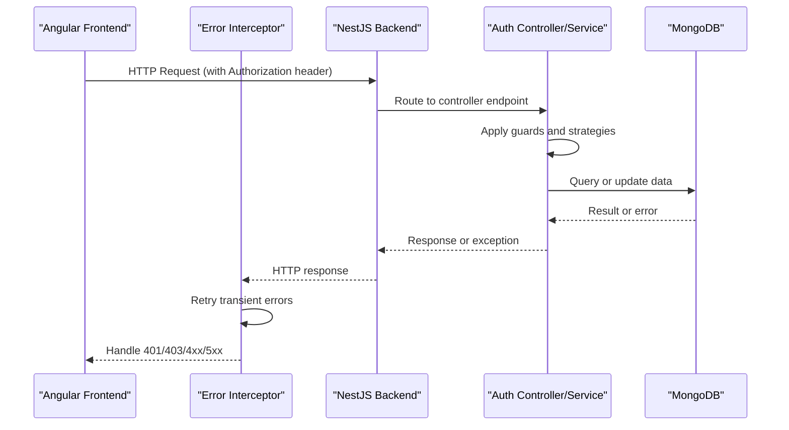
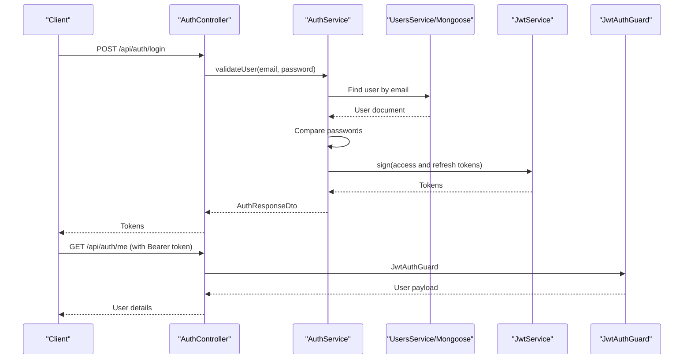
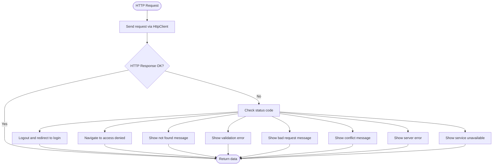
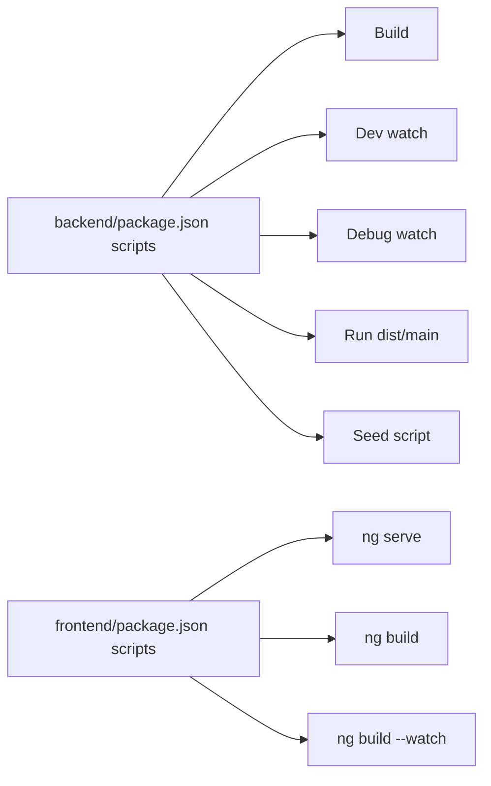

# Troubleshooting and FAQ

<cite>
**Referenced Files in This Document**
- [backend/src/main.ts](file://backend/src/main.ts)
- [backend/src/app.module.ts](file://backend/src/app.module.ts)
- [backend/.env.example](file://backend/.env.example)
- [backend/package.json](file://backend/package.json)
- [frontend/package.json](file://frontend/package.json)
- [frontend/src/environments/environment.ts](file://frontend/src/environments/environment.ts)
- [backend/src/auth/auth.controller.ts](file://backend/src/auth/auth.controller.ts)
- [backend/src/auth/auth.service.ts](file://backend/src/auth/auth.service.ts)
- [backend/src/auth/guards/auth.guard.ts](file://backend/src/auth/guards/auth.guard.ts)
- [backend/src/auth/strategies/jwt.strategy.ts](file://backend/src/auth/strategies/jwt.strategy.ts)
- [backend/src/auth/strategies/local.strategy.ts](file://backend/src/auth/strategies/local.strategy.ts)
- [frontend/src/app/core/interceptors/error.interceptor.ts](file://frontend/src/app/core/interceptors/error.interceptor.ts)
- [backend/src/users/users.service.ts](file://backend/src/users/users.service.ts)
- [backend/src/superadminscript/seed.ts](file://backend/src/superadminscript/seed.ts)
- [backend/COMPREHENSIVE_VALIDATION_REPORT.md](file://backend/COMPREHENSIVE_VALIDATION_REPORT.md)
</cite>

## Table of Contents
1. [Introduction](#introduction)
2. [Project Structure](#project-structure)
3. [Core Components](#core-components)
4. [Architecture Overview](#architecture-overview)
5. [Detailed Component Analysis](#detailed-component-analysis)
6. [Dependency Analysis](#dependency-analysis)
7. [Performance Considerations](#performance-considerations)
8. [Troubleshooting Guide](#troubleshooting-guide)
9. [FAQ](#faq)
10. [Conclusion](#conclusion)

## Introduction
This document provides a comprehensive troubleshooting and FAQ guide for the Multi-Application-Control-Dashboard. It focuses on diagnosing and resolving common development issues, database connection problems, authentication failures, build errors, and runtime exceptions. It also covers debugging techniques, log analysis, performance troubleshooting, and system monitoring approaches. The content is grounded in the repository’s source files and aims to be accessible to users with varying technical backgrounds.

## Project Structure
The project follows a monorepo-like structure with a NestJS backend and an Angular frontend. The backend initializes global CORS, validation pipes, and a global API prefix, while the frontend defines environment-specific API base URLs. The backend registers multiple feature modules and connects to MongoDB via Mongoose.

**Diagram sources**
- [backend/src/main.ts](file://backend/src/main.ts#L1-L54)
- [backend/src/app.module.ts](file://backend/src/app.module.ts#L1-L41)
- [backend/.env.example](file://backend/.env.example#L1-L20)
- [backend/package.json](file://backend/package.json#L1-L45)
- [frontend/package.json](file://frontend/package.json#L1-L43)
- [frontend/src/environments/environment.ts](file://frontend/src/environments/environment.ts#L1-L6)
- [backend/src/auth/auth.controller.ts](file://backend/src/auth/auth.controller.ts#L1-L58)
- [backend/src/auth/auth.service.ts](file://backend/src/auth/auth.service.ts#L1-L125)
- [backend/src/auth/strategies/jwt.strategy.ts](file://backend/src/auth/strategies/jwt.strategy.ts#L1-L25)
- [backend/src/auth/strategies/local.strategy.ts](file://backend/src/auth/strategies/local.strategy.ts#L1-L16)
- [backend/src/auth/guards/auth.guard.ts](file://backend/src/auth/guards/auth.guard.ts#L1-L26)
- [backend/src/users/users.service.ts](file://backend/src/users/users.service.ts#L1-L78)
- [backend/src/superadminscript/seed.ts](file://backend/src/superadminscript/seed.ts#L1-L98)

**Section sources**
- [backend/src/main.ts](file://backend/src/main.ts#L1-L54)
- [backend/src/app.module.ts](file://backend/src/app.module.ts#L1-L41)
- [backend/.env.example](file://backend/.env.example#L1-L20)
- [frontend/src/environments/environment.ts](file://frontend/src/environments/environment.ts#L1-L6)

## Core Components
- Backend initialization and configuration:
  - CORS policy, validation pipe, global prefix, and logging are configured at startup.
  - MongoDB connection is established via Mongoose using the environment variable for the URI.
- Authentication subsystem:
  - Local strategy validates credentials against the database.
  - JWT strategy extracts and verifies tokens.
  - Guards enforce protected routes.
  - Controller endpoints support registration, login, profile retrieval, token refresh, and logout.
- Frontend error handling:
  - An HTTP interceptor centralizes error handling, retries transient failures, and routes users on authentication errors.
- Database seeding:
  - A script creates demo users with predefined roles and credentials.

**Section sources**
- [backend/src/main.ts](file://backend/src/main.ts#L5-L51)
- [backend/src/app.module.ts](file://backend/src/app.module.ts#L17-L36)
- [backend/src/auth/auth.controller.ts](file://backend/src/auth/auth.controller.ts#L15-L57)
- [backend/src/auth/auth.service.ts](file://backend/src/auth/auth.service.ts#L10-L124)
- [backend/src/auth/strategies/jwt.strategy.ts](file://backend/src/auth/strategies/jwt.strategy.ts#L6-L24)
- [backend/src/auth/strategies/local.strategy.ts](file://backend/src/auth/strategies/local.strategy.ts#L6-L15)
- [backend/src/auth/guards/auth.guard.ts](file://backend/src/auth/guards/auth.guard.ts#L6-L25)
- [frontend/src/app/core/interceptors/error.interceptor.ts](file://frontend/src/app/core/interceptors/error.interceptor.ts#L10-L71)
- [backend/src/superadminscript/seed.ts](file://backend/src/superadminscript/seed.ts#L10-L93)

## Architecture Overview
The system uses a layered architecture:
- Frontend Angular app communicates with the backend via HTTP.
- Backend NestJS application exposes REST endpoints under a global prefix.
- Authentication relies on Passport strategies and JWT for secure access.
- MongoDB stores user and application data.

**Diagram sources**
- [frontend/src/app/core/interceptors/error.interceptor.ts](file://frontend/src/app/core/interceptors/error.interceptor.ts#L17-L25)
- [backend/src/auth/auth.controller.ts](file://backend/src/auth/auth.controller.ts#L15-L57)
- [backend/src/auth/auth.service.ts](file://backend/src/auth/auth.service.ts#L17-L30)
- [backend/src/auth/strategies/jwt.strategy.ts](file://backend/src/auth/strategies/jwt.strategy.ts#L8-L14)
- [backend/src/auth/strategies/local.strategy.ts](file://backend/src/auth/strategies/local.strategy.ts#L12-L14)

## Detailed Component Analysis

### Authentication Flow and Token Management
This sequence illustrates login, token generation, and protected route access.

**Diagram sources**
- [backend/src/auth/auth.controller.ts](file://backend/src/auth/auth.controller.ts#L25-L36)
- [backend/src/auth/auth.service.ts](file://backend/src/auth/auth.service.ts#L17-L94)
- [backend/src/auth/strategies/jwt.strategy.ts](file://backend/src/auth/strategies/jwt.strategy.ts#L16-L23)
- [backend/src/auth/guards/auth.guard.ts](file://backend/src/auth/guards/auth.guard.ts#L6-L11)
- [backend/src/users/users.service.ts](file://backend/src/users/users.service.ts#L25-L31)

**Section sources**
- [backend/src/auth/auth.controller.ts](file://backend/src/auth/auth.controller.ts#L15-L57)
- [backend/src/auth/auth.service.ts](file://backend/src/auth/auth.service.ts#L17-L124)
- [backend/src/auth/strategies/jwt.strategy.ts](file://backend/src/auth/strategies/jwt.strategy.ts#L6-L24)
- [backend/src/auth/strategies/local.strategy.ts](file://backend/src/auth/strategies/local.strategy.ts#L6-L15)
- [backend/src/auth/guards/auth.guard.ts](file://backend/src/auth/guards/auth.guard.ts#L6-L25)
- [backend/src/users/users.service.ts](file://backend/src/users/users.service.ts#L12-L31)

### Frontend Error Handling and User Experience
The error interceptor centralizes HTTP error handling, displays user-friendly messages, and performs navigation on authentication failures.

**Diagram sources**
- [frontend/src/app/core/interceptors/error.interceptor.ts](file://frontend/src/app/core/interceptors/error.interceptor.ts#L17-L71)

**Section sources**
- [frontend/src/app/core/interceptors/error.interceptor.ts](file://frontend/src/app/core/interceptors/error.interceptor.ts#L10-L153)

## Dependency Analysis
- Backend dependencies include NestJS core modules, Mongoose, Passport, JWT, and validation libraries. Scripts define build, dev, debug, prod, and seed commands.
- Frontend dependencies include Angular core packages, RxJS, TailwindCSS tooling, and TypeScript.

**Diagram sources**
- [backend/package.json](file://backend/package.json#L8-L16)
- [frontend/package.json](file://frontend/package.json#L4-L10)

**Section sources**
- [backend/package.json](file://backend/package.json#L8-L16)
- [frontend/package.json](file://frontend/package.json#L4-L10)

## Performance Considerations
- Logging at startup indicates environment and database connection details, aiding quick diagnostics.
- ValidationPipe enforces DTO validation globally, reducing downstream processing errors.
- Consider enabling connection pooling and tuning Mongoose options for production workloads.
- Monitor frontend network requests and error interceptor logs for latency and failure patterns.

**Section sources**
- [backend/src/main.ts](file://backend/src/main.ts#L46-L50)
- [backend/src/app.module.ts](file://backend/src/app.module.ts#L19-L23)

## Troubleshooting Guide

### 1) Database Connection Problems
Symptoms:
- Backend fails to start or throws connection errors.
- Startup logs do not show expected database info.

Common causes and fixes:
- Incorrect or unreachable MongoDB URI:
  - Verify the environment variable for the MongoDB URI.
  - Ensure the MongoDB instance is running and accessible from the host.
- Missing or misconfigured environment file:
  - Copy the example environment file and set the correct values.
- Mongoose driver compatibility:
  - Confirm Node.js and driver versions align with the project’s dependencies.

Preventive measures:
- Keep the environment file updated and never commit secrets.
- Use a local MongoDB instance or a managed service with proper firewall rules.

**Section sources**
- [backend/.env.example](file://backend/.env.example#L8-L10)
- [backend/src/app.module.ts](file://backend/src/app.module.ts#L23-L23)
- [backend/src/main.ts](file://backend/src/main.ts#L49-L49)

### 2) Authentication Failures
Symptoms:
- Login returns unauthorized or invalid credentials.
- Accessing protected routes yields 401/403.

Common causes and fixes:
- Invalid credentials:
  - Ensure email and password match a stored user.
  - Check that the local strategy is invoked for login.
- JWT verification issues:
  - Confirm the JWT secret matches the backend configuration.
  - Validate that the Authorization header is present and correctly formatted.
- Missing or expired refresh token:
  - Use the refresh endpoint with a valid refresh token.
- User not found or inactive:
  - Ensure the user exists and is active.

Preventive measures:
- Use the seeding script to provision initial users.
- Store sensitive keys securely and rotate them periodically.

**Section sources**
- [backend/src/auth/auth.controller.ts](file://backend/src/auth/auth.controller.ts#L25-L30)
- [backend/src/auth/auth.service.ts](file://backend/src/auth/auth.service.ts#L17-L30)
- [backend/src/auth/auth.service.ts](file://backend/src/auth/auth.service.ts#L96-L111)
- [backend/src/auth/strategies/jwt.strategy.ts](file://backend/src/auth/strategies/jwt.strategy.ts#L8-L14)
- [backend/src/superadminscript/seed.ts](file://backend/src/superadminscript/seed.ts#L17-L37)

### 3) Build Errors
Symptoms:
- Build fails with TypeScript or dependency errors.
- Scripts not recognized.

Common causes and fixes:
- Missing dependencies:
  - Run install commands for both backend and frontend.
- TypeScript configuration mismatches:
  - Align compiler options and target versions with project files.
- Script execution issues:
  - Use the scripts defined in package.json for building and running.

Preventive measures:
- Keep dependencies updated and compatible.
- Use the provided scripts consistently.

**Section sources**
- [backend/package.json](file://backend/package.json#L8-L16)
- [frontend/package.json](file://frontend/package.json#L4-L10)

### 4) Runtime Exceptions and CORS Issues
Symptoms:
- Requests blocked by CORS.
- Unexpected 5xx errors.

Common causes and fixes:
- CORS origin mismatch:
  - Adjust allowed origins in the backend startup configuration.
  - Ensure frontend and backend ports match the allowed list.
- Validation errors:
  - DTO validation failures return 400/422; review request payloads.
- Service unavailability:
  - 502/503/504 indicate upstream or infrastructure issues; retry after checks.

Preventive measures:
- Configure CORS per environment.
- Centralize error handling on the frontend.

**Section sources**
- [backend/src/main.ts](file://backend/src/main.ts#L9-L31)
- [frontend/src/app/core/interceptors/error.interceptor.ts](file://frontend/src/app/core/interceptors/error.interceptor.ts#L138-L143)

### 5) Frontend API Base URL Misconfiguration
Symptoms:
- API calls fail or hit wrong host/port.
- Angular dev server cannot proxy requests.

Common causes and fixes:
- Incorrect apiUrl or apiBaseUrl:
  - Update the environment file to reflect the backend address.
- Port conflicts:
  - Ensure the frontend runs on a port different from the backend.

Preventive measures:
- Keep environment files separate from source control.
- Use environment-specific overrides for CI/CD.

**Section sources**
- [frontend/src/environments/environment.ts](file://frontend/src/environments/environment.ts#L1-L5)

### 6) Seeding and Initial Setup
Symptoms:
- No users exist or demo credentials missing.

Common causes and fixes:
- Seeding not executed:
  - Run the seed script to create Super Admin, Admin, and Viewer accounts.
- Conflicting data:
  - The script checks for existing users before creating new ones.

Preventive measures:
- Run the seed script after setting up the database.
- Review the generated credentials printed by the script.

**Section sources**
- [backend/src/superadminscript/seed.ts](file://backend/src/superadminscript/seed.ts#L10-L93)

### 7) Log Analysis and Monitoring
What to monitor:
- Backend startup logs for environment and database indicators.
- Frontend error interceptor logs for client-side error classification.
- Network tab in browser devtools for request/response details.

Where to look:
- Backend console logs at startup and during operations.
- Frontend toast notifications and console warnings/errors.

**Section sources**
- [backend/src/main.ts](file://backend/src/main.ts#L46-L50)
- [frontend/src/app/core/interceptors/error.interceptor.ts](file://frontend/src/app/core/interceptors/error.interceptor.ts#L76-L152)

## FAQ

Q1: How do I connect the frontend to the backend?
- Set the API base URL in the frontend environment to match the backend address and port.

Q2: Why does my login fail?
- Ensure credentials match a user in the database. Check that the local strategy is active and the JWT secret is correct.

Q3: How do I seed the database with demo users?
- Run the seed script to create Super Admin, Admin, and Viewer users with predefined credentials.

Q4: How do I fix CORS errors?
- Add the frontend origin to the allowed list in the backend startup configuration.

Q5: How are DTO validations handled?
- A global validation pipe enforces DTO rules across the backend. Review the validation report for module coverage.

Q6: How do I run the project locally?
- Use backend scripts for development and frontend scripts for serving the Angular app.

Q7: What should I check if I see 401/403 errors?
- Verify the Authorization header, token validity, and user permissions. The error interceptor handles navigation and messaging.

Q8: How do I monitor performance?
- Observe startup logs, network requests, and error interceptor outputs. Consider adding structured logging and metrics in production.

**Section sources**
- [frontend/src/environments/environment.ts](file://frontend/src/environments/environment.ts#L1-L5)
- [backend/src/auth/auth.controller.ts](file://backend/src/auth/auth.controller.ts#L25-L30)
- [backend/src/superadminscript/seed.ts](file://backend/src/superadminscript/seed.ts#L17-L37)
- [backend/src/main.ts](file://backend/src/main.ts#L9-L31)
- [backend/COMPREHENSIVE_VALIDATION_REPORT.md](file://backend/COMPREHENSIVE_VALIDATION_REPORT.md#L234-L262)
- [backend/package.json](file://backend/package.json#L8-L16)
- [frontend/package.json](file://frontend/package.json#L4-L10)
- [frontend/src/app/core/interceptors/error.interceptor.ts](file://frontend/src/app/core/interceptors/error.interceptor.ts#L85-L99)

## Conclusion
This guide consolidates actionable steps to troubleshoot and maintain the Multi-Application-Control-Dashboard. By validating environment configuration, ensuring database connectivity, securing authentication, and leveraging centralized error handling, most issues can be resolved quickly. Use the provided references to locate relevant code and logs for deeper investigation.