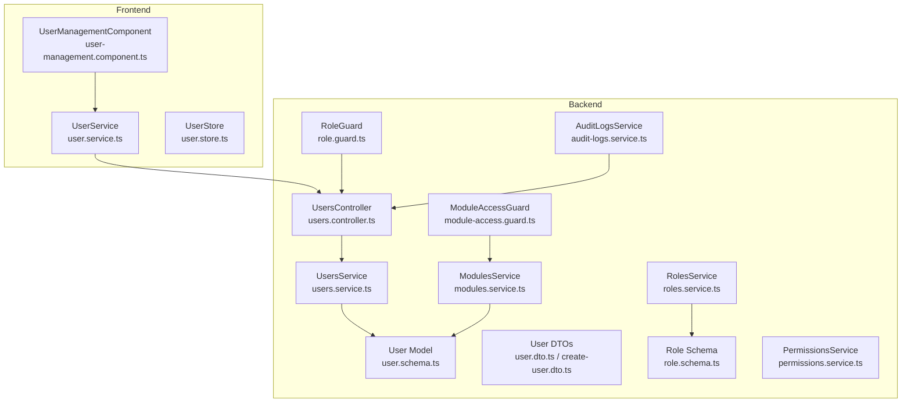
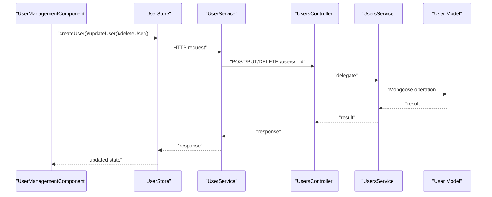
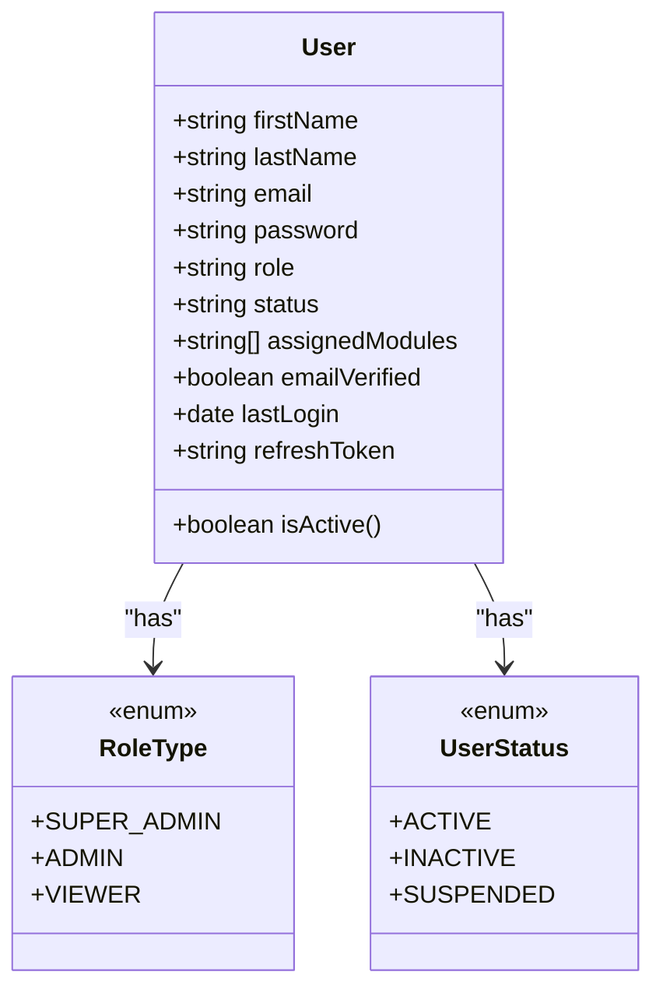
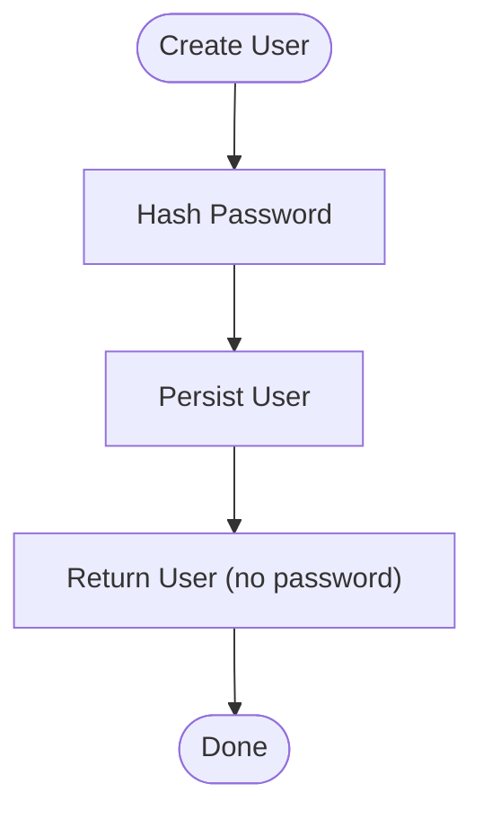
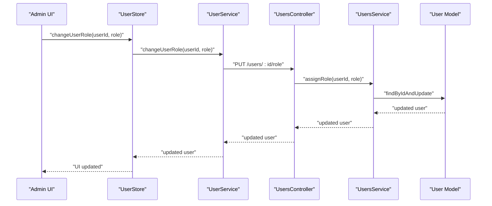
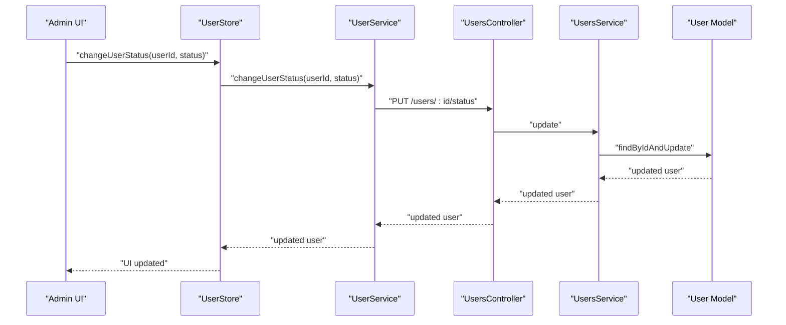
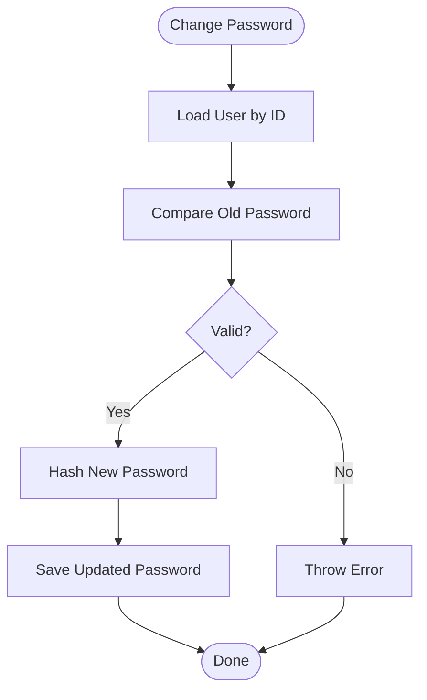
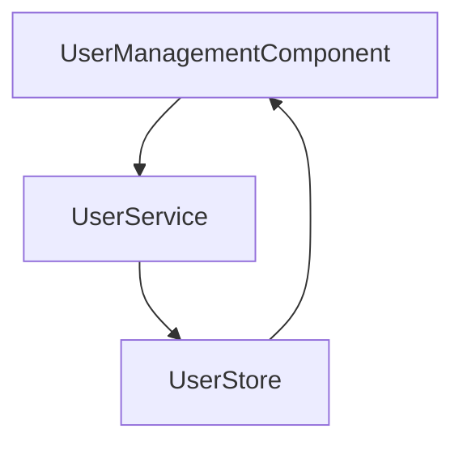
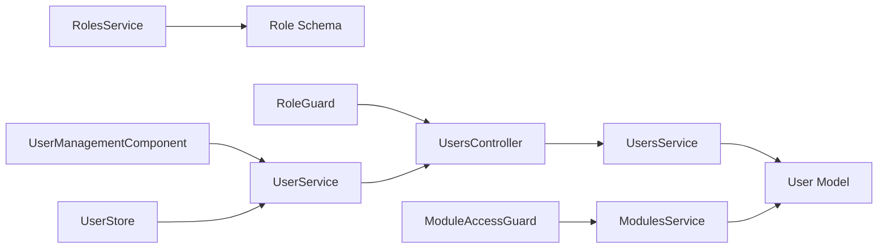

# User Management System

<cite>
**Referenced Files in This Document**
- [users.controller.ts](file://backend/src/users/users.controller.ts)
- [users.service.ts](file://backend/src/users/users.service.ts)
- [user.schema.ts](file://backend/src/users/schemas/user.schema.ts)
- [create-user.dto.ts](file://backend/src/users/dto/create-user.dto.ts)
- [user.dto.ts](file://backend/src/users/dto/user.dto.ts)
- [role.schema.ts](file://backend/src/roles/schemas/role.schema.ts)
- [roles.service.ts](file://backend/src/roles/roles.service.ts)
- [permissions.service.ts](file://backend/src/permissions/permissions.service.ts)
- [modules.service.ts](file://backend/src/modules/modules.service.ts)
- [module-access.guard.ts](file://backend/src/auth/guards/module-access.guard.ts)
- [role.guard.ts](file://backend/src/auth/guards/role.guard.ts)
- [audit-logs.service.ts](file://backend/src/audit-logs/audit-logs.service.ts)
- [user-management.component.ts](file://frontend/src/app/features/admin/user-management/user-management.component.ts)
- [user.store.ts](file://frontend/src/app/core/store/user.store.ts)
- [user.service.ts](file://frontend/src/app/core/services/user.service.ts)
</cite>

## Table of Contents
1. [Introduction](#introduction)
2. [Project Structure](#project-structure)
3. [Core Components](#core-components)
4. [Architecture Overview](#architecture-overview)
5. [Detailed Component Analysis](#detailed-component-analysis)
6. [Dependency Analysis](#dependency-analysis)
7. [Performance Considerations](#performance-considerations)
8. [Troubleshooting Guide](#troubleshooting-guide)
9. [Conclusion](#conclusion)
10. [Appendices](#appendices)

## Introduction
This document describes the User Management System within the Multi-Application-Control-Dashboard. It covers user CRUD operations, role assignment and management, user status control, and profile management. It also explains the user schema design, validation rules, and data relationships, along with the admin interface capabilities for user management, search and filtering, bulk operations, and user activity tracking. Practical examples illustrate user creation workflows, role modification processes, and user status management. Finally, it addresses user permissions, module access restrictions, and audit trails for user actions.

## Project Structure
The user management system spans the backend NestJS application and the frontend Angular application:
- Backend: Users module with controller, service, DTOs, and Mongoose schema; Roles and Permissions modules; Modules service for module access checks; Audit logs service; Guards for role and module access.
- Frontend: Admin user management component, user store (signals), and user service for HTTP communication.

**Diagram sources**
- [users.controller.ts](file://backend/src/users/users.controller.ts#L1-L52)
- [users.service.ts](file://backend/src/users/users.service.ts#L1-L78)
- [user.schema.ts](file://backend/src/users/schemas/user.schema.ts#L1-L66)
- [user.dto.ts](file://backend/src/users/dto/user.dto.ts#L1-L62)
- [create-user.dto.ts](file://backend/src/users/dto/create-user.dto.ts#L1-L57)
- [roles.service.ts](file://backend/src/roles/roles.service.ts#L1-L47)
- [role.schema.ts](file://backend/src/roles/schemas/role.schema.ts#L1-L25)
- [permissions.service.ts](file://backend/src/permissions/permissions.service.ts#L1-L35)
- [modules.service.ts](file://backend/src/modules/modules.service.ts#L1-L94)
- [module-access.guard.ts](file://backend/src/auth/guards/module-access.guard.ts#L1-L28)
- [role.guard.ts](file://backend/src/auth/guards/role.guard.ts#L1-L51)
- [audit-logs.service.ts](file://backend/src/audit-logs/audit-logs.service.ts#L1-L67)
- [user-management.component.ts](file://frontend/src/app/features/admin/user-management/user-management.component.ts#L1-L288)
- [user.service.ts](file://frontend/src/app/core/services/user.service.ts#L1-L189)
- [user.store.ts](file://frontend/src/app/core/store/user.store.ts#L1-L329)

**Section sources**
- [users.controller.ts](file://backend/src/users/users.controller.ts#L1-L52)
- [users.service.ts](file://backend/src/users/users.service.ts#L1-L78)
- [user.schema.ts](file://backend/src/users/schemas/user.schema.ts#L1-L66)
- [user.dto.ts](file://backend/src/users/dto/user.dto.ts#L1-L62)
- [create-user.dto.ts](file://backend/src/users/dto/create-user.dto.ts#L1-L57)
- [roles.service.ts](file://backend/src/roles/roles.service.ts#L1-L47)
- [role.schema.ts](file://backend/src/roles/schemas/role.schema.ts#L1-L25)
- [permissions.service.ts](file://backend/src/permissions/permissions.service.ts#L1-L35)
- [modules.service.ts](file://backend/src/modules/modules.service.ts#L1-L94)
- [module-access.guard.ts](file://backend/src/auth/guards/module-access.guard.ts#L1-L28)
- [role.guard.ts](file://backend/src/auth/guards/role.guard.ts#L1-L51)
- [audit-logs.service.ts](file://backend/src/audit-logs/audit-logs.service.ts#L1-L67)
- [user-management.component.ts](file://frontend/src/app/features/admin/user-management/user-management.component.ts#L1-L288)
- [user.service.ts](file://frontend/src/app/core/services/user.service.ts#L1-L189)
- [user.store.ts](file://frontend/src/app/core/store/user.store.ts#L1-L329)

## Core Components
- Users Controller: Exposes endpoints for user CRUD, role assignment, module assignment, and search.
- Users Service: Implements business logic for user operations, password hashing, role and module assignment, and search.
- User Schema: Defines the user entity, including enums for role and status, and virtual properties.
- DTOs: Validation contracts for user creation, updates, and related operations.
- Roles and Permissions: Services and schema for managing roles and permissions.
- Modules Service: Provides module access checks and statistics.
- Guards: RoleGuard and ModuleAccessGuard enforce authorization policies.
- Audit Logs Service: Centralized logging for user actions.
- Frontend: UserManagementComponent, UserService, and UserStore orchestrate UI interactions and state.

**Section sources**
- [users.controller.ts](file://backend/src/users/users.controller.ts#L1-L52)
- [users.service.ts](file://backend/src/users/users.service.ts#L1-L78)
- [user.schema.ts](file://backend/src/users/schemas/user.schema.ts#L1-L66)
- [user.dto.ts](file://backend/src/users/dto/user.dto.ts#L1-L62)
- [create-user.dto.ts](file://backend/src/users/dto/create-user.dto.ts#L1-L57)
- [roles.service.ts](file://backend/src/roles/roles.service.ts#L1-L47)
- [role.schema.ts](file://backend/src/roles/schemas/role.schema.ts#L1-L25)
- [permissions.service.ts](file://backend/src/permissions/permissions.service.ts#L1-L35)
- [modules.service.ts](file://backend/src/modules/modules.service.ts#L1-L94)
- [module-access.guard.ts](file://backend/src/auth/guards/module-access.guard.ts#L1-L28)
- [role.guard.ts](file://backend/src/auth/guards/role.guard.ts#L1-L51)
- [audit-logs.service.ts](file://backend/src/audit-logs/audit-logs.service.ts#L1-L67)
- [user-management.component.ts](file://frontend/src/app/features/admin/user-management/user-management.component.ts#L1-L288)
- [user.service.ts](file://frontend/src/app/core/services/user.service.ts#L1-L189)
- [user.store.ts](file://frontend/src/app/core/store/user.store.ts#L1-L329)

## Architecture Overview
The system follows a layered architecture:
- Frontend: Angular component manages UI state and delegates actions to the user store, which calls the user service to perform HTTP requests against the backend.
- Backend: NestJS controller receives requests, applies guards, and delegates to the users service. The users service interacts with the database via Mongoose models. Authorization is enforced by role and module access guards. Audit logs capture user actions.

**Diagram sources**
- [user-management.component.ts](file://frontend/src/app/features/admin/user-management/user-management.component.ts#L1-L288)
- [user.store.ts](file://frontend/src/app/core/store/user.store.ts#L1-L329)
- [user.service.ts](file://frontend/src/app/core/services/user.service.ts#L1-L189)
- [users.controller.ts](file://backend/src/users/users.controller.ts#L1-L52)
- [users.service.ts](file://backend/src/users/users.service.ts#L1-L78)
- [user.schema.ts](file://backend/src/users/schemas/user.schema.ts#L1-L66)

## Detailed Component Analysis

### User Schema Design and Validation
- Fields:
  - Identity: firstName, lastName, email (unique), username (from DTO).
  - Security: password (hashed), refreshToken (optional).
  - Access Control: role (enum RoleType), status (enum UserStatus), assignedModules (array of module IDs), emailVerified, lastLogin.
  - Metadata: timestamps.
- Enums:
  - RoleType: SUPER_ADMIN, ADMIN, VIEWER.
  - UserStatus: ACTIVE, INACTIVE, SUSPENDED.
- Virtuals:
  - isActive computed property based on status.
- Validation:
  - DTOs enforce field presence, length, email format, and enum constraints for role and status.

**Diagram sources**
- [user.schema.ts](file://backend/src/users/schemas/user.schema.ts#L1-L66)
- [role.schema.ts](file://backend/src/roles/schemas/role.schema.ts#L1-L25)

**Section sources**
- [user.schema.ts](file://backend/src/users/schemas/user.schema.ts#L1-L66)
- [create-user.dto.ts](file://backend/src/users/dto/create-user.dto.ts#L1-L57)
- [user.dto.ts](file://backend/src/users/dto/user.dto.ts#L1-L62)
- [role.schema.ts](file://backend/src/roles/schemas/role.schema.ts#L1-L25)

### User CRUD Operations
- Create: Hashes password before persisting. Returns saved user without password.
- Read: Retrieve all users (excluding passwords), by ID (excluding password), by email, and paginated search.
- Update: Partial updates supported; returns updated user without password.
- Delete: Removes user by ID.
- Search: Regex-based search across email, firstName, and lastName (case-insensitive).

**Diagram sources**
- [users.service.ts](file://backend/src/users/users.service.ts#L12-L19)

**Section sources**
- [users.controller.ts](file://backend/src/users/users.controller.ts#L12-L40)
- [users.service.ts](file://backend/src/users/users.service.ts#L12-L76)
- [user.dto.ts](file://backend/src/users/dto/user.dto.ts#L5-L51)

### Role Assignment and Management
- Role Assignment Endpoint: POST /users/:id/role updates user role.
- Role Management:
  - RolesService supports create, find, update, delete, assignPermissions, assignModules.
  - Role schema defines name, description, createdAt.
- Module Access Control:
  - ModulesService.checkModuleAccess evaluates user role and assigned modules against module availability.
  - ModuleAccessGuard enforces per-request module access.

**Diagram sources**
- [user-management.component.ts](file://frontend/src/app/features/admin/user-management/user-management.component.ts#L213-L230)
- [user.store.ts](file://frontend/src/app/core/store/user.store.ts#L213-L230)
- [user.service.ts](file://frontend/src/app/core/services/user.service.ts#L136-L145)
- [users.controller.ts](file://backend/src/users/users.controller.ts#L42-L45)
- [users.service.ts](file://backend/src/users/users.service.ts#L47-L51)

**Section sources**
- [users.controller.ts](file://backend/src/users/users.controller.ts#L42-L45)
- [users.service.ts](file://backend/src/users/users.service.ts#L47-L51)
- [roles.service.ts](file://backend/src/roles/roles.service.ts#L1-L47)
- [role.schema.ts](file://backend/src/roles/schemas/role.schema.ts#L1-L25)
- [modules.service.ts](file://backend/src/modules/modules.service.ts#L56-L93)
- [module-access.guard.ts](file://backend/src/auth/guards/module-access.guard.ts#L1-L28)

### User Status Control
- Status Update Endpoint: PUT /users/:id updates status.
- Status Enum: ACTIVE, INACTIVE, SUSPENDED.
- UI Integration: The admin component exposes status selection and applies updates via the store.

**Diagram sources**
- [user-management.component.ts](file://frontend/src/app/features/admin/user-management/user-management.component.ts#L232-L249)
- [user.store.ts](file://frontend/src/app/core/store/user.store.ts#L232-L249)
- [user.service.ts](file://frontend/src/app/core/services/user.service.ts#L150-L159)
- [users.controller.ts](file://backend/src/users/users.controller.ts#L32-L35)
- [users.service.ts](file://backend/src/users/users.service.ts#L33-L35)

**Section sources**
- [users.controller.ts](file://backend/src/users/users.controller.ts#L32-L35)
- [users.service.ts](file://backend/src/users/users.service.ts#L33-L35)
- [user.schema.ts](file://backend/src/users/schemas/user.schema.ts#L5-L9)

### Profile Management Functionality
- Profile updates: The update endpoint supports firstName, lastName, role, status, and assignedModules.
- Password change: The service includes a changePassword method that validates the old password and hashes the new password before saving.

**Diagram sources**
- [users.service.ts](file://backend/src/users/users.service.ts#L66-L76)

**Section sources**
- [users.controller.ts](file://backend/src/users/users.controller.ts#L32-L35)
- [users.service.ts](file://backend/src/users/users.service.ts#L33-L35)
- [users.service.ts](file://backend/src/users/users.service.ts#L66-L76)

### Admin Interface Capabilities
- User Management Component:
  - Form actions: create, edit, delete.
  - Module assignment modal with toggling of module names.
  - Search, role filter, status filter, pagination helpers.
  - UI badges for role and status.
- User Store:
  - Manages loading, success/error states, pagination, and counts.
  - Methods for CRUD and module assignment with optimistic UI updates.
- User Service:
  - HTTP client wrapper around backend endpoints.
  - Supports getUsers with filters, search, and role-specific queries.

**Diagram sources**
- [user-management.component.ts](file://frontend/src/app/features/admin/user-management/user-management.component.ts#L1-L288)
- [user.service.ts](file://frontend/src/app/core/services/user.service.ts#L1-L189)
- [user.store.ts](file://frontend/src/app/core/store/user.store.ts#L1-L329)

**Section sources**
- [user-management.component.ts](file://frontend/src/app/features/admin/user-management/user-management.component.ts#L1-L288)
- [user.store.ts](file://frontend/src/app/core/store/user.store.ts#L1-L329)
- [user.service.ts](file://frontend/src/app/core/services/user.service.ts#L1-L189)

### Search and Filtering
- Backend:
  - GET /users/search?q=:query performs regex search on email, firstName, lastName.
  - GET /users returns paginated users excluding passwords.
- Frontend:
  - UserStore.searchUsers dispatches search queries with pagination reset.
  - Filters by role and status are applied via UserStore.filterByRole and filterByStatus.

**Section sources**
- [users.controller.ts](file://backend/src/users/users.controller.ts#L22-L25)
- [users.service.ts](file://backend/src/users/users.service.ts#L53-L64)
- [user.store.ts](file://frontend/src/app/core/store/user.store.ts#L269-L273)
- [user.store.ts](file://frontend/src/app/core/store/user.store.ts#L254-L265)

### Bulk Operations
- Module assignment:
  - POST /users/:id/modules assigns an array of module IDs to a user.
  - Frontend supports multi-select module toggling and saves via UserStore.assignModules.
- Pagination and counts:
  - UserStore computes totals and page ranges for efficient UI rendering.

**Section sources**
- [users.controller.ts](file://backend/src/users/users.controller.ts#L47-L50)
- [users.service.ts](file://backend/src/users/users.service.ts#L41-L45)
- [user-management.component.ts](file://frontend/src/app/features/admin/user-management/user-management.component.ts#L118-L137)
- [user.store.ts](file://frontend/src/app/core/store/user.store.ts#L183-L211)

### User Activity Tracking and Audit Trail
- Audit Logs Service:
  - log(userId, action, module, resourceId?, resourceType?, changes?, ipAddress?, userAgent?)
  - logError(userId, action, module, errorMessage, ipAddress?, userAgent?)
  - Query helpers: findAll, findByUserId, findByModule, findByAction, getStats, getActivityByDate.
- Integration:
  - The users controller is protected by JWT guard, enabling audit logging of authenticated actions.

**Section sources**
- [audit-logs.service.ts](file://backend/src/audit-logs/audit-logs.service.ts#L10-L66)
- [users.controller.ts](file://backend/src/users/users.controller.ts#L8-L8)

## Dependency Analysis
- Controller depends on UsersService.
- UsersService depends on User model and bcrypt for password hashing.
- RolesService and ModulesService depend on their respective models.
- ModuleAccessGuard and RoleGuard enforce runtime authorization.
- Frontend components depend on UserStore and UserService.

**Diagram sources**
- [users.controller.ts](file://backend/src/users/users.controller.ts#L1-L52)
- [users.service.ts](file://backend/src/users/users.service.ts#L1-L78)
- [user.schema.ts](file://backend/src/users/schemas/user.schema.ts#L1-L66)
- [roles.service.ts](file://backend/src/roles/roles.service.ts#L1-L47)
- [role.schema.ts](file://backend/src/roles/schemas/role.schema.ts#L1-L25)
- [modules.service.ts](file://backend/src/modules/modules.service.ts#L1-L94)
- [module-access.guard.ts](file://backend/src/auth/guards/module-access.guard.ts#L1-L28)
- [role.guard.ts](file://backend/src/auth/guards/role.guard.ts#L1-L51)
- [user-management.component.ts](file://frontend/src/app/features/admin/user-management/user-management.component.ts#L1-L288)
- [user.service.ts](file://frontend/src/app/core/services/user.service.ts#L1-L189)
- [user.store.ts](file://frontend/src/app/core/store/user.store.ts#L1-L329)

**Section sources**
- [users.controller.ts](file://backend/src/users/users.controller.ts#L1-L52)
- [users.service.ts](file://backend/src/users/users.service.ts#L1-L78)
- [roles.service.ts](file://backend/src/roles/roles.service.ts#L1-L47)
- [modules.service.ts](file://backend/src/modules/modules.service.ts#L1-L94)
- [module-access.guard.ts](file://backend/src/auth/guards/module-access.guard.ts#L1-L28)
- [role.guard.ts](file://backend/src/auth/guards/role.guard.ts#L1-L51)
- [user-management.component.ts](file://frontend/src/app/features/admin/user-management/user-management.component.ts#L1-L288)
- [user.service.ts](file://frontend/src/app/core/services/user.service.ts#L1-L189)
- [user.store.ts](file://frontend/src/app/core/store/user.store.ts#L1-L329)

## Performance Considerations
- Password hashing uses a cost factor suitable for server environments; consider monitoring hash duration under load.
- Search uses regex queries; for large datasets, consider indexing email, firstName, and lastName.
- Pagination is handled in the frontend store; backend endpoints should support page and limit parameters for scalability.
- Virtuals in the user schema reduce payload size by excluding sensitive fields; ensure consistent use across responses.

[No sources needed since this section provides general guidance]

## Troubleshooting Guide
- Authentication failures:
  - Ensure JWT guard is applied to user endpoints.
  - Verify tokens and refresh tokens are managed properly.
- Authorization failures:
  - RoleGuard requires explicit role metadata; ensure routes are decorated with required roles.
  - ModuleAccessGuard denies access when module is not assigned; verify user’s assignedModules and role.
- Audit logging:
  - Use findByUserId, findByModule, and findByAction to investigate user actions.
  - Log errors with logError for failed operations.

**Section sources**
- [users.controller.ts](file://backend/src/users/users.controller.ts#L8-L8)
- [role.guard.ts](file://backend/src/auth/guards/role.guard.ts#L13-L25)
- [module-access.guard.ts](file://backend/src/auth/guards/module-access.guard.ts#L7-L26)
- [audit-logs.service.ts](file://backend/src/audit-logs/audit-logs.service.ts#L25-L52)

## Conclusion
The User Management System integrates robust backend services with a reactive frontend to provide comprehensive user lifecycle management. It enforces strong validation, secure password handling, flexible role and module access controls, and centralized audit logging. The admin interface offers intuitive CRUD, search, filtering, and bulk operations, ensuring efficient administration across modules.

[No sources needed since this section summarizes without analyzing specific files]

## Appendices

### API Endpoints Summary
- POST /users: Create user
- GET /users: List users (paginated)
- GET /users/search?q=:query: Search users
- GET /users/:id: Get user by ID
- PUT /users/:id: Update user
- DELETE /users/:id: Delete user
- POST /users/:id/role: Assign role
- POST /users/:id/modules: Assign modules

**Section sources**
- [users.controller.ts](file://backend/src/users/users.controller.ts#L12-L50)

### Practical Workflows

#### User Creation Workflow
- Frontend:
  - Open create form, fill required fields, submit via UserStore.createUser.
  - Store calls UserService.createUser and refreshes the list.
- Backend:
  - Controller delegates to UsersService.create.
  - Service hashes password and persists user.

**Section sources**
- [user-management.component.ts](file://frontend/src/app/features/admin/user-management/user-management.component.ts#L57-L97)
- [user.store.ts](file://frontend/src/app/core/store/user.store.ts#L102-L120)
- [user.service.ts](file://frontend/src/app/core/services/user.service.ts#L81-L88)
- [users.controller.ts](file://backend/src/users/users.controller.ts#L12-L15)
- [users.service.ts](file://backend/src/users/users.service.ts#L12-L19)

#### Role Modification Process
- Frontend:
  - Select role in UI, call UserStore.changeUserRole.
  - Store updates UI optimistically and handles errors.
- Backend:
  - Controller route PUT /users/:id/role invokes UsersService.assignRole.

**Section sources**
- [user-management.component.ts](file://frontend/src/app/features/admin/user-management/user-management.component.ts#L213-L230)
- [user.store.ts](file://frontend/src/app/core/store/user.store.ts#L213-L230)
- [users.controller.ts](file://backend/src/users/users.controller.ts#L42-L45)
- [users.service.ts](file://backend/src/users/users.service.ts#L47-L51)

#### User Status Management
- Frontend:
  - Choose status, call UserStore.changeUserStatus.
- Backend:
  - Controller route PUT /users/:id updates status via UsersService.update.

**Section sources**
- [user-management.component.ts](file://frontend/src/app/features/admin/user-management/user-management.component.ts#L232-L249)
- [user.store.ts](file://frontend/src/app/core/store/user.store.ts#L232-L249)
- [users.controller.ts](file://backend/src/users/users.controller.ts#L32-L35)
- [users.service.ts](file://backend/src/users/users.service.ts#L33-L35)

### Permissions and Module Access Restrictions
- Roles:
  - SUPER_ADMIN: Full access.
  - ADMIN: Access to enabled modules by default; can be restricted by assignedModules.
  - VIEWER: Limited access based on assignedModules and module enablement.
- Guards:
  - RoleGuard enforces role-based access.
  - ModuleAccessGuard enforces module-level access.

**Section sources**
- [role.schema.ts](file://backend/src/roles/schemas/role.schema.ts#L4-L8)
- [modules.service.ts](file://backend/src/modules/modules.service.ts#L56-L93)
- [module-access.guard.ts](file://backend/src/auth/guards/module-access.guard.ts#L15-L26)
- [role.guard.ts](file://backend/src/auth/guards/role.guard.ts#L13-L25)